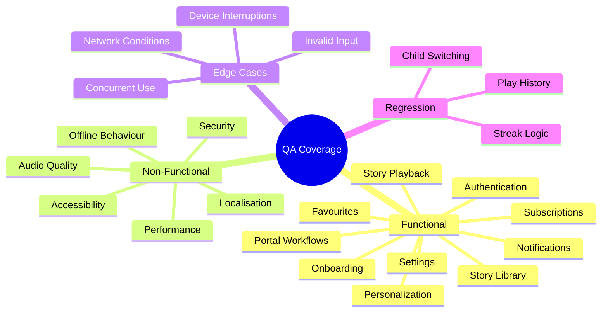

# QA Test Cases

---

## Test Scope Overview



---

## 1. Authentication

### TC-AUTH-001 — Phone OTP Login (Happy Path)
**Priority**: Critical  
**Type**: Functional  

| Step | Action | Expected Result |
|------|--------|----------------|
| 1 | Open app (first time) | Login screen displayed |
| 2 | Enter valid phone number with country code | OTP request sent |
| 3 | Receive SMS with 6-digit code | Code arrives within 30 s |
| 4 | Enter correct OTP | Verification succeeds |
| 5 | (New user) Onboarding shown | Step 1: child name entry |
| 5 | (Returning user) Home shown | Profile loaded, greeting visible |

---

### TC-AUTH-002 — Invalid OTP
**Priority**: High  

| Step | Action | Expected Result |
|------|--------|----------------|
| 1 | Complete phone entry step | OTP screen shown |
| 2 | Enter wrong 6-digit code | Error: "Invalid code" displayed |
| 3 | Clear and re-enter | Input cleared, user can try again |
| 4 | Enter correct code | Verification succeeds |

---

### TC-AUTH-003 — OTP Expired
**Priority**: High  

| Step | Action | Expected Result |
|------|--------|----------------|
| 1 | Request OTP | Code received |
| 2 | Wait > 5 minutes before entering | Error: "Code expired" |
| 3 | Tap "Resend OTP" | New code sent within 30 s |
| 4 | Enter new code | Verification succeeds |

---

### TC-AUTH-004 — Session Persistence
**Priority**: High  

| Step | Action | Expected Result |
|------|--------|----------------|
| 1 | Login successfully | Home screen shown |
| 2 | Force-close app | — |
| 3 | Reopen app | Home screen shown (no re-login) |

---

### TC-AUTH-005 — Logout
**Priority**: Medium  

| Step | Action | Expected Result |
|------|--------|----------------|
| 1 | Go to Parents tab | Settings visible |
| 2 | Tap "Logout" | Confirmation dialog appears |
| 3 | Confirm logout | Login screen shown; local session cleared |
| 4 | Reopen app | Login screen shown (session gone) |

---

### TC-AUTH-006 — Account Deletion
**Priority**: High  

| Step | Action | Expected Result |
|------|--------|----------------|
| 1 | Parents tab → Delete Account | Confirmation dialog |
| 2 | Confirm deletion | All Firestore data deleted |
| 3 | Firebase Auth account deleted | Login screen shown |
| 4 | Attempt login with same phone | New user flow starts |
| 5 | Verify: no previous data restored | No profiles or history visible |

---

## 2. Onboarding

### TC-ONB-001 — Complete 4-Step Onboarding
**Priority**: Critical  

| Step | Action | Expected Result |
|------|--------|----------------|
| 1 | Step 1: Enter child name "Aanya" | Name accepted, Next enabled |
| 2 | Step 2: Select age "6" | Age stored, Next enabled |
| 3 | Step 3: Select English + Hindi | Both selected, Next enabled |
| 4 | Step 4: Select "Bunny" as sidekick | Sidekick stored |
| 5 | Tap Finish | Profile saved to AsyncStorage & Firestore |
| 6 | Home screen shown | "Good evening, Aanya" greeting visible |

---

### TC-ONB-002 — Name Validation
**Priority**: High  

| Input | Expected Result |
|-------|----------------|
| Empty string | Next button disabled |
| "Aanya" (normal) | Accepted |
| "Aanya123" (digits) | Rejected or digits stripped |
| 31+ characters | Truncated to 30 |
| "O'Brien" (apostrophe) | Accepted |
| "Aanya-Priya" (hyphen) | Accepted |
| `<script>alert(1)</script>` | Sanitized/rejected |
| Hindi name in Unicode | Accepted |

---

### TC-ONB-003 — Skip Back Navigation
**Priority**: Medium  

| Step | Action | Expected Result |
|------|--------|----------------|
| 1 | Complete steps 1-2 | On step 3 |
| 2 | Tap Back | Returns to step 2, data preserved |
| 3 | Change age | Updated value saved |
| 4 | Proceed through to finish | Both updated values used |

---

### TC-ONB-004 — Second Child Profile
**Priority**: High  

| Step | Action | Expected Result |
|------|--------|----------------|
| 1 | Login with existing account (1 child) | Home for Child 1 |
| 2 | Add second child | Onboarding wizard shown again |
| 3 | Complete profile for Child 2 | 2 profiles exist |
| 4 | Switch via ChildSwitcherModal | Child 2 active; greeting updated |

---

### TC-ONB-005 — Maximum Children Limit
**Priority**: Medium  

| Step | Action | Expected Result |
|------|--------|----------------|
| 1 | Account with 4 children | All profiles visible |
| 2 | Tap "Add Child" | Message: "Maximum 4 children reached" |
| 3 | No 5th profile created | Limit enforced |

---

## 3. Story Library

### TC-LIB-001 — Library Loads
**Priority**: Critical  

| Step | Action | Expected Result |
|------|--------|----------------|
| 1 | Tap Library tab | Stories grid loads |
| 2 | All approved stories visible | Only `approved: true` shown |
| 3 | Premium stories tagged | Lock icon visible on premium cards |

---

### TC-LIB-002 — Age-Based Filtering
**Priority**: High  

| Step | Action | Expected Result |
|------|--------|----------------|
| 1 | Active child age = 5 (tier: 3-5) | Default filter: 3-5 stories |
| 2 | Change filter to 6-8 | Older stories shown |
| 3 | Stories count changes | Correct count for selected tier |

---

### TC-LIB-003 — Genre Filtering
**Priority**: High  

| Step | Action | Expected Result |
|------|--------|----------------|
| 1 | Tap "Animal Fables" chip | Only animal_fable stories shown |
| 2 | Tap "Mythology" chip | Only mythology stories shown |
| 3 | Clear filter | All genres shown |

---

### TC-LIB-004 — Language Filtering
**Priority**: High  

| Step | Action | Expected Result |
|------|--------|----------------|
| 1 | Tap "Hindi" filter | Only Hindi (`hi`) stories shown |
| 2 | Tap "English" filter | Only English (`en`) stories shown |
| 3 | Both selected | All language stories shown |

---

### TC-LIB-005 — Story Search
**Priority**: Medium  

| Step | Action | Expected Result |
|------|--------|----------------|
| 1 | Enter "elephant" in search | Stories with "elephant" in title/characters appear |
| 2 | Enter "xyz_nonexistent" | Empty state: "No stories found" |
| 3 | Clear search | Full library restored |

---

### TC-LIB-006 — 24-Hour Cache
**Priority**: Medium  

| Step | Action | Expected Result |
|------|--------|----------------|
| 1 | Open app with network | Library loads from Firestore |
| 2 | Disable network | — |
| 3 | Kill and reopen app | Library loads from cache (within 24 h) |
| 4 | Wait 24+ hours, open app | Cache expired; Firestore fetch attempted |
| 5 | If offline after cache expiry | Appropriate "offline" UI shown |

---

## 4. Story Playback

### TC-PLAY-001 — Basic Playback (Happy Path)
**Priority**: Critical  

| Step | Action | Expected Result |
|------|--------|----------------|
| 1 | Select any story | Story detail page |
| 2 | Tap Play | Play screen loads; loading indicator shows |
| 3 | Narration begins | Audio plays within 5 s |
| 4 | Child's name spoken in story | Name clips splice naturally |
| 5 | Progress bar updates | Moves in sync with audio |
| 6 | Story ends | Completion state shown; ambient fades |
| 7 | Play history updated | Story appears in "Recently Played" |

---

### TC-PLAY-002 — Pause & Resume
**Priority**: High  

| Step | Action | Expected Result |
|------|--------|----------------|
| 1 | Story playing at 40% | Audio playing |
| 2 | Tap Pause | Audio pauses; button changes to Play |
| 3 | Tap Play again | Resumes from exact position |
| 4 | Background app | Audio continues (background mode) |
| 5 | Return to app | Controls still in sync |

---

### TC-PLAY-003 — Phone Call Interruption
**Priority**: High  

| Step | Action | Expected Result |
|------|--------|----------------|
| 1 | Story playing | Audio active |
| 2 | Incoming phone call | Audio pauses automatically |
| 3 | Call ends | Audio resumes automatically |
| 4 | Check position | Resumed from correct position |

---

### TC-PLAY-004 — Length Selection
**Priority**: High  

| Step | Action | Expected Result |
|------|--------|----------------|
| 1 | Premium user, select "Long" | Full story plays |
| 2 | Free user, select "Medium" | PaywallSheet shown |
| 3 | Free user, select "Short" | Short story plays (free) |
| 4 | Free user, select "Long" | PaywallSheet shown |

---

### TC-PLAY-005 — Ambient Music
**Priority**: Medium  

| Step | Action | Expected Result |
|------|--------|----------------|
| 1 | Ambient effects ON | Background music plays softly |
| 2 | Ambient volume capped at 35% of narrator | Music not louder than narrator |
| 3 | Toggle ambient OFF | Music stops immediately |
| 4 | Bedtime story ends | 20-second fade begins |
| 5 | Anytime story ends | No fade; music stops |

---

### TC-PLAY-006 — Playback Rate by Age
**Priority**: Medium  

| Child Age | Expected Speed | Verification |
|-----------|---------------|-------------|
| 4 years | 0.85× | Audio noticeably slower |
| 7 years | 1.00× | Normal speed |
| 10 years | 1.10× | Slightly faster |

---

### TC-PLAY-007 — Resume From Recent Plays
**Priority**: High  

| Step | Action | Expected Result |
|------|--------|----------------|
| 1 | Play story, exit at 30% | RecentPlay saved |
| 2 | Open "Recently Played" rail | Story visible with progress indicator |
| 3 | Tap story | Resumes from 30% position |

---

### TC-PLAY-008 — Lock Screen Controls
**Priority**: Medium  

| Step | Action | Expected Result |
|------|--------|----------------|
| 1 | Story playing | Lock screen controls visible |
| 2 | Press hardware play/pause | Audio toggles correctly |
| 3 | Press hardware stop | Audio stops |

---

## 5. Personalization

### TC-PERS-001 — Child Name Splicing
**Priority**: Critical  

| Step | Action | Expected Result |
|------|--------|----------------|
| 1 | Child name: "Priya" | — |
| 2 | Play story with {NAME} markers | "Priya" spoken at each marker position |
| 3 | Name clip matches narrator tone | Same voice/emotion as narrator |
| 4 | Transition is seamless | No audible gap between body parts and name |

---

### TC-PERS-002 — Sidekick Substitution
**Priority**: High  

| Step | Action | Expected Result |
|------|--------|----------------|
| 1 | Child sidekick: "Tiger" | — |
| 2 | Play story with {SIDEKICK} placeholder | "Tiger" spoken in story |
| 3 | Play story from different genre | Genre-appropriate sidekick list validated |

---

### TC-PERS-003 — Invalid Characters in Name
**Priority**: High  

| Input Name | Expected Behavior |
|------------|------------------|
| `Riya<script>` | Script tag stripped; audio works |
| `Riya; rm -rf` | Sanitized; safe name passed to API |
| Very long name (50 chars) | Truncated to 30 chars |
| Emoji-only name | Filtered to text-only |

---

### TC-PERS-004 — Hindi Name Pronunciation
**Priority**: High  

| Step | Action | Expected Result |
|------|--------|----------------|
| 1 | Child name in Devanagari: "अनया" | — |
| 2 | Language set to Hindi | Story in Hindi |
| 3 | Name clip requested in Hindi | Devanagari name pronounced correctly |

---

## 6. Subscriptions

### TC-SUB-001 — Monthly Subscription Purchase
**Priority**: Critical  

| Step | Action | Expected Result |
|------|--------|----------------|
| 1 | Trigger paywall (try long story) | PaywallSheet shown |
| 2 | Tap "Monthly" | App Store / Play Store sheet shown |
| 3 | Complete purchase | Receipt validated by RevenueCat |
| 4 | isPremium becomes true | Paywall does not appear again |
| 5 | Long story plays | Story loads and plays |

---

### TC-SUB-002 — Yearly Subscription
**Priority**: High  
Same as TC-SUB-001 but select "Yearly" option. Verify yearly pricing shown.

---

### TC-SUB-003 — Restore Purchases
**Priority**: High  

| Step | Action | Expected Result |
|------|--------|----------------|
| 1 | Active subscriber reinstalls app | Seen as free tier initially |
| 2 | Parents tab → Restore Purchases | RevenueCat queries App Store |
| 3 | Active subscription found | isPremium restored |
| 4 | No further paywalls | Premium features accessible |

---

### TC-SUB-004 — Subscription Expiry
**Priority**: High  

| Step | Action | Expected Result |
|------|--------|----------------|
| 1 | Subscription expires | RevenueCat webhook sent |
| 2 | Backend updates Firestore | isPremium = false in store |
| 3 | User tries long story | Paywall shown again |
| 4 | Free tier limits applied | 1 new story/day, short only |

---

### TC-SUB-005 — Free Tier Daily Limit
**Priority**: High  

| Step | Action | Expected Result |
|------|--------|----------------|
| 1 | Free user plays 1 new story today | Allowed |
| 2 | Try a second new story today | PaywallSheet shown |
| 3 | Replay story heard before | Allowed (replays are free) |
| 4 | Next calendar day | Counter resets; new story allowed |

---

## 7. Notifications

### TC-NOTIF-001 — Bedtime Reminder Setup
**Priority**: High  

| Step | Action | Expected Result |
|------|--------|----------------|
| 1 | Parents tab → enable bedtime reminder | Time picker shown |
| 2 | Set time to 8:30 PM | Notification scheduled daily at 20:30 |
| 3 | Wait for 8:30 PM | Notification arrives |
| 4 | Tap notification | App opens to home screen |

---

### TC-NOTIF-002 — Quiet Hours Enforcement
**Priority**: High  

| Step | Action | Expected Result |
|------|--------|----------------|
| 1 | Set bedtime reminder to 10:30 PM | Time in quiet hours |
| 2 | Notification scheduled | Notification deferred to 08:01 AM next day |
| 3 | Verify: no notification at 10:30 PM | No notification |
| 4 | At 08:01 AM next day | Notification arrives |

---

### TC-NOTIF-003 — Streak at Risk
**Priority**: Medium  

| Step | Action | Expected Result |
|------|--------|----------------|
| 1 | Streak ≥ 3 days | Streak notification enabled |
| 2 | Bedtime set, no story played | — |
| 3 | 45 minutes after bedtime | Streak-at-risk notification shown |
| 4 | Parent taps notification | App opens |

---

### TC-NOTIF-004 — Disable All Notifications
**Priority**: Medium  

| Step | Action | Expected Result |
|------|--------|----------------|
| 1 | Parents tab → disable all notifications | Toggle set to OFF |
| 2 | Wait past bedtime time | No notification arrives |

---

## 8. Favourites

### TC-FAV-001 — Add to Favourites
**Priority**: Medium  

| Step | Action | Expected Result |
|------|--------|----------------|
| 1 | Open story detail page | Heart icon (empty) visible |
| 2 | Tap heart icon | Icon fills; story added to favourites |
| 3 | Navigate to Favourites tab | Story appears in list |

---

### TC-FAV-002 — Remove from Favourites
**Priority**: Medium  

| Step | Action | Expected Result |
|------|--------|----------------|
| 1 | Story in favourites | Filled heart visible |
| 2 | Tap heart icon again | Removed; icon empties |
| 3 | Favourites tab | Story no longer appears |

---

### TC-FAV-003 — Persistence Across Sessions
**Priority**: Medium  

| Step | Action | Expected Result |
|------|--------|----------------|
| 1 | Add 3 stories to favourites | All 3 in Favourites tab |
| 2 | Kill and reopen app | Same 3 stories still favourited |

---

## 9. Portal — Story Creation Workflow

### TC-PORT-001 — Create and Submit Story
**Priority**: High  

| Step | Action | Expected Result |
|------|--------|----------------|
| 1 | Creator logs in | Create page accessible |
| 2 | Write story with {HERO}, {NAME} placeholders | Placeholders visible in editor |
| 3 | Add [SHORT_END] marker at appropriate point | Marker saved in text |
| 4 | Set: genre=animal_fable, age_tier=6-8, language=en | Metadata saved |
| 5 | Submit for review | workflow_status = READY_FOR_REVIEW |
| 6 | Story not in mobile app | approved=false; not visible in app |

---

### TC-PORT-002 — Reviewer Approves Story
**Priority**: High  

| Step | Action | Expected Result |
|------|--------|----------------|
| 1 | Reviewer opens review queue | Story in queue |
| 2 | Read story, listen to preview | Audio preview plays |
| 3 | Tap Approve | approved=true; workflow_status=APPROVED |
| 4 | Mobile app (within 24 h cache refresh) | Story appears in library |

---

### TC-PORT-003 — Reviewer Requests Changes
**Priority**: Medium  

| Step | Action | Expected Result |
|------|--------|----------------|
| 1 | Reviewer opens story | — |
| 2 | Tap "Request Changes" + note | workflow_status=DRAFT; note saved |
| 3 | Creator opens story | Draft status + note visible |
| 4 | Creator edits and resubmits | workflow_status=READY_FOR_REVIEW |

---

### TC-PORT-004 — Admin Cannot Be Set by Non-Admin
**Priority**: Critical (Security)  

| Step | Action | Expected Result |
|------|--------|----------------|
| 1 | Creator attempts to set own `role: admin` via API | Firestore rule denies write |
| 2 | Role field unchanged | Creator cannot escalate privileges |

---

## 10. Non-Functional Test Cases

### TC-PERF-001 — Story Load Time
**Priority**: High  

| Metric | Target | Measurement |
|--------|--------|-------------|
| Narration API response time | < 5 s (cache hit) / < 15 s (cache miss) | End-to-end from tap to first audio |
| Library load time | < 2 s (cached) | Time from tab tap to grid visible |
| App cold start | < 3 s | Splash to usable home screen |

---

### TC-PERF-002 — Audio Continuity
**Priority**: High  

| Metric | Target |
|--------|--------|
| Gap between segments (intro → body[0]) | < 200 ms |
| Gap between body part and name clip | < 100 ms |
| Ambient music loop gap | Inaudible (< 50 ms) |

---

### TC-SEC-001 — API Authentication
**Priority**: Critical  

| Test | Expected Result |
|------|----------------|
| Call `/narrate` without auth token | 401 Unauthorized |
| Call `/narrate` with tampered token | 401 Unauthorized |
| Call `/narrate` with expired token | 401 Unauthorized |
| Call `/narrate` with valid token, correct UID | 200 OK |

---

### TC-SEC-002 — Rate Limiting
**Priority**: High  

| Test | Expected Result |
|------|----------------|
| 21+ requests from same IP in 60 s | 429 Too Many Requests |
| 21+ narrations from same user in 24 h | 429 Daily limit exceeded |
| Different user, same IP | Each user has separate daily counter |

---

### TC-SEC-003 — Input Sanitization
**Priority**: Critical  

| Input | Expected Result |
|-------|----------------|
| `child_name: "'; DROP TABLE stories;--"` | Sanitized; no SQL injection |
| `child_name: "<script>alert('xss')</script>"` | HTML-encoded or rejected |
| `story_text` > maximum allowed length | Rejected with 400 |

---

### TC-ACC-001 — Minimum Font Size
**Priority**: Medium  

| Test | Expected Result |
|------|----------------|
| Enable OS "Large Text" accessibility setting | App text scales appropriately |
| All text legible at 1.5× scale | No overflow or truncation |

---

### TC-ACC-002 — Screen Reader
**Priority**: Medium  

| Test | Expected Result |
|------|----------------|
| VoiceOver (iOS) / TalkBack (Android) enabled | All buttons have accessibility labels |
| Play button | Announced as "Play story" |
| Progress bar | Current position announced |

---

### TC-L10N-001 — Hindi Language Mode
**Priority**: High  

| Test | Expected Result |
|------|----------------|
| Switch language to Hindi in Parents tab | All UI strings in Hindi |
| Devanagari font loads | Noto Sans Devanagari renders correctly |
| Hindi story plays | TTS in Hindi voice |
| Hindi child name in Devanagari | Name clip in Hindi |

---

### TC-OFFLINE-001 — Offline Story Browse
**Priority**: Medium  

| Step | Action | Expected Result |
|------|--------|----------------|
| 1 | Open app with network, load library | Stories cached |
| 2 | Disable network | — |
| 3 | Browse library | Cached stories visible |
| 4 | Try to play story | Error: "Narration requires internet" |
| 5 | Re-enable network | Normal playback resumes |

---

### TC-AUDIO-001 — Volume Safety (Child Protection)
**Priority**: High  

| Test | Expected Result |
|------|----------------|
| Ambient volume set to 100% by parent | Capped internally at 35% of narrator level |
| Narrator volume at max, ambient at max setting | Ambient never exceeds narrator in perceived loudness |

---

## 11. Edge Cases

| ID | Scenario | Expected Result |
|----|---------|----------------|
| TC-EDGE-001 | Story text has no {NAME} markers | Plays without name clip; markerCount=0 |
| TC-EDGE-002 | Child name is a single character ("A") | Name clip for "A" generated and played |
| TC-EDGE-003 | Story text is very short (< 50 words) | No [SHORT_END] needed; full text used |
| TC-EDGE-004 | Sarvam AI returns error mid-narration | Fallback to ElevenLabs for remaining parts |
| TC-EDGE-005 | S3 pre-signed URL expires during playback | Transparent to user (URL valid 60 min; typical story < 15 min) |
| TC-EDGE-006 | Two children with same name | Both profiles created; separate analytics |
| TC-EDGE-007 | Parent changes language mid-story | Story continues in original language; new stories use new language |
| TC-EDGE-008 | App receives push notification while playing | In-app banner shows; audio continues uninterrupted |
| TC-EDGE-009 | RevenueCat webhook delayed by > 5 min | User stays free until webhook processed; no false premium |
| TC-EDGE-010 | Story added to Firebase then removed before cache refresh | Stale cache shows removed story for up to 24 h |
| TC-EDGE-011 | User with 0-day streak taps "streak at risk" notification | Notification not sent (streak < 3 threshold) |
| TC-EDGE-012 | Duplicate child profile from offline onboarding | Deduplication logic prevents duplicate Firestore entry |
| TC-EDGE-013 | App background during ambient fade | Fade continues in background (audio background mode) |
| TC-EDGE-014 | Very fast internet: audio buffered instantly | No gap visible in loading indicator |
| TC-EDGE-015 | Very slow internet: audio takes > 30 s | Timeout shown after 30 s with retry option |

---

## 12. Regression Checklist (After Each Release)

```
□ TC-AUTH-001  OTP login works end-to-end
□ TC-AUTH-004  Session persists across app restarts
□ TC-ONB-001   Full 4-step onboarding completes
□ TC-PLAY-001  Story plays with name splicing
□ TC-PLAY-002  Pause / resume at exact position
□ TC-PLAY-003  Phone call auto-pauses then resumes
□ TC-LIB-001   Library loads only approved stories
□ TC-LIB-006   Offline cache serves stories
□ TC-PERS-001  Child name spoken correctly in story
□ TC-SUB-001   Monthly purchase flow works
□ TC-SUB-003   Restore purchases works
□ TC-NOTIF-001 Bedtime reminder fires at correct time
□ TC-FAV-003   Favourites persist across restarts
□ TC-SEC-001   Unauthenticated API calls rejected
□ TC-SEC-002   Rate limiting enforced
□ TC-AUDIO-001 Ambient volume never exceeds narrator
□ TC-L10N-001  Hindi mode fully functional
```
