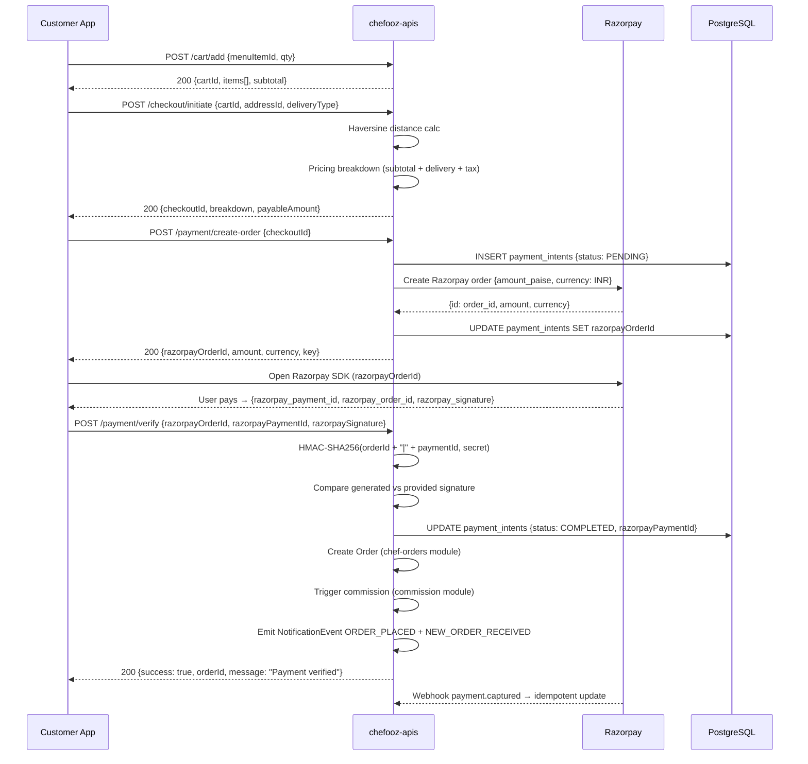

# Payment Flow — Complete Integration Guide

**Version:** 1.0  
**Last Updated:** February 2026  
**Scope:** End-to-end payment pipeline across Cart → Checkout → Payment → Order → Commission  
**Business Rule Summary:** All customer payments flow through Razorpay. Signature verification is mandatory before order creation. Commission is automatically deducted and credited to the chef's ledger. Refunds are always processed back to the original payment method within 3–7 days.  
**Rate Limits:** Payment create-order: 10 req/s. Verify: 5 req/s. Webhook: 50 req/s (Razorpay).  
**Key Constraints:** Order is never created before payment is verified. Webhook is idempotent — duplicate events are safely ignored.

---

## 📋 Table of Contents

1. [Architecture Overview](#architecture-overview)
2. [Happy Path Flow](#happy-path-flow)
3. [Payment Initiation — Cart to Checkout](#payment-initiation)
4. [Razorpay Order Creation](#razorpay-order-creation)
5. [Client-Side Payment](#client-side-payment)
6. [Payment Verification](#payment-verification)
7. [Post-Payment: Order & Commission](#post-payment-order-commission)
8. [Webhook Processing](#webhook-processing)
9. [Refund Flow](#refund-flow)
10. [Failure Scenarios](#failure-scenarios)
11. [Module Interaction Map](#module-interaction-map)
12. [Environment Variables](#environment-variables)
13. [Testing Checklist](#testing-checklist)

---

## Architecture Overview

The Chefooz payment pipeline spans 5 backend modules and the React Native frontend:

```
Frontend (Expo)
    │
    ├── 1. Build cart → POST /api/v1/cart/add
    ├── 2. Request checkout → POST /api/v1/checkout/initiate
    ├── 3. Create Razorpay order → POST /api/v1/payment/create-order
    ├── 4. Open Razorpay SDK → razorpay_payment_id + razorpay_signature
    └── 5. Verify payment → POST /api/v1/payment/verify
                               └── Creates Order + Triggers Commission
```

### Module Dependency Graph

```
cart ──────────────────────────────────────────────── checkout
                                                          │
                                              payment (create-order)
                                                          │
                                              payment (verify) ───── order
                                                                        │
                                                                   commission
                                                                        │
                                                                   withdrawal
                                                                   (ledger credit)
```

### Technology Stack

| Layer | Technology | Purpose |
|-------|-----------|---------|
| **Payment Gateway** | Razorpay | INR payment processing |
| **Signature Verification** | HMAC-SHA256 | Tamper-proof payment confirmation |
| **Database** | PostgreSQL (TypeORM) | `payment_intents`, `orders`, `commission_ledger` |
| **Notifications** | Notification Orchestrator | Push + Email on payment events |
| **Idempotency** | `payment_intents.razorpayOrderId` unique constraint | Prevents double-charges |

---

## Happy Path Flow



---

## Payment Initiation

### Step 1 — Add to Cart

**Endpoint**: `POST /api/v1/cart/add`

**Request**:
```json
{
  "menuItemId": "item-uuid",
  "quantity": 2,
  "specialInstructions": "No onions please"
}
```

**Response** (200):
```json
{
  "success": true,
  "message": "Item added to cart",
  "data": {
    "cartId": "cart-uuid",
    "chefId": "chef-uuid",
    "items": [
      {
        "menuItemId": "item-uuid",
        "name": "Butter Chicken",
        "price": 350,
        "quantity": 2,
        "subtotal": 700
      }
    ],
    "subtotal": 700,
    "itemCount": 2
  }
}
```

**Business Rules**:
- A cart can only contain items from **one chef** at a time
- Adding items from a different chef replaces the existing cart (with confirmation prompt in UI)
- Cart is user-scoped and persisted in PostgreSQL with TTL expiry (24 hours)

---

### Step 2 — Initiate Checkout

**Endpoint**: `POST /api/v1/checkout/initiate`

**Request**:
```json
{
  "cartId": "cart-uuid",
  "addressId": "address-uuid",
  "deliveryType": "DELIVERY",
  "couponCode": "FIRST50"
}
```

**Response** (200):
```json
{
  "success": true,
  "message": "Checkout initiated",
  "data": {
    "checkoutId": "checkout-uuid",
    "breakdown": {
      "subtotal": 700,
      "deliveryFee": 40,
      "platformFee": 10,
      "gst": 45.5,
      "discount": 50,
      "tip": 0,
      "total": 745.5
    },
    "estimatedDeliveryMinutes": 35,
    "chefLocation": { "lat": 19.0760, "lng": 72.8777 },
    "deliveryDistance": 2.3
  }
}
```

**Pricing Calculation**:
```typescript
// Distance: Haversine formula
const R = 6371; // Earth radius km
const dLat = toRad(chefLat - customerLat);
const dLng = toRad(chefLng - customerLng);
const a = Math.sin(dLat/2)**2 + Math.cos(toRad(customerLat)) * Math.cos(toRad(chefLat)) * Math.sin(dLng/2)**2;
const distanceKm = R * 2 * Math.atan2(Math.sqrt(a), Math.sqrt(1-a));

// Delivery fee tiers
// 0–3 km:   ₹30
// 3–7 km:   ₹50
// 7–15 km:  ₹70
// > 15 km:  ₹100 + ₹5/km over 15

// GST: 5% on food + 18% on delivery fee
const foodGST = subtotal * 0.05;
const deliveryGST = deliveryFee * 0.18;
const totalGST = foodGST + deliveryGST;

// Platform fee: ₹10 flat (online orders)
```

---

## Razorpay Order Creation

**Endpoint**: `POST /api/v1/payment/create-order`

**Auth**: JWT required (`@ApiBearerAuth()`)

**Request**:
```json
{
  "checkoutId": "checkout-uuid"
}
```

**Backend Logic**:
```typescript
// 1. Validate checkout belongs to authenticated user
// 2. Ensure checkout status is PENDING
// 3. Fetch total amount from checkout
// 4. Create payment_intent record
// 5. Call Razorpay API to create order
// 6. Store razorpayOrderId in payment_intent
```

**Razorpay API Call** (Backend → Razorpay):
```typescript
const razorpayOrder = await razorpay.orders.create({
  amount: Math.round(totalAmount * 100), // Convert to paise
  currency: 'INR',
  receipt: `checkout_${checkoutId}`,
  notes: {
    checkoutId,
    userId,
    platform: 'chefooz',
  },
});
```

**Response** (200):
```json
{
  "success": true,
  "message": "Payment order created",
  "data": {
    "razorpayOrderId": "order_Py3vb7j8KcH0Ee",
    "amount": 74550,
    "currency": "INR",
    "keyId": "rzp_live_xxxxxxxxxxxx",
    "checkoutId": "checkout-uuid",
    "receipt": "checkout_checkout-uuid"
  }
}
```

**`payment_intents` Table Schema**:
```sql
CREATE TABLE payment_intents (
  id              UUID PRIMARY KEY DEFAULT uuid_generate_v4(),
  user_id         UUID NOT NULL REFERENCES users(id),
  checkout_id     UUID NOT NULL REFERENCES checkout_sessions(id),
  razorpay_order_id    VARCHAR(64) UNIQUE,
  razorpay_payment_id  VARCHAR(64),
  razorpay_signature   TEXT,
  amount          DECIMAL(10,2) NOT NULL,
  currency        VARCHAR(3) DEFAULT 'INR',
  status          payment_status_enum DEFAULT 'PENDING',
  webhook_payload JSONB,
  created_at      TIMESTAMP DEFAULT NOW(),
  updated_at      TIMESTAMP DEFAULT NOW()
);

-- Enum values: PENDING, PROCESSING, COMPLETED, FAILED, REFUNDED
```

---

## Client-Side Payment

The React Native app opens the Razorpay SDK after receiving `razorpayOrderId`:

```typescript
// apps/chefooz-app/src/app/checkout/payment.tsx

import RazorpayCheckout from 'react-native-razorpay';

const handlePayment = async () => {
  const options = {
    description: 'Food Order - Chefooz',
    image: 'https://chefooz.com/logo.png',
    currency: 'INR',
    key: data.keyId,
    amount: data.amount, // paise
    name: 'Chefooz',
    order_id: data.razorpayOrderId,
    prefill: {
      email: user.email,
      contact: user.phone,
      name: user.fullName,
    },
    theme: { color: '#FF6B35' },
  };

  try {
    const paymentData = await RazorpayCheckout.open(options);
    // paymentData: { razorpay_payment_id, razorpay_order_id, razorpay_signature }
    await verifyPayment(paymentData);
  } catch (error) {
    // error.code === 'PAYMENT_CANCELLED' → user dismissed
    // error.code === 'PAYMENT_FAILED' → bank declined
    handlePaymentError(error);
  }
};
```

**Supported Payment Methods** (Razorpay):
- 💳 Credit/Debit Cards (Visa, Mastercard, RuPay)
- 📱 UPI (GPay, PhonePe, Paytm, BHIM)
- 🏦 Net Banking (all major Indian banks)
- 💰 Wallets (Paytm, Amazon Pay, Mobikwik)
- 🔄 EMI (credit card installments)

---

## Payment Verification

**Endpoint**: `POST /api/v1/payment/verify`

**Auth**: JWT required

**Request**:
```json
{
  "razorpayOrderId": "order_Py3vb7j8KcH0Ee",
  "razorpayPaymentId": "pay_Py4ab1c2D3eF5g",
  "razorpaySignature": "abcdef1234567890..."
}
```

**Signature Verification Logic**:
```typescript
import * as crypto from 'crypto';

const verifySignature = (
  razorpayOrderId: string,
  razorpayPaymentId: string,
  razorpaySignature: string,
  secret: string
): boolean => {
  const payload = `${razorpayOrderId}|${razorpayPaymentId}`;
  const expectedSignature = crypto
    .createHmac('sha256', secret)
    .update(payload)
    .digest('hex');
  return expectedSignature === razorpaySignature;
};
```

**Post-Verification Flow**:
```typescript
// 1. Find payment_intent by razorpayOrderId
// 2. Verify HMAC-SHA256 signature
// 3. Update payment_intent status → COMPLETED
// 4. Create order record (chef-orders module)
// 5. Credit chef ledger (commission module)
// 6. Send notifications (orchestrator)
// 7. Return { success: true, orderId }
```

**Response** (200):
```json
{
  "success": true,
  "message": "Payment verified successfully",
  "data": {
    "orderId": "order-uuid",
    "status": "PLACED",
    "estimatedTime": 35,
    "chefName": "Rakesh Kumar"
  }
}
```

**Error Responses**:

| HTTP | Code | Scenario |
|------|------|----------|
| 400 | `INVALID_SIGNATURE` | HMAC mismatch — tampered request |
| 404 | `PAYMENT_INTENT_NOT_FOUND` | Unknown `razorpayOrderId` |
| 409 | `ALREADY_VERIFIED` | Payment already processed |
| 500 | `ORDER_CREATION_FAILED` | Payment OK but order insert failed (retry needed) |

---

## Post-Payment: Order & Commission

### Order Creation

After successful verification, the payment module triggers the order module:

```typescript
// Internal call — not a REST endpoint
const order = await this.orderService.createFromVerifiedPayment({
  checkoutId,
  userId,
  razorpayPaymentId,
  amount: paymentIntent.amount,
});
```

**Order Record** (PostgreSQL):
```sql
INSERT INTO orders (
  id, user_id, chef_id, checkout_id, payment_intent_id,
  status, items, total_amount, delivery_address, estimated_time
) VALUES (
  uuid_v4(), $userId, $chefId, $checkoutId, $paymentIntentId,
  'PLACED', $items::jsonb, $amount, $address::jsonb, $estimatedMinutes
);
```

### Commission Calculation

```typescript
// V2 Commission Formula (as of Week 9)
const calculateCommission = (orderAmount: number, tier: ChefTier): CommissionBreakdown => {
  const platformFeeRate = COMMISSION_RATES[tier]; // 15–25% based on tier
  const gstOnFee = platformFeeRate * 0.18;        // 18% GST on platform fee
  const platformFee = orderAmount * platformFeeRate;
  const chefEarnings = orderAmount - platformFee - (orderAmount * gstOnFee);

  return {
    orderAmount,
    platformFee: roundTo2Decimals(platformFee),
    gstOnFee: roundTo2Decimals(orderAmount * gstOnFee),
    chefEarnings: roundTo2Decimals(chefEarnings),
    tier,
  };
};

// Tier rates
const COMMISSION_RATES: Record<ChefTier, number> = {
  STARTER:    0.25, // 25% — new chefs
  SILVER:     0.20, // 20%
  GOLD:       0.18, // 18%
  PLATINUM:   0.15, // 15% — top performers
};
```

**Ledger Credit**:
```typescript
await this.commissionService.creditLedger({
  chefId: order.chefId,
  orderId: order.id,
  grossAmount: order.totalAmount,
  platformFee: commission.platformFee,
  netEarnings: commission.chefEarnings,
});
```

### Notifications Triggered

```typescript
// Notify customer
await this.notificationOrchestrator.handleEvent({
  type: NotificationEventType.ORDER_PLACED,
  recipientUserId: order.userId,
  actorUserId: null,
  entityId: order.id,
  metadata: { orderId: order.shortId, chefName: chef.displayName }
});

// Notify chef
await this.notificationOrchestrator.handleEvent({
  type: NotificationEventType.NEW_ORDER_RECEIVED,
  recipientUserId: order.chefId,
  actorUserId: order.userId,
  entityId: order.id,
  metadata: { orderId: order.shortId, customerName: customer.fullName, amount: order.totalAmount }
});
```

---

## Webhook Processing

Razorpay sends webhooks for all payment events. These serve as the **ground truth** for payment status.

**Endpoint**: `POST /api/v1/payment/webhook`

**Auth**: Razorpay webhook signature (header: `X-Razorpay-Signature`)

**Verification**:
```typescript
const verifyWebhookSignature = (
  payload: string,
  signature: string,
  secret: string
): boolean => {
  const expectedSignature = crypto
    .createHmac('sha256', secret)
    .update(payload)
    .digest('hex');
  return expectedSignature === signature;
};
```

### Supported Webhook Events

| Razorpay Event | Action |
|---------------|--------|
| `payment.captured` | Mark `payment_intent` COMPLETED (idempotent) |
| `payment.failed` | Mark `payment_intent` FAILED, notify user |
| `refund.created` | Mark `payment_intent` REFUND_INITIATED |
| `refund.processed` | Mark `payment_intent` REFUNDED, notify user |
| `order.paid` | Confirmation — no action if already processed |

**Idempotency Guard**:
```typescript
const intent = await this.paymentIntentRepo.findOne({
  where: { razorpayOrderId: event.payload.order.entity.id }
});

if (intent?.status === 'COMPLETED') {
  this.logger.log('Webhook already processed — skipping');
  return { received: true };
}
```

**Webhook Payload Storage**:
```typescript
// Store raw webhook for audit
intent.webhookPayload = event;
await this.paymentIntentRepo.save(intent);
```

---

## Refund Flow

Refunds are triggered by:
1. Order cancelled by customer (before preparation starts)
2. Order cancelled by chef (auto-refund)
3. Admin dispute resolution

### Refund Initiation

```typescript
// POST /api/v1/payment/refund (internal — admin or order module calls this)
const refund = await razorpay.payments.refund(razorpayPaymentId, {
  amount: refundAmountPaise,
  notes: { reason: 'Order cancelled', orderId },
});
```

### Refund Timeline

| Payment Method | Expected Days |
|---------------|--------------|
| UPI | 2–3 business days |
| Credit/Debit Card | 5–7 business days |
| Net Banking | 3–5 business days |
| Razorpay Wallet | Instant |

### Refund Notifications

```typescript
// Customer notified via push + email
await orchestrator.handleEvent({
  type: NotificationEventType.ORDER_REFUNDED,
  recipientUserId: order.userId,
  metadata: {
    orderId: order.shortId,
    amount: refundAmount,
    paymentMethod: 'UPI',
    expectedDays: 3,
  }
});
```

---

## Failure Scenarios

### Scenario 1: Signature Mismatch

```
Customer → POST /payment/verify (tampered signature)
API → HMAC check fails
API → 400 { errorCode: 'INVALID_SIGNATURE' }
API → Log security event to audit_events
Customer → See "Payment verification failed" screen
Customer → Contact support
```

**Recovery**: Customer retries with correct data. If persistent, escalate to support.

---

### Scenario 2: Payment Captured but Order Creation Failed

```
Customer → POST /payment/verify (valid)
API → Signature OK ✅
API → UPDATE payment_intent → COMPLETED ✅
API → Create order → DB error ❌
API → 500 { errorCode: 'ORDER_CREATION_FAILED' }
```

**Recovery**:
- `payment_intent.status = COMPLETED` is persisted
- Background job retries order creation for COMPLETED intents without orders
- Customer sees "Order processing — please wait" screen
- Support can manually trigger order creation from admin panel

---

### Scenario 3: Razorpay Timeout

```
API → POST razorpay.orders.create → Timeout after 10s
API → 503 { errorCode: 'PAYMENT_GATEWAY_UNAVAILABLE' }
Customer → Retry
```

**Recovery**: Checkout session remains valid. Customer re-initiates payment from checkout screen.

---

### Scenario 4: Webhook Arrives After API Verify

```
API → POST /payment/verify → Order created ✅
Razorpay → POST /payment/webhook (payment.captured)
API → Find payment_intent → Already COMPLETED
API → Skip idempotency guard
API → 200 { received: true }
```

No duplicate orders. Webhook idempotency is ensured by status check.

---

### Scenario 5: User Abandons Payment

```
Customer → GET razorpayOrderId ✅
Customer → Opens Razorpay SDK → Closes without paying
payment_intent.status = PENDING (stays)
Background job expires PENDING intents after 30 minutes
```

**Recovery**: `checkout_session` remains valid for 60 minutes. Customer can retry.

---

## Module Interaction Map

```
┌─────────────────────────────────────────────────────────────────┐
│                    PAYMENT PIPELINE MODULES                      │
├─────────────────┬──────────────────┬───────────────────────────┤
│ cart            │ checkout         │ payment                    │
│ ─────────────── │ ──────────────── │ ────────────────────────── │
│ CartItem        │ CheckoutSession  │ PaymentIntent              │
│ CartSummary     │ PricingBreakdown │ RazorpayOrderCreate        │
│ chefId lock     │ Haversine calc   │ HMAC-SHA256 verify         │
│                 │ GST calc         │ Webhook handler            │
│                 │ Delivery fee     │ Idempotency guard          │
│                 │                  │                            │
│ READS:          │ READS:           │ READS:                     │
│ menu_items      │ cart_items       │ checkout_sessions          │
│ chef_profiles   │ addresses        │                            │
│                 │ menu_items       │ WRITES:                    │
│ WRITES:         │                  │ payment_intents            │
│ cart_items      │ WRITES:          │                            │
│                 │ checkout_sessions│ CALLS:                     │
│                 │                  │ → order (createFromPayment)│
│                 │                  │ → commission (creditLedger)│
│                 │                  │ → notification (orchestrat)│
└─────────────────┴──────────────────┴───────────────────────────┘
```

---

## Environment Variables

```bash
# Razorpay
RAZORPAY_KEY_ID=rzp_live_xxxxxxxxxxxx
RAZORPAY_KEY_SECRET=yyyyyyyyyyyyyyyyyy
RAZORPAY_WEBHOOK_SECRET=zzzzzzzzzzzzzzzzz

# Payment Config
PAYMENT_INTENT_EXPIRY_MINUTES=30
CHECKOUT_SESSION_EXPIRY_MINUTES=60
REFUND_AUTO_INITIATE_ON_CANCEL=true

# Commission Rates (override via env in staging)
COMMISSION_RATE_STARTER=0.25
COMMISSION_RATE_SILVER=0.20
COMMISSION_RATE_GOLD=0.18
COMMISSION_RATE_PLATINUM=0.15
```

---

## Testing Checklist

### Unit Tests
- [ ] `verifySignature()` — valid signature returns true
- [ ] `verifySignature()` — tampered signature returns false
- [ ] `calculateCommission()` — all 4 tier rates
- [ ] `buildPricingBreakdown()` — Haversine distance buckets
- [ ] `idempotencyGuard()` — duplicate webhook skipped

### Integration Tests
```powershell
# Create Razorpay order
Invoke-WebRequest -Method POST `
  -Uri "http://localhost:3000/api/v1/payment/create-order" `
  -Headers @{ Authorization = "Bearer $jwt" } `
  -ContentType "application/json" `
  -Body '{ "checkoutId": "checkout-uuid" }'

# Simulate webhook (payment.captured)
Invoke-WebRequest -Method POST `
  -Uri "http://localhost:3000/api/v1/payment/webhook" `
  -Headers @{ "X-Razorpay-Signature" = "$webhookSig" } `
  -ContentType "application/json" `
  -Body $webhookPayload
```

### Scenario Tests
- [ ] Happy path — cart → checkout → create-order → verify → order created
- [ ] Invalid signature → 400 returned, order NOT created
- [ ] Duplicate verify call → 409 returned
- [ ] Webhook after verify → idempotent (no duplicate order)
- [ ] Payment cancelled by user → payment_intent stays PENDING
- [ ] Refund webhook received → payment_intent → REFUNDED

---

## Analytics Events

| Event | Trigger | Properties |
|-------|---------|-----------|
| `payment_initiated` | create-order called | `checkoutId`, `amount` |
| `payment_sdk_opened` | Razorpay SDK launched | `razorpayOrderId` |
| `payment_completed` | verify success | `orderId`, `amount`, `method` |
| `payment_failed` | SDK error | `errorCode`, `razorpayOrderId` |
| `payment_cancelled` | User dismissed | `razorpayOrderId` |
| `refund_initiated` | Order cancelled | `orderId`, `amount`, `reason` |
| `refund_completed` | Webhook `refund.processed` | `orderId`, `refundId` |

---

[SLICE_COMPLETE ✅]
