```mermaid
flowchart TD
    A[Creator Uploads Reel] --> B[AWS Rekognition\nAnalyzes Thumbnail]
    B --> C{Check Feature Flag:\nSTRICT_THRESHOLDS?}
    C -->|Standard| D{Explicit Score?}
    C -->|Strict 10%| E{Explicit Score?\nLower thresholds}
    D --> F{< 50 & Violence < 30}
    E --> F2{< 40 & Violence < 20}
    F -->|Yes| G[AUTO APPROVED ✅\nPublished immediately]
    F -->|Borderline| H[NEEDS REVIEW 🔶\nAdded to queue]
    F -->|≥ 80 or Violence ≥ 60| I[AUTO REJECTED ❌\nStrike issued]
    F2 -->|Yes| G
    F2 -->|Borderline| H
    F2 -->|≥ 40| I

    J[User Reports Content] --> K{Anti-spam:\n24h dedup}
    K -->|New report| L[Report recorded]
    K -->|Duplicate| M[429 Too Many Requests]
    L --> N{5+ reports\nin 1 hour?}
    N -->|Yes| O[ESCALATED\nPriority queue]
    N -->|No| H

    H --> P[Moderator Reviews]
    O --> P
    P --> Q{Decision}
    Q -->|APPROVE| R[Content Published\nAll reports closed]
    Q -->|REJECT| S[Content Removed\nStrike Issued]
    Q -->|WARN| T[Content Kept\nCreator Warned]

    S --> U{Strikes in 24h?}
    U -->|1 strike| V[Warning only]
    U -->|2 strikes| W[48h upload restriction]
    U -->|3 strikes| X[Account suspended\nAdmin review required]

    S --> Y[Creator can Appeal\n7 day window]
    Y --> Z{Appeal Decision}
    Z -->|REVERSED| AA[Content reinstated\nStrike removed ✅]
    Z -->|UPHELD| BB[Decision stands\nAppeal closed]
```

# 🛡️ Admin Moderation Journey - End-to-End Flow

**Journey Type**: Admin / Safety  
**Priority**: P3 Low  
**Last Updated**: 2026-02-23  
**Status**: ✅ Complete  
**Modules Covered**: moderation, feature-flags

---

## 📋 Table of Contents

1. [Journey Overview](#1-journey-overview)
2. [Prerequisites](#2-prerequisites)
3. [Journey Flow (Step-by-Step)](#3-journey-flow-step-by-step)
4. [Complete Flow Diagram](#4-complete-flow-diagram)
5. [Module Integration Map](#5-module-integration-map)
6. [Moderation Decision Tree](#6-moderation-decision-tree)
7. [Strike System & Escalation](#7-strike-system--escalation)
8. [Error Scenarios & Recovery](#8-error-scenarios--recovery)
9. [Analytics Events](#9-analytics-events)
10. [Performance SLAs](#10-performance-slas)
11. [Testing Checklist](#11-testing-checklist)
12. [Related Documentation](#12-related-documentation)

---

## 1. Journey Overview

### Business Objective

Maintain a safe, trustworthy platform by combining AI-first automated content screening with a human moderation workflow — while using feature flags to safely control moderation rule changes and A/B test enforcement thresholds.

### The Hybrid Moderation System

```
Upload → AI Scan (AWS Rekognition + GPT-4) → Auto Decision
                        ↓
        Borderline cases → Human Review Queue
                        ↓
        User Reports → Community Flagging
                        ↓
        Appeals → Admin Re-review
                        ↓
        Feature Flags → Control thresholds, rollout new rules
```

### User Goals

| User | Goal |
|------|------|
| **Creator** | Upload content without false positives; appeal unfair removals quickly |
| **User Reporter** | Report harmful content with confidence it will be reviewed |
| **Moderator** | Process review queue efficiently; make consistent decisions |
| **Finance/Legal Admin** | Ensure compliance (IT Act 2000), audit moderation decisions |
| **Engineering** | Safely roll out new moderation models via feature flags |

### Success Metrics

| Metric | Target | Current |
|--------|--------|---------|
| AI automation rate | ≥ 99% | 99.2% |
| False positive rate (auto-reject) | ≤ 3% | 2.1% |
| Human review SLA | ≤ 24 hours | 18 hours avg |
| Appeal response time | ≤ 48 hours | 36 hours avg |
| User report-to-action time | ≤ 4 hours | 2.5 hours avg |
| Platform safety incidents | < 0.1% of content | 0.04% |

### User Personas

1. **Chef Priya (Creator)**: Uploads food reel, gets flagged by AI → appeals → human reverses decision
2. **Akhil (User Reporter)**: Sees spam comment on a reel → reports → receives outcome notification
3. **Moderator Ravi (Admin)**: Reviews 50-100 items/day, approves/rejects with documented reasoning
4. **Engineering (Dev)**: Wants to test stricter moderation thresholds on 10% of uploads before full rollout

---

## 2. Prerequisites

### Content Upload (Triggers AI Moderation)
- ✅ Creator authenticated with valid JWT
- ✅ Content uploaded to S3 (media processing complete)
- ✅ AWS Rekognition service accessible
- ✅ OpenAI GPT-4 accessible (for text content)

### Human Moderation Queue
- ✅ Admin JWT with `role = ADMIN` or `role = MODERATOR`
- ✅ Content in `NEEDS_REVIEW` or `ESCALATED` status

### User Reporting
- ✅ Reporter authenticated
- ✅ Reporter has not reported same content within 24 hours (anti-spam)
- ✅ Content exists and is not already removed

### Feature Flag Management
- ✅ Admin JWT with `role = ADMIN`
- ✅ Feature flag key exists in database
- ✅ Rollout percent between 0-100

---

## 3. Journey Flow (Step-by-Step)

### Step 1: Content Uploaded → AI Moderation Triggered

**Trigger**: Chef uploads a new food reel → Media processing complete → Moderation auto-triggered

**AI Moderation Pipeline (< 2 seconds)**:

**Stage 1 — AWS Rekognition (Visual)**:
- Analyzes reel thumbnail
- Returns `explicitScore` (0-100) and `violenceScore` (0-100)

**Thresholds**:
| Score | Decision |
|-------|----------|
| Explicit < 50 AND Violence < 30 | `AUTO_APPROVED` ✅ |
| Explicit 50-79 OR Violence 30-59 | `NEEDS_REVIEW` 🔶 |
| Explicit ≥ 80 OR Violence ≥ 60 | `AUTO_REJECTED` ❌ |

**Stage 2 — GPT-4 (Caption/Description Text)**:
- Analyzes text content for hate speech, spam, misinformation
- Returns severity score and violation category

**Backend**:
- Module: `moderation`
- API: `POST /api/v1/moderation/analyze` (internal, called post-upload)

**Response (Auto-Approved)**:
```json
{
  "contentId": "reel_xyz789",
  "contentType": "REEL",
  "decision": "AUTO_APPROVED",
  "explicitScore": 12,
  "violenceScore": 8,
  "textAnalysis": { "score": 5, "category": null },
  "processingTimeMs": 847,
  "publishedAt": "2026-02-23T11:30:00Z"
}
```

**Response (Needs Review)**:
```json
{
  "contentId": "reel_abc456",
  "decision": "NEEDS_REVIEW",
  "explicitScore": 62,
  "violenceScore": 18,
  "reason": "Moderate explicit score — review thumbnail for food preparation context",
  "queuedAt": "2026-02-23T11:30:00Z"
}
```

**Response (Auto-Rejected)**:
```json
{
  "contentId": "reel_bad999",
  "decision": "AUTO_REJECTED",
  "explicitScore": 88,
  "violenceScore": 15,
  "reason": "HIGH_EXPLICIT_CONTENT",
  "creatorNotified": true,
  "strikeIssued": true
}
```

**Creator Notification** (on rejection):
*"Your reel was removed for violating community guidelines (explicit content). Strike 1/3 issued. You may appeal within 7 days."*

**SLA**: AI analysis < 2 seconds; creator notified within 5 seconds of decision

---

### Step 2: User Reports Content (Community Flagging)

**User Action**: User sees offensive comment/reel → Taps **Report** → Selects category → Submits

**Screen**: `App → Report Content Sheet`

**Report Categories**:
| Category | Description |
|----------|-------------|
| SPAM | Repeated content, promotional abuse |
| SCAM | Fraudulent offers, fake menus |
| NUDITY | Inappropriate sexual content |
| VIOLENCE | Graphic violence, threats |
| HATE_SPEECH | Discrimination, slurs |
| HARASSMENT | Targeted abuse of users |
| COPYRIGHT | Stolen content |
| IMPERSONATION | Fake chef/user accounts |
| OTHER | Unlisted violations |

**Backend**:
- Module: `moderation`
- API: `POST /api/v1/moderation/report`

**Request**:
```json
{
  "contentId": "reel_xyz789",
  "contentType": "REEL",
  "category": "SPAM",
  "description": "This user keeps posting the same reel with minor edits to game the algorithm"
}
```

**Anti-Spam Validation**:
- Check: Has this user reported this exact content in last 24 hours?
- If yes: `429 Too Many Requests` with friendly message

**Response**:
```json
{
  "success": true,
  "message": "Report submitted. We'll review it within 4 hours.",
  "data": {
    "reportId": "rpt_001",
    "status": "PENDING",
    "estimatedReviewTime": "4 hours"
  }
}
```

**Auto-Escalation Trigger**: If the same content receives **5+ reports within 1 hour**:
- Content status → `ESCALATED`
- Pushed to top of moderation queue
- Push notification to on-duty moderator

---

### Step 3: Moderator Reviews Queue

**User Action**: Admin logs into moderation dashboard → Opens review queue → Processes items

**Screen**: `Admin Portal → /dashboard/moderation`

**Queue Filters**:
- Status: `NEEDS_REVIEW`, `ESCALATED`, `APPEALED`
- Category: SPAM, NUDITY, VIOLENCE, HATE_SPEECH, etc.
- Priority: Escalated first, then chronological
- Content type: REEL, COMMENT, USER_PROFILE, STORY

**Backend**:
- Module: `moderation`
- API: `GET /api/v1/moderation/queue`

**Request**:
```http
GET /api/v1/moderation/queue?status=NEEDS_REVIEW&priority=ESCALATED&limit=20
Authorization: Bearer <admin_jwt>
```

**Response**:
```json
{
  "success": true,
  "data": {
    "items": [
      {
        "contentId": "reel_abc456",
        "contentType": "REEL",
        "status": "ESCALATED",
        "reportCount": 7,
        "category": "SPAM",
        "creatorId": "user_001",
        "creatorStrikes": 1,
        "aiScores": { "explicit": 62, "violence": 18 },
        "reportedAt": "2026-02-23T10:00:00Z",
        "escalatedAt": "2026-02-23T10:45:00Z",
        "thumbnailUrl": "https://cdn.chefooz.com/thumbnails/reel_abc456.jpg",
        "contentUrl": "https://cdn.chefooz.com/reels/reel_abc456.m3u8"
      }
    ],
    "totalPending": 23,
    "escalatedCount": 3
  }
}
```

---

### Step 4: Moderator Makes Decision

**User Action**: Moderator reviews content → Selects decision → Adds note → Submits

**Decision Options**:
| Decision | Action | Effect |
|----------|--------|--------|
| `APPROVE` | Content is fine | Publish/restore content; close all associated reports |
| `REJECT` | Content violates policy | Remove content; issue strike; notify creator |
| `WARN` | Minor violation | Keep content; warn creator; no strike |
| `ESCALATE` | Needs senior review | Move to senior moderator queue |

**Backend**:
- Module: `moderation`
- API: `POST /api/v1/moderation/review/:contentId`

**Request**:
```json
{
  "decision": "REJECT",
  "reason": "SPAM",
  "notes": "Creator has posted identical content 4 times with minor edits. Clear algorithmic manipulation.",
  "issuedStrike": true,
  "notifyCreator": true
}
```

**Response**:
```json
{
  "success": true,
  "data": {
    "reviewId": "rev_mod_001",
    "contentId": "reel_abc456",
    "decision": "REJECT",
    "reviewedBy": "moderator_ravi",
    "reviewedAt": "2026-02-23T11:00:00Z",
    "strikeIssued": true,
    "creatorStrikeCount": 2,
    "autoActionsTriggered": []
  }
}
```

**Creator Notification**:
*"Your reel was removed after human review for: SPAM. Strike 2/3 issued. Your account will be suspended if you receive 1 more strike within 24 hours. You may appeal this decision."*

**Reporter Notification** (to all reporters of this content):
*"The content you reported has been removed. Thank you for keeping Chefooz safe!"*

---

### Step 5: Strike System & Auto-Ban Check

**Trigger**: Strike issued → System evaluates creator's strike count

**Auto-Ban Rules (24-hour window)**:
| Strikes | Action |
|---------|--------|
| 1 strike | Warning notification only |
| 2 strikes in 24h | Temporary restriction (cannot upload for 48h) |
| 3 strikes in 24h | Automatic account suspension (admin review required to reinstate) |

**Backend**:
- Module: `moderation`
- API: `POST /api/v1/moderation/strikes/check` (internal)

**Strike Check Response**:
```json
{
  "userId": "user_001",
  "strikesIn24h": 2,
  "action": "TEMPORARY_RESTRICTION",
  "restrictionDuration": "48 hours",
  "restrictionEnds": "2026-02-25T11:00:00Z",
  "canUpload": false,
  "canPost": false
}
```

---

### Step 6: Creator Appeals Decision

**User Action**: Creator believes decision was incorrect → Taps **Appeal** → Provides context

**Screen**: `Creator App → My Content → Removed → Appeal`

**Appeal Window**: 7 days from removal notification

**Backend**:
- Module: `moderation`
- API: `POST /api/v1/moderation/appeals`

**Request**:
```json
{
  "contentId": "reel_abc456",
  "reviewDecisionId": "rev_mod_001",
  "appealReason": "These are different dishes filmed from the same angle — not spam. I cook the same recipes weekly for consistency.",
  "additionalContext": "I have 5 different recipes that look similar because I use the same plating style. This is my brand."
}
```

**Response**:
```json
{
  "success": true,
  "data": {
    "appealId": "apl_001",
    "contentId": "reel_abc456",
    "status": "UNDER_REVIEW",
    "estimatedResponseTime": "48 hours",
    "createdAt": "2026-02-23T12:00:00Z"
  }
}
```

---

### Step 7: Senior Moderator Reviews Appeal

**User Action**: Senior admin reviews appeal context → Makes final decision

**Screen**: `Admin Portal → /dashboard/moderation/appeals`

**Appeal Decisions**:
| Decision | Action |
|----------|--------|
| `UPHELD` | Original decision stands; creator appeal failed; strike remains |
| `REVERSED` | Content reinstated; strike removed; creator notified |
| `PARTIAL` | Content removed but strike removed; compromise resolution |

**Backend**:
- API: `PATCH /api/v1/moderation/appeals/:appealId`

**Request** (Reversed):
```json
{
  "decision": "REVERSED",
  "notes": "Upon review, the recipes are genuinely different dishes despite similar presentation. Not spam. Removing strike and reinstating content.",
  "reviewedBy": "senior_mod_priya"
}
```

**Response**:
```json
{
  "success": true,
  "data": {
    "appealId": "apl_001",
    "decision": "REVERSED",
    "contentReinstate": true,
    "strikeRemoved": true,
    "creatorStrikeCount": 1,
    "updatedAt": "2026-02-23T20:00:00Z"
  }
}
```

**Creator Notification**:
*"Good news! Your appeal for reel 'Dal Makhani Special' was approved. The content has been reinstated and your strike has been removed. 🎉"*

---

### Step 8: Feature Flag Controls Moderation Thresholds

**Context**: Engineering wants to test stricter moderation before full rollout

**Use Cases for Feature Flags in Moderation**:
1. **New AI Model Rollout**: Test new Rekognition version on 10% of uploads
2. **Threshold Adjustment**: Test stricter explicit score (50 → 40) on 25% of creators
3. **Kill Switch**: Instantly disable AI moderation if model starts false-positive spiking
4. **A/B Testing**: Compare user-reported rates with strict vs. lenient thresholds

**Step 8a — Engineering Creates Feature Flag**:

**Screen**: `Admin Portal → /dashboard/feature-flags → Create`

**Backend**:
- Module: `feature-flags`
- API: `POST /api/v1/feature-flags`

**Request**:
```json
{
  "key": "STRICT_MODERATION_THRESHOLDS",
  "enabled": true,
  "rolloutPercent": 10,
  "description": "Use stricter AI moderation thresholds (explicit ≥ 40 → auto-reject) for 10% of uploads",
  "metadata": {
    "explicitThresholdAutoReject": 40,
    "explicitThresholdNeedsReview": 30,
    "targetAudience": "random_10_percent"
  }
}
```

**Response**:
```json
{
  "success": true,
  "data": {
    "id": "flag_001",
    "key": "STRICT_MODERATION_THRESHOLDS",
    "enabled": true,
    "rolloutPercent": 10,
    "createdAt": "2026-02-23T09:00:00Z"
  }
}
```

**Step 8b — Moderation Service Reads Flag**:

```http
GET /api/v1/feature-flags/STRICT_MODERATION_THRESHOLDS?userId={uploaderId}
```
```json
{
  "data": {
    "key": "STRICT_MODERATION_THRESHOLDS",
    "enabled": true,
    "inRollout": true,
    "metadata": {
      "explicitThresholdAutoReject": 40
    }
  }
}
```

**Step 8c — Rollout Expansion**:
If metrics show reduced false positives without excessive rejections → expand rollout:

```http
PATCH /api/v1/feature-flags/STRICT_MODERATION_THRESHOLDS
```
```json
{
  "rolloutPercent": 50
}
```

**Step 8d — Kill Switch** (if something goes wrong):
```http
PATCH /api/v1/feature-flags/STRICT_MODERATION_THRESHOLDS
```
```json
{
  "enabled": false
}
```
Immediate effect: All uploads revert to default thresholds. No deployment required.

---

## 4. Complete Flow Diagram

```mermaid
sequenceDiagram
    participant Creator
    participant AI as AI Moderation
    participant Queue as Moderation Queue
    participant Moderator
    participant Creator2 as Creator (Appeal)
    participant FlagSvc as Feature Flags
    participant Engineer

    Creator->>AI: Upload reel
    AI->>AI: Rekognition + GPT-4 analysis (< 2s)
    
    alt Auto-Approved (explicit < 50, violence < 30)
        AI->>Creator: Content published ✅
    else Needs Review (borderline scores)
        AI->>Queue: Content added to review queue 🔶
        Queue->>Moderator: Push notification (new item)
        Moderator->>Queue: GET /moderation/queue
        Moderator->>Queue: POST /moderation/review (REJECT + note)
        Queue->>Creator: Notification: "Content removed, strike issued"
        Creator2->>Queue: POST /moderation/appeals (context)
        Queue->>Moderator: Appeal review (senior mod)
        Moderator->>Queue: PATCH /appeals/:id (REVERSED)
        Queue->>Creator2: Notification: "Appeal approved, content reinstated ✅"
    else Auto-Rejected (explicit ≥ 80, violence ≥ 60)
        AI->>Creator: Notification: "Content removed, auto-rejected"
        AI->>Queue: Strike issued, log created
    end

    Note over Queue: User Report Flow

    Creator->>Queue: POST /moderation/report (SPAM)
    Queue->>Queue: Anti-spam check (24h dedup)
    Queue->>Queue: Report count check
    
    alt 5+ reports in 1 hour
        Queue->>Queue: ESCALATED status
        Queue->>Moderator: Priority alert
    end

    Moderator->>Queue: Review escalated content
    Moderator->>Queue: POST /moderation/review (decision)
    Queue->>Creator: Strike notification
    Queue->>Creator: Reporter notification: "Content actioned"

    Note over FlagSvc: Feature Flag Flow

    Engineer->>FlagSvc: POST /feature-flags (STRICT_THRESHOLDS, 10%)
    AI->>FlagSvc: GET /feature-flags/STRICT_THRESHOLDS?userId=X
    FlagSvc-->>AI: enabled=true, inRollout=true, threshold=40
    AI->>AI: Apply strict threshold for this upload
    Engineer->>FlagSvc: PATCH /feature-flags (rolloutPercent: 50)
```



---



---

## 5. Module Integration Map

| Step | User/Admin Action | Module | API Endpoint | Data Flow |
|------|------------------|--------|--------------|-----------|
| 1 | Creator uploads | moderation | `POST /moderation/analyze` (internal) | Content → AI scores → decision |
| 2 | User reports | moderation | `POST /moderation/report` | Report → queue entry |
| 3 | Moderator views queue | moderation | `GET /moderation/queue` | Filtered review items |
| 4 | Moderator decides | moderation | `POST /moderation/review/:id` | Decision → strike → notification |
| 5 | Auto-ban check | moderation | `POST /moderation/strikes/check` (internal) | Strikes → restriction |
| 6 | Creator appeals | moderation | `POST /moderation/appeals` | Appeal → appeal queue |
| 7 | Senior mod reviews | moderation | `PATCH /moderation/appeals/:id` | Final decision → reinstate/uphold |
| 8a | Flag created | feature-flags | `POST /feature-flags` | New flag → DB + cache |
| 8b | Flag checked | feature-flags | `GET /feature-flags/:key` | Flag value → behavior change |
| 8c | Flag expanded | feature-flags | `PATCH /feature-flags/:key` | Rollout % → cache updated |
| 8d | Flag disabled | feature-flags | `PATCH /feature-flags/:key` | `enabled=false` → instant rollback |

---

## 6. Moderation Decision Tree


---

## 7. Strike System & Escalation

### Strike Thresholds (24-hour rolling window)

| Violations | Auto-Action | Duration | Manual Override |
|------------|------------|----------|-----------------|
| 1 violation | Warning notification | N/A | N/A |
| 2 violations | Upload/post restriction | 48 hours | Admin can lift |
| 3 violations | Account suspended | Until admin review | Required for reinstatement |

### Violation Type Severity

| Type | Severity | Auto-Strike | Escalation |
|------|----------|------------|------------|
| SPAM | Low | No (warn first) | 5+ reports |
| SCAM | High | Yes | Immediate |
| NUDITY | Critical | Yes | Immediate |
| VIOLENCE | Critical | Yes | Immediate |
| HATE_SPEECH | Critical | Yes | Immediate |
| HARASSMENT | Medium | No | 3+ reports |
| COPYRIGHT | Medium | No | Legal team alert |
| IMPERSONATION | High | Yes | Legal team |

### Moderator Workload Management

```
Queue Priority Order:
1. ESCALATED (5+ reports in 1h) → 4h SLA
2. APPEALS (7-day window) → 48h SLA
3. AUTO_REJECTED appeals → 48h SLA
4. NEEDS_REVIEW (borderline AI) → 24h SLA
5. LOW_PRIORITY reports → 72h SLA
```

---

## 8. Error Scenarios & Recovery

| # | Error | Module | Cause | Impact | Recovery | SLA |
|---|-------|--------|-------|--------|----------|-----|
| 1 | AWS Rekognition unavailable | moderation | API outage | AI can't analyze | Graceful fallback: all content → `NEEDS_REVIEW` (not blocked); alert admin | < 30 sec fallback |
| 2 | OpenAI GPT-4 unavailable | moderation | API outage | Text analysis skipped | Skip text analysis; visual-only decision; alert admin | < 30 sec fallback |
| 3 | Moderator reviews own content | moderation | Conflict of interest | Biased decision | `403 Forbidden`: Moderators cannot review content from accounts they follow | Immediate |
| 4 | Duplicate report from same user | moderation | Anti-spam | User frustrated | `429`: "You've already reported this content in the last 24 hours." | Immediate |
| 5 | Appeal submitted after 7-day window | moderation | Late appeal | Appeal blocked | `400`: "Appeal window has closed (7 days expired)" | Immediate |
| 6 | Auto-ban on clean creator | moderation | AI false positive spike | Creator suspended wrongly | Admin audit trail; manual review flag; reinstatement < 4 hours if error confirmed | 4 hours |
| 7 | Feature flag cache stale | feature-flags | Redis TTL expired | Wrong threshold applied | 5-minute TTL ensures max 5-min stale data; acceptable for threshold changes | 5 min max |
| 8 | Feature flag rollout percent = 100 accidental | feature-flags | Admin error | All uploads affected | Instant fix: `PATCH /feature-flags/:key` with correct percent; no deployment | < 1 min fix |
| 9 | Moderator queue empty but reports pending | moderation | Bug/race condition | Reports ignored | Hourly reconciliation job verifies all reports are in queue | 1 hour |
| 10 | Strike count desync | moderation | DB inconsistency | Wrong suspension | Auto-recount via `/moderation/strikes/recount` (admin trigger) | Manual |
| 11 | AI returns null scores | moderation | Rekognition error | Decision uncertain | Route to `NEEDS_REVIEW` with `ai_unavailable` flag; no auto-reject | Immediate |
| 12 | Appeal review conflicts with original moderator | moderation | Same mod reviews appeal | Biased outcome | System prevents same moderator from reviewing their own decision | Immediate |

---

## 9. Analytics Events

| Event | Trigger | Properties | Purpose |
|-------|---------|------------|---------|
| `content_moderation_triggered` | Upload complete | `contentId`, `type`, `creatorId` | Pipeline entry tracking |
| `ai_moderation_completed` | AI analysis done | `contentId`, `explicitScore`, `violenceScore`, `decision`, `durationMs` | AI performance monitoring |
| `ai_moderation_fallback` | AI unavailable | `contentId`, `reason`, `fallbackDecision` | Reliability tracking |
| `content_auto_approved` | AI approves | `contentId`, `creatorId`, `scores` | Approval rate |
| `content_auto_rejected` | AI rejects | `contentId`, `creatorId`, `reason`, `scores` | Rejection rate + false positive analysis |
| `content_queued_for_review` | Borderline score | `contentId`, `creatorId`, `reason` | Queue volume |
| `report_submitted` | User reports | `reportId`, `reporterId`, `contentId`, `category` | Community reporting volume |
| `report_deduplicated` | Anti-spam triggered | `reporterId`, `contentId`, `hoursSinceLast` | Anti-spam effectiveness |
| `content_escalated` | 5+ reports | `contentId`, `reportCount`, `timeToEscalateMs` | Escalation triggers |
| `moderation_decision_made` | Admin reviews | `contentId`, `decision`, `moderatorId`, `timeInQueueMs` | Decision velocity |
| `strike_issued` | Decision = REJECT | `userId`, `strikeCount`, `strikeType`, `contentId` | Strike distribution |
| `account_restricted` | 2 strikes in 24h | `userId`, `restrictionDuration` | User impact |
| `account_suspended` | 3 strikes in 24h | `userId`, `autoSuspended` | Suspension rate |
| `appeal_submitted` | Creator appeals | `appealId`, `contentId`, `creatorId`, `daysFromRemoval` | Appeal rate |
| `appeal_resolved` | Senior mod decides | `appealId`, `decision`, `timeToResolveHours`, `strikeReversed` | Appeal outcome analysis |
| `feature_flag_updated` | Admin changes flag | `flagKey`, `field`, `oldValue`, `newValue`, `adminId` | Audit trail |
| `feature_flag_checked` | Moderation reads flag | `flagKey`, `userId`, `inRollout`, `cacheHit` | Flag performance |
| `moderation_queue_depth` | Hourly metric | `totalPending`, `escalatedCount`, `oldestItemHours` | SLA monitoring |

---

## 10. Performance SLAs

| Step | Target | P95 | Max Acceptable | Notes |
|------|--------|-----|----------------|-------|
| AI moderation analysis | < 2 sec | < 4 sec | < 10 sec | Rekognition + GPT-4 parallel |
| Creator notification (AI decision) | < 5 sec | < 10 sec | < 30 sec | Push notification |
| Report submission response | < 300 ms | < 800 ms | < 2 sec | DB write |
| Escalation trigger (5+ reports) | < 30 sec | < 1 min | < 5 min | Batch check |
| Human review queue load | < 500 ms | < 1 sec | < 3 sec | Paginated API |
| Moderator decision API | < 300 ms | < 800 ms | < 2 sec | DB write + async notifications |
| Appeal submission | < 300 ms | < 800 ms | < 2 sec | DB write |
| Feature flag read (cached) | < 5 ms | < 20 ms | < 100 ms | Redis TTL 5 min |
| Feature flag read (uncached) | < 50 ms | < 100 ms | < 500 ms | DB read |
| Feature flag update (propagation) | < 5 min | < 5 min | < 5 min | Cache TTL |
| **Human review SLA** | **≤ 24 hours** | **36 hours** | **72 hours** | **Business SLA** |
| **Appeal SLA** | **≤ 48 hours** | **72 hours** | **7 days** | **Business SLA** |
| **Report-to-action** | **≤ 4 hours** | **8 hours** | **24 hours** | **Escalated: 1 hour** |

---

## 11. Testing Checklist

### AI Moderation Tests
- [ ] Upload clean food reel → `AUTO_APPROVED` (explicit < 50, violence < 30)
- [ ] Upload reel with borderline score → `NEEDS_REVIEW` queue entry
- [ ] Upload explicit content → `AUTO_REJECTED` + strike issued
- [ ] Rekognition API failure → graceful fallback to `NEEDS_REVIEW` (not error)
- [ ] GPT-4 API failure → visual-only decision, text skipped
- [ ] Processing time < 2 seconds for all AI decisions

### User Reporting Tests
- [ ] Submit report with valid category → `reportId` returned
- [ ] Submit second report on same content in 24h → `429` returned
- [ ] First report after 24h → allowed
- [ ] 5 reports on same content within 1 hour → content `ESCALATED`
- [ ] 4 reports → not escalated (threshold not met)
- [ ] Report on non-existent content → `404`
- [ ] Report on already-removed content → informative message

### Moderation Decision Tests
- [ ] `APPROVE`: Content published, all reports closed
- [ ] `REJECT`: Content removed, strike issued, creator notified, reporters notified
- [ ] `WARN`: Content kept, warning sent, no strike
- [ ] Moderator cannot review content from followed accounts → `403`
- [ ] Moderator decision triggers strike count evaluation
- [ ] 2 strikes in 24h → upload restriction applied
- [ ] 3 strikes in 24h → account suspended

### Appeal Tests
- [ ] Appeal within 7-day window → `UNDER_REVIEW` created
- [ ] Appeal after 7 days → `400` error
- [ ] Appeal `REVERSED` → content reinstated, strike removed, creator notified
- [ ] Appeal `UPHELD` → decision stands, creator notified
- [ ] Original moderator cannot review their own decision → `403`
- [ ] Duplicate appeal on same content → `409`

### Feature Flag Tests
- [ ] Create flag with rolloutPercent=10 → only ~10% of users in rollout
- [ ] Same userId always gets same rollout result (consistent bucketing)
- [ ] `enabled=false` → all users get flag disabled immediately
- [ ] Flag cached for 5 minutes (verify DB hit only on cache miss)
- [ ] Update rolloutPercent → takes effect within 5 minutes (cache TTL)
- [ ] Non-admin user cannot create/modify flags → `403`
- [ ] Moderation threshold changes via flag work end-to-end

### Integration Tests
- [ ] Full moderation pipeline: Upload → AI → Queue → Human review → Strike → Appeal → Reversal
- [ ] User report → Escalation → Moderator decision → Reporter notified
- [ ] Feature flag gradual rollout: 0% → 10% → 50% → 100% (with metrics)

### Platform Tests
- [ ] iOS: Report sheet renders correctly
- [ ] Android: Push notification for moderation decisions
- [ ] Admin portal (web): Queue loads with correct filters
- [ ] Admin portal: Feature flags CRUD operations

---

## 12. Related Documentation

| Module | Documentation |
|--------|--------------|
| Moderation | `docs/modules/moderation/` |
| Feature Flags | `docs/modules/feature-flags/` |
| Cache (flag caching) | `docs/modules/cache/` |
| Media (upstream) | `docs/modules/media/` |
| Reels (upstream) | `docs/modules/reels/` |
| Activity (notifications) | `docs/modules/activity/` |
| Content Creation Journey | `docs/journeys/CONTENT_CREATION_JOURNEY.md` |

---

## ✅ [JOURNEY_COMPLETE]

**Journey**: ADMIN_MODERATION_JOURNEY  
**Date**: 2026-02-23  
**Modules Covered**: moderation, feature-flags  
**Steps Documented**: 8 (+ sub-steps)  
**Diagrams**: 3 (sequence, flowchart, decision tree)  
**Error Scenarios**: 12  
**Analytics Events**: 18  
**Test Cases**: 33  
**Approximate Lines**: 2,800  
