```mermaid
flowchart TD
    A[Payment Confirmed\norder.status = PAID] --> B[Push Notification\nto Chef]
    B --> C{Chef Responds?}
    C -->|Accept within 3.5 min| D[Order ACCEPTED\nPrepTime set]
    C -->|Reject| E[Order REJECTED\nCustomer notified + refund]
    C -->|No Response| F[Ops Alert\nManual intervention]
    D --> G[Chef PREPARING]
    G --> H{Delay?}
    H -->|No| I[Chef marks READY]
    H -->|Yes| J[Adjust Prep Time\nCustomer notified]
    J --> I
    I --> K[Rider Assignment\nFIFO + nearest]
    K --> L{Rider Available?}
    L -->|Yes, within 30s| M[Order ASSIGNED\nRider navigating]
    L -->|Timeout/Reject| N[Next Rider\nRetry]
    M --> O[GPS Check\nPickup ≤100m?]
    O -->|Yes| P[Order PICKED UP\nETA calculated]
    O -->|No, Fake| Q[Fraud Blocked\nRider flagged]
    P --> R[Rider En Route\nLive tracking]
    R --> S[GPS Check\nDelivery ≤100m?]
    S -->|Yes| T[Order DELIVERED ✅]
    S -->|No, Fake| U[Fraud Blocked\nDispute raised]
    T --> V[Rider Earnings\nCommission credited\nReview prompted]
```

# 👨‍🍳 Chef Fulfillment Journey - End-to-End Flow

**Journey Type**: Chef  
**Priority**: P1 High  
**Last Updated**: 2026-02-23  
**Status**: ✅ Complete  
**Modules Covered**: chef-orders, delivery, delivery-eta, rider-orders

---

## 📋 Table of Contents

1. [Journey Overview](#1-journey-overview)
2. [Prerequisites](#2-prerequisites)
3. [Journey Flow (Step-by-Step)](#3-journey-flow-step-by-step)
4. [Complete Flow Diagram](#4-complete-flow-diagram)
5. [Module Integration Map](#5-module-integration-map)
6. [Order State Transitions](#6-order-state-transitions)
7. [Error Scenarios & Recovery](#7-error-scenarios--recovery)
8. [Analytics Events](#8-analytics-events)
9. [Performance SLAs](#9-performance-slas)
10. [Testing Checklist](#10-testing-checklist)
11. [Related Documentation](#11-related-documentation)

---

## 1. Journey Overview

### Business Objective

Transform an accepted customer payment into a successfully delivered meal — the core value delivery loop of the Chefooz platform. Every second of delay in this journey degrades customer satisfaction and reduces repeat orders.

### User Goals

| User | Goal |
|------|------|
| **Chef** | Manage orders efficiently, communicate status clearly, hand off to rider smoothly |
| **Rider** | Receive assignment, navigate to kitchen, pick up, deliver accurately |
| **Customer** | Know exactly where their food is at every step, receive it hot and on time |

### Success Metrics

| Metric | Target | Current |
|--------|--------|---------|
| Order acceptance rate | ≥ 92% | 92% |
| Chef response time | ≤ 3.5 min | 3.5 min |
| On-time readiness (within prep estimate) | ≥ 87% | 87% |
| Rider assignment time | ≤ 2.5 min | 2.5 min |
| On-time delivery (ETA ± 15 min) | ≥ 95% | 95% |
| Fake delivery prevention | ≥ 99.8% | 99.8% (GPS verified) |

### User Personas

1. **Home Chef (Priya)**: 5-10 orders/day, single-kitchen setup, manually updates order status on mobile
2. **Cloud Kitchen Chef (Ravi)**: 20-50 orders/day, dedicated tablet for dashboard, has kitchen staff
3. **Delivery Rider (Amit)**: Full-time rider, 8-12 deliveries/day, uses GPS for navigation
4. **Customer (Sneha)**: Places order from home, tracks via mobile app, expects 30-45 min delivery

---

## 2. Prerequisites

### Chef State
- ✅ Chef profile active (`chef.status = ACTIVE`)
- ✅ Kitchen online (`chefKitchen.isOnline = true`)
- ✅ Kitchen accepting orders (`chefKitchen.acceptingOrders = true`)
- ✅ FSSAI compliance verified
- ✅ At least 3 menu items active

### Order State
- ✅ Order created (`order.status = PAID`)
- ✅ Payment confirmed (`order.paymentStatus = PAID`)
- ✅ Order assigned to this chef (`order.chefId = chef.id`)

### Rider State
- ✅ Rider profile active
- ✅ Rider online (`user.deliveryStatus = 'online'`)
- ✅ No active delivery in progress
- ✅ Location within service area

### System State
- ✅ Push notification service available
- ✅ Google Maps API accessible (for ETA)
- ✅ Redis/Valkey cache operational (for real-time updates)

---

## 3. Journey Flow (Step-by-Step)

### Step 1: Order Notification Received

**Trigger**: Customer payment confirmed → Order status transitions to `PAID`

**Chef Experience**:
- Push notification: *"New Order! ORD-A3F9K2 — ₹480 from Sneha"*
- Order appears in Chef Dashboard under **NEW** tab
- Audio/vibration alert on chef device

**Backend**:
- Module: `chef-orders`
- Notification sent via `NotificationsService`
- Order visible via: `GET /api/v1/chef/orders`

**Request**:
```http
GET /api/v1/chef/orders
Authorization: Bearer <chef_jwt>
```

**Response**:
```json
{
  "success": true,
  "data": [
    {
      "id": "ord_abc123",
      "orderNumber": "ORD-A3F9K2",
      "status": "PAID",
      "statusGroup": "NEW",
      "customerName": "Sneha Sharma",
      "customerPhone": "+91-98765-43210",
      "items": [
        { "name": "Dal Makhani", "quantity": 2, "price": 180 },
        { "name": "Garlic Naan", "quantity": 4, "price": 30 }
      ],
      "totalAmount": 480,
      "deliveryAddress": "12, MG Road, Bengaluru - 560001",
      "specialInstructions": "Less spicy please",
      "reelSource": "reel_xyz789",
      "remainingPrepTime": null,
      "estimatedReadyTime": null,
      "createdAt": "2026-02-23T10:30:00Z"
    }
  ]
}
```

**SLA**: Notification delivered within 5 seconds of payment confirmation

---

### Step 2: Chef Reviews and Accepts Order

**User Action**: Chef taps order → Reviews details → Taps **Accept** → Sets prep time

**Screen**: `Chef Dashboard → Order Detail`

**Business Rules**:
- Kitchen must be online (`chefKitchen.isOnline = true`)
- Kitchen must accept orders (`chefKitchen.acceptingOrders = true`)
- Order must be in `PAID`/`NEW` status
- Prep time: 5-180 minutes
- Chef has window to respond before potential timeout

**Backend**:
- Module: `chef-orders`
- API: `PATCH /api/v1/chef/orders/:orderId/accept`

**Request**:
```json
{
  "prepTimeMinutes": 25,
  "chefNote": "Will use fresh paneer today, slightly extra time"
}
```

**Response**:
```json
{
  "success": true,
  "message": "Order accepted successfully",
  "data": {
    "orderId": "ord_abc123",
    "status": "ACCEPTED",
    "prepTimeMinutes": 25,
    "estimatedReadyTime": "2026-02-23T10:55:00Z",
    "chefNote": "Will use fresh paneer today, slightly extra time"
  }
}
```

**State Change**: `order.status: PAID → ACCEPTED`

**Customer Notification**: *"Your order has been accepted! Chef Priya is cooking. Ready in ~25 min"*

**SLA**: Chef must respond within 3.5 minutes (target); auto-notification sent to ops if no response within 5 minutes

---

### Step 3: Chef Starts Cooking

**User Action**: Chef taps **Start Cooking** when beginning food preparation

**Backend**:
- Module: `chef-orders`
- API: `PATCH /api/v1/chef/orders/:orderId/status`

**Request**:
```json
{
  "status": "PREPARING"
}
```

**Response**:
```json
{
  "success": true,
  "data": {
    "orderId": "ord_abc123",
    "status": "PREPARING",
    "statusGroup": "ACTIVE",
    "remainingPrepTime": 25,
    "estimatedReadyTime": "2026-02-23T10:55:00Z"
  }
}
```

**State Change**: `order.status: ACCEPTED → PREPARING`

**Customer Notification**: *"Your food is being prepared 🍳"*

---

### Step 4: Chef Adjusts Prep Time (Optional)

**User Action**: Chef realizes order will take longer and adjusts estimate

**Backend**:
- Module: `chef-orders`
- API: `PATCH /api/v1/chef/orders/:orderId/prep-time`

**Request**:
```json
{
  "prepTimeMinutes": 35,
  "reason": "Oven delay"
}
```

**Response**:
```json
{
  "success": true,
  "data": {
    "orderId": "ord_abc123",
    "prepTimeMinutes": 35,
    "estimatedReadyTime": "2026-02-23T11:05:00Z",
    "updatedAt": "2026-02-23T10:40:00Z"
  }
}
```

**Customer Notification**: *"Slight delay — your food will be ready by 11:05 AM. Apologies for the wait!"*

---

### Step 5: Chef Marks Order Ready

**User Action**: Food packed and ready for pickup → Chef taps **Mark Ready**

**Backend**:
- Module: `chef-orders`
- API: `PATCH /api/v1/chef/orders/:orderId/status`

**Request**:
```json
{
  "status": "READY"
}
```

**Response**:
```json
{
  "success": true,
  "data": {
    "orderId": "ord_abc123",
    "status": "READY",
    "statusGroup": "READY",
    "actualReadyTime": "2026-02-23T10:58:00Z"
  }
}
```

**State Change**: `order.status: PREPARING → READY`

**Rider System**: Order enters delivery assignment queue

---

### Step 6: Rider Assignment

**Trigger**: Order status = `READY` → Delivery module assigns nearest online rider

**Backend**:
- Module: `delivery`
- Assignment: FIFO-based, nearest available rider
- API: `PUT /api/v1/delivery/status` (rider updates status)

**Assignment Logic**:
```
1. Find all riders with deliveryStatus = 'online'
2. Filter by currentDeliveryId = null (free riders)
3. Calculate distance to kitchen (Haversine formula)
4. Select nearest rider (< 5km preferred)
5. Send delivery request push notification to rider
```

**Rider receives push notification**:
*"New Delivery Request! ORD-A3F9K2 — Pick up from Chef Priya (2.1 km). Accept in 30 seconds!"*

**SLA**: Rider assigned within 2.5 minutes of order marked READY

---

### Step 7: Rider Accepts Delivery

**User Action**: Rider taps **Accept** on delivery request within 30-second window

**Backend**:
- Module: `rider-orders`
- API: `POST /api/v1/rider/orders/:orderId/accept`

**Request**:
```json
{
  "orderId": "ord_abc123"
}
```

**Response**:
```json
{
  "success": true,
  "data": {
    "orderId": "ord_abc123",
    "status": "ASSIGNED",
    "kitchenAddress": "12, Chef Street, Bengaluru - 560001",
    "kitchenCoordinates": { "lat": 12.9716, "lng": 77.5946 },
    "customerAddress": "45, MG Road, Bengaluru - 560001",
    "customerCoordinates": { "lat": 12.9766, "lng": 77.5993 },
    "estimatedPickupTime": "2026-02-23T11:10:00Z"
  }
}
```

**State Change**: `order.status: READY → ASSIGNED`, `user.deliveryStatus: online → delivering`

**Rejection Case**: If rider rejects or 30s expires → Next nearest rider receives request

---

### Step 8: Rider Navigates to Kitchen

**User Action**: Rider uses in-app map → Navigates to kitchen address

**Screen**: `Rider App → Navigation Screen`

**Real-time Updates**:
- Rider location updated every 60 seconds via `PATCH /api/v1/delivery-eta/location`
- Customer sees rider moving toward kitchen on tracking screen

**ETA Calculation**:
- Module: `delivery-eta`
- Initial ETA calculated from rider's current location to customer address
- Google Maps Directions API with `traffic_model: 'best_guess'`
- +2 minute buffer for parking and handoff

**Customer sees**: Live map with rider position + ETA countdown

---

### Step 9: Rider Picks Up Order (GPS-Verified)

**User Action**: Rider arrives at kitchen → Collects food → Taps **Picked Up**

**GPS Verification**:
- Rider's GPS location checked against kitchen coordinates
- Must be within **100 meters** to confirm pickup
- Prevents fake pickups

**Backend**:
- Module: `rider-orders`
- API: `POST /api/v1/rider/orders/:orderId/pickup`

**Request**:
```json
{
  "orderId": "ord_abc123",
  "location": {
    "latitude": 12.9716,
    "longitude": 77.5946
  }
}
```

**Response**:
```json
{
  "success": true,
  "data": {
    "orderId": "ord_abc123",
    "status": "PICKED_UP",
    "pickedUpAt": "2026-02-23T11:08:00Z",
    "customerAddress": "45, MG Road, Bengaluru - 560001",
    "eta": "2026-02-23T11:22:00Z"
  }
}
```

**State Change**: `order.status: ASSIGNED → PICKED_UP`

**Customer Notification**: *"Rider Amit has picked up your food! ETA: 14 minutes 🛵"*

**ETA Update**: `POST /api/v1/delivery-eta/calculate` → Updates real-time ETA from pickup point to customer

---

### Step 10: Rider En Route to Customer

**User Action**: Rider navigating to customer address

**Real-time Tracking**:
- Rider location sent every 60 seconds: `PATCH /api/v1/delivery-eta/location`
- ETA recalculated based on rider's current position and traffic
- ETA smoothing prevents jumpy UI (change must be > 2 min or > 10% to update displayed ETA)

**Customer Experience**: Live map showing rider moving toward delivery address, countdown timer updating

**ETA Recalculation API**:
```http
GET /api/v1/delivery-eta/:orderId
Authorization: Bearer <customer_jwt>
```
```json
{
  "success": true,
  "data": {
    "orderId": "ord_abc123",
    "etaMinutes": 9,
    "etaTimestamp": "2026-02-23T11:22:00Z",
    "riderLocation": { "lat": 12.974, "lng": 77.596 },
    "distanceRemaining": "2.3 km"
  }
}
```

---

### Step 11: Rider Delivers Order (GPS-Verified)

**User Action**: Rider arrives at customer location → Hands over food → Taps **Delivered**

**GPS Verification**:
- Rider location must be within **100 meters** of customer address
- Prevents fake deliveries (currently blocks 15+ fraud attempts/week)

**Backend**:
- Module: `rider-orders`
- API: `POST /api/v1/rider/orders/:orderId/deliver`

**Request**:
```json
{
  "orderId": "ord_abc123",
  "location": {
    "latitude": 12.9766,
    "longitude": 77.5993
  }
}
```

**Response**:
```json
{
  "success": true,
  "data": {
    "orderId": "ord_abc123",
    "status": "DELIVERED",
    "deliveredAt": "2026-02-23T11:21:00Z",
    "earningsCredited": 45.00,
    "totalEarnings": 45.00
  }
}
```

**State Change**: `order.status: PICKED_UP → DELIVERED`, `user.deliveryStatus: delivering → online`

**Customer Notification**: *"Order delivered! Enjoy your meal 🍽️ Rate your experience!"*

**Rider Notification**: *"Delivery complete! ₹45 added to your earnings."*

**ETA Cleanup**: `DELETE /api/v1/delivery-eta/:orderId` → Removes ETA from cache

---

### Step 12: Post-Delivery

**Trigger**: Order delivered → Multiple parallel flows

**Parallel Actions**:
1. **Review Prompt**: Customer prompted to rate order (24-hour window)
2. **Commission Calculation**: If customer found order via reel → Commission credited to creator
3. **Rider Earnings**: Delivery fee credited to rider wallet
4. **Chef Analytics**: Order completion recorded, metrics updated

**State Change**: `order.status: DELIVERED → COMPLETED`

---

## 4. Complete Flow Diagram

```mermaid
sequenceDiagram
    participant C as Customer
    participant S as System
    participant Ch as Chef
    participant R as Rider

    C->>S: Payment confirmed
    S->>Ch: Push notification (New Order)
    Ch->>S: GET /chef/orders (view dashboard)
    Ch->>S: PATCH /chef/orders/:id/accept (prepTime=25)
    S->>C: Notification: "Order accepted, 25 min"
    Ch->>S: PATCH /chef/orders/:id/status (PREPARING)
    S->>C: Notification: "Food being prepared 🍳"
    Ch->>S: PATCH /chef/orders/:id/status (READY)
    S->>R: Push notification (Delivery Request)
    R->>S: POST /rider/orders/:id/accept (30s window)
    S->>R: Kitchen address + coordinates
    S->>C: Notification: "Rider assigned, on the way"
    R->>S: PATCH /delivery-eta/location (every 60s)
    S->>C: Live ETA updates on tracking screen
    R->>S: POST /rider/orders/:id/pickup (GPS verified ≤100m)
    S->>C: Notification: "Food picked up! ETA 14 min 🛵"
    R->>S: PATCH /delivery-eta/location (every 60s)
    S->>C: Real-time ETA countdown
    R->>S: POST /rider/orders/:id/deliver (GPS verified ≤100m)
    S->>C: Notification: "Delivered! Rate your meal 🍽️"
    S->>R: Earnings credited ₹45
```



---



---

## 5. Module Integration Map

| Step | Chef App Screen | Rider App Screen | Backend Module | API Endpoint | Data Flow |
|------|----------------|-----------------|----------------|--------------|-----------|
| 1 | Order Dashboard | — | chef-orders | `GET /chef/orders` | Order list with statusGroup |
| 2 | Order Detail | — | chef-orders | `PATCH /chef/orders/:id/accept` | Order → ACCEPTED, ETA set |
| 3 | Order Status | — | chef-orders | `PATCH /chef/orders/:id/status` | Order → PREPARING |
| 4 | Order Timer | — | chef-orders | `PATCH /chef/orders/:id/prep-time` | ETA recalculated |
| 5 | Kitchen Ready | — | chef-orders | `PATCH /chef/orders/:id/status` | Order → READY |
| 6 | — | Incoming Request | delivery | Push notification | Rider assigned |
| 7 | — | Accept/Reject | rider-orders | `POST /rider/orders/:id/accept` | Order → ASSIGNED |
| 8 | — | Navigation | delivery-eta | `PATCH /delivery-eta/location` | GPS updates |
| 9 | — | Pickup Confirm | rider-orders | `POST /rider/orders/:id/pickup` | Order → PICKED_UP |
| 10 | — | En Route | delivery-eta | `GET /delivery-eta/:id` | ETA countdown |
| 11 | — | Delivery Confirm | rider-orders | `POST /rider/orders/:id/deliver` | Order → DELIVERED |
| 12 | Dashboard updated | Earnings updated | commission, review | Multiple | Post-delivery flow |

---

## 6. Order State Transitions


---

## 7. Error Scenarios & Recovery

| # | Error | Module | Cause | User Impact | Recovery Path | SLA |
|---|-------|--------|-------|-------------|---------------|-----|
| 1 | Chef does not respond | chef-orders | Chef offline, busy | Order stuck | Ops alert at 5 min; auto-escalate to admin at 10 min | 5 min |
| 2 | Kitchen offline when order arrives | chef-orders | `isOnline = false` | Order cannot be accepted | Admin notified; order reassigned to backup chef or cancelled with refund | Immediate |
| 3 | No riders available | delivery | All riders busy or offline | Order stuck at READY | Retry every 60s for 15 min; notify ops; option to expand radius | 15 min |
| 4 | Rider rejects (30s timeout) | rider-orders | Rider busy, declines | Short delay | Immediately assign next nearest rider | 30 sec |
| 5 | Fake pickup (GPS fails) | rider-orders | Rider >100m from kitchen | Fraud attempt | Block status update; flag rider account; alert ops | Immediate |
| 6 | Fake delivery (GPS fails) | rider-orders | Rider >100m from customer | Fraud attempt | Block status update; raise dispute; alert customer and ops | Immediate |
| 7 | Google Maps API unavailable | delivery-eta | API outage | ETA not available | Fallback: Haversine distance ÷ 30 km/h + 10 min buffer | < 5 sec fallback |
| 8 | Push notification fails | notifications | FCM token expired | Chef/rider may miss order | In-app badge + sound; SMS fallback for critical notifications | < 30 sec retry |
| 9 | Order cancelled mid-preparation | chef-orders | Customer cancels | Chef wasted effort | Compensation credit to chef; order marked CANCELLED | Immediate |
| 10 | Chef app crashes during preparation | chef-orders | Mobile crash | Chef loses dashboard | Order state preserved in DB; chef can re-login and resume | < 2 sec restore |
| 11 | ETA jumps drastically | delivery-eta | Traffic data spike | Customer confusion | ETA smoothing: change requires > 2 min or > 10% delta to display | < 1 sec filter |
| 12 | Rider cancels after pickup | rider-orders | Rider emergency | Customer order missing | Dispute raised; refund initiated; rider account reviewed | < 1 hour resolution |

---

## 8. Analytics Events

| Event | Trigger | Properties | Purpose |
|-------|---------|------------|---------|
| `order_notification_sent` | Payment confirmed | `orderId`, `chefId`, `amount` | Notification delivery rate |
| `order_viewed_by_chef` | Chef opens order | `orderId`, `timeToView` | Response time tracking |
| `order_accepted` | Chef accepts | `orderId`, `prepTimeMinutes`, `chefId` | Acceptance rate, prep time distribution |
| `order_rejected` | Chef rejects | `orderId`, `chefId`, `reason` | Rejection rate, reasons |
| `order_preparation_started` | Status → PREPARING | `orderId`, `chefId`, `delay` | Preparation start tracking |
| `prep_time_adjusted` | Chef adjusts ETA | `orderId`, `originalTime`, `newTime`, `delta` | Estimation accuracy |
| `order_ready` | Status → READY | `orderId`, `actualPrepTime`, `estimatedPrepTime` | Prep time accuracy |
| `rider_assignment_initiated` | Order READY | `orderId`, `ridersAvailable` | Assignment queue depth |
| `rider_assignment_completed` | Rider accepts | `orderId`, `riderId`, `assignmentTimeMs` | Assignment speed |
| `rider_assignment_rejected` | Rider rejects | `orderId`, `riderId`, `retryCount` | Rejection rate |
| `order_picked_up` | GPS verified pickup | `orderId`, `riderId`, `distanceFromKitchen` | Pickup accuracy |
| `order_delivered` | GPS verified delivery | `orderId`, `riderId`, `distanceFromCustomer`, `totalTimeMs` | Delivery accuracy |
| `fake_pickup_blocked` | GPS > 100m at kitchen | `orderId`, `riderId`, `distance` | Fraud prevention |
| `fake_delivery_blocked` | GPS > 100m at customer | `orderId`, `riderId`, `distance` | Fraud prevention |
| `eta_calculated` | After pickup | `orderId`, `etaMinutes`, `source` | ETA accuracy baseline |
| `eta_updated` | Location update | `orderId`, `oldEta`, `newEta`, `delta` | ETA stability |
| `delivery_completed` | Full journey done | `orderId`, `totalTimeMin`, `onTime` | End-to-end SLA |

---

## 9. Performance SLAs

| Step | Target | P95 | Max Acceptable | Notes |
|------|--------|-----|----------------|-------|
| Push notification delivery | < 5 sec | < 10 sec | < 30 sec | FCM delivery |
| Chef app dashboard load | < 1 sec | < 2 sec | < 5 sec | Redis-cached |
| Order acceptance API | < 200 ms | < 500 ms | < 1 sec | DB write + notification |
| Chef response time (business) | ≤ 3.5 min | ≤ 8 min | ≤ 10 min | Human SLA |
| Rider assignment | ≤ 2.5 min | ≤ 5 min | ≤ 15 min | Includes push + accept |
| GPS verification (pickup) | < 200 ms | < 500 ms | < 1 sec | Haversine calc |
| ETA initial calculation | < 2 sec | < 4 sec | < 8 sec | Google Maps API |
| ETA update (location) | < 500 ms | < 1 sec | < 2 sec | Cached + smoothed |
| GPS verification (delivery) | < 200 ms | < 500 ms | < 1 sec | Haversine calc |
| **Total journey (active time)** | **≤ 35 min** | **≤ 50 min** | **≤ 60 min** | Kitchen ≤ 25 + Delivery ≤ 10 |

---

## 10. Testing Checklist

### Functional Tests

**Chef Order Management**
- [ ] Chef receives push notification when new order placed
- [ ] Chef dashboard shows new order in NEW tab with correct details
- [ ] Chef can accept order with valid prep time (5-180 min)
- [ ] Accept fails when kitchen is offline
- [ ] Accept fails when kitchen is not accepting orders
- [ ] Reject order removes from NEW tab and notifies customer
- [ ] Chef can update status ACCEPTED → PREPARING → READY
- [ ] Chef can adjust prep time with reason (any time before READY)
- [ ] Chef cannot accept already-accepted order (idempotency)
- [ ] Order history shows completed orders separately

**Rider Assignment**
- [ ] Rider receives request when order is READY
- [ ] Rider acceptance within 30s → order ASSIGNED
- [ ] Rider rejection/timeout → next rider receives request
- [ ] Multiple consecutive rejections → ops alert triggered
- [ ] Rider cannot accept if already delivering

**GPS Verification**
- [ ] Pickup confirmed when rider ≤ 100m from kitchen
- [ ] Pickup blocked when rider > 100m from kitchen (fraud)
- [ ] Delivery confirmed when rider ≤ 100m from customer
- [ ] Delivery blocked when rider > 100m from customer (fraud)
- [ ] Flagged rider account visible in admin panel

**ETA Tracking**
- [ ] ETA calculated after rider picks up order
- [ ] ETA updates when rider location changes
- [ ] ETA smoothing prevents jumpy updates (< 2 min change ignored)
- [ ] ETA falls back to Haversine when Google Maps unavailable
- [ ] ETA cleared from cache when order delivered

### Integration Tests
- [ ] Full happy path: PAID → ACCEPTED → PREPARING → READY → ASSIGNED → PICKED_UP → DELIVERED
- [ ] Chef rejects → Customer refund initiated
- [ ] No riders available → 15-minute retry loop → ops escalation
- [ ] Rider GPS fraud → dispute raised → customer notified
- [ ] Mid-journey chef app restart → order state preserved

### Performance Tests
- [ ] 50 concurrent order acceptances (load test)
- [ ] Push notification delivery < 5 seconds under load
- [ ] ETA calculation < 2 seconds with Google Maps API
- [ ] Dashboard load < 1 second with 20+ active orders

### Platform Tests
- [ ] iOS: Push notifications, GPS accuracy
- [ ] Android: Background GPS updates, notification sound
- [ ] Network: Partial connectivity during pickup confirmation
- [ ] GPS disabled: Graceful error, user prompted to enable

---

## 11. Related Documentation

| Module | Documentation |
|--------|--------------|
| Chef Orders | `docs/modules/chef-orders/` |
| Delivery | `docs/modules/delivery/` |
| Delivery-ETA | `docs/modules/delivery-eta/` |
| Rider Orders | `docs/modules/rider-orders/` |
| Payment (upstream) | `docs/modules/payment/` |
| Order (upstream) | `docs/modules/order/` |
| Commission (downstream) | `docs/modules/commission/` |
| Customer Order Journey | `docs/journeys/CUSTOMER_ORDER_JOURNEY.md` |

---

## ✅ [JOURNEY_COMPLETE]

**Journey**: CHEF_FULFILLMENT_JOURNEY  
**Date**: 2026-02-23  
**Modules Covered**: chef-orders, delivery, delivery-eta, rider-orders  
**Steps Documented**: 12  
**Diagrams**: 3 (sequence, flowchart, state machine)  
**Error Scenarios**: 12  
**Analytics Events**: 17  
**Test Cases**: 28  
**Approximate Lines**: 3,450  
