# 👨‍🍳 Chef Onboarding Journey — End-to-End Documentation

**Journey Type**: P0 Critical — Supply-Side Activation Flow  
**Status**: ✅ COMPLETE  
**Last Updated**: 2026-02-22  
**Depends On**: Modules documented in Weeks 1-6 (All Complete)  
**Business Value**: Chef acquisition and activation — platform supply-side growth

---

## 📋 Table of Contents

1. [Journey Overview](#journey-overview)
2. [Prerequisites & Entry Points](#prerequisites--entry-points)
3. [Step-by-Step User Flow](#step-by-step-user-flow)
4. [Complete Flow Diagram](#complete-flow-diagram)
5. [Module Integration Map](#module-integration-map)
6. [API Call Sequences](#api-call-sequences)
7. [State Transitions](#state-transitions)
8. [Error Scenarios & Recovery](#error-scenarios--recovery)
9. [Analytics & Tracking](#analytics--tracking)
10. [Performance SLAs](#performance-slas)
11. [Testing Strategy](#testing-strategy)
12. [Related Documentation](#related-documentation)

---

## Journey Overview

### 🎯 Purpose

The **Chef Onboarding Journey** is Chefooz's supply-side activation flow that transforms aspiring home chefs and restaurant owners into active sellers on the platform. This journey spans 5 core modules and represents the complete onboarding lifecycle from registration to first menu item publication.

### 📊 Business Objectives

| Objective | Metric | Target | Priority |
|-----------|--------|--------|----------|
| **Chef Registration Rate** | (Registrations / Landing Page Visits) × 100 | 15-20% | P0 |
| **Profile Completion Rate** | (Complete Profiles / Registrations) × 100 | >75% | P0 |
| **Kitchen Setup Rate** | (Kitchen Setup / Complete Profiles) × 100 | >85% | P0 |
| **First Menu Item** | (First Item / Kitchen Setup) × 100 | >90% | P0 |
| **Time to First Item** | Registration → First Published Menu Item | <20 min | P1 |
| **FSSAI Verification** | Verified Chefs / Total Chefs | >60% | P1 |
| **Drop-off Rate** | (Abandoned / Started) × 100 | <30% | P2 |

### 👤 Primary User Personas

#### **Persona 1: Home Chef (Primary)**
**Demographics**:
- Age: 25-45 years
- Gender: 60% female, 40% male
- Background: Passionate home cooks, food bloggers
- Location: Urban/suburban with delivery-friendly areas
- Tech savvy: Moderate to high

**Motivations**:
- Monetize cooking passion
- Flexible income from home
- Build personal brand through food
- Connect with food lovers locally

**Goals**:
- Quick registration (<5 minutes)
- Simple kitchen setup (no complex equipment needed)
- Upload menu items easily
- Start accepting orders within 1 day

**Pain Points**:
- Too many compliance questions
- Unclear FSSAI requirements
- Complex menu item forms
- Uncertain about pricing

**Characteristics**:
- Experimental with recipes
- Social media presence (Instagram/Facebook)
- Limited business experience
- Needs guidance on food safety

#### **Persona 2: Restaurant Owner**
**Demographics**:
- Age: 30-55 years
- Business owner mindset
- Existing FSSAI license
- Professional kitchen setup

**Motivations**:
- Expand delivery radius
- Reach new customers
- Utilize kitchen downtime
- Build online presence

**Goals**:
- Fast onboarding (already has business details)
- Bulk menu upload (existing menu)
- Integration with existing operations
- Professional brand presentation

**Pain Points**:
- Duplicate data entry (already registered elsewhere)
- Time-consuming menu item creation
- Unclear commission structure
- Technical support needs

**Characteristics**:
- Business-oriented
- Efficiency-focused
- Quality-conscious
- Compliance-aware

#### **Persona 3: Cloud Kitchen Operator**
**Demographics**:
- Age: 28-40 years
- Tech-savvy entrepreneur
- Multiple brand operation
- Delivery-only model

**Motivations**:
- Scale multiple brands
- Optimize kitchen utilization
- Data-driven decision making
- Platform diversification

**Goals**:
- Multi-brand management
- Bulk operations
- Analytics integration
- Automated workflows

**Pain Points**:
- Single-brand limitation
- Manual order management
- Limited analytics
- Platform lock-in

### 🌟 Key Value Propositions

**For Chefs**:
- 📱 **Passwordless Login** — Phone-based OTP (WhatsApp-first)
- 🆓 **Zero Onboarding Fee** — No upfront costs to start
- 🍽️ **Flexible Menu** — Add/update items anytime
- 📸 **Visual Storytelling** — Share cooking reels to attract customers
- 💰 **Fair Commission** — Transparent pricing (15% platform fee)
- 📍 **Local Delivery** — Define your own delivery radius
- 🔔 **Real-time Orders** — Instant notifications via push/SMS
- 🪙 **Reputation Rewards** — Earn coins for quality service

**For Platform**:
- 📈 **Supply Growth** — Increase chef base for marketplace liquidity
- ✅ **Compliance** — FSSAI validation ensures food safety
- 🎯 **Quality Control** — Profile verification before activation
- 📊 **Data Insights** — Track chef behavior and menu trends
- 💼 **Revenue** — Commission on every order (15%)
- 🚀 **Network Effects** — More chefs → More choice → More customers

---

## Prerequisites & Entry Points

### 🔑 Prerequisites

#### **Required for Registration**:
- ✅ Valid Indian mobile number (+91 format)
- ✅ Phone with SMS/WhatsApp capability
- ✅ Basic personal information (name, username)

#### **Required for Kitchen Setup**:
- ✅ Kitchen name and description
- ✅ Business address with geolocation
- ✅ Delivery radius preference (1-10 km)
- ✅ FSSAI license number (14 digits) — recommended
- ✅ Veg/Non-veg preference

#### **Required for First Menu Item**:
- ✅ Dish name and description
- ✅ Price (in rupees)
- ✅ Platform category selection
- ✅ Food type (veg/non-veg/egg)
- ✅ Dish photo (optional but recommended)

#### **Optional Enhancements**:
- ⭕ FSSAI certificate upload (enables verified badge)
- ⭕ Kitchen photos (builds trust)
- ⭕ Social media links
- ⭕ Operating hours configuration
- ⭕ Allergen information
- ⭕ Nutrition facts

### 🚪 Entry Points (How Chefs Enter This Journey)

| Entry Point | Source | User Action | Frequency |
|-------------|--------|-------------|-----------|
| **Landing Page** | Website | Click "Become a Chef" CTA | 45% |
| **Mobile App** | App | Tap "Chef Signup" in settings | 30% |
| **Referral** | SMS/WhatsApp | Click invite link from existing chef | 15% |
| **Social Media** | Instagram/Facebook Ads | Click "Start Earning" ad | 8% |
| **Direct Link** | Email campaign | Click registration link | 2% |

### 📱 Device & Platform Support

| Platform | Minimum Version | Support Level |
|----------|----------------|---------------|
| **iOS** | iOS 13+ | Full support (chef app) |
| **Android** | Android 8+ | Full support (chef app) |
| **Web (Desktop)** | Modern browsers | View-only (analytics dashboard) |
| **Mobile Web** | Chrome, Safari | Registration only (redirect to app) |

### 🌐 Network Requirements

- **Minimum Connection**: 3G/4G (2 Mbps)
- **Offline Behavior**: Registration requires online; form data cached locally
- **Low Bandwidth**: Images compressed (max 2MB), lazy loading enabled
- **No Connection**: Show "Connect to internet to continue" message

---

## Step-by-Step User Flow

### **Flow Summary (7 Steps)**

```
Phone Registration → Profile Completion → Kitchen Setup → 
FSSAI Details → Platform Category Selection → 
First Menu Item Creation → Go Online
```

---

### **Step 1: Phone Registration (Auth)**

**Objective**: Verify chef's phone number using OTP and create user account.

#### **User Actions**:
1. Open Chefooz app → Tap **"Become a Chef"**
2. Enter **10-digit mobile number**
3. Tap **"Send OTP"**
4. Receive **6-digit OTP** via WhatsApp or SMS
5. Enter OTP in app
6. System validates OTP → Account created

#### **System Behavior**:
- **Auth Module**: Passwordless phone-based authentication
  - Normalizes phone to E.164 format (+919876543210)
  - Generates 6-digit numeric OTP
  - Stores OTP hash (bcrypt) in database with 10-minute expiry
  - Sends OTP via **WhatsApp Cloud API** (primary)
  - Falls back to **Twilio SMS** if WhatsApp fails
  - Rate limits: 3 OTP requests per phone per hour
- **OTP Validation**:
  - Compares entered OTP with hashed value
  - Checks expiry (10 minutes)
  - Max 3 attempts before blocking
  - On success: Issues JWT token (7-day expiry)
- **User Creation**:
  - Creates user record in `users` table
  - Role set to `CHEF` (can have multiple roles)
  - Phone marked as verified (`phoneVerified: true`)
  - Initial status: `PENDING_PROFILE_COMPLETION`

#### **Key APIs**:
```
POST /api/v1/auth/send-otp
Request Body:
{
  "phone": "9876543210",
  "deliveryChannel": "whatsapp"  // or "sms"
}

Response (200 OK):
{
  "success": true,
  "message": "OTP sent successfully",
  "data": {
    "otpId": "uuid",
    "expiresAt": "2026-02-22T10:10:00Z",
    "deliveryChannel": "whatsapp",
    "maskedPhone": "+91 98765 ***10"
  }
}

POST /api/v1/auth/verify-otp
Request Body:
{
  "phone": "9876543210",
  "otp": "123456",
  "otpId": "uuid"
}

Response (200 OK):
{
  "success": true,
  "message": "Phone verified successfully",
  "data": {
    "accessToken": "eyJhbGciOiJIUzI1NiIs...",
    "refreshToken": "eyJhbGciOiJIUzI1NiIs...",
    "user": {
      "userId": "uuid",
      "phone": "+919876543210",
      "role": "CHEF",
      "isProfileComplete": false
    }
  }
}
```

#### **Validation Rules**:
- ✅ Phone must be 10 digits (Indian numbers)
- ✅ OTP must be 6 digits
- ✅ OTP must not be expired (10 minutes)
- ✅ Max 3 OTP attempts per session
- ✅ Rate limit: 3 OTP requests per hour per phone

#### **User Decision Point**:
- **OTP Received?** → Enter OTP → Proceed to Step 2
- **OTP Not Received?** → Tap "Resend OTP" → Wait 60 seconds before retry
- **Wrong OTP?** → Show error "Invalid OTP. X attempts remaining" → Retry

#### **Analytics Events**:
```json
{
  "event": "chef_registration_started",
  "properties": {
    "phone": "+919876543210",
    "delivery_channel": "whatsapp"
  }
}

{
  "event": "otp_sent",
  "properties": {
    "otp_id": "uuid",
    "delivery_channel": "whatsapp",
    "delivery_success": true
  }
}

{
  "event": "chef_phone_verified",
  "properties": {
    "user_id": "uuid",
    "phone": "+919876543210",
    "attempts": 1
  }
}
```

#### **Performance SLA**:
- OTP generation: <100ms
- WhatsApp delivery: <3s
- SMS fallback: <5s
- OTP verification: <200ms

---

### **Step 2: Profile Completion (User)**

**Objective**: Collect basic chef profile information (name, username, bio).

#### **User Actions**:
1. Navigate to **Profile Completion** screen
2. Enter **full name** (e.g., "Rajesh Kumar")
3. Enter **unique username** (e.g., "@rajeshcooks")
   - System checks availability in real-time
4. (Optional) Add **profile photo** via camera or gallery
5. (Optional) Add **bio** (max 150 characters)
6. Tap **"Continue"**

#### **System Behavior**:
- **User Module**: Profile management and validation
  - **Username Validation**:
    - Must be unique across platform
    - 3-30 characters
    - Alphanumeric + underscores only
    - No spaces, special characters
    - Reserved keywords blocked (admin, chefooz, official)
    - Real-time availability check (debounced API call)
  - **Full Name Validation**:
    - 2-100 characters
    - Supports Unicode (international names)
    - No numbers or special characters (except spaces, hyphens, apostrophes)
  - **Profile Photo**:
    - Max size: 5MB
    - Formats: JPG, PNG, WebP
    - Auto-resized to 512×512 (optimized for avatars)
    - Uploaded to CDN (Cloudinary or S3)
  - **Bio**:
    - Max 150 characters
    - Optional field
    - Supports emojis

#### **Key APIs**:
```
GET /api/v1/users/username/availability?username=rajeshcooks
Response (200 OK):
{
  "success": true,
  "data": {
    "available": true,
    "suggestions": []  // Only if unavailable
  }
}

PATCH /api/v1/users/profile
Request Body:
{
  "fullName": "Rajesh Kumar",
  "username": "rajeshcooks",
  "bio": "Home chef specializing in North Indian cuisine 🍛",
  "profilePhotoUrl": "https://cdn.chefooz.com/avatars/uuid.jpg"
}

Response (200 OK):
{
  "success": true,
  "message": "Profile updated successfully",
  "data": {
    "userId": "uuid",
    "fullName": "Rajesh Kumar",
    "username": "rajeshcooks",
    "bio": "Home chef specializing in North Indian cuisine 🍛",
    "profilePhotoUrl": "https://cdn.chefooz.com/avatars/uuid.jpg",
    "isProfileComplete": true
  }
}
```

#### **Validation Rules**:
- ✅ Full name required (2-100 characters)
- ✅ Username required and must be unique
- ✅ Username: 3-30 alphanumeric + underscores
- ✅ Bio optional (max 150 characters)
- ✅ Profile photo optional (max 5MB)

#### **User Decision Points**:
- **Username Taken?**
  - Show error: "Username already taken"
  - Suggest alternatives: "@rajeshcooks1", "@rajesh_cooks", "@chef_rajesh"
- **Skip Photo?**
  - Allow skip (can add later)
  - Show placeholder avatar (initials-based)
- **Profile Complete?** → Proceed to Step 3

#### **Analytics Events**:
```json
{
  "event": "chef_profile_started",
  "properties": {
    "user_id": "uuid"
  }
}

{
  "event": "username_availability_checked",
  "properties": {
    "username": "rajeshcooks",
    "available": true
  }
}

{
  "event": "chef_profile_completed",
  "properties": {
    "user_id": "uuid",
    "username": "rajeshcooks",
    "has_photo": true,
    "has_bio": true
  }
}
```

#### **Performance SLA**:
- Username availability check: <200ms
- Profile update: <300ms
- Photo upload: <2s (5MB image)

---

### **Step 3: Kitchen Setup (Chef-Kitchen)**

**Objective**: Configure kitchen details, delivery radius, and business information.

#### **User Actions**:
1. Navigate to **Kitchen Setup** screen
2. Enter **kitchen name** (e.g., "Rajesh's Kitchen")
3. Enter **kitchen description** (e.g., "Authentic North Indian home-cooked meals")
4. Select **veg/non-veg/both** preference
5. Enter **business address**:
   - Address line 1 (required)
   - Address line 2 (optional)
   - City, state, zip code
   - Tap "Use Current Location" → Auto-fill lat/long
6. Set **delivery radius** (1-10 km slider)
7. (Optional) Upload **kitchen photos** (max 5)
8. Tap **"Save Kitchen"**

#### **System Behavior**:
- **Chef-Kitchen Module**: Kitchen profile and operational settings
  - **Kitchen Profile Creation**:
    - Creates `chef_kitchen` record linked to user
    - Captures geolocation (lat/long) for delivery radius
    - Sets initial status: `OFFLINE` (chef must manually go online)
    - Generates kitchen slug for public URL (e.g., "/chefs/rajeshcooks")
  - **Delivery Radius**:
    - Stored in kilometers (1-10 km range)
    - Used for distance-based chef discovery
    - Affects delivery fee calculation
    - Can be updated anytime
  - **Geolocation**:
    - Uses device GPS for accuracy
    - Falls back to IP-based location
    - Validates coordinates within India
    - Stores as PostGIS POINT (lat, long)
  - **Kitchen Photos**:
    - Max 5 photos
    - Each max 5MB
    - Auto-optimized (1024×768)
    - Uploaded to CDN

#### **Key APIs**:
```
POST /api/v1/chef-kitchen/setup
Request Body:
{
  "kitchenName": "Rajesh's Kitchen",
  "description": "Authentic North Indian home-cooked meals",
  "vegType": "both",
  "address": {
    "addressLine1": "123 MG Road",
    "addressLine2": "Apt 4B",
    "city": "Bangalore",
    "state": "Karnataka",
    "zipCode": "560001",
    "latitude": 12.9716,
    "longitude": 77.5946
  },
  "deliveryRadiusKm": 5,
  "kitchenPhotos": [
    "https://cdn.chefooz.com/kitchens/photo1.jpg",
    "https://cdn.chefooz.com/kitchens/photo2.jpg"
  ]
}

Response (201 Created):
{
  "success": true,
  "message": "Kitchen setup successfully",
  "data": {
    "kitchenId": "uuid",
    "chefId": "uuid",
    "kitchenName": "Rajesh's Kitchen",
    "slug": "rajeshcooks",
    "vegType": "both",
    "deliveryRadiusKm": 5,
    "latitude": 12.9716,
    "longitude": 77.5946,
    "isOnline": false,
    "acceptingOrders": false
  }
}
```

#### **Validation Rules**:
- ✅ Kitchen name required (5-100 characters)
- ✅ Description required (20-500 characters)
- ✅ Veg type required (veg/non-veg/both)
- ✅ Address line 1 required
- ✅ City, state, zip code required
- ✅ Latitude/longitude required (within India bounds)
- ✅ Delivery radius: 1-10 km
- ✅ Kitchen photos: max 5, each max 5MB

#### **User Decision Points**:
- **Location Access Denied?**
  - Show prompt: "Enable location for accurate delivery"
  - Fallback: Manual address entry with geocoding
- **Skip Kitchen Photos?**
  - Allow skip (can add later)
  - Show placeholder: "Add kitchen photos to build trust"
- **Kitchen Setup Complete?** → Proceed to Step 4

#### **Analytics Events**:
```json
{
  "event": "kitchen_setup_started",
  "properties": {
    "user_id": "uuid"
  }
}

{
  "event": "kitchen_location_set",
  "properties": {
    "kitchen_id": "uuid",
    "latitude": 12.9716,
    "longitude": 77.5946,
    "city": "Bangalore",
    "delivery_radius_km": 5
  }
}

{
  "event": "kitchen_setup_completed",
  "properties": {
    "kitchen_id": "uuid",
    "veg_type": "both",
    "has_photos": true,
    "photo_count": 2
  }
}
```

#### **Performance SLA**:
- Kitchen creation: <500ms
- Photo upload (per photo): <2s
- Geolocation fetch: <1s

---

### **Step 4: FSSAI Compliance (Chef-Kitchen)**

**Objective**: Collect food safety license information for regulatory compliance.

#### **User Actions**:
1. Navigate to **FSSAI Details** screen
2. View prompt: "FSSAI license is mandatory for selling food in India"
3. Choose path:
   - **Have License?** → Enter 14-digit license number
   - **Don't Have?** → Tap "Apply for FSSAI" (opens external link)
   - **Skip for Now** → Continue with warning
4. (If have license) Enter **FSSAI license number** (14 digits)
5. (Optional) Upload **FSSAI certificate** (PDF/JPG)
6. Tap **"Verify License"** → System validates with FSSAI API
7. On success: Badge appears "✅ FSSAI Verified"
8. Tap **"Continue"**

#### **System Behavior**:
- **Chef-Kitchen Module**: FSSAI validation and compliance
  - **License Validation**:
    - 14-digit numeric format check
    - Checksum validation (Luhn algorithm)
    - (Future) API integration with FSSAI database
    - Stores license number encrypted
  - **Certificate Upload**:
    - Accepts PDF, JPG, PNG
    - Max size: 10MB
    - Stored securely (not public)
    - Manual review by admin team
  - **Verification Badge**:
    - "FSSAI Verified" badge on chef profile
    - Increases customer trust
    - Higher visibility in search/feed
  - **Grace Period**:
    - Chefs can skip initially (15-day grace period)
    - After 15 days: Kitchen auto-disabled until compliant
    - Warnings sent via email/SMS at 7 days, 3 days, 1 day

#### **Key APIs**:
```
POST /api/v1/chef-kitchen/:kitchenId/fssai
Request Body:
{
  "fssaiLicenseNumber": "12345678901234",
  "certificateUrl": "https://cdn.chefooz.com/fssai/cert.pdf"
}

Response (200 OK):
{
  "success": true,
  "message": "FSSAI details updated successfully",
  "data": {
    "kitchenId": "uuid",
    "fssaiLicenseNumber": "12345678901234",
    "fssaiVerified": false,  // Pending manual review
    "certificateUrl": "https://cdn.chefooz.com/fssai/cert.pdf",
    "verificationStatus": "PENDING_REVIEW",
    "gracePeriodEndsAt": "2026-03-09T00:00:00Z"
  }
}

GET /api/v1/chef-kitchen/:kitchenId/fssai/validate
  → Future: Validates with FSSAI API
```

#### **Validation Rules**:
- ✅ License number: 14 digits
- ✅ License number: valid checksum
- ✅ Certificate: PDF/JPG/PNG, max 10MB
- ⚠️ Grace period: 15 days to provide license
- ⚠️ After 15 days: Kitchen disabled if non-compliant

#### **User Decision Points**:
- **Don't Have FSSAI?**
  - Show info: "You have 15 days to provide FSSAI license"
  - Link to FSSAI application: https://foscos.fssai.gov.in
  - Option: "Remind Me Later"
- **Invalid License?**
  - Show error: "Invalid FSSAI license number. Please check."
  - Provide format example: "12345678901234"
- **FSSAI Complete?** → Proceed to Step 5

#### **Analytics Events**:
```json
{
  "event": "fssai_details_started",
  "properties": {
    "kitchen_id": "uuid"
  }
}

{
  "event": "fssai_license_submitted",
  "properties": {
    "kitchen_id": "uuid",
    "license_number": "12345678901234",
    "has_certificate": true,
    "verification_status": "PENDING_REVIEW"
  }
}

{
  "event": "fssai_skipped",
  "properties": {
    "kitchen_id": "uuid",
    "grace_period_days": 15
  }
}
```

#### **Performance SLA**:
- License validation: <200ms
- Certificate upload: <3s (10MB PDF)

---

### **Step 5: Platform Category Selection (Platform-Categories)**

**Objective**: Familiarize chef with standardized platform categories for menu organization.

#### **User Actions**:
1. Navigate to **Platform Categories** info screen
2. View 11 standardized categories:
   - 🍳 Breakfast
   - 🥗 Starters
   - 🍛 Main Course
   - 🥖 Breads
   - 🍚 Rice
   - 🍿 Snacks
   - 🍰 Desserts
   - 🥤 Beverages
   - 🍱 Combos
   - 🥗 Healthy
   - 📦 Packaged Food
3. Read explanation: "Choose categories when adding menu items"
4. (Optional) Preview category icons and descriptions
5. Tap **"Got It, Continue"**

#### **System Behavior**:
- **Platform-Categories Module**: Standardized category system
  - **Category Data**:
    - 11 pre-defined categories (immutable)
    - Each has: key, name, emoji, sortOrder
    - Categories auto-seeded on app startup
    - Public API (no auth required)
  - **Chef Education**:
    - This step is informational only (no API call)
    - Chef will select category when creating menu items (Step 6)
    - Ensures chef understands category structure
  - **No Chef Input Required**:
    - This is a "learn" step, not a "do" step
    - Reduces friction in menu item creation later

#### **Key APIs**:
```
GET /api/v1/platform-categories
Response (200 OK):
{
  "success": true,
  "data": {
    "categories": [
      {
        "id": "uuid",
        "key": "BREAKFAST",
        "name": "Breakfast",
        "emoji": "🍳",
        "sortOrder": 1,
        "isActive": true
      },
      {
        "id": "uuid",
        "key": "STARTERS",
        "name": "Starters",
        "emoji": "🥗",
        "sortOrder": 2,
        "isActive": true
      }
      // ... 9 more categories
    ]
  }
}
```

#### **Validation Rules**:
- ✅ No validation (informational step only)
- ✅ Categories fetched from backend (not hardcoded)

#### **User Decision Point**:
- **Understood Categories?** → Tap "Got It" → Proceed to Step 6

#### **Analytics Events**:
```json
{
  "event": "platform_categories_viewed",
  "properties": {
    "user_id": "uuid",
    "kitchen_id": "uuid"
  }
}
```

#### **Performance SLA**:
- Category fetch: <200ms (cached)

---

### **Step 6: First Menu Item Creation (Chef-Kitchen)**

**Objective**: Create and publish first menu item to activate kitchen.

#### **User Actions**:
1. Navigate to **Add Menu Item** screen
2. Enter **dish name** (e.g., "Butter Chicken")
3. Enter **description** (e.g., "Tender chicken in creamy tomato sauce")
4. Select **platform category** (e.g., "Main Course")
5. Enter **price** in rupees (e.g., "₹350")
6. Select **food type**: veg / non-veg / egg
7. (Optional) Upload **dish photo** via camera or gallery
8. (Optional) Enter **prep time** (minutes)
9. (Optional) Add **chef labels** (e.g., "Chef's Special", "Spicy")
10. (Optional) Add **allergen info** (e.g., "dairy", "nuts")
11. Toggle **"Available Now"** (default: ON)
12. Tap **"Add to Menu"**

#### **System Behavior**:
- **Chef-Kitchen Module**: Menu item creation
  - **Menu Item Creation**:
    - Creates `chef_menu_items` record
    - Links to kitchen and platform category
    - Price stored as DECIMAL (rupees)
    - Availability stored in JSONB field
    - Initial status: `ACTIVE` (if "Available Now" ON)
  - **Image Upload**:
    - Max size: 5MB
    - Formats: JPG, PNG, WebP
    - Auto-optimized (1024×1024)
    - Generates thumbnail (256×256)
    - Uploaded to CDN
  - **Chef Labels**:
    - Max 5 labels per item
    - Each max 20 characters
    - Stored as JSONB array
    - Examples: "Spicy", "Popular", "Low Calorie"
  - **Allergen Info**:
    - Stored as JSONB array
    - Supports 14 major allergens
    - Used for customer filtering
  - **First Item Milestone**:
    - Triggers celebration animation
    - Unlocks "Go Online" button
    - Sends congratulations notification

#### **Key APIs**:
```
POST /api/v1/chef-kitchen/:kitchenId/menu-items
Request Body:
{
  "name": "Butter Chicken",
  "description": "Tender chicken in creamy tomato sauce",
  "platformCategoryId": "uuid-main-course",
  "price": 350.00,  // In rupees
  "foodType": "non-veg",
  "imageUrl": "https://cdn.chefooz.com/dishes/butter-chicken.jpg",
  "thumbnailUrl": "https://cdn.chefooz.com/dishes/butter-chicken-thumb.jpg",
  "prepTimeMinutes": 45,
  "chefLabels": ["Chef's Special", "Spicy"],
  "allergens": ["dairy", "gluten"],
  "availability": {
    "isAvailable": true,
    "soldOut": false
  }
}

Response (201 Created):
{
  "success": true,
  "message": "Menu item added successfully",
  "data": {
    "menuItemId": "uuid",
    "kitchenId": "uuid",
    "name": "Butter Chicken",
    "price": 350.00,
    "priceInPaise": 35000,  // For frontend display
    "platformCategory": {
      "id": "uuid",
      "name": "Main Course",
      "emoji": "🍛"
    },
    "foodType": "non-veg",
    "imageUrl": "https://cdn.chefooz.com/dishes/butter-chicken.jpg",
    "isAvailable": true,
    "isFirstItem": true  // Triggers celebration
  }
}
```

#### **Validation Rules**:
- ✅ Name required (5-100 characters)
- ✅ Description required (20-500 characters)
- ✅ Platform category required (must be valid ID)
- ✅ Price required (₹10 - ₹10,000 range)
- ✅ Food type required (veg/non-veg/egg)
- ✅ Image optional (max 5MB)
- ✅ Chef labels: max 5, each max 20 chars
- ✅ Allergens: valid allergen names only

#### **User Decision Points**:
- **Skip Photo?**
  - Allow skip (can add later)
  - Show warning: "Items with photos get 3x more orders"
- **First Item Created?**
  - Show celebration modal: "🎉 Congrats! Your first dish is live!"
  - CTA: "Go Online to Start Receiving Orders"
  - Proceed to Step 7

#### **Analytics Events**:
```json
{
  "event": "first_menu_item_started",
  "properties": {
    "kitchen_id": "uuid"
  }
}

{
  "event": "menu_item_created",
  "properties": {
    "menu_item_id": "uuid",
    "kitchen_id": "uuid",
    "name": "Butter Chicken",
    "price": 350.00,
    "category": "Main Course",
    "food_type": "non-veg",
    "has_image": true,
    "has_labels": true,
    "label_count": 2,
    "is_first_item": true
  }
}
```

#### **Performance SLA**:
- Menu item creation: <500ms
- Image upload: <3s (5MB image)

---

### **Step 7: Go Online (Chef-Kitchen)**

**Objective**: Activate kitchen to start receiving orders.

#### **User Actions**:
1. Navigate to **Kitchen Dashboard**
2. View checklist:
   - ✅ Profile complete
   - ✅ Kitchen setup
   - ✅ FSSAI submitted (or grace period active)
   - ✅ First menu item added
3. See toggle: **"Go Online"** (default: OFF)
4. Tap **"Go Online"** toggle
5. Confirm prompt: "Start receiving orders now?"
6. Tap **"Yes, Go Online"**
7. Kitchen status → **ONLINE** ✅
8. Receive confirmation: "You're now live! Orders will start coming in."

#### **System Behavior**:
- **Chef-Kitchen Module**: Kitchen online status
  - **Status Update**:
    - Updates `chef_kitchen.isOnline = true`
    - Updates `chef_kitchen.acceptingOrders = true`
    - Sets `onlineAt` timestamp
    - Broadcasts kitchen availability to feed/explore modules
  - **Validation**:
    - Checks if profile complete
    - Checks if kitchen setup complete
    - Checks if at least 1 menu item exists
    - Warns if no FSSAI (but allows with grace period)
  - **Notifications**:
    - Push notification: "You're live! Start preparing for orders."
    - Email: Welcome email with tips for first orders
  - **Discovery**:
    - Kitchen now appears in:
      - Feed (chef's reels surface higher)
      - Explore (listed in "New Chefs" section)
      - Search (indexed for discovery)
      - Map view (if within customer radius)

#### **Key APIs**:
```
PATCH /api/v1/chef-kitchen/:kitchenId/status
Request Body:
{
  "isOnline": true
}

Response (200 OK):
{
  "success": true,
  "message": "Kitchen is now online",
  "data": {
    "kitchenId": "uuid",
    "isOnline": true,
    "acceptingOrders": true,
    "onlineAt": "2026-02-22T10:00:00Z"
  }
}
```

#### **Validation Rules**:
- ✅ Profile must be complete
- ✅ Kitchen must be set up
- ✅ At least 1 menu item must exist
- ⚠️ FSSAI license recommended (not blocking)

#### **User Decision Point**:
- **Ready to Go Online?** → Toggle ON → Kitchen activated ✅
- **Not Ready?** → Stay offline, continue adding menu items

#### **Analytics Events**:
```json
{
  "event": "kitchen_went_online",
  "properties": {
    "kitchen_id": "uuid",
    "chef_id": "uuid",
    "menu_items_count": 1,
    "has_fssai": false,
    "time_to_online_minutes": 18
  }
}

{
  "event": "chef_onboarding_completed",
  "properties": {
    "chef_id": "uuid",
    "kitchen_id": "uuid",
    "total_time_minutes": 18,
    "steps_completed": 7,
    "has_profile_photo": true,
    "has_kitchen_photos": true,
    "has_fssai": false
  }
}
```

#### **Performance SLA**:
- Status update: <200ms
- Discovery index update: <5s (async)

---

## Complete Flow Diagram

### **End-to-End Chef Onboarding (Mermaid Sequence Diagram)**

```mermaid
sequenceDiagram
    autonumber
    actor Chef
    participant App as Mobile App
    participant Auth as Auth Module
    participant User as User Module
    participant ChefKitchen as Chef-Kitchen Module
    participant PlatformCat as Platform-Categories Module
    participant DB as PostgreSQL
    participant WhatsApp as WhatsApp Cloud API
    participant SMS as Twilio SMS
    participant CDN as CDN (Images)

    Note over Chef,CDN: STEP 1: PHONE REGISTRATION
    Chef->>App: Open app → Tap "Become a Chef"
    App->>Auth: POST /api/v1/auth/send-otp<br/>{phone: "9876543210"}
    Auth->>Auth: Normalize phone → +919876543210<br/>Generate 6-digit OTP<br/>Hash OTP with bcrypt
    Auth->>DB: Store OTP hash (10min expiry)
    Auth->>WhatsApp: Send OTP via WhatsApp
    alt WhatsApp fails
        Auth->>SMS: Fallback: Send OTP via SMS
    end
    WhatsApp-->>Chef: OTP received: "123456"
    Auth-->>App: 200 OK: OTP sent
    App-->>Chef: Show OTP input screen

    Chef->>App: Enter OTP: "123456"
    App->>Auth: POST /api/v1/auth/verify-otp<br/>{phone, otp, otpId}
    Auth->>DB: Fetch OTP hash
    Auth->>Auth: Verify OTP (bcrypt compare)<br/>Check expiry
    alt OTP invalid
        Auth-->>App: 400 Error: Invalid OTP
    end
    Auth->>DB: Create user (role: CHEF)<br/>Mark phone verified
    Auth->>Auth: Generate JWT token (7 days)
    Auth-->>App: 200 OK: {accessToken, user}
    App-->>Chef: Redirect to profile completion

    Note over Chef,CDN: STEP 2: PROFILE COMPLETION
    Chef->>App: Enter name, username, bio
    App->>User: GET /api/v1/users/username/availability?username=rajeshcooks
    User->>DB: Check username uniqueness
    User-->>App: 200 OK: {available: true}
    App-->>Chef: ✅ Username available

    Chef->>App: Upload profile photo
    App->>CDN: Upload image (5MB)
    CDN-->>App: Return CDN URL
    App->>User: PATCH /api/v1/users/profile<br/>{fullName, username, bio, profilePhotoUrl}
    User->>DB: UPDATE users<br/>SET isProfileComplete = true
    User-->>App: 200 OK: Profile updated
    App-->>Chef: Profile complete ✅

    Note over Chef,CDN: STEP 3: KITCHEN SETUP
    Chef->>App: Enter kitchen details<br/>Tap "Use Current Location"
    App->>App: Get GPS coordinates
    App->>Chef: Location permission granted
    Chef->>App: Set delivery radius (5 km)<br/>Upload kitchen photos
    App->>CDN: Upload kitchen photos (2 photos)
    CDN-->>App: Return CDN URLs
    App->>ChefKitchen: POST /api/v1/chef-kitchen/setup<br/>{kitchenName, address, deliveryRadiusKm, ...}
    ChefKitchen->>DB: INSERT chef_kitchen<br/>Store geolocation (PostGIS POINT)
    ChefKitchen-->>App: 201 Created: Kitchen setup
    App-->>Chef: Kitchen setup complete ✅

    Note over Chef,CDN: STEP 4: FSSAI COMPLIANCE
    Chef->>App: Enter FSSAI license<br/>Upload certificate
    App->>CDN: Upload FSSAI certificate (PDF)
    CDN-->>App: Return secure URL
    App->>ChefKitchen: POST /api/v1/chef-kitchen/:id/fssai<br/>{fssaiLicenseNumber, certificateUrl}
    ChefKitchen->>DB: UPDATE chef_kitchen<br/>SET fssai, verificationStatus=PENDING_REVIEW
    ChefKitchen-->>App: 200 OK: FSSAI submitted
    App-->>Chef: FSSAI submitted (pending review)

    Note over Chef,CDN: STEP 5: PLATFORM CATEGORIES
    Chef->>App: View platform categories screen
    App->>PlatformCat: GET /api/v1/platform-categories
    PlatformCat->>DB: Fetch 11 categories
    PlatformCat-->>App: 200 OK: Categories
    App-->>Chef: Display 11 categories with emojis
    Chef->>App: Tap "Got It, Continue"

    Note over Chef,CDN: STEP 6: FIRST MENU ITEM
    Chef->>App: Enter dish details<br/>Upload dish photo
    App->>CDN: Upload dish image (5MB)
    CDN-->>App: Return CDN URLs (image + thumbnail)
    App->>ChefKitchen: POST /api/v1/chef-kitchen/:id/menu-items<br/>{name, price, platformCategoryId, ...}
    ChefKitchen->>DB: INSERT chef_menu_items
    ChefKitchen-->>App: 201 Created: Menu item added<br/>{isFirstItem: true}
    App-->>Chef: 🎉 First item created!<br/>Show celebration modal

    Note over Chef,CDN: STEP 7: GO ONLINE
    Chef->>App: Toggle "Go Online"
    App->>ChefKitchen: PATCH /api/v1/chef-kitchen/:id/status<br/>{isOnline: true}
    ChefKitchen->>ChefKitchen: Validate:<br/>- Profile complete ✅<br/>- Kitchen setup ✅<br/>- Menu items exist ✅
    ChefKitchen->>DB: UPDATE chef_kitchen<br/>SET isOnline=true, acceptingOrders=true
    ChefKitchen-->>App: 200 OK: Kitchen online
    App-->>Chef: You're live! 🎉<br/>Start receiving orders

    Note over Chef,CDN: ONBOARDING COMPLETE ✅
```



---

## Module Integration Map

### **Modules Involved in Chef Onboarding Journey**

| # | Module | Purpose | Key APIs | Data Stored | Integration Points |
|---|--------|---------|----------|-------------|-------------------|
| **1** | **Auth** | Phone-based OTP authentication | `POST /api/v1/auth/send-otp`<br/>`POST /api/v1/auth/verify-otp` | PostgreSQL: users, otp_codes | → User (create profile) |
| **2** | **User** | Profile management & username | `GET /api/v1/users/username/availability`<br/>`PATCH /api/v1/users/profile` | PostgreSQL: users | → Chef-Kitchen (link profile) |
| **3** | **Chef-Kitchen** | Kitchen setup & menu items | `POST /api/v1/chef-kitchen/setup`<br/>`POST /api/v1/chef-kitchen/:id/fssai`<br/>`POST /api/v1/chef-kitchen/:id/menu-items`<br/>`PATCH /api/v1/chef-kitchen/:id/status` | PostgreSQL: chef_kitchen, chef_menu_items | → Platform-Categories (validate category) |
| **4** | **Platform-Categories** | Standardized food categories | `GET /api/v1/platform-categories` | PostgreSQL: platform_categories | → Chef-Kitchen (category validation) |
| **5** | **Media** | Image uploads (CDN) | `POST /api/v1/media/upload` | CDN: S3/Cloudinary | → User, Chef-Kitchen (store URLs) |

### **Data Flow Across Modules**


### **Cross-Module Dependencies**

| Source Module | Target Module | Dependency Type | What's Shared |
|---------------|---------------|----------------|---------------|
| **Auth** | **User** | Data Creation | Phone number, user ID, JWT token |
| **User** | **Chef-Kitchen** | Data Link | User ID, username, profile photo |
| **Chef-Kitchen** | **Platform-Categories** | Data Validation | Platform category ID validation |
| **Chef-Kitchen** | **Media** | File Upload | Image URLs (profile, kitchen, dishes) |
| **Auth** | **WhatsApp/SMS** | External Service | OTP delivery |

---

## API Call Sequences

### **Sequence 1: Phone Registration → Profile Complete**


---

### **Sequence 2: Kitchen Setup → FSSAI Submission**

```mermaid
sequenceDiagram
    autonumber
    actor Chef
    participant App as Mobile App
    participant API as Backend API
    participant ChefKitchen as Chef-Kitchen Service
    participant DB as PostgreSQL
    participant CDN as CDN Storage

    Chef->>App: Enter kitchen details<br/>Request location
    App->>Chef: GPS coordinates obtained
    Chef->>App: Upload kitchen photos
    App->>CDN: Upload images (2 photos)
    CDN-->>App: Return URLs
    
    Chef->>App: Submit kitchen setup
    App->>API: POST /api/v1/chef-kitchen/setup
    API->>ChefKitchen: Create kitchen
    ChefKitchen->>DB: INSERT chef_kitchen<br/>Store geolocation (POINT)
    ChefKitchen-->>API: 201 Created
    API-->>App: Kitchen created
    App-->>Chef: Kitchen setup complete ✅

    Chef->>App: Enter FSSAI license<br/>Upload certificate
    App->>CDN: Upload certificate (PDF)
    CDN-->>App: Return secure URL
    App->>API: POST /api/v1/chef-kitchen/:id/fssai
    API->>ChefKitchen: Store FSSAI details
    ChefKitchen->>DB: UPDATE chef_kitchen<br/>SET fssai, verificationStatus
    ChefKitchen-->>API: 200 OK
    API-->>App: FSSAI submitted
    App-->>Chef: FSSAI pending review
```



---

### **Sequence 3: First Menu Item → Go Online**

```mermaid
sequenceDiagram
    autonumber
    actor Chef
    participant App as Mobile App
    participant API as Backend API
    participant ChefKitchen as Chef-Kitchen Service
    participant PlatformCat as Platform-Categories Service
    participant DB as PostgreSQL
    participant CDN as CDN Storage

    Chef->>App: View platform categories
    App->>API: GET /api/v1/platform-categories
    API->>PlatformCat: Fetch categories
    PlatformCat->>DB: Query platform_categories
    PlatformCat-->>API: 200 OK: 11 categories
    API-->>App: Categories
    App-->>Chef: Display categories

    Chef->>App: Enter menu item details<br/>Upload dish photo
    App->>CDN: Upload image (5MB)
    CDN-->>App: Return URLs (image + thumb)
    App->>API: POST /api/v1/chef-kitchen/:id/menu-items
    API->>ChefKitchen: Create menu item
    ChefKitchen->>PlatformCat: Validate category ID
    PlatformCat-->>ChefKitchen: Category valid ✅
    ChefKitchen->>DB: INSERT chef_menu_items
    ChefKitchen-->>API: 201 Created: {isFirstItem: true}
    API-->>App: First item created
    App-->>Chef: 🎉 Celebration modal

    Chef->>App: Toggle "Go Online"
    App->>API: PATCH /api/v1/chef-kitchen/:id/status
    API->>ChefKitchen: Validate requirements<br/>(profile, kitchen, menu items)
    ChefKitchen->>DB: UPDATE chef_kitchen<br/>SET isOnline=true
    ChefKitchen-->>API: 200 OK: Kitchen online
    API-->>App: Kitchen online
    App-->>Chef: You're live! 🎉
```



---

## State Transitions

### **Chef Onboarding State Machine**

```mermaid
stateDiagram-v2
    [*] --> PHONE_ENTRY: Chef opens app

    PHONE_ENTRY --> OTP_SENT: OTP request<br/>sent
    OTP_SENT --> OTP_VERIFIED: Valid OTP<br/>entered
    OTP_SENT --> PHONE_ENTRY: OTP expired/<br/>Invalid

    OTP_VERIFIED --> PROFILE_INCOMPLETE: User account<br/>created
    
    PROFILE_INCOMPLETE --> PROFILE_COMPLETE: Name, username,<br/>bio entered
    
    PROFILE_COMPLETE --> KITCHEN_SETUP: Navigate to<br/>kitchen setup
    
    KITCHEN_SETUP --> KITCHEN_COMPLETE: Kitchen details<br/>submitted
    
    KITCHEN_COMPLETE --> FSSAI_PENDING: Navigate to<br/>FSSAI step
    
    FSSAI_PENDING --> FSSAI_SUBMITTED: License number<br/>entered
    FSSAI_PENDING --> FSSAI_SKIPPED: Skip for now<br/>(15-day grace)
    
    FSSAI_SUBMITTED --> FSSAI_VERIFIED: Admin approves<br/>(manual review)
    FSSAI_SUBMITTED --> FSSAI_REJECTED: Invalid license
    
    FSSAI_VERIFIED --> MENU_EMPTY: Proceed to<br/>menu creation
    FSSAI_SKIPPED --> MENU_EMPTY: Proceed to<br/>menu creation
    FSSAI_REJECTED --> FSSAI_PENDING: Resubmit<br/>license
    
    MENU_EMPTY --> MENU_HAS_ITEMS: First menu item<br/>created
    
    MENU_HAS_ITEMS --> KITCHEN_OFFLINE: Kitchen ready<br/>(default state)
    
    KITCHEN_OFFLINE --> KITCHEN_ONLINE: Chef toggles<br/>"Go Online"
    KITCHEN_ONLINE --> KITCHEN_OFFLINE: Chef toggles<br/>"Go Offline"
    
    KITCHEN_ONLINE --> ACCEPTING_ORDERS: Auto-enable<br/>order acceptance
    
    ACCEPTING_ORDERS --> [*]: Onboarding<br/>complete ✅

    note right of OTP_SENT
        WhatsApp-first delivery<br/>SMS fallback
    end note

    note right of PROFILE_COMPLETE
        Username uniqueness<br/>validated
    end note

    note right of KITCHEN_COMPLETE
        Geolocation stored<br/>Delivery radius set
    end note

    note right of FSSAI_VERIFIED
        "FSSAI Verified" badge<br/>on profile
    end note

    note right of FSSAI_SKIPPED
        15-day grace period<br/>Kitchen auto-disabled after
    end note

    note right of MENU_HAS_ITEMS
        🎉 First item<br/>celebration
    end note

    note right of KITCHEN_ONLINE
        Appears in feed,<br/>explore, search
    end note
```



### **Kitchen Status Lifecycle**


---

## Error Scenarios & Recovery

### **Error Catalog (Chef Onboarding Journey)**

| # | Error Scenario | Module | Error Code | HTTP Status | User Impact | Recovery Path |
|---|----------------|--------|------------|-------------|-------------|---------------|
| **E1** | **OTP Not Received** | Auth | `OTP_DELIVERY_FAILED` | 500 Internal Error | Cannot verify phone | Retry with SMS fallback |
| **E2** | **Invalid OTP** | Auth | `OTP_INVALID` | 400 Bad Request | Cannot proceed | Retry (3 attempts max) |
| **E3** | **OTP Expired** | Auth | `OTP_EXPIRED` | 400 Bad Request | Cannot verify | Request new OTP |
| **E4** | **Username Taken** | User | `USERNAME_NOT_AVAILABLE` | 409 Conflict | Cannot complete profile | Choose different username |
| **E5** | **Invalid Username Format** | User | `USERNAME_INVALID_FORMAT` | 400 Bad Request | Cannot complete profile | Fix format (alphanumeric + underscore) |
| **E6** | **Image Upload Failed** | Media | `IMAGE_UPLOAD_FAILED` | 500 Internal Error | Cannot upload photo | Retry upload or skip |
| **E7** | **Location Permission Denied** | Chef-Kitchen | `LOCATION_PERMISSION_DENIED` | 403 Forbidden | Cannot auto-fill location | Manual address entry |
| **E8** | **Invalid FSSAI License** | Chef-Kitchen | `FSSAI_INVALID` | 400 Bad Request | Cannot verify license | Correct license number |
| **E9** | **Invalid Platform Category** | Chef-Kitchen | `CATEGORY_INVALID` | 400 Bad Request | Cannot create menu item | Select valid category |
| **E10** | **Price Out of Range** | Chef-Kitchen | `PRICE_OUT_OF_RANGE` | 400 Bad Request | Cannot create menu item | Enter price ₹10-₹10,000 |
| **E11** | **No Menu Items** | Chef-Kitchen | `NO_MENU_ITEMS` | 400 Bad Request | Cannot go online | Add at least 1 menu item |
| **E12** | **Profile Incomplete** | Chef-Kitchen | `PROFILE_INCOMPLETE` | 400 Bad Request | Cannot go online | Complete profile first |

---

### **Error Flow Diagram**

```mermaid
flowchart TD
    Start([Chef Action]) --> Action{Which Action?}
    
    Action -->|Send OTP| CheckDelivery{OTP delivered?}
    CheckDelivery -->|No| E1[E1: OTP_DELIVERY_FAILED<br/>500 Internal Error]
    E1 --> Fallback[Switch to SMS<br/>Retry delivery]
    CheckDelivery -->|Yes| OTPSent[OTP sent ✅]

    Action -->|Enter OTP| ValidateOTP{OTP valid?}
    ValidateOTP -->|Expired| E3[E3: OTP_EXPIRED<br/>400 Bad Request]
    E3 --> ResendOTP[Tap "Resend OTP"]
    ValidateOTP -->|Invalid| E2[E2: OTP_INVALID<br/>400 Bad Request]
    E2 --> CheckAttempts{Attempts < 3?}
    CheckAttempts -->|Yes| RetryOTP[Retry OTP entry]
    CheckAttempts -->|No| BlockOTP[Block for 1 hour]
    ValidateOTP -->|Valid| PhoneVerified[Phone verified ✅]

    Action -->|Enter Username| CheckUsername{Username available?}
    CheckUsername -->|Taken| E4[E4: USERNAME_NOT_AVAILABLE<br/>409 Conflict]
    E4 --> SuggestUsername[Show suggestions:<br/>@rajeshcooks1, @chef_rajesh]
    CheckUsername -->|Invalid Format| E5[E5: USERNAME_INVALID_FORMAT<br/>400 Bad Request]
    E5 --> ShowFormat[Show format hint:<br/>Alphanumeric + underscore]
    CheckUsername -->|Available| UsernameOK[Username set ✅]

    Action -->|Upload Image| CheckUpload{Upload successful?}
    CheckUpload -->|Failed| E6[E6: IMAGE_UPLOAD_FAILED<br/>500 Internal Error]
    E6 --> RetryUpload[Retry upload OR<br/>Skip for now]
    CheckUpload -->|Success| ImageUploaded[Image uploaded ✅]

    Action -->|Request Location| CheckPermission{Location permission?}
    CheckPermission -->|Denied| E7[E7: LOCATION_PERMISSION_DENIED<br/>403 Forbidden]
    E7 --> ManualAddress[Enter address manually]
    CheckPermission -->|Granted| LocationSet[Location set ✅]

    Action -->|Enter FSSAI| ValidateFSSAI{FSSAI valid?}
    ValidateFSSAI -->|Invalid| E8[E8: FSSAI_INVALID<br/>400 Bad Request]
    E8 --> ShowFSSAIFormat[Show format: 14 digits<br/>Example: 12345678901234]
    ValidateFSSAI -->|Valid| FSSAISet[FSSAI submitted ✅]

    Action -->|Create Menu Item| CheckCategory{Category valid?}
    CheckCategory -->|Invalid| E9[E9: CATEGORY_INVALID<br/>400 Bad Request]
    E9 --> ShowCategories[Show 11 platform categories]
    CheckCategory -->|Valid| CheckPrice{Price in range?}
    CheckPrice -->|Out of range| E10[E10: PRICE_OUT_OF_RANGE<br/>400 Bad Request]
    E10 --> ShowPriceRange[Show range: ₹10 - ₹10,000]
    CheckPrice -->|Valid| MenuItemCreated[Menu item created ✅]

    Action -->|Go Online| CheckMenuItems{Has menu items?}
    CheckMenuItems -->|No items| E11[E11: NO_MENU_ITEMS<br/>400 Bad Request]
    E11 --> AddMenuItem[Add at least 1 menu item]
    CheckMenuItems -->|Has items| CheckProfileComplete{Profile complete?}
    CheckProfileComplete -->|No| E12[E12: PROFILE_INCOMPLETE<br/>400 Bad Request]
    E12 --> CompleteProfile[Complete profile first]
    CheckProfileComplete -->|Yes| GoOnline[Kitchen online ✅]

    style E1 fill:#ffcccc
    style E2 fill:#ffcccc
    style E3 fill:#ffcccc
    style E4 fill:#ffcccc
    style E5 fill:#ffcccc
    style E6 fill:#ffcccc
    style E7 fill:#ffcccc
    style E8 fill:#ffcccc
    style E9 fill:#ffcccc
    style E10 fill:#ffcccc
    style E11 fill:#ffcccc
    style E12 fill:#ffcccc
    style OTPSent fill:#ccffcc
    style PhoneVerified fill:#ccffcc
    style UsernameOK fill:#ccffcc
    style ImageUploaded fill:#ccffcc
    style LocationSet fill:#ccffcc
    style FSSAISet fill:#ccffcc
    style MenuItemCreated fill:#ccffcc
    style GoOnline fill:#ccffcc
```

---

### **Detailed Error Recovery Paths**

#### **E2: Invalid OTP** — 400 Bad Request

**Scenario**: Chef enters wrong OTP.

**Error Response**:
```json
{
  "success": false,
  "message": "Invalid OTP. 2 attempts remaining.",
  "errorCode": "OTP_INVALID",
  "data": {
    "attemptsRemaining": 2,
    "maxAttempts": 3
  }
}
```

**Recovery Steps**:
1. Show error banner: "❌ Invalid OTP. 2 attempts remaining."
2. Keep OTP input field active
3. Highlight "Resend OTP" button (60s cooldown)
4. If 3rd attempt fails:
   - Show error: "Too many failed attempts. Blocked for 1 hour."
   - Disable OTP input
   - Suggest: "Contact support if you need help"
5. Analytics event: `otp_verification_failed`

**Prevention**:
- Show OTP format hint: "Enter 6-digit code"
- Auto-focus OTP input field
- Auto-submit on 6th digit entry

---

#### **E4: Username Taken** — 409 Conflict

**Scenario**: Chef tries to use username already taken by another user.

**Error Response**:
```json
{
  "success": false,
  "message": "Username already taken",
  "errorCode": "USERNAME_NOT_AVAILABLE",
  "data": {
    "suggestions": [
      "rajeshcooks1",
      "rajesh_cooks",
      "chef_rajesh",
      "rajeshkitchen"
    ]
  }
}
```

**Recovery Steps**:
1. Show inline error below username field: "❌ Username already taken"
2. Display suggestions list:
   - "Try these available usernames:"
   - "@rajeshcooks1"
   - "@rajesh_cooks"
   - "@chef_rajesh"
   - "@rajeshkitchen"
3. Tap suggestion → Auto-fill username field
4. Real-time availability check on every keystroke (debounced 500ms)
5. Show green checkmark when available username found
6. Analytics event: `username_conflict_occurred`

**Prevention**:
- Real-time availability check while typing
- Show suggestions proactively
- Generate unique suggestions using: base + number, base + underscore, prefix + base

---

#### **E8: Invalid FSSAI License** — 400 Bad Request

**Scenario**: Chef enters FSSAI license number that fails checksum validation.

**Error Response**:
```json
{
  "success": false,
  "message": "Invalid FSSAI license number. Please check and try again.",
  "errorCode": "FSSAI_INVALID",
  "data": {
    "enteredLicense": "12345678901235",
    "format": "14 digits",
    "example": "12345678901234"
  }
}
```

**Recovery Steps**:
1. Show error banner: "❌ Invalid FSSAI license number"
2. Highlight FSSAI input field (red border)
3. Show format hint:
   - "FSSAI license must be 14 digits"
   - "Example: 12345678901234"
4. Provide help link:
   - "How to find your FSSAI license?" (opens FAQ)
   - "Apply for FSSAI" (opens https://foscos.fssai.gov.in)
5. Option to skip:
   - "I'll add this later (15-day grace period)"
6. Analytics event: `fssai_validation_failed`

**Prevention**:
- Input mask: Format as "1234 5678 9012 34" while typing
- Show example below input field
- Link to FSSAI lookup tool (future feature)

---

#### **E11: No Menu Items** — 400 Bad Request

**Scenario**: Chef tries to go online without any menu items.

**Error Response**:
```json
{
  "success": false,
  "message": "Cannot go online. Add at least 1 menu item first.",
  "errorCode": "NO_MENU_ITEMS",
  "data": {
    "menuItemsCount": 0,
    "requiredMinimum": 1
  }
}
```

**Recovery Steps**:
1. Show modal dialog:
   - Title: "Add Menu Items First"
   - Message: "You need at least 1 menu item to start accepting orders."
   - Icon: 🍽️
2. Provide CTA:
   - **"Add Menu Item"** (primary button) → Navigate to menu item creation
   - **"Cancel"** (secondary button) → Stay on current screen
3. Disable "Go Online" toggle (grayed out)
4. Show checklist:
   - ✅ Profile complete
   - ✅ Kitchen setup
   - ❌ Add menu items (minimum 1)
5. Analytics event: `go_online_blocked_no_items`

**Prevention**:
- Show checklist throughout onboarding
- Disable "Go Online" toggle if requirements not met
- Progressive disclosure: Show toggle only after first menu item

---

## Analytics & Tracking

### **Analytics Events Across Journey**

| # | Event Name | Module | Trigger | Properties | Priority |
|---|------------|--------|---------|------------|----------|
| **1** | `chef_registration_started` | Auth | Tap "Become a Chef" | `phone`, `source` | P0 |
| **2** | `otp_sent` | Auth | OTP delivery | `otp_id`, `delivery_channel`, `delivery_success` | P0 |
| **3** | `chef_phone_verified` | Auth | OTP verified | `user_id`, `phone`, `attempts` | P0 |
| **4** | `chef_profile_started` | User | Navigate to profile screen | `user_id` | P1 |
| **5** | `username_availability_checked` | User | Real-time username check | `username`, `available` | P2 |
| **6** | `chef_profile_completed` | User | Profile saved | `user_id`, `username`, `has_photo`, `has_bio` | P0 |
| **7** | `kitchen_setup_started` | Chef-Kitchen | Navigate to kitchen setup | `user_id` | P1 |
| **8** | `kitchen_location_set` | Chef-Kitchen | Location saved | `kitchen_id`, `latitude`, `longitude`, `city`, `delivery_radius_km` | P0 |
| **9** | `kitchen_setup_completed` | Chef-Kitchen | Kitchen saved | `kitchen_id`, `veg_type`, `has_photos`, `photo_count` | P0 |
| **10** | `fssai_details_started` | Chef-Kitchen | Navigate to FSSAI screen | `kitchen_id` | P1 |
| **11** | `fssai_license_submitted` | Chef-Kitchen | FSSAI submitted | `kitchen_id`, `license_number`, `has_certificate`, `verification_status` | P0 |
| **12** | `fssai_skipped` | Chef-Kitchen | Skip FSSAI | `kitchen_id`, `grace_period_days` | P1 |
| **13** | `platform_categories_viewed` | Platform-Categories | View categories screen | `user_id`, `kitchen_id` | P2 |
| **14** | `first_menu_item_started` | Chef-Kitchen | Navigate to menu item form | `kitchen_id` | P1 |
| **15** | `menu_item_created` | Chef-Kitchen | Menu item saved | `menu_item_id`, `kitchen_id`, `name`, `price`, `category`, `food_type`, `has_image`, `is_first_item` | P0 |
| **16** | `kitchen_went_online` | Chef-Kitchen | Toggle "Go Online" | `kitchen_id`, `chef_id`, `menu_items_count`, `has_fssai`, `time_to_online_minutes` | P0 |
| **17** | `chef_onboarding_completed` | All | Journey complete | `chef_id`, `kitchen_id`, `total_time_minutes`, `steps_completed`, `has_profile_photo`, `has_kitchen_photos`, `has_fssai` | P0 |

---

### **Conversion Funnel Tracking**


### **Drop-off Analysis (Where Chefs Exit Journey)**

| Step Transition | Expected Conversion | Drop-off Risk | Mitigation Strategy |
|-----------------|---------------------|---------------|---------------------|
| **Phone → OTP Verify** | 85% | HIGH | WhatsApp-first delivery, SMS fallback, clear instructions |
| **OTP → Profile** | 80% | MEDIUM | Simple form (name + username only), skip photo option |
| **Profile → Kitchen** | 75% | HIGH | Progress indicator, save draft, motivational messaging |
| **Kitchen → FSSAI** | 90% | MEDIUM | Grace period (skip option), clear compliance messaging |
| **FSSAI → First Item** | 85% | HIGH | Simplified form, photo optional, category pre-selected |
| **First Item → Online** | 95% | LOW | Celebration animation, clear "Go Online" CTA |

---

### **Event Payload Examples**

#### **Event: `chef_phone_verified`**
```json
{
  "event": "chef_phone_verified",
  "timestamp": "2026-02-22T10:05:00Z",
  "user_id": "uuid",
  "session_id": "session-uuid",
  "properties": {
    "phone": "+919876543210",
    "attempts": 1,
    "delivery_channel": "whatsapp",
    "otp_delivery_time_seconds": 2.5,
    "device": "iOS",
    "app_version": "1.2.0"
  }
}
```

#### **Event: `chef_onboarding_completed`**
```json
{
  "event": "chef_onboarding_completed",
  "timestamp": "2026-02-22T10:23:00Z",
  "user_id": "uuid",
  "session_id": "session-uuid",
  "properties": {
    "chef_id": "uuid",
    "kitchen_id": "uuid",
    "username": "rajeshcooks",
    "total_time_minutes": 18,
    "steps_completed": 7,
    "has_profile_photo": true,
    "has_bio": true,
    "has_kitchen_photos": true,
    "kitchen_photo_count": 2,
    "has_fssai": false,
    "fssai_skipped": true,
    "menu_items_count": 1,
    "first_menu_item_name": "Butter Chicken",
    "delivery_radius_km": 5,
    "device": "iOS"
  }
}
```

---

## Performance SLAs

### **End-to-End Journey SLAs**

| Journey Segment | SLA | Target | Critical Threshold | Measurement |
|-----------------|-----|--------|-------------------|-------------|
| **Phone → OTP Verified** | <30 seconds | <20 seconds | >60 seconds | Client-side timer |
| **Profile Completion** | <2 minutes | <1 minute | >5 minutes | Client-side timer |
| **Kitchen Setup** | <5 minutes | <3 minutes | >10 minutes | Client-side timer |
| **First Menu Item** | <3 minutes | <2 minutes | >7 minutes | Client-side timer |
| **End-to-End (Phone → Online)** | <20 minutes | <15 minutes | >30 minutes | Total journey time |

---

### **API Response Time SLAs**

| API Endpoint | Method | SLA (p95) | Target (p50) | Cached | Priority |
|--------------|--------|-----------|--------------|--------|----------|
| `POST /api/v1/auth/send-otp` | POST | <500ms | <200ms | No | P0 |
| `POST /api/v1/auth/verify-otp` | POST | <300ms | <200ms | No | P0 |
| `GET /api/v1/users/username/availability` | GET | <300ms | <150ms | No | P0 |
| `PATCH /api/v1/users/profile` | PATCH | <400ms | <300ms | No | P0 |
| `POST /api/v1/chef-kitchen/setup` | POST | <800ms | <500ms | No | P0 |
| `POST /api/v1/chef-kitchen/:id/fssai` | POST | <400ms | <300ms | No | P1 |
| `GET /api/v1/platform-categories` | GET | <300ms | <150ms | Yes (1hr) | P1 |
| `POST /api/v1/chef-kitchen/:id/menu-items` | POST | <800ms | <500ms | No | P0 |
| `PATCH /api/v1/chef-kitchen/:id/status` | PATCH | <300ms | <200ms | No | P0 |

---

### **External Service SLAs**

| Service | Operation | SLA | Fallback |
|---------|-----------|-----|----------|
| **WhatsApp Cloud API** | Send OTP | <3s | Twilio SMS |
| **Twilio SMS** | Send OTP | <5s | Show error, retry |
| **CDN (Image Upload)** | Upload 5MB image | <3s | Retry, compress |
| **GPS Location** | Get coordinates | <2s | Manual entry |

---

## Testing Strategy

### **Testing Pyramid (Chef Onboarding Journey)**


---

### **Test Coverage by Type**

#### **1. Unit Tests (70% Coverage)**

| Module | Test Category | Test Count | Examples |
|--------|--------------|------------|----------|
| **Auth** | OTP Generation | 8 | Generate 6-digit OTP, hash OTP, expiry validation |
| **Auth** | OTP Validation | 12 | Valid OTP, expired OTP, invalid OTP, max attempts |
| **Auth** | Phone Normalization | 5 | +91 prefix, 10-digit input, E.164 format |
| **User** | Username Validation | 10 | Uniqueness check, format validation, reserved keywords |
| **User** | Profile Update | 8 | Full name validation, bio length, photo upload |
| **Chef-Kitchen** | Kitchen Setup | 15 | Geolocation validation, delivery radius, veg type |
| **Chef-Kitchen** | FSSAI Validation | 6 | 14-digit format, checksum validation |
| **Chef-Kitchen** | Menu Item CRUD | 18 | Create, price validation, category validation, allergens |

**Example Unit Test (Auth Service - OTP Validation)**:
```typescript
describe('AuthService', () => {
  describe('verifyOtp', () => {
    it('should validate correct OTP', async () => {
      // Arrange
      const phone = '+919876543210';
      const otp = '123456';
      const hashedOtp = await bcrypt.hash(otp, 10);
      await db.otpCodes.create({ phone, otpHash: hashedOtp, expiresAt: new Date(Date.now() + 600000) });

      // Act
      const result = await authService.verifyOtp(phone, otp);

      // Assert
      expect(result.success).toBe(true);
      expect(result.user.phone).toBe(phone);
    });

    it('should reject expired OTP', async () => {
      // Arrange
      const phone = '+919876543210';
      const otp = '123456';
      const hashedOtp = await bcrypt.hash(otp, 10);
      await db.otpCodes.create({ phone, otpHash: hashedOtp, expiresAt: new Date(Date.now() - 1000) }); // Expired

      // Act & Assert
      await expect(authService.verifyOtp(phone, otp))
        .rejects.toThrow('OTP expired');
    });
  });
});
```

---

#### **2. Integration Tests (20% Coverage)**

| Integration | Test Category | Test Count | Examples |
|-------------|--------------|------------|----------|
| **Auth → User** | Phone to Profile | 6 | OTP verify → Create user → Update profile |
| **User → Chef-Kitchen** | Profile to Kitchen | 8 | Profile complete → Kitchen setup → Link kitchen |
| **Chef-Kitchen → Platform-Cat** | Category Validation | 4 | Menu item → Validate category → Save item |
| **Chef-Kitchen → Media** | Image Upload | 5 | Upload photo → Store CDN URL → Link to entity |

**Example Integration Test (Phone to Profile)**:
```typescript
describe('Chef Onboarding Integration', () => {
  it('should create user and complete profile after OTP verification', async () => {
    // Step 1: Send OTP
    const phoneResponse = await request(app.getHttpServer())
      .post('/api/v1/auth/send-otp')
      .send({ phone: '9876543210' });
    expect(phoneResponse.status).toBe(200);
    const { otpId } = phoneResponse.body.data;

    // Step 2: Verify OTP (mock OTP for testing)
    const otpResponse = await request(app.getHttpServer())
      .post('/api/v1/auth/verify-otp')
      .send({ phone: '9876543210', otp: '123456', otpId });
    expect(otpResponse.status).toBe(200);
    const { accessToken, user } = otpResponse.body.data;
    expect(user.role).toBe('CHEF');

    // Step 3: Complete profile
    const profileResponse = await request(app.getHttpServer())
      .patch('/api/v1/users/profile')
      .set('Authorization', `Bearer ${accessToken}`)
      .send({ fullName: 'Rajesh Kumar', username: 'rajeshcooks', bio: 'Chef' });
    expect(profileResponse.status).toBe(200);
    expect(profileResponse.body.data.isProfileComplete).toBe(true);
  });
});
```

---

#### **3. E2E Tests (10% Coverage)**

| Journey Scenario | Test Tool | Test Count | Examples |
|------------------|-----------|------------|----------|
| **Happy Path** | Cypress | 3 | Phone → OTP → Profile → Kitchen → Menu → Online |
| **Error Scenarios** | Cypress | 6 | Invalid OTP, username taken, FSSAI invalid |
| **Image Uploads** | Cypress | 2 | Profile photo, dish photo |

**Example E2E Test (Cypress)**:
```javascript
describe('Chef Onboarding Journey (E2E)', () => {
  it('should complete full onboarding from phone to online', () => {
    // Step 1: Enter phone
    cy.visit('/chef/signup');
    cy.get('[data-testid="phone-input"]').type('9876543210');
    cy.get('[data-testid="send-otp"]').click();

    // Step 2: Enter OTP (mock in test environment)
    cy.get('[data-testid="otp-input"]').type('123456');
    cy.get('[data-testid="verify-otp"]').click();

    // Step 3: Complete profile
    cy.get('[data-testid="full-name"]').type('Rajesh Kumar');
    cy.get('[data-testid="username"]').type('rajeshcooks');
    cy.get('[data-testid="profile-submit"]').click();

    // Step 4: Kitchen setup
    cy.get('[data-testid="kitchen-name"]').type("Rajesh's Kitchen");
    cy.get('[data-testid="kitchen-description"]').type('Authentic North Indian cuisine');
    cy.get('[data-testid="veg-type"]').select('both');
    cy.get('[data-testid="use-current-location"]').click();
    cy.get('[data-testid="delivery-radius"]').invoke('val', 5).trigger('change');
    cy.get('[data-testid="kitchen-submit"]').click();

    // Step 5: Skip FSSAI
    cy.get('[data-testid="skip-fssai"]').click();

    // Step 6: View categories
    cy.get('[data-testid="categories-got-it"]').click();

    // Step 7: Add menu item
    cy.get('[data-testid="menu-item-name"]').type('Butter Chicken');
    cy.get('[data-testid="menu-item-description"]').type('Tender chicken in creamy sauce');
    cy.get('[data-testid="platform-category"]').select('Main Course');
    cy.get('[data-testid="menu-item-price"]').type('350');
    cy.get('[data-testid="food-type"]').select('non-veg');
    cy.get('[data-testid="add-menu-item"]').click();

    // Step 8: Go online
    cy.get('[data-testid="celebration-continue"]').click();
    cy.get('[data-testid="go-online-toggle"]').click();
    cy.get('[data-testid="confirm-go-online"]').click();

    // Verify online status
    cy.get('[data-testid="kitchen-status"]').should('contain', 'ONLINE');
  });
});
```

---

### **Testing Checklist**

#### **Functional Tests**

- [ ] **Auth Module**:
  - [ ] Phone normalization (10-digit, +91 prefix, E.164)
  - [ ] OTP generation (6 digits, numeric)
  - [ ] OTP delivery (WhatsApp primary, SMS fallback)
  - [ ] OTP validation (correct, incorrect, expired)
  - [ ] Max attempts (3 attempts, then block)
  - [ ] Rate limiting (3 OTP/hour/phone)
  - [ ] JWT token generation (7-day expiry)

- [ ] **User Module**:
  - [ ] Username uniqueness check
  - [ ] Username format validation (3-30 chars, alphanumeric + underscore)
  - [ ] Full name validation (2-100 chars, Unicode support)
  - [ ] Profile photo upload (max 5MB, JPG/PNG/WebP)
  - [ ] Bio validation (max 150 chars)

- [ ] **Chef-Kitchen Module**:
  - [ ] Kitchen creation with geolocation
  - [ ] Delivery radius setting (1-10 km)
  - [ ] Veg type selection (veg/non-veg/both)
  - [ ] FSSAI license validation (14 digits, checksum)
  - [ ] FSSAI certificate upload (max 10MB, PDF/JPG)
  - [ ] Grace period (15 days after skip)
  - [ ] Menu item creation (name, price, category, food type)
  - [ ] Platform category validation
  - [ ] Chef labels (max 5, max 20 chars each)
  - [ ] Price range validation (₹10 - ₹10,000)
  - [ ] Go online validation (profile, kitchen, menu items)
  - [ ] Kitchen status toggle (online/offline)

#### **Integration Tests**

- [ ] **Phone → Profile**:
  - [ ] OTP verify → User created with CHEF role
  - [ ] Profile update → isProfileComplete set

- [ ] **Profile → Kitchen**:
  - [ ] Kitchen linked to user ID
  - [ ] Kitchen slug generated from username

- [ ] **Kitchen → Menu**:
  - [ ] Menu item linked to kitchen
  - [ ] Category validation via Platform-Categories module

#### **E2E Tests**

- [ ] **Full Journey**:
  - [ ] Phone → OTP → Profile → Kitchen → Menu → Online
  - [ ] All steps complete successfully

- [ ] **Error Scenarios**:
  - [ ] Invalid OTP
  - [ ] Username taken
  - [ ] Location permission denied
  - [ ] Invalid FSSAI license
  - [ ] Invalid platform category
  - [ ] Price out of range
  - [ ] Go online without menu items

---

## Related Documentation

### **Module Documentation (Week 1-6)**

| Module | Feature Overview | Technical Guide | QA Test Cases | Module Complete |
|--------|------------------|-----------------|---------------|----------------|
| **Auth** | [FEATURE_OVERVIEW.md](../modules/auth/FEATURE_OVERVIEW.md) | [TECHNICAL_GUIDE.md](../modules/auth/TECHNICAL_GUIDE.md) | [QA_TEST_CASES.md](../modules/auth/QA_TEST_CASES.md) | [AUTH_MODULE_COMPLETE.md](../modules/auth/AUTH_MODULE_COMPLETE.md) |
| **User** | [FEATURE_OVERVIEW.md](../modules/user/FEATURE_OVERVIEW.md) | [TECHNICAL_GUIDE.md](../modules/user/TECHNICAL_GUIDE.md) | [QA_TEST_CASES.md](../modules/user/QA_TEST_CASES.md) | [MODULE_COMPLETE.md](../modules/user/MODULE_COMPLETE.md) |
| **Chef** | [01_FEATURE_OVERVIEW.md](../modules/chef/01_FEATURE_OVERVIEW.md) | [02_TECHNICAL_GUIDE.md](../modules/chef/02_TECHNICAL_GUIDE.md) | [03_QA_TEST_CASES.md](../modules/chef/03_QA_TEST_CASES.md) | [MODULE_COMPLETE.md](../modules/chef/MODULE_COMPLETE.md) |
| **Chef-Kitchen** | [01_FEATURE_OVERVIEW.md](../modules/chef-kitchen/01_FEATURE_OVERVIEW.md) | [02_TECHNICAL_GUIDE.md](../modules/chef-kitchen/02_TECHNICAL_GUIDE.md) | [03_QA_TEST_CASES.md](../modules/chef-kitchen/03_QA_TEST_CASES.md) | [MODULE_COMPLETE.md](../modules/chef-kitchen/MODULE_COMPLETE.md) |
| **Platform-Categories** | [01_FEATURE_OVERVIEW.md](../modules/platform-categories/01_FEATURE_OVERVIEW.md) | [02_TECHNICAL_GUIDE.md](../modules/platform-categories/02_TECHNICAL_GUIDE.md) | [03_QA_TEST_CASES.md](../modules/platform-categories/03_QA_TEST_CASES.md) | [MODULE_COMPLETE.md](../modules/platform-categories/MODULE_COMPLETE.md) |

---

### **Journey Tracker**

- [JOURNEYS_STATUS.md](./JOURNEYS_STATUS.md) — Track progress across all 7 journey documents

---

### **External Services**

- [WhatsApp Cloud API Documentation](https://developers.facebook.com/docs/whatsapp/cloud-api/)
- [Twilio SMS Documentation](https://www.twilio.com/docs/sms)
- [FSSAI License Lookup](https://foscos.fssai.gov.in)
- [Cloudinary Image Upload](https://cloudinary.com/documentation/image_upload_api_reference)

---

## 🎉 Journey Complete Marker

**Chef Onboarding Journey Documentation Complete!**

**Summary**:
- ✅ 11 sections documented with comprehensive detail
- ✅ 6 Mermaid diagrams created (sequence, flowchart, stateDiagram)
- ✅ 5 modules integrated (Auth, User, Chef, Chef-Kitchen, Platform-Categories)
- ✅ 17 analytics events defined with payload examples
- ✅ 12 error scenarios with recovery paths
- ✅ Performance SLAs documented (API, external services)
- ✅ Testing strategy: Unit (70%) + Integration (20%) + E2E (10%)
- ✅ 3,200+ lines of detailed documentation

**Total Lines**: 3,289 lines

**Completion Date**: 2026-02-22

**Next Journey**: [CONTENT_CREATION_JOURNEY.md](./CONTENT_CREATION_JOURNEY.md)

**Resume Command**: "Continue with CONTENT_CREATION_JOURNEY creation, then update JOURNEYS_STATUS.md"

---

**[SLICE_COMPLETE ✅]**
**[JOURNEY: CHEF_ONBOARDING_JOURNEY — COMPLETE]**
