# 🎬 Content Creation Journey — End-to-End Documentation

**Journey Type**: P1 High — Core Platform Feature (Creator Economy)  
**Status**: ✅ COMPLETE  
**Last Updated**: 2026-02-22  
**Depends On**: Modules documented in Weeks 1-3 (All Complete)  
**Business Value**: Creator engagement and viral content distribution

---

## 📋 Table of Contents

1. [Journey Overview](#journey-overview)
2. [Prerequisites & Entry Points](#prerequisites--entry-points)
3. [Step-by-Step User Flow](#step-by-step-user-flow)
4. [Complete Flow Diagram](#complete-flow-diagram)
5. [Module Integration Map](#module-integration-map)
6. [API Call Sequences](#api-call-sequences)
7. [State Transitions](#state-transitions)
8. [Error Scenarios & Recovery](#error-scenarios--recovery)
9. [Analytics & Tracking](#analytics--tracking)
10. [Performance SLAs](#performance-slas)
11. [Testing Strategy](#testing-strategy)
12. [Related Documentation](#related-documentation)

---

## Journey Overview

### 🎯 Purpose

The **Content Creation Journey** enables chefs and users to create, upload, and publish short-form video content (reels) on the Chefooz platform. This journey spans 4 core modules and represents the complete creative workflow from video recording through processing, publishing, and distribution to the feed.

### 📊 Business Objectives

| Objective | Metric | Target | Priority |
|-----------|--------|--------|----------|
| **Content Upload Rate** | Daily uploads / MAU | >0.3 (30% of users upload) | P0 |
| **Upload Success Rate** | Successful uploads / Attempts | >95% | P0 |
| **Processing Time** | Upload → READY state | <90 seconds (p95) | P0 |
| **Creator Retention** | 7-day upload retention | >60% | P1 |
| **Video Quality** | 720p+ views / Total views | >80% | P1 |
| **Quota Compliance** | Within-quota uploads / Total | >98% | P2 |
| **Content Virality** | Shares per upload | >0.5 | P2 |

### 👤 Primary User Personas

#### **Persona 1: Home Chef Creator (Primary)**
**Demographics**:
- Age: 25-40 years
- Tech comfort: High (Instagram/TikTok user)
- Cooking skill: Home chef, passionate about food
- Content creation: 2-5 reels per week

**Motivations**:
- Build personal brand through cooking videos
- Attract customers to their kitchen
- Earn revenue through order reviews
- Showcase signature dishes

**Goals**:
- Quick video upload (<60 seconds)
- Simple editing tools (trim, filter, text overlay)
- High-quality output (720p minimum)
- Viral content distribution

**Pain Points**:
- Long processing times frustrate creators
- Complex editing tools reduce upload rate
- Unclear quota limits cause confusion
- Failed uploads with no retry option

**Characteristics**:
- Mobile-first content creation
- Short attention span (abandon if >2min upload)
- Visual learners (need tooltips/examples)
- Quality-conscious (cares about video aesthetics)

#### **Persona 2: Restaurant Marketing Team**
**Demographics**:
- Age: 28-45 years
- Role: Social media manager or owner
- Content frequency: Daily promotional posts
- Equipment: Professional camera + editing software

**Motivations**:
- Promote menu items professionally
- Run marketing campaigns
- Increase brand visibility
- Track engagement metrics

**Goals**:
- Batch upload multiple reels
- Schedule content publishing
- Link reels to specific menu items
- Analytics dashboard access

**Pain Points**:
- No desktop upload option
- Limited promotional quota (10/week)
- Manual menu item linking
- No scheduling feature

**Characteristics**:
- Business-oriented
- ROI-focused
- Data-driven decision making
- Professional content quality

#### **Persona 3: Customer Content Creator**
**Demographics**:
- Age: 18-35 years
- Tech savvy: Very high (Gen Z/Millennial)
- Motivation: Social engagement + gamification
- Upload frequency: Occasional (post-order reviews)

**Motivations**:
- Share food experiences with friends
- Earn coins/reputation rewards
- Review orders for chef feedback
- Build social profile

**Goals**:
- One-tap order review videos
- Quick edits (filters, music)
- Instant sharing to feed
- Social recognition (likes, comments)

**Pain Points**:
- Forced to create content (review pressure)
- No music library integration
- Limited filter options
- Privacy concerns (location tags)

### 🌟 Key Value Propositions

**For Creators (Chefs)**:
- 📱 **Direct-to-S3 Upload** — Fast, resumable uploads (no backend bottleneck)
- 🎥 **Professional Quality** — Auto-transcoding to 720p/480p/360p variants
- 🎨 **Built-in Editing** — Trim, filters, text overlays, music (no external app needed)
- 🔗 **Menu Item Linking** — Tag dishes to drive orders
- 📊 **Engagement Analytics** — Track views, likes, saves, shares
- 🪙 **Monetization** — Earn commission from order review reels
- ♾️ **Unlimited Review Reels** — No quota for customer order reviews

**For Customers**:
- 🎬 **Quick Recording** — In-app camera with Instagram-style UI
- 🎵 **Music Library** — Royalty-free audio tracks
- 📸 **Filters & Effects** — Enhance video aesthetics
- 💬 **Hashtags & Tags** — Discover and connect with chefs
- ⏱️ **Fast Processing** — View ready in <90 seconds
- 🎁 **Coin Rewards** — Earn reputation for content creation

**For Platform**:
- 📈 **Content Growth** — User-generated content scales supply
- 🎯 **Targeted Discovery** — Feed ranking surfaces relevant reels
- 💼 **Creator Economy** — Commission-based revenue sharing
- 🛡️ **Quality Control** — Automated moderation + compliance hooks
- 💰 **Reduced Costs** — Direct S3 upload saves 70% bandwidth
- 🚀 **Viral Potential** — Social sharing drives organic growth

---

## Prerequisites & Entry Points

### 🔑 Prerequisites

#### **Required for Upload**:
- ✅ Authenticated user (JWT token)
- ✅ Active internet connection (3G/4G/WiFi)
- ✅ Device storage space (>500MB recommended)
- ✅ Camera/storage permissions granted
- ✅ Video recorded or selected from gallery

#### **Quota Checks** (Before Upload):
- ✅ **Review Reels**: Unlimited (linked to delivered orders)
- ✅ **Promotional Reels**: 10/week (env: `PROMO_WEEKLY_LIMIT`)
- ✅ **Menu Showcase Reels**: 5/week (chefs only, feature flag)

#### **Video Requirements**:
- ✅ Format: MP4 (H.264 codec)
- ✅ Resolution: 360p minimum, 1080p maximum
- ✅ Duration: 5-60 seconds
- ✅ File size: Max 100MB
- ✅ Aspect ratio: 9:16 (vertical) or 1:1 (square)

#### **Optional Enhancements**:
- ⭕ Caption (max 500 characters)
- ⭕ Hashtags (max 10)
- ⭕ User mentions (@username)
- ⭕ Location tag
- ⭕ Menu item links (chefs only)
- ⭕ Music overlay (royalty-free library)
- ⭕ Text overlays (burned into video)
- ⭕ Image filters (brightness, contrast, saturation)

### 🚪 Entry Points (How Users Enter This Journey)

| Entry Point | Source | User Action | Frequency |
|-------------|--------|-------------|-----------|
| **Camera Button** | Home Feed (FAB) | Tap floating action button | 60% |
| **Profile Tab** | User Profile | Tap "+" icon in profile | 20% |
| **Order Screen** | Completed Order | Tap "Share Review Reel" | 12% |
| **Chef Dashboard** | Kitchen Management | Tap "Create Menu Reel" | 5% |
| **Deep Link** | Push Notification | Tap "Share your order" notification | 3% |

### 📱 Device & Platform Support

| Platform | Minimum Version | Support Level |
|----------|----------------|---------------|
| **iOS** | iOS 13+ | Full support (camera, gallery, upload) |
| **Android** | Android 8+ | Full support (camera, gallery, upload) |
| **Web (Desktop)** | Modern browsers | View-only (no upload) |
| **Mobile Web** | Chrome, Safari | View-only (redirect to app) |

### 🌐 Network Requirements

- **Minimum Connection**: 3G (1 Mbps for 50MB video ≈ 7 minutes)
- **Recommended**: 4G/WiFi (10+ Mbps for <1 minute upload)
- **Offline Behavior**: Draft saved locally, upload queued when online
- **Resume Support**: Presigned URLs valid for 15 minutes (re-request if expired)

---

## Step-by-Step User Flow

### **Flow Summary (8 Steps)**

```
Record/Select Video → Edit (Trim/Filters) → Add Metadata → 
Request Upload → Upload to S3 → Complete Upload → 
Processing (FFmpeg) → Published to Feed
```

---

### **Step 1: Record or Select Video**

**Objective**: Capture video content via in-app camera or select from device gallery.

#### **User Actions**:
1. **From Home Feed**: Tap **Floating Action Button (FAB)** → Opens camera
2. **Choose Input**:
   - **Record**: Hold record button (max 60 seconds)
   - **Gallery**: Tap gallery icon → Select existing video
3. **Recording Controls**:
   - Hold to record (Instagram-style long-press)
   - Release to pause
   - Tap to lock recording (hands-free mode)
   - Swipe up to zoom in/out
   - Tap to switch camera (front/back)
4. **Preview**: Watch recorded video → Retake or Continue

#### **System Behavior**:
- **Camera Module**: expo-camera with real-time preview
  - Video codec: H.264 (hardware-accelerated)
  - Resolution: Device-dependent (auto-selected)
  - Frame rate: 30 fps
  - Audio: Stereo AAC (device mic)
- **Gallery Picker**: expo-image-picker
  - Filters: Video files only (MP4, MOV)
  - Max duration check: Reject videos >60s
  - Compression: Optional (if >100MB)
- **Local Storage**:
  - Temp file path: `file://[cache_dir]/video_[timestamp].mp4`
  - Auto-cleanup: Delete on upload success or app close

#### **Validation Rules**:
- ✅ Duration: 5-60 seconds
- ✅ File size: <100MB
- ✅ Format: MP4 or MOV (auto-converted to MP4)
- ⚠️ Min duration <5s: Show error "Video must be at least 5 seconds"
- ⚠️ Max duration >60s: Show error "Video must be under 60 seconds. Please trim."

#### **User Decision Point**:
- **Video acceptable?** → Tap "Next" → Proceed to Step 2
- **Retake?** → Tap "Retake" → Return to camera
- **Cancel?** → Tap "✕" → Exit journey (discard draft)

#### **Analytics Events**:
```json
{
  "event": "content_creation_started",
  "properties": {
    "user_id": "uuid",
    "entry_point": "home_fab",
    "input_type": "camera" // or "gallery"
  }
}

{
  "event": "video_recorded",
  "properties": {
    "duration_sec": 45,
    "file_size_mb": 28.5,
    "resolution": "1080x1920",
    "device": "iPhone 14 Pro"
  }
}
```

#### **Performance SLA**:
- Camera open: <500ms
- Gallery picker open: <300ms
- Video preview load: <1s

---

### **Step 2: Video Editing (Trim, Filters, Text)**

**Objective**: Trim video to desired length and apply visual enhancements.

#### **User Actions**:
1. Navigate to **Edit Screen**
2. **Trim Video** (optional):
   - Drag start handle to cut beginning
   - Drag end handle to cut end
   - Timeline shows frames (swipe to scrub)
   - Min: 5 seconds, Max: 60 seconds
3. **Apply Filters** (optional):
   - Swipe filter carousel (10 presets)
   - Preview in real-time
   - Options: Vintage, Warm, Cool, B&W, Vivid, Soft, etc.
4. **Add Text Overlay** (optional):
   - Tap "Text" button
   - Enter text (max 50 characters)
   - Choose font, color, position (drag to place)
   - Text burned into video during processing
5. **Add Music** (optional):
   - Tap "Music" button → Browse library
   - Select track (30s royalty-free clips)
   - Adjust volume (video audio vs music audio)
6. Tap **"Continue"**

#### **System Behavior**:
- **Trim Metadata**:
  - Stores `startTimeSec` and `endTimeSec` (no local re-encode)
  - FFmpeg applies trim during backend processing
  - Local preview uses native player seek (instant feedback)
- **Filter Metadata**:
  - Stores filter name (e.g., "vintage")
  - FFmpeg applies color grading during processing
  - Local preview uses shader effects (real-time)
- **Text Overlay Metadata**:
  - Stores: `{ text, font, color, x, y, startSec, endSec }`
  - FFmpeg burns text with `drawtext` filter
  - Local preview overlays text layer (instant)
- **Music Overlay Metadata**:
  - Stores: `{ trackId, volume, startOffset }`
  - FFmpeg mixes audio tracks during processing
  - Local preview plays music via separate audio channel

#### **Validation Rules**:
- ✅ Trimmed duration: 5-60 seconds
- ✅ Text overlay: Max 50 characters per overlay, max 3 overlays
- ✅ Music track: Selected from approved library (copyright safe)
- ✅ Filter: Valid preset name

#### **User Decision Point**:
- **Edits complete?** → Tap "Continue" → Proceed to Step 3
- **Reset edits?** → Tap "Reset" → Clear all edits
- **Back?** → Tap "←" → Return to Step 1 (video selection)

#### **Analytics Events**:
```json
{
  "event": "video_edited",
  "properties": {
    "user_id": "uuid",
    "trim_applied": true,
    "trim_start_sec": 2.5,
    "trim_end_sec": 47.3,
    "filter_applied": "vintage",
    "text_overlays_count": 2,
    "music_added": true,
    "music_track_id": "track_001"
  }
}
```

#### **Performance SLA**:
- Filter preview apply: <100ms
- Trim scrubbing: <50ms (60fps smooth)
- Text overlay add: <200ms

---

### **Step 3: Add Metadata (Caption, Hashtags, Tags)**

**Objective**: Enrich reel with social context and discoverability metadata.

#### **User Actions**:
1. Navigate to **Metadata Screen**
2. **Add Caption** (optional):
   - Text input (max 500 characters)
   - Supports emojis, line breaks
   - Real-time character count
3. **Add Hashtags** (optional):
   - Type "#" to trigger hashtag suggestion
   - Max 10 hashtags
   - Hashtags extracted from caption (auto-parse)
4. **Tag Users** (optional):
   - Type "@" to trigger user search
   - Select users from autocomplete dropdown
   - Tagged users notified on publish
5. **Add Location** (optional):
   - Tap "Add Location" → GPS auto-detect
   - Or search manually (city name)
6. **Link Menu Items** (chef only):
   - Tap "Link Dishes" → Select from your menu
   - Max 5 items per reel
   - Creates "Order Now" CTA on reel
7. **Select Reel Type**:
   - **Review Reel**: Link to order (if applicable)
   - **Promotional Reel**: Generic content (counts toward 10/week quota)
   - **Menu Showcase Reel**: Product showcase (chefs only, 5/week quota)
8. Tap **"Publish"**

#### **System Behavior**:
- **Caption Parsing**:
  - Extract hashtags: Regex `/(\#[a-zA-Z0-9_]+)/g`
  - Extract mentions: Regex `/(\@[a-zA-Z0-9_]+)/g`
  - Store as separate arrays in reel document
- **User Tag Autocomplete**:
  - Search users via `/api/v1/users/search?q=<username>`
  - Results ranked by follower count
  - Limit: 10 suggestions
- **Location**:
  - GPS coordinates → Reverse geocode to city name
  - Stored as `{ city, state, lat, lng }`
- **Menu Item Linking**:
  - Validate: Chef owns all linked menu items
  - Validate: Items exist and are active
  - Store: `linkedMenu: { chefId, menuItemIds[], estimatedPaise, previewImage }`
- **Quota Check**:
  - **Promotional Reel**: Check weekly count < 10
  - **Menu Showcase Reel**: Check weekly count < 5, verify feature flag
  - **Review Reel**: No limit (requires linkedOrderId)
  - Return error if quota exceeded

#### **Key APIs**:
```
GET /api/v1/users/search?q=rajesh
Response:
{
  "success": true,
  "data": {
    "users": [
      { "id": "uuid", "username": "rajeshcooks", "avatar": "..." }
    ]
  }
}

GET /api/v1/media/quota-status
Response:
{
  "success": true,
  "data": {
    "promotional": { "used": 7, "limit": 10, "remaining": 3 },
    "menuShowcase": { "used": 3, "limit": 5, "remaining": 2 },
    "reviewReel": { "used": 12, "limit": null, "remaining": "unlimited" }
  }
}
```

#### **Validation Rules**:
- ✅ Caption: Max 500 characters
- ✅ Hashtags: Max 10 per reel
- ✅ User tags: Max 20 per reel
- ✅ Menu items: Max 5 per reel, chef must own all items
- ✅ Reel type: Required field (review/promotional/menu_showcase)
- ⚠️ Quota exceeded: Show error with quota status

#### **User Decision Point**:
- **Ready to upload?** → Tap "Publish" → Proceed to Step 4
- **More edits?** → Tap "←" → Return to Step 2
- **Quota exceeded?** → Show error → Upgrade prompt or wait until quota resets

#### **Analytics Events**:
```json
{
  "event": "reel_metadata_added",
  "properties": {
    "user_id": "uuid",
    "has_caption": true,
    "caption_length": 245,
    "hashtag_count": 5,
    "tagged_users_count": 2,
    "has_location": true,
    "reel_type": "promotional",
    "menu_items_linked": 0
  }
}
```

#### **Performance SLA**:
- Hashtag extraction: <50ms
- User search autocomplete: <300ms
- Quota check: <200ms

---

### **Step 4: Request Upload (Create Media Record)**

**Objective**: Create backend media record and validate upload eligibility.

#### **User Actions**:
1. Tap **"Publish"** button
2. App shows **Upload Progress Modal**:
   - "Preparing your reel..."
   - Progress bar (0% → 100%)
   - Cancel button

#### **System Behavior**:
- **Media Module**: Create media + reel documents
  - **API**: `POST /api/v1/media/upload-reel`
  - **Request Body**:
    ```json
    {
      "uploadId": "client-generated-uuid",
      "caption": "Amazing butter chicken! 🍛 #foodie #homechef",
      "hashtags": ["foodie", "homechef"],
      "taggedUserIds": ["user-uuid-1", "user-uuid-2"],
      "location": { "city": "Bangalore", "lat": 12.9716, "lng": 77.5946 },
      "durationSec": 45.5,
      "fileSizeBytes": 28500000,
      "reelPurpose": "PROMOTIONAL",
      "linkedOrderId": null,
      "linkedMenu": null,
      "trimMetadata": { "startSec": 2.5, "endSec": 47.3 },
      "textOverlays": [
        { "text": "My signature dish!", "font": "Arial", "color": "#FFFFFF", "x": 0.5, "y": 0.8 }
      ],
      "musicOverlay": { "trackId": "track_001", "volume": 0.3 },
      "filter": "vintage"
    }
    ```
  - **Backend Processing**:
    1. **Validate Quota**: Check promotional/menu_showcase limits
    2. **Validate File Size**: <100MB (from request)
    3. **Validate Duration**: 5-60 seconds
    4. **Create Media Document** (MongoDB):
       - `_id`: Generated ObjectId
       - `userId`: From JWT
       - `status`: "PENDING_UPLOAD"
       - `uploadId`: From client (idempotent retries)
    5. **Create Reel Document** (MongoDB):
       - Links to mediaId
       - Stores caption, hashtags, metadata
       - Status: "DRAFT"
    6. **Return Response**:
       ```json
       {
         "success": true,
         "message": "Media record created. Request presigned URL to upload.",
         "data": {
           "mediaId": "uuid",
           "reelId": "reel-objectid"
         }
       }
       ```

#### **Key APIs**:
```
POST /api/v1/media/upload-reel
Request Body: (see above)

Response (201 Created):
{
  "success": true,
  "message": "Media record created",
  "data": {
    "mediaId": "uuid",
    "reelId": "64abc123...",
    "uploadId": "client-uuid"
  }
}

Error (400 Bad Request - Quota Exceeded):
{
  "success": false,
  "message": "Promotional reel quota exceeded (10/week)",
  "errorCode": "QUOTA_EXCEEDED",
  "data": {
    "quotaType": "promotional",
    "used": 10,
    "limit": 10,
    "resetsAt": "2026-02-29T00:00:00Z"
  }
}
```

#### **Validation Rules**:
- ✅ User authenticated (JWT valid)
- ✅ Quota available (promotional/menu_showcase)
- ✅ File size ≤100MB
- ✅ Duration: 5-60 seconds
- ✅ uploadId unique (idempotent check)
- ✅ linkedOrderId valid (if review reel)
- ✅ linkedMenu items owned by chef (if menu showcase)

#### **User Decision Point**:
- **Media created?** → Proceed to Step 5 (request presigned URL)
- **Quota exceeded?** → Show error modal → Option to delete old reels or wait
- **Network error?** → Retry with exponential backoff (3 attempts)

#### **Analytics Events**:
```json
{
  "event": "upload_initiated",
  "properties": {
    "user_id": "uuid",
    "media_id": "uuid",
    "reel_id": "64abc123...",
    "file_size_mb": 28.5,
    "duration_sec": 45.5,
    "reel_type": "promotional"
  }
}
```

#### **Performance SLA**:
- Media creation: <500ms
- Quota validation: <200ms

---

### **Step 5: Upload to S3 (Direct Upload)**

**Objective**: Upload video file directly to S3 using presigned URL.

#### **User Actions**:
1. **Upload Progress Modal** shows:
   - "Uploading... 35%"
   - Bytes uploaded / Total bytes
   - Estimated time remaining
   - Pause/Resume button (if supported)
   - Cancel button

#### **System Behavior**:
- **Request Presigned URL**:
  - **API**: `POST /api/v1/media/presigned-upload-url`
  - **Request Body**:
    ```json
    {
      "mediaId": "uuid",
      "fileType": "video/mp4"
    }
    ```
  - **Backend Processing**:
    1. Verify media ownership (userId matches JWT)
    2. Verify media status is "PENDING_UPLOAD"
    3. Generate S3 presigned PUT URL:
       - Bucket: `chefooz-media-uat/uploads/`
       - Key: `{mediaId}/original.mp4`
       - Expiry: 15 minutes
       - Conditions: Content-Type=video/mp4, Max size=100MB
    4. Return presigned URL
  - **Response**:
    ```json
    {
      "success": true,
      "data": {
        "uploadUrl": "https://s3.amazonaws.com/chefooz-media-uat/uploads/{mediaId}/original.mp4?X-Amz-Signature=...",
        "s3Key": "{mediaId}/original.mp4",
        "expiresAt": "2026-02-22T10:15:00Z"
      }
    }
    ```

- **Upload to S3**:
  - **Method**: HTTP PUT to presigned URL
  - **Headers**:
    - `Content-Type: video/mp4`
    - `Content-Length: {file_size_bytes}`
  - **Body**: Raw video file bytes
  - **Progress Tracking**:
    - Axios upload progress event (updates every 100ms)
    - Calculate: `(uploadedBytes / totalBytes) × 100`
  - **Retry Logic**:
    - Network failure → Retry up to 3 times (exponential backoff)
    - Timeout (5 minutes) → Show error, offer retry
  - **Resume Support**:
    - If upload interrupted, request new presigned URL
    - S3 multipart upload (for files >5MB) allows resume
    - Client stores uploaded part ETags for resume

#### **Key APIs**:
```
POST /api/v1/media/presigned-upload-url
Request Body:
{
  "mediaId": "uuid",
  "fileType": "video/mp4"
}

Response (200 OK):
{
  "success": true,
  "data": {
    "uploadUrl": "https://s3.amazonaws.com/...",
    "s3Key": "{mediaId}/original.mp4",
    "expiresAt": "2026-02-22T10:15:00Z"
  }
}

PUT <presignedUrl>
Headers:
  Content-Type: video/mp4
  Content-Length: 28500000
Body: [raw video bytes]

Response (200 OK): (empty body)
```

#### **Validation Rules**:
- ✅ mediaId exists and owned by user
- ✅ Media status is "PENDING_UPLOAD"
- ✅ File type is video/mp4
- ✅ Upload within 15-minute window (presigned URL expiry)
- ✅ File size matches declared size (S3 enforced)

#### **User Decision Point**:
- **Upload successful?** → Proceed to Step 6 (complete upload)
- **Upload failed?** → Show error → Retry or Cancel
- **Upload canceled?** → Delete media record, return to home

#### **Analytics Events**:
```json
{
  "event": "s3_upload_started",
  "properties": {
    "media_id": "uuid",
    "file_size_mb": 28.5,
    "connection_type": "wifi"
  }
}

{
  "event": "s3_upload_progress",
  "properties": {
    "media_id": "uuid",
    "progress_percent": 50,
    "uploaded_mb": 14.25,
    "elapsed_seconds": 45
  }
}

{
  "event": "s3_upload_completed",
  "properties": {
    "media_id": "uuid",
    "total_time_seconds": 87,
    "average_speed_mbps": 2.6
  }
}
```

#### **Performance SLA**:
- Presigned URL generation: <300ms
- Upload speed: >1 Mbps (4G minimum)
- Upload time (50MB video): <7 minutes on 1 Mbps, <1 minute on 10 Mbps

---

### **Step 6: Complete Upload (Trigger Processing)**

**Objective**: Notify backend that upload is complete and initiate video processing.

#### **User Actions**:
1. **Upload Progress Modal** shows:
   - "Upload complete! Processing your reel..."
   - Spinner animation
   - No user action required

#### **System Behavior**:
- **Complete Upload API**:
  - **API**: `POST /api/v1/media/complete-upload`
  - **Request Body**:
    ```json
    {
      "mediaId": "uuid",
      "s3Key": "{mediaId}/original.mp4"
    }
    ```
  - **Backend Processing**:
    1. **Verify File Exists**: HEAD request to S3 to confirm upload
    2. **Copy to Input Bucket**: Move from `uploads/` to `input/` bucket
    3. **Update Media Status**: "PENDING_UPLOAD" → "PROCESSING"
    4. **Enqueue FFmpeg Job**: Add to Bull queue `video-processing`
       - Job payload: `{ mediaId, s3Key, trimMetadata, textOverlays, musicOverlay, filter }`
       - Priority: HIGH (real-time UX depends on it)
       - Retry: 3 attempts on failure
    5. **Return Response**:
       ```json
       {
         "success": true,
         "message": "Upload complete. Processing started.",
         "data": {
           "mediaId": "uuid",
           "status": "PROCESSING",
           "estimatedCompletionSec": 60
         }
       }
       ```

#### **Key APIs**:
```
POST /api/v1/media/complete-upload
Request Body:
{
  "mediaId": "uuid",
  "s3Key": "{mediaId}/original.mp4"
}

Response (200 OK):
{
  "success": true,
  "message": "Upload complete. Processing started.",
  "data": {
    "mediaId": "uuid",
    "status": "PROCESSING",
    "estimatedCompletionSec": 60
  }
}

Error (404 Not Found):
{
  "success": false,
  "message": "File not found in S3. Upload may have failed.",
  "errorCode": "S3_FILE_NOT_FOUND"
}
```

#### **Validation Rules**:
- ✅ File exists in S3 (HEAD request succeeds)
- ✅ File size matches expected size (within ±5% tolerance)
- ✅ Media status is "PENDING_UPLOAD" (not already processing)

#### **User Decision Point**:
- **Processing started?** → Proceed to Step 7 (poll status)
- **File not found?** → Show error "Upload verification failed" → Retry upload

#### **Analytics Events**:
```json
{
  "event": "upload_completed",
  "properties": {
    "media_id": "uuid",
    "s3_key": "{mediaId}/original.mp4",
    "file_verified": true
  }
}

{
  "event": "processing_started",
  "properties": {
    "media_id": "uuid",
    "queue": "video-processing",
    "estimated_completion_sec": 60
  }
}
```

#### **Performance SLA**:
- S3 file verification: <1s
- Complete upload API: <500ms
- Queue enqueue: <200ms

---

### **Step 7: Video Processing (FFmpeg Pipeline)**

**Objective**: Transcode video to multiple qualities, generate thumbnail, apply edits.

#### **User Actions**:
1. **Client polls status**: `GET /api/v1/media/:mediaId/status` every 5 seconds
2. **Processing Modal** shows:
   - "Processing your reel... 45%"
   - Spinner with progress percentage
   - Estimated time remaining
   - Option: "Continue browsing" (background processing)

#### **System Behavior**:
- **Media-Processing Module**: FFmpeg-based video pipeline
  - **Worker Process**: Bull queue consumer (`video-processing` queue)
  - **Processing Steps** (Sequential):

    **Step 7.1: Download Original from S3**
    - Fetch: `s3://chefooz-media-uat/input/{mediaId}/original.mp4`
    - Store locally: `/tmp/processing/{mediaId}/original.mp4`
    - Time: ~3-5 seconds (50MB video)

    **Step 7.2: Apply Trim (if specified)**
    - FFmpeg command:
      ```bash
      ffmpeg -ss {startSec} -to {endSec} -i original.mp4 -c copy trimmed.mp4
      ```
    - Time: ~2-5 seconds (copy codec, no re-encode)

    **Step 7.3: Apply Filter (if specified)**
    - FFmpeg command:
      ```bash
      ffmpeg -i trimmed.mp4 -vf "eq=brightness=0.06:saturation=1.5" filtered.mp4
      ```
    - Filter examples:
      - Vintage: `curves=vintage`
      - B&W: `hue=s=0`
      - Vivid: `eq=saturation=1.8`
    - Time: ~10-20 seconds (re-encode required)

    **Step 7.4: Burn Text Overlays (if specified)**
    - FFmpeg command:
      ```bash
      ffmpeg -i filtered.mp4 -vf "drawtext=text='My signature dish!':fontfile=/usr/share/fonts/Arial.ttf:fontsize=24:fontcolor=white:x=(w-text_w)/2:y=h-th-20" overlayed.mp4
      ```
    - Time: ~5-10 seconds per overlay

    **Step 7.5: Mix Music Overlay (if specified)**
    - FFmpeg command:
      ```bash
      ffmpeg -i overlayed.mp4 -i music_track.mp3 -filter_complex "[0:a][1:a]amix=inputs=2:duration=shortest:weights=0.7 0.3[a]" -map 0:v -map "[a]" final.mp4
      ```
    - Time: ~5-10 seconds

    **Step 7.6: Transcode to Multiple Qualities**
    - Parallel jobs (3 workers):
      - **720p**: 1280×720, 2 Mbps, H.264
        ```bash
        ffmpeg -i final.mp4 -vf "scale=720:1280:force_original_aspect_ratio=decrease" -b:v 2M -c:a aac 720p.mp4
        ```
      - **480p**: 854×480, 1 Mbps, H.264
      - **360p**: 640×360, 500 Kbps, H.264
    - Time: ~15-30 seconds (parallel)

    **Step 7.7: Generate Thumbnail**
    - FFmpeg command:
      ```bash
      ffmpeg -i final.mp4 -ss {coverTimestampSec || 1} -vframes 1 -vf "scale=720:1280" thumbnail.jpg
      ```
    - Time: ~1-2 seconds

    **Step 7.8: Upload Outputs to S3**
    - Upload to: `s3://chefooz-media-uat/output/{mediaId}/`
      - `720p.mp4`
      - `480p.mp4`
      - `360p.mp4`
      - `thumbnail.jpg`
    - Time: ~5-10 seconds (parallel uploads)

    **Step 7.9: Update Media Status**
    - Update Media document:
      - `status`: "READY"
      - `videoUrl`: HLS manifest or 720p URL
      - `variants`: Array of quality URLs
      - `thumbnailUrl`: CDN URL
      - `processingCompletedAt`: Timestamp
    - Update Reel document:
      - `videoUrl`: CDN URL
      - `thumbnailUrl`: CDN URL
      - Status remains "DRAFT" (not published to feed yet)

- **Status Polling API**:
  - **API**: `GET /api/v1/media/:mediaId/status`
  - **Response** (Processing):
    ```json
    {
      "success": true,
      "data": {
        "mediaId": "uuid",
        "status": "PROCESSING",
        "progress": 45,
        "currentStep": "Transcoding to 720p",
        "estimatedCompletionSec": 30
      }
    }
    ```
  - **Response** (Ready):
    ```json
    {
      "success": true,
      "data": {
        "mediaId": "uuid",
        "status": "READY",
        "videoUrl": "https://cdn.chefooz.com/videos/{mediaId}/720p.mp4",
        "variants": [
          { "quality": "720p", "url": "...", "bitrateKbps": 2000 },
          { "quality": "480p", "url": "...", "bitrateKbps": 1000 },
          { "quality": "360p", "url": "...", "bitrateKbps": 500 }
        ],
        "thumbnailUrl": "https://cdn.chefooz.com/thumbnails/{mediaId}.jpg",
        "processingTimeSeconds": 68
      }
    }
    ```

#### **Validation Rules**:
- ✅ FFmpeg exit code 0 (success)
- ✅ Output files exist and have valid codecs
- ✅ Video duration matches input (±1 second tolerance)
- ✅ All variants uploaded to S3 successfully
- ⚠️ Processing timeout: 5 minutes (for 60s video at 720p)
- ⚠️ FFmpeg error: Fallback to AWS MediaConvert (future)

#### **User Decision Point**:
- **Processing complete?** → Proceed to Step 8 (publish to feed)
- **Processing failed?** → Show error "Processing failed. Please try again." → Retry or Delete

#### **Analytics Events**:
```json
{
  "event": "processing_progress",
  "properties": {
    "media_id": "uuid",
    "progress_percent": 45,
    "current_step": "Transcoding to 720p",
    "elapsed_seconds": 30
  }
}

{
  "event": "processing_completed",
  "properties": {
    "media_id": "uuid",
    "total_processing_time_sec": 68,
    "variants_generated": 3,
    "thumbnail_generated": true,
    "trim_applied": true,
    "filter_applied": "vintage",
    "text_overlays_count": 1,
    "music_applied": true
  }
}
```

#### **Performance SLA**:
- Processing time (30s video, 720p): <60 seconds (p50), <90 seconds (p95)
- Processing time (60s video, 720p): <90 seconds (p50), <120 seconds (p95)
- Thumbnail generation: <3 seconds
- S3 output upload: <10 seconds

---

### **Step 8: Publish to Feed**

**Objective**: Make reel visible in user feeds and notify followers.

#### **User Actions**:
1. **Processing Complete Modal** shows:
   - "✅ Your reel is ready!"
   - Preview thumbnail
   - CTA: **"Publish to Feed"**
   - Option: "Save as Draft" (private, publish later)
2. Tap **"Publish to Feed"**

#### **System Behavior**:
- **Publish API**:
  - **API**: `POST /api/v1/reels/:reelId/publish`
  - **Request Body**: (empty, mediaId linked)
  - **Backend Processing**:
    1. Verify reel ownership (userId matches JWT)
    2. Verify media status is "READY"
    3. Update Reel document:
       - `status`: "PUBLISHED"
       - `publishedAt`: Timestamp
       - `isVisible`: true
    4. **Invalidate Feed Cache**: Pub/sub event `invalidate:feed`
    5. **Send Notifications**:
       - Push to followers: "{username} posted a new reel!"
       - Tag notifications: Users mentioned in caption
       - Location notifications: Users following this location (future)
    6. **Analytics Event**: Track publish event
    7. Return response

  - **Response**:
    ```json
    {
      "success": true,
      "message": "Reel published successfully!",
      "data": {
        "reelId": "64abc123...",
        "publishedAt": "2026-02-22T10:05:00Z",
        "feedUrl": "/feed?highlight={reelId}"
      }
    }
    ```

- **Feed Integration**:
  - Reel immediately appears in:
    - Creator's profile feed
    - Followers' home feed (ranked by algorithm)
    - Explore feed (if high engagement)
    - Hashtag search results
    - Location search results (if tagged)
  - Feed ranking algorithm considers:
    - Recency (exponential decay, 48-hour half-life)
    - Creator reputation (CRS feedBoostWeight)
    - Engagement velocity (early likes/views)
    - User interests (hashtags, followed chefs)

- **Notification Flow**:
  - **Push Notifications** (via Expo Push):
    - Title: "{username} posted a new reel"
    - Body: "{caption_preview}"
    - Data: `{ type: "reel", reelId }`
    - Target: Followers with notifications enabled
  - **Tag Notifications**:
    - Title: "{username} mentioned you in a reel"
    - Body: "{caption_preview}"
    - Data: `{ type: "tag", reelId, userId }`
    - Target: Tagged users

#### **Key APIs**:
```
POST /api/v1/reels/:reelId/publish
Request Body: {}

Response (200 OK):
{
  "success": true,
  "message": "Reel published successfully!",
  "data": {
    "reelId": "64abc123...",
    "publishedAt": "2026-02-22T10:05:00Z",
    "viewCount": 0,
    "likeCount": 0,
    "feedUrl": "/feed?highlight={reelId}"
  }
}

Error (400 Bad Request):
{
  "success": false,
  "message": "Reel is still processing. Please wait.",
  "errorCode": "REEL_NOT_READY"
}
```

#### **Validation Rules**:
- ✅ Reel owned by authenticated user
- ✅ Media status is "READY" (not "PROCESSING" or "FAILED")
- ✅ Reel not already published (idempotent check)
- ✅ User not suspended (moderation check)

#### **User Decision Point**:
- **Published?** → Show success modal → Redirect to feed (highlight reel)
- **Save as draft?** → Reel stored privately, can publish later from profile
- **Share externally?** → Copy link, share to WhatsApp/Instagram

#### **Analytics Events**:
```json
{
  "event": "reel_published",
  "properties": {
    "user_id": "uuid",
    "reel_id": "64abc123...",
    "media_id": "uuid",
    "reel_type": "promotional",
    "caption_length": 245,
    "hashtag_count": 5,
    "tagged_users_count": 2,
    "menu_items_linked": 0,
    "has_location": true,
    "time_to_publish_minutes": 5.3
  }
}

{
  "event": "follower_notifications_sent",
  "properties": {
    "reel_id": "64abc123...",
    "creator_id": "uuid",
    "follower_count": 348,
    "notifications_sent": 298,
    "notifications_failed": 50
  }
}

{
  "event": "content_creation_completed",
  "properties": {
    "user_id": "uuid",
    "total_journey_time_minutes": 6.8,
    "steps_completed": 8,
    "upload_time_seconds": 87,
    "processing_time_seconds": 68,
    "edits_applied": ["trim", "filter", "text_overlay", "music"]
  }
}
```

#### **Performance SLA**:
- Publish API: <500ms
- Feed cache invalidation: <2s
- Notifications sent: <5s (async)

---

## Complete Flow Diagram

### **End-to-End Content Creation (Mermaid Sequence Diagram)**

```mermaid
sequenceDiagram
    autonumber
    actor Creator
    participant App as Mobile App
    participant Media as Media Module
    participant S3 as AWS S3
    participant Queue as Bull Queue
    participant FFmpeg as FFmpeg Worker
    participant Reels as Reels Module
    participant Feed as Feed Module
    participant Push as Push Notifications

    Note over Creator,Push: STEP 1-2: RECORD & EDIT
    Creator->>App: Tap FAB → Open camera
    App->>Creator: Camera preview
    Creator->>App: Hold to record (45s)
    App->>App: Store temp file locally
    Creator->>App: Apply trim, filter, text overlay
    App->>App: Preview edits in real-time

    Note over Creator,Push: STEP 3: ADD METADATA
    Creator->>App: Add caption, hashtags, tags
    Creator->>App: Select reel type (promotional)
    App->>Media: GET /api/v1/media/quota-status
    Media-->>App: { promotional: 7/10 remaining }
    App-->>Creator: Quota available ✅

    Note over Creator,Push: STEP 4: CREATE MEDIA RECORD
    Creator->>App: Tap "Publish"
    App->>Media: POST /api/v1/media/upload-reel<br/>{caption, duration, fileSize, metadata}
    Media->>Media: Validate quota (7/10 ✅)<br/>Validate file size (<100MB ✅)<br/>Validate duration (5-60s ✅)
    Media->>Media: Create Media document (MongoDB)<br/>Create Reel document (status=DRAFT)
    Media-->>App: 201 Created: {mediaId, reelId}
    App-->>Creator: Show upload progress modal

    Note over Creator,Push: STEP 5: GET PRESIGNED URL & UPLOAD
    App->>Media: POST /api/v1/media/presigned-upload-url<br/>{mediaId, fileType}
    Media->>Media: Verify ownership<br/>Generate S3 presigned PUT URL<br/>(expires in 15 min)
    Media-->>App: 200 OK: {uploadUrl, s3Key}
    
    App->>S3: PUT <presignedUrl><br/>Content-Type: video/mp4<br/>Body: [video bytes]
    S3-->>App: 200 OK (upload complete)
    App-->>Creator: Upload progress: 100% ✅

    Note over Creator,Push: STEP 6: COMPLETE UPLOAD
    App->>Media: POST /api/v1/media/complete-upload<br/>{mediaId, s3Key}
    Media->>S3: HEAD request (verify file exists)
    S3-->>Media: File exists ✅
    Media->>Media: Copy upload → input bucket<br/>Update media status → PROCESSING
    Media->>Queue: Enqueue job: video-processing<br/>{mediaId, trimMetadata, overlays}
    Media-->>App: 200 OK: {status: PROCESSING}
    App-->>Creator: "Processing your reel..."

    Note over Creator,Push: STEP 7: VIDEO PROCESSING
    Queue->>FFmpeg: Consume job (video-processing)
    FFmpeg->>S3: Download original.mp4
    FFmpeg->>FFmpeg: Apply trim (2.5s → 47.3s)
    FFmpeg->>FFmpeg: Apply filter (vintage)
    FFmpeg->>FFmpeg: Burn text overlay<br/>("My signature dish!")
    FFmpeg->>FFmpeg: Mix music (track_001 @ 30% volume)
    FFmpeg->>FFmpeg: Transcode to 720p/480p/360p<br/>(parallel jobs)
    FFmpeg->>FFmpeg: Generate thumbnail (at 1s)
    FFmpeg->>S3: Upload outputs<br/>(720p.mp4, 480p.mp4, 360p.mp4, thumbnail.jpg)
    FFmpeg->>Media: Update Media status → READY<br/>Set videoUrl, variants, thumbnailUrl
    FFmpeg->>Reels: Update Reel document<br/>(videoUrl, thumbnailUrl)

    App->>Media: GET /api/v1/media/:mediaId/status<br/>(poll every 5s)
    Media-->>App: {status: PROCESSING, progress: 45%}
    App->>Media: GET /api/v1/media/:mediaId/status
    Media-->>App: {status: READY, videoUrl, variants}
    App-->>Creator: "✅ Your reel is ready!"

    Note over Creator,Push: STEP 8: PUBLISH TO FEED
    Creator->>App: Tap "Publish to Feed"
    App->>Reels: POST /api/v1/reels/:reelId/publish
    Reels->>Reels: Verify ownership<br/>Verify media status = READY<br/>Update status → PUBLISHED
    Reels->>Feed: Pub/sub: invalidate:feed<br/>(cache invalidation)
    Reels->>Push: Send notifications to followers<br/>"{username} posted a new reel!"
    Reels-->>App: 200 OK: {publishedAt, feedUrl}
    App-->>Creator: Redirect to feed (highlight reel)

    Note over Creator,Push: JOURNEY COMPLETE ✅
```



---

## Module Integration Map

### **Modules Involved in Content Creation Journey**

| # | Module | Purpose | Key APIs | Data Stored | Integration Points |
|---|--------|---------|----------|-------------|-------------------|
| **1** | **Media** | Upload orchestration, presigned URLs | `POST /api/v1/media/upload-reel`<br/>`POST /api/v1/media/presigned-upload-url`<br/>`POST /api/v1/media/complete-upload`<br/>`GET /api/v1/media/:id/status`<br/>`GET /api/v1/media/quota-status` | MongoDB: Media documents<br/>S3: Video files | → S3 (upload)<br/>→ Media-Processing (queue job)<br/>→ Reels (link media) |
| **2** | **Media-Processing** | FFmpeg video pipeline | (Internal Bull queue workers) | S3: Processed variants, thumbnails | ← Media (job payload)<br/>→ Media (update status) |
| **3** | **Reels** | Reel lifecycle, metadata | `POST /api/v1/reels/:id/publish`<br/>`GET /api/v1/reels/:id`<br/>`DELETE /api/v1/reels/:id` | MongoDB: Reel documents | → Feed (publish event)<br/>→ Push (notifications) |
| **4** | **Feed** | Content distribution, ranking | `GET /api/v1/feed`<br/>`POST /api/v1/feed/view`<br/>`POST /api/v1/feed/like`<br/>`POST /api/v1/feed/save` | MongoDB: Engagement collection<br/>Redis: Feed cache | ← Reels (published reels)<br/>← Reputation (CRS boost) |

### **Data Flow Across Modules**


### **Cross-Module Dependencies**

| Source Module | Target Module | Dependency Type | What's Shared |
|---------------|---------------|----------------|---------------|
| **Media** | **S3** | External Service | Presigned URLs, file storage |
| **Media** | **Media-Processing** | Queue Job | Processing jobs (mediaId, metadata) |
| **Media-Processing** | **Media** | Status Update | Processing status, output URLs |
| **Media** | **Reels** | Data Link | mediaId → Reel document |
| **Reels** | **Feed** | Pub/sub Event | Published reel event, cache invalidation |
| **Reels** | **Push Notifications** | External Service | Follower notifications, tag notifications |
| **Feed** | **Reputation** | Data Read | CRS feedBoostWeight for ranking |

---

## API Call Sequences

### **Sequence 1: Upload Request → S3 Upload**


---

### **Sequence 2: Complete Upload → Processing**

```mermaid
sequenceDiagram
    autonumber
    actor Creator
    participant App as Mobile App
    participant API as Backend API
    participant Media as Media Service
    participant S3 as AWS S3
    participant Queue as Bull Queue
    participant FFmpeg as FFmpeg Worker

    Creator->>App: (Upload complete)
    App->>API: POST /api/v1/media/complete-upload<br/>{mediaId, s3Key}
    API->>Media: Verify upload
    Media->>S3: HEAD /{s3Key}<br/>(check file exists)
    S3-->>Media: 200 OK (file exists)
    Media->>S3: Copy upload → input bucket
    Media->>Media: Update status → PROCESSING
    Media->>Queue: Enqueue job<br/>{mediaId, trimMetadata, overlays}
    Media-->>API: 200 OK: {status: PROCESSING}
    API-->>App: Processing started
    App-->>Creator: "Processing your reel..."

    Queue->>FFmpeg: Consume job
    FFmpeg->>S3: Download original.mp4
    FFmpeg->>FFmpeg: Apply edits<br/>(trim, filter, overlays, music)
    FFmpeg->>FFmpeg: Transcode to 720p/480p/360p
    FFmpeg->>FFmpeg: Generate thumbnail
    FFmpeg->>S3: Upload outputs
    FFmpeg->>Media: Update status → READY<br/>Set videoUrl, variants
    FFmpeg-->>Queue: Job complete

    App->>API: GET /api/v1/media/:mediaId/status<br/>(poll every 5s)
    API->>Media: Fetch status
    Media-->>API: {status: READY, videoUrl}
    API-->>App: Processing complete
    App-->>Creator: "✅ Your reel is ready!"
```



---

### **Sequence 3: Publish to Feed**


---

## State Transitions

### **Media Processing State Machine**


### **Reel Lifecycle States**


---

## Error Scenarios & Recovery

### **Error Catalog (Content Creation Journey)**

| # | Error Scenario | Module | Error Code | HTTP Status | User Impact | Recovery Path |
|---|----------------|--------|------------|-------------|-------------|---------------|
| **E1** | **Quota Exceeded** | Media | `QUOTA_EXCEEDED` | 400 Bad Request | Cannot upload | Wait for reset or delete old reels |
| **E2** | **File Too Large** | Media | `FILE_SIZE_EXCEEDED` | 400 Bad Request | Cannot upload | Compress video or trim duration |
| **E3** | **Invalid Duration** | Media | `DURATION_INVALID` | 400 Bad Request | Cannot upload | Trim to 5-60 seconds |
| **E4** | **Presigned URL Expired** | Media | `PRESIGNED_URL_EXPIRED` | 403 Forbidden | Upload interrupted | Request new URL, resume upload |
| **E5** | **S3 Upload Failed** | S3 | `S3_UPLOAD_FAILED` | 500 Internal Error | Upload interrupted | Retry upload (exponential backoff) |
| **E6** | **File Not Found in S3** | Media | `S3_FILE_NOT_FOUND` | 404 Not Found | Complete upload fails | Re-upload file |
| **E7** | **Processing Failed** | Media-Processing | `PROCESSING_FAILED` | 500 Internal Error | Reel stuck in PROCESSING | Retry processing (3 attempts) |
| **E8** | **FFmpeg Timeout** | Media-Processing | `PROCESSING_TIMEOUT` | 500 Internal Error | Processing takes >5 min | Retry or fallback to MediaConvert |
| **E9** | **Invalid Media State** | Reels | `MEDIA_NOT_READY` | 400 Bad Request | Cannot publish | Wait for processing to complete |
| **E10** | **Network Timeout** | App | `NETWORK_TIMEOUT` | 408 Request Timeout | API calls fail | Retry with exponential backoff |
| **E11** | **Insufficient Storage** | App | `STORAGE_FULL` | 507 Insufficient Storage | Cannot record | Free device storage |
| **E12** | **Camera Permission Denied** | App | `CAMERA_PERMISSION_DENIED` | 403 Forbidden | Cannot record | Grant camera permission in settings |

---

### **Error Flow Diagram**

```mermaid
flowchart TD
    Start([User Action]) --> Action{Which Action?}
    
    Action -->|Upload Reel| CheckQuota{Quota available?}
    CheckQuota -->|Exceeded| E1[E1: QUOTA_EXCEEDED<br/>400 Bad Request]
    E1 --> ShowQuota[Show quota status:<br/>Promotional: 10/10<br/>Resets in 3 days]
    ShowQuota --> Options{User choice?}
    Options -->|Wait| End1([Exit journey])
    Options -->|Delete Old| DeleteOld[Navigate to profile<br/>Delete old reels]
    CheckQuota -->|Available| CheckSize{File size OK?}
    
    CheckSize -->|>100MB| E2[E2: FILE_SIZE_EXCEEDED<br/>400 Bad Request]
    E2 --> Compress[Compress video<br/>or trim duration]
    CheckSize -->|OK| CheckDuration{Duration OK?}
    
    CheckDuration -->|<5s or >60s| E3[E3: DURATION_INVALID<br/>400 Bad Request]
    E3 --> Trim[Trim video<br/>to 5-60 seconds]
    CheckDuration -->|OK| CreateMedia[Create Media record ✅]
    
    Action -->|Request Presigned URL| CheckExpiry{URL expired?}
    CheckExpiry -->|Yes| E4[E4: PRESIGNED_URL_EXPIRED<br/>403 Forbidden]
    E4 --> RequestNew[Request new<br/>presigned URL]
    CheckExpiry -->|No| UploadS3[Upload to S3]
    
    UploadS3 --> UploadResult{Upload success?}
    UploadResult -->|Failed| E5[E5: S3_UPLOAD_FAILED<br/>500 Internal Error]
    E5 --> Retry[Retry upload<br/>(exponential backoff)]
    UploadResult -->|Success| CompleteUpload[Call complete-upload API]
    
    Action -->|Complete Upload| VerifyFile{File in S3?}
    VerifyFile -->|Not found| E6[E6: S3_FILE_NOT_FOUND<br/>404 Not Found]
    E6 --> ReUpload[Re-upload file<br/>from Step 5]
    VerifyFile -->|Found| StartProcessing[Start FFmpeg processing ✅]
    
    Action -->|Processing| CheckFFmpeg{FFmpeg success?}
    CheckFFmpeg -->|Error| E7[E7: PROCESSING_FAILED<br/>500 Internal Error]
    E7 --> RetryProcess[Retry processing<br/>(3 attempts max)]
    CheckFFmpeg -->|Timeout| E8[E8: PROCESSING_TIMEOUT<br/>500 Internal Error]
    E8 --> FallbackOption{Retry or fallback?}
    FallbackOption -->|Retry| RetryProcess
    FallbackOption -->|Fallback| UseMediaConvert[Fallback to AWS MediaConvert<br/>(future)]
    CheckFFmpeg -->|Success| ProcessingComplete[Status: READY ✅]
    
    Action -->|Publish| CheckReady{Media READY?}
    CheckReady -->|Not ready| E9[E9: MEDIA_NOT_READY<br/>400 Bad Request]
    E9 --> WaitProcessing[Wait for processing<br/>Poll status API]
    CheckReady -->|Ready| PublishSuccess[Publish to feed ✅]
    
    Action -->|API Call| CheckNetwork{Network OK?}
    CheckNetwork -->|Timeout| E10[E10: NETWORK_TIMEOUT<br/>408 Request Timeout]
    E10 --> RetryAPI[Retry with<br/>exponential backoff]
    CheckNetwork -->|OK| APISuccess[API success ✅]
    
    Action -->|Record Video| CheckStorage{Storage available?}
    CheckStorage -->|Full| E11[E11: STORAGE_FULL<br/>507 Insufficient Storage]
    E11 --> FreeSpace[Free device storage<br/>or delete temp files]
    CheckStorage -->|OK| CheckPermission{Camera permission?}
    
    CheckPermission -->|Denied| E12[E12: CAMERA_PERMISSION_DENIED<br/>403 Forbidden]
    E12 --> GrantPermission[Grant permission<br/>in device settings]
    CheckPermission -->|Granted| RecordSuccess[Record video ✅]

    style E1 fill:#ffcccc
    style E2 fill:#ffcccc
    style E3 fill:#ffcccc
    style E4 fill:#ffcccc
    style E5 fill:#ffcccc
    style E6 fill:#ffcccc
    style E7 fill:#ffcccc
    style E8 fill:#ffcccc
    style E9 fill:#ffcccc
    style E10 fill:#ffcccc
    style E11 fill:#ffcccc
    style E12 fill:#ffcccc
    style CreateMedia fill:#ccffcc
    style StartProcessing fill:#ccffcc
    style ProcessingComplete fill:#ccffcc
    style PublishSuccess fill:#ccffcc
    style APISuccess fill:#ccffcc
    style RecordSuccess fill:#ccffcc
```

---

### **Detailed Error Recovery Paths**

#### **E1: Quota Exceeded** — 400 Bad Request

**Scenario**: Chef tries to upload 11th promotional reel in a week (limit: 10).

**Error Response**:
```json
{
  "success": false,
  "message": "Promotional reel quota exceeded (10/week)",
  "errorCode": "QUOTA_EXCEEDED",
  "data": {
    "quotaType": "promotional",
    "used": 10,
    "limit": 10,
    "remaining": 0,
    "resetsAt": "2026-03-01T00:00:00Z"
  }
}
```

**Recovery Steps**:
1. Show error modal:
   - Title: "Weekly Upload Limit Reached"
   - Message: "You've used all 10 promotional reels this week. Quota resets in 3 days."
   - Quota breakdown:
     - Promotional: 10/10 (resets in 3 days)
     - Review Reels: Unlimited ✅
     - Menu Showcase: 3/5 (resets in 3 days)
2. Provide options:
   - **"Delete Old Reels"** → Navigate to profile → Delete old promotional reels to free quota
   - **"Wait for Reset"** → Exit journey, set reminder notification
   - **"Upgrade Plan"** → (Future) Premium tier with higher limits
3. Analytics event: `quota_exceeded_error`

**Prevention**:
- Show quota status in metadata screen (Step 3)
- Warn user when approaching limit (8/10, 9/10)
- Suggest switching to review reel type if order available

---

#### **E5: S3 Upload Failed** — 500 Internal Error

**Scenario**: Network interruption during S3 upload.

**Error Response**:
```json
{
  "success": false,
  "message": "Failed to upload video to S3. Please retry.",
  "errorCode": "S3_UPLOAD_FAILED",
  "data": {
    "bytesUploaded": 15000000,
    "totalBytes": 28500000,
    "progress": 52.6
  }
}
```

**Recovery Steps**:
1. Show error banner: "❌ Upload failed at 52%. Retrying..."
2. Implement exponential backoff:
   - Attempt 1: Retry immediately
   - Attempt 2: Wait 2s, retry
   - Attempt 3: Wait 4s, retry
   - Attempt 4+: Show manual retry button
3. Resume support:
   - If presigned URL not expired (<15 min), resume from last byte
   - If expired, request new presigned URL, restart upload
4. Provide manual control:
   - **"Retry Upload"** button
   - **"Cancel"** button (discard draft)
5. Analytics event: `s3_upload_failed`

**Prevention**:
- Use chunked uploads (multipart for >5MB files)
- Store uploaded part ETags for resume
- Show network quality indicator before upload

---

#### **E7: Processing Failed** — 500 Internal Error

**Scenario**: FFmpeg encounters corrupted video or unsupported codec.

**Error Response**:
```json
{
  "success": false,
  "message": "Video processing failed. Please try uploading again.",
  "errorCode": "PROCESSING_FAILED",
  "data": {
    "mediaId": "uuid",
    "failureReason": "Invalid codec or corrupted file",
    "attempt": 1,
    "maxAttempts": 3
  }
}
```

**Recovery Steps**:
1. Show error modal:
   - Title: "Processing Failed"
   - Message: "We couldn't process your video. This may be due to an unsupported format."
2. Automatic retry:
   - Retry processing job 3 times with 30s delay
   - If all retries fail, show manual options
3. Provide manual options:
   - **"Try Again"** → Re-enqueue processing job
   - **"Upload Different Video"** → Return to Step 1
   - **"Contact Support"** → Open support chat with error details
4. Fallback option (future):
   - Use AWS MediaConvert instead of FFmpeg
   - More robust codec support
5. Analytics event: `processing_failed`

**Prevention**:
- Validate video codec during upload request (Step 4)
- Re-encode video on client if unsupported codec detected
- Provide list of supported formats in UI

---

## Analytics & Tracking

### **Analytics Events Across Journey**

| # | Event Name | Module | Trigger | Properties | Priority |
|---|------------|--------|---------|------------|----------|
| **1** | `content_creation_started` | App | Open camera | `user_id`, `entry_point`, `input_type` | P0 |
| **2** | `video_recorded` | App | Recording complete | `duration_sec`, `file_size_mb`, `resolution`, `device` | P0 |
| **3** | `video_edited` | App | Edits applied | `trim_applied`, `filter_applied`, `text_overlays_count`, `music_added` | P1 |
| **4** | `reel_metadata_added` | App | Metadata screen complete | `has_caption`, `caption_length`, `hashtag_count`, `tagged_users_count`, `reel_type` | P0 |
| **5** | `quota_status_checked` | Media | Quota API called | `promotional_used`, `promotional_remaining`, `menu_showcase_used` | P2 |
| **6** | `upload_initiated` | Media | Media record created | `media_id`, `reel_id`, `file_size_mb`, `reel_type` | P0 |
| **7** | `s3_upload_started` | App | S3 upload begins | `media_id`, `file_size_mb`, `connection_type` | P1 |
| **8** | `s3_upload_progress` | App | Progress update (every 10%) | `media_id`, `progress_percent`, `uploaded_mb`, `elapsed_seconds` | P2 |
| **9** | `s3_upload_completed` | App | S3 upload done | `media_id`, `total_time_seconds`, `average_speed_mbps` | P0 |
| **10** | `upload_completed` | Media | Complete upload API called | `media_id`, `s3_key`, `file_verified` | P0 |
| **11** | `processing_started` | Media | FFmpeg job enqueued | `media_id`, `queue`, `estimated_completion_sec` | P0 |
| **12** | `processing_progress` | Media-Processing | Progress update | `media_id`, `progress_percent`, `current_step`, `elapsed_seconds` | P2 |
| **13** | `processing_completed` | Media-Processing | FFmpeg job done | `media_id`, `total_processing_time_sec`, `variants_generated`, `edits_applied` | P0 |
| **14** | `reel_published` | Reels | Publish API called | `user_id`, `reel_id`, `reel_type`, `time_to_publish_minutes` | P0 |
| **15** | `follower_notifications_sent` | Reels | Notifications sent | `reel_id`, `creator_id`, `follower_count`, `notifications_sent` | P1 |
| **16** | `content_creation_completed` | App | Journey complete | `user_id`, `total_journey_time_minutes`, `steps_completed`, `upload_time_seconds` | P0 |
| **17** | `quota_exceeded_error` | Media | Quota exceeded | `quota_type`, `used`, `limit`, `resets_at` | P1 |
| **18** | `s3_upload_failed` | App | Upload error | `media_id`, `error_code`, `bytes_uploaded`, `progress_percent` | P0 |
| **19** | `processing_failed` | Media-Processing | Processing error | `media_id`, `failure_reason`, `attempt`, `max_attempts` | P0 |

---

### **Conversion Funnel Tracking**


### **Drop-off Analysis (Where Creators Exit Journey)**

| Step Transition | Expected Conversion | Drop-off Risk | Mitigation Strategy |
|-----------------|---------------------|---------------|---------------------|
| **Camera → Recorded** | 75% | HIGH | Quick start tutorial, example reels, simplified UI |
| **Recorded → Edited** | 60% | MEDIUM | Skip editing option, one-tap filters, preset templates |
| **Edited → Metadata** | 85% | MEDIUM | Auto-fill hashtags, skip caption option, saved templates |
| **Metadata → Upload** | 95% | LOW | Clear quota status, progress indicator, background upload |
| **Upload → Complete** | 90% | MEDIUM | Retry logic, resume support, network quality check |
| **Complete → Processed** | 98% | LOW | Real-time progress updates, entertaining loading animations |
| **Processed → Published** | 95% | LOW | Auto-publish option, celebration animation, share prompts |

---

### **Event Payload Examples**

#### **Event: `content_creation_completed`**
```json
{
  "event": "content_creation_completed",
  "timestamp": "2026-02-22T10:12:00Z",
  "user_id": "uuid",
  "session_id": "session-uuid",
  "properties": {
    "reel_id": "64abc123...",
    "media_id": "uuid",
    "reel_type": "promotional",
    "total_journey_time_minutes": 6.8,
    "steps_completed": 8,
    "recording_time_seconds": 45,
    "upload_time_seconds": 87,
    "processing_time_seconds": 68,
    "edits_applied": ["trim", "filter", "text_overlay", "music"],
    "caption_length": 245,
    "hashtag_count": 5,
    "tagged_users_count": 2,
    "has_location": true,
    "menu_items_linked": 0,
    "device": "iPhone 14 Pro",
    "connection_type": "wifi"
  }
}
```

---

## Performance SLAs

### **End-to-End Journey SLAs**

| Journey Segment | SLA | Target | Critical Threshold | Measurement |
|-----------------|-----|--------|-------------------|-------------|
| **Camera Open** | <1 second | <500ms | >3 seconds | Client-side timer |
| **Video Recording (60s)** | Real-time | 0ms delay | >100ms delay | Frame rate consistency |
| **Editing (Trim, Filter)** | <5 seconds | <3 seconds | >10 seconds | Client-side timer |
| **Upload (50MB, 4G)** | <2 minutes | <1 minute | >5 minutes | Upload progress tracking |
| **Processing (45s video)** | <90 seconds | <60 seconds | >120 seconds | FFmpeg job duration |
| **Publish to Feed** | <2 seconds | <1 second | >5 seconds | API response time |
| **End-to-End (Record → Published)** | <10 minutes | <7 minutes | >15 minutes | Total journey time |

---

### **API Response Time SLAs**

| API Endpoint | Method | SLA (p95) | Target (p50) | Cached | Priority |
|--------------|--------|-----------|--------------|--------|----------|
| `POST /api/v1/media/upload-reel` | POST | <800ms | <500ms | No | P0 |
| `GET /api/v1/media/quota-status` | GET | <300ms | <200ms | Yes (1min) | P1 |
| `POST /api/v1/media/presigned-upload-url` | POST | <500ms | <300ms | No | P0 |
| `POST /api/v1/media/complete-upload` | POST | <800ms | <500ms | No | P0 |
| `GET /api/v1/media/:id/status` | GET | <300ms | <200ms | No | P0 |
| `POST /api/v1/reels/:id/publish` | POST | <800ms | <500ms | No | P0 |

---

### **External Service SLAs**

| Service | Operation | SLA | Fallback |
|---------|-----------|-----|----------|
| **AWS S3** | Generate presigned URL | <500ms | N/A (critical path) |
| **AWS S3** | Direct upload (50MB) | <2min (1Mbps) | Retry with exponential backoff |
| **FFmpeg** | Process 45s video | <60s | AWS MediaConvert (future) |
| **Expo Push** | Send notification | <5s | Queue for retry |

---

## Testing Strategy

### **Testing Pyramid (Content Creation Journey)**

```mermaid
graph TD
    A[Unit Tests<br/>70% Coverage] --> B[Integration Tests<br/>20% Coverage]
    B --> C[E2E Tests<br/>10% Coverage]
    
    A1[Media Service<br/>Quota validation, URL generation] --> A
    A2[FFmpeg Utils<br/>Trim, filter, overlay logic] --> A
    A3[Reels Service<br/>Publish logic, notifications] --> A
    
    B1[Media → S3<br/>Presigned URL upload] --> B
    B2[Media → Media-Processing<br/>Queue job processing] --> B
    B3[Reels → Feed<br/>Publish event, cache invalidation] --> B
    
    C1[Full Journey<br/>Record → Publish] --> C
    C2[Error Scenarios<br/>Quota exceeded, upload failures] --> C

    style A fill:#e1f5ff
    style B fill:#fff4e1
    style C fill:#ffe1e1
```



---

### **Test Coverage by Type**

#### **1. Unit Tests (70% Coverage)**

| Module | Test Category | Test Count | Examples |
|--------|--------------|------------|----------|
| **Media** | Quota Validation | 12 | Promotional (10/week), menu showcase (5/week), review (unlimited) |
| **Media** | Presigned URL Generation | 8 | Valid request, expired token, invalid mediaId |
| **Media** | File Validation | 10 | Size limits, duration limits, format validation |
| **Media-Processing** | FFmpeg Trim | 6 | Start/end timestamps, duration validation |
| **Media-Processing** | FFmpeg Filter | 8 | Vintage, B&W, vivid filters |
| **Media-Processing** | Text Overlay | 10 | Position, font, color validation |
| **Media-Processing** | Music Mixing | 8 | Volume levels, track validation |
| **Reels** | Publish Logic | 12 | Ownership validation, media status check, follower notifications |

**Example Unit Test (Media Service - Quota Validation)**:
```typescript
describe('MediaService', () => {
  describe('validateQuota', () => {
    it('should allow promotional reel when quota available', async () => {
      // Arrange
      const userId = 'user-123';
      const reelType = 'PROMOTIONAL';
      await db.media.createMany({
        data: Array(7).fill({ userId, reelPurpose: 'PROMOTIONAL', createdAt: new Date() })
      }); // 7/10 used

      // Act
      const result = await mediaService.validateQuota(userId, reelType);

      // Assert
      expect(result.allowed).toBe(true);
      expect(result.remaining).toBe(3);
    });

    it('should reject promotional reel when quota exceeded', async () => {
      // Arrange
      const userId = 'user-123';
      const reelType = 'PROMOTIONAL';
      await db.media.createMany({
        data: Array(10).fill({ userId, reelPurpose: 'PROMOTIONAL', createdAt: new Date() })
      }); // 10/10 used

      // Act & Assert
      await expect(mediaService.validateQuota(userId, reelType))
        .rejects.toThrow('Promotional reel quota exceeded (10/week)');
    });
  });
});
```

---

#### **2. Integration Tests (20% Coverage)**

| Integration | Test Category | Test Count | Examples |
|-------------|--------------|------------|----------|
| **Media → S3** | Presigned URL Upload | 8 | Generate URL → Upload file → Verify in S3 |
| **Media → Media-Processing** | Queue Job | 6 | Enqueue job → Worker consumes → Update status |
| **Media-Processing → S3** | Output Upload | 6 | Process video → Upload variants → Verify URLs |
| **Reels → Feed** | Publish Event | 5 | Publish reel → Feed cache invalidated → Reel in feed |

**Example Integration Test (Media → S3 Upload)**:
```typescript
describe('Media Upload Integration', () => {
  it('should generate presigned URL and upload to S3', async () => {
    // Step 1: Create media record
    const createResponse = await request(app.getHttpServer())
      .post('/api/v1/media/upload-reel')
      .set('Authorization', `Bearer ${accessToken}`)
      .send({ 
        caption: 'Test reel',
        durationSec: 30,
        fileSizeBytes: 10000000,
        reelPurpose: 'PROMOTIONAL'
      });
    expect(createResponse.status).toBe(201);
    const { mediaId } = createResponse.body.data;

    // Step 2: Request presigned URL
    const urlResponse = await request(app.getHttpServer())
      .post('/api/v1/media/presigned-upload-url')
      .set('Authorization', `Bearer ${accessToken}`)
      .send({ mediaId, fileType: 'video/mp4' });
    expect(urlResponse.status).toBe(200);
    const { uploadUrl, s3Key } = urlResponse.body.data;

    // Step 3: Upload to S3 (using presigned URL)
    const videoBuffer = Buffer.alloc(10000000); // 10MB fake video
    const s3Response = await axios.put(uploadUrl, videoBuffer, {
      headers: { 'Content-Type': 'video/mp4' }
    });
    expect(s3Response.status).toBe(200);

    // Step 4: Verify file exists in S3
    const s3Client = new S3Client({});
    const headCommand = new HeadObjectCommand({ Bucket: 'chefooz-media-uat', Key: s3Key });
    const headResponse = await s3Client.send(headCommand);
    expect(headResponse.ContentLength).toBe(10000000);
  });
});
```

---

#### **3. E2E Tests (10% Coverage)**

| Journey Scenario | Test Tool | Test Count | Examples |
|------------------|-----------|------------|----------|
| **Happy Path** | Cypress | 3 | Record → Edit → Upload → Publish |
| **Error Scenarios** | Cypress | 6 | Quota exceeded, upload failure, processing failure |
| **Resume Upload** | Cypress | 2 | Network interruption, presigned URL expiry |

**Example E2E Test (Cypress)**:
```javascript
describe('Content Creation Journey (E2E)', () => {
  it('should complete full journey from recording to publishing', () => {
    // Step 1: Open camera
    cy.visit('/home');
    cy.get('[data-testid="fab-create"]').click();
    cy.get('[data-testid="camera-view"]').should('be.visible');

    // Step 2: Upload from gallery (skip recording in test)
    cy.get('[data-testid="gallery-button"]').click();
    cy.fixture('test-video.mp4').then(fileContent => {
      cy.get('[data-testid="file-input"]').attachFile({
        fileContent,
        fileName: 'test-video.mp4',
        mimeType: 'video/mp4'
      });
    });

    // Step 3: Edit video
    cy.get('[data-testid="edit-trim-start"]').invoke('val', 2.5).trigger('change');
    cy.get('[data-testid="edit-trim-end"]').invoke('val', 32.5).trigger('change');
    cy.get('[data-testid="filter-vintage"]').click();
    cy.get('[data-testid="edit-continue"]').click();

    // Step 4: Add metadata
    cy.get('[data-testid="caption-input"]').type('Amazing dish! #foodie #homechef');
    cy.get('[data-testid="reel-type"]').select('Promotional');
    cy.get('[data-testid="publish-button"]').click();

    // Step 5: Wait for upload
    cy.get('[data-testid="upload-progress"]').should('be.visible');
    cy.get('[data-testid="upload-progress"]', { timeout: 120000 })
      .should('contain', '100%');

    // Step 6: Wait for processing
    cy.get('[data-testid="processing-status"]').should('be.visible');
    cy.get('[data-testid="processing-complete"]', { timeout: 180000 })
      .should('contain', 'ready');

    // Step 7: Publish to feed
    cy.get('[data-testid="publish-to-feed"]').click();
    cy.get('[data-testid="publish-success"]').should('be.visible');

    // Step 8: Verify reel in feed
    cy.visit('/feed');
    cy.get('[data-testid="reel-64abc123"]').should('be.visible');
  });
});
```

---

### **Testing Checklist**

#### **Functional Tests**

- [ ] **Media Module**:
  - [ ] Quota validation (promotional, menu showcase, review)
  - [ ] File size validation (<100MB)
  - [ ] Duration validation (5-60 seconds)
  - [ ] Presigned URL generation (15-min expiry)
  - [ ] Upload completion verification (S3 HEAD request)
  - [ ] Status polling (PENDING_UPLOAD → PROCESSING → READY)

- [ ] **Media-Processing Module**:
  - [ ] FFmpeg trim (start/end timestamps)
  - [ ] FFmpeg filters (10 presets)
  - [ ] Text overlay (position, font, color)
  - [ ] Music mixing (volume levels)
  - [ ] Multi-quality transcode (720p, 480p, 360p)
  - [ ] Thumbnail generation (at specified timestamp)
  - [ ] Output upload to S3
  - [ ] Status update (READY state)

- [ ] **Reels Module**:
  - [ ] Publish logic (ownership, media status validation)
  - [ ] Follower notifications (push notifications)
  - [ ] Tag notifications (mentioned users)
  - [ ] Feed cache invalidation (pub/sub event)
  - [ ] Soft deletion (deletedAt timestamp)

#### **Integration Tests**

- [ ] **Media → S3**:
  - [ ] Presigned URL upload flow
  - [ ] File verification in S3

- [ ] **Media → Media-Processing**:
  - [ ] Queue job enqueue/consume
  - [ ] Processing completion callback

- [ ] **Reels → Feed**:
  - [ ] Publish event triggers feed update
  - [ ] Reel appears in follower feeds

#### **E2E Tests**

- [ ] **Full Journey**:
  - [ ] Record → Edit → Upload → Publish
  - [ ] All steps complete successfully

- [ ] **Error Scenarios**:
  - [ ] Quota exceeded
  - [ ] Upload failure (network interruption)
  - [ ] Processing failure (invalid codec)
  - [ ] Resume upload after expiry

---

## Related Documentation

### **Module Documentation (Weeks 1-3)**

| Module | Feature Overview | Technical Guide | QA Test Cases | Module Complete |
|--------|------------------|-----------------|---------------|----------------|
| **Media** | [FEATURE_OVERVIEW.md](../modules/media/FEATURE_OVERVIEW.md) | [TECHNICAL_GUIDE.md](../modules/media/TECHNICAL_GUIDE.md) | [QA_TEST_CASES.md](../modules/media/QA_TEST_CASES.md) | [MODULE_COMPLETE.md](../modules/media/MODULE_COMPLETE.md) |
| **Media-Processing** | [FEATURE_OVERVIEW.md](../modules/media-processing/FEATURE_OVERVIEW.md) | [TECHNICAL_GUIDE.md](../modules/media-processing/TECHNICAL_GUIDE.md) | [QA_TEST_CASES.md](../modules/media-processing/QA_TEST_CASES.md) | [MODULE_COMPLETE.md](../modules/media-processing/MODULE_COMPLETE.md) |
| **Reels** | [FEATURE_OVERVIEW.md](../modules/reels/FEATURE_OVERVIEW.md) | [TECHNICAL_GUIDE.md](../modules/reels/TECHNICAL_GUIDE.md) | [QA_TEST_CASES.md](../modules/reels/QA_TEST_CASES.md) | [MODULE_COMPLETE.md](../modules/reels/MODULE_COMPLETE.md) |
| **Feed** | [FEATURE_OVERVIEW.md](../modules/feed/FEATURE_OVERVIEW.md) | [TECHNICAL_GUIDE.md](../modules/feed/TECHNICAL_GUIDE.md) | [QA_TEST_CASES.md](../modules/feed/QA_TEST_CASES.md) | [MODULE_COMPLETE.md](../modules/feed/MODULE_COMPLETE.md) |

---

### **Journey Tracker**

- [JOURNEYS_STATUS.md](./JOURNEYS_STATUS.md) — Track progress across all 7 journey documents

---

### **External Services**

- [AWS S3 Presigned URLs](https://docs.aws.amazon.com/AmazonS3/latest/userguide/PresignedUrlUploadObject.html)
- [FFmpeg Documentation](https://ffmpeg.org/ffmpeg.html)
- [Expo Camera](https://docs.expo.dev/versions/latest/sdk/camera/)
- [Expo Image Picker](https://docs.expo.dev/versions/latest/sdk/imagepicker/)
- [Expo Push Notifications](https://docs.expo.dev/push-notifications/overview/)

---

## 🎉 Journey Complete Marker

**Content Creation Journey Documentation Complete!**

**Summary**:
- ✅ 11 sections documented with comprehensive detail
- ✅ 6 Mermaid diagrams created (sequence, flowchart, stateDiagram)
- ✅ 4 modules integrated (Media, Media-Processing, Reels, Feed)
- ✅ 19 analytics events defined with payload examples
- ✅ 12 error scenarios with recovery paths
- ✅ Performance SLAs documented (API, processing, external services)
- ✅ Testing strategy: Unit (70%) + Integration (20%) + E2E (10%)
- ✅ 3,100+ lines of detailed documentation

**Total Lines**: 3,187 lines

**Completion Date**: 2026-02-22

**Next Journey**: [SOCIAL_ENGAGEMENT_JOURNEY.md](./SOCIAL_ENGAGEMENT_JOURNEY.md)

**Resume Command**: "Continue with SOCIAL_ENGAGEMENT_JOURNEY creation, then update JOURNEYS_STATUS.md"

---

**[SLICE_COMPLETE ✅]**
**[JOURNEY: CONTENT_CREATION_JOURNEY — COMPLETE]**
