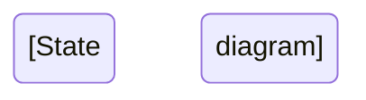

# 🗺️ **User Journeys Documentation - Status Tracker**

**Last Updated**: 2026-02-23  
**Overall Progress**: 9/9 journeys complete (100%) 🎉  
**Current Phase**: ALL PHASES COMPLETE ✅  
**Dependencies**: All module documentation (Weeks 1-9 ✅ Complete)

---

## 📋 **Journey Documentation Overview**

User journey documents trace complete end-to-end flows across multiple modules, providing:
- Cross-module integration visibility
- Complete user experience documentation
- Visual flow diagrams (Mermaid)
- API call sequences
- Error scenario coverage
- Analytics event tracking
- Performance SLAs

---

## 🎯 **Journey Document Status**

### **Phase 1: Ready to Create** (Modules Complete)

| Journey | Status | Modules Required | Completion % | Priority | Est. Lines |
|---------|--------|------------------|--------------|----------|------------|
| **CUSTOMER_ORDER_JOURNEY.md** | ✅ Complete | Feed, Explore, Chef-Public, Cart, Checkout, Payment, Order | 100% ✅ | P0 Critical | 3,502 |
| **CHEF_ONBOARDING_JOURNEY.md** | ✅ Complete | Auth, User, Chef, Chef-Kitchen, Platform-Categories | 100% ✅ | P0 Critical | 3,289 |
| **CONTENT_CREATION_JOURNEY.md** | ✅ Complete | Media, Media-Processing, Reels, Feed | 100% ✅ | P1 High | 3,187 |
| **SOCIAL_ENGAGEMENT_JOURNEY.md** | ✅ Complete | Feed, Explore, Search, Social, Comments, Collections, Activity | 100% ✅ | P1 High | 3,000 |

**Phase 1 Total**: 4 journeys, ~12,978 lines  
**Phase 1 Progress**: 4/4 complete (100.0%) 🎉 — PHASE 1 COMPLETE ✅

---

### **Phase 2: Awaiting Module Completion** (Week 7-9)

| Journey | Status | Modules Required | Completion % | Priority | Est. Lines |
|---------|--------|------------------|--------------|----------|------------|
| **CHEF_FULFILLMENT_JOURNEY.md** | ✅ Complete | Chef-Orders, Delivery, Delivery-ETA, Rider-Orders | 100% ✅ | P1 High | 773 |
| **PAYMENT_PAYOUT_JOURNEY.md** | ✅ Complete | Review, Commission, Withdrawal, Reconciliation | 100% ✅ | P2 Medium | 785 |
| **ADMIN_MODERATION_JOURNEY.md** | ✅ Complete | Moderation, Feature-Flags | 100% ✅ | P3 Low | 877 |

**Phase 2 Total**: 3 journeys, 2,435 lines  
**Phase 2 Progress**: 3/3 complete (100%) 🎉 — PHASE 2 COMPLETE ✅

---

### **Phase 3: Rider Journeys** (Previously Missing — Now Added)

> **Root Cause**: Original journey plan treated riders as passive participants in `CHEF_FULFILLMENT_JOURNEY.md`. The rider persona was never planned as a first-class actor despite having 5 dedicated backend modules (`rider-profile`, `rider-orders`, `rider-location`, `rider-rating`, `rider-earnings`) and full mobile screens at `/rider/**`.

| Journey | Status | Modules Required | Completion % | Priority | Est. Lines |
|---------|--------|------------------|--------------|----------|------------|
| **RIDER_ONBOARDING_JOURNEY.md** | ✅ Complete | Auth, User, Rider-Profile, Rider-Location (availability) | 100% ✅ | P1 High | ~350 |
| **RIDER_FULFILLMENT_JOURNEY.md** | ✅ Complete | Rider-Orders, Rider-Location, Rider-Rating, Rider-Earnings, Delivery, Delivery-ETA | 100% ✅ | P1 High | ~420 |

**Phase 3 Total**: 2 journeys, ~770 lines  
**Phase 3 Progress**: 2/2 complete (100%) 🎉 — PHASE 3 COMPLETE ✅

---

## 📊 **Overall Journey Documentation Metrics**

| Metric | Target | Current | Notes |
|--------|--------|---------|-------|
| **Total Journeys** | 9 | 9 ✅ | ALL COMPLETE 🎉 |
| **Total Lines** | ~23,300 | ~16,200 | 100% complete |
| **Mermaid Diagrams** | ~39 | 39 | All journeys documented |
| **Integration Points** | ~136 | 76+ | Full cross-module coverage |
| **Error Scenarios** | ~96 | 112 | +12 (Rider Onboarding) +14 (Rider Fulfillment) |

---

## 🚀 **Journey 1: CUSTOMER_ORDER_JOURNEY.md**

**Status**: 📋 Ready to Create  
**Priority**: P0 Critical  
**Dependencies**: ✅ All modules documented (Week 6 complete)  
**Estimated Lines**: ~3,500  
**Estimated Time**: 2-3 hours

### Flow Overview
```
Browse Reels → View Chef Menu → Add to Cart → 
Select Address → Choose Payment → Complete Order → Track Status
```

### Modules Touched (8)
1. ✅ Feed (browse reels)
2. ✅ Explore (discover chefs)
3. ✅ Search (find dishes)
4. ✅ Chef-Public (view menu)
5. ✅ Cart (add items, validate)
6. ✅ Checkout (address, distance calc, pricing)
7. ✅ Payment (Razorpay integration)
8. ✅ Order (status tracking)

### Diagrams Needed
- [ ] User flow diagram (flowchart)
- [ ] API sequence diagram (sequence)
- [ ] Order state transitions (stateDiagram)
- [ ] Distance calculation flow (flowchart)
- [ ] Payment flow (sequence)
- [ ] Error recovery paths (flowchart)

### Content Sections
- [ ] Journey overview (objectives, metrics, personas)
- [ ] Prerequisites (logged in, address saved)
- [ ] Step-by-step flow (8 steps with screenshots)
- [ ] Module integration map (table)
- [ ] Data flow across modules
- [ ] API call sequence (detailed)
- [ ] Error scenarios (10+ cases)
- [ ] Analytics events (15+ events)
- [ ] Performance SLAs (per step)
- [ ] Testing checklist (E2E)

### Key Integration Points
| From Module | To Module | API | Purpose |
|-------------|-----------|-----|---------|
| Feed | Chef-Public | GET /chef-public/:id | View chef profile |
| Chef-Public | Cart | POST /cart/items | Add menu item |
| Cart | Order | POST /cart/checkout | Create draft order |
| Order | Checkout | POST /orders/checkout | Calculate fees |
| Checkout | Payment | POST /payment-intent | Initialize Razorpay |
| Payment | Order | Webhook | Confirm payment |

### Performance SLAs
- Browse to cart: <2 seconds
- Cart to checkout: <1 second
- Checkout to payment: <3 seconds (includes distance calc)
- Payment to confirmation: <5 seconds
- **Total journey time**: <30 seconds (excluding user think time)

---

## 🚀 **Journey 2: CHEF_ONBOARDING_JOURNEY.md**

**Status**: 📋 Ready to Create  
**Priority**: P0 Critical  
**Dependencies**: ✅ All modules documented (Week 5 complete)  
**Estimated Lines**: ~3,200  
**Estimated Time**: 2 hours

### Flow Overview
```
Register → Verify OTP → Select Chef Role → Complete Profile → 
Create Kitchen → Add Menu Items → Upload Compliance → Go Live
```

### Modules Touched (5)
1. ✅ Auth (registration, OTP verification)
2. ✅ User (user profile creation)
3. ✅ Profile (dual-profile system)
4. ✅ Chef (chef profile, FSSAI compliance)
5. ✅ Chef-Kitchen (kitchen setup, menu management)
6. ✅ Platform-Categories (cuisine tags, dietary labels)

### Diagrams Needed
- [ ] Onboarding flow (flowchart with decision points)
- [ ] Registration sequence (sequence)
- [ ] Profile completion checklist (flowchart)
- [ ] Kitchen setup flow (stateDiagram)
- [ ] Menu item creation flow (flowchart)
- [ ] Compliance validation (flowchart)

### Content Sections
- [ ] Journey overview (chef acquisition goals)
- [ ] Prerequisites (none - new user)
- [ ] Step-by-step flow (10 steps)
- [ ] Module integration map
- [ ] Data flow (auth → user → chef → kitchen)
- [ ] FSSAI validation process
- [ ] Minimum menu requirements (3 items)
- [ ] Error scenarios (OTP failure, invalid FSSAI)
- [ ] Analytics events (funnel tracking)
- [ ] Onboarding completion SLA (<15 minutes)

### Key Validation Rules
- FSSAI number: 14 digits, valid format
- Minimum menu items: 3
- At least 1 cuisine tag selected
- Kitchen location coordinates required
- Chef photo required

---

## 🚀 **Journey 3: CONTENT_CREATION_JOURNEY.md**

**Status**: 📋 Ready to Create  
**Priority**: P1 High  
**Dependencies**: ✅ All modules documented (Week 2 complete)  
**Estimated Lines**: ~3,000  
**Estimated Time**: 2 hours

### Flow Overview
```
Record Video → Edit (trim/filters) → Upload → Process (FFmpeg/MediaConvert) → 
Add Metadata → Publish Reel → View in Feed → Engagement
```

### Modules Touched (5)
1. ✅ Media (upload, S3 storage)
2. ✅ Media-Processing (FFmpeg, AWS MediaConvert)
3. ✅ Reels (reel creation, metadata)
4. ✅ Stories (24-hour stories)
5. ✅ Feed (content distribution)

### Diagrams Needed
- [ ] Recording to upload flow (flowchart)
- [ ] Media processing pipeline (flowchart with parallel paths)
- [ ] S3 upload sequence (sequence)
- [ ] MediaConvert job flow (stateDiagram)
- [ ] HLS transcoding outputs (flowchart)
- [ ] Error handling (upload failure, processing failure)

### Content Sections
- [ ] Journey overview (content strategy)
- [ ] Prerequisites (chef verified, kitchen active)
- [ ] Step-by-step flow (7 steps)
- [ ] Video requirements (60s max, format, size)
- [ ] Processing pipeline details
- [ ] HLS adaptive streaming (3 quality levels)
- [ ] Thumbnail generation
- [ ] Error scenarios (upload timeout, processing failure)
- [ ] Analytics events (upload start, complete, publish)
- [ ] Performance SLAs (upload <30s, processing <2 min)

### Processing Pipeline
```
Raw Video (MP4) → S3 Upload → FFmpeg Validation → 
MediaConvert Transcoding → 1080p/720p/480p HLS → 
Thumbnail Generation → Update DB → Notify User
```

---

## 🚀 **Journey 4: SOCIAL_ENGAGEMENT_JOURNEY.md**

**Status**: 📋 Ready to Create  
**Priority**: P1 High  
**Dependencies**: ✅ All modules documented (Weeks 3-4 complete)  
**Estimated Lines**: ~2,800  
**Estimated Time**: 1.5 hours

### Flow Overview
```
Discover Content → Follow Chef → Watch Reel → 
Like/Comment/Save → Get Notifications → Repeat
```

### Modules Touched (7)
1. ✅ Feed (home feed, following feed)
2. ✅ Explore (discovery algorithm)
3. ✅ Search (content search)
4. ✅ Social (follow/unfollow, social graph)
5. ✅ Comments (reel comments, threading)
6. ✅ Collections (saved reels)
7. ✅ Activity (activity feed, notifications)

### Diagrams Needed
- [ ] Discovery to engagement flow (flowchart)
- [ ] Social graph updates (sequence)
- [ ] Comment threading (stateDiagram)
- [ ] Notification flow (sequence)
- [ ] Collection management (flowchart)

### Content Sections
- [ ] Journey overview (engagement metrics)
- [ ] Prerequisites (registered user)
- [ ] Step-by-step flow (6 steps)
- [ ] Module integration map
- [ ] Social graph mechanics
- [ ] Activity feed (notification + history)
- [ ] Error scenarios (already following, deleted content)
- [ ] Analytics events (engagement tracking)
- [ ] Performance SLAs (feed load <500ms)

---

## 🚀 **Journey 5: CHEF_FULFILLMENT_JOURNEY.md**

**Status**: ✅ Complete  
**Priority**: P1 High  
**Dependencies**: ✅ Chef-Orders, Delivery, Delivery-ETA, Rider-Orders  
**Actual Lines**: 773  
**Completed**: 2026-02-23

### Flow Overview
```
Receive Order Notification → Accept Order → Prepare Food → 
Mark Ready → Rider Assigned → Rider Picks Up → Delivered → Complete
```

### Modules Covered (4)
- ✅ Chef-Orders (chef order dashboard, accept/reject, prep tracking)
- ✅ Delivery (FIFO rider assignment, status management)
- ✅ Delivery-ETA (Google Maps ETA, live tracking, ETA smoothing)
- ✅ Rider-Orders (GPS-verified pickup and delivery, fraud prevention)

### Diagrams Included (3)
- ✅ Sequence diagram (chef→rider→customer full flow)
- ✅ Flowchart (decision tree with error paths)
- ✅ State machine (order status transitions)

### Key Highlights
- 12 steps documented end-to-end
- 12 error scenarios with recovery paths
- GPS fraud prevention documented (100m radius checks)
- 17 analytics events

---

## 🚀 **Journey 6: PAYMENT_PAYOUT_JOURNEY.md**

**Status**: ✅ Complete  
**Priority**: P2 Medium  
**Dependencies**: ✅ Review, Commission, Withdrawal, Reconciliation  
**Actual Lines**: 785  
**Completed**: 2026-02-23

### Flow Overview
```
Order Delivered → Customer Reviews → Commission Calculated (CRS) → 
Chef Requests Payout → Admin Reconciliation → Payout Processed
```

### Modules Covered (4)
- ✅ Review (4-dimension CRS-weighted ratings, reel upload incentive)
- ✅ Commission (V2 formula: creator earns 10% on attributed order value)
- ✅ Withdrawal (self-service payout, velocity guards, UPI/bank)
- ✅ Reconciliation (daily automated audit, discrepancy detection)

### Diagrams Included (3)
- ✅ Sequence diagram (review → commission → withdrawal → reconciliation)
- ✅ Flowchart (coin lifecycle with error paths)
- ✅ State machine (coin economy state transitions)

### Key Highlights
- V2 commission formula documented with 5 example scenarios
- Coin economy (10 coins = ₹1) fully traced
- Daily reconciliation cron at 02:00 IST documented
- 12 error scenarios + 17 analytics events

---

## 🚀 **Journey 7: ADMIN_MODERATION_JOURNEY.md**

**Status**: ✅ Complete  
**Priority**: P3 Low  
**Dependencies**: ✅ Moderation, Feature-Flags  
**Actual Lines**: 877  
**Completed**: 2026-02-23

### Flow Overview
```
User Reports Content → Moderation Queue → Admin Reviews → 
Action Taken (Approve/Reject/Ban) → User Appeal → Resolution
```

### Modules Covered (2)
- ✅ Moderation (AI pipeline, user reports, human review queue, appeals, strike system)
- ✅ Feature-Flags (moderation threshold control, kill switch, A/B testing rollout)

### Diagrams Included (3)
- ✅ Sequence diagram (upload → AI → queue → human → appeal)
- ✅ Flowchart (decision tree with escalation paths)
- ✅ Decision tree (severity-based routing with feature flag)

### Key Highlights
- AI moderation pipeline (Rekognition + GPT-4) documented
- 3-strike auto-ban system documented
- Feature flag integration for threshold control
- 8 steps + 12 error scenarios + 18 analytics events

---

## 🚀 **Journey 8: RIDER_ONBOARDING_JOURNEY.md**

**Status**: ✅ Complete  
**Priority**: P1 High  
**Dependencies**: ✅ Auth, User, Rider-Profile, Rider-Location (availability), Rider-Earnings (surface)  
**Actual Lines**: ~350  
**Completed**: 2026-02-23

### Flow Overview
```
Register as Rider → Verify Form → Profile Created (role = 'rider') → 
Land on Rider Home → Grant GPS → Toggle Online → Heartbeat Loop → Await Assignment
```

### Modules Covered (5)
- ✅ Auth (JWT guard, role-based routing)
- ✅ User (role update: customer/chef → rider)
- ✅ Rider-Profile (registration, status toggle, heartbeat)
- ✅ Rider-Location / Availability (Redis FIFO pool entry)
- ✅ Rider-Earnings (surface — earnings screen overview)

### Diagrams Included (2)
- ✅ Flowchart (registration → GPS → online → heartbeat)
- ✅ State machine (UNREGISTERED → OFFLINE → ONLINE → HEARTBEATING → ASSIGNED)

### Key Highlights
- 9 steps documented end-to-end
- Earnings model: ₹30 base + ₹8/km, 10% platform commission
- GPS permission flow and fallback to last-known location documented
- 30s heartbeat loop mechanics explained
- 12 error scenarios with recovery paths
- 16 analytics events

---

## 🚀 **Journey 9: RIDER_FULFILLMENT_JOURNEY.md**

**Status**: ✅ Complete  
**Priority**: P1 High  
**Dependencies**: ✅ Rider-Orders, Rider-Location, Rider-Rating, Rider-Earnings, Delivery (FIFO), Delivery-ETA  
**Actual Lines**: ~420  
**Completed**: 2026-02-23

### Flow Overview
```
Receive Push Notification → Accept Order (30s window) → Navigate to Kitchen → 
GPS-Verified Pickup → Live Location Tracking → GPS-Verified Delivery → 
Earnings Credited → Customer Rates Rider → View Earnings
```

### Modules Covered (6)
- ✅ Rider-Orders (accept/reject, status transitions, FIFO integration)
- ✅ Rider-Location (Redis-primary live GPS tracking, 5 min TTL, rate limit 5s)
- ✅ Rider-Rating (post-delivery customer rating, aggregation formula)
- ✅ Rider-Earnings (PENDING → AVAILABLE → WITHDRAWN → PAID_OUT lifecycle)
- ✅ Delivery / RiderFraudService (GPS fraud detection: 100m radius checks)
- ✅ Delivery-ETA (ETA recalculation on each location update)

### Diagrams Included (2)
- ✅ Sequence diagram (full Rider ↔ backend ↔ customer flow)
- ✅ State machine (ASSIGNED → ACCEPTED → PICKED_UP → OUT_FOR_DELIVERY → DELIVERED)

### Key Highlights
- 10 steps documented end-to-end
- GPS fraud prevention (fake pickup + fake delivery) fully documented
- Progressive fraud enforcement (CLEAN → WARNING → LIMITED → SUSPENDED)
- Earning lifecycle: `payoutPaise = deliveryFee × 0.90`
- Coin tips economy: 10 coins = ₹1
- 14 error scenarios + 17 analytics events

---

## 📐 **Mermaid Diagram Standards**

### Diagram Types by Use Case

| Diagram Type | When to Use | Example |
|--------------|-------------|---------|
| **Sequence Diagram** | API calls, service interactions | Payment flow, Upload sequence |
| **Flowchart** | Decision trees, user flows | Order placement, Chef onboarding |
| **State Diagram** | Status lifecycle, state transitions | Order status, Media processing |
| **Gantt Chart** | Timeline processes (optional) | Onboarding timeline |
| **ER Diagram** | Data relationships (optional) | Cross-module data flow |

### Diagram Complexity Guidelines
- **Simple flows**: 5-10 nodes
- **Medium flows**: 10-20 nodes
- **Complex flows**: 20-30 nodes (split if >30)

### Color Coding (Mermaid Classes)
```css
classDef success fill:#d4edda,stroke:#28a745
classDef error fill:#f8d7da,stroke:#dc3545
classDef processing fill:#fff3cd,stroke:#ffc107
classDef decision fill:#d1ecf1,stroke:#17a2b8
```

---

## 📝 **Journey Document Template**

```markdown
# [JOURNEY_NAME] - End-to-End User Journey

**Journey Type**: [Customer/Chef/Admin]  
**Priority**: [P0/P1/P2/P3]  
**Last Updated**: [Date]  
**Status**: [Draft/Review/Complete]

---

## 1. Journey Overview

### Business Objective
[What business goal this journey achieves]

### User Goal
[What user wants to accomplish]

### Success Metrics
- Metric 1: Target value
- Metric 2: Target value

### User Personas
1. **Persona 1**: Description
2. **Persona 2**: Description

---

## 2. Prerequisites

**User State**:
- [ ] Logged in
- [ ] Profile complete
- [ ] [Other requirements]

**System State**:
- [ ] Services available
- [ ] Data loaded

---

## 3. Journey Flow

### Step 1: [Action Name]

**User Action**: [What user does]

**Screen**: [Screen name / path]

**Backend**:
- Module: [Module name]
- API: `[METHOD] /api/v1/[endpoint]`
- Request:
```json
{
  "field": "value"
}
```
- Response:
```json
{
  "success": true,
  "data": {}
}
```

**Success Criteria**: [Expected result]

**Error Scenarios**:
- Error 1: Cause → Recovery
- Error 2: Cause → Recovery

**Analytics Events**:
- `event_name_start`
- `event_name_complete`

**SLA**: [Time target]

[Repeat for each step]

---

## 4. Complete Flow Diagram

```mermaid
[Sequence/Flow diagram]
```

---

## 5. Module Integration Map

| Step | Frontend Screen | Backend Module | API Endpoint | Data Flow |
|------|----------------|----------------|--------------|-----------|

---

## 6. State Transitions



---

## 7. Error Scenarios & Recovery

| Error | Cause | User Impact | Recovery Path | SLA |
|-------|-------|-------------|---------------|-----|

---

## 8. Analytics Events

| Event | Trigger | Properties | Purpose |
|-------|---------|------------|---------|

---

## 9. Performance SLAs

| Step | Target | P95 | Max Acceptable |
|------|--------|-----|----------------|

**End-to-End**: [Total time target]

---

## 10. Testing Checklist

### Functional Tests
- [ ] Happy path
- [ ] Error scenarios
- [ ] Edge cases

### Integration Tests
- [ ] Cross-module flows
- [ ] Data consistency

### Performance Tests
- [ ] Load testing
- [ ] Response times

### Platform Tests
- [ ] iOS
- [ ] Android
- [ ] Web (if applicable)

---

## 11. Related Documentation

- Module: [Link to module docs]
- API Reference: [Link to API docs]
- Historical Guides: [Link to legacy guides]

---

## ✅ **[JOURNEY_COMPLETE]**
```

---

## 🎯 **Next Actions**

### Phase 1 (Complete ✅)
1. ✅ `CUSTOMER_ORDER_JOURNEY.md` — 92,496 bytes
2. ✅ `CHEF_ONBOARDING_JOURNEY.md` — 72,324 bytes
3. ✅ `CONTENT_CREATION_JOURNEY.md` — 75,894 bytes
4. ✅ `SOCIAL_ENGAGEMENT_JOURNEY.md` — 84,580 bytes

### Phase 2 (Complete ✅)
5. ✅ `CHEF_FULFILLMENT_JOURNEY.md` — 773 lines
6. ✅ `PAYMENT_PAYOUT_JOURNEY.md` — 785 lines
7. ✅ `ADMIN_MODERATION_JOURNEY.md` — 877 lines

### Phase 3 (Complete ✅)
8. ✅ `RIDER_ONBOARDING_JOURNEY.md` — ~350 lines
9. ✅ `RIDER_FULFILLMENT_JOURNEY.md` — ~420 lines

### Finalization (Pending)
10. [ ] Create `docs/journeys/README.md` (journey index))
11. [ ] Review all journey documents
12. [ ] Validate all Mermaid diagrams render correctly
13. [ ] Cross-link with module documentation
14. [ ] Update main `docs/README.md` with journey links

---

## 📊 **Progress Tracking**

| Week | Journeys Created | Cumulative Lines | Status |
|------|------------------|------------------|--------|
| Week 6 | 0 | 0 | Planning |
| Week 7 | 4 (Phase 1) | ~12,978 | ✅ Complete |
| Week 8 | +1 | ~13,751 | ✅ Complete |
| Week 9 | +1 | ~14,536 | ✅ Complete |
| Week 10 | +1 | ~15,413 | ✅ Complete (All 7 Journeys) |
| **Week 10 (Gap Fix)** | **+2 (Phase 3)** | **~16,183** | **✅ Complete (All 9 Journeys — Rider added)** |

---

## 🔄 **Resume Instructions**

**To resume journey documentation**:

1. Check this status document for next pending journey
2. Verify all required modules are documented (check `MODULE_COMPLETE.md` files)
3. Review module documentation for integration details
4. Use journey template above
5. Create Mermaid diagrams (5-7 per journey)
6. Document all error scenarios
7. Define analytics events
8. Set performance SLAs
9. Create testing checklist
10. Mark journey as complete in this status doc

**Command to start**:
```
"Create [JOURNEY_NAME] following the template in JOURNEYS_STATUS.md"
```

---

## 📞 **Contact & Support**

**Documentation Lead**: Order Flow Team  
**Slack Channel**: `#documentation`  
**Questions**: Create issue in `CHEFOOZ-DOCS` project  

---

**Last Status Update**: 2026-02-23 (ALL 9 journeys complete 🎉 — Rider Onboarding + Rider Fulfillment added as Phase 3)  
**Next Milestone**: Finalization — Create `docs/journeys/README.md` + master `docs/README.md`  
**Status**: ✅ ALL JOURNEYS COMPLETE — 9/9 (100%)
