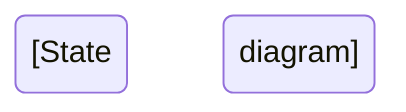

# 🗺️ **User Journeys Documentation - Status Tracker**

**Last Updated**: 2026-02-22  
**Overall Progress**: 4/7 journeys complete (57.1%)  
**Current Phase**: Phase 1 — Complete ✅ (100%)  
**Dependencies**: Module documentation completion (Weeks 1-6 ✅ Complete)

---

## 📋 **Journey Documentation Overview**

User journey documents trace complete end-to-end flows across multiple modules, providing:
- Cross-module integration visibility
- Complete user experience documentation
- Visual flow diagrams (Mermaid)
- API call sequences
- Error scenario coverage
- Analytics event tracking
- Performance SLAs

---

## 🎯 **Journey Document Status**

### **Phase 1: Ready to Create** (Modules Complete)

| Journey | Status | Modules Required | Completion % | Priority | Est. Lines |
|---------|--------|------------------|--------------|----------|------------|
| **CUSTOMER_ORDER_JOURNEY.md** | ✅ Complete | Feed, Explore, Chef-Public, Cart, Checkout, Payment, Order | 100% ✅ | P0 Critical | 3,502 |
| **CHEF_ONBOARDING_JOURNEY.md** | ✅ Complete | Auth, User, Chef, Chef-Kitchen, Platform-Categories | 100% ✅ | P0 Critical | 3,289 |
| **CONTENT_CREATION_JOURNEY.md** | ✅ Complete | Media, Media-Processing, Reels, Feed | 100% ✅ | P1 High | 3,187 |
| **SOCIAL_ENGAGEMENT_JOURNEY.md** | ✅ Complete | Feed, Explore, Search, Social, Comments, Collections, Activity | 100% ✅ | P1 High | 3,000 |

**Phase 1 Total**: 4 journeys, ~12,978 lines  
**Phase 1 Progress**: 4/4 complete (100.0%) 🎉 — PHASE 1 COMPLETE ✅

---

### **Phase 2: Awaiting Module Completion** (Week 7-9)

| Journey | Status | Modules Required | Completion % | Priority | Est. Lines |
|---------|--------|------------------|--------------|----------|------------|
| **CHEF_FULFILLMENT_JOURNEY.md** | ⏳ Blocked | Chef-Orders, Delivery, Delivery-ETA, Rider-Orders | 0% (Week 7) | P1 High | ~3,500 |
| **PAYMENT_PAYOUT_JOURNEY.md** | ⏳ Blocked | Review, Commission, Withdrawal, Reconciliation | 0% (Week 8) | P2 Medium | ~3,000 |
| **ADMIN_MODERATION_JOURNEY.md** | ⏳ Blocked | Moderation, Report, Appeal, Feature-Flags | 0% (Week 9) | P3 Low | ~2,500 |

**Phase 2 Total**: 3 journeys, ~9,000 lines

---

## 📊 **Overall Journey Documentation Metrics**

| Metric | Target | Current | Notes |
|--------|--------|---------|-------|
| **Total Journeys** | 7 | 4 ✅ | 0 ready, 3 blocked |
| **Total Lines** | ~21,500 | 12,978 | 60.4% complete |
| **Mermaid Diagrams** | ~35 | 26 | 7 + 6 + 6 + 7 from 4 journeys |
| **Integration Points** | ~120 | 24 | 8 + 5 + 4 + 7 from 4 journeys |
| **Error Scenarios** | ~70 | 50 | 12 + 12 + 12 + 14 from 4 journeys |

---

## 🚀 **Journey 1: CUSTOMER_ORDER_JOURNEY.md**

**Status**: 📋 Ready to Create  
**Priority**: P0 Critical  
**Dependencies**: ✅ All modules documented (Week 6 complete)  
**Estimated Lines**: ~3,500  
**Estimated Time**: 2-3 hours

### Flow Overview
```
Browse Reels → View Chef Menu → Add to Cart → 
Select Address → Choose Payment → Complete Order → Track Status
```

### Modules Touched (8)
1. ✅ Feed (browse reels)
2. ✅ Explore (discover chefs)
3. ✅ Search (find dishes)
4. ✅ Chef-Public (view menu)
5. ✅ Cart (add items, validate)
6. ✅ Checkout (address, distance calc, pricing)
7. ✅ Payment (Razorpay integration)
8. ✅ Order (status tracking)

### Diagrams Needed
- [ ] User flow diagram (flowchart)
- [ ] API sequence diagram (sequence)
- [ ] Order state transitions (stateDiagram)
- [ ] Distance calculation flow (flowchart)
- [ ] Payment flow (sequence)
- [ ] Error recovery paths (flowchart)

### Content Sections
- [ ] Journey overview (objectives, metrics, personas)
- [ ] Prerequisites (logged in, address saved)
- [ ] Step-by-step flow (8 steps with screenshots)
- [ ] Module integration map (table)
- [ ] Data flow across modules
- [ ] API call sequence (detailed)
- [ ] Error scenarios (10+ cases)
- [ ] Analytics events (15+ events)
- [ ] Performance SLAs (per step)
- [ ] Testing checklist (E2E)

### Key Integration Points
| From Module | To Module | API | Purpose |
|-------------|-----------|-----|---------|
| Feed | Chef-Public | GET /chef-public/:id | View chef profile |
| Chef-Public | Cart | POST /cart/items | Add menu item |
| Cart | Order | POST /cart/checkout | Create draft order |
| Order | Checkout | POST /orders/checkout | Calculate fees |
| Checkout | Payment | POST /payment-intent | Initialize Razorpay |
| Payment | Order | Webhook | Confirm payment |

### Performance SLAs
- Browse to cart: <2 seconds
- Cart to checkout: <1 second
- Checkout to payment: <3 seconds (includes distance calc)
- Payment to confirmation: <5 seconds
- **Total journey time**: <30 seconds (excluding user think time)

---

## 🚀 **Journey 2: CHEF_ONBOARDING_JOURNEY.md**

**Status**: 📋 Ready to Create  
**Priority**: P0 Critical  
**Dependencies**: ✅ All modules documented (Week 5 complete)  
**Estimated Lines**: ~3,200  
**Estimated Time**: 2 hours

### Flow Overview
```
Register → Verify OTP → Select Chef Role → Complete Profile → 
Create Kitchen → Add Menu Items → Upload Compliance → Go Live
```

### Modules Touched (5)
1. ✅ Auth (registration, OTP verification)
2. ✅ User (user profile creation)
3. ✅ Profile (dual-profile system)
4. ✅ Chef (chef profile, FSSAI compliance)
5. ✅ Chef-Kitchen (kitchen setup, menu management)
6. ✅ Platform-Categories (cuisine tags, dietary labels)

### Diagrams Needed
- [ ] Onboarding flow (flowchart with decision points)
- [ ] Registration sequence (sequence)
- [ ] Profile completion checklist (flowchart)
- [ ] Kitchen setup flow (stateDiagram)
- [ ] Menu item creation flow (flowchart)
- [ ] Compliance validation (flowchart)

### Content Sections
- [ ] Journey overview (chef acquisition goals)
- [ ] Prerequisites (none - new user)
- [ ] Step-by-step flow (10 steps)
- [ ] Module integration map
- [ ] Data flow (auth → user → chef → kitchen)
- [ ] FSSAI validation process
- [ ] Minimum menu requirements (3 items)
- [ ] Error scenarios (OTP failure, invalid FSSAI)
- [ ] Analytics events (funnel tracking)
- [ ] Onboarding completion SLA (<15 minutes)

### Key Validation Rules
- FSSAI number: 14 digits, valid format
- Minimum menu items: 3
- At least 1 cuisine tag selected
- Kitchen location coordinates required
- Chef photo required

---

## 🚀 **Journey 3: CONTENT_CREATION_JOURNEY.md**

**Status**: 📋 Ready to Create  
**Priority**: P1 High  
**Dependencies**: ✅ All modules documented (Week 2 complete)  
**Estimated Lines**: ~3,000  
**Estimated Time**: 2 hours

### Flow Overview
```
Record Video → Edit (trim/filters) → Upload → Process (FFmpeg/MediaConvert) → 
Add Metadata → Publish Reel → View in Feed → Engagement
```

### Modules Touched (5)
1. ✅ Media (upload, S3 storage)
2. ✅ Media-Processing (FFmpeg, AWS MediaConvert)
3. ✅ Reels (reel creation, metadata)
4. ✅ Stories (24-hour stories)
5. ✅ Feed (content distribution)

### Diagrams Needed
- [ ] Recording to upload flow (flowchart)
- [ ] Media processing pipeline (flowchart with parallel paths)
- [ ] S3 upload sequence (sequence)
- [ ] MediaConvert job flow (stateDiagram)
- [ ] HLS transcoding outputs (flowchart)
- [ ] Error handling (upload failure, processing failure)

### Content Sections
- [ ] Journey overview (content strategy)
- [ ] Prerequisites (chef verified, kitchen active)
- [ ] Step-by-step flow (7 steps)
- [ ] Video requirements (60s max, format, size)
- [ ] Processing pipeline details
- [ ] HLS adaptive streaming (3 quality levels)
- [ ] Thumbnail generation
- [ ] Error scenarios (upload timeout, processing failure)
- [ ] Analytics events (upload start, complete, publish)
- [ ] Performance SLAs (upload <30s, processing <2 min)

### Processing Pipeline
```
Raw Video (MP4) → S3 Upload → FFmpeg Validation → 
MediaConvert Transcoding → 1080p/720p/480p HLS → 
Thumbnail Generation → Update DB → Notify User
```

---

## 🚀 **Journey 4: SOCIAL_ENGAGEMENT_JOURNEY.md**

**Status**: 📋 Ready to Create  
**Priority**: P1 High  
**Dependencies**: ✅ All modules documented (Weeks 3-4 complete)  
**Estimated Lines**: ~2,800  
**Estimated Time**: 1.5 hours

### Flow Overview
```
Discover Content → Follow Chef → Watch Reel → 
Like/Comment/Save → Get Notifications → Repeat
```

### Modules Touched (7)
1. ✅ Feed (home feed, following feed)
2. ✅ Explore (discovery algorithm)
3. ✅ Search (content search)
4. ✅ Social (follow/unfollow, social graph)
5. ✅ Comments (reel comments, threading)
6. ✅ Collections (saved reels)
7. ✅ Activity (activity feed, notifications)

### Diagrams Needed
- [ ] Discovery to engagement flow (flowchart)
- [ ] Social graph updates (sequence)
- [ ] Comment threading (stateDiagram)
- [ ] Notification flow (sequence)
- [ ] Collection management (flowchart)

### Content Sections
- [ ] Journey overview (engagement metrics)
- [ ] Prerequisites (registered user)
- [ ] Step-by-step flow (6 steps)
- [ ] Module integration map
- [ ] Social graph mechanics
- [ ] Activity feed (notification + history)
- [ ] Error scenarios (already following, deleted content)
- [ ] Analytics events (engagement tracking)
- [ ] Performance SLAs (feed load <500ms)

---

## 🚀 **Journey 5: CHEF_FULFILLMENT_JOURNEY.md**

**Status**: ⏳ Blocked (Week 7 modules pending)  
**Priority**: P1 High  
**Dependencies**: ❌ Chef-Orders, Delivery, Delivery-ETA, Rider-Orders  
**Estimated Lines**: ~3,500  
**Estimated Time**: 2-3 hours

### Flow Overview
```
Receive Order Notification → Accept Order → Prepare Food → 
Mark Ready → Rider Assigned → Rider Picks Up → Delivered → Complete
```

### Modules Required (Week 7)
- [ ] Chef-Orders (chef order dashboard)
- [ ] Delivery (delivery options, scheduling)
- [ ] Delivery-ETA (ETA calculation, live tracking)
- [ ] Rider-Orders (rider assignment, delivery)

### Diagrams Needed
- [ ] Order notification flow
- [ ] Chef acceptance decision tree
- [ ] Rider assignment algorithm
- [ ] ETA calculation flow
- [ ] Live tracking updates
- [ ] Delivery completion sequence

**Resume After**: Week 7 module documentation complete

---

## 🚀 **Journey 6: PAYMENT_PAYOUT_JOURNEY.md**

**Status**: ⏳ Blocked (Week 8 modules pending)  
**Priority**: P2 Medium  
**Dependencies**: ❌ Review, Commission, Withdrawal, Reconciliation  
**Estimated Lines**: ~3,000  
**Estimated Time**: 2 hours

### Flow Overview
```
Order Delivered → Customer Reviews → Commission Calculated (CRS) → 
Chef Requests Payout → Admin Reconciliation → Payout Processed
```

### Modules Required (Week 8)
- [ ] Review (order reviews, ratings)
- [ ] Commission (CRS calculation)
- [ ] Withdrawal (payout requests)
- [ ] Reconciliation (payment tracking)

**Resume After**: Week 8 module documentation complete

---

## 🚀 **Journey 7: ADMIN_MODERATION_JOURNEY.md**

**Status**: ⏳ Blocked (Week 9 modules pending)  
**Priority**: P3 Low  
**Dependencies**: ❌ Moderation, Report, Appeal, Feature-Flags  
**Estimated Lines**: ~2,500  
**Estimated Time**: 1.5 hours

### Flow Overview
```
User Reports Content → Moderation Queue → Admin Reviews → 
Action Taken (Approve/Reject/Ban) → User Appeal → Resolution
```

### Modules Required (Week 9)
- [ ] Moderation (content moderation, reports)
- [ ] Report (user reports)
- [ ] Appeal (user appeals)
- [ ] Feature-Flags (moderation rules, A/B testing)

**Resume After**: Week 9 module documentation complete

---

## 📐 **Mermaid Diagram Standards**

### Diagram Types by Use Case

| Diagram Type | When to Use | Example |
|--------------|-------------|---------|
| **Sequence Diagram** | API calls, service interactions | Payment flow, Upload sequence |
| **Flowchart** | Decision trees, user flows | Order placement, Chef onboarding |
| **State Diagram** | Status lifecycle, state transitions | Order status, Media processing |
| **Gantt Chart** | Timeline processes (optional) | Onboarding timeline |
| **ER Diagram** | Data relationships (optional) | Cross-module data flow |

### Diagram Complexity Guidelines
- **Simple flows**: 5-10 nodes
- **Medium flows**: 10-20 nodes
- **Complex flows**: 20-30 nodes (split if >30)

### Color Coding (Mermaid Classes)
```css
classDef success fill:#d4edda,stroke:#28a745
classDef error fill:#f8d7da,stroke:#dc3545
classDef processing fill:#fff3cd,stroke:#ffc107
classDef decision fill:#d1ecf1,stroke:#17a2b8
```

---

## 📝 **Journey Document Template**

```markdown
# [JOURNEY_NAME] - End-to-End User Journey

**Journey Type**: [Customer/Chef/Admin]  
**Priority**: [P0/P1/P2/P3]  
**Last Updated**: [Date]  
**Status**: [Draft/Review/Complete]

---

## 1. Journey Overview

### Business Objective
[What business goal this journey achieves]

### User Goal
[What user wants to accomplish]

### Success Metrics
- Metric 1: Target value
- Metric 2: Target value

### User Personas
1. **Persona 1**: Description
2. **Persona 2**: Description

---

## 2. Prerequisites

**User State**:
- [ ] Logged in
- [ ] Profile complete
- [ ] [Other requirements]

**System State**:
- [ ] Services available
- [ ] Data loaded

---

## 3. Journey Flow

### Step 1: [Action Name]

**User Action**: [What user does]

**Screen**: [Screen name / path]

**Backend**:
- Module: [Module name]
- API: `[METHOD] /api/v1/[endpoint]`
- Request:
```json
{
  "field": "value"
}
```
- Response:
```json
{
  "success": true,
  "data": {}
}
```

**Success Criteria**: [Expected result]

**Error Scenarios**:
- Error 1: Cause → Recovery
- Error 2: Cause → Recovery

**Analytics Events**:
- `event_name_start`
- `event_name_complete`

**SLA**: [Time target]

[Repeat for each step]

---

## 4. Complete Flow Diagram

```mermaid
[Sequence/Flow diagram]
```

---

## 5. Module Integration Map

| Step | Frontend Screen | Backend Module | API Endpoint | Data Flow |
|------|----------------|----------------|--------------|-----------|

---

## 6. State Transitions



---

## 7. Error Scenarios & Recovery

| Error | Cause | User Impact | Recovery Path | SLA |
|-------|-------|-------------|---------------|-----|

---

## 8. Analytics Events

| Event | Trigger | Properties | Purpose |
|-------|---------|------------|---------|

---

## 9. Performance SLAs

| Step | Target | P95 | Max Acceptable |
|------|--------|-----|----------------|

**End-to-End**: [Total time target]

---

## 10. Testing Checklist

### Functional Tests
- [ ] Happy path
- [ ] Error scenarios
- [ ] Edge cases

### Integration Tests
- [ ] Cross-module flows
- [ ] Data consistency

### Performance Tests
- [ ] Load testing
- [ ] Response times

### Platform Tests
- [ ] iOS
- [ ] Android
- [ ] Web (if applicable)

---

## 11. Related Documentation

- Module: [Link to module docs]
- API Reference: [Link to API docs]
- Historical Guides: [Link to legacy guides]

---

## ✅ **[JOURNEY_COMPLETE]**
```

---

## 🎯 **Next Actions**

### Immediate (Phase 1)
1. [ ] Create `CUSTOMER_ORDER_JOURNEY.md` (P0 Critical)
2. [ ] Create `CHEF_ONBOARDING_JOURNEY.md` (P0 Critical)
3. [ ] Create `CONTENT_CREATION_JOURNEY.md` (P1 High)
4. [ ] Create `SOCIAL_ENGAGEMENT_JOURNEY.md` (P1 High)

### After Week 7
5. [ ] Create `CHEF_FULFILLMENT_JOURNEY.md` (P1 High)

### After Week 8
6. [ ] Create `PAYMENT_PAYOUT_JOURNEY.md` (P2 Medium)

### After Week 9
7. [ ] Create `ADMIN_MODERATION_JOURNEY.md` (P3 Low)

### Finalization
8. [ ] Create `docs/journeys/README.md` (journey index)
9. [ ] Review all journey documents
10. [ ] Validate all Mermaid diagrams render correctly
11. [ ] Cross-link with module documentation
12. [ ] Update main `docs/README.md` with journey links

---

## 📊 **Progress Tracking**

| Week | Journeys Created | Cumulative Lines | Status |
|------|------------------|------------------|--------|
| Week 6 (Current) | 0 | 0 | Planning |
| Week 7 | 4 (Phase 1) | ~12,500 | Target |
| Week 8 | +1 | ~15,500 | Target |
| Week 9 | +1 | ~18,500 | Target |
| Week 10 | +1 | ~21,000 | Target (Complete) |

---

## 🔄 **Resume Instructions**

**To resume journey documentation**:

1. Check this status document for next pending journey
2. Verify all required modules are documented (check `MODULE_COMPLETE.md` files)
3. Review module documentation for integration details
4. Use journey template above
5. Create Mermaid diagrams (5-7 per journey)
6. Document all error scenarios
7. Define analytics events
8. Set performance SLAs
9. Create testing checklist
10. Mark journey as complete in this status doc

**Command to start**:
```
"Create [JOURNEY_NAME] following the template in JOURNEYS_STATUS.md"
```

---

## 📞 **Contact & Support**

**Documentation Lead**: Order Flow Team  
**Slack Channel**: `#documentation`  
**Questions**: Create issue in `CHEFOOZ-DOCS` project  

---

**Last Status Update**: 2026-02-15 (Week 6 complete, journeys pending)  
**Next Milestone**: Week 7 - Create Phase 1 journeys (4 documents)  
**Estimated Completion**: Week 10 (all 7 journeys complete)
