```mermaid
flowchart TD
    A[Order DELIVERED] --> B[Review Prompt\nPush Notification]
    B --> C[Customer Submits Review\n4 dimensions]
    C --> D[CRS Weight Applied\n1.0x → 1.25x]
    D --> E[Chef Reputation\nUpdated]
    C --> F{reelUploadEligible?}
    F -->|Yes| G[Customer uploads reel\n→ Content Creation Journey]
    F -->|No| H[Journey ends for customer]

    A --> I{Order has reelId?}
    I -->|Yes| J[Commission Calculation\nV2 Formula]
    I -->|No| K[No commission]
    J --> L[Commission PENDING\n≥5 min delay]
    L --> M[Cron credits coins\nAtomic +coins to creator]
    M --> N[Creator notified\nBalance updated]

    N --> O[Creator views Earnings\nDashboard]
    O --> P{Wants to withdraw?}
    P -->|Yes| Q[Velocity Guards\nCheck limits]
    Q -->|Pass| R[Atomic coin deduction\nWithdrawal PENDING]
    Q -->|Fail| S[Error: Limit exceeded]
    R --> T[Admin Approval\nQueue]
    T --> U{Admin Decision}
    U -->|Approve| V[Payout Initiated\nUPI/Bank transfer]
    U -->|Reject| W[Coins refunded\nReason sent]
    V --> X[Creator receives ₹]

    Y[Daily Cron 02:00 IST] --> Z[Reconciliation Run]
    Z --> AA{Balanced?}
    AA -->|Yes| BB[✅ BALANCED Report]
    AA -->|No| CC[🚨 ALERT Finance Team\nDiscrepancy found]
```

# 💰 Payment & Payout Journey - End-to-End Flow

**Journey Type**: Creator / Finance  
**Priority**: P2 Medium  
**Last Updated**: 2026-02-23  
**Status**: ✅ Complete  
**Modules Covered**: review, commission, withdrawal, reconciliation

---

## 📋 Table of Contents

1. [Journey Overview](#1-journey-overview)
2. [Prerequisites](#2-prerequisites)
3. [Journey Flow (Step-by-Step)](#3-journey-flow-step-by-step)
4. [Complete Flow Diagram](#4-complete-flow-diagram)
5. [Module Integration Map](#5-module-integration-map)
6. [Commission Formula Deep-Dive](#6-commission-formula-deep-dive)
7. [Coin Economy State Transitions](#7-coin-economy-state-transitions)
8. [Error Scenarios & Recovery](#8-error-scenarios--recovery)
9. [Analytics Events](#9-analytics-events)
10. [Performance SLAs](#10-performance-slas)
11. [Testing Checklist](#11-testing-checklist)
12. [Related Documentation](#12-related-documentation)

---

## 1. Journey Overview

### Business Objective

Close the creator monetization loop: reward authentic content creators when their food reels drive real orders, allow them to cash out earnings, and maintain financial integrity through daily automated reconciliation.

### User Goals

| User | Goal |
|------|------|
| **Customer** | Rate the order they received, with the knowledge their review helps the community |
| **Creator** | Earn coins from the order their reel influenced, view earnings, withdraw as real money |
| **Chef** | See accurate reputation scores reflecting genuine customer feedback |
| **Finance Team** | Verify all coins earned = all coins withdrawn + all coins held, with zero discrepancies |

### The Coin Economy

```
10 coins = ₹1 INR

Creator posts reel → User watches → User orders → 
Commission earned in coins → Creator withdraws → Coins → INR
```

### Success Metrics

| Metric | Target | Current |
|--------|--------|---------|
| Review-to-reel conversion | ≥ 20% | 23% |
| Commission auto-credit rate | ≥ 99% | 99.8% |
| Withdrawal processing time | ≤ 2 days | 1-2 days |
| Fraud incident rate | ≤ 0.5% | 0.4% |
| Reconciliation discrepancy rate | < 0.01% | < 0.01% |
| Creator withdrawal rate | ≥ 75% | 78% |

### User Personas

1. **Sneha (Customer/Creator)**: Placed an order after watching a reel. Has her own food reel that 3 other users ordered from — now has ₹230 in coins.
2. **Rahul (Content Creator)**: Posts food reels regularly, earns ₹500-2000/month in commissions, withdraws monthly via UPI.
3. **Finance Admin (Kavya)**: Monitors daily reconciliation reports, approves withdrawal batches, investigates discrepancies.

---

## 2. Prerequisites

### For Review Submission
- ✅ Order status = `DELIVERED`
- ✅ Customer is the order owner (`order.userId = reviewer.id`)
- ✅ One review per order item (no duplicate reviews)
- ✅ Review submitted within 24 hours of delivery (recommended; 7-day hard limit)

### For Commission Credit
- ✅ Order has `reelId` linkage (customer found order via a reel)
- ✅ Reel creator is different from the ordering customer (no self-commission)
- ✅ Reel creator has active account (not banned)
- ✅ Order payment status = `PAID` (not refunded)

### For Withdrawal Request
- ✅ Creator has coin balance ≥ minimum withdrawal (100 coins = ₹10)
- ✅ Creator has not exceeded daily withdrawal limit (3 requests/day)
- ✅ Creator has not exceeded weekly limit (₹10,000/week)
- ✅ Bank/UPI details verified and saved

### For Reconciliation
- ✅ Daily cron job configured (runs at 02:00 IST)
- ✅ Admin access to reconciliation dashboard

---

## 3. Journey Flow (Step-by-Step)

### Step 1: Customer Reviews the Order

**Trigger**: Order delivered → Push notification prompts review

**User Action**: Customer opens review prompt → Rates on 4 dimensions → Submits

**Screen**: `Customer App → My Orders → Review Order`

**Business Rules**:
- Four dimensions: Taste (40%), Portion (20%), Hygiene (30%), Delivery (10%)
- Weighted formula: `overall = taste×0.4 + portion×0.2 + hygiene×0.3 + delivery×0.1`
- CRS multiplier applied: Bronze=1.0x, Silver=1.1x, Gold=1.15x, Platinum=1.25x
- Minimum order threshold: ≥3 completed orders for multiplier bonus

**Backend**:
- Module: `review`
- API: `POST /api/v1/reviews`

**Request**:
```json
{
  "orderId": "ord_abc123",
  "orderItemId": "item_789",
  "taste": 4,
  "portion": 5,
  "hygiene": 5,
  "delivery": 4,
  "comment": "Dal Makhani was absolutely divine! Creamy, perfectly spiced. The naan was fresh and fluffy. Delivery was quick despite traffic.",
  "reelUploadEligible": true
}
```

**Response**:
```json
{
  "success": true,
  "message": "Review submitted successfully",
  "data": {
    "reviewId": "rev_001",
    "overallRating": 4.7,
    "weightedRating": 5.17,
    "crsMultiplier": 1.1,
    "crsCategory": "SILVER",
    "reelUploadEligible": true,
    "suggestedCaption": "Tried Chef Priya's Dal Makhani — honestly the best I've had in Bengaluru! 🤤🍛 #ChefoozFinds"
  }
}
```

**Chef Reputation Update**:
- Weighted rating added to chef's aggregate score
- Dish-level rating updated for Dal Makhani
- If >50 reviews: full re-average; if <50: incremental update

**SLA**: Review submission < 500ms; chef aggregate updated async < 5 seconds

---

### Step 2: Review-to-Reel Incentive (Optional)

**User Action**: Customer taps **Upload Reel** after review → Records food video → Publishes

**Why This Matters**:
- 23% review-to-reel conversion rate (up from 8% without incentive)
- Authentic visual content drives discovery
- Creator enters commission eligibility for future orders

**Flow**:
1. Customer records 15-60 second video of their meal
2. Tags the dish and chef automatically (from review context)
3. AI-suggested caption pre-filled
4. Reel published → enters content creation pipeline (see CONTENT_CREATION_JOURNEY)
5. Future users who order after watching → customer earns commission

**Key Trigger**: `reelUploadEligible = true` in review response enables this flow

---

### Step 3: Commission Calculation Triggered

**Trigger**: Order with `reelId` linkage delivered and payment confirmed

**When Triggered**:
- Order.reelId is set (customer found order via reel)
- Order.paymentStatus = `PAID`
- Order.status transitions to `DELIVERED`

**Backend**:
- Module: `commission`
- Triggered by: Background cron job (every 5 minutes) or post-delivery webhook
- API: `POST /api/v1/commissions/calculate` (internal)

**Commission V2 Formula**:
```
Let C = Creator's linked order value (what creator ordered when they made the reel)
Let U = User's actual order value

Case 1 — User orders same or less than creator:
  commissionable = U

Case 2 — User orders more than creator:
  commissionable = C + ((U - C) / 2)

commission_INR = commissionable × 10%
coins_earned = commission_INR × 10
```

**Example Calculation**:
```
Creator (Rahul) ordered: ₹300 (linked order value)
User (Sneha) ordered:    ₹480

Since 480 > 300:
  commissionable = 300 + ((480 - 300) / 2)
                 = 300 + 90
                 = 390

commission_INR = 390 × 10% = ₹39
coins_earned   = 39 × 10 = 390 coins
```

**Commission Record Created**:
```json
{
  "commissionId": "comm_001",
  "creatorId": "user_rahul",
  "orderId": "ord_abc123",
  "reelId": "reel_xyz789",
  "creatorOrderValue": 300,
  "userOrderValue": 480,
  "commissionableAmount": 390,
  "commissionRate": 0.10,
  "commissionAmountINR": 39,
  "coinsEarned": 390,
  "status": "PENDING",
  "calculatedAt": "2026-02-23T11:25:00Z"
}
```

---

### Step 4: Coins Credited to Creator

**Trigger**: Commission record reaches `PENDING` status → Cron job credits coins

**Timing**: Background job runs every 5 minutes

**Backend**:
- Module: `commission`
- API: `POST /api/v1/commissions/credit` (internal cron)

**Process**:
1. Find all `PENDING` commissions older than 5 minutes
2. Verify order still `PAID` (not refunded/disputed)
3. Atomic coin credit: `creator.coinBalance += coinsEarned`
4. Update commission status: `PENDING → CREDITED`
5. Send push notification to creator

**Commission Status Updated**:
```json
{
  "commissionId": "comm_001",
  "status": "CREDITED",
  "creditedAt": "2026-02-23T11:30:00Z",
  "coinsEarned": 390,
  "creatorBalanceAfter": 2840
}
```

**Creator Notification**: *"You earned 390 coins (₹39) from Sneha's order via your reel! 🎉 Total balance: 2,840 coins"*

---

### Step 5: Creator Views Earnings Dashboard

**User Action**: Creator opens Earnings screen → Views commission history and coin balance

**Screen**: `Creator App → Wallet → Earnings`

**Backend**:
- Module: `commission`
- API: `GET /api/v1/commissions/summary`

**Response**:
```json
{
  "success": true,
  "data": {
    "totalCoins": 2840,
    "totalINR": 284.00,
    "pendingCoins": 150,
    "creditedCoins": 2690,
    "monthlyEarnings": [
      { "month": "2026-02", "coins": 1240, "inr": 124.00, "orders": 18 },
      { "month": "2026-01", "coins": 1600, "inr": 160.00, "orders": 22 }
    ],
    "topReels": [
      { "reelId": "reel_xyz789", "views": 1240, "ordersLinked": 8, "earnings": 420 }
    ]
  }
}
```

**Preview Commission (Before Order Delivers)**:
```http
GET /api/v1/commissions/preview?orderId=ord_abc123
```
```json
{
  "data": {
    "estimatedCoins": 390,
    "estimatedINR": 39.00,
    "formula": "C=300, U=480 → commissionable=390 → 10% = ₹39"
  }
}
```

---

### Step 6: Creator Requests Withdrawal

**User Action**: Creator taps **Withdraw** → Enters amount → Selects payout method → Confirms

**Screen**: `Creator App → Wallet → Withdraw`

**Velocity Guards** (pre-validation):
- Daily limit: ≤ 3 withdrawal requests
- Weekly limit: ≤ ₹10,000
- Minimum withdrawal: 100 coins (₹10)
- Maximum per request: 50,000 coins (₹5,000)
- Balance check: Must have sufficient coins

**Backend**:
- Module: `withdrawal`
- API: `POST /api/v1/withdrawals`

**Request**:
```json
{
  "coinsToWithdraw": 2000,
  "payoutMethod": "UPI",
  "payoutDetails": {
    "upiId": "rahul@paytm"
  }
}
```

**Process**:
1. Validate velocity guards (frequency + amount limits)
2. Check coin balance ≥ `coinsToWithdraw`
3. **Atomic deduction**: `creator.coinBalance -= coinsToWithdraw` (prevents double-withdrawal)
4. Create withdrawal record with status `PENDING`
5. Notify admin for approval

**Response**:
```json
{
  "success": true,
  "message": "Withdrawal request submitted for admin approval",
  "data": {
    "withdrawalId": "wdl_001",
    "coinsDeducted": 2000,
    "amountINR": 200.00,
    "payoutMethod": "UPI",
    "upiId": "rahul@paytm",
    "status": "PENDING",
    "estimatedProcessingTime": "1-2 business days",
    "balanceAfter": 840
  }
}
```

---

### Step 7: Admin Reviews and Approves Withdrawal

**User Action**: Finance admin reviews withdrawal queue → Verifies creator → Approves

**Screen**: `Admin Portal → /dashboard/payouts → Withdrawal Approval Queue`

**Admin Checks**:
- Creator account status (not banned)
- No fraud flags on account
- Payout details valid (UPI ID format, bank account active)
- Withdrawal within compliance limits

**Backend**:
- Module: `withdrawal`
- API: `PATCH /api/v1/withdrawals/:id/approve`

**Request** (Admin):
```json
{
  "adminNote": "Verified: clean account, valid UPI, within limits",
  "approvedBy": "admin_kavya"
}
```

**Response**:
```json
{
  "success": true,
  "data": {
    "withdrawalId": "wdl_001",
    "status": "APPROVED",
    "approvedAt": "2026-02-23T14:00:00Z",
    "processedBy": "admin_kavya"
  }
}
```

**Creator Notification**: *"Your withdrawal of ₹200 has been approved! Payment will arrive within 24 hours."*

**Alternative — Rejection**:
```http
PATCH /api/v1/withdrawals/:id/reject
```
```json
{
  "reason": "UPI ID invalid — please update and resubmit",
  "coinsRefunded": true
}
```
Coins immediately refunded to creator balance on rejection.

---

### Step 8: Payout Processed

**Trigger**: Admin approves → Payout initiated via payment provider (manual or Razorpay Payout API)

**Payout Methods**:
| Method | Processing Time | Fee |
|--------|----------------|-----|
| **UPI** | Instant - 2 hours | ₹0 |
| **Bank Transfer (IMPS)** | 2-4 hours | ₹5 |
| **Bank Transfer (NEFT)** | Next business day | ₹2.50 |

**Withdrawal Status**: `APPROVED → PROCESSED`

**Creator Notification**: *"₹200 sent to rahul@paytm! Should arrive within 2 hours. 💸"*

---

### Step 9: Daily Reconciliation (Automated)

**Trigger**: Cron job at **02:00 IST daily**

**Purpose**: Verify the coin economy is balanced — every coin earned = every coin held or withdrawn

**Reconciliation Formula**:
```
Expected Balance = Total Commissions Credited - Total Withdrawals Processed
Actual Balance   = Sum of all user coinBalance fields

Discrepancy = |Expected - Actual|

If Discrepancy > ₹1: CRITICAL ALERT sent to finance team
If Discrepancy = 0: BALANCED ✅
```

**Backend**:
- Module: `reconciliation`
- API: `POST /api/v1/reconciliation/run` (cron-triggered, admin-triggerable)

**Reconciliation Report**:
```json
{
  "success": true,
  "data": {
    "reportDate": "2026-02-23",
    "totalCommissionsCredited": 458000,
    "totalWithdrawalsProcessed": 342000,
    "expectedBalance": 116000,
    "actualBalance": 116000,
    "discrepancy": 0,
    "status": "BALANCED",
    "usersAudited": 8420,
    "commissionsAudited": 1245,
    "withdrawalsAudited": 387,
    "runDurationMs": 2840
  }
}
```

**Admin View**: Finance admin dashboard at `/dashboard/reconciliation` shows:
- Daily balance trend (7-day chart)
- Discrepancy history
- Individual user audit capability
- Coin movement breakdown

---

## 4. Complete Flow Diagram

```mermaid
sequenceDiagram
    participant Customer
    participant ReviewSvc as Review Module
    participant Chef
    participant CommSvc as Commission Module
    participant Creator
    participant WdlSvc as Withdrawal Module
    participant Admin
    participant ReconSvc as Reconciliation Module

    Customer->>ReviewSvc: POST /reviews (4-dimension rating)
    ReviewSvc->>Chef: Update weighted reputation score
    ReviewSvc->>Customer: reelUploadEligible = true
    Customer->>Customer: Optional: Upload food reel (→ Content Creation Journey)

    Note over CommSvc: Order had reelId = order from reel

    CommSvc->>CommSvc: Cron: Detect PENDING commissions
    CommSvc->>CommSvc: V2 formula: C=300, U=480 → 390 coins
    CommSvc->>Creator: Atomic coin credit: +390 coins
    CommSvc->>Creator: Push notification: "You earned 390 coins!"

    Creator->>WdlSvc: GET /commissions/summary (view earnings)
    Creator->>WdlSvc: POST /withdrawals (2000 coins → ₹200 UPI)
    WdlSvc->>WdlSvc: Velocity guard check: OK
    WdlSvc->>WdlSvc: Atomic deduction: -2000 coins
    WdlSvc->>Admin: Withdrawal in approval queue

    Admin->>WdlSvc: PATCH /withdrawals/:id/approve
    WdlSvc->>Creator: Push: "₹200 approved, arriving soon"
    WdlSvc->>Creator: UPI transfer processed

    Note over ReconSvc: Daily cron at 02:00 IST

    ReconSvc->>ReconSvc: Sum commissions credited
    ReconSvc->>ReconSvc: Sum withdrawals processed
    ReconSvc->>ReconSvc: Compare with sum(coinBalance)
    ReconSvc->>Admin: Daily report: BALANCED ✅
```



---



---

## 5. Module Integration Map

| Step | Screen | Module | API Endpoint | Data Flow |
|------|--------|--------|--------------|-----------|
| 1 | Review Form | review | `POST /api/v1/reviews` | Review → Chef aggregate score |
| 2 | Reel Upload | media, reels | `POST /api/v1/media/upload` | Review context → Reel metadata |
| 3 | (internal) | commission | `POST /api/v1/commissions/calculate` | Order + reelId → Commission calc |
| 4 | (internal) | commission | `POST /api/v1/commissions/credit` | Commission → Coin credit |
| 5 | Earnings Dashboard | commission | `GET /api/v1/commissions/summary` | All commissions → Summary |
| 6 | Withdraw Screen | withdrawal | `POST /api/v1/withdrawals` | Coins → Withdrawal request |
| 7 | Admin Payouts | withdrawal | `PATCH /api/v1/withdrawals/:id/approve` | Admin approval → Payout initiation |
| 8 | (payment provider) | withdrawal | External UPI/NEFT | Payout → Bank/UPI |
| 9 | Admin Dashboard | reconciliation | `POST /api/v1/reconciliation/run` | All ledgers → Discrepancy check |

---

## 6. Commission Formula Deep-Dive

### V2 Formula Rationale

The V2 formula balances **creator incentive** with **platform sustainability**:

| Scenario | Creator Ordered | User Ordered | Formula | Creator Earns |
|----------|-----------------|--------------|---------|---------------|
| Exact match | ₹300 | ₹300 | `300 × 10%` | ₹30 (300 coins) |
| User orders less | ₹300 | ₹200 | `200 × 10%` | ₹20 (200 coins) |
| User orders more | ₹300 | ₹480 | `(300 + (480-300)/2) × 10%` | ₹39 (390 coins) |
| User orders much more | ₹300 | ₹1000 | `(300 + (1000-300)/2) × 10%` | ₹65 (650 coins) |
| Only 1 item | ₹150 | ₹150 | `150 × 10%` | ₹15 (150 coins) |

### Why This Is Fair
1. **Base fairness**: Creator earns on what they reviewed (their own order value)
2. **Upsell sharing**: If user orders more, creator shares the upside (50/50 split on excess)
3. **Cap protection**: No way to game by ordering tiny amounts (bounded by C)
4. **10% rate**: Industry-standard affiliate commission for food discovery

---

## 7. Coin Economy State Transitions


---

## 8. Error Scenarios & Recovery

| # | Error | Module | Cause | User Impact | Recovery Path | SLA |
|---|-------|--------|-------|-------------|---------------|-----|
| 1 | Duplicate review submission | review | User submits twice | Second review rejected | `409 Conflict` returned; first review preserved | Immediate |
| 2 | Review on non-delivered order | review | Order still PREPARING | Review blocked | `400 Bad Request`: "Order must be delivered first" | Immediate |
| 3 | Commission calculation race condition | commission | Double-processing from cron | Double credit risk | Idempotency key on commission record; upsert prevents duplicates | Immediate |
| 4 | Order refunded after commission credited | commission | Refund processed post-delivery | Creator keeps unearned coins | Reversal job: `commission.status = REVERSED`, deduct coins from creator | < 1 hour |
| 5 | Insufficient coin balance | withdrawal | Balance < request | Withdrawal blocked | `400`: "Insufficient balance: have X, need Y" | Immediate |
| 6 | Velocity guard triggered | withdrawal | Too many requests | Withdrawal blocked | `429`: "Daily limit reached (3/3). Try tomorrow." | Immediate |
| 7 | UPI transfer fails | withdrawal | Invalid UPI, bank issue | Creator not paid | Retry 3 times; escalate to admin if all fail; coins refunded after 48h | 48 hours |
| 8 | Admin rejects withdrawal | withdrawal | Fraud, invalid details | Creator funds delayed | Coins immediately refunded; reason communicated | Immediate |
| 9 | Reconciliation discrepancy found | reconciliation | DB inconsistency, race condition | Financial integrity risk | `CRITICAL` alert to finance team; automated audit trail; manual investigation | < 1 hour alert |
| 10 | CRS tier changes mid-review | review | Edge case timing | Wrong weight applied | Use CRS at time of review submission (snapshot); no retroactive changes | Immediate |
| 11 | Creator account banned during pending commission | commission | Policy violation | Commission in limbo | Commission held; admin review; may be forfeited per ToS | Manual review |
| 12 | Reconciliation cron fails | reconciliation | Server error | Gap in audit trail | Retry after 30 min; alert if 3 consecutive failures; manual trigger available | 30 min retry |

---

## 9. Analytics Events

| Event | Trigger | Properties | Purpose |
|-------|---------|------------|---------|
| `review_submitted` | Review POST | `orderId`, `overall`, `taste`, `portion`, `hygiene`, `delivery`, `crsMultiplier` | Review quality tracking |
| `review_rejected_not_delivered` | Status check fails | `orderId`, `currentStatus` | Invalid review attempts |
| `reel_upload_prompted` | `reelUploadEligible=true` | `orderId`, `reviewId` | Reel funnel entry |
| `reel_upload_from_review` | Creator uploads | `reelId`, `reviewId` | Review-to-reel conversion |
| `commission_calculated` | V2 formula runs | `orderId`, `reelId`, `creatorId`, `C`, `U`, `commissionable`, `coinsEarned` | Commission accuracy |
| `commission_credited` | Cron credits | `commissionId`, `creatorId`, `coins`, `delayMs` | Credit latency |
| `commission_reversed` | Order refunded | `commissionId`, `coinsReversed` | Reversal rate |
| `earnings_viewed` | Dashboard load | `creatorId`, `totalCoins`, `pendingCoins` | Creator engagement |
| `withdrawal_initiated` | Creator submits | `creatorId`, `coins`, `method`, `amountINR` | Withdrawal volume |
| `withdrawal_velocity_blocked` | Guard triggers | `creatorId`, `limitType`, `currentCount` | Fraud detection |
| `withdrawal_approved` | Admin approves | `withdrawalId`, `creatorId`, `amountINR`, `method`, `approvedBy` | Approval rate |
| `withdrawal_rejected` | Admin rejects | `withdrawalId`, `creatorId`, `reason` | Rejection patterns |
| `payout_processed` | Transfer sent | `withdrawalId`, `method`, `amountINR`, `processingTimeMs` | Payout success rate |
| `payout_failed` | Transfer fails | `withdrawalId`, `method`, `attemptNumber`, `error` | Failure analysis |
| `reconciliation_run` | Cron triggers | `date`, `status`, `discrepancy`, `duration` | Financial health |
| `reconciliation_discrepancy` | Balance mismatch | `date`, `expected`, `actual`, `delta` | Critical alert trigger |
| `chef_reputation_updated` | Review aggregated | `chefId`, `newWeightedScore`, `reviewCount` | Reputation accuracy |

---

## 10. Performance SLAs

| Step | Target | P95 | Max Acceptable | Notes |
|------|--------|-----|----------------|-------|
| Review submission | < 500 ms | < 1 sec | < 2 sec | Sync write + async aggregate |
| Chef reputation update | < 5 sec | < 10 sec | < 30 sec | Async background job |
| Commission calculation | < 5 min | < 10 min | < 30 min | Cron-based, not real-time |
| Coin credit (cron) | < 5 min | < 10 min | < 30 min | Background batch processing |
| Earnings dashboard load | < 300 ms | < 800 ms | < 2 sec | Redis-cached |
| Withdrawal request | < 500 ms | < 1 sec | < 2 sec | Atomic coin deduction |
| Admin approval review | 1-2 hours | 4 hours | 24 hours | Human SLA |
| UPI payout | Instant - 2 hours | 2 hours | 4 hours | Payment provider |
| Bank transfer | 2-4 hours | Next day | 2 business days | IMPS/NEFT |
| Reconciliation run | < 5 min | < 15 min | < 30 min | Daily at 02:00 IST |
| Discrepancy alert | < 1 min | < 5 min | < 15 min | Automated email + Slack |

---

## 11. Testing Checklist

### Review Module Tests
- [ ] Submit review with all 4 dimensions → correct weighted overall calculated
- [ ] Submit review before delivery → `400 Bad Request`
- [ ] Submit duplicate review on same order item → `409 Conflict`
- [ ] CRS Bronze user (0 orders): multiplier = 1.0x
- [ ] CRS Silver user (10 orders): multiplier = 1.1x
- [ ] CRS Gold user (25+ orders): multiplier = 1.15x
- [ ] CRS Platinum user (50+ orders): multiplier = 1.25x
- [ ] `reelUploadEligible = true` returned correctly
- [ ] AI-generated caption included in response
- [ ] Chef aggregate score updated after review (< 5 sec)

### Commission Module Tests
- [ ] Order with `reelId`: commission calculated after delivery
- [ ] Order without `reelId`: no commission created
- [ ] V2 formula: U ≤ C → `commissionable = U`
- [ ] V2 formula: U > C → `commissionable = C + (U-C)/2`
- [ ] Cron credits coins to creator within 5 minutes
- [ ] Creator coin balance updated atomically
- [ ] Self-commission blocked (creator orders their own linked dish)
- [ ] Commission reversed when order refunded
- [ ] Idempotency: Cron running twice doesn't double-credit
- [ ] Preview commission endpoint returns estimate before delivery

### Withdrawal Module Tests
- [ ] Withdrawal with sufficient balance → success
- [ ] Withdrawal with insufficient balance → `400`
- [ ] 4th withdrawal in same day → `429` (velocity guard)
- [ ] Withdrawal exceeding ₹10,000 weekly → `429`
- [ ] Withdrawal below 100 coins → `400`
- [ ] Atomic coin deduction: balance decremented immediately
- [ ] Admin approval → payout initiated
- [ ] Admin rejection → coins refunded immediately
- [ ] Invalid UPI ID format → `400` validation error
- [ ] Bank transfer initiated with valid details

### Reconciliation Module Tests
- [ ] Daily cron runs at 02:00 IST
- [ ] Balanced state: `discrepancy = 0` → report = BALANCED
- [ ] Seeded discrepancy: Admin receives CRITICAL alert within 1 minute
- [ ] Individual user audit matches ledger
- [ ] Manual reconciliation trigger (admin) works
- [ ] Report persisted for 90-day audit trail
- [ ] Consecutive cron failures trigger escalation

### Integration Tests
- [ ] Full flow: Order → Review → Commission → Withdrawal → Reconciliation
- [ ] Refund mid-flow: Commission reversed, withdrawal cancelled if pending
- [ ] High volume: 100 simultaneous commission credits (no race conditions)
- [ ] Reconciliation accuracy after 1,000 commission + 500 withdrawal operations

### Platform Tests
- [ ] iOS: Review star rating UX (touch targets)
- [ ] Android: Coin balance updates in real-time after credit
- [ ] Admin portal (web): Withdrawal approval queue loads correctly

---

## 12. Related Documentation

| Module | Documentation |
|--------|--------------|
| Review | `docs/modules/review/` |
| Commission | `docs/modules/commission/` |
| Withdrawal | `docs/modules/withdrawal/` |
| Reconciliation | `docs/modules/reconciliation/` |
| Payment (upstream) | `docs/modules/payment/` |
| Order (upstream) | `docs/modules/order/` |
| Reels (downstream) | `docs/modules/reels/` |
| Customer Order Journey | `docs/journeys/CUSTOMER_ORDER_JOURNEY.md` |
| Content Creation Journey | `docs/journeys/CONTENT_CREATION_JOURNEY.md` |

---

## ✅ [JOURNEY_COMPLETE]

**Journey**: PAYMENT_PAYOUT_JOURNEY  
**Date**: 2026-02-23  
**Modules Covered**: review, commission, withdrawal, reconciliation  
**Steps Documented**: 9  
**Diagrams**: 3 (sequence, flowchart, state machine)  
**Error Scenarios**: 12  
**Analytics Events**: 17  
**Test Cases**: 33  
**Approximate Lines**: 3,180  
