# 🏍️ Rider Fulfillment Journey - End-to-End Flow

**Journey Type**: Rider (Delivery Partner)  
**Priority**: P1 High  
**Last Updated**: 2026-02-23  
**Status**: ✅ Complete  
**Modules Covered**: rider-orders, rider-location, rider-rating, rider-earnings, delivery, delivery-eta

---

## 📋 Table of Contents

1. [Journey Overview](#1-journey-overview)
2. [Prerequisites](#2-prerequisites)
3. [Journey Flow (Step-by-Step)](#3-journey-flow-step-by-step)
4. [Complete Flow Diagram](#4-complete-flow-diagram)
5. [Module Integration Map](#5-module-integration-map)
6. [Delivery Status State Machine](#6-delivery-status-state-machine)
7. [Error Scenarios & Recovery](#7-error-scenarios--recovery)
8. [Analytics Events](#8-analytics-events)
9. [Performance SLAs](#9-performance-slas)
10. [Testing Checklist](#10-testing-checklist)
11. [Related Documentation](#11-related-documentation)

---

## 1. Journey Overview

### Business Objective

Convert a confirmed, paid customer order into a successfully delivered meal — from the rider's perspective. This journey documents every step a delivery partner takes from receiving a push notification to confirming GPS-verified delivery and having their earnings credited. This is the **core revenue loop** for riders on the Chefooz platform.

### User Goal

Rider wants to complete deliveries efficiently, earn money, receive tips, maintain a high rating, and withdraw earnings on a weekly cycle.

### Success Metrics

| Metric | Target | Notes |
|--------|--------|-------|
| Order accept rate | ≥ 92% | Within 30s assignment window |
| Fake pickup detection accuracy | ≥ 99.8% | GPS radius check |
| Fake delivery detection accuracy | ≥ 99.8% | GPS radius check at customer address |
| On-time delivery (within ETA ± 15 min) | ≥ 95% | Google Maps ETA |
| Earnings credit time after delivery | < 30s | Async `createEarning` call |
| Rider rating response rate (customers) | ≥ 70% | Post-delivery prompt |

### Earnings Formula

```
Delivery Payout = deliveryFeePaise - (deliveryFeePaise × 10%)
                = deliveryFeePaise × 0.90
```

**Example**:
- 5km delivery: ₹30 base + ₹40 distance = ₹70 delivery fee
- Platform commission (10%): ₹7
- **Rider receives**: ₹63 + any customer tips

### User Personas

1. **Full-Time Rider (Amit)**: 8-12 deliveries/day, tracks earnings closely, withdraws weekly via UPI.
2. **Part-Time Rider (Neha)**: 3-5 deliveries on weekends, casual usage pattern.
3. **High-Rated Veteran (Suresh)**: 4.9⭐, 500+ deliveries, prioritized in FIFO pool due to rating.

---

## 2. Prerequisites

### Rider State
- ✅ `riderProfile.isActive = true` (system-verified)
- ✅ `riderProfile.isOnline = true` (toggle active)
- ✅ Rider present in Redis availability pool
- ✅ `riderBusy.activeDeliveries < maxConcurrentDeliveries` (not overloaded)
- ✅ Heartbeat received within last 90s (location considered fresh)
- ✅ GPS location available on device

### Order State
- ✅ Order `status = PAID`
- ✅ Order `paymentStatus = PAID`
- ✅ Order `deliveryStatus = ASSIGNED` (set by FIFO delivery assignment)
- ✅ `order.deliveryPartnerId = riderId` (this rider assigned)

### System State
- ✅ `delivery` module operational (FIFO assignment)
- ✅ `delivery-eta` module operational (Google Maps ETA)
- ✅ `rider-location` service operational (Redis primary, PostgreSQL fallback)
- ✅ Notification service operational (push notifications)
- ✅ `rider-earnings` service ready to create earning record on DELIVERED

---

## 3. Journey Flow (Step-by-Step)

---

### Step 1: Receive Assignment Notification

**Trigger**: FIFO delivery assignment selects this rider based on:
- Online status in Redis pool
- City match
- Not currently over active delivery limit (`riderBusy`)
- FIFO ordering (earliest available first)

**User Action**: Receives push notification on device.

**Notification Content**:
- Title: "New Delivery Request 🍽️"
- Body: "Order from [Chef Name] — ₹[deliveryFee] — [distance]km"

**Screen**: Push notification → taps to open → `/rider/orders/[id]` (order detail)

**Backend** (triggered by `DeliveryAssignmentService`):
- Sets `order.deliveryPartnerId = riderId`
- Sets `order.deliveryStatus = ASSIGNED`
- Sets `order.assignedAt = now()`
- Starts **30-second accept window**

**Success Criteria**: Rider sees order detail screen with Accept/Reject buttons.

**Analytics Events**:
- `rider_assignment_received`
- `rider_order_detail_viewed` (with `orderId`)

**SLA**: Notification delivery < 3s from assignment

---

### Step 2: Review Order Details

**User Action**: Reviews order details on `/rider/orders/[id]`.

**Screen**: `/rider/orders/[id]`

**Backend**:
- Module: `rider-orders`
- API: `GET /api/v1/rider/orders/:id`
- Response:
```json
{
  "success": true,
  "message": "Order detail retrieved successfully",
  "data": {
    "id": "ord_abc123",
    "chefId": "chef_xyz",
    "customerId": "user_cust",
    "customerDetails": {
      "name": "Sneha Sharma",
      "phone": "9876543210",
      "avatarUrl": "https://..."
    },
    "addressSnapshot": {
      "fullAddress": "123 MG Road, Bangalore",
      "lat": 12.9716,
      "lng": 77.5946
    },
    "deliveryStatus": "ASSIGNED",
    "totalPaise": 35000,
    "itemCount": 3,
    "instructions": "Ring doorbell twice",
    "assignedAt": "2026-02-23T10:00:00.000Z"
  }
}
```

**Key Info Displayed**:
- Customer name + phone (for coordination)
- Delivery address + Google Maps deep-link
- Order items count + total amount
- Delivery instructions

**Analytics Events**:
- `rider_order_reviewed`

**SLA**: Detail screen load < 500ms

---

### Step 3: Accept or Reject Order

**User Action**: Taps "Accept" or "Reject" within the 30-second window.

**Screen**: `/rider/orders/[id]`

#### 3a — Accept

**Backend**:
- Module: `rider-orders`
- API: `PATCH /api/v1/rider/orders/:id/accept`
- Domain Rule: `canRiderAcceptDelivery(order)` — order must be in `ASSIGNED` status
- Response:
```json
{
  "success": true,
  "message": "Order accepted successfully",
  "data": { "deliveryStatus": "ASSIGNED", "deliveryAcceptedAt": "2026-02-23T10:00:15.000Z" }
}
```
- Calls `DeliveryAssignmentService.markAccepted(orderId, riderId)`
- Sets `order.deliveryAcceptedAt = now()`

**After Accept**:
- Action buttons change to: "Confirm Pickup" (PICKED_UP transition)
- Google Maps navigation link becomes prominent
- Rider navigates to chef kitchen

**Analytics Events**:
- `rider_order_accepted` (with `timeSinceAssignmentMs`)

#### 3b — Reject

**Backend**:
- Module: `rider-orders`
- API: `PATCH /api/v1/rider/orders/:id/reject`
- Body: `{ "reason": "Too far" }` (optional)
- Domain Rule: `canRiderRejectDelivery(order)` — order must be in `ASSIGNED` status
- Response:
```json
{
  "success": true,
  "message": "Order rejected, reassignment in progress",
  "data": { "message": "Order rejected successfully, reassignment in progress" }
}
```
- Calls `DeliveryAssignmentService.markRejected(orderId, riderId, reason)`
- Sets `order.deliveryRejectedAt = now()`
- Triggers immediate reassignment to next available rider in FIFO pool

**After Reject**:
- Rider returns to `/rider/orders` list
- Order reassigned to next FIFO rider (transparent to current rider)

**Analytics Events**:
- `rider_order_rejected` (with `reason`, `timeSinceAssignmentMs`)

**SLA**: Accept/Reject API < 500ms

---

### Step 4: Navigate to Chef Kitchen

**User Action**: Taps "Open in Maps" link or navigation button.

**Screen**: `/rider/orders/[id]` — opens Google Maps with kitchen coordinates

**Mechanism**: `Linking.openURL('https://maps.google.com/?daddr=<lat>,<lng>')`

**ETA Display** (from `delivery-eta` module):
- Rider-to-kitchen ETA shown: e.g., "8 min away"
- Calculated via Google Maps Distance Matrix API

**Backend** (background — ETA module):
- Module: `delivery-eta`
- ETA recalculated as rider heartbeat updates location
- Rider-to-pickup ETA pushed to customer tracking screen

**Success Criteria**: Rider physically arrives at chef kitchen location.

**Analytics Events**:
- `rider_navigation_started` (destination: `kitchen`)

---

### Step 5: Confirm Pickup (GPS Verified)

**User Action**: Taps "Confirm Pickup" button at kitchen location.

**Screen**: `/rider/orders/[id]`

**Backend**:
- Module: `rider-orders`
- API: `PATCH /api/v1/rider/orders/:id/status`
- Request:
```json
{
  "status": "PICKED_UP",
  "lat": 12.9820,
  "lng": 77.5980
}
```

**GPS Fraud Check** (`RiderFraudService.checkPickupConfirmation`):
1. Load `chefKitchen.latitude` and `chefKitchen.longitude`
2. Calculate Haversine distance: rider GPS ↔ kitchen coordinates
3. If distance > threshold (100m default from `envConfig`):
   - Returns `{ legitimate: false, reason: "Rider too far from kitchen" }`
   - Throws `400 FAKE_PICKUP_DETECTED`
4. If distance OK → legitimate pickup confirmed

**On Successful Pickup**:
- `order.deliveryStatus = PICKED_UP`
- `order.pickedUpAt = now()`
- Push notification sent to customer: "Your food is on the way! 🛵"
- `riderLocationService` begins tracking this order (Redis primary, 5 min TTL)
- Rider location updates visible to customer on tracking screen

**Response**:
```json
{
  "success": true,
  "message": "Order status updated to PICKED_UP",
  "data": { "deliveryStatus": "PICKED_UP", "pickedUpAt": "2026-02-23T10:18:00.000Z" }
}
```

**Success Criteria**: Order in `PICKED_UP` state, customer notified, live tracking active.

**Error Scenarios**:
- GPS coordinates missing → Warning logged, pickup allowed (GPS becomes required in future)
- `400 FAKE_PICKUP_DETECTED` → Alert shown: "Pickup confirmation failed. Please be at the restaurant."
- Invalid transition (e.g., already PICKED_UP) → `400 Invalid delivery status transition`

**Analytics Events**:
- `rider_pickup_confirmed` (with `orderId`, `distanceFromKitchenM`)
- `rider_fake_pickup_blocked` (if fraud detected)

**SLA**: API < 800ms (includes GPS check)

---

### Step 6: Live GPS Tracking During Delivery

**User Action**: Rider navigates to customer address. Location updates automatically.

**Screen**: Active delivery in progress — `/rider/orders/[id]` shows live status.

**Backend**:
- Module: `rider-location`
- API: `PATCH /api/v1/rider-location/:orderId` (called from mobile service)
- Rate limit: 1 update per 5 seconds per rider
- Storage: Redis primary (`rider_location:{orderId}` key, 5 min TTL), PostgreSQL fallback
- Request:
```json
{
  "lat": 12.9750,
  "lng": 77.5960,
  "heading": 180,
  "speed": 25.5
}
```

**ETA Hook**: Each location update triggers `EtaHooksService.onLocationUpdate(orderId, riderId)` asynchronously — recalculates ETA using Google Maps and updates customer tracking screen.

**Customer Visibility**: Customer's order tracking screen polls rider location and shows live pin on map.

**Success Criteria**: Customer sees live rider location updating every 5-10 seconds.

**SLA**: Location update < 200ms (Redis write); rate limit: 5s minimum interval

---

### Step 7: Mark Out for Delivery (Optional)

**User Action**: Optionally taps "Out for Delivery" status update.

**Screen**: `/rider/orders/[id]`

**Backend**:
- Module: `rider-orders`
- API: `PATCH /api/v1/rider/orders/:id/status`
- Request: `{ "status": "OUT_FOR_DELIVERY", "lat": ..., "lng": ... }`
- Sets `order.outForDeliveryAt = now()`

> **Note**: This step is optional — the main required transitions are `PICKED_UP` → `DELIVERED`. `OUT_FOR_DELIVERY` provides additional granularity for long-distance deliveries.

**Analytics Events**:
- `rider_out_for_delivery_marked`

---

### Step 8: Confirm Delivery (GPS Verified)

**User Action**: Arrives at customer address, taps "Confirm Delivery".

**Screen**: `/rider/orders/[id]`

**Backend**:
- Module: `rider-orders`
- API: `PATCH /api/v1/rider/orders/:id/status`
- Request:
```json
{
  "status": "DELIVERED",
  "lat": 12.9716,
  "lng": 77.5946
}
```

**GPS Fraud Check** (`RiderFraudService.checkDeliveryConfirmation`):
1. Load `order.addressSnapshot.lat` and `order.addressSnapshot.lng`
2. Calculate Haversine distance: rider GPS ↔ delivery address coordinates
3. If distance > threshold:
   - Returns `{ legitimate: false, reason: "Rider too far from delivery address" }`
   - Throws `400 FAKE_DELIVERY_DETECTED`
4. If distance OK → legitimate delivery confirmed

**On Successful Delivery** (sequence):
1. `order.deliveryStatus = DELIVERED`
2. `order.deliveredAt = now()`
3. `riderLocationService.clearLocationForOrder(orderId)` — Redis key deleted
4. `riderBusyService.decrementActiveDeliveries(riderProfile.id)` — frees capacity
5. Push notification to customer: "Your order has been delivered! 🎉"
6. `riderEarningsService.createEarning(riderId, orderId, deliveryFeePaise, now())`:
   - `commissionPaise = deliveryFeePaise × 10%`
   - `payoutPaise = deliveryFeePaise - commissionPaise`
   - Status: `PENDING` (becomes `AVAILABLE` after settlement period)

**Response**:
```json
{
  "success": true,
  "message": "Order status updated to DELIVERED",
  "data": {
    "deliveryStatus": "DELIVERED",
    "deliveredAt": "2026-02-23T10:45:00.000Z"
  }
}
```

**Success Criteria**: Delivery confirmed, customer notified, earnings record created.

**Error Scenarios**:
- `400 FAKE_DELIVERY_DETECTED` → Alert: "Delivery confirmation failed. Please be at the customer's address."
- GPS missing → Warning logged, delivery allowed
- `earningsService.createEarning` failure → Error logged, does NOT block delivery confirmation (earnings recoverable)

**Analytics Events**:
- `rider_delivery_confirmed` (with `orderId`, `distanceFromAddressM`, `deliveryDurationMinutes`)
- `rider_fake_delivery_blocked` (if fraud detected)
- `rider_earnings_credited` (with `payoutPaise`)

**SLA**: API < 1s (includes GPS check + earnings creation)

---

### Step 9: Customer Rates the Rider

**User Action**: Customer rates the rider post-delivery (triggered from customer's order flow).

**Screen**: Customer's `/orders/[orderId]/rate-rider`

**Backend**:
- Module: `rider-rating`
- API: `POST /api/v1/rider-ratings`
- Request:
```json
{
  "orderId": "ord_abc123",
  "rating": 5,
  "comment": "Super fast, friendly rider!"
}
```
- Validates: order must be `DELIVERED`, order must belong to this customer
- Prevents duplicate ratings (409 if already rated)
- 10-minute edit window after submission

**Rating Aggregation** (`RiderProfileService.updateRating`):
```
updatedRating = (currentRating × totalDeliveries + newRating) / (totalDeliveries + 1)
```
- Rounded to 2 decimal places
- `totalDeliveries` incremented

**Rider Visibility**: Updated rating appears on Rider Home stats card immediately on next refresh.

**Analytics Events**:
- `rider_rated_by_customer` (with `rating`, `hasComment`, `riderId`)

**SLA**: Rating API < 500ms

---

### Step 10: View Earnings

**User Action**: Navigates to Earnings screen from Rider Home.

**Screen**: `/rider/earnings-v2`

**Backend**:
- Module: `rider-earnings`
- API: `GET /api/v1/riders/earnings/summary?days=30`
- Returns:
```json
{
  "success": true,
  "data": {
    "available": {
      "deliveryINR": "63.00",
      "tipsCoins": 50,
      "tipsINR": "5.00",
      "totalINR": "68.00"
    },
    "pending": {
      "deliveryINR": "126.00"
    },
    "totals": {
      "deliveries": 3,
      "earnedINR": "189.00",
      "tipsCoins": 50,
      "tipsINR": "5.00"
    },
    "daily": [...],
    "monthly": [...]
  }
}
```

**Earning Statuses**:
| Status | Meaning | When |
|--------|---------|------|
| `PENDING` | Earned but in settlement period | Immediately after delivery |
| `AVAILABLE` | Ready to withdraw | After settlement cron runs |
| `WITHDRAWN` | Withdrawal request created | When rider requests payout |
| `PAID_OUT` | Transfer complete | After bank/UPI transfer succeeds |

**Tips Economy**:
- Tips credited as coins: 10 coins = ₹1
- Tips come from customers post-delivery via coin gifting
- Displayed separately from delivery fee

**Analytics Events**:
- `rider_earnings_screen_viewed`
- `rider_withdrawal_initiated` (when rider requests payout — separate flow)

---

## 4. Complete Flow Diagram

```mermaid
sequenceDiagram
    participant Rider as 🏍️ Rider App
    participant Orders as rider-orders
    participant Delivery as delivery (FIFO)
    participant Location as rider-location
    participant ETA as delivery-eta
    participant Fraud as RiderFraudService
    participant Earnings as rider-earnings
    participant Notify as NotificationDispatcher
    participant Customer as 📱 Customer App

    Note over Delivery,Rider: FIFO Assignment Trigger
    Delivery->>Orders: order.deliveryPartnerId = riderId
    Delivery->>Orders: order.deliveryStatus = ASSIGNED
    Delivery->>Notify: Send push to rider

    Notify-->>Rider: 🔔 "New Delivery Request"

    Rider->>Orders: GET /rider/orders/:id
    Orders-->>Rider: Order details (customer, address, fee)

    Note over Rider: Reviews within 30s window

    alt Rider Accepts
        Rider->>Orders: PATCH /rider/orders/:id/accept
        Orders->>Delivery: markAccepted(orderId, riderId)
        Orders-->>Rider: ✅ Order accepted

        Rider->>Rider: Navigate to kitchen (Google Maps)

        Note over Rider,Fraud: At Kitchen — GPS Verified Pickup
        Rider->>Orders: PATCH /status → PICKED_UP + GPS coords
        Orders->>Fraud: checkPickupConfirmation(riderId, orderId, lat, lng)

        alt GPS within 100m of kitchen
            Fraud-->>Orders: ✅ legitimate: true
            Orders->>Location: Start tracking order location
            Orders->>Notify: notify customer "On the way 🛵"
            Notify-->>Customer: 🔔 "Your food is on the way!"
            Orders-->>Rider: ✅ PICKED_UP confirmed
        else GPS too far
            Fraud-->>Orders: ❌ FAKE_PICKUP_DETECTED
            Orders-->>Rider: 400 Must be at restaurant
        end

        loop Every 5-10 seconds
            Rider->>Location: PATCH /rider-location/:orderId + GPS
            Location->>ETA: onLocationUpdate(orderId) — async
            ETA-->>Customer: Updated ETA on tracking screen
        end

        Note over Rider,Fraud: At Customer Address — GPS Verified Delivery
        Rider->>Orders: PATCH /status → DELIVERED + GPS coords
        Orders->>Fraud: checkDeliveryConfirmation(riderId, orderId, lat, lng)

        alt GPS within 100m of delivery address
            Fraud-->>Orders: ✅ legitimate: true
            Orders->>Location: clearLocationForOrder(orderId)
            Orders->>Notify: notify customer "Delivered 🎉"
            Notify-->>Customer: 🔔 "Your order has been delivered!"
            Orders->>Earnings: createEarning(riderId, orderId, deliveryFeePaise)
            Earnings-->>Orders: ✅ Earning record created (PENDING)
            Orders-->>Rider: ✅ DELIVERED confirmed
        else GPS too far
            Fraud-->>Orders: ❌ FAKE_DELIVERY_DETECTED
            Orders-->>Rider: 400 Must be at customer address
        end

        Customer->>Rider: ⭐ Customer rates rider (async)
        Rider->>Earnings: GET /riders/earnings/summary
        Earnings-->>Rider: ₹63 PENDING (+ tips)

    else Rider Rejects
        Rider->>Orders: PATCH /rider/orders/:id/reject
        Orders->>Delivery: markRejected(orderId, riderId, reason)
        Delivery->>Delivery: Reassign to next FIFO rider
        Orders-->>Rider: Order reassigned
    end
```



---

## 5. Module Integration Map

| Step | Mobile Screen | Backend Module | API Endpoint | Data Written |
|------|--------------|----------------|--------------|--------------|
| 1 | Push notification | `delivery` | Internal | `order.deliveryPartnerId`, `order.assignedAt` |
| 2 | `/rider/orders/[id]` | `rider-orders` | `GET /v1/rider/orders/:id` | — |
| 3a | `/rider/orders/[id]` | `rider-orders`, `delivery` | `PATCH /v1/rider/orders/:id/accept` | `order.deliveryAcceptedAt` |
| 3b | `/rider/orders/[id]` | `rider-orders`, `delivery` | `PATCH /v1/rider/orders/:id/reject` | `order.deliveryRejectedAt`, FIFO reassign |
| 4 | Google Maps (external) | `delivery-eta` | — | ETA recalculated |
| 5 | `/rider/orders/[id]` | `rider-orders`, `fraud` | `PATCH /v1/rider/orders/:id/status` (PICKED_UP) | `order.pickedUpAt`, `riderLocation` |
| 6 | Background | `rider-location` | `PATCH /v1/rider-location/:orderId` | Redis + PostgreSQL location |
| 7 | `/rider/orders/[id]` | `rider-orders` | `PATCH /v1/rider/orders/:id/status` (OUT_FOR_DELIVERY) | `order.outForDeliveryAt` |
| 8 | `/rider/orders/[id]` | `rider-orders`, `fraud`, `earnings` | `PATCH /v1/rider/orders/:id/status` (DELIVERED) | `order.deliveredAt`, `RiderEarning` |
| 9 | Customer screen | `rider-rating` | `POST /v1/rider-ratings` | `RiderRating`, `riderProfile.rating` |
| 10 | `/rider/earnings-v2` | `rider-earnings` | `GET /v1/riders/earnings/summary` | — |

---

## 6. Delivery Status State Machine


---

## 7. Error Scenarios & Recovery

| # | Error | Cause | User Impact | Recovery Path | SLA |
|---|-------|-------|-------------|---------------|-----|
| 1 | `400 FAKE_PICKUP_DETECTED` | Rider GPS > 100m from kitchen when confirming pickup | Pickup blocked | Alert: "Please be at the restaurant." GPS must be within range | Instant |
| 2 | `400 FAKE_DELIVERY_DETECTED` | Rider GPS > 100m from delivery address when confirming delivery | Delivery blocked | Alert: "Please be at the customer's address." | Instant |
| 3 | `400 Invalid delivery status transition` | Trying to skip states (e.g., ASSIGNED → DELIVERED) | Status update blocked | Alert: "Invalid status. Follow correct sequence." | Instant |
| 4 | `403 Order not assigned to you` | Rider tries to update another rider's order | Action blocked | Alert: "This order is not assigned to you." | Instant |
| 5 | `404 Order not found` | Order ID invalid or deleted | Screen shows error | Navigate back to orders list | Instant |
| 6 | Accept window expired (30s) | Rider too slow to accept | Order auto-reassigned | Alert: "Assignment window expired. Order has been reassigned." | 30s |
| 7 | `400 Cannot accept order — already ACCEPTED` | Double-tap accept | Idempotent — no-op | Returns current order state, no error shown to user | Instant |
| 8 | `400 Cannot reject — already REJECTED` | Double-tap reject | Error shown | Alert: "Order already rejected." | Instant |
| 9 | Location rate limit exceeded | App sends location faster than 5s | Update dropped | 400 returned silently, next update in 5s | 5s |
| 10 | Redis unavailable for location storage | Cache server down | Location stored in PostgreSQL fallback | Transparent to rider — automatic fallback | Non-blocking |
| 11 | `earningsService.createEarning` failure | DB error after delivery | Delivery confirmed, earnings delayed | Error logged, manual reconciliation via admin dashboard | Recovery within 24h |
| 12 | Rider app crashes mid-delivery | App force-closed | Delivery state preserved in DB | Re-open app → resumes at current `deliveryStatus` from server | Instant on re-open |
| 13 | GPS unavailable during DELIVERED confirmation | Poor indoor signal | GPS check skipped with warning | Warning logged, delivery allowed; becomes required in future release | Non-blocking |
| 14 | Notification not received | FCM delivery failure | Rider misses assignment | Rider can browse active assignments at `/rider/orders?filter=active` | Rider-initiated poll |

---

## 8. Analytics Events

| Event | Trigger | Key Properties | Purpose |
|-------|---------|---------------|---------|
| `rider_assignment_received` | Push notification delivered | `riderId`, `orderId`, `deliveryFeePaise` | Assignment funnel |
| `rider_order_detail_viewed` | `/rider/orders/[id]` opened | `riderId`, `orderId`, `timeSinceAssignmentMs` | Engagement speed |
| `rider_order_reviewed` | Rider scrolls order details | `riderId`, `orderId` | Intent signal |
| `rider_order_accepted` | PATCH /accept success | `riderId`, `orderId`, `timeSinceAssignmentMs` | Accept rate |
| `rider_order_rejected` | PATCH /reject success | `riderId`, `orderId`, `reason`, `timeSinceAssignmentMs` | Reject analysis |
| `rider_assignment_expired` | 30s window elapsed | `riderId`, `orderId` | Timeout rate |
| `rider_navigation_started` | Google Maps opened | `riderId`, `orderId`, `destination` | Navigation usage |
| `rider_pickup_confirmed` | PICKED_UP status set | `riderId`, `orderId`, `distanceFromKitchenM` | GPS accuracy |
| `rider_fake_pickup_blocked` | Fraud check failed on pickup | `riderId`, `orderId`, `distanceM`, `thresholdM` | Fraud prevention |
| `rider_location_updated` | Location PATCH success | `riderId`, `orderId`, `lat`, `lng` | Tracking health |
| `rider_out_for_delivery_marked` | OUT_FOR_DELIVERY status set | `riderId`, `orderId` | Status usage |
| `rider_delivery_confirmed` | DELIVERED status set | `riderId`, `orderId`, `distanceFromAddressM`, `deliveryDurationMinutes` | Core KPI |
| `rider_fake_delivery_blocked` | Fraud check failed on delivery | `riderId`, `orderId`, `distanceM`, `thresholdM` | Fraud prevention |
| `rider_earnings_credited` | Earning record created | `riderId`, `orderId`, `payoutPaise`, `status` | Revenue event |
| `rider_rated_by_customer` | Customer submits rating | `riderId`, `orderId`, `rating`, `hasComment` | Quality signal |
| `rider_earnings_screen_viewed` | `/rider/earnings-v2` opened | `riderId`, `availableINR`, `pendingINR` | Financial engagement |
| `rider_withdrawal_initiated` | Payout request created | `riderId`, `amountPaise`, `method` | Payout funnel |

---

## 9. Performance SLAs

| Step | Target | P95 | Max Acceptable |
|------|--------|-----|----------------|
| Push notification delivery | < 3s | 5s | 10s |
| Order detail screen load | < 500ms | 800ms | 2s |
| PATCH /accept or /reject | < 500ms | 800ms | 2s |
| PATCH /status PICKED_UP (with GPS check) | < 800ms | 1.2s | 3s |
| Location update (Redis write) | < 200ms | 300ms | 500ms |
| ETA recalculation (async) | < 2s | 3s | 5s |
| PATCH /status DELIVERED (GPS + earnings) | < 1s | 1.5s | 3s |
| POST /rider-ratings | < 500ms | 800ms | 2s |
| GET /riders/earnings/summary | < 500ms | 800ms | 2s |

**End-to-End Delivery** (assignment to DELIVERED confirmation): **20–45 minutes** (depends on distance; dominated by travel time, not API latency)

---

## 10. Testing Checklist

### Functional Tests
- [ ] Rider receives push notification on new order assignment
- [ ] Accept within 30s succeeds; accept after 30s shows expiry message
- [ ] Reject triggers immediate FIFO reassignment (verify next rider gets it)
- [ ] PICKED_UP with GPS within 100m of kitchen succeeds
- [ ] PICKED_UP with GPS > 100m of kitchen returns `FAKE_PICKUP_DETECTED`
- [ ] DELIVERED with GPS within 100m of address succeeds
- [ ] DELIVERED with GPS > 100m of address returns `FAKE_DELIVERY_DETECTED`
- [ ] Earning record created after DELIVERED with correct `payoutPaise = fee × 0.90`
- [ ] Location cleared from Redis after DELIVERED
- [ ] `riderBusy.activeDeliveries` decremented after DELIVERED
- [ ] Customer receives "on the way" notification after PICKED_UP
- [ ] Customer receives "delivered" notification after DELIVERED
- [ ] Rating creates correctly, aggregated into `riderProfile.rating`
- [ ] Invalid status transitions (e.g., ASSIGNED → DELIVERED) rejected with 400

### Edge Cases
- [ ] Rider rejects, reassignment succeeds, second rider can accept
- [ ] App crash mid-delivery — state preserved, resumes on reopen
- [ ] GPS coordinates missing in PICKED_UP/DELIVERED — warning logged, action allowed
- [ ] Double-tap Accept — idempotent, returns current state
- [ ] Redis down — location falls back to PostgreSQL, delivery unaffected
- [ ] Earnings service failure after DELIVERED — delivery confirmed, error logged separately

### Integration Tests
- [ ] Full flow: ASSIGNED → PICKED_UP → DELIVERED → Earning PENDING
- [ ] FIFO pool updated correctly on online/offline toggle
- [ ] ETA recalculated on each location update and visible to customer
- [ ] Customer tracking screen shows live rider location during PICKED_UP

### Fraud Prevention Tests
- [ ] Simulate fake pickup (GPS spoofed far from kitchen) → blocked
- [ ] Simulate fake delivery (GPS spoofed far from address) → blocked
- [ ] Progressive fraud state transitions: CLEAN → WARNING → LIMITED → SUSPENDED

### Performance Tests
- [ ] 200 concurrent delivery status updates — no DB deadlocks
- [ ] 500 simultaneous location updates — Redis throughput validated
- [ ] Load test: 50 DELIVERED confirmations/minute including earnings creation

### Platform Tests
- [ ] iOS — GPS location precision in urban areas
- [ ] Android — Background location during active delivery
- [ ] Offline recovery — status updates queued and retried on reconnect

---

## 11. Related Documentation

- **Journey**: `docs/journeys/RIDER_ONBOARDING_JOURNEY.md` (how rider gets here)
- **Journey**: `docs/journeys/CHEF_FULFILLMENT_JOURNEY.md` (chef's parallel journey)
- **Journey**: `docs/journeys/CUSTOMER_ORDER_JOURNEY.md` (customer's tracking experience)
- **Journey**: `docs/journeys/PAYMENT_PAYOUT_JOURNEY.md` (earnings → withdrawal → payout)
- **Module**: `docs/modules/rider-orders/`
- **Backend**: `apps/chefooz-apis/src/modules/rider-orders/`
- **Backend**: `apps/chefooz-apis/src/modules/rider-location/`
- **Backend**: `apps/chefooz-apis/src/modules/rider-earnings/`
- **Backend**: `apps/chefooz-apis/src/modules/rider-rating/`
- **Backend**: `apps/chefooz-apis/src/modules/delivery/services/rider-fraud.service.ts`
- **Mobile**: `apps/chefooz-app/src/app/rider/orders/`

---

## ✅ **[JOURNEY_COMPLETE]**

**Completed**: 2026-02-23  
**Lines**: ~420  
**Modules Documented**: rider-orders, rider-location, rider-rating, rider-earnings, delivery (FIFO), delivery-eta, RiderFraudService  
**Diagrams**: 2 (sequence diagram, state machine)  
**Error Scenarios**: 14  
**Analytics Events**: 17
