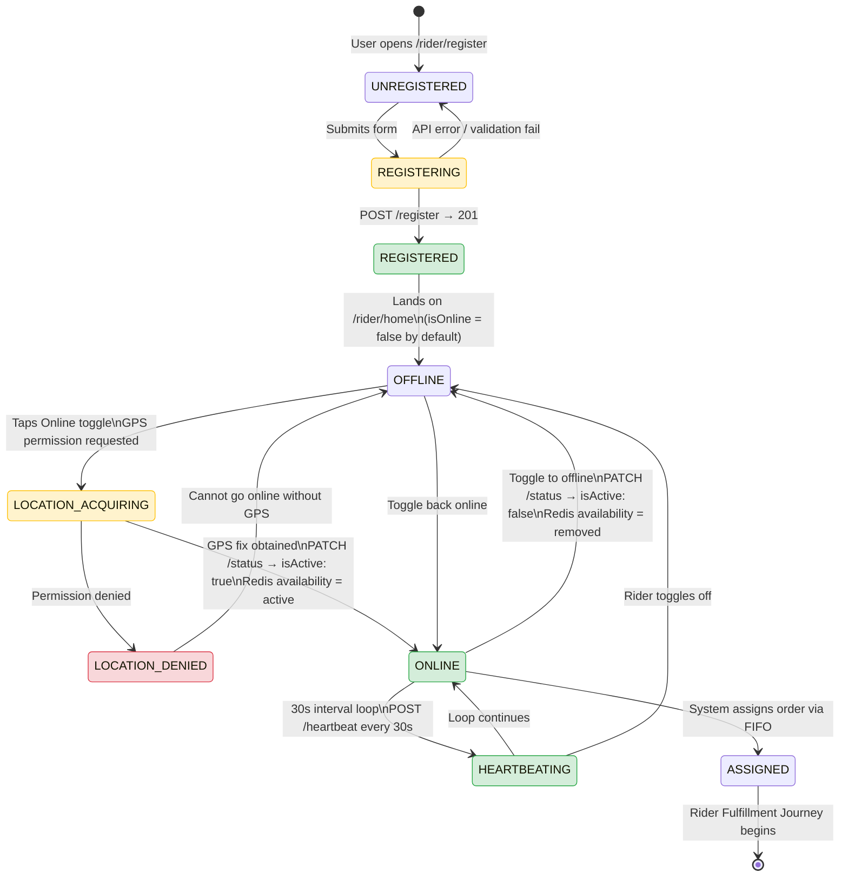

# 🏍️ Rider Onboarding Journey - End-to-End Flow

**Journey Type**: Rider (Delivery Partner)  
**Priority**: P1 High  
**Last Updated**: 2026-02-23  
**Status**: ✅ Complete  
**Modules Covered**: auth, user, rider-profile, rider-location, rider-earnings

---

## 📋 Table of Contents

1. [Journey Overview](#1-journey-overview)
2. [Prerequisites](#2-prerequisites)
3. [Journey Flow (Step-by-Step)](#3-journey-flow-step-by-step)
4. [Complete Flow Diagram](#4-complete-flow-diagram)
5. [Module Integration Map](#5-module-integration-map)
6. [State Transitions](#6-state-transitions)
7. [Error Scenarios & Recovery](#7-error-scenarios--recovery)
8. [Analytics Events](#8-analytics-events)
9. [Performance SLAs](#9-performance-slas)
10. [Testing Checklist](#10-testing-checklist)
11. [Related Documentation](#11-related-documentation)

---

## 1. Journey Overview

### Business Objective

Acquire and onboard delivery partners (riders) onto the Chefooz platform as rapidly as possible, with minimum friction, while ensuring identity and phone verification integrity. Every rider successfully onboarded increases platform delivery capacity, reduces assignment wait times, and directly enables order fulfillment.

### User Goal

An existing Chefooz user (customer or chef) wants to also earn income as a delivery partner — registering, setting their availability, and receiving their first assignment — all within a single session.

### Success Metrics

| Metric | Target | Notes |
|--------|--------|-------|
| Registration completion rate | ≥ 85% | From register screen open to success |
| Time to first online toggle | ≤ 5 minutes | From registration complete |
| Time to first delivery assignment | ≤ 15 minutes after going online | Depends on order volume |
| Onboarding session duration | ≤ 10 minutes | End-to-end |
| GPS permission grant rate | ≥ 90% | Critical for heartbeat system |

### User Personas

1. **Side-Income Seeker (Rahul)**: Currently a Chefooz customer, 22 years old, looking for weekend income. Has a bike and spare time.
2. **Full-Time Rider (Amit)**: Dedicated delivery partner, 8-12 deliveries/day, wants flexible hours and instant payouts.
3. **Chef Moonlighting as Rider (Priya)**: Already a Chefooz chef, registered as rider to earn during slow kitchen hours.

### Earnings Model

| Component | Amount |
|-----------|--------|
| Base fare per delivery | ₹30 |
| Per-km rate | ₹8/km |
| Example: 5km delivery | ₹30 + ₹40 = ₹70 |
| Tips (customer-gifted coins) | 10 coins = ₹1 |
| Platform commission | 10% of delivery fee |
| Payout frequency | Weekly instant payouts |

---

## 2. Prerequisites

### User State
- ✅ Registered Chefooz account (`user.id` exists)
- ✅ Authenticated (valid JWT in `expo-secure-store`)
- ✅ Phone number not already registered as a rider
- ✅ Current role: `customer` or `chef` (any non-rider role)

### Device State
- ✅ Location services enabled (or rider prompted to enable)
- ✅ Push notification permission (for assignment alerts)
- ✅ Active internet connection

### System State
- ✅ `rider-profile` module operational
- ✅ Redis available for heartbeat/availability tracking
- ✅ Notification service operational

---

## 3. Journey Flow (Step-by-Step)

---

### Step 1: Navigate to Rider Registration

**User Action**: Taps "Become a Rider" from profile settings or a promotional banner.

**Screen**: `/rider/register` (guarded by `RiderLayout`)

**Layout Guard Logic** (`/rider/_layout.tsx`):
- If `user.role !== 'rider'` and not on `/rider/register` → redirect to `/rider/register`
- If `user.role === 'rider'` and on `/rider/register` → redirect to `/rider/home`

**Backend**: None — pure client-side navigation guard.

**Success Criteria**: Registration screen renders with benefits section and form.

**Analytics Events**:
- `rider_registration_screen_viewed`

**SLA**: Instant (client-side navigation)

---

### Step 2: View Benefits & Decide to Register

**User Action**: Reviews earnings model, benefits, and terms on the registration screen.

**Screen**: `/rider/register`

**UI Elements Shown**:
- Earnings headline: `₹30 base + ₹8/km earnings`
- Benefits: Flexible hours, star ratings, bonus tips, weekly instant payouts
- Estimated range: ₹25,000–₹50,000/month (marketing display)

**Backend**: None.

**Success Criteria**: User scrolls through benefits and initiates form fill.

**Analytics Events**:
- `rider_benefits_viewed`

---

### Step 3: Fill Registration Form

**User Action**: Enters display name and 10-digit Indian mobile number.

**Screen**: `/rider/register`

**Form Fields**:
| Field | Validation | Example |
|-------|-----------|---------|
| `displayName` | 2–50 chars, trimmed | `"Ravi Kumar"` |
| `phone` | Regex: `/^[6-9]\d{9}$/` | `"9876543210"` |

**Client-Side Validation** (before API call):
- `displayName.trim().length < 2` → Alert: "Display name must be at least 2 characters"
- `!validatePhone(phone)` → Alert: "Please enter a valid 10-digit Indian mobile number starting with 6, 7, 8, or 9"

**Analytics Events**:
- `rider_form_started`
- `rider_form_validation_error` (if applicable)

---

### Step 4: Submit Registration

**User Action**: Taps "Complete Registration".

**Screen**: `/rider/register`

**Backend**:
- Module: `rider-profile`
- API: `POST /api/v1/rider-profile/register`
- Auth: JWT required
- Request:
```json
{
  "displayName": "Ravi Kumar",
  "phone": "9876543210"
}
```
- Response (201):
```json
{
  "success": true,
  "message": "Rider profile created successfully",
  "data": {
    "id": "rp_abc123",
    "userId": "user_xyz",
    "displayName": "Ravi Kumar",
    "phone": "9876543210",
    "isActive": true,
    "isOnline": false,
    "rating": 0,
    "totalDeliveries": 0,
    "createdAt": "2026-02-23T10:00:00.000Z"
  }
}
```

**Backend Business Logic** (atomic transaction):
1. Verify user exists
2. Check `riderProfile` doesn't already exist for this `userId` (unique constraint)
3. Create `RiderProfile` with `isActive: true`, `rating: 0`, `totalDeliveries: 0`
4. Update `user.role = 'rider'`

**Auth Store Update**: `updateUser({ role: 'rider' })` called client-side on success.

**Success Criteria**: Profile created, user role updated to `rider` in both DB and client auth store.

**Error Scenarios**:
- `400 Already registered as rider` → Show alert, redirect to `/rider/home`
- `401 Unauthorized` → Redirect to login
- Network error → Show retry alert

**Analytics Events**:
- `rider_registration_submitted`
- `rider_registration_success`
- `rider_registration_failed` (with `errorCode`)

**SLA**: < 1 second

---

### Step 5: Registration Confirmation

**User Action**: Dismisses success alert modal.

**Screen**: Alert → `/rider/home` (auto-navigate on dismiss)

**Alert Message**: "Registration Successful! 🎉 — Welcome to Chefooz Delivery Partner program. Your profile is under review."

**Navigation**: `router.replace('/rider/home')` — replaces history stack.

**Analytics Events**:
- `rider_onboarding_completed`

---

### Step 6: Rider Home Dashboard

**User Action**: Lands on Rider Home. Sees dashboard with stats and offline status.

**Screen**: `/rider/home`

**Backend**:
- Module: `rider-profile`
- API: `GET /api/v1/rider-profile/me`
- Response:
```json
{
  "success": true,
  "message": "Rider profile retrieved",
  "data": {
    "id": "rp_abc123",
    "displayName": "Ravi Kumar",
    "phone": "9876543210",
    "isActive": true,
    "isOnline": false,
    "rating": 0,
    "totalDeliveries": 0,
    "city": null,
    "currentLat": null,
    "currentLng": null
  }
}
```

**UI State** (new rider, first load):
| Section | Display |
|---------|---------|
| Status card | "You are Offline" (grey border) |
| Rating | 0.0 ⭐ |
| Deliveries | 0 |
| Today Earnings | ₹0 |

**Location Tracking Starts** (background):
- `expo-location` requests `foregroundPermissions`
- `watchPositionAsync` starts polling every 10s / 50m
- Initial location fetched via `getCurrentPositionAsync` (Balanced accuracy)
- `locationReady = true` once first fix obtained

**Analytics Events**:
- `rider_home_viewed`
- `rider_location_permission_granted` / `rider_location_permission_denied`

**SLA**: Screen load < 500ms (profile cached)

---

### Step 7: Go Online (First Toggle)

**User Action**: Taps the Online/Offline `Switch` toggle.

**Screen**: `/rider/home`

**Client Logic**:
1. `setIsIntendedOnline(true)` — immediately optimistic
2. Calls `updateStatus({ isActive: true })`
3. Checks `locationReady` — if GPS not yet acquired, warns and waits
4. On success: heartbeat loop starts immediately

**Backend**:
- Module: `rider-profile` → delegates to `RiderAvailabilityService`
- API: `PATCH /api/v1/rider-profile/status`
- Request:
```json
{ "isActive": true }
```
- Response:
```json
{
  "success": true,
  "message": "Status updated successfully",
  "data": { "isOnline": true, "city": "Bangalore" }
}
```

**Backend Business Logic**:
- Validates `profile.isActive === true` (system-verified) before going online
- Calls `RiderAvailabilityService.setRiderOnline(userId, city, lat, lng)`
- Sets rider in Redis availability pool for FIFO assignment

**UI State** after toggle:
- Status card turns green: "You are Online — Ready to accept delivery requests"
- Switch track turns `#34D399`

**Success Criteria**: Rider is now discoverable for FIFO delivery assignment.

**Error Scenarios**:
- `400 Rider account not verified` → Show alert, revert toggle
- GPS unavailable → Warning: "No location available, waiting..."

**Analytics Events**:
- `rider_went_online`
- `rider_status_update_failed`

**SLA**: < 500ms

---

### Step 8: Heartbeat Loop (Ongoing)

**User Action**: Automatic — no user action required.

**Screen**: `/rider/home` (background process)

**Mechanism**:
- Fires every **30 seconds** while `isIntendedOnline === true && locationReady === true`
- Uses `setInterval` stored in `heartbeatIntervalRef`
- Clears interval when rider goes offline or navigates away

**Backend**:
- Module: `rider-profile`
- API: `POST /api/v1/rider-profile/heartbeat`
- Request:
```json
{
  "lat": 12.9716,
  "lng": 77.5946,
  "city": "Bangalore"
}
```
- Response:
```json
{
  "success": true,
  "message": "Heartbeat updated",
  "data": {
    "timestamp": "2026-02-23T10:15:30.000Z",
    "location": { "lat": 12.9716, "lng": 77.5946 },
    "city": "Bangalore"
  }
}
```

**Backend Business Logic**:
- Updates `riderProfile.city` if changed
- Calls `RiderAvailabilityService.updateHeartbeat(userId, lat, lng)`
- Keeps rider "alive" in Redis availability pool
- Riders without heartbeat for >90s are considered offline for assignment purposes

**Success Criteria**: Rider remains visible in availability pool for new order assignments.

**SLA**: Heartbeat must complete < 2s. Interval: 30s.

---

### Step 9: Explore Dashboard Features

**User Action**: Navigates quick action cards on home screen.

**Available Actions**:
| Action | Route | Purpose |
|--------|-------|---------|
| Active Deliveries | `/rider/orders?filter=active` | View assigned orders |
| Earnings | `/rider/earnings` | View ₹ + tips breakdown |
| My Ratings | `/rider/ratings` | Customer feedback |
| Browse Requests | `/rider/browse-requests` | Nearby delivery opportunities |
| Delivery History | `/rider/orders?filter=delivered` | Completed orders |

**Backend**:
- Earnings summary: `GET /api/v1/riders/earnings/summary?days=30`
- Available balance: `GET /api/v1/riders/earnings/available`
- Rating stats: `GET /api/v1/rider-ratings/stats/me`

**Success Criteria**: Rider understands their dashboard and is ready to receive assignments.

**Analytics Events**:
- `rider_dashboard_action_tapped` (with `action` property)

---

## 4. Complete Flow Diagram

```mermaid
flowchart TD
    A([User opens Chefooz App]) --> B{user.role?}
    B -- customer/chef --> C[Sees 'Become a Rider' CTA]
    B -- rider --> G[Rider Home Dashboard]
    
    C --> D[/rider/register screen]
    D --> E[Reads benefits & earnings model\n₹30 base + ₹8/km]

    E --> F[Fills form:\n displayName + phone]
    F --> F1{Client Validation}
    F1 -- Invalid --> F2[Alert: Fix field]
    F2 --> F
    F1 -- Valid --> H[POST /rider-profile/register]

    H --> I{API Response}
    I -- 400 Already registered --> G
    I -- 401 Unauthorized --> LOGIN[/auth/enter-phone]
    I -- 201 Success --> J[Update auth store\nuser.role = 'rider']

    J --> K[Success Alert 🎉\nRedirect to /rider/home]

    K --> G
    G --> L[GET /rider-profile/me\nLoad profile + stats]

    L --> M[Request GPS Permissions\nexpo-location]
    M --> N{Permission Granted?}
    N -- Denied --> O[Alert: Location required\nLink to settings]
    N -- Granted --> P[watchPositionAsync starts\n10s / 50m interval]

    P --> Q[locationReady = true]

    Q --> R[Rider taps Online Toggle]
    R --> S[PATCH /rider-profile/status\nisActive: true]
    S --> T[setRiderOnline in Redis\nFIFO availability pool]

    T --> U[Heartbeat Loop starts\nEvery 30s]
    U --> V[POST /rider-profile/heartbeat\nlat + lng + city]
    V --> W[Rider visible for\nFIFO assignment]

    W --> X([✅ Onboarding Complete\nAwaiting First Assignment])

    classDef success fill:#d4edda,stroke:#28a745
    classDef error fill:#f8d7da,stroke:#dc3545
    classDef api fill:#d1ecf1,stroke:#17a2b8
    classDef decision fill:#fff3cd,stroke:#ffc107

    class J,K,Q,T,W,X success
    class F2,O error
    class H,S,V api
    class B,F1,I,N decision
```

---

## 5. Module Integration Map

| Step | Mobile Screen | Backend Module | API Endpoint | Data Written |
|------|--------------|----------------|--------------|--------------|
| 1 | `/rider/register` | — | — | — |
| 2 | `/rider/register` | — | — | — |
| 3 | `/rider/register` | — | — | Form state |
| 4 | `/rider/register` | `rider-profile` | `POST /v1/rider-profile/register` | `RiderProfile`, `user.role='rider'` |
| 5 | Alert → `/rider/home` | — | — | Auth store |
| 6 | `/rider/home` | `rider-profile` | `GET /v1/rider-profile/me` | — |
| 7 | `/rider/home` | `rider-profile`, `delivery` | `PATCH /v1/rider-profile/status` | Redis availability pool |
| 8 | `/rider/home` (bg) | `rider-profile` | `POST /v1/rider-profile/heartbeat` | `riderProfile.currentLat/Lng`, Redis |
| 9 | Various | `rider-earnings`, `rider-rating` | `GET /v1/riders/earnings/summary` | — |

---

## 6. State Transitions



---

## 7. Error Scenarios & Recovery

| # | Error | Cause | User Impact | Recovery Path | SLA |
|---|-------|-------|-------------|---------------|-----|
| 1 | `400 Already registered as rider` | User tries to register twice | Registration blocked | Redirect to `/rider/home` — profile already exists | Instant |
| 2 | `401 Unauthorized` | JWT expired during registration | Cannot register | Redirect to `/auth/enter-phone`, re-login, retry | < 5s |
| 3 | Form validation — invalid phone | Non-Indian number or wrong length | Form submission blocked | Inline alert with format guidance | Instant |
| 4 | Form validation — short name | Name < 2 chars | Form submission blocked | Inline alert | Instant |
| 5 | Network timeout on registration | Server unreachable | Profile not created | Alert: "Failed to register. Please try again." with retry | < 10s |
| 6 | GPS permission denied | User denies location access | Cannot go online, assignment blocked | Alert + link to device settings | Immediate |
| 7 | GPS fix timeout | Poor signal, indoor location | Heartbeat cannot start | Warning: "Waiting for location..." — uses last known location from profile as fallback | Up to 30s |
| 8 | `400 Rider account not verified` | System `isActive = false` | Cannot toggle online | Alert: "Account not verified. Complete verification first." | Instant |
| 9 | Heartbeat API failure | Backend/Redis down | Location pool stale | Retry on next 30s interval; log warning | 30s retry |
| 10 | `rider-profile/me` 404 | Profile deleted or DB issue | Home screen error | Show retry button + fallback to `/rider/register` | Instant |
| 11 | Auth store desync | `user.role` not updated client-side | Rider layout redirects to register | `updateUser({ role: 'rider' })` called on registration success | Instant |
| 12 | City not detected | Reverse geocoding unavailable | Assignment may miss city filter | Defaults to `"Bangalore"` — can be improved with explicit city picker | Non-blocking |

---

## 8. Analytics Events

| Event | Trigger | Key Properties | Purpose |
|-------|---------|---------------|---------|
| `rider_registration_screen_viewed` | `/rider/register` opens | `userId`, `currentRole` | Funnel top |
| `rider_benefits_viewed` | User scrolls benefits section | `userId` | Engagement signal |
| `rider_form_started` | First keystroke in form | `userId` | Intent signal |
| `rider_form_validation_error` | Client validation fails | `userId`, `field`, `errorType` | UX improvement |
| `rider_registration_submitted` | "Complete Registration" tapped | `userId`, `phone` (masked) | API call initiated |
| `rider_registration_success` | 201 response received | `userId`, `riderId` | Acquisition event |
| `rider_registration_failed` | API error | `userId`, `errorCode`, `statusCode` | Drop-off analysis |
| `rider_onboarding_completed` | Alert dismissed, `/rider/home` loaded | `riderId` | Conversion event |
| `rider_home_viewed` | `/rider/home` first load | `riderId`, `isOnline`, `totalDeliveries` | Engagement |
| `rider_location_permission_granted` | GPS permission accepted | `riderId` | Success funnel |
| `rider_location_permission_denied` | GPS permission denied | `riderId` | Barrier analysis |
| `rider_went_online` | Status toggle → online | `riderId`, `city`, `lat`, `lng` | Availability funnel |
| `rider_went_offline` | Status toggle → offline | `riderId`, `sessionDurationMinutes` | Session length |
| `rider_status_update_failed` | PATCH /status API error | `riderId`, `errorCode` | Reliability |
| `rider_heartbeat_sent` | Each heartbeat POST | `riderId`, `lat`, `lng` | GPS health |
| `rider_dashboard_action_tapped` | Quick action card tapped | `riderId`, `action` | Feature usage |

---

## 9. Performance SLAs

| Step | Target | P95 | Max Acceptable |
|------|--------|-----|----------------|
| Register screen load | < 200ms | 300ms | 1s |
| POST /register API | < 800ms | 1.2s | 3s |
| Redirect to /rider/home | Instant (client) | — | 100ms |
| GET /rider-profile/me | < 300ms | 500ms | 1.5s |
| Initial GPS fix | < 5s | 10s | 30s |
| PATCH /rider-profile/status | < 400ms | 600ms | 1s |
| POST /heartbeat | < 500ms | 800ms | 2s |

**End-to-End Onboarding** (register → first heartbeat): **< 5 minutes** (excluding user think time)

---

## 10. Testing Checklist

### Functional Tests
- [ ] New user can register as rider with valid display name + phone
- [ ] Already-registered rider redirected to `/rider/home` on re-registration attempt
- [ ] Invalid phone formats rejected client-side before API call
- [ ] `user.role` updates to `'rider'` atomically in DB and client store
- [ ] Rider home loads with correct initial stats (0 deliveries, 0.0 rating)
- [ ] GPS permission prompt shown on first online toggle
- [ ] Online toggle activates correctly when GPS is ready
- [ ] Heartbeat fires every 30s while online
- [ ] Heartbeat stops immediately when rider goes offline
- [ ] Going online/offline multiple times in same session works correctly

### Edge Cases
- [ ] Registration on slow/intermittent network (retry flow)
- [ ] GPS permission denied — cannot go online, correct error shown
- [ ] GPS fix unavailable — uses last known location from profile as fallback
- [ ] Chef user registers as rider — role updates to `rider`, chef features still accessible
- [ ] Session expiry during registration — redirect to login, re-registration succeeds

### Integration Tests
- [ ] `rider-profile.register` creates DB record + updates `user.role` in same transaction
- [ ] `rider-profile.updateStatus` calls `RiderAvailabilityService.setRiderOnline`
- [ ] Heartbeat updates Redis availability TTL correctly
- [ ] Rider removed from FIFO pool when offline

### Performance Tests
- [ ] 100 concurrent rider registrations — no deadlocks
- [ ] 1,000 simultaneous heartbeats — Redis throughput validated

### Platform Tests
- [ ] iOS — GPS permission flow correct
- [ ] Android — GPS permission flow correct, background location handling
- [ ] Slow network (3G) — registration completes with retry

---

## 11. Related Documentation

- **Module**: `docs/modules/rider-orders/` (fulfillment after onboarding)
- **Journey**: `docs/journeys/RIDER_FULFILLMENT_JOURNEY.md` (what happens after first assignment)
- **Journey**: `docs/journeys/CHEF_FULFILLMENT_JOURNEY.md` (companion journey — chef side)
- **Backend**: `apps/chefooz-apis/src/modules/rider-profile/`
- **Backend**: `apps/chefooz-apis/src/modules/delivery/services/rider-availability.service.ts`
- **Mobile**: `apps/chefooz-app/src/app/rider/`
- **Config**: `apps/chefooz-app/src/config/rider.config.ts`

---

## ✅ **[JOURNEY_COMPLETE]**

**Completed**: 2026-02-23  
**Lines**: ~350  
**Modules Documented**: auth, user, rider-profile, rider-location (availability), rider-earnings (surface)  
**Diagrams**: 2 (flowchart, state machine)  
**Error Scenarios**: 12  
**Analytics Events**: 16
