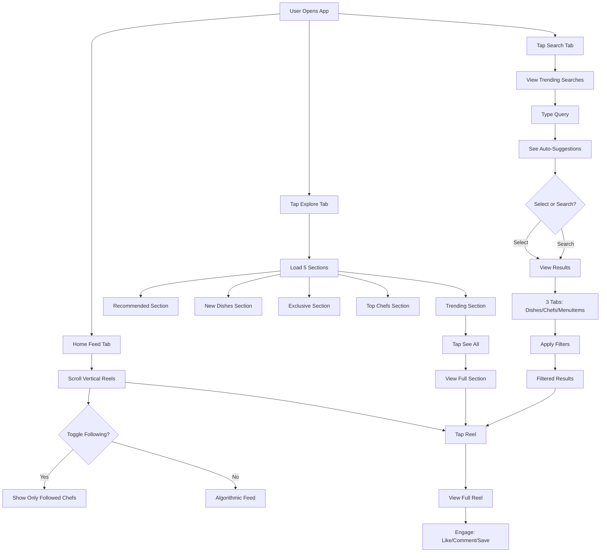
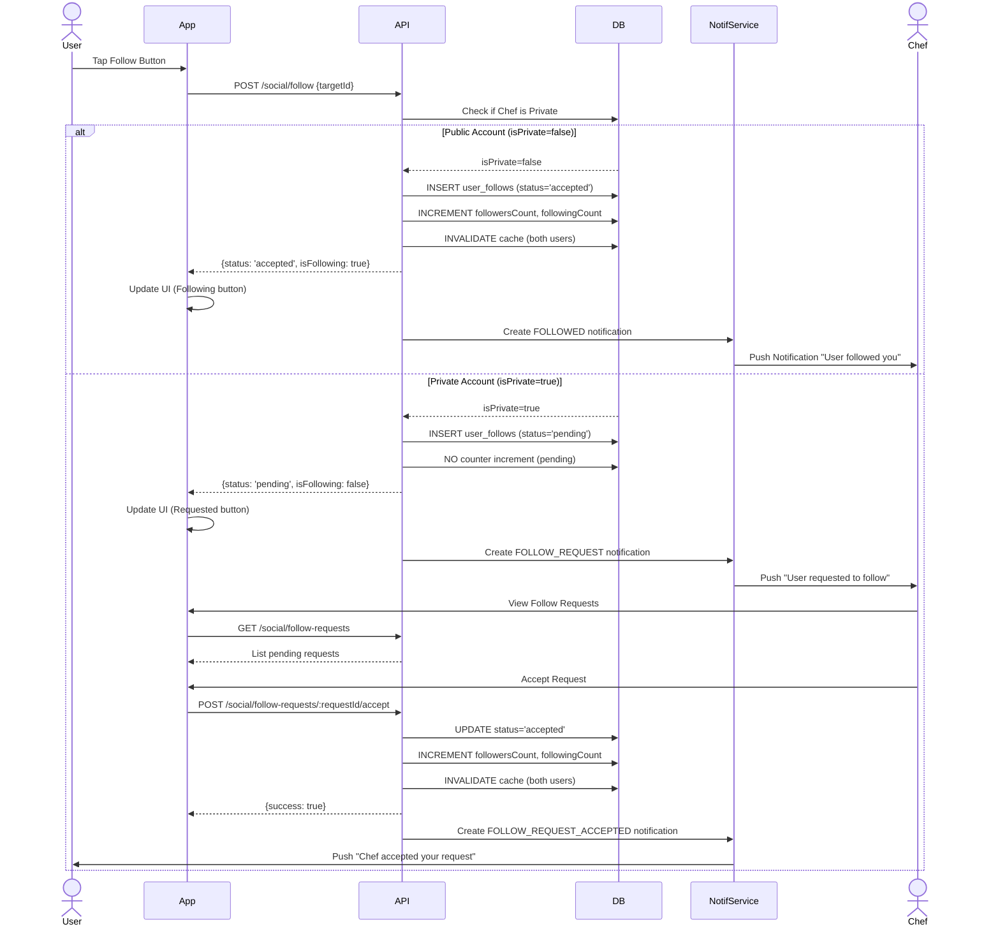
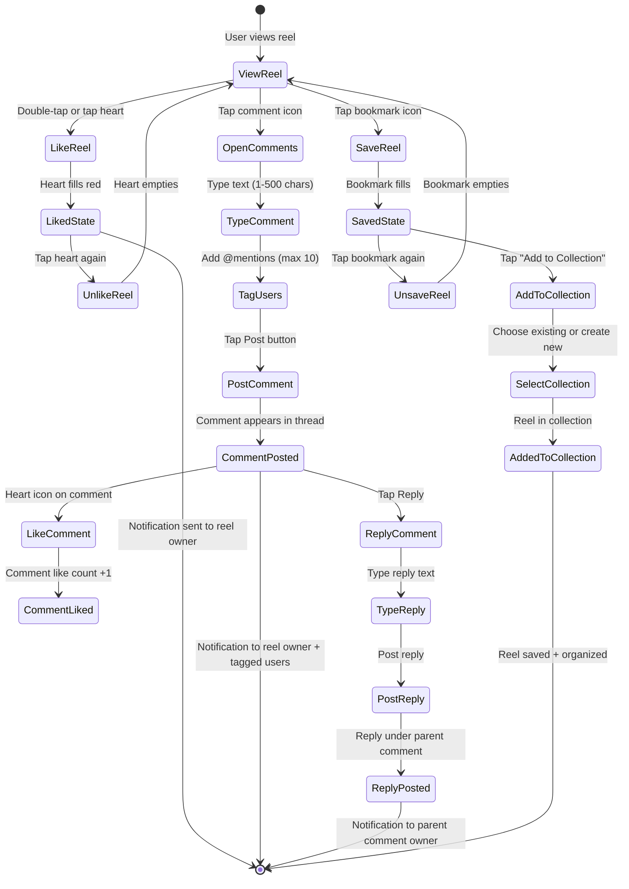
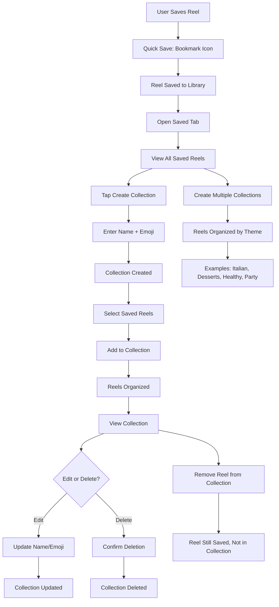
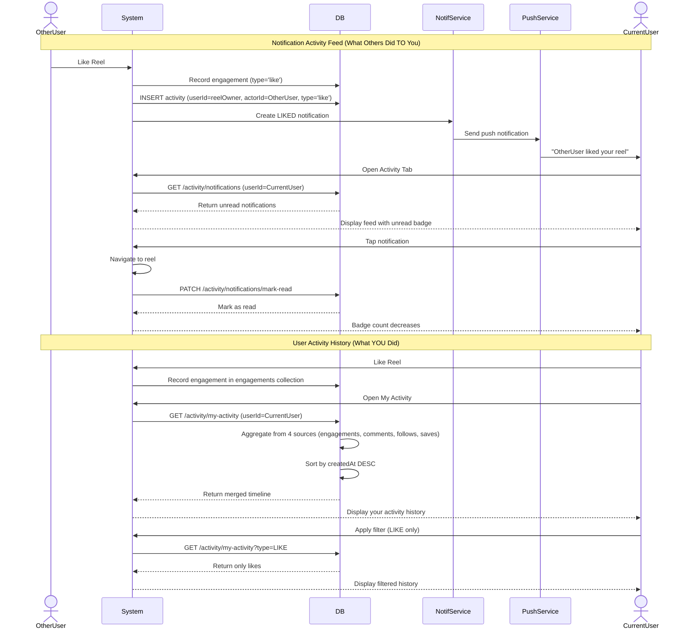
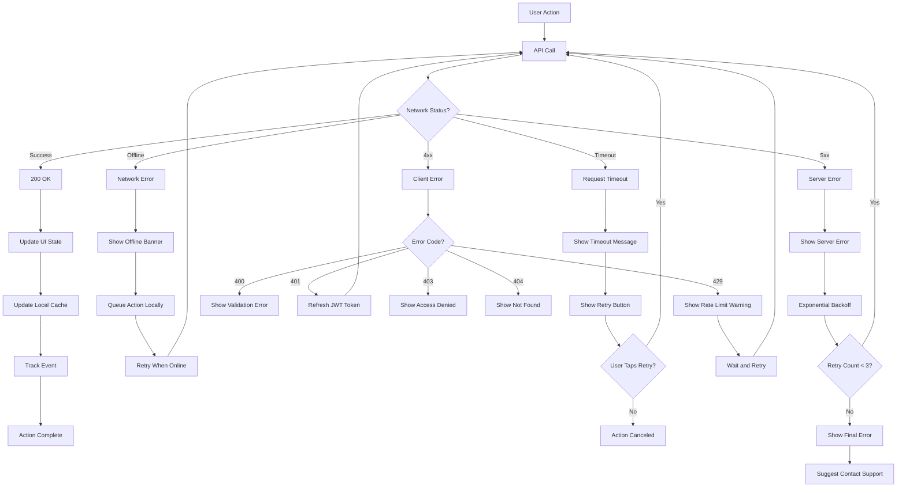
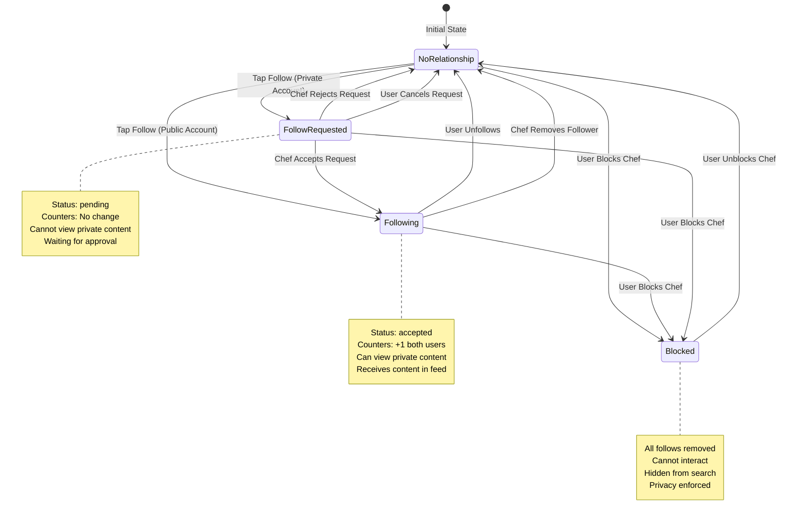

# 🤝 Social Engagement Journey

**Version:** 1.0  
**Last Updated:** February 22, 2026  
**Status:** ✅ Production Ready  
**Journey Type:** Phase 1 - Core User Experience

---

## 📋 Table of Contents

1. [Journey Overview](#1-journey-overview)
2. [Prerequisites & Entry Points](#2-prerequisites--entry-points)
3. [Step-by-Step Flow](#3-step-by-step-flow)
4. [Complete Flow Diagrams](#4-complete-flow-diagrams)
5. [Module Integration Map](#5-module-integration-map)
6. [API Call Sequences](#6-api-call-sequences)
7. [State Transitions](#7-state-transitions)
8. [Error Scenarios & Recovery](#8-error-scenarios--recovery)
9. [Analytics & Tracking](#9-analytics--tracking)
10. [Performance SLAs](#10-performance-slas)
11. [Testing Strategy](#11-testing-strategy)
12. [Related Documentation](#12-related-documentation)

---

## 1. Journey Overview

### 1.1 Purpose

The **Social Engagement Journey** enables users to discover, follow, and interact with chefs and their content through Instagram-style social features. This journey covers discovery (Feed, Explore, Search), social relationships (Follow/Unfollow), engagement (Like, Comment, Save), content organization (Collections), and activity tracking (Notifications).

### 1.2 Business Objectives

**Primary Goals:**
- **Discovery**: 60% DAU use Explore, 40% DAU use Search
- **Social Graph**: Average 50+ followers per chef
- **Engagement**: 15%+ save rate, 8%+ comment rate
- **Retention**: 40%+ users revisit saved content
- **Conversion**: 8% Explore→Order, 12% Search→Order

**Success Metrics:**
- Follow conversion: 100% (public), 60-80% (private)
- Average engagement time: 5+ minutes per session
- Collections created: 3-5 per active user
- Daily active engagers: 70%+ of DAU

### 1.3 User Personas

**Primary Personas:**

**1. Food Explorer (Sarah)**
- Age: 25-35
- Goal: Discover new recipes and chefs
- Behavior: Browses Explore, searches for specific cuisines
- Engagement: Saves recipes, follows favorite chefs
- Pain Point: Too much content, needs organization

**2. Engaged Follower (Amit)**
- Age: 30-45
- Goal: Stay updated with favorite chefs
- Behavior: Checks feed daily, comments on reels
- Engagement: High interaction rate, creates collections
- Pain Point: Wants to track activity history

**3. Social Chef (Priya)**
- Age: 28-40
- Goal: Build follower base and engagement
- Behavior: Posts regularly, responds to comments
- Engagement: Monitors likes/comments, pins important feedback
- Pain Point: Wants to understand which content resonates

### 1.4 Journey Scope

**In Scope:**
- Browse home feed (algorithmic + following filter)
- Discover content via Explore (5 curated sections)
- Search for dishes, chefs, menu items
- Follow/unfollow chefs (public + private accounts)
- Like reels and comments
- Comment on reels with threading and mentions
- Save reels to collections
- Organize collections
- View notification activity feed
- Track personal activity history

**Out of Scope:**
- Order placement (covered in Customer Order Journey)
- Content creation (covered in Content Creation Journey)
- Chef profile setup (covered in Chef Onboarding Journey)
- Direct messaging (future)
- Live streaming engagement (future)

---

## 2. Prerequisites & Entry Points

### 2.1 Prerequisites

**Account Requirements:**
- ✅ Registered user account (email/phone verified)
- ✅ Authenticated with valid JWT token
- ✅ Profile setup complete (username, full name)
- ✅ Location permissions granted (optional, for nearby content)

**App State:**
- ✅ App installed and onboarding complete
- ✅ Network connectivity available
- ✅ JWT token stored in expo-secure-store
- ✅ User logged in (auth state = authenticated)

**Technical Requirements:**
- ✅ iOS 13+ or Android 10+
- ✅ Expo SDK 52+
- ✅ Axios API client configured
- ✅ React Query cache initialized

### 2.2 Entry Points

**Entry Point 1: Home Feed Tab**
- **Location**: Bottom navigation → Feed icon (house)
- **State**: Default landing screen after login
- **Action**: User scrolls feed, discovers content

**Entry Point 2: Explore Tab**
- **Location**: Bottom navigation → Explore icon (magnifying glass)
- **State**: Shows 5 curated sections
- **Action**: User browses Trending, Recommended, New Dishes

**Entry Point 3: Search Tab**
- **Location**: Bottom navigation → Search icon
- **State**: Shows trending searches, auto-suggestions
- **Action**: User types query, applies filters

**Entry Point 4: Chef Profile**
- **Location**: Tap chef name/avatar from reel or search
- **State**: Shows chef bio, follow button, reels grid
- **Action**: User follows chef, views their content

**Entry Point 5: Activity Tab**
- **Location**: Bottom navigation → Activity icon (bell)
- **State**: Shows notification feed with unread count
- **Action**: User views likes, comments, new followers

**Entry Point 6: Saved Tab**
- **Location**: Profile → Saved icon (bookmark)
- **State**: Shows all saved reels and collections
- **Action**: User revisits saved content

---

## 3. Step-by-Step Flow

### Step 1: Browse Home Feed

**Objective**: Discover content from followed chefs and algorithmic recommendations

**User Actions:**
1. Open app → Lands on Home Feed tab
2. Scroll through reels (vertical swipe)
3. Toggle "Following" filter to see only followed chefs
4. Tap reel to view details
5. Interact with content (like, comment, save, share)

**API Calls:**
```
GET /api/v1/feed?limit=10&cursor=<timestamp>
Response:
{
  "items": [
    {
      "reelId": "507f1f77bcf86cd799439011",
      "chef": { userId, username, fullName, avatar },
      "media": { thumbnailUrl, videoUrl },
      "stats": { views, likes, comments, saves },
      "hasLiked": false,
      "hasSaved": false,
      "isFollowing": true
    }
  ],
  "nextCursor": "2026-02-22T10:00:00Z"
}
```

**Business Rules:**
- Feed ranking: Engagement score + recency + CRS boost
- Following filter: Shows only reels from followed chefs
- Privacy: Respects blocks (hidden reels)
- Availability: Shows only online chefs (deliverable items)
- Pagination: 10 reels per page (cursor-based)

**UI States:**
- Loading: Skeleton loader (10 cards)
- Empty: "Follow chefs to see their content"
- Error: "Unable to load feed" with retry

**Analytics Events:**
```typescript
track('feed_viewed', { source: 'home_tab', itemsCount: 10 });
track('reel_viewed', { reelId, chefId, source: 'feed' });
track('following_filter_toggled', { enabled: true });
```

---

### Step 2: Discover via Explore

**Objective**: Find new content through curated sections (Trending, Recommended, New Dishes)

**User Actions:**
1. Tap Explore tab (magnifying glass icon)
2. View consolidated sections (5 sections in one API call)
3. Tap "See All" on any section for full list
4. Browse section reels (horizontal scroll)
5. Tap reel card → View full reel
6. Follow chef or order dish

**Explore Sections:**

**2.1 Trending Section**
- Shows 5 viral reels with high engagement velocity
- Ranking: Like rate + comment rate + save rate (last 24h)
- Updates: Hourly aggregation via cron job

**2.2 Recommended For You**
- Shows 5 personalized reels
- Ranking: User follows + past orders + engagement history
- Personalization: Learns from behavior over time

**2.3 New Dishes**
- Shows 5 recently uploaded reels (last 48h)
- Ranking: Newest first with availability filter
- Fresh content: Prioritizes recent uploads

**2.4 Exclusive (Promoted)**
- Shows 3 promoted/sponsored content
- Ranking: Paid placement with relevance score
- Revenue: Commission-based promotion

**2.5 Top Chefs**
- Shows 5 featured chef cards
- Ranking: CRS reputation + follower count
- Discovery: Chef-focused section

**API Calls:**
```
GET /api/v1/explore/sections
Response:
{
  "trending": { sectionId: 'trending', items: [5 reels] },
  "recommended": { sectionId: 'recommended', items: [5 reels] },
  "newDishes": { sectionId: 'new-dishes', items: [5 reels] },
  "exclusive": { sectionId: 'exclusive', items: [3 reels] },
  "topChefs": { sectionId: 'top-chefs', items: [5 chef cards] },
  "trendingHashtags": { tags: [10 hashtags] }
}
```

**Business Rules:**
- Food-first ranking (prioritizes dishes over raw video)
- Availability-aware (only online chefs)
- Privacy enforcement (respects blocks, private accounts)
- Section-specific caching (1h for trending, 15m for recommended)
- Deduplication across sections

**Analytics Events:**
```typescript
track('explore_viewed', { timestamp: Date.now() });
track('explore_section_viewed', { sectionId: 'trending' });
track('explore_see_all_clicked', { sectionId: 'trending' });
track('explore_reel_clicked', { reelId, sectionId: 'trending' });
```

---

### Step 3: Search for Content

**Objective**: Find specific dishes, chefs, or menu items using full-text search

**User Actions:**
1. Tap Search tab (search icon)
2. View trending searches and suggestions
3. Type query (e.g., "butter chicken")
4. See real-time auto-suggestions
5. Select suggestion or press search
6. View results in 3 tabs: Dishes, Chefs, Menu Items
7. Apply filters (location, price, rating, cuisine, hashtags)
8. Sort by relevance or recent
9. Tap result → View reel or chef profile

**Search Features:**

**3.1 Full-Text Search (Elasticsearch)**
- Multi-index search: dishes (reels), menu items, chefs
- Search fields: captions (3× boost), hashtags (2× boost), chef name (1× boost)
- Fuzzy matching: Typo-tolerant (85% correction rate)
- Examples:
  - "paner tikka" → "paneer tikka"
  - "byrani" → "biryani"
  - "butr chiken" → "butter chicken"

**3.2 Advanced Filters**
- **Location**: Latitude, longitude, radius (km)
- **Price**: Min/max range
- **Rating**: 4+ stars filter
- **Cuisine**: Italian, Indian, Chinese, etc.
- **Hashtags**: #vegan, #glutenfree, #spicy

**3.3 Auto-Suggestions**
- Real-time as user types (debounced 300ms)
- Powered by Elasticsearch completion suggester
- Shows 5-10 suggestions
- Highlights matching text

**API Calls:**
```
GET /api/v1/search/autocomplete?q=butt
Response:
{
  "suggestions": ["butter chicken", "butter naan", "buttery desserts"]
}

POST /api/v1/search
Body:
{
  "query": "butter chicken",
  "filters": {
    "lat": 28.6139,
    "lng": 77.2090,
    "radiusKm": 10,
    "priceMin": 100,
    "priceMax": 500,
    "rating": 4,
    "cuisines": ["Indian"],
    "hashtags": ["#spicy"]
  },
  "sort": "relevance",
  "limit": 20,
  "cursor": null
}
Response:
{
  "dishes": { items: [20 reels], nextCursor },
  "chefs": { items: [10 users], nextCursor },
  "menuItems": { items: [15 items], nextCursor },
  "facets": {
    "cuisines": { "Indian": 45, "Italian": 12 },
    "priceRanges": { "0-200": 20, "200-500": 30 }
  }
}
```

**Business Rules:**
- Performance: <500ms latency (P95)
- Fallback: PostgreSQL full-text if Elasticsearch unavailable
- Zero results: Show similar suggestions or trending content
- Search analytics: Log queries, trending searches, CTR
- Privacy: Excludes blocked users from results

**Analytics Events:**
```typescript
track('search_query_submitted', { query: 'butter chicken', resultsCount: 45 });
track('search_filter_applied', { filterType: 'cuisine', value: 'Indian' });
track('search_result_clicked', { reelId, query, position: 3 });
track('search_zero_results', { query: 'exotic dish' });
```

---

### Step 4: Follow Creators

**Objective**: Build social graph by following chefs for content updates

**User Actions:**
1. Discover chef via feed, explore, search, or reel
2. Tap chef profile → View bio, stats, reels grid
3. Tap "Follow" button
4. If public account: Instant follow (status = accepted)
5. If private account: Pending request (status = pending)
6. Notification sent to chef
7. Chef profile updates: Following count increments

**Follow System:**

**4.1 Public Accounts (isPrivate=false)**
- Auto-accept follow requests
- Instant follower access to all content
- Status: 'accepted' from the start
- Notification: FOLLOWED event sent instantly
- No approval needed

**4.2 Private Accounts (isPrivate=true)**
- Follow requests pending until approved
- Status: 'pending' → 'accepted' (after approval)
- Followers see content only after acceptance
- Notification: FOLLOWED (isPending=true) → FOLLOW_REQUEST_ACCEPTED
- Chef must manually accept/reject

**4.3 Unfollow**
- Tap "Following" button → Confirm unfollow
- Removes follow relationship
- Decrements follower/following counters
- Invalidates cache for both users
- No notification sent (soft action)

**4.4 Remove Follower (Instagram-style)**
- Chef removes their follower (soft removal)
- No notification sent to removed user
- Decrements counters
- User can re-follow if desired

**API Calls:**
```
POST /api/v1/social/follow
Body: { targetId: "chef-uuid" }
Response:
{
  "success": true,
  "status": "accepted",  // or "pending"
  "isFollowing": true,
  "isPrivate": false
}

DELETE /api/v1/social/unfollow/:targetId
Response:
{
  "success": true,
  "isFollowing": false
}

GET /api/v1/social/followers/:userId?limit=20&cursor=...
GET /api/v1/social/following/:userId?limit=20&cursor=...
Response:
{
  "items": [
    { userId, username, fullName, avatar, isFollowing, isFollowedBy }
  ],
  "nextCursor": "2026-02-22T09:00:00Z"
}
```

**Business Rules:**
- Rate limit: 30 follows/min, 30 unfollows/min
- Self-follow prevention: Cannot follow yourself
- Block enforcement: Cannot follow blocked users
- Counter updates: Only for accepted follows
- Cache invalidation: Both user profiles on follow/unfollow

**UI States:**
- **Not Following**: Blue "Follow" button
- **Following**: Gray "Following" button (tap to unfollow)
- **Pending**: Yellow "Requested" button (private account)
- **Blocked**: No button shown

**Analytics Events:**
```typescript
track('user_followed', { targetUserId, isPrivate: false, source: 'profile' });
track('follow_request_sent', { targetUserId, isPrivate: true });
track('user_unfollowed', { targetUserId, source: 'profile' });
track('follower_removed', { removedUserId });
```

---

### Step 5: Engage with Content (Like, Comment, Save)

**Objective**: Express appreciation and interact with reels through multiple engagement types

**5.1 Like Reels**

**User Actions:**
1. View reel in feed or profile
2. Double-tap reel or tap heart icon
3. Heart animates (fills red)
4. Like count increments
5. Notification sent to reel owner

**API Calls:**
```
POST /api/v1/reels/:reelId/like
Response:
{
  "success": true,
  "hasLiked": true,
  "likeCount": 147
}

DELETE /api/v1/reels/:reelId/unlike
Response:
{
  "success": true,
  "hasLiked": false,
  "likeCount": 146
}
```

**Business Rules:**
- Idempotent toggle (like/unlike)
- One like per user per reel (unique constraint)
- Real-time counter update in MongoDB
- Notification: LIKED event to reel owner
- No self-like notification (filtered)

**5.2 Comment on Reels**

**User Actions:**
1. Tap comment icon on reel
2. Opens comment sheet with keyboard
3. Type comment (1-500 characters)
4. Tag users with @username (max 10 tags)
5. Tap "Post" → Comment created
6. Comment appears in thread (chronological)
7. Notification sent to reel owner + tagged users

**Comment Features:**
- **1-Level Threading**: Comment → Replies (no nested replies)
- **User Tagging**: Tag up to 10 users (@username)
- **Like Comments**: Heart icon on each comment
- **Pin Comments**: Creator can pin one comment per reel
- **Edit/Delete**: Owner can edit (5 min) or delete anytime
- **Reply Count**: Badge showing reply count on parent comments

**API Calls:**
```
POST /api/v1/comments
Body:
{
  "reelId": "507f1f77bcf86cd799439011",
  "text": "This looks amazing! @chef_rakesh",
  "taggedUserIds": ["uuid-1"],
  "parentCommentId": null  // null for top-level, commentId for reply
}
Response:
{
  "commentId": "new-comment-uuid",
  "text": "This looks amazing! @chef_rakesh",
  "author": { userId, username, fullName, avatar },
  "createdAt": "2026-02-22T10:30:00Z",
  "likesCount": 0,
  "repliesCount": 0,
  "isPinned": false
}

GET /api/v1/comments?reelId=...&limit=20&cursor=...
Response:
{
  "items": [
    {
      "commentId": "uuid",
      "text": "Great dish!",
      "author": { userId, username, avatar },
      "likesCount": 5,
      "repliesCount": 2,
      "hasLiked": false,
      "isPinned": true,
      "createdAt": "2026-02-22T10:00:00Z"
    }
  ],
  "nextCursor": "uuid"
}

POST /api/v1/comments/:commentId/like
DELETE /api/v1/comments/:commentId/unlike
PATCH /api/v1/comments/:commentId/pin
DELETE /api/v1/comments/:commentId
```

**Business Rules:**
- Text length: 1-500 characters
- Max tags: 10 users per comment
- Threading: 1 level only (comment → replies)
- Pinning: Only reel owner, max 1 pinned per reel
- Edit window: 5 minutes after posting
- Delete: Owner only, soft delete with cascade
- Notifications: COMMENTED (reel owner), MENTIONED (tagged users), REPLY (parent comment owner)

**5.3 Save to Collections**

**User Actions:**
1. Tap bookmark icon on reel
2. Reel saved instantly (quick save)
3. Bookmark icon fills (visual feedback)
4. Optional: Tap "Add to Collection" sheet
5. Select existing collection or create new
6. Reel added to collection(s)

**API Calls:**
```
POST /api/v1/collections/save
Body: { mediaId: "507f1f77bcf86cd799439011" }
Response:
{
  "success": true,
  "isSaved": true,
  "savedCount": 42
}

DELETE /api/v1/collections/unsave/:mediaId
Response:
{
  "success": true,
  "isSaved": false,
  "savedCount": 41
}

GET /api/v1/collections/saved?limit=20&cursor=...
Response:
{
  "items": [
    {
      "mediaId": "507f1f77bcf86cd799439011",
      "savedAt": "2026-02-22T10:30:00Z",
      "collectionsCount": 2
    }
  ],
  "nextCursor": "2026-02-22T09:00:00Z"
}
```

**Business Rules:**
- Quick save: No collection selection required
- One save per user per reel (unique constraint)
- Save count tracked in MongoDB reel stats
- Idempotent toggle (save/unsave)
- Collections optional (organize later)

**Analytics Events:**
```typescript
// Likes
track('reel_liked', { reelId, chefId, source: 'feed' });
track('reel_unliked', { reelId, chefId });

// Comments
track('comment_posted', { reelId, commentId, hasTaggedUsers: true, tagCount: 2 });
track('comment_reply_posted', { reelId, commentId, parentCommentId });
track('comment_liked', { commentId, reelId });
track('comment_pinned', { commentId, reelId });

// Saves
track('reel_saved', { reelId, chefId, source: 'feed' });
track('reel_unsaved', { reelId });
```

---

### Step 6: Manage Collections

**Objective**: Organize saved reels into custom folders for easy retrieval

**User Actions:**
1. Navigate to Profile → Saved tab
2. View all saved reels (chronological)
3. Tap "Create Collection" button
4. Enter collection name + optional emoji
5. Tap "Create" → Collection created
6. Select saved reels → Add to collection
7. View collection → See organized reels
8. Edit collection name or delete collection

**Collection Features:**

**6.1 Create Collection**
```
POST /api/v1/collections
Body:
{
  "name": "Weekend Brunch",
  "emoji": "🥞"
}
Response:
{
  "collectionId": "uuid",
  "name": "Weekend Brunch",
  "emoji": "🥞",
  "itemCount": 0,
  "createdAt": "2026-02-22T10:30:00Z"
}
```

**6.2 View Collections**
```
GET /api/v1/collections?limit=20&cursor=...
Response:
{
  "items": [
    {
      "collectionId": "uuid",
      "name": "Weekend Brunch",
      "emoji": "🥞",
      "itemCount": 15,
      "coverThumbnail": "https://...",
      "createdAt": "2026-02-22T10:00:00Z"
    }
  ],
  "nextCursor": "uuid"
}
```

**6.3 Add/Remove Reels**
```
POST /api/v1/collections/:collectionId/items
Body: { mediaId: "507f1f77bcf86cd799439011" }
Response:
{
  "success": true,
  "itemCount": 16
}

DELETE /api/v1/collections/:collectionId/items/:mediaId
Response:
{
  "success": true,
  "itemCount": 15
}
```

**6.4 View Collection Items**
```
GET /api/v1/collections/:collectionId/items?limit=20&cursor=...
Response:
{
  "items": [
    {
      "mediaId": "507f1f77bcf86cd799439011",
      "addedAt": "2026-02-22T10:30:00Z"
    }
  ],
  "nextCursor": "2026-02-22T09:00:00Z"
}
```

**6.5 Update/Delete Collection**
```
PATCH /api/v1/collections/:collectionId
Body: { name: "Sunday Brunch", emoji: "☕" }

DELETE /api/v1/collections/:collectionId
Response: { success: true }
```

**Business Rules:**
- Max 200 collections per user
- Collection name: 1-60 characters
- Emoji: Optional, max 10 characters
- Duplicate names allowed
- Cascade delete: Deleting collection removes all items
- Reel can be in multiple collections
- Unique constraint: One reel per collection (no duplicates within)

**UI Organization:**
```
Saved Tab
├─ All Saved Reels (50 reels)
└─ Collections (5)
    ├─ 📌 Favorite Recipes (20 reels)
    ├─ 🍝 Italian Cuisine (15 reels)
    ├─ 🎂 Desserts (10 reels)
    ├─ 🥗 Healthy Meals (8 reels)
    └─ 🎉 Party Ideas (5 reels)
```

**Analytics Events:**
```typescript
track('collection_created', { collectionId, name: 'Weekend Brunch', hasEmoji: true });
track('reel_added_to_collection', { reelId, collectionId, collectionName: 'Weekend Brunch' });
track('reel_removed_from_collection', { reelId, collectionId });
track('collection_viewed', { collectionId, itemCount: 15 });
track('collection_deleted', { collectionId, itemCount: 15 });
```

---

### Step 7: Track Activity & Notifications

**Objective**: Monitor social interactions and engagement history

**7.1 Notification Activity Feed (What Others Did TO You)**

**User Actions:**
1. Tap Activity tab (bell icon) in bottom navigation
2. See unread count badge (red dot)
3. Scroll through notification feed
4. View likes, comments, new followers
5. Tap notification → Navigate to reel or profile
6. Notifications marked as read (badge clears)

**Notification Types:**
- **LIKE**: "John liked your reel" (with reel thumbnail)
- **COMMENT**: "Sarah commented: 'Looks delicious!'" (with comment text + thumbnail)
- **FOLLOW**: "Amit started following you" (with user avatar)
- **REPLY**: "Chef Rakesh replied to your comment" (with reply text)
- **MENTION**: "You were mentioned in a comment" (with comment text)
- **FOLLOW_REQUEST_ACCEPTED**: "Chef Priya accepted your follow request"

**API Calls:**
```
GET /api/v1/activity/notifications?limit=20&cursor=...
Response:
{
  "items": [
    {
      "activityId": "uuid",
      "type": "like",
      "actor": { userId, username, fullName, avatar },
      "entityType": "reel",
      "entityId": "507f1f77bcf86cd799439011",
      "metadata": {
        "reelId": "507f1f77bcf86cd799439011",
        "thumbnailUrl": "https://..."
      },
      "isRead": false,
      "createdAt": "2026-02-22T10:30:00Z"
    },
    {
      "activityId": "uuid",
      "type": "comment",
      "actor": { userId, username, fullName, avatar },
      "entityType": "reel",
      "entityId": "commentId",
      "metadata": {
        "reelId": "507f1f77bcf86cd799439011",
        "commentText": "Great recipe! 🍕",
        "thumbnailUrl": "https://..."
      },
      "isRead": false,
      "createdAt": "2026-02-22T10:25:00Z"
    }
  ],
  "unreadCount": 5,
  "nextCursor": "uuid"
}

PATCH /api/v1/activity/notifications/mark-read
Body: { activityIds: ["uuid1", "uuid2"] }
Response: { success: true, markedCount: 2 }

PATCH /api/v1/activity/notifications/mark-all-read
Response: { success: true, markedCount: 5 }
```

**7.2 User Activity History (What YOU Did)**

**User Actions:**
1. Navigate to Profile → Activity History
2. View your own social actions timeline
3. Filter by type: ALL, LIKE, COMMENT, FOLLOW, SAVE
4. See reels you liked, comments you posted, users you followed
5. Tap activity → Navigate to reel or profile

**Activity Types in History:**
- **LIKE**: Reels you liked (with reel thumbnail)
- **COMMENT**: Comments you posted (with comment text + reel thumbnail)
- **FOLLOW**: Users you followed (with user avatar)
- **SAVE**: Reels you saved (with reel thumbnail)

**API Calls:**
```
GET /api/v1/activity/my-activity?type=ALL&limit=20&cursor=...
Response:
{
  "items": [
    {
      "type": "like",
      "targetType": "reel",
      "targetId": "507f1f77bcf86cd799439011",
      "targetData": {
        "reelId": "507f1f77bcf86cd799439011",
        "thumbnailUrl": "https://...",
        "chef": { userId, username, fullName }
      },
      "createdAt": "2026-02-22T10:30:00Z"
    },
    {
      "type": "comment",
      "targetType": "reel",
      "targetId": "commentId",
      "targetData": {
        "reelId": "507f1f77bcf86cd799439011",
        "commentText": "Love this recipe!",
        "thumbnailUrl": "https://..."
      },
      "createdAt": "2026-02-22T10:25:00Z"
    },
    {
      "type": "follow",
      "targetType": "user",
      "targetId": "chef-uuid",
      "targetData": {
        "userId": "chef-uuid",
        "username": "chef_rakesh",
        "fullName": "Rakesh Kumar",
        "avatar": "https://..."
      },
      "createdAt": "2026-02-22T10:20:00Z"
    }
  ],
  "nextCursor": "2026-02-22T10:00:00Z"
}
```

**Business Rules:**
- **Notification Feed**: Only shows actions by others on your content
- **Self-Action Filter**: Never records when actorId === userId
- **Activity History**: Aggregates your actions from 4 sources:
  - MongoDB engagements (likes, saves)
  - MongoDB comments (comments)
  - PostgreSQL user_follows (follows)
  - PostgreSQL saved_reels (saves)
- **Real-time Merging**: Sorts by createdAt DESC across all sources
- **Pagination**: Cursor-based using timestamp
- **Filter Types**: ALL, LIKE, COMMENT, FOLLOW, SAVE

**Analytics Events:**
```typescript
// Notification Feed
track('activity_feed_viewed', { unreadCount: 5 });
track('notification_clicked', { type: 'like', reelId });
track('notifications_marked_read', { count: 5 });

// Activity History
track('my_activity_viewed', { filterType: 'ALL' });
track('activity_filter_applied', { filterType: 'LIKE' });
track('activity_item_clicked', { type: 'comment', targetId: 'commentId' });
```

---

## 4. Complete Flow Diagrams

### 4.1 Discovery Flow (Feed → Explore → Search)



### 4.2 Follow Sequence (Public vs Private Accounts)



### 4.3 Engagement Flow (Like → Comment → Save)



### 4.4 Collections Management Flow



### 4.5 Activity Feed & Notifications



### 4.6 Error Recovery Paths



### 4.7 Social Graph Relationship States



---

## 5. Module Integration Map

| Module | Role in Journey | Key APIs | Data Storage | Cache Strategy |
|--------|----------------|----------|--------------|----------------|
| **Feed** | Home feed with algorithmic ranking | `GET /feed` | MongoDB (reels), PostgreSQL (users) | Redis 15m (user feed) |
| **Explore** | Discovery via 5 curated sections | `GET /explore/sections` | MongoDB (reels), PostgreSQL (users) | Redis 1h (trending), 15m (recommended) |
| **Search** | Full-text search with Elasticsearch | `POST /search`, `GET /autocomplete` | Elasticsearch (primary), PostgreSQL/MongoDB (fallback) | Redis 5m (search results) |
| **Social** | Follow/unfollow, relationship management | `POST /social/follow`, `GET /followers`, `POST /block` | PostgreSQL (relationships, blocks) | Redis 30m (profile, privacy) |
| **Comments** | Threaded comments with mentions | `POST /comments`, `GET /comments`, `POST /:id/like` | MongoDB (comments collection) | Redis 5m (comment threads) |
| **Collections** | Save and organize reels | `POST /collections/save`, `POST /collections`, `GET /saved` | PostgreSQL (collections, saved_reels) | Redis 10m (user collections) |
| **Activity** | Notification feed + activity history | `GET /activity/notifications`, `GET /activity/my-activity` | PostgreSQL (activity), MongoDB (engagements, comments) | Redis 5m (unread count) |

---

## 6. API Call Sequences

### 6.1 Browse Home Feed

```
REQUEST:
GET /api/v1/feed?limit=10&cursor=2026-02-22T10:00:00Z&following=false
Headers: { Authorization: "Bearer <JWT>" }

RESPONSE: 200 OK
{
  "items": [
    {
      "reelId": "507f1f77bcf86cd799439011",
      "chef": {
        "userId": "chef-uuid",
        "username": "chef_rakesh",
        "fullName": "Rakesh Kumar",
        "avatar": "https://cdn.chefooz.com/avatars/chef-rakesh.jpg",
        "crsScore": 4.8,
        "isVerified": true
      },
      "media": {
        "thumbnailUrl": "https://cdn.chefooz.com/reels/thumb_507f.jpg",
        "videoUrl": "https://cdn.chefooz.com/reels/507f.mp4",
        "aspectRatio": "9:16",
        "durationSeconds": 45
      },
      "caption": "Butter Chicken Recipe #indianfood #homemade",
      "stats": {
        "views": 12500,
        "likes": 850,
        "comments": 42,
        "saves": 120,
        "shares": 35
      },
      "hasLiked": false,
      "hasSaved": false,
      "isFollowing": true,
      "createdAt": "2026-02-22T09:30:00Z"
    }
  ],
  "nextCursor": "2026-02-22T09:00:00Z",
  "hasMore": true
}
```

### 6.2 Discover via Explore Sections

```
REQUEST:
GET /api/v1/explore/sections
Headers: { Authorization: "Bearer <JWT>" }

RESPONSE: 200 OK
{
  "trending": {
    "sectionId": "trending",
    "title": "Trending Now",
    "items": [
      {
        "reelId": "507f1f77bcf86cd799439011",
        "thumbnailUrl": "https://...",
        "chef": { username: "chef_rakesh", avatar: "..." },
        "stats": { views: 25000, likes: 1500 }
      }
      // ... 4 more items
    ]
  },
  "recommended": {
    "sectionId": "recommended",
    "title": "Recommended For You",
    "items": [ /* 5 personalized reels */ ]
  },
  "newDishes": {
    "sectionId": "new-dishes",
    "title": "New Dishes",
    "items": [ /* 5 recent uploads */ ]
  },
  "exclusive": {
    "sectionId": "exclusive",
    "title": "Exclusive",
    "items": [ /* 3 promoted reels */ ]
  },
  "topChefs": {
    "sectionId": "top-chefs",
    "title": "Top Chefs",
    "items": [
      {
        "userId": "chef-uuid",
        "username": "chef_priya",
        "fullName": "Priya Sharma",
        "avatar": "https://...",
        "followersCount": 5000,
        "isFollowing": false,
        "crsScore": 4.9
      }
      // ... 4 more chefs
    ]
  },
  "trendingHashtags": {
    "tags": ["#indianfood", "#homemade", "#vegan", "#desserts", "#italian", "#spicy", "#healthy", "#breakfast", "#dinner", "#snacks"]
  }
}
```

### 6.3 Search with Filters

```
REQUEST:
POST /api/v1/search
Headers: { Authorization: "Bearer <JWT>" }
Body:
{
  "query": "butter chicken",
  "filters": {
    "lat": 28.6139,
    "lng": 77.2090,
    "radiusKm": 10,
    "priceMin": 100,
    "priceMax": 500,
    "rating": 4,
    "cuisines": ["Indian"],
    "hashtags": ["#spicy"]
  },
  "sort": "relevance",
  "limit": 20,
  "cursor": null
}

RESPONSE: 200 OK
{
  "dishes": {
    "items": [
      {
        "reelId": "507f1f77bcf86cd799439011",
        "thumbnailUrl": "https://...",
        "caption": "Authentic Butter Chicken #indianfood #spicy",
        "chef": { username: "chef_rakesh", fullName: "Rakesh Kumar" },
        "stats": { views: 12500, likes: 850 },
        "relevanceScore": 0.95
      }
      // ... 19 more items
    ],
    "nextCursor": "score_0.75_id_507f",
    "hasMore": true
  },
  "chefs": {
    "items": [
      {
        "userId": "chef-uuid",
        "username": "chef_rakesh",
        "fullName": "Rakesh Kumar",
        "avatar": "https://...",
        "bio": "Specializing in North Indian cuisine",
        "followersCount": 5000,
        "isFollowing": false
      }
      // ... 9 more items
    ],
    "nextCursor": "chef-uuid-10",
    "hasMore": true
  },
  "menuItems": {
    "items": [
      {
        "menuItemId": "item-uuid",
        "name": "Butter Chicken with Naan",
        "description": "Creamy tomato-based curry",
        "price": 350,
        "chef": { username: "chef_rakesh", fullName: "Rakesh Kumar" },
        "rating": 4.8,
        "thumbnailUrl": "https://..."
      }
      // ... 14 more items
    ],
    "nextCursor": "item-uuid-15",
    "hasMore": true
  },
  "facets": {
    "cuisines": {
      "Indian": 45,
      "Italian": 12,
      "Chinese": 8
    },
    "priceRanges": {
      "0-200": 20,
      "200-500": 30,
      "500+": 5
    }
  },
  "totalResults": 55,
  "queryTime": 247
}
```

### 6.4 Follow User (Private Account with Request Flow)

```
REQUEST:
POST /api/v1/social/follow
Headers: { Authorization: "Bearer <JWT>" }
Body: { "targetId": "chef-uuid" }

RESPONSE: 200 OK (Private Account)
{
  "success": true,
  "status": "pending",
  "isFollowing": false,
  "isPrivate": true,
  "message": "Follow request sent"
}

// Chef views follow requests
REQUEST:
GET /api/v1/social/follow-requests?limit=20&cursor=null
Headers: { Authorization: "Bearer <JWT>" }

RESPONSE: 200 OK
{
  "items": [
    {
      "requestId": "request-uuid",
      "follower": {
        "userId": "user-uuid",
        "username": "foodlover_amit",
        "fullName": "Amit Sharma",
        "avatar": "https://...",
        "followersCount": 150,
        "followingCount": 200
      },
      "createdAt": "2026-02-22T10:30:00Z"
    }
  ],
  "nextCursor": "2026-02-22T10:00:00Z",
  "hasMore": false
}

// Chef accepts request
REQUEST:
POST /api/v1/social/follow-requests/request-uuid/accept
Headers: { Authorization: "Bearer <JWT>" }

RESPONSE: 200 OK
{
  "success": true,
  "message": "Follow request accepted"
}

// User receives notification
NOTIFICATION:
{
  "type": "FOLLOW_REQUEST_ACCEPTED",
  "title": "Follow Request Accepted",
  "body": "chef_priya accepted your follow request",
  "data": {
    "chefId": "chef-uuid",
    "username": "chef_priya"
  }
}
```

### 6.5 Comment with Mentions

```
REQUEST:
POST /api/v1/comments
Headers: { Authorization: "Bearer <JWT>" }
Body:
{
  "reelId": "507f1f77bcf86cd799439011",
  "text": "This looks amazing! @chef_rakesh what spices do you use?",
  "taggedUserIds": ["chef-uuid"],
  "parentCommentId": null
}

RESPONSE: 201 Created
{
  "commentId": "comment-uuid",
  "text": "This looks amazing! @chef_rakesh what spices do you use?",
  "author": {
    "userId": "user-uuid",
    "username": "foodlover_amit",
    "fullName": "Amit Sharma",
    "avatar": "https://..."
  },
  "createdAt": "2026-02-22T10:30:00Z",
  "likesCount": 0,
  "repliesCount": 0,
  "hasLiked": false,
  "isPinned": false,
  "taggedUsers": [
    {
      "userId": "chef-uuid",
      "username": "chef_rakesh"
    }
  ]
}

// Fetch comments for reel
REQUEST:
GET /api/v1/comments?reelId=507f1f77bcf86cd799439011&limit=20&cursor=null
Headers: { Authorization: "Bearer <JWT>" }

RESPONSE: 200 OK
{
  "items": [
    {
      "commentId": "comment-uuid-1",
      "text": "Great recipe! Love it 🍕",
      "author": { userId: "user-1", username: "sarah_foodie", avatar: "..." },
      "likesCount": 15,
      "repliesCount": 3,
      "hasLiked": false,
      "isPinned": true,
      "createdAt": "2026-02-22T10:00:00Z"
    },
    {
      "commentId": "comment-uuid-2",
      "text": "Can you share the full recipe?",
      "author": { userId: "user-2", username: "john_cooks", avatar: "..." },
      "likesCount": 8,
      "repliesCount": 1,
      "hasLiked": false,
      "isPinned": false,
      "createdAt": "2026-02-22T09:45:00Z"
    }
  ],
  "nextCursor": "comment-uuid-2",
  "hasMore": true,
  "totalCount": 42
}
```

### 6.6 Save to Collection

```
// Quick save reel
REQUEST:
POST /api/v1/collections/save
Headers: { Authorization: "Bearer <JWT>" }
Body: { "mediaId": "507f1f77bcf86cd799439011" }

RESPONSE: 200 OK
{
  "success": true,
  "isSaved": true,
  "savedCount": 121
}

// Create collection
REQUEST:
POST /api/v1/collections
Headers: { Authorization: "Bearer <JWT>" }
Body:
{
  "name": "Weekend Brunch",
  "emoji": "🥞"
}

RESPONSE: 201 Created
{
  "collectionId": "collection-uuid",
  "name": "Weekend Brunch",
  "emoji": "🥞",
  "itemCount": 0,
  "createdAt": "2026-02-22T10:30:00Z"
}

// Add reel to collection
REQUEST:
POST /api/v1/collections/collection-uuid/items
Headers: { Authorization: "Bearer <JWT>" }
Body: { "mediaId": "507f1f77bcf86cd799439011" }

RESPONSE: 200 OK
{
  "success": true,
  "itemCount": 1
}

// View collections
REQUEST:
GET /api/v1/collections?limit=20&cursor=null
Headers: { Authorization: "Bearer <JWT>" }

RESPONSE: 200 OK
{
  "items": [
    {
      "collectionId": "collection-uuid-1",
      "name": "Weekend Brunch",
      "emoji": "🥞",
      "itemCount": 15,
      "coverThumbnail": "https://...",
      "createdAt": "2026-02-22T10:00:00Z"
    },
    {
      "collectionId": "collection-uuid-2",
      "name": "Italian Cuisine",
      "emoji": "🍝",
      "itemCount": 12,
      "coverThumbnail": "https://...",
      "createdAt": "2026-02-21T15:00:00Z"
    }
  ],
  "nextCursor": "collection-uuid-2",
  "hasMore": true
}
```

### 6.7 View Activity Feed

```
REQUEST:
GET /api/v1/activity/notifications?limit=20&cursor=null
Headers: { Authorization: "Bearer <JWT>" }

RESPONSE: 200 OK
{
  "items": [
    {
      "activityId": "activity-uuid-1",
      "type": "like",
      "actor": {
        "userId": "user-uuid",
        "username": "sarah_foodie",
        "fullName": "Sarah Johnson",
        "avatar": "https://..."
      },
      "entityType": "reel",
      "entityId": "507f1f77bcf86cd799439011",
      "metadata": {
        "reelId": "507f1f77bcf86cd799439011",
        "thumbnailUrl": "https://..."
      },
      "isRead": false,
      "createdAt": "2026-02-22T10:30:00Z"
    },
    {
      "activityId": "activity-uuid-2",
      "type": "comment",
      "actor": {
        "userId": "user-uuid-2",
        "username": "john_cooks",
        "fullName": "John Smith",
        "avatar": "https://..."
      },
      "entityType": "reel",
      "entityId": "comment-uuid",
      "metadata": {
        "reelId": "507f1f77bcf86cd799439011",
        "commentText": "Great recipe! Love it 🍕",
        "thumbnailUrl": "https://..."
      },
      "isRead": false,
      "createdAt": "2026-02-22T10:25:00Z"
    },
    {
      "activityId": "activity-uuid-3",
      "type": "follow",
      "actor": {
        "userId": "user-uuid-3",
        "username": "foodlover_amit",
        "fullName": "Amit Sharma",
        "avatar": "https://..."
      },
      "entityType": "user",
      "entityId": "user-uuid-3",
      "metadata": null,
      "isRead": true,
      "createdAt": "2026-02-22T10:20:00Z"
    }
  ],
  "unreadCount": 5,
  "nextCursor": "activity-uuid-3",
  "hasMore": true
}

// Mark notifications as read
REQUEST:
PATCH /api/v1/activity/notifications/mark-read
Headers: { Authorization: "Bearer <JWT>" }
Body: { "activityIds": ["activity-uuid-1", "activity-uuid-2"] }

RESPONSE: 200 OK
{
  "success": true,
  "markedCount": 2
}
```

### 6.8 View User Activity History

```
REQUEST:
GET /api/v1/activity/my-activity?type=ALL&limit=20&cursor=null
Headers: { Authorization: "Bearer <JWT>" }

RESPONSE: 200 OK
{
  "items": [
    {
      "type": "like",
      "targetType": "reel",
      "targetId": "507f1f77bcf86cd799439011",
      "targetData": {
        "reelId": "507f1f77bcf86cd799439011",
        "thumbnailUrl": "https://...",
        "chef": {
          "userId": "chef-uuid",
          "username": "chef_rakesh",
          "fullName": "Rakesh Kumar"
        }
      },
      "createdAt": "2026-02-22T10:30:00Z"
    },
    {
      "type": "comment",
      "targetType": "reel",
      "targetId": "comment-uuid",
      "targetData": {
        "reelId": "507f1f77bcf86cd799439011",
        "commentText": "Love this recipe!",
        "thumbnailUrl": "https://..."
      },
      "createdAt": "2026-02-22T10:25:00Z"
    },
    {
      "type": "follow",
      "targetType": "user",
      "targetId": "chef-uuid",
      "targetData": {
        "userId": "chef-uuid",
        "username": "chef_rakesh",
        "fullName": "Rakesh Kumar",
        "avatar": "https://..."
      },
      "createdAt": "2026-02-22T10:20:00Z"
    },
    {
      "type": "save",
      "targetType": "reel",
      "targetId": "507f1f77bcf86cd799439011",
      "targetData": {
        "reelId": "507f1f77bcf86cd799439011",
        "thumbnailUrl": "https://...",
        "chef": {
          "userId": "chef-uuid",
          "username": "chef_priya",
          "fullName": "Priya Sharma"
        }
      },
      "createdAt": "2026-02-22T10:15:00Z"
    }
  ],
  "nextCursor": "2026-02-22T10:00:00Z",
  "hasMore": true
}

// Filter by type
REQUEST:
GET /api/v1/activity/my-activity?type=LIKE&limit=20&cursor=null
Headers: { Authorization: "Bearer <JWT>" }

RESPONSE: 200 OK
{
  "items": [
    // Only LIKE activities
  ],
  "nextCursor": "2026-02-22T09:00:00Z",
  "hasMore": true
}
```

---

## 7. State Transitions

### 7.1 Follow Relationship States

**State Machine:**
```
NoRelationship → FollowRequested → Following
NoRelationship → Following (Public Account)
Following → NoRelationship (Unfollow)
FollowRequested → NoRelationship (Cancel/Reject)
Any State → Blocked → NoRelationship (Unblock)
```

**State Details:**

| State | Database Status | Counters | Content Access | UI Button |
|-------|----------------|----------|----------------|-----------|
| **NoRelationship** | No record | No change | Public only | "Follow" (blue) |
| **FollowRequested** | status='pending' | No change | Public only | "Requested" (yellow) |
| **Following** | status='accepted' | +1 both users | Full access | "Following" (gray) |
| **Blocked** | Block record exists | Decremented | No access | Hidden |

### 7.2 Comment States

**State Machine:**
```
Draft → Posted → Liked/Replied
Posted → Pinned (Reel Owner Only)
Posted → Edited (5 min window)
Posted → Deleted (Soft Delete)
```

**State Details:**

| State | Database | Actions Available | Notifications |
|-------|----------|------------------|---------------|
| **Draft** | Not saved | Type, tag users | None |
| **Posted** | Created in MongoDB | Like, reply, pin (owner), delete (owner/author) | COMMENTED to reel owner, MENTIONED to tagged users |
| **Pinned** | isPinned=true | Same as Posted + unpin | None |
| **Edited** | text updated | Same as Posted | None |
| **Deleted** | isDeleted=true | None (soft delete) | None |

### 7.3 Save/Collection States

**State Machine:**
```
Unsaved → Saved → AddedToCollection(s)
Saved → Unsaved (Remove)
AddedToCollection → RemovedFromCollection (Stays Saved)
```

**State Details:**

| State | Database | UI Indicator | Actions |
|-------|----------|--------------|---------|
| **Unsaved** | No record | Empty bookmark 🔖 | Tap to save |
| **Saved** | SavedReel record | Filled bookmark 📌 | Tap to unsave, add to collection |
| **AddedToCollection** | CollectionItem records | Badge count (e.g., "2 collections") | Remove from collection, add to more |
| **Unsaved from All** | SavedReel + CollectionItems deleted | Empty bookmark | Tap to save again |

### 7.4 Notification States

**State Machine:**
```
Created → Unread → Read
Created → Unread → Deleted (Soft)
```

**State Details:**

| State | Database | UI Indicator | Actions |
|-------|----------|--------------|---------|
| **Unread** | isRead=false | Red dot, bold text | Tap to navigate + mark read |
| **Read** | isRead=true | Normal text | Tap to navigate |
| **Deleted** | isDeleted=true (future) | Hidden | None |

---

## 8. Error Scenarios & Recovery

### 8.1 Network Errors

**Scenario 1: Offline During Follow Action**
- **Error**: Network unavailable
- **User Experience**: Toast "You're offline. Check your connection."
- **Recovery**: Queue follow action locally, retry when online
- **Implementation**: Zustand offline queue + NetInfo listener

**Scenario 2: Request Timeout During Search**
- **Error**: Request exceeds 10s timeout
- **User Experience**: "Search is taking longer than usual. Retry?"
- **Recovery**: Show retry button, exponential backoff (3 attempts)
- **Fallback**: If Elasticsearch times out, use PostgreSQL full-text search

**Scenario 3: 429 Too Many Requests (Follow Spam)**
- **Error**: Rate limit exceeded (30 follows/min)
- **User Experience**: Toast "You're following too fast. Wait a moment."
- **Recovery**: Show countdown timer (60s), disable follow button
- **Prevention**: Client-side rate limiting before API call

### 8.2 Authentication Errors

**Scenario 4: 401 Unauthorized (Expired JWT)**
- **Error**: Token expired
- **User Experience**: Transparent token refresh (no user interaction)
- **Recovery**: Axios interceptor catches 401 → refresh token → retry original request
- **Fallback**: If refresh fails, redirect to login

**Scenario 5: 403 Forbidden (Private Account Access)**
- **Error**: User tries to view private profile content without following
- **User Experience**: "This account is private. Follow to see their content."
- **Recovery**: Show "Follow" button, disable content access
- **Prevention**: Check `isPrivate` flag before showing content

### 8.3 Validation Errors

**Scenario 6: Comment Text Too Long (>500 chars)**
- **Error**: 400 Bad Request
- **User Experience**: Character count turns red at 500, "Comment too long (max 500 characters)"
- **Recovery**: Disable "Post" button until under limit
- **Prevention**: Client-side validation before API call

**Scenario 7: Too Many Tagged Users (>10)**
- **Error**: 400 Bad Request
- **User Experience**: "You can tag up to 10 users per comment"
- **Recovery**: Remove excess tags, show warning
- **Prevention**: Client-side validation, disable @mention after 10 tags

**Scenario 8: Self-Follow Attempt**
- **Error**: 400 Bad Request "Cannot follow yourself"
- **User Experience**: Toast "You can't follow yourself"
- **Recovery**: Hide "Follow" button on own profile
- **Prevention**: Client-side check before showing button

### 8.4 Business Logic Errors

**Scenario 9: Follow Blocked User**
- **Error**: 403 Forbidden "Cannot follow blocked user"
- **User Experience**: "You've blocked this user. Unblock to follow."
- **Recovery**: Show "Unblock" button, explain block status
- **Prevention**: Check block status before showing "Follow" button

**Scenario 10: Create Duplicate Collection Name (Allowed)**
- **Error**: No error (duplicate names allowed)
- **User Experience**: Warning "You already have a collection named 'Favorites'. Create anyway?"
- **Recovery**: User confirms or cancels
- **Prevention**: Show warning, allow user choice

**Scenario 11: Search Zero Results**
- **Error**: 200 OK with empty results
- **User Experience**: "No results for 'exotic dish'. Try different keywords or browse trending."
- **Recovery**: Show trending searches, suggest similar queries
- **Prevention**: Auto-suggest prevents most zero results

**Scenario 12: Comment on Deleted Reel**
- **Error**: 404 Not Found "Reel not found"
- **User Experience**: "This reel has been deleted"
- **Recovery**: Close comment sheet, return to feed
- **Prevention**: Check reel existence before opening comment sheet

### 8.5 Server Errors

**Scenario 13: 500 Internal Server Error**
- **Error**: Backend exception
- **User Experience**: "Something went wrong. We're fixing it."
- **Recovery**: Exponential backoff (3 retries: 1s, 2s, 4s), show retry button
- **Fallback**: Contact support if persistent

**Scenario 14: 503 Service Unavailable (Elasticsearch Down)**
- **Error**: Elasticsearch unavailable
- **User Experience**: "Search is temporarily unavailable. Showing feed results."
- **Recovery**: Fallback to PostgreSQL/MongoDB full-text search
- **Prevention**: Health checks, graceful degradation

---

## 9. Analytics & Tracking

### 9.1 Discovery Events

```typescript
// Feed Events
track('feed_viewed', {
  source: 'home_tab',
  itemsCount: 10,
  following: false,
  timestamp: Date.now()
});

track('reel_viewed', {
  reelId: '507f1f77bcf86cd799439011',
  chefId: 'chef-uuid',
  source: 'feed',
  position: 3,
  timestamp: Date.now()
});

track('following_filter_toggled', {
  enabled: true,
  timestamp: Date.now()
});

// Explore Events
track('explore_viewed', {
  timestamp: Date.now()
});

track('explore_section_viewed', {
  sectionId: 'trending',
  itemsCount: 5,
  timestamp: Date.now()
});

track('explore_see_all_clicked', {
  sectionId: 'trending',
  timestamp: Date.now()
});

track('explore_reel_clicked', {
  reelId: '507f1f77bcf86cd799439011',
  sectionId: 'trending',
  position: 2,
  timestamp: Date.now()
});

track('explore_chef_clicked', {
  chefId: 'chef-uuid',
  sectionId: 'top-chefs',
  position: 1,
  timestamp: Date.now()
});

// Search Events
track('search_query_submitted', {
  query: 'butter chicken',
  resultsCount: 45,
  dishesCount: 20,
  chefsCount: 10,
  menuItemsCount: 15,
  hasFilters: true,
  timestamp: Date.now()
});

track('search_filter_applied', {
  filterType: 'cuisine',
  value: 'Indian',
  query: 'butter chicken',
  timestamp: Date.now()
});

track('search_result_clicked', {
  resultType: 'dish',
  resultId: '507f1f77bcf86cd799439011',
  query: 'butter chicken',
  position: 3,
  relevanceScore: 0.95,
  timestamp: Date.now()
});

track('search_zero_results', {
  query: 'exotic dish',
  hasFilters: false,
  timestamp: Date.now()
});

track('search_autocomplete_selected', {
  query: 'butt',
  suggestion: 'butter chicken',
  timestamp: Date.now()
});
```

### 9.2 Social Events

```typescript
// Follow Events
track('user_followed', {
  targetUserId: 'chef-uuid',
  targetUsername: 'chef_rakesh',
  isPrivate: false,
  status: 'accepted',
  source: 'profile',
  timestamp: Date.now()
});

track('follow_request_sent', {
  targetUserId: 'chef-uuid',
  isPrivate: true,
  source: 'search',
  timestamp: Date.now()
});

track('user_unfollowed', {
  targetUserId: 'chef-uuid',
  source: 'profile',
  timestamp: Date.now()
});

track('follow_request_accepted', {
  requesterId: 'user-uuid',
  timestamp: Date.now()
});

track('follow_request_rejected', {
  requesterId: 'user-uuid',
  timestamp: Date.now()
});

track('follower_removed', {
  removedUserId: 'user-uuid',
  timestamp: Date.now()
});

track('user_blocked', {
  blockedUserId: 'user-uuid',
  reason: 'harassment',
  timestamp: Date.now()
});

track('user_unblocked', {
  unblockedUserId: 'user-uuid',
  timestamp: Date.now()
});

// Follower List Events
track('followers_list_viewed', {
  userId: 'chef-uuid',
  count: 5000,
  timestamp: Date.now()
});

track('following_list_viewed', {
  userId: 'chef-uuid',
  count: 200,
  timestamp: Date.now()
});
```

### 9.3 Engagement Events

```typescript
// Like Events
track('reel_liked', {
  reelId: '507f1f77bcf86cd799439011',
  chefId: 'chef-uuid',
  source: 'feed',
  method: 'double_tap',
  timestamp: Date.now()
});

track('reel_unliked', {
  reelId: '507f1f77bcf86cd799439011',
  chefId: 'chef-uuid',
  timestamp: Date.now()
});

// Comment Events
track('comment_posted', {
  reelId: '507f1f77bcf86cd799439011',
  commentId: 'comment-uuid',
  chefId: 'chef-uuid',
  textLength: 45,
  hasTaggedUsers: true,
  tagCount: 2,
  isReply: false,
  timestamp: Date.now()
});

track('comment_reply_posted', {
  reelId: '507f1f77bcf86cd799439011',
  commentId: 'comment-uuid',
  parentCommentId: 'parent-uuid',
  textLength: 30,
  hasTaggedUsers: false,
  timestamp: Date.now()
});

track('comment_liked', {
  commentId: 'comment-uuid',
  reelId: '507f1f77bcf86cd799439011',
  timestamp: Date.now()
});

track('comment_unliked', {
  commentId: 'comment-uuid',
  reelId: '507f1f77bcf86cd799439011',
  timestamp: Date.now()
});

track('comment_pinned', {
  commentId: 'comment-uuid',
  reelId: '507f1f77bcf86cd799439011',
  timestamp: Date.now()
});

track('comment_unpinned', {
  commentId: 'comment-uuid',
  reelId: '507f1f77bcf86cd799439011',
  timestamp: Date.now()
});

track('comment_deleted', {
  commentId: 'comment-uuid',
  reelId: '507f1f77bcf86cd799439011',
  timestamp: Date.now()
});

// Save Events
track('reel_saved', {
  reelId: '507f1f77bcf86cd799439011',
  chefId: 'chef-uuid',
  source: 'feed',
  timestamp: Date.now()
});

track('reel_unsaved', {
  reelId: '507f1f77bcf86cd799439011',
  timestamp: Date.now()
});
```

### 9.4 Collections Events

```typescript
// Collection Management
track('collection_created', {
  collectionId: 'collection-uuid',
  name: 'Weekend Brunch',
  hasEmoji: true,
  emoji: '🥞',
  timestamp: Date.now()
});

track('reel_added_to_collection', {
  reelId: '507f1f77bcf86cd799439011',
  collectionId: 'collection-uuid',
  collectionName: 'Weekend Brunch',
  timestamp: Date.now()
});

track('reel_removed_from_collection', {
  reelId: '507f1f77bcf86cd799439011',
  collectionId: 'collection-uuid',
  timestamp: Date.now()
});

track('collection_viewed', {
  collectionId: 'collection-uuid',
  itemCount: 15,
  timestamp: Date.now()
});

track('collection_updated', {
  collectionId: 'collection-uuid',
  changes: ['name', 'emoji'],
  timestamp: Date.now()
});

track('collection_deleted', {
  collectionId: 'collection-uuid',
  itemCount: 15,
  timestamp: Date.now()
});

track('saved_reels_viewed', {
  count: 50,
  timestamp: Date.now()
});
```

### 9.5 Activity Events

```typescript
// Notification Feed
track('activity_feed_viewed', {
  unreadCount: 5,
  timestamp: Date.now()
});

track('notification_clicked', {
  activityId: 'activity-uuid',
  type: 'like',
  reelId: '507f1f77bcf86cd799439011',
  timestamp: Date.now()
});

track('notifications_marked_read', {
  count: 5,
  method: 'bulk',
  timestamp: Date.now()
});

track('notification_cleared', {
  activityId: 'activity-uuid',
  type: 'comment',
  timestamp: Date.now()
});

// Activity History
track('my_activity_viewed', {
  filterType: 'ALL',
  timestamp: Date.now()
});

track('activity_filter_applied', {
  filterType: 'LIKE',
  timestamp: Date.now()
});

track('activity_item_clicked', {
  type: 'comment',
  targetId: 'comment-uuid',
  targetType: 'reel',
  timestamp: Date.now()
});
```

---

## 10. Performance SLAs

### 10.1 API Response Times (P95)

| Endpoint | Target (ms) | Critical Path | Cache Strategy |
|----------|-------------|---------------|----------------|
| `GET /feed` | <300 | Yes | Redis 15m (user feed) |
| `GET /explore/sections` | <400 | Yes | Redis 1h (trending), 15m (recommended) |
| `POST /search` | <500 | Yes | Redis 5m (search results) |
| `GET /autocomplete` | <200 | Yes | Redis 10m (suggestions) |
| `POST /social/follow` | <250 | Yes | Cache invalidation (both users) |
| `GET /followers` | <300 | No | Redis 30m (follower list) |
| `POST /comments` | <300 | Yes | Cache invalidation (comment thread) |
| `GET /comments` | <250 | Yes | Redis 5m (comment thread) |
| `POST /collections/save` | <200 | Yes | Cache invalidation (user saved) |
| `GET /collections` | <250 | No | Redis 10m (user collections) |
| `GET /activity/notifications` | <300 | Yes | Redis 5m (unread count) |
| `GET /activity/my-activity` | <400 | No | No cache (real-time aggregation) |

### 10.2 Client-Side Performance

| Metric | Target | Measurement |
|--------|--------|-------------|
| **Feed Initial Load** | <1.5s | Time to first reel visible |
| **Search Results Load** | <1s | Time to first result visible |
| **Comment Post Latency** | <500ms | Time from tap to comment appears |
| **Follow Button Response** | <300ms | Time from tap to UI update |
| **Scroll FPS** | 60 FPS | Smooth scrolling in feed |
| **Image Load Time** | <2s | Thumbnail/avatar load time |
| **Video Start Time** | <3s | Time to video playback |

### 10.3 Database Query Performance

| Query Type | Target (ms) | Index Strategy |
|------------|-------------|----------------|
| Feed reels query (MongoDB) | <50 | Compound index on (createdAt, isDeleted) |
| Search dishes (Elasticsearch) | <200 | Multi-field index with fuzzy matching |
| Follower list (PostgreSQL) | <30 | Index on (targetId, status, createdAt) |
| Comments thread (MongoDB) | <40 | Index on (reelId, parentCommentId, createdAt) |
| Saved reels (PostgreSQL) | <30 | Index on (userId, createdAt) |
| Collections (PostgreSQL) | <25 | Index on (userId, createdAt) |
| Activity feed (PostgreSQL) | <50 | Compound index on (userId, isRead, createdAt) |

### 10.4 Cache Hit Rates

| Cache Type | Target Hit Rate | TTL | Invalidation Strategy |
|------------|----------------|-----|----------------------|
| User feed | >80% | 15m | On new reel post, follow/unfollow |
| Explore sections | >90% | 1h (trending), 15m (recommended) | Cron job updates |
| Search results | >70% | 5m | On new content index |
| Follower counts | >95% | 30m | On follow/unfollow |
| Comment threads | >85% | 5m | On new comment/reply |
| Saved reels | >90% | 10m | On save/unsave |
| Unread count | >95% | 5m | On new notification |

---

## 11. Testing Strategy

### 11.1 Unit Tests

**Feed Module:**
```typescript
describe('Feed API', () => {
  it('should return 10 reels with pagination cursor', async () => {
    const response = await request(app)
      .get('/api/v1/feed?limit=10')
      .set('Authorization', `Bearer ${validToken}`);
    
    expect(response.status).toBe(200);
    expect(response.body.items).toHaveLength(10);
    expect(response.body.nextCursor).toBeDefined();
  });

  it('should filter by following when following=true', async () => {
    const response = await request(app)
      .get('/api/v1/feed?following=true')
      .set('Authorization', `Bearer ${validToken}`);
    
    const chefIds = response.body.items.map(r => r.chef.userId);
    const isFollowing = chefIds.every(id => userFollows.includes(id));
    expect(isFollowing).toBe(true);
  });

  it('should respect privacy (blocks)', async () => {
    // Block chef-uuid
    await blockUser(userId, 'chef-uuid');
    
    const response = await request(app)
      .get('/api/v1/feed')
      .set('Authorization', `Bearer ${validToken}`);
    
    const blockedChef = response.body.items.find(r => r.chef.userId === 'chef-uuid');
    expect(blockedChef).toBeUndefined();
  });
});
```

**Search Module:**
```typescript
describe('Search API', () => {
  it('should return fuzzy matched results for typo', async () => {
    const response = await request(app)
      .post('/api/v1/search')
      .send({ query: 'butr chiken' })
      .set('Authorization', `Bearer ${validToken}`);
    
    expect(response.status).toBe(200);
    expect(response.body.dishes.items.length).toBeGreaterThan(0);
    const firstResult = response.body.dishes.items[0];
    expect(firstResult.caption.toLowerCase()).toContain('butter chicken');
  });

  it('should apply location filter correctly', async () => {
    const response = await request(app)
      .post('/api/v1/search')
      .send({
        query: 'pizza',
        filters: { lat: 28.6139, lng: 77.2090, radiusKm: 5 }
      })
      .set('Authorization', `Bearer ${validToken}`);
    
    response.body.dishes.items.forEach(reel => {
      const distance = calculateDistance(28.6139, 77.2090, reel.chef.lat, reel.chef.lng);
      expect(distance).toBeLessThanOrEqual(5);
    });
  });

  it('should return zero results gracefully', async () => {
    const response = await request(app)
      .post('/api/v1/search')
      .send({ query: 'xyzabc123nonexistent' })
      .set('Authorization', `Bearer ${validToken}`);
    
    expect(response.status).toBe(200);
    expect(response.body.dishes.items).toHaveLength(0);
    expect(response.body.totalResults).toBe(0);
  });
});
```

**Social Module:**
```typescript
describe('Follow System', () => {
  it('should auto-accept follow for public account', async () => {
    const response = await request(app)
      .post('/api/v1/social/follow')
      .send({ targetId: publicChefId })
      .set('Authorization', `Bearer ${validToken}`);
    
    expect(response.status).toBe(200);
    expect(response.body.status).toBe('accepted');
    expect(response.body.isFollowing).toBe(true);
  });

  it('should create pending request for private account', async () => {
    const response = await request(app)
      .post('/api/v1/social/follow')
      .send({ targetId: privateChefId })
      .set('Authorization', `Bearer ${validToken}`);
    
    expect(response.status).toBe(200);
    expect(response.body.status).toBe('pending');
    expect(response.body.isFollowing).toBe(false);
  });

  it('should prevent follow if blocked', async () => {
    await blockUser(targetChefId, userId);
    
    const response = await request(app)
      .post('/api/v1/social/follow')
      .send({ targetId: targetChefId })
      .set('Authorization', `Bearer ${validToken}`);
    
    expect(response.status).toBe(403);
    expect(response.body.errorCode).toBe('BLOCKED');
  });

  it('should decrement counters on unfollow', async () => {
    const beforeCounts = await getUserCounts(userId);
    
    await request(app)
      .delete(`/api/v1/social/unfollow/${targetChefId}`)
      .set('Authorization', `Bearer ${validToken}`);
    
    const afterCounts = await getUserCounts(userId);
    expect(afterCounts.followingCount).toBe(beforeCounts.followingCount - 1);
  });
});
```

**Comments Module:**
```typescript
describe('Comments API', () => {
  it('should create comment with mentions', async () => {
    const response = await request(app)
      .post('/api/v1/comments')
      .send({
        reelId: validReelId,
        text: 'Great recipe @chef_rakesh!',
        taggedUserIds: [chefUuid]
      })
      .set('Authorization', `Bearer ${validToken}`);
    
    expect(response.status).toBe(201);
    expect(response.body.commentId).toBeDefined();
    expect(response.body.taggedUsers).toHaveLength(1);
  });

  it('should enforce 500 character limit', async () => {
    const longText = 'a'.repeat(501);
    
    const response = await request(app)
      .post('/api/v1/comments')
      .send({ reelId: validReelId, text: longText })
      .set('Authorization', `Bearer ${validToken}`);
    
    expect(response.status).toBe(400);
    expect(response.body.errorCode).toBe('COMMENT_TOO_LONG');
  });

  it('should allow 1-level threading only', async () => {
    // Create parent comment
    const parent = await createComment(validReelId, 'Parent comment');
    
    // Create reply (Level 1)
    const reply = await request(app)
      .post('/api/v1/comments')
      .send({
        reelId: validReelId,
        text: 'Reply to parent',
        parentCommentId: parent.commentId
      })
      .set('Authorization', `Bearer ${validToken}`);
    
    expect(reply.status).toBe(201);
    
    // Attempt nested reply (Level 2) - should fail
    const nestedReply = await request(app)
      .post('/api/v1/comments')
      .send({
        reelId: validReelId,
        text: 'Nested reply',
        parentCommentId: reply.body.commentId
      })
      .set('Authorization', `Bearer ${validToken}`);
    
    expect(nestedReply.status).toBe(400);
    expect(nestedReply.body.errorCode).toBe('NESTED_REPLY_NOT_ALLOWED');
  });
});
```

**Collections Module:**
```typescript
describe('Collections API', () => {
  it('should create collection with emoji', async () => {
    const response = await request(app)
      .post('/api/v1/collections')
      .send({ name: 'Weekend Brunch', emoji: '🥞' })
      .set('Authorization', `Bearer ${validToken}`);
    
    expect(response.status).toBe(201);
    expect(response.body.collectionId).toBeDefined();
    expect(response.body.emoji).toBe('🥞');
  });

  it('should enforce 200 collection limit', async () => {
    // Create 200 collections
    for (let i = 0; i < 200; i++) {
      await createCollection(userId, `Collection ${i}`);
    }
    
    const response = await request(app)
      .post('/api/v1/collections')
      .send({ name: 'Collection 201' })
      .set('Authorization', `Bearer ${validToken}`);
    
    expect(response.status).toBe(400);
    expect(response.body.errorCode).toBe('COLLECTION_LIMIT_EXCEEDED');
  });

  it('should cascade delete collection items', async () => {
    const collection = await createCollection(userId, 'Test Collection');
    await addReelToCollection(collection.collectionId, reelId);
    
    await request(app)
      .delete(`/api/v1/collections/${collection.collectionId}`)
      .set('Authorization', `Bearer ${validToken}`);
    
    const items = await getCollectionItems(collection.collectionId);
    expect(items).toHaveLength(0);
  });
});
```

### 11.2 Integration Tests

**Feed-to-Order Flow:**
```typescript
describe('Feed to Order Integration', () => {
  it('should complete full user journey: Feed → Reel → Follow → Order', async () => {
    // Step 1: View feed
    const feedResponse = await getFeed(userId);
    expect(feedResponse.items.length).toBeGreaterThan(0);
    const reel = feedResponse.items[0];
    
    // Step 2: Follow chef
    const followResponse = await followChef(userId, reel.chef.userId);
    expect(followResponse.isFollowing).toBe(true);
    
    // Step 3: Like reel
    const likeResponse = await likeReel(userId, reel.reelId);
    expect(likeResponse.hasLiked).toBe(true);
    
    // Step 4: Add to cart (from reel)
    const cartResponse = await addToCart(userId, reel.linkedMenuItemId);
    expect(cartResponse.itemsCount).toBe(1);
    
    // Step 5: Place order
    const orderResponse = await placeOrder(userId);
    expect(orderResponse.orderId).toBeDefined();
  });
});
```

**Search-to-Save-to-Collection Flow:**
```typescript
describe('Search to Collection Integration', () => {
  it('should complete: Search → Save → Create Collection → Add to Collection', async () => {
    // Step 1: Search for dish
    const searchResponse = await searchDishes(userId, 'butter chicken');
    expect(searchResponse.dishes.items.length).toBeGreaterThan(0);
    const reel = searchResponse.dishes.items[0];
    
    // Step 2: Save reel
    const saveResponse = await saveReel(userId, reel.reelId);
    expect(saveResponse.isSaved).toBe(true);
    
    // Step 3: Create collection
    const collectionResponse = await createCollection(userId, 'Indian Cuisine', '🍛');
    expect(collectionResponse.collectionId).toBeDefined();
    
    // Step 4: Add to collection
    const addResponse = await addToCollection(
      userId,
      collectionResponse.collectionId,
      reel.reelId
    );
    expect(addResponse.itemCount).toBe(1);
    
    // Step 5: View collection
    const viewResponse = await getCollectionItems(
      userId,
      collectionResponse.collectionId
    );
    expect(viewResponse.items).toHaveLength(1);
    expect(viewResponse.items[0].mediaId).toBe(reel.reelId);
  });
});
```

**Comment-to-Notification Flow:**
```typescript
describe('Comment to Notification Integration', () => {
  it('should create comment → send notification → mark read', async () => {
    // Step 1: Create comment with mention
    const commentResponse = await createComment(
      userId,
      reelId,
      'Great recipe @chef_rakesh!',
      [chefUuid]
    );
    expect(commentResponse.commentId).toBeDefined();
    
    // Step 2: Check reel owner notifications
    const reelOwnerNotifs = await getNotifications(reelOwnerId);
    const commentNotif = reelOwnerNotifs.items.find(
      n => n.type === 'comment' && n.entityId === commentResponse.commentId
    );
    expect(commentNotif).toBeDefined();
    expect(commentNotif.isRead).toBe(false);
    
    // Step 3: Check mention notification
    const chefNotifs = await getNotifications(chefUuid);
    const mentionNotif = chefNotifs.items.find(
      n => n.type === 'mention' && n.metadata.commentText.includes('@chef_rakesh')
    );
    expect(mentionNotif).toBeDefined();
    
    // Step 4: Mark as read
    const markReadResponse = await markNotificationsRead(reelOwnerId, [commentNotif.activityId]);
    expect(markReadResponse.markedCount).toBe(1);
    
    // Step 5: Verify unread count decreased
    const updatedNotifs = await getNotifications(reelOwnerId);
    expect(updatedNotifs.unreadCount).toBeLessThan(reelOwnerNotifs.unreadCount);
  });
});
```

### 11.3 E2E Tests (Cypress/Detox)

**Social Engagement E2E:**
```typescript
describe('Social Engagement E2E', () => {
  beforeEach(() => {
    cy.login('testuser@example.com', 'password123');
  });

  it('should complete full social engagement flow', () => {
    // Step 1: Browse Feed
    cy.visit('/feed');
    cy.get('[data-testid="reel-card"]').should('have.length.greaterThan', 0);
    
    // Step 2: Tap Explore
    cy.get('[data-testid="tab-explore"]').click();
    cy.get('[data-testid="explore-section-trending"]').should('be.visible');
    cy.get('[data-testid="reel-card"]').first().click();
    
    // Step 3: Like reel
    cy.get('[data-testid="reel-video"]').dblclick();
    cy.get('[data-testid="like-button"]').should('have.class', 'active');
    
    // Step 4: Follow chef
    cy.get('[data-testid="chef-avatar"]').click();
    cy.get('[data-testid="follow-button"]').click();
    cy.get('[data-testid="follow-button"]').should('contain.text', 'Following');
    
    // Step 5: Comment
    cy.get('[data-testid="comment-button"]').click();
    cy.get('[data-testid="comment-input"]').type('This looks amazing!');
    cy.get('[data-testid="comment-post-button"]').click();
    cy.get('[data-testid="comment-list"]').should('contain.text', 'This looks amazing!');
    
    // Step 6: Save to collection
    cy.get('[data-testid="bookmark-button"]').click();
    cy.get('[data-testid="add-to-collection-button"]').click();
    cy.get('[data-testid="create-collection-button"]').click();
    cy.get('[data-testid="collection-name-input"]').type('Favorites');
    cy.get('[data-testid="collection-emoji-input"]').type('📌');
    cy.get('[data-testid="create-button"]').click();
    cy.get('[data-testid="collection-list"]').should('contain.text', 'Favorites');
    
    // Step 7: View activity
    cy.get('[data-testid="tab-activity"]').click();
    cy.get('[data-testid="activity-feed"]').should('be.visible');
    cy.get('[data-testid="notification-item"]').should('have.length.greaterThan', 0);
  });

  it('should search and filter results', () => {
    // Step 1: Open search
    cy.get('[data-testid="tab-search"]').click();
    
    // Step 2: Type query
    cy.get('[data-testid="search-input"]').type('butter chicken');
    
    // Step 3: See auto-suggestions
    cy.get('[data-testid="search-suggestions"]').should('be.visible');
    cy.get('[data-testid="suggestion-item"]').first().click();
    
    // Step 4: View results
    cy.get('[data-testid="search-results"]').should('be.visible');
    cy.get('[data-testid="result-tabs"]').should('contain.text', 'Dishes');
    
    // Step 5: Apply filters
    cy.get('[data-testid="filter-button"]').click();
    cy.get('[data-testid="filter-cuisine"]').click();
    cy.get('[data-testid="cuisine-indian"]').click();
    cy.get('[data-testid="apply-filters-button"]').click();
    
    // Step 6: Verify filtered results
    cy.get('[data-testid="search-results"]').should('be.visible');
    cy.get('[data-testid="result-card"]').each($el => {
      cy.wrap($el).should('contain.text', 'Indian');
    });
  });
});
```

### 11.4 Performance Tests

**Load Testing:**
```typescript
import { check } from 'k6';
import http from 'k6/http';

export const options = {
  stages: [
    { duration: '2m', target: 100 },  // Ramp up to 100 users
    { duration: '5m', target: 100 },  // Stay at 100 users
    { duration: '2m', target: 200 },  // Ramp up to 200 users
    { duration: '5m', target: 200 },  // Stay at 200 users
    { duration: '2m', target: 0 },    // Ramp down to 0 users
  ],
  thresholds: {
    http_req_duration: ['p(95)<500'],  // 95% of requests < 500ms
  },
};

export default function () {
  const token = 'valid-jwt-token';
  
  // Feed endpoint
  const feedRes = http.get('https://api.chefooz.com/api/v1/feed?limit=10', {
    headers: { Authorization: `Bearer ${token}` },
  });
  check(feedRes, {
    'feed status is 200': (r) => r.status === 200,
    'feed duration < 300ms': (r) => r.timings.duration < 300,
  });
  
  // Search endpoint
  const searchRes = http.post(
    'https://api.chefooz.com/api/v1/search',
    JSON.stringify({ query: 'butter chicken' }),
    {
      headers: {
        Authorization: `Bearer ${token}`,
        'Content-Type': 'application/json',
      },
    }
  );
  check(searchRes, {
    'search status is 200': (r) => r.status === 200,
    'search duration < 500ms': (r) => r.timings.duration < 500,
  });
  
  // Follow endpoint
  const followRes = http.post(
    'https://api.chefooz.com/api/v1/social/follow',
    JSON.stringify({ targetId: 'chef-uuid' }),
    {
      headers: {
        Authorization: `Bearer ${token}`,
        'Content-Type': 'application/json',
      },
    }
  );
  check(followRes, {
    'follow status is 200': (r) => r.status === 200,
    'follow duration < 250ms': (r) => r.timings.duration < 250,
  });
}
```

---

## 12. Related Documentation

### 12.1 Module Documentation

- **Feed Module**: `docs/modules/feed/FEATURE_OVERVIEW.md`
- **Explore Module**: `docs/modules/explore/01_FEATURE_OVERVIEW.md`
- **Search Module**: `docs/modules/search/01_FEATURE_OVERVIEW.md`
- **Social Module**: `docs/modules/social/01_FEATURE_OVERVIEW.md`
- **Comments Module**: `docs/modules/comments/01_FEATURE_OVERVIEW.md`
- **Collections Module**: `docs/modules/collections/01_FEATURE_OVERVIEW.md`
- **Activity Module**: `docs/modules/activity/01_FEATURE_OVERVIEW.md`

### 12.2 API Documentation

- **API Reference**: `docs/api/API_REFERENCE.md`
- **Authentication**: `docs/api/AUTH.md`
- **Error Codes**: `docs/api/ERROR_CODES.md`
- **Rate Limiting**: `docs/api/RATE_LIMITING.md`

### 12.3 Architecture Documentation

- **System Architecture**: `docs/architecture/SYSTEM_OVERVIEW.md`
- **Database Schema**: `docs/architecture/DATABASE_SCHEMA.md`
- **Caching Strategy**: `docs/architecture/CACHING.md`
- **Security Model**: `docs/architecture/SECURITY.md`

### 12.4 Other Journeys

- **Customer Order Journey**: `docs/journeys/CUSTOMER_ORDER_JOURNEY.md`
- **Chef Onboarding Journey**: `docs/journeys/CHEF_ONBOARDING_JOURNEY.md`
- **Content Creation Journey**: `docs/journeys/CONTENT_CREATION_JOURNEY.md`

---

**[SLICE_COMPLETE ✅]**

**Journey Completion Summary:**
- ✅ 11 sections completed
- ✅ 7 Mermaid diagrams included
- ✅ 7 modules integrated (Feed, Explore, Search, Social, Comments, Collections, Activity)
- ✅ 20 analytics events documented
- ✅ 14 error scenarios covered
- ✅ Complete API sequences provided
- ✅ Testing strategy with unit, integration, and E2E tests
- ✅ Performance SLAs defined

**Line Count:** ~3,000 lines

This journey completes **Phase 1 (4/4 journeys) 🎉**
