# 📖 Activity Module - Feature Overview

## 📋 **Table of Contents**
- [Module Purpose](#module-purpose)
- [Core Features](#core-features)
- [Business Rules](#business-rules)
- [User Flows](#user-flows)
- [Technical Architecture](#technical-architecture)
- [Success Metrics](#success-metrics)
- [Future Enhancements](#future-enhancements)

---

## 🎯 **Module Purpose**

The **Activity Module** provides a **dual-feed system** for tracking and displaying social interactions within the Chefooz platform. It serves two distinct yet complementary purposes:

### **1. Notification Activity Feed** (What Others Did TO You)
A **read-only timeline** of social events initiated by other users on your content or profile:
- Likes on your reels
- Comments on your reels
- New followers
- Order-related notifications (future)

**Purpose**: Keeps users informed about social engagement with their content, driving re-engagement and community building.

### **2. User Activity History** (What YOU Did)
A **comprehensive log** of your own social actions across the platform:
- Reels you liked
- Comments you posted
- Users you followed
- Reels you saved to collections

**Purpose**: Provides users with a personal activity diary, enabling them to revisit past interactions and discover patterns in their engagement behavior.

---

## 🚀 **Core Features**

### 1️⃣ **Notification Activity Feed**

#### **What It Does**
- Records all social events where other users interact with your content
- Displays a chronological timeline of these interactions
- Provides rich context (actor details, reel thumbnails, comment text)
- Tracks read/unread state for each notification
- Powers the notification badge count in the UI

#### **Key Characteristics**
- **Data Source**: PostgreSQL `activity` table
- **Filtering**: Always shows `userId = current user`
- **Self-Action Protection**: Never records when `actorId === userId`
- **Pagination**: Cursor-based using activity ID
- **Read State**: Boolean flag with bulk/single update operations

#### **Example Scenario**
```
User A posts a reel → User B likes it → Activity recorded:
  - userId: User A (receiver)
  - actorId: User B (performer)
  - type: 'like'
  - entityType: 'reel'
  - entityId: reel ObjectId
  - isRead: false
```

---

### 2️⃣ **User Activity History** (NEW Feature)

#### **What It Does**
- Aggregates your own social actions from multiple data sources
- Displays a unified timeline of your likes, comments, follows, and saves
- Filters by activity type (LIKE, COMMENT, FOLLOW, SAVE)
- Provides context for each action (target user or reel details)

#### **Key Characteristics**
- **Data Sources**: 
  - MongoDB `engagements` collection (likes, saves)
  - MongoDB `comments` collection (comments)
  - PostgreSQL `user_follows` table (follows)
- **Aggregation**: Real-time merging and sorting across 4 sources
- **Filtering**: Optional type filter to view specific activity types
- **Pagination**: Timestamp-based cursor for consistent ordering

#### **Example Scenario**
```
User views "My Activity" → System fetches:
  1. Last 20 likes from engagements (type: 'like')
  2. Last 20 saves from engagements (type: 'save')
  3. Last 20 comments from comments collection
  4. Last 20 follows from user_follows table
  
→ Merges all 4 sources → Sorts by createdAt DESC → Returns top 20
```

---

### 3️⃣ **Activity Types**

#### **Supported Activity Types**
| Type | Entity Type | Description | Notification Feed | User History |
|------|-------------|-------------|-------------------|--------------|
| **like** | reel | Someone liked your reel | ✅ | ✅ (your likes) |
| **comment** | reel | Someone commented on your reel | ✅ | ✅ (your comments) |
| **follow** | user | Someone followed you | ✅ | ✅ (your follows) |
| **save** | reel | N/A (saves not tracked in notification feed) | ❌ | ✅ (your saves) |
| **order** | order | Order status updates (future) | ✅ | ❌ |

#### **Type-Specific Metadata**
```typescript
// LIKE activity
{
  type: 'like',
  entityType: 'reel',
  entityId: '507f1f77bcf86cd799439011',
  metadata: {
    reelId: '507f1f77bcf86cd799439011',
    thumbnailUrl: 'https://...'
  }
}

// COMMENT activity
{
  type: 'comment',
  entityType: 'reel',
  entityId: 'commentId',
  metadata: {
    reelId: '507f1f77bcf86cd799439011',
    commentText: 'Great recipe! 🍕',
    thumbnailUrl: 'https://...'
  }
}

// FOLLOW activity
{
  type: 'follow',
  entityType: 'user',
  entityId: 'targetUserId',
  metadata: {
    targetUsername: 'chef_rahul',
    targetFullName: 'Rahul Kumar'
  }
}
```

---

### 4️⃣ **Read/Unread Tracking**

#### **What It Does**
- Marks notification activities as read when user views them
- Provides unread count for notification badge display
- Supports both single-item and bulk read operations

#### **Key Characteristics**
- **Scope**: Only applies to **Notification Activity Feed**
- **User History**: Does NOT use read/unread (your own actions don't need reading)
- **Default State**: All new activities created with `isRead: false`
- **Bulk Update**: Mark all unread activities as read in one operation

#### **Read Operations**
```typescript
// Single read
POST /v1/activity/read/:id
→ Updates isRead: true for specific activity

// Bulk read
POST /v1/activity/read-all
→ Updates all unread activities for current user
→ Returns count of marked items

// Unread count
GET /v1/activity/unread-count
→ Returns count of activities where isRead: false
→ Used for notification badge (e.g., "🔔 5")
```

---

### 5️⃣ **Cursor-Based Pagination**

#### **Dual Pagination Strategy**

##### **Notification Feed Pagination**
- **Cursor Type**: Activity ID (UUID)
- **Sort Order**: `createdAt DESC`
- **Logic**:
  ```typescript
  const query = { userId: currentUser };
  if (cursor) {
    const cursorActivity = await findById(cursor);
    query.createdAt = { $lt: cursorActivity.createdAt };
  }
  
  const items = await find(query)
    .sort({ createdAt: -1 })
    .limit(limit + 1);
  
  const hasMore = items.length > limit;
  if (hasMore) items.pop();
  
  return {
    items,
    nextCursor: hasMore ? items[items.length - 1].id : null
  };
  ```

##### **User History Pagination**
- **Cursor Type**: Timestamp (ISO string)
- **Sort Order**: `createdAt DESC`
- **Logic**:
  ```typescript
  const cursorDate = cursor ? new Date(cursor) : new Date();
  
  // Fetch from all 4 sources in parallel
  const [likes, saves, comments, follows] = await Promise.all([
    fetchLikes(userId, cursorDate, limit),
    fetchSaves(userId, cursorDate, limit),
    fetchComments(userId, cursorDate, limit),
    fetchFollows(userId, cursorDate, limit),
  ]);
  
  // Merge and sort
  const merged = [...likes, ...saves, ...comments, ...follows]
    .sort((a, b) => new Date(b.createdAt) - new Date(a.createdAt))
    .slice(0, limit + 1);
  
  const hasMore = merged.length > limit;
  if (hasMore) merged.pop();
  
  return {
    items: merged,
    nextCursor: hasMore ? merged[merged.length - 1].createdAt : null
  };
  ```

---

### 6️⃣ **Self-Action Filtering**

#### **What It Does**
- Prevents recording activities where the actor is the same as the receiver
- Ensures notification feed only shows actions by OTHER users
- Critical for UX clarity (you don't need to know you liked your own reel)

#### **Implementation**
```typescript
async createActivity(input: CreateActivityInput): Promise<void> {
  try {
    // ❌ Self-action: Don't record
    if (input.actorId === input.userId) {
      this.logger.debug(
        `Ignoring self-action: ${input.type} by ${input.actorId}`
      );
      return;
    }

    // ✅ Valid activity: Record in database
    await this.activityRepo.save({
      userId: input.userId,
      actorId: input.actorId,
      type: input.type,
      entityType: input.entityType,
      entityId: input.entityId,
      metadata: input.metadata,
      isRead: false,
    });

  } catch (error) {
    // Non-critical service: Log error, don't throw
    this.logger.error(`Failed to create activity: ${error.message}`);
  }
}
```

#### **Example Scenarios**
```
✅ Valid Activity:
  - User A likes User B's reel → actorId: A, userId: B → Record ✅

❌ Ignored Activity:
  - User A likes User A's own reel → actorId: A, userId: A → Ignore ❌
```

---

### 7️⃣ **Badge Count System**

#### **What It Does**
- Provides real-time unread notification count
- Powers the notification bell badge in mobile/admin UI
- Optimized query using indexed `(userId, isRead)` column

#### **Implementation**
```typescript
async getUnreadCount(userId: string): Promise<number> {
  return await this.activityRepo.count({
    where: { userId, isRead: false },
  });
}
```

#### **UI Integration**
```typescript
// React Query hook (libs/api-client)
const { data: unreadCount } = useUnreadActivityCount();

// UI Component
<NotificationBell badge={unreadCount || 0} />
// Displays: 🔔 5
```

---

### 8️⃣ **Multi-Source Aggregation** (User History)

#### **What It Does**
- Fetches user's own actions from 4 different data sources
- Merges and sorts results into a unified timeline
- Handles missing or deleted entities gracefully

#### **Data Sources**
```typescript
// Source 1: MongoDB Engagement (Likes)
const likes = await this.engagementModel
  .find({ userId, type: 'like', active: true })
  .sort({ createdAt: -1 })
  .limit(limit);

// Source 2: MongoDB Engagement (Saves)
const saves = await this.engagementModel
  .find({ userId, type: 'save', active: true })
  .sort({ createdAt: -1 })
  .limit(limit);

// Source 3: MongoDB Comment
const comments = await this.commentModel
  .find({ userId })
  .sort({ createdAt: -1 })
  .limit(limit);

// Source 4: PostgreSQL UserFollow
const follows = await this.followRepo
  .find({ where: { followerId: userId, status: 'accepted' } })
  .orderBy('createdAt', 'DESC')
  .limit(limit);
```

#### **Aggregation Strategy**
```typescript
// Step 1: Fetch all sources in parallel
const [likes, saves, comments, follows] = await Promise.all([...]);

// Step 2: Map each source to UserActivityItemDto
const likesItems = likes.map(mapLikeToDto);
const savesItems = saves.map(mapSaveToDto);
const commentsItems = comments.map(mapCommentToDto);
const followsItems = follows.map(mapFollowToDto);

// Step 3: Merge all arrays
const merged = [...likesItems, ...savesItems, ...commentsItems, ...followsItems];

// Step 4: Sort by createdAt DESC
merged.sort((a, b) => new Date(b.createdAt) - new Date(a.createdAt));

// Step 5: Apply pagination
const items = merged.slice(0, limit + 1);
const hasMore = items.length > limit;
if (hasMore) items.pop();
```

---

## 📏 **Business Rules**

### **1. Self-Action Filtering (Critical)**
- **Rule**: Never record activities where `actorId === userId`
- **Rationale**: Notification feed should only show actions by OTHER users
- **Enforcement**: Service-level check in `createActivity()`
- **Example**: User A likes their own reel → No activity recorded

### **2. Notification Independence**
- **Rule**: Activity feed records ALL events regardless of user notification preferences
- **Rationale**: 
  - Feed is a persistent timeline (users can check later)
  - Notification preferences (push/email) are separate concerns
  - Users may want to view history even if they disabled notifications
- **Example**: User disables push notifications → Activity still recorded in feed

### **3. Read-Only Timeline**
- **Rule**: Activities cannot be edited or deleted by users
- **Rationale**: 
  - Activity feed is an audit trail
  - Deletion would create gaps in user experience
  - Soft-delete source entities (reels, comments) handle orphaned activities
- **Example**: User deletes a comment → Activity remains (metadata preserves comment text)

### **4. Type Filter Validation**
- **Rule**: User history endpoint accepts optional type filter from enum
- **Allowed Values**: `LIKE`, `COMMENT`, `FOLLOW`, `SAVE`
- **Default**: All types returned if no filter
- **Validation**: Class-validator decorator `@IsEnum(UserActivityType)`

### **5. Pagination Limits**
- **Notification Feed**: Default 20, max 50 items per page
- **User History**: Default 20, max 50 items per page
- **Validation**: `@Min(1)`, `@Max(50)` decorators on limit parameter
- **Enforcement**: Backend enforces max even if client requests higher

### **6. Entity Deletion Handling**
- **Rule**: Activities persist even if target entity (reel, user, comment) is deleted
- **Handling**:
  - Soft-deleted reels: `reel: undefined` in response
  - Deleted users: `actor: { username: 'unknown', fullName: 'Unknown User' }`
  - Missing comments: `commentText: null` or preserved in metadata
- **Example**: Reel deleted → Activity shows "Content no longer available"

### **7. Cross-Database Consistency**
- **Rule**: User history aggregates across PostgreSQL + MongoDB without transactions
- **Implication**: Eventual consistency (not ACID)
- **Handling**: 
  - Fetch latest data on each request (no caching)
  - Gracefully handle missing entities (return `undefined` fields)
  - Sort by timestamp to maintain chronological order

### **8. Activity Creation Non-Critical**
- **Rule**: Errors in activity recording MUST NOT fail the parent operation
- **Example**:
  ```typescript
  // In LikeService.createLike()
  await this.engagementRepo.save(newLike); // ✅ Must succeed
  await this.activityService.createActivity({...}); // ⚠️ Failure only logged
  ```
- **Rationale**: Activity feed is an auxiliary feature; core actions take precedence

### **9. Rate Limiting (Future)**
- **Planned Rule**: Max 100 activity records per user per hour
- **Purpose**: Prevent spam attacks or bot abuse
- **Status**: Not yet implemented (v1.0 does not rate-limit)

### **10. Data Retention (Future)**
- **Planned Rule**: Activities older than 90 days auto-archived
- **Purpose**: Keep active feed performant
- **Status**: Not yet implemented (v1.0 stores indefinitely)

---

## 🔄 **User Flows**

### **Flow 1: Receive Like Notification**


---

### **Flow 2: View Your Own Activity History**


---

### **Flow 3: Multi-Type Activity History Aggregation**


---

### **Flow 4: Mark Specific Activity as Read**

```mermaid
sequenceDiagram
    participant Chef as Chef
    participant Backend
    participant ActivityDB as Activity Table

    Chef->>Backend: GET /v1/activity?limit=20
    Backend-->>Chef: {<br/>  items: [<br/>    {id: "act1", isRead: false, type: "like"},<br/>    {id: "act2", isRead: false, type: "comment"},<br/>    ...<br/>  ]<br/>}
    
    Note over Chef: User taps on first notification<br/>(navigates to reel)
    
    Chef->>Backend: POST /v1/activity/read/act1
    Backend->>ActivityDB: UPDATE activity<br/>SET isRead = true<br/>WHERE id = "act1" AND userId = current_user
    ActivityDB-->>Backend: 1 row updated
    Backend-->>Chef: {success: true, message: "Marked as read"}
    
    Chef->>Backend: GET /v1/activity?limit=20
    Backend-->>Chef: {<br/>  items: [<br/>    {id: "act1", isRead: true, type: "like"}, ← Updated<br/>    {id: "act2", isRead: false, type: "comment"},<br/>    ...<br/>  ]<br/>}
```



---

## 🏗️ **Technical Architecture**

### **High-Level System Diagram**

```mermaid
graph TB
    subgraph "Mobile App / Admin Portal"
        FeedScreen[Notification Feed Screen]
        HistoryScreen[Activity History Screen]
        Badge[Notification Badge]
    end
    
    subgraph "API Layer"
        ActivityController[Activity Controller]
    end
    
    subgraph "Service Layer"
        ActivityService[Activity Service]
    end
    
    subgraph "Data Layer - PostgreSQL"
        ActivityTable[(activity table)]
        UserTable[(users table)]
        FollowTable[(user_follows table)]
    end
    
    subgraph "Data Layer - MongoDB"
        EngagementColl[(engagements collection)]
        CommentColl[(comments collection)]
        ReelColl[(reels collection)]
    end
    
    subgraph "External Modules"
        LikeService[Like Service]
        CommentService[Comment Service]
        FollowService[Follow Service]
    end
    
    FeedScreen -->|GET /activity| ActivityController
    HistoryScreen -->|GET /activity/me| ActivityController
    Badge -->|GET /activity/unread-count| ActivityController
    
    ActivityController --> ActivityService
    
    ActivityService --> ActivityTable
    ActivityService --> UserTable
    ActivityService --> FollowTable
    ActivityService --> EngagementColl
    ActivityService --> CommentColl
    ActivityService --> ReelColl
    
    LikeService -.->|createActivity()| ActivityService
    CommentService -.->|createActivity()| ActivityService
    FollowService -.->|createActivity()| ActivityService
    
    style ActivityTable fill:#4A90E2,stroke:#333,stroke-width:2px
    style EngagementColl fill:#F5A623,stroke:#333,stroke-width:2px
    style CommentColl fill:#F5A623,stroke:#333,stroke-width:2px
    style ActivityService fill:#7ED321,stroke:#333,stroke-width:2px
```

---

### **PostgreSQL Schema**

#### **Activity Table**
```sql
CREATE TABLE activity (
  id UUID PRIMARY KEY DEFAULT uuid_generate_v4(),
  user_id UUID NOT NULL REFERENCES users(id) ON DELETE CASCADE, -- Receiver
  actor_id UUID NOT NULL REFERENCES users(id) ON DELETE CASCADE, -- Performer
  type VARCHAR(50) NOT NULL CHECK (type IN ('like', 'comment', 'follow', 'order')),
  entity_type VARCHAR(50) NOT NULL CHECK (entity_type IN ('reel', 'user', 'order')),
  entity_id VARCHAR(255) NOT NULL, -- MongoDB ObjectId or UUID
  metadata JSONB DEFAULT '{}',
  is_read BOOLEAN DEFAULT false,
  created_at TIMESTAMP DEFAULT NOW(),
  
  -- Performance indexes
  INDEX idx_activity_user_created (user_id, created_at DESC), -- Feed retrieval
  INDEX idx_activity_user_read (user_id, is_read) -- Unread filtering
);

COMMENT ON TABLE activity IS 'Records all social events for notification feed and audit trail';
COMMENT ON COLUMN activity.user_id IS 'User who receives the notification (whose feed)';
COMMENT ON COLUMN activity.actor_id IS 'User who performed the action';
COMMENT ON COLUMN activity.metadata IS 'Flexible context data (thumbnailUrl, commentText, etc.)';
```

#### **Critical Business Rules (Enforced in Code)**
```typescript
// Rule 1: Self-action filtering
if (actorId === userId) {
  return; // Don't record self-actions
}

// Rule 2: Non-critical service
try {
  await activityService.createActivity({...});
} catch (error) {
  logger.error(error); // Log only, don't throw
}

// Rule 3: Feed independence from notification preferences
// → Always record activity regardless of user notification settings
```

---

### **MongoDB Collections (Referenced)**

#### **Engagement Collection**
```typescript
{
  _id: ObjectId("507f1f77bcf86cd799439011"),
  userId: "user-uuid", // ✅ User who performed action
  reelId: "reel-object-id",
  type: "like" | "save",
  active: true, // ✅ Used to filter soft-deleted engagements
  createdAt: ISODate("2025-01-10T12:00:00Z")
}
```

#### **Comment Collection**
```typescript
{
  _id: ObjectId("..."),
  userId: "user-uuid", // ✅ Comment author
  mediaId: "reel-object-id",
  text: "Great recipe! 🍕",
  createdAt: ISODate("2025-01-10T12:00:00Z")
}
```

---

### **Dual Feed Architecture**


---

### **Critical Route Order**

⚠️ **IMPORTANT**: The order of routes in `ActivityController` is critical due to Express routing rules.

```typescript
@Controller('activity')
export class ActivityController {
  
  // ✅ MUST BE FIRST: Specific route
  @Get('me')
  async getUserActivityHistory() {
    // GET /v1/activity/me
  }
  
  // ✅ Second: Another specific route
  @Get('unread-count')
  async getUnreadCount() {
    // GET /v1/activity/unread-count
  }
  
  // ✅ Third: POST routes (no conflict)
  @Post('read-all')
  async markAllAsRead() {}
  
  @Post('read/:id')
  async markAsRead() {}
  
  // ✅ MUST BE LAST: Catch-all route
  @Get()
  async getActivityFeed() {
    // GET /v1/activity (matches everything)
  }
}
```

**Why This Matters**:
- `@Get()` is a **catch-all route** that matches `/activity`, `/activity/me`, `/activity/anything`
- If placed first, it intercepts all GET requests, breaking `/me` and `/unread-count`
- NestJS processes decorators top-to-bottom, so order matters

**Correct Pattern**:
1. Specific routes first (`/me`, `/unread-count`)
2. Parameterized routes next (`/:id`)
3. Catch-all routes last (`@Get()`)

---

### **Aggregation Strategy (User History)**

```typescript
async getUserActivityHistory(
  userId: string,
  type?: UserActivityType,
  cursor?: string,
  limit: number = 20
): Promise<UserActivityFeedResponseDto> {
  
  // Step 1: Parse cursor or use current time
  const cursorDate = cursor ? new Date(cursor) : new Date();
  
  // Step 2: Fetch from all sources (or filtered by type)
  const sources = [];
  
  if (!type || type === UserActivityType.LIKE) {
    sources.push(this.fetchLikes(userId, cursorDate, limit));
  }
  if (!type || type === UserActivityType.SAVE) {
    sources.push(this.fetchSaves(userId, cursorDate, limit));
  }
  if (!type || type === UserActivityType.COMMENT) {
    sources.push(this.fetchComments(userId, cursorDate, limit));
  }
  if (!type || type === UserActivityType.FOLLOW) {
    sources.push(this.fetchFollows(userId, cursorDate, limit));
  }
  
  // Step 3: Fetch in parallel
  const results = await Promise.all(sources);
  
  // Step 4: Flatten and merge
  const merged = results.flat();
  
  // Step 5: Sort by createdAt DESC
  merged.sort((a, b) => 
    new Date(b.createdAt).getTime() - new Date(a.createdAt).getTime()
  );
  
  // Step 6: Apply pagination
  const hasMore = merged.length > limit;
  const items = merged.slice(0, limit);
  
  // Step 7: Calculate next cursor
  const nextCursor = hasMore ? items[items.length - 1].createdAt : null;
  
  // Step 8: Get total count
  const totalCount = await this.getUserActivityCount(userId, type);
  
  return { items, nextCursor, totalCount };
}
```

---

### **Performance Optimization**

#### **1. Batch User Fetching (N+1 Prevention)**
```typescript
// ❌ BAD: N+1 query problem
for (const activity of activities) {
  const actor = await userRepo.findOne({ id: activity.actorId });
  // 20 activities = 20 separate queries
}

// ✅ GOOD: Single batch query
const actorIds = [...new Set(activities.map(a => a.actorId))];
const actors = await userRepo.find({ where: actorIds.map(id => ({ id })) });
const actorMap = new Map(actors.map(u => [u.id, u]));

for (const activity of activities) {
  const actor = actorMap.get(activity.actorId); // ✅ In-memory lookup
}
```

#### **2. Compound Indexes**
```sql
-- Index 1: Fast feed retrieval
CREATE INDEX idx_activity_user_created ON activity (user_id, created_at DESC);

-- Query optimized:
SELECT * FROM activity 
WHERE user_id = ? 
ORDER BY created_at DESC 
LIMIT 20;
-- ✅ Uses index for WHERE + ORDER BY

-- Index 2: Fast unread count
CREATE INDEX idx_activity_user_read ON activity (user_id, is_read);

-- Query optimized:
SELECT COUNT(*) FROM activity 
WHERE user_id = ? AND is_read = false;
-- ✅ Uses index for WHERE clause
```

#### **3. Parallel Source Fetching**
```typescript
// ✅ Fetch all 4 sources concurrently
const [likes, saves, comments, follows] = await Promise.all([
  this.fetchLikes(userId, cursorDate, limit),
  this.fetchSaves(userId, cursorDate, limit),
  this.fetchComments(userId, cursorDate, limit),
  this.fetchFollows(userId, cursorDate, limit),
]);
// Total time = MAX(t1, t2, t3, t4) instead of SUM
```

#### **4. Graceful Degradation**
```typescript
// If reel/user deleted, return partial data
const reel = reelMap.get(engagement.reelId);
return {
  id: engagement._id.toString(),
  type: UserActivityType.LIKE,
  createdAt: engagement.createdAt.toISOString(),
  reel: reel ? { // ✅ Conditional field
    reelId: reel._id.toString(),
    reelThumbnail: reel.mediaUrls?.[0]?.url || null,
    reelCaption: reel.caption || null,
  } : undefined, // ✅ Gracefully handle missing entity
};
```

---

## 📊 **Success Metrics**

### **Notification Feed Engagement**
| Metric | Target | Measurement |
|--------|--------|-------------|
| **Daily Active Users Checking Feed** | 60% of MAU | GA4 event: `activity_feed_viewed` |
| **Average Feed Check Frequency** | 3 times/day | Events per user per day |
| **Click-Through Rate** | 40% | (Taps on activity) / (Activities displayed) |
| **Time to Mark All Read** | < 500ms | Backend latency for bulk update |

### **User History Adoption**
| Metric | Target | Measurement |
|--------|--------|-------------|
| **Users Viewing History** | 30% of WAU | GA4 event: `activity_history_viewed` |
| **Most Popular Activity Type** | LIKE (50%+) | Filter usage breakdown |
| **Revisit Rate** | 20% | Users checking history > 2x/week |

### **Performance Metrics**
| Metric | Target | Measurement |
|--------|--------|-------------|
| **Feed Load Time (p95)** | < 300ms | API response time |
| **History Aggregation Time (p95)** | < 500ms | Multi-source fetch latency |
| **Unread Count Query Time** | < 50ms | Indexed query performance |
| **Database Load** | < 100 QPS per 1000 users | CloudWatch RDS metrics |

### **Data Quality Metrics**
| Metric | Target | Measurement |
|--------|--------|-------------|
| **Activity Creation Success Rate** | 99.5%+ | (Created / Attempted) |
| **Missing Entity Rate** | < 5% | Activities with null reel/user |
| **Self-Action Filter Accuracy** | 100% | Zero self-actions in feed |

---

## 🚀 **Future Enhancements**

### **Phase 1: Rich Notifications (Q2 2025)**
- Push notification integration (FCM/APNs)
- Email digest for unread activities (daily/weekly)
- In-app toast notifications for real-time events
- Deep links to activity context (open specific reel/comment)

**Technical Changes**:
- Add `notification_sent` boolean column to activity table
- Create `NotificationService` to send push/email
- Implement job queue (Bull/BullMQ) for async notification delivery

---

### **Phase 2: Activity Filters & Search (Q3 2025)**
- Filter notification feed by activity type (like, comment, follow)
- Search within user history by reel caption or comment text
- Date range picker for historical analysis
- Activity export feature (CSV download)

**Technical Changes**:
- Add full-text search index on metadata JSONB column
- Implement ElasticSearch integration for advanced search
- Create export job with presigned S3 URLs

---

### **Phase 3: Analytics & Insights (Q4 2025)**
- User activity dashboard (charts for engagement trends)
- Most liked/commented reels in user history
- Peak activity hours/days analysis
- Engagement rate comparisons (you vs. platform average)

**Technical Changes**:
- Create `ActivityAnalytics` service with aggregation queries
- Add date histogram queries for trend analysis
- Implement Redis caching for dashboard metrics (5-minute TTL)

---

### **Phase 4: Social Graph Features (2026)**
- Activity feed for followed users (see what your follows are liking/commenting)
- Mutual activity highlights ("You and Rahul both liked this reel")
- Activity-based recommendations ("Users who liked this also liked...")
- Activity privacy controls (hide specific types from followers)

**Technical Changes**:
- Create `user_follows` join for follower activity feed
- Add `visibility` enum column: `public`, `followers`, `private`
- Implement graph database (Neo4j) for complex relationship queries

---

## 🎯 **Completion Checklist**

### **Backend Implementation** ✅
- [x] PostgreSQL Activity table with indexes
- [x] ActivityService with dual feed logic
- [x] ActivityController with 5 endpoints
- [x] Self-action filtering in createActivity()
- [x] Multi-source aggregation for user history
- [x] Read/unread tracking with bulk operations
- [x] Cursor-based pagination (ID + timestamp)
- [x] Graceful error handling (non-critical service)

### **API Contracts** ✅
- [x] DTOs: ActivityResponseDto, UserActivityItemDto
- [x] Enums: UserActivityType (LIKE, COMMENT, FOLLOW, SAVE)
- [x] Validation: @Min, @Max, @IsEnum decorators
- [x] Swagger documentation with @ApiProperty

### **Integration Points** ✅
- [x] LikeService calls createActivity() on like/unlike
- [x] CommentService calls createActivity() on comment
- [x] FollowService calls createActivity() on follow
- [x] All services handle activity creation failures gracefully

### **Performance Optimization** ✅
- [x] Compound indexes on (userId, createdAt) and (userId, isRead)
- [x] Batch user fetching (actorMap) to prevent N+1
- [x] Parallel source fetching in getUserActivityHistory()
- [x] Limit enforcement (max 50 items per page)

### **Pending Tasks** ⏳
- [ ] Mobile UI screens (Notification Feed, Activity History)
- [ ] React Query hooks in libs/api-client
- [ ] E2E tests (notification flow, history pagination)
- [ ] Push notification integration (FCM/APNs)
- [ ] Activity export feature (CSV)

---

**[FEATURE_OVERVIEW_COMPLETE ✅]**

*This document provides a comprehensive business overview of the Activity Module. For technical implementation details, see `02_TECHNICAL_GUIDE.md`. For QA testing procedures, see `03_QA_TEST_CASES.md`.*

---

**Document Version**: 1.0  
**Last Updated**: January 2025  
**Module Status**: ✅ Implemented (Backend Complete, Mobile UI Pending)  
**Next Review**: Q2 2025 (Phase 1 Enhancement Planning)
