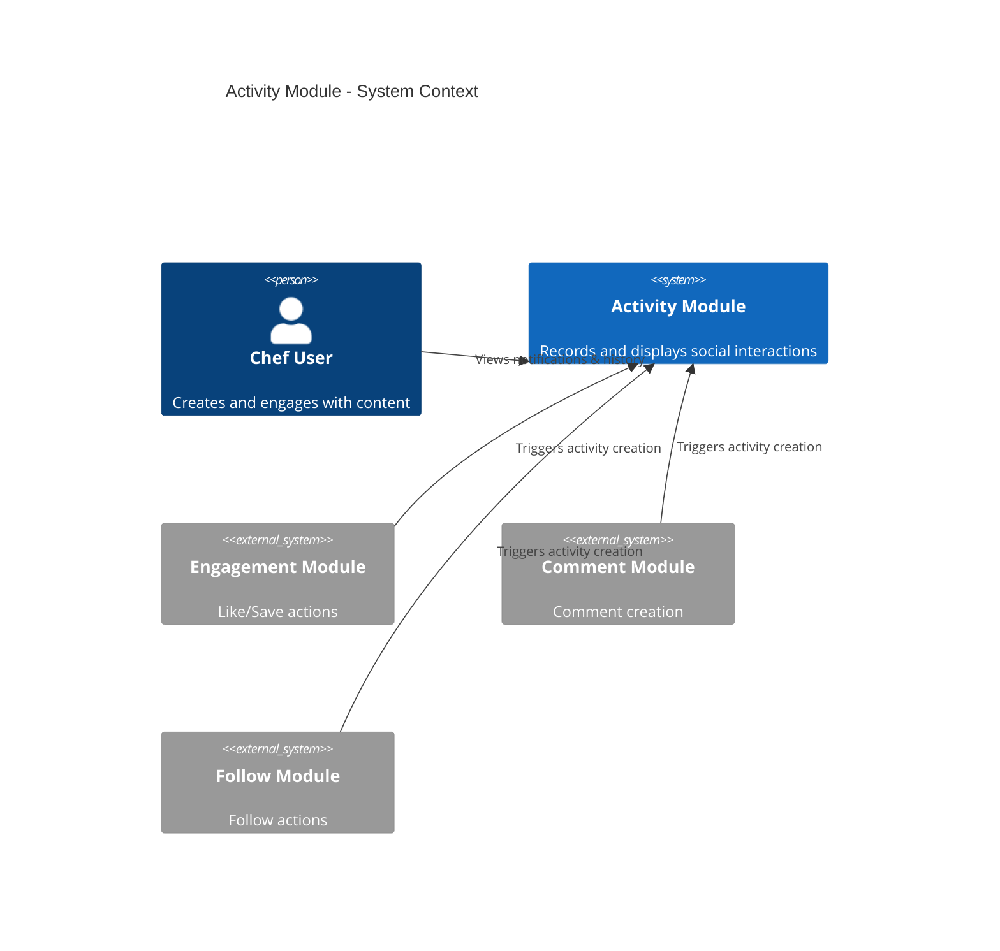
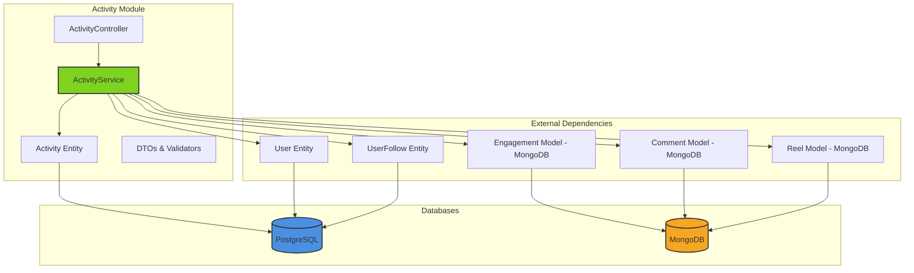

# 🛠️ Activity Module - Technical Implementation Guide

## 📋 **Table of Contents**
- [Architecture Overview](#architecture-overview)
- [Module Structure](#module-structure)
- [Database Schema](#database-schema)
- [API Endpoints](#api-endpoints)
- [Service Implementation](#service-implementation)
- [Controller Implementation](#controller-implementation)
- [DTOs & Validation](#dtos--validation)
- [Business Logic](#business-logic)
- [Error Handling](#error-handling)
- [Performance Optimization](#performance-optimization)
- [Testing Strategy](#testing-strategy)

---

## 🏗️ **Architecture Overview**

### **System Context Diagram**



### **Component Diagram**



---

## 📁 **Module Structure**

```
apps/chefooz-apis/src/modules/activity/
├── activity.module.ts              # Module definition with dependencies
├── activity.controller.ts          # REST API endpoints (5 routes)
├── activity.service.ts             # Core business logic (523 lines)
│
├── entities/
│   └── activity.entity.ts          # PostgreSQL Activity table (TypeORM)
│
└── dto/
    ├── activity-response.dto.ts    # Notification feed response DTOs
    └── user-activity.dto.ts        # User history request/response DTOs
```

### **Module Dependencies**

```typescript
// activity.module.ts
@Module({
  imports: [
    TypeOrmModule.forFeature([
      Activity,      // PostgreSQL: activity table
      User,          // PostgreSQL: users table
      UserFollow,    // PostgreSQL: user_follows table
    ]),
    MongooseModule.forFeature([
      { name: 'Engagement', schema: EngagementSchema }, // MongoDB
      { name: 'Comment', schema: CommentSchema },       // MongoDB
      { name: 'Reel', schema: ReelSchema },             // MongoDB
    ]),
  ],
  controllers: [ActivityController],
  providers: [ActivityService],
  exports: [ActivityService], // ✅ Exported for other modules to call createActivity()
})
export class ActivityModule {}
```

---

## 🗄️ **Database Schema**

### **PostgreSQL: Activity Table**

#### **Entity Definition (TypeORM)**

```typescript
// entities/activity.entity.ts
import { 
  Entity, 
  PrimaryGeneratedColumn, 
  Column, 
  ManyToOne, 
  JoinColumn, 
  CreateDateColumn,
  Index,
} from 'typeorm';
import { User } from '../user/user.entity';

/**
 * Activity Feed Table
 * 
 * Business Rules:
 * - Records ALL social events regardless of notification preferences
 * - Notification preferences only control push/email, not feed recording
 * - Self-actions (actorId === userId) are NEVER recorded
 * - Read-only timeline: Users cannot edit or delete activities
 */
@Entity('activity')
@Index(['userId', 'createdAt'])  // ✅ Feed retrieval index
@Index(['userId', 'isRead'])     // ✅ Unread count index
export class Activity {
  @PrimaryGeneratedColumn('uuid')
  id!: string;

  /**
   * User who RECEIVES the notification (whose feed)
   * Example: Chef B's reel gets liked → userId = Chef B
   */
  @Column({ type: 'uuid', name: 'user_id' })
  userId!: string;

  @ManyToOne(() => User)
  @JoinColumn({ name: 'user_id' })
  user!: User;

  /**
   * User who PERFORMED the action (actor)
   * Example: Chef A likes Chef B's reel → actorId = Chef A
   */
  @Column({ type: 'uuid', name: 'actor_id' })
  actorId!: string;

  @ManyToOne(() => User)
  @JoinColumn({ name: 'actor_id' })
  actor!: User;

  /**
   * Activity Type
   * - 'like': Someone liked your reel
   * - 'comment': Someone commented on your reel
   * - 'follow': Someone followed you
   * - 'order': Order status update (future)
   */
  @Column({ 
    type: 'varchar', 
    length: 50,
    enum: ['like', 'comment', 'follow', 'order'],
  })
  type!: 'like' | 'comment' | 'follow' | 'order';

  /**
   * Entity Type (what was affected)
   * - 'reel': Activity related to a reel
   * - 'user': Activity related to a user (e.g., follow)
   * - 'order': Activity related to an order (future)
   */
  @Column({ 
    type: 'varchar', 
    length: 50,
    enum: ['reel', 'user', 'order'],
  })
  entityType!: 'reel' | 'user' | 'order';

  /**
   * Entity ID (foreign key)
   * - For 'reel': MongoDB ObjectId (24-char hex string)
   * - For 'user': PostgreSQL UUID
   * - For 'order': PostgreSQL UUID (future)
   */
  @Column({ type: 'varchar', length: 255, name: 'entity_id' })
  entityId!: string;

  /**
   * Metadata (flexible context)
   * Examples:
   * - Like: { reelId: '...', thumbnailUrl: '...' }
   * - Comment: { reelId: '...', commentText: '...', thumbnailUrl: '...' }
   * - Follow: { targetUserId: '...', targetUsername: '...' }
   */
  @Column({ type: 'jsonb', default: {} })
  metadata!: Record<string, any>;

  /**
   * Read State
   * - false: Unread notification (shows in badge count)
   * - true: User has seen this activity
   */
  @Column({ type: 'boolean', default: false, name: 'is_read' })
  isRead!: boolean;

  @CreateDateColumn({ name: 'created_at' })
  createdAt!: Date;
}
```

#### **SQL Schema (for reference)**

```sql
-- PostgreSQL 14+ with UUID extension
CREATE EXTENSION IF NOT EXISTS "uuid-ossp";

CREATE TABLE activity (
  id UUID PRIMARY KEY DEFAULT uuid_generate_v4(),
  user_id UUID NOT NULL,
  actor_id UUID NOT NULL,
  type VARCHAR(50) NOT NULL CHECK (type IN ('like', 'comment', 'follow', 'order')),
  entity_type VARCHAR(50) NOT NULL CHECK (entity_type IN ('reel', 'user', 'order')),
  entity_id VARCHAR(255) NOT NULL,
  metadata JSONB DEFAULT '{}',
  is_read BOOLEAN DEFAULT false,
  created_at TIMESTAMP DEFAULT NOW(),
  
  -- Foreign keys
  CONSTRAINT fk_activity_user FOREIGN KEY (user_id) 
    REFERENCES users(id) ON DELETE CASCADE,
  CONSTRAINT fk_activity_actor FOREIGN KEY (actor_id) 
    REFERENCES users(id) ON DELETE CASCADE
);

-- Performance indexes
CREATE INDEX idx_activity_user_created ON activity (user_id, created_at DESC);
CREATE INDEX idx_activity_user_read ON activity (user_id, is_read);

-- Comments
COMMENT ON TABLE activity IS 'Social activity feed for notifications and audit trail';
COMMENT ON COLUMN activity.user_id IS 'Receiver of notification (whose feed)';
COMMENT ON COLUMN activity.actor_id IS 'Performer of action (who did it)';
COMMENT ON COLUMN activity.metadata IS 'Flexible JSON context (thumbnailUrl, commentText, etc.)';
```

---

### **MongoDB Collections (Referenced)**

#### **Engagement Collection**

```typescript
// Used for: Likes and Saves
{
  _id: ObjectId("507f1f77bcf86cd799439011"),
  userId: "user-uuid",           // ✅ Who performed the action
  reelId: "reel-object-id",      // ✅ Target reel
  type: "like" | "save",         // ✅ Action type
  active: true,                  // ✅ Soft-delete flag
  createdAt: ISODate("2025-01-10T12:00:00Z"),
  updatedAt: ISODate("2025-01-10T12:00:00Z")
}

// Query patterns used by ActivityService
db.engagements.find({ 
  userId: "abc123", 
  type: "like", 
  active: true,
  createdAt: { $lt: ISODate("...") } 
}).sort({ createdAt: -1 }).limit(20);
```

#### **Comment Collection**

```typescript
// Used for: User's comment history
{
  _id: ObjectId("..."),
  userId: "user-uuid",           // ✅ Comment author
  mediaId: "reel-object-id",     // ✅ Parent reel
  text: "Great recipe! 🍕",      // ✅ Comment text
  parentId: null,                // Thread parent (null = top-level)
  createdAt: ISODate("2025-01-10T12:00:00Z")
}

// Query patterns
db.comments.find({ 
  userId: "abc123",
  createdAt: { $lt: ISODate("...") } 
}).sort({ createdAt: -1 }).limit(20);
```

#### **Reel Collection**

```typescript
// Used for: Reel metadata in activity responses
{
  _id: ObjectId("..."),
  userId: "chef-uuid",
  caption: "Biryani Recipe",
  mediaUrls: [
    { url: "https://...", type: "video" }
  ],
  createdAt: ISODate("...")
}

// Query patterns
db.reels.find({ 
  _id: { $in: [ObjectId("..."), ...] } 
}).select('_id caption mediaUrls');
```

---

## 🌐 **API Endpoints**

### **⚠️ Critical: Route Order**

```typescript
@Controller('activity')
export class ActivityController {
  // ✅ MUST BE IN THIS ORDER:
  
  @Get('me')                    // 1. Specific route (user history)
  @Get('unread-count')          // 2. Another specific route
  @Post('read-all')             // 3. POST routes (no conflict)
  @Post('read/:id')             // 4. Parameterized POST route
  @Get()                        // 5. CATCH-ALL (notification feed)
}
```

**Why Order Matters**:
- `@Get()` without a path is a **catch-all** that matches any GET request
- If placed first, it would intercept `/me` and `/unread-count`
- NestJS processes decorators **top-to-bottom**
- Specific routes must be declared **before** catch-all routes

---

### **1. Get User Activity History (NEW)**

**Endpoint**: `GET /api/v1/activity/me`

**Description**: Fetch current user's own social actions aggregated from multiple sources.

**Authentication**: ✅ Required (JWT)

**Query Parameters**:
```typescript
{
  type?: 'LIKE' | 'COMMENT' | 'FOLLOW' | 'SAVE',  // Optional filter
  cursor?: string,                                 // Timestamp ISO string
  limit?: number                                   // Default: 20, Max: 50
}
```

**Response** (200 OK):
```json
{
  "success": true,
  "message": "User activity history retrieved",
  "data": {
    "items": [
      {
        "id": "507f1f77bcf86cd799439011",
        "type": "LIKE",
        "createdAt": "2025-01-10T15:30:00.000Z",
        "reel": {
          "reelId": "507f191e810c19729de860ea",
          "reelThumbnail": "https://cdn.chefooz.com/reels/thumb_abc.jpg",
          "reelCaption": "Authentic Biryani Recipe"
        }
      },
      {
        "id": "507f1f77bcf86cd799439012",
        "type": "COMMENT",
        "createdAt": "2025-01-10T14:20:00.000Z",
        "commentText": "Looks delicious! 🍕",
        "reel": {
          "reelId": "507f191e810c19729de860eb",
          "reelThumbnail": "https://...",
          "reelCaption": "Pizza Dough Tutorial"
        }
      },
      {
        "id": "123e4567-e89b-12d3-a456-426614174001",
        "type": "FOLLOW",
        "createdAt": "2025-01-10T12:00:00.000Z",
        "target": {
          "userId": "456e7890-e89b-12d3-a456-426614174002",
          "username": "chef_rahul",
          "fullName": "Rahul Kumar",
          "avatarUrl": null
        }
      }
    ],
    "nextCursor": "2025-01-09T10:30:00.000Z",
    "totalCount": 150
  }
}
```

**Controller Implementation**:
```typescript
@Get('me')
@UseGuards(JwtAuthGuard)
@ApiTags('Activity')
@ApiOperation({ summary: 'Get user activity history (what you did)' })
@ApiBearerAuth()
@ApiQuery({ name: 'type', enum: UserActivityType, required: false })
@ApiQuery({ name: 'cursor', required: false, description: 'Timestamp cursor' })
@ApiQuery({ name: 'limit', required: false, type: Number })
@ApiResponse({ status: 200, type: UserActivityFeedResponseDto })
async getUserActivityHistory(
  @Req() req: any,
  @Query() query: UserActivityQueryDto,
): Promise<ApiResponse<UserActivityFeedResponseDto>> {
  const userId = req.user.id;
  
  const result = await this.activityService.getUserActivityHistory(
    userId,
    query.type,
    query.cursor,
    query.limit,
  );
  
  return {
    success: true,
    message: 'User activity history retrieved',
    data: result,
  };
}
```

---

### **2. Get Notification Activity Feed**

**Endpoint**: `GET /api/v1/activity`

**Description**: Fetch notification activities (what others did to you).

**Authentication**: ✅ Required (JWT)

**Query Parameters**:
```typescript
{
  cursor?: string,   // Activity ID (UUID)
  limit?: number     // Default: 20, Max: 50
}
```

**Response** (200 OK):
```json
{
  "success": true,
  "message": "Activity feed retrieved",
  "data": {
    "items": [
      {
        "id": "123e4567-e89b-12d3-a456-426614174000",
        "type": "like",
        "actor": {
          "id": "456e7890-e89b-12d3-a456-426614174001",
          "username": "priya_foodie",
          "fullName": "Priya Sharma",
          "avatarUrl": null
        },
        "entityType": "reel",
        "entityId": "507f1f77bcf86cd799439011",
        "metadata": {
          "reelId": "507f1f77bcf86cd799439011",
          "thumbnailUrl": "https://cdn.chefooz.com/reels/thumb_xyz.jpg"
        },
        "isRead": false,
        "createdAt": "2025-01-10T15:45:00.000Z"
      },
      {
        "id": "123e4567-e89b-12d3-a456-426614174002",
        "type": "comment",
        "actor": {
          "id": "789e1011-e89b-12d3-a456-426614174003",
          "username": "chef_amit",
          "fullName": "Amit Verma",
          "avatarUrl": null
        },
        "entityType": "reel",
        "entityId": "507f1f77bcf86cd799439011",
        "metadata": {
          "reelId": "507f1f77bcf86cd799439011",
          "commentText": "Great technique! 👍",
          "thumbnailUrl": "https://..."
        },
        "isRead": false,
        "createdAt": "2025-01-10T14:30:00.000Z"
      }
    ],
    "nextCursor": "123e4567-e89b-12d3-a456-426614174003"
  }
}
```

**Controller Implementation**:
```typescript
@Get()
@UseGuards(JwtAuthGuard)
@ApiTags('Activity')
@ApiOperation({ summary: 'Get notification activity feed (what others did to you)' })
@ApiBearerAuth()
@ApiQuery({ name: 'cursor', required: false, description: 'Activity ID cursor' })
@ApiQuery({ name: 'limit', required: false, type: Number })
@ApiResponse({ status: 200, type: ActivityFeedResponseDto })
async getActivityFeed(
  @Req() req: any,
  @Query('cursor') cursor?: string,
  @Query('limit') limit: number = 20,
): Promise<ApiResponse<ActivityFeedResponseDto>> {
  const userId = req.user.id;
  
  // Enforce max limit
  const effectiveLimit = Math.min(limit, 50);
  
  const result = await this.activityService.getUserActivityFeed(
    userId,
    cursor,
    effectiveLimit,
  );
  
  return {
    success: true,
    message: 'Activity feed retrieved',
    data: result,
  };
}
```

---

### **3. Get Unread Count**

**Endpoint**: `GET /api/v1/activity/unread-count`

**Description**: Get count of unread notifications for badge display.

**Authentication**: ✅ Required (JWT)

**Response** (200 OK):
```json
{
  "success": true,
  "message": "Unread count retrieved",
  "data": {
    "count": 5
  }
}
```

**Controller Implementation**:
```typescript
@Get('unread-count')
@UseGuards(JwtAuthGuard)
@ApiTags('Activity')
@ApiOperation({ summary: 'Get unread notification count' })
@ApiBearerAuth()
@ApiResponse({ status: 200, schema: { properties: { count: { type: 'number' } } } })
async getUnreadCount(
  @Req() req: any,
): Promise<ApiResponse<{ count: number }>> {
  const userId = req.user.id;
  const count = await this.activityService.getUnreadCount(userId);
  
  return {
    success: true,
    message: 'Unread count retrieved',
    data: { count },
  };
}
```

---

### **4. Mark All Activities as Read**

**Endpoint**: `POST /api/v1/activity/read-all`

**Description**: Mark all unread notifications as read for current user.

**Authentication**: ✅ Required (JWT)

**Response** (200 OK):
```json
{
  "success": true,
  "message": "5 activities marked as read",
  "data": {
    "count": 5
  }
}
```

**Controller Implementation**:
```typescript
@Post('read-all')
@UseGuards(JwtAuthGuard)
@ApiTags('Activity')
@ApiOperation({ summary: 'Mark all notifications as read' })
@ApiBearerAuth()
@ApiResponse({ status: 200 })
async markAllAsRead(
  @Req() req: any,
): Promise<ApiResponse<{ count: number }>> {
  const userId = req.user.id;
  const count = await this.activityService.markAllAsRead(userId);
  
  return {
    success: true,
    message: `${count} activities marked as read`,
    data: { count },
  };
}
```

---

### **5. Mark Specific Activity as Read**

**Endpoint**: `POST /api/v1/activity/read/:id`

**Description**: Mark a single notification as read.

**Authentication**: ✅ Required (JWT)

**Path Parameters**:
```typescript
{
  id: string  // Activity ID (UUID)
}
```

**Response** (200 OK):
```json
{
  "success": true,
  "message": "Activity marked as read"
}
```

**Response** (404 Not Found):
```json
{
  "success": false,
  "message": "Activity not found or not authorized",
  "errorCode": "ACTIVITY_NOT_FOUND"
}
```

**Controller Implementation**:
```typescript
@Post('read/:id')
@UseGuards(JwtAuthGuard)
@ApiTags('Activity')
@ApiOperation({ summary: 'Mark specific notification as read' })
@ApiBearerAuth()
@ApiParam({ name: 'id', description: 'Activity ID' })
@ApiResponse({ status: 200 })
@ApiResponse({ status: 404 })
async markAsRead(
  @Req() req: any,
  @Param('id') activityId: string,
): Promise<ApiResponse<void>> {
  const userId = req.user.id;
  
  await this.activityService.markAsRead(userId, activityId);
  
  return {
    success: true,
    message: 'Activity marked as read',
  };
}
```

---

## 🧠 **Service Implementation**

### **Core Service Class**

```typescript
// activity.service.ts
@Injectable()
export class ActivityService {
  private readonly logger = new Logger(ActivityService.name);

  constructor(
    @InjectRepository(Activity)
    private readonly activityRepo: Repository<Activity>,
    
    @InjectRepository(User)
    private readonly userRepo: Repository<User>,
    
    @InjectRepository(UserFollow)
    private readonly followRepo: Repository<UserFollow>,
    
    @InjectModel('Engagement')
    private readonly engagementModel: Model<any>,
    
    @InjectModel('Comment')
    private readonly commentModel: Model<any>,
    
    @InjectModel('Reel')
    private readonly reelModel: Model<any>,
  ) {}

  // ... methods below
}
```

---

### **1. Create Activity (Event Recording)**

**Purpose**: Record social events in activity feed (called by other modules).

**Implementation**:
```typescript
/**
 * Create a new activity record
 * 
 * Critical Rules:
 * - Self-actions (actorId === userId) are IGNORED
 * - Errors are logged but NOT thrown (non-critical service)
 * - Always sets isRead: false
 * 
 * @param input Activity creation data
 */
async createActivity(input: CreateActivityInput): Promise<void> {
  try {
    // Rule 1: Self-action filtering
    if (input.actorId === input.userId) {
      this.logger.debug(
        `Ignoring self-action: ${input.type} by ${input.actorId}`
      );
      return;
    }

    // Rule 2: Create activity record
    const activity = this.activityRepo.create({
      userId: input.userId,
      actorId: input.actorId,
      type: input.type,
      entityType: input.entityType,
      entityId: input.entityId,
      metadata: input.metadata || {},
      isRead: false,
    });

    await this.activityRepo.save(activity);
    
    this.logger.log(
      `Activity created: ${input.type} by ${input.actorId} for ${input.userId}`
    );

  } catch (error) {
    // Rule 3: Non-critical service (log only, don't throw)
    this.logger.error(
      `Failed to create activity: ${error.message}`,
      error.stack
    );
  }
}
```

**Input DTO**:
```typescript
interface CreateActivityInput {
  userId: string;      // Receiver
  actorId: string;     // Performer
  type: 'like' | 'comment' | 'follow' | 'order';
  entityType: 'reel' | 'user' | 'order';
  entityId: string;    // MongoDB ObjectId or UUID
  metadata?: Record<string, any>;
}
```

**Example Usage**:
```typescript
// In LikeService.createLike()
await this.activityService.createActivity({
  userId: reel.userId,              // Reel owner
  actorId: currentUser.id,          // Who liked
  type: 'like',
  entityType: 'reel',
  entityId: reel._id.toString(),
  metadata: {
    reelId: reel._id.toString(),
    thumbnailUrl: reel.mediaUrls[0]?.url,
  },
});
```

---

### **2. Get Notification Activity Feed**

**Purpose**: Fetch notification timeline (what others did to you).

**Implementation**:
```typescript
/**
 * Get notification activity feed
 * 
 * Strategy:
 * - Query: WHERE userId = current_user AND createdAt < cursor.createdAt
 * - Sort: ORDER BY createdAt DESC
 * - Pagination: Cursor-based using activity ID
 * - N+1 Prevention: Batch fetch actors
 * 
 * @param userId Current user ID
 * @param cursor Activity ID to paginate from
 * @param limit Max items to return (enforced: 1-50)
 * @returns Feed items + next cursor
 */
async getUserActivityFeed(
  userId: string,
  cursor?: string,
  limit: number = 20,
): Promise<ActivityFeedResponseDto> {
  // Step 1: Build query
  const query = this.activityRepo
    .createQueryBuilder('activity')
    .where('activity.userId = :userId', { userId })
    .orderBy('activity.createdAt', 'DESC');

  // Step 2: Apply cursor pagination
  if (cursor) {
    const cursorActivity = await this.activityRepo.findOne({
      where: { id: cursor },
    });
    
    if (cursorActivity) {
      query.andWhere('activity.createdAt < :cursorDate', {
        cursorDate: cursorActivity.createdAt,
      });
    }
  }

  // Step 3: Fetch limit + 1 (to check hasMore)
  const activities = await query.limit(limit + 1).getMany();

  // Step 4: Determine hasMore and nextCursor
  const hasMore = activities.length > limit;
  if (hasMore) activities.pop(); // Remove extra item

  const nextCursor = hasMore ? activities[activities.length - 1].id : null;

  // Step 5: Batch fetch actors (prevent N+1)
  const actorIds = [...new Set(activities.map(a => a.actorId))];
  const actors = await this.userRepo.find({
    where: actorIds.map(id => ({ id })),
    select: ['id', 'username', 'fullName'],
  });
  const actorMap = new Map(actors.map(u => [u.id, u]));

  // Step 6: Map to response DTOs
  const items = activities.map(activity =>
    this.mapToResponseDto(activity, actorMap)
  );

  return { items, nextCursor };
}
```

---

### **3. Get User Activity History (NEW)**

**Purpose**: Aggregate user's own actions from 4 data sources.

**Implementation**:
```typescript
/**
 * Get user activity history (what you did)
 * 
 * Strategy:
 * - Fetch from 4 sources in parallel (likes, saves, comments, follows)
 * - Filter by type if specified
 * - Merge all results and sort by createdAt DESC
 * - Apply cursor pagination (timestamp-based)
 * 
 * @param userId Current user ID
 * @param type Optional filter (LIKE, COMMENT, FOLLOW, SAVE)
 * @param cursor Timestamp ISO string
 * @param limit Max items (enforced: 1-50)
 * @returns Timeline + next cursor + total count
 */
async getUserActivityHistory(
  userId: string,
  type?: UserActivityType,
  cursor?: string,
  limit: number = 20,
): Promise<UserActivityFeedResponseDto> {
  // Step 1: Parse cursor or use current time
  const cursorDate = cursor ? new Date(cursor) : new Date();

  // Step 2: Enforce limit
  const effectiveLimit = Math.min(limit, 50);

  // Step 3: Build fetch list based on type filter
  const fetchPromises: Promise<UserActivityItemDto[]>[] = [];

  if (!type || type === UserActivityType.LIKE) {
    fetchPromises.push(this.fetchLikes(userId, cursorDate, effectiveLimit));
  }
  if (!type || type === UserActivityType.SAVE) {
    fetchPromises.push(this.fetchSaves(userId, cursorDate, effectiveLimit));
  }
  if (!type || type === UserActivityType.COMMENT) {
    fetchPromises.push(this.fetchComments(userId, cursorDate, effectiveLimit));
  }
  if (!type || type === UserActivityType.FOLLOW) {
    fetchPromises.push(this.fetchFollows(userId, cursorDate, effectiveLimit));
  }

  // Step 4: Fetch all sources in parallel
  const results = await Promise.all(fetchPromises);

  // Step 5: Flatten and merge
  const merged = results.flat();

  // Step 6: Sort by createdAt DESC
  merged.sort((a, b) =>
    new Date(b.createdAt).getTime() - new Date(a.createdAt).getTime()
  );

  // Step 7: Apply pagination
  const hasMore = merged.length > effectiveLimit;
  const items = merged.slice(0, effectiveLimit);

  // Step 8: Calculate next cursor
  const nextCursor = hasMore ? items[items.length - 1].createdAt : null;

  // Step 9: Get total count
  const totalCount = await this.getUserActivityCount(userId, type);

  return { items, nextCursor, totalCount };
}
```

---

### **4. Fetch Likes (Private Helper)**

```typescript
/**
 * Fetch user's likes from MongoDB engagements
 */
private async fetchLikes(
  userId: string,
  cursorDate: Date,
  limit: number
): Promise<UserActivityItemDto[]> {
  // Step 1: Fetch engagements
  const engagements = await this.engagementModel
    .find({
      userId,
      type: 'like',
      active: true,
      createdAt: { $lt: cursorDate },
    })
    .sort({ createdAt: -1 })
    .limit(limit)
    .lean();

  if (engagements.length === 0) return [];

  // Step 2: Batch fetch reel details
  const reelIds = engagements.map(e => e.reelId);
  const reels = await this.reelModel
    .find({ _id: { $in: reelIds } })
    .select('_id caption mediaUrls')
    .lean();

  const reelMap = new Map(reels.map(r => [r._id.toString(), r]));

  // Step 3: Map to DTOs
  return engagements.map(engagement => {
    const reel = reelMap.get(engagement.reelId);
    return {
      id: engagement._id.toString(),
      type: UserActivityType.LIKE,
      createdAt: engagement.createdAt.toISOString(),
      reel: reel ? {
        reelId: reel._id.toString(),
        reelThumbnail: reel.mediaUrls?.[0]?.url || null,
        reelCaption: reel.caption || null,
      } : undefined,
    };
  });
}
```

---

### **5. Fetch Saves (Private Helper)**

```typescript
/**
 * Fetch user's saves from MongoDB engagements
 */
private async fetchSaves(
  userId: string,
  cursorDate: Date,
  limit: number
): Promise<UserActivityItemDto[]> {
  const engagements = await this.engagementModel
    .find({
      userId,
      type: 'save',
      active: true,
      createdAt: { $lt: cursorDate },
    })
    .sort({ createdAt: -1 })
    .limit(limit)
    .lean();

  if (engagements.length === 0) return [];

  const reelIds = engagements.map(e => e.reelId);
  const reels = await this.reelModel
    .find({ _id: { $in: reelIds } })
    .select('_id caption mediaUrls')
    .lean();

  const reelMap = new Map(reels.map(r => [r._id.toString(), r]));

  return engagements.map(engagement => {
    const reel = reelMap.get(engagement.reelId);
    return {
      id: engagement._id.toString(),
      type: UserActivityType.SAVE,
      createdAt: engagement.createdAt.toISOString(),
      reel: reel ? {
        reelId: reel._id.toString(),
        reelThumbnail: reel.mediaUrls?.[0]?.url || null,
        reelCaption: reel.caption || null,
      } : undefined,
    };
  });
}
```

---

### **6. Fetch Comments (Private Helper)**

```typescript
/**
 * Fetch user's comments from MongoDB comments collection
 */
private async fetchComments(
  userId: string,
  cursorDate: Date,
  limit: number
): Promise<UserActivityItemDto[]> {
  const comments = await this.commentModel
    .find({
      userId,
      createdAt: { $lt: cursorDate },
    })
    .sort({ createdAt: -1 })
    .limit(limit)
    .lean();

  if (comments.length === 0) return [];

  const reelIds = [...new Set(comments.map(c => c.mediaId))];
  const reels = await this.reelModel
    .find({ _id: { $in: reelIds } })
    .select('_id caption mediaUrls')
    .lean();

  const reelMap = new Map(reels.map(r => [r._id.toString(), r]));

  return comments.map(comment => {
    const reel = reelMap.get(comment.mediaId);
    return {
      id: comment._id.toString(),
      type: UserActivityType.COMMENT,
      createdAt: comment.createdAt.toISOString(),
      commentText: comment.text,
      reel: reel ? {
        reelId: reel._id.toString(),
        reelThumbnail: reel.mediaUrls?.[0]?.url || null,
        reelCaption: reel.caption || null,
      } : undefined,
      metadata: {
        commentText: comment.text || '',
      },
    };
  });
}
```

---

### **7. Fetch Follows (Private Helper)**

```typescript
/**
 * Fetch user's follows from PostgreSQL user_follows table
 */
private async fetchFollows(
  userId: string,
  cursorDate: Date,
  limit: number
): Promise<UserActivityItemDto[]> {
  const follows = await this.followRepo
    .createQueryBuilder('follow')
    .where('follow.followerId = :userId', { userId })
    .andWhere('follow.status = :status', { status: 'accepted' })
    .andWhere('follow.createdAt < :cursorDate', { cursorDate })
    .orderBy('follow.createdAt', 'DESC')
    .limit(limit)
    .getMany();

  if (follows.length === 0) return [];

  // Batch fetch target users
  const targetIds = follows.map(f => f.targetId);
  const users = await this.userRepo.find({
    where: targetIds.map(id => ({ id })),
    select: ['id', 'username', 'fullName'],
  });

  const userMap = new Map(users.map(u => [u.id, u]));

  return follows.map(follow => {
    const targetUser = userMap.get(follow.targetId);
    return {
      id: follow.id,
      type: UserActivityType.FOLLOW,
      createdAt: follow.createdAt.toISOString(),
      target: targetUser ? {
        userId: targetUser.id,
        username: targetUser.username,
        fullName: targetUser.fullName,
        avatarUrl: null,
      } : undefined,
    };
  });
}
```

---

### **8. Mark As Read (Single)**

```typescript
/**
 * Mark a specific activity as read
 * 
 * Security: Ensures userId matches (user can only mark their own activities)
 * 
 * @param userId Current user ID
 * @param activityId Activity ID to mark
 * @throws NotFoundException if activity not found or not owned by user
 */
async markAsRead(userId: string, activityId: string): Promise<void> {
  const result = await this.activityRepo.update(
    { id: activityId, userId }, // ✅ Both conditions ensure ownership
    { isRead: true }
  );

  if (result.affected === 0) {
    throw new NotFoundException('Activity not found or not authorized');
  }
}
```

---

### **9. Mark All As Read (Bulk)**

```typescript
/**
 * Mark all unread activities as read for a user
 * 
 * @param userId Current user ID
 * @returns Count of activities marked as read
 */
async markAllAsRead(userId: string): Promise<number> {
  const result = await this.activityRepo.update(
    { userId, isRead: false },
    { isRead: true }
  );

  return result.affected || 0;
}
```

---

### **10. Get Unread Count**

```typescript
/**
 * Get count of unread notifications
 * 
 * Optimized with index on (userId, isRead)
 * 
 * @param userId Current user ID
 * @returns Unread count
 */
async getUnreadCount(userId: string): Promise<number> {
  return await this.activityRepo.count({
    where: { userId, isRead: false },
  });
}
```

---

## 📦 **DTOs & Validation**

### **User Activity DTOs (History Endpoint)**

```typescript
// dto/user-activity.dto.ts

/**
 * Activity types for user history
 */
export enum UserActivityType {
  LIKE = 'LIKE',
  COMMENT = 'COMMENT',
  FOLLOW = 'FOLLOW',
  SAVE = 'SAVE',
}

/**
 * Query DTO for GET /activity/me
 */
export class UserActivityQueryDto {
  @ApiProperty({ enum: UserActivityType, required: false })
  @IsOptional()
  @IsEnum(UserActivityType)
  type?: UserActivityType;

  @ApiProperty({ required: false, description: 'Timestamp cursor (ISO string)' })
  @IsOptional()
  @IsString()
  cursor?: string;

  @ApiProperty({ required: false, default: 20, minimum: 1, maximum: 50 })
  @IsOptional()
  @IsInt()
  @Min(1)
  @Max(50)
  limit?: number = 20;
}

/**
 * Reel info in activity item
 */
export class ActivityReelInfoDto {
  @ApiProperty()
  reelId!: string;

  @ApiProperty({ nullable: true })
  reelThumbnail!: string | null;

  @ApiProperty({ nullable: true })
  reelCaption!: string | null;
}

/**
 * Target user info in activity item (for FOLLOW)
 */
export class ActivityTargetUserDto {
  @ApiProperty()
  userId!: string;

  @ApiProperty()
  username!: string;

  @ApiProperty()
  fullName!: string;

  @ApiProperty({ nullable: true })
  avatarUrl!: string | null;
}

/**
 * Single activity item in user history
 */
export class UserActivityItemDto {
  @ApiProperty()
  id!: string;

  @ApiProperty({ enum: UserActivityType })
  type!: UserActivityType;

  @ApiProperty()
  createdAt!: string; // ISO timestamp

  @ApiProperty({ required: false })
  commentText?: string; // Only for COMMENT type

  @ApiProperty({ type: ActivityReelInfoDto, required: false })
  reel?: ActivityReelInfoDto; // For LIKE, SAVE, COMMENT

  @ApiProperty({ type: ActivityTargetUserDto, required: false })
  target?: ActivityTargetUserDto; // For FOLLOW

  @ApiProperty({ required: false })
  metadata?: Record<string, any>;
}

/**
 * Response DTO for user activity history
 */
export class UserActivityFeedResponseDto {
  @ApiProperty({ type: [UserActivityItemDto] })
  items!: UserActivityItemDto[];

  @ApiProperty({ nullable: true, description: 'Timestamp cursor for next page' })
  nextCursor!: string | null;

  @ApiProperty()
  totalCount!: number;
}
```

---

### **Notification Activity DTOs**

```typescript
// dto/activity-response.dto.ts

/**
 * Actor info in notification
 */
export class ActivityActorDto {
  @ApiProperty()
  id!: string;

  @ApiProperty()
  username!: string;

  @ApiProperty()
  fullName!: string;

  @ApiProperty({ nullable: true })
  avatarUrl!: string | null;
}

/**
 * Single activity in notification feed
 */
export class ActivityResponseDto {
  @ApiProperty()
  id!: string;

  @ApiProperty({ enum: ['like', 'comment', 'follow', 'order'] })
  type!: 'like' | 'comment' | 'follow' | 'order';

  @ApiProperty({ type: ActivityActorDto })
  actor!: ActivityActorDto;

  @ApiProperty({ enum: ['reel', 'user', 'order'] })
  entityType!: 'reel' | 'user' | 'order';

  @ApiProperty()
  entityId!: string;

  @ApiProperty({ description: 'Flexible metadata for context' })
  metadata!: Record<string, any>;

  @ApiProperty()
  isRead!: boolean;

  @ApiProperty()
  createdAt!: string;
}

/**
 * Response for notification feed
 */
export class ActivityFeedResponseDto {
  @ApiProperty({ type: [ActivityResponseDto] })
  items!: ActivityResponseDto[];

  @ApiProperty({ nullable: true, description: 'Activity ID cursor for next page' })
  nextCursor!: string | null;
}
```

---

## 🧩 **Business Logic**

### **Self-Action Filtering**

**Rule**: Never record activities where actorId === userId

**Implementation Location**: `ActivityService.createActivity()`

```typescript
// Example: User likes their own reel
await activityService.createActivity({
  userId: 'user-abc-123',    // Reel owner
  actorId: 'user-abc-123',   // Same user (liker)
  type: 'like',
  entityType: 'reel',
  entityId: 'reel-xyz-456',
});

// ✅ Service detects self-action and returns early (no DB write)
if (input.actorId === input.userId) {
  return; // Ignored
}
```

---

### **Non-Critical Service Pattern**

**Rule**: Activity creation failures MUST NOT break parent operations

**Implementation**:
```typescript
// In LikeService.createLike()
try {
  // 1. Core operation (MUST succeed)
  const engagement = await this.engagementRepo.save({
    userId: currentUser.id,
    reelId,
    type: 'like',
    active: true,
  });

  // 2. Activity recording (can fail safely)
  await this.activityService.createActivity({
    userId: reel.userId,
    actorId: currentUser.id,
    type: 'like',
    entityType: 'reel',
    entityId: reelId,
  });
  // ✅ If activity creation throws, it's caught INSIDE activityService
  
  return engagement;
} catch (error) {
  // Only core operation errors reach here
  throw new InternalServerErrorException('Failed to create like');
}
```

---

### **Multi-Source Aggregation**

**Challenge**: User history comes from 4 different sources (2 DBs, 4 tables/collections)

**Solution**: Parallel fetching + in-memory merge + time-based sort

```typescript
// Step 1: Fetch all sources in parallel (minimize latency)
const [likes, saves, comments, follows] = await Promise.all([
  this.fetchLikes(userId, cursorDate, limit),
  this.fetchSaves(userId, cursorDate, limit),
  this.fetchComments(userId, cursorDate, limit),
  this.fetchFollows(userId, cursorDate, limit),
]);

// Step 2: Flatten arrays
const merged = [...likes, ...saves, ...comments, ...follows];

// Step 3: Sort by createdAt DESC (unified timeline)
merged.sort((a, b) => 
  new Date(b.createdAt).getTime() - new Date(a.createdAt).getTime()
);

// Step 4: Apply limit
const items = merged.slice(0, limit);
```

**Trade-offs**:
- ✅ Simple implementation (no complex JOIN logic)
- ✅ Works across PostgreSQL + MongoDB
- ⚠️ Eventual consistency (no transactions)
- ⚠️ Memory sorting (limit enforced to max 50)

---

### **Graceful Entity Deletion Handling**

**Scenario**: User deletes a reel that has activities referencing it

**Handling**:
```typescript
// Fetch reels referenced by activities
const reels = await this.reelModel.find({ _id: { $in: reelIds } });
const reelMap = new Map(reels.map(r => [r._id.toString(), r]));

// Map activities to DTOs
return engagements.map(engagement => {
  const reel = reelMap.get(engagement.reelId);
  
  return {
    id: engagement._id.toString(),
    type: UserActivityType.LIKE,
    createdAt: engagement.createdAt.toISOString(),
    
    // ✅ If reel deleted, field is undefined (not included in JSON)
    reel: reel ? {
      reelId: reel._id.toString(),
      reelThumbnail: reel.mediaUrls?.[0]?.url || null,
      reelCaption: reel.caption || null,
    } : undefined,
  };
});
```

**UI Handling**:
```typescript
// Mobile component
{activity.reel ? (
  <ReelThumbnail uri={activity.reel.reelThumbnail} />
) : (
  <Text>Content no longer available</Text>
)}
```

---

## ⚠️ **Error Handling**

### **Activity Creation (Non-Critical)**

```typescript
async createActivity(input: CreateActivityInput): Promise<void> {
  try {
    // Business logic here
    await this.activityRepo.save({...});
  } catch (error) {
    // ✅ Log error but DON'T throw
    this.logger.error(
      `Failed to create activity: ${error.message}`,
      error.stack
    );
    // Parent operation continues successfully
  }
}
```

---

### **Mark As Read (Security)**

```typescript
async markAsRead(userId: string, activityId: string): Promise<void> {
  const result = await this.activityRepo.update(
    { id: activityId, userId }, // ✅ Ensures ownership
    { isRead: true }
  );

  if (result.affected === 0) {
    // ✅ Explicit error for unauthorized access
    throw new NotFoundException('Activity not found or not authorized');
  }
}
```

---

### **Controller Error Responses**

```typescript
@Post('read/:id')
async markAsRead(@Req() req: any, @Param('id') activityId: string) {
  try {
    await this.activityService.markAsRead(req.user.id, activityId);
    return { success: true, message: 'Activity marked as read' };
  } catch (error) {
    if (error instanceof NotFoundException) {
      throw new HttpException(
        {
          success: false,
          message: 'Activity not found or not authorized',
          errorCode: 'ACTIVITY_NOT_FOUND',
        },
        HttpStatus.NOT_FOUND
      );
    }
    throw error;
  }
}
```

---

## ⚡ **Performance Optimization**

### **1. Compound Indexes**

```sql
-- Index 1: Feed retrieval (most common query)
CREATE INDEX idx_activity_user_created ON activity (user_id, created_at DESC);

-- Query benefit:
SELECT * FROM activity 
WHERE user_id = ? 
ORDER BY created_at DESC 
LIMIT 20;
-- ✅ Uses index for both WHERE and ORDER BY (no filesort)

-- Index 2: Unread count (badge query)
CREATE INDEX idx_activity_user_read ON activity (user_id, is_read);

-- Query benefit:
SELECT COUNT(*) FROM activity 
WHERE user_id = ? AND is_read = false;
-- ✅ Index-only scan (no table access)
```

---

### **2. Batch User Fetching (N+1 Prevention)**

❌ **Bad (N+1 Query)**:
```typescript
for (const activity of activities) {
  const actor = await this.userRepo.findOne({ id: activity.actorId });
  // 20 activities = 20 separate queries!
}
```

✅ **Good (Single Batch Query)**:
```typescript
// Step 1: Collect unique actor IDs
const actorIds = [...new Set(activities.map(a => a.actorId))];

// Step 2: Single batch query
const actors = await this.userRepo.find({
  where: actorIds.map(id => ({ id })),
  select: ['id', 'username', 'fullName'],
});

// Step 3: Create lookup map
const actorMap = new Map(actors.map(u => [u.id, u]));

// Step 4: O(1) lookups in loop
for (const activity of activities) {
  const actor = actorMap.get(activity.actorId); // ✅ In-memory lookup
}
```

---

### **3. Parallel Source Fetching**

❌ **Bad (Sequential)**:
```typescript
const likes = await this.fetchLikes(...);
const saves = await this.fetchSaves(...);
const comments = await this.fetchComments(...);
const follows = await this.fetchFollows(...);
// Total time = t1 + t2 + t3 + t4 (300ms + 250ms + 200ms + 150ms = 900ms)
```

✅ **Good (Parallel)**:
```typescript
const [likes, saves, comments, follows] = await Promise.all([
  this.fetchLikes(...),
  this.fetchSaves(...),
  this.fetchComments(...),
  this.fetchFollows(...),
]);
// Total time = MAX(t1, t2, t3, t4) = 300ms (67% faster!)
```

---

### **4. Limit Enforcement**

```typescript
// Always enforce maximum limit
const effectiveLimit = Math.min(limit, 50);

// Prevents:
// - Memory exhaustion from large result sets
// - Slow queries on large tables
// - Client abuse (requesting limit=100000)
```

---

## 🧪 **Testing Strategy**

### **Unit Tests**

```typescript
// activity.service.spec.ts

describe('ActivityService', () => {
  let service: ActivityService;
  let activityRepo: MockType<Repository<Activity>>;
  
  describe('createActivity', () => {
    it('should create activity for valid input', async () => {
      const input = {
        userId: 'user-1',
        actorId: 'user-2',
        type: 'like',
        entityType: 'reel',
        entityId: 'reel-123',
      };
      
      await service.createActivity(input);
      
      expect(activityRepo.save).toHaveBeenCalledWith({
        ...input,
        isRead: false,
      });
    });
    
    it('should ignore self-actions', async () => {
      const input = {
        userId: 'user-1',
        actorId: 'user-1', // ✅ Same user
        type: 'like',
        entityType: 'reel',
        entityId: 'reel-123',
      };
      
      await service.createActivity(input);
      
      expect(activityRepo.save).not.toHaveBeenCalled();
    });
    
    it('should not throw on error (non-critical)', async () => {
      activityRepo.save.mockRejectedValue(new Error('DB error'));
      
      const input = { userId: 'user-1', actorId: 'user-2', ... };
      
      // ✅ Should not throw
      await expect(service.createActivity(input)).resolves.toBeUndefined();
    });
  });
  
  describe('getUserActivityHistory', () => {
    it('should aggregate likes, saves, comments, follows', async () => {
      const mockLikes = [{ id: '1', type: 'LIKE', createdAt: '2025-01-10T12:00:00Z' }];
      const mockSaves = [{ id: '2', type: 'SAVE', createdAt: '2025-01-10T11:00:00Z' }];
      const mockComments = [{ id: '3', type: 'COMMENT', createdAt: '2025-01-10T10:00:00Z' }];
      const mockFollows = [{ id: '4', type: 'FOLLOW', createdAt: '2025-01-10T09:00:00Z' }];
      
      jest.spyOn(service as any, 'fetchLikes').mockResolvedValue(mockLikes);
      jest.spyOn(service as any, 'fetchSaves').mockResolvedValue(mockSaves);
      jest.spyOn(service as any, 'fetchComments').mockResolvedValue(mockComments);
      jest.spyOn(service as any, 'fetchFollows').mockResolvedValue(mockFollows);
      
      const result = await service.getUserActivityHistory('user-1', undefined, undefined, 20);
      
      expect(result.items).toHaveLength(4);
      expect(result.items[0].type).toBe('LIKE'); // Most recent
      expect(result.items[3].type).toBe('FOLLOW'); // Oldest
    });
    
    it('should filter by type', async () => {
      const result = await service.getUserActivityHistory(
        'user-1', 
        UserActivityType.LIKE, 
        undefined, 
        20
      );
      
      // Only fetchLikes should be called
      expect(fetchLikes).toHaveBeenCalled();
      expect(fetchSaves).not.toHaveBeenCalled();
      expect(fetchComments).not.toHaveBeenCalled();
      expect(fetchFollows).not.toHaveBeenCalled();
    });
  });
  
  describe('markAllAsRead', () => {
    it('should update all unread activities', async () => {
      activityRepo.update.mockResolvedValue({ affected: 5 });
      
      const count = await service.markAllAsRead('user-1');
      
      expect(count).toBe(5);
      expect(activityRepo.update).toHaveBeenCalledWith(
        { userId: 'user-1', isRead: false },
        { isRead: true }
      );
    });
  });
});
```

---

### **Integration Tests**

```typescript
// activity.controller.e2e.spec.ts

describe('Activity Module (E2E)', () => {
  it('GET /activity - should return notification feed', async () => {
    const response = await request(app.getHttpServer())
      .get('/api/v1/activity')
      .set('Authorization', `Bearer ${jwtToken}`)
      .query({ limit: 20 })
      .expect(200);
    
    expect(response.body.success).toBe(true);
    expect(response.body.data.items).toBeInstanceOf(Array);
    expect(response.body.data.nextCursor).toBeDefined();
  });
  
  it('GET /activity/me - should return user history', async () => {
    const response = await request(app.getHttpServer())
      .get('/api/v1/activity/me')
      .set('Authorization', `Bearer ${jwtToken}`)
      .query({ type: 'LIKE', limit: 20 })
      .expect(200);
    
    expect(response.body.data.items.every(i => i.type === 'LIKE')).toBe(true);
  });
  
  it('POST /activity/read-all - should mark all as read', async () => {
    const response = await request(app.getHttpServer())
      .post('/api/v1/activity/read-all')
      .set('Authorization', `Bearer ${jwtToken}`)
      .expect(200);
    
    expect(response.body.data.count).toBeGreaterThanOrEqual(0);
  });
});
```

---

**[TECHNICAL_GUIDE_COMPLETE ✅]**

*This document provides the complete technical implementation details for the Activity Module. For business context, see `01_FEATURE_OVERVIEW.md`. For testing procedures, see `03_QA_TEST_CASES.md`.*

---

**Document Version**: 1.0  
**Last Updated**: January 2025  
**Complexity**: High (dual-feed system, multi-source aggregation)  
**Dependencies**: User, UserFollow, Engagement, Comment, Reel modules
