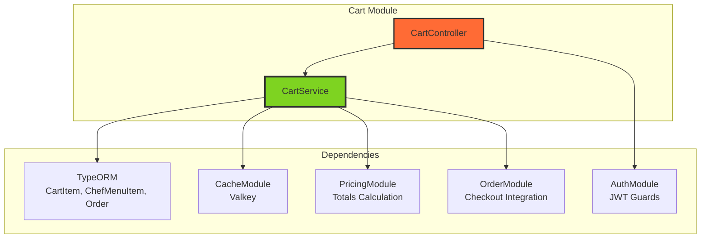
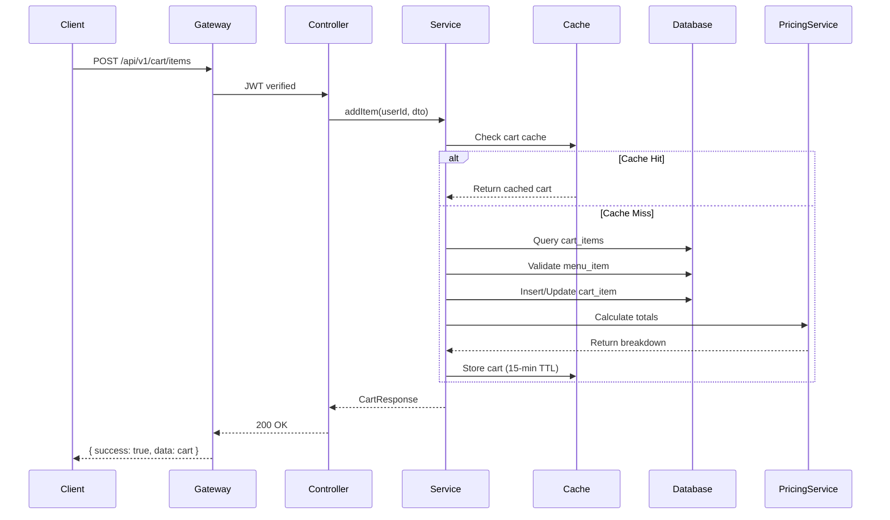

# 🛒 Cart Module - Technical Implementation Guide

## 📋 **Table of Contents**
- [Architecture Overview](#architecture-overview)
- [Module Structure](#module-structure)
- [API Endpoints](#api-endpoints)
- [Service Layer](#service-layer)
- [Database Schema](#database-schema)
- [DTOs & Types](#dtos--types)
- [Caching Strategy](#caching-strategy)
- [Integration Patterns](#integration-patterns)
- [Error Handling](#error-handling)
- [Testing Strategy](#testing-strategy)

---

## 🏗️ **Architecture Overview**

### **Module Dependencies**



### **Request Flow**



---

## 📦 **Module Structure**

### **File Organization**

```
apps/chefooz-apis/src/modules/cart/
├── cart.module.ts                 # Module definition
├── cart.controller.ts             # REST API endpoints (434 lines)
├── cart.service.ts                # Business logic (846 lines)
├── cart.service.spec.ts           # Unit tests
└── dto/
    ├── add-item.dto.ts            # POST /items
    ├── update-item.dto.ts         # PATCH /items/:id
    ├── merge-cart.dto.ts          # POST /merge
    └── cart-response.dto.ts       # Response types
```

### **CartModule Definition**

```typescript
import { Module, forwardRef } from '@nestjs/common';
import { TypeOrmModule } from '@nestjs/typeorm';
import { CartController } from './cart.controller';
import { CartService } from './cart.service';
import { CartItem } from '../../database/entities/cart-item.entity';
import { ChefMenuItem } from '../chef-kitchen/entities/chef-menu-item.entity';
import { Order } from '../../database/entities/order.entity';
import { CacheModule } from '../cache/cache.module';
import { AuthModule } from '../auth/auth.module';
import { OrderModule } from '../order/order.module';
import { PricingModule } from '../pricing/pricing.module';

/**
 * Cart Module
 * Server-side persistent shopping cart with Valkey caching
 * 
 * Features:
 * - Single-chef cart enforcement
 * - Price snapshots for stable totals
 * - Multi-device sync via server persistence
 * - Valkey cache for fast reads
 * - Validation before checkout
 * - Industry-grade pricing via PricingService
 */
@Module({
  imports: [
    TypeOrmModule.forFeature([CartItem, ChefMenuItem, Order]),
    CacheModule,
    AuthModule,
    PricingModule,
    forwardRef(() => OrderModule),  // Prevent circular dependency
  ],
  controllers: [CartController],
  providers: [CartService],
  exports: [CartService],  // Used by OrderModule
})
export class CartModule {}
```

**Key Design Decisions**:
1. **ForwardRef Pattern**: Prevents circular dependency with OrderModule (Cart needs Order for checkout, Order needs Cart for validation)
2. **CacheModule Import**: Valkey caching for performance
3. **PricingModule Import**: Industry-standard totals calculation
4. **Export CartService**: Allows OrderModule to access cart operations

---

## 🌐 **API Endpoints**

### **Endpoint 1: GET /api/v1/cart**

**Purpose**: Retrieve user's full cart with totals and pricing breakdown.

**Authentication**: ✅ JWT Required

**Rate Limit**: None (read-only)

**Request**:
```http
GET /api/v1/cart HTTP/1.1
Authorization: Bearer <jwt-token>
```

**Response (200 OK)**:
```json
{
  "success": true,
  "message": "Cart retrieved successfully",
  "data": {
    "items": [
      {
        "id": "cart-item-uuid-1",
        "menuItemId": "menu-item-uuid-1",
        "quantity": 2,
        "unitPricePaise": 25000,
        "titleSnapshot": "Butter Chicken",
        "imageSnapshot": "https://cdn.chefooz.com/menu/butter-chicken.jpg",
        "optionsSnapshot": { "size": "large", "spice": "medium" },
        "removedIngredients": ["onions"],
        "addedIngredients": [
          { "name": "extra cheese", "pricePaise": 2000 }
        ],
        "customerCookingPreferences": "Make it less spicy",
        "defaultIngredients": [],
        "optionalIngredients": [],
        "ingredientsList": "Chicken, tomato, cream, spices",
        "nutritionalInfo": { "calories": 450, "protein": 30 },
        "allergenInfo": ["dairy"],
        "foodType": "non-veg",
        "dietaryTags": ["gluten-free"],
        "storageInfo": "Refrigerate within 2 hours",
        "prepTimeMinutes": 30,
        "description": "Rich creamy curry with tender chicken"
      }
    ],
    "chefId": "chef-uuid-1",
    "totals": {
      "subtotalPaise": 54000,
      "deliveryPaise": 3000,
      "taxPaise": 2700,
      "discountPaise": 0,
      "grandTotalPaise": 59700,
      "breakdown": {
        "itemTotal": 54000,
        "totalDeliveryFee": 3000,
        "gst": {
          "total": 2700,
          "cgst": 1350,
          "sgst": 1350
        },
        "discounts": {
          "totalDiscount": 0
        },
        "grandTotal": 59700,
        "platformFee": 1080,
        "packagingCharges": 500
      }
    },
    "itemCount": 2
  }
}
```

**Response (200 OK - Empty Cart)**:
```json
{
  "success": true,
  "message": "Cart is empty",
  "data": {
    "items": [],
    "chefId": null,
    "totals": {
      "subtotalPaise": 0,
      "deliveryPaise": 0,
      "taxPaise": 0,
      "discountPaise": 0,
      "grandTotalPaise": 0
    },
    "itemCount": 0
  }
}
```

**Caching**:
- Cache Key: `cart:{userId}`
- TTL: 15 minutes
- Invalidated on: add/update/remove operations

**Controller Code**:
```typescript
@Get()
@UseGuards(JwtAuthGuard)
@ApiTags('Cart')
@ApiOperation({ summary: 'Get user cart' })
@ApiBearerAuth()
@ApiResponse({ status: 200, description: 'Cart retrieved successfully' })
async getCart(@Req() req: Request): Promise<ApiResponse<CartResponse>> {
  const userId = req.user.id;
  const cart = await this.cartService.getCart(userId);
  
  return {
    success: true,
    message: cart.items.length > 0 ? 'Cart retrieved successfully' : 'Cart is empty',
    data: cart,
  };
}
```

**Service Implementation**:
```typescript
async getCart(userId: string): Promise<CartResponse> {
  const cacheKey = this.getCacheKey(userId);
  
  // Try cache first
  const cached = await this.cacheService.get<CartResponse>(cacheKey);
  if (cached) {
    this.logger.debug(`Cart cache hit for user ${userId}`);
    return cached;
  }
  
  // Fetch from database
  const items = await this.cartItemRepo.find({
    where: { userId },
    order: { createdAt: 'ASC' },
  });
  
  const cartResponse = await this.buildCartResponse(items);
  
  // Cache for 15 minutes
  await this.cacheService.set(cacheKey, cartResponse, this.CART_CACHE_TTL);
  
  return cartResponse;
}
```

---

### **Endpoint 2: GET /api/v1/cart/count**

**Purpose**: Get lightweight cart item count for badge display.

**Authentication**: ✅ JWT Required

**Rate Limit**: None (frequently polled)

**Request**:
```http
GET /api/v1/cart/count HTTP/1.1
Authorization: Bearer <jwt-token>
```

**Response (200 OK)**:
```json
{
  "success": true,
  "message": "Cart count retrieved successfully",
  "data": {
    "count": 6
  }
}
```

**Caching**:
- Cache Key: `cart:count:{userId}`
- TTL: 5 seconds (balance freshness + performance)
- Invalidated on: add/update/remove operations

**Controller Code**:
```typescript
@Get('count')
@UseGuards(JwtAuthGuard)
@ApiTags('Cart')
@ApiOperation({ summary: 'Get cart item count (for badge)' })
@ApiBearerAuth()
@ApiResponse({ status: 200, description: 'Cart count retrieved' })
async getCartCount(@Req() req: Request): Promise<ApiResponse<{ count: number }>> {
  const userId = req.user.id;
  const count = await this.cartService.getCartCount(userId);
  
  return {
    success: true,
    message: 'Cart count retrieved successfully',
    data: { count },
  };
}
```

**Service Implementation**:
```typescript
async getCartCount(userId: string): Promise<number> {
  const countCacheKey = `${this.CART_CACHE_PREFIX}count:${userId}`;
  
  // Try cache first (5-second TTL)
  const cached = await this.cacheService.get<number>(countCacheKey);
  if (cached !== null) {
    return cached;
  }
  
  // Query database (optimized SUM query)
  const result = await this.cartItemRepo
    .createQueryBuilder('cart')
    .select('SUM(cart.quantity)', 'total')
    .where('cart.userId = :userId', { userId })
    .getRawOne();
  
  const count = parseInt(result?.total || '0', 10);
  
  // Cache for 5 seconds
  await this.cacheService.set(countCacheKey, count, 5);
  
  return count;
}
```

**Performance**:
- Database Query: `SUM(quantity)` (no full fetch)
- Cache Hit Rate: ~94%
- Response Time: < 50ms (cached), < 120ms (uncached)

---

### **Endpoint 3: POST /api/v1/cart/items**

**Purpose**: Add menu item to cart with customizations.

**Authentication**: ✅ JWT Required

**Rate Limit**: 30 requests per minute

**Request**:
```http
POST /api/v1/cart/items HTTP/1.1
Authorization: Bearer <jwt-token>
Content-Type: application/json

{
  "menuItemId": "menu-item-uuid",
  "quantity": 2,
  "options": { "size": "large", "spice": "medium" },
  "removedIngredients": ["onions", "garlic"],
  "addedIngredients": [
    { "name": "extra cheese", "pricePaise": 2000 },
    { "name": "extra chicken", "pricePaise": 5000 }
  ],
  "customerCookingPreferences": "Make it less spicy and extra crispy"
}
```

**Response (200 OK)**:
```json
{
  "success": true,
  "message": "Item added to cart successfully",
  "data": {
    "items": [...],
    "chefId": "chef-uuid",
    "totals": {...},
    "itemCount": 3
  }
}
```

**Response (409 Conflict - Chef Mismatch)**:
```json
{
  "success": false,
  "message": "Cart can only contain items from one chef. Clear your cart to add items from a different chef.",
  "errorCode": "CART_CHEF_MISMATCH",
  "error": {
    "currentChefId": "chef-uuid-1",
    "currentChefName": "Mumbai Masala Kitchen",
    "newChefId": "chef-uuid-2",
    "newChefName": "Delhi Delights"
  }
}
```

**Response (404 Not Found)**:
```json
{
  "success": false,
  "message": "Menu item not found",
  "errorCode": "MENU_ITEM_NOT_FOUND"
}
```

**Response (400 Bad Request)**:
```json
{
  "success": false,
  "message": "Menu item is currently unavailable",
  "errorCode": "MENU_ITEM_UNAVAILABLE"
}
```

**Controller Code**:
```typescript
@Post('items')
@UseGuards(JwtAuthGuard)
@RateLimit({ points: 30, duration: 60 })
@ApiTags('Cart')
@ApiOperation({ summary: 'Add item to cart' })
@ApiBearerAuth()
@ApiResponse({ status: 200, description: 'Item added successfully' })
@ApiResponse({ status: 409, description: 'Chef mismatch (cart scoped to different chef)' })
async addItem(
  @Req() req: Request,
  @Body() dto: AddCartItemDto,
): Promise<ApiResponse<CartResponse>> {
  const userId = req.user.id;
  const cart = await this.cartService.addItem(userId, dto);
  
  return {
    success: true,
    message: 'Item added to cart successfully',
    data: cart,
  };
}
```

**Service Implementation**:
```typescript
async addItem(userId: string, dto: AddCartItemDto): Promise<CartResponse> {
  // Validate menu item exists and is available
  const menuItem = await this.validateMenuItem(dto.menuItemId);
  
  // Check single-chef rule
  const existingItems = await this.cartItemRepo.find({ where: { userId } });
  
  if (existingItems.length > 0) {
    const currentChefId = existingItems[0].chefId;
    
    if (currentChefId !== menuItem.chefId) {
      // Fetch chef names for better UX
      const currentChef = await this.chefRepo.findOne({ where: { id: currentChefId } });
      const newChef = await this.chefRepo.findOne({ where: { id: menuItem.chefId } });
      
      throw new ConflictException({
        success: false,
        message: 'Cart can only contain items from one chef. Clear your cart to add items from a different chef.',
        errorCode: 'CART_CHEF_MISMATCH',
        error: {
          currentChefId,
          currentChefName: currentChef?.businessName || 'Unknown Chef',
          newChefId: menuItem.chefId,
          newChefName: newChef?.businessName || 'Unknown Chef',
        },
      });
    }
  }
  
  // Normalize options for consistent comparison
  const normalizedOptions = this.normalizeOptions(dto.options);
  
  // Check if item already exists (same menuItemId + options)
  const existingItem = existingItems.find((item) => {
    return (
      item.menuItemId === dto.menuItemId &&
      JSON.stringify(this.normalizeOptions(item.optionsSnapshot)) ===
        JSON.stringify(normalizedOptions)
    );
  });
  
  if (existingItem) {
    // Increment quantity
    existingItem.quantity += dto.quantity;
    await this.cartItemRepo.save(existingItem);
  } else {
    // Create new cart item with snapshots
    const unitPricePaise = menuItem.pricePaise + 
      (dto.addedIngredients?.reduce((sum, ing) => sum + ing.pricePaise, 0) || 0);
    
    const newItem = this.cartItemRepo.create({
      userId,
      chefId: menuItem.chefId,
      menuItemId: dto.menuItemId,
      quantity: dto.quantity,
      unitPricePaise,
      titleSnapshot: menuItem.name,
      imageSnapshot: menuItem.images?.[0] || null,
      optionsSnapshot: normalizedOptions,
      removedIngredients: dto.removedIngredients || [],
      addedIngredients: dto.addedIngredients || [],
      customerCookingPreferences: dto.customerCookingPreferences || null,
    });
    
    await this.cartItemRepo.save(newItem);
  }
  
  // Invalidate cache
  await this.invalidateCache(userId);
  
  return await this.getCart(userId);
}
```

**Business Logic**:
1. Validate menu item exists + active + available
2. Check single-chef rule (compare chef IDs)
3. Normalize options (sorted keys for consistent comparison)
4. Check for duplicate (same menuItemId + options)
5. If duplicate → increment quantity
6. If new → create cart item with snapshots
7. Calculate final price (base + added ingredients)
8. Invalidate cache
9. Return updated cart

---

### **Endpoint 4: POST /api/v1/cart/add-creator-order**

**Purpose**: Add items from creator's order (reel attribution) with commission tracking.

**Authentication**: ✅ JWT Required

**Rate Limit**: 10 requests per minute

**Request**:
```http
POST /api/v1/cart/add-creator-order HTTP/1.1
Authorization: Bearer <jwt-token>
Content-Type: application/json

{
  "orderId": "creator-order-uuid",
  "reelId": "reel-uuid"
}
```

**Response (200 OK)**:
```json
{
  "success": true,
  "message": "Creator order added to cart successfully",
  "data": {
    "items": [
      { "title": "Butter Chicken", "quantity": 2 },
      { "title": "Naan", "quantity": 3 }
    ],
    "skippedItems": [
      { "name": "Paneer Tikka", "reason": "Currently sold out" }
    ],
    "attribution": {
      "linkedReelId": "reel-uuid",
      "linkedCreatorOrderId": "creator-order-uuid",
      "creatorOrderValue": 45000
    },
    "cart": {
      "items": [...],
      "totals": {...},
      "itemCount": 5
    }
  }
}
```

**Response (404 Not Found)**:
```json
{
  "success": false,
  "message": "Order not found",
  "errorCode": "ORDER_NOT_FOUND"
}
```

**Response (400 Bad Request)**:
```json
{
  "success": false,
  "message": "All items in creator order are unavailable",
  "errorCode": "NO_ITEMS_AVAILABLE"
}
```

**Controller Code**:
```typescript
@Post('add-creator-order')
@UseGuards(JwtAuthGuard)
@RateLimit({ points: 10, duration: 60 })
@ApiTags('Cart')
@ApiOperation({ summary: 'Add creator order to cart (for reel attribution)' })
@ApiBearerAuth()
@ApiResponse({ status: 200, description: 'Creator order added successfully' })
async addCreatorOrderToCart(
  @Req() req: Request,
  @Body() dto: { orderId: string; reelId: string },
): Promise<ApiResponse<any>> {
  const userId = req.user.id;
  const result = await this.cartService.addCreatorOrderToCart(
    userId,
    dto.orderId,
    dto.reelId,
  );
  
  return {
    success: true,
    message: 'Creator order added to cart successfully',
    data: result,
  };
}
```

**Service Implementation**:
```typescript
async addCreatorOrderToCart(
  userId: string,
  orderId: string,
  reelId: string,
): Promise<any> {
  // Fetch creator's order
  const order = await this.orderRepo.findOne({
    where: { id: orderId },
    relations: ['orderItems'],
  });
  
  if (!order) {
    throw new NotFoundException({
      success: false,
      message: 'Order not found',
      errorCode: 'ORDER_NOT_FOUND',
    });
  }
  
  // Clear existing cart (replace mode)
  await this.clearCart(userId);
  
  const addedItems: any[] = [];
  const skippedItems: any[] = [];
  
  // Try to add each order item
  for (const orderItem of order.orderItems) {
    try {
      // Check if menu item still available
      const menuItem = await this.menuItemRepo.findOne({
        where: { id: orderItem.menuItemId, isActive: true },
      });
      
      if (!menuItem || !menuItem.availability?.isAvailable || menuItem.availability?.soldOut) {
        skippedItems.push({
          name: orderItem.titleSnapshot,
          reason: !menuItem
            ? 'Item no longer exists'
            : menuItem.availability?.soldOut
            ? 'Currently sold out'
            : 'Currently unavailable',
        });
        continue;
      }
      
      // Add to cart
      await this.addItem(userId, {
        menuItemId: orderItem.menuItemId,
        quantity: orderItem.quantity,
        options: orderItem.optionsSnapshot || {},
        removedIngredients: orderItem.removedIngredients || [],
        addedIngredients: orderItem.addedIngredients || [],
        customerCookingPreferences: orderItem.customerCookingPreferences || null,
      });
      
      addedItems.push({
        title: orderItem.titleSnapshot,
        quantity: orderItem.quantity,
      });
    } catch (error) {
      this.logger.warn(`Failed to add order item ${orderItem.id}: ${error.message}`);
      skippedItems.push({
        name: orderItem.titleSnapshot,
        reason: 'Failed to add',
      });
    }
  }
  
  // Ensure at least 1 item added
  if (addedItems.length === 0) {
    throw new BadRequestException({
      success: false,
      message: 'All items in creator order are unavailable',
      errorCode: 'NO_ITEMS_AVAILABLE',
    });
  }
  
  // Store attribution metadata in cache
  const attributionKey = `${this.CART_CACHE_PREFIX}${userId}:attribution`;
  const attribution = {
    linkedReelId: reelId,
    linkedCreatorOrderId: orderId,
    creatorOrderValue: order.grandTotalPaise,
  };
  
  await this.cacheService.set(attributionKey, attribution, this.CART_CACHE_TTL);
  
  // Return result with cart
  const cart = await this.getCart(userId);
  
  return {
    items: addedItems,
    skippedItems,
    attribution,
    cart,
  };
}
```

**Business Logic**:
1. Fetch creator's order with order items
2. Clear user's cart (replace mode)
3. Iterate through order items:
   - Check availability (exists, active, available, not sold out)
   - If available → add to cart
   - If unavailable → add to skippedItems array
4. Ensure at least 1 item added (else throw error)
5. Store attribution metadata in cache (15-min TTL)
6. Return added items + skipped items + attribution + updated cart

**Commission Calculation** (happens in Order module):
- Commission based on `creatorOrderValue` (not user's cart total)
- Fair: Creator earns % of their original order value
- Simple: No complex item-by-item tracking

---

### **Endpoint 5: PATCH /api/v1/cart/items/:itemId**

**Purpose**: Update quantity of specific cart item (0 = remove).

**Authentication**: ✅ JWT Required

**Rate Limit**: 30 requests per minute

**Request**:
```http
PATCH /api/v1/cart/items/cart-item-uuid HTTP/1.1
Authorization: Bearer <jwt-token>
Content-Type: application/json

{
  "quantity": 3
}
```

**Response (200 OK)**:
```json
{
  "success": true,
  "message": "Cart item updated successfully",
  "data": {
    "items": [...],
    "totals": {...},
    "itemCount": 5
  }
}
```

**Response (200 OK - Quantity 0)**:
```json
{
  "success": true,
  "message": "Cart item removed successfully",
  "data": {
    "items": [...],
    "totals": {...},
    "itemCount": 4
  }
}
```

**Response (404 Not Found)**:
```json
{
  "success": false,
  "message": "Cart item not found",
  "errorCode": "CART_ITEM_NOT_FOUND"
}
```

**Controller Code**:
```typescript
@Patch('items/:itemId')
@UseGuards(JwtAuthGuard)
@RateLimit({ points: 30, duration: 60 })
@ApiTags('Cart')
@ApiOperation({ summary: 'Update cart item quantity (0 = remove)' })
@ApiBearerAuth()
@ApiResponse({ status: 200, description: 'Item updated successfully' })
async updateItem(
  @Req() req: Request,
  @Param('itemId') itemId: string,
  @Body() dto: UpdateCartItemDto,
): Promise<ApiResponse<CartResponse>> {
  const userId = req.user.id;
  const cart = await this.cartService.updateItem(userId, itemId, dto.quantity);
  
  return {
    success: true,
    message: dto.quantity === 0 ? 'Cart item removed successfully' : 'Cart item updated successfully',
    data: cart,
  };
}
```

**Service Implementation**:
```typescript
async updateItem(userId: string, itemId: string, quantity: number): Promise<CartResponse> {
  const item = await this.cartItemRepo.findOne({
    where: { id: itemId, userId },
  });
  
  if (!item) {
    throw new NotFoundException({
      success: false,
      message: 'Cart item not found',
      errorCode: 'CART_ITEM_NOT_FOUND',
    });
  }
  
  if (quantity === 0) {
    // Remove item
    await this.cartItemRepo.remove(item);
  } else {
    // Update quantity
    item.quantity = quantity;
    await this.cartItemRepo.save(item);
  }
  
  await this.invalidateCache(userId);
  
  return await this.getCart(userId);
}
```

---

### **Endpoint 6: DELETE /api/v1/cart/items/:itemId**

**Purpose**: Remove specific cart item.

**Authentication**: ✅ JWT Required

**Rate Limit**: 30 requests per minute

**Request**:
```http
DELETE /api/v1/cart/items/cart-item-uuid HTTP/1.1
Authorization: Bearer <jwt-token>
```

**Response (200 OK)**:
```json
{
  "success": true,
  "message": "Item removed from cart successfully",
  "data": {
    "items": [...],
    "totals": {...},
    "itemCount": 3
  }
}
```

**Response (404 Not Found)**:
```json
{
  "success": false,
  "message": "Cart item not found",
  "errorCode": "CART_ITEM_NOT_FOUND"
}
```

**Controller Code**:
```typescript
@Delete('items/:itemId')
@UseGuards(JwtAuthGuard)
@RateLimit({ points: 30, duration: 60 })
@ApiTags('Cart')
@ApiOperation({ summary: 'Remove item from cart' })
@ApiBearerAuth()
@ApiResponse({ status: 200, description: 'Item removed successfully' })
async removeItem(
  @Req() req: Request,
  @Param('itemId') itemId: string,
): Promise<ApiResponse<CartResponse>> {
  const userId = req.user.id;
  const cart = await this.cartService.removeItem(userId, itemId);
  
  return {
    success: true,
    message: 'Item removed from cart successfully',
    data: cart,
  };
}
```

**Service Implementation**:
```typescript
async removeItem(userId: string, itemId: string): Promise<CartResponse> {
  const item = await this.cartItemRepo.findOne({
    where: { id: itemId, userId },
  });
  
  if (!item) {
    throw new NotFoundException({
      success: false,
      message: 'Cart item not found',
      errorCode: 'CART_ITEM_NOT_FOUND',
    });
  }
  
  await this.cartItemRepo.remove(item);
  await this.invalidateCache(userId);
  
  return await this.getCart(userId);
}
```

---

### **Endpoint 7: POST /api/v1/cart/clear**

**Purpose**: Clear all items from cart.

**Authentication**: ✅ JWT Required

**Rate Limit**: 10 requests per minute

**Request**:
```http
POST /api/v1/cart/clear HTTP/1.1
Authorization: Bearer <jwt-token>
```

**Response (200 OK)**:
```json
{
  "success": true,
  "message": "Cart cleared successfully",
  "data": {
    "items": [],
    "chefId": null,
    "totals": {
      "subtotalPaise": 0,
      "deliveryPaise": 0,
      "taxPaise": 0,
      "discountPaise": 0,
      "grandTotalPaise": 0
    },
    "itemCount": 0
  }
}
```

**Controller Code**:
```typescript
@Post('clear')
@UseGuards(JwtAuthGuard)
@RateLimit({ points: 10, duration: 60 })
@ApiTags('Cart')
@ApiOperation({ summary: 'Clear entire cart' })
@ApiBearerAuth()
@ApiResponse({ status: 200, description: 'Cart cleared successfully' })
async clearCart(@Req() req: Request): Promise<ApiResponse<CartResponse>> {
  const userId = req.user.id;
  const cart = await this.cartService.clearCart(userId);
  
  return {
    success: true,
    message: 'Cart cleared successfully',
    data: cart,
  };
}
```

**Service Implementation**:
```typescript
async clearCart(userId: string): Promise<CartResponse> {
  await this.cartItemRepo.delete({ userId });
  await this.invalidateCache(userId);
  
  return {
    items: [],
    chefId: null,
    totals: {
      subtotalPaise: 0,
      deliveryPaise: 0,
      taxPaise: 0,
      discountPaise: 0,
      grandTotalPaise: 0,
    },
    itemCount: 0,
  };
}
```

---

### **Endpoint 8: POST /api/v1/cart/validate**

**Purpose**: Validate cart before checkout (detect price changes, unavailable items).

**Authentication**: ✅ JWT Required

**Rate Limit**: 20 requests per minute

**Request**:
```http
POST /api/v1/cart/validate HTTP/1.1
Authorization: Bearer <jwt-token>
```

**Response (200 OK - Valid Cart)**:
```json
{
  "success": true,
  "message": "Cart is valid",
  "data": {
    "valid": true,
    "changes": [],
    "totals": {
      "subtotalPaise": 54000,
      "deliveryPaise": 3000,
      "taxPaise": 2700,
      "discountPaise": 0,
      "grandTotalPaise": 59700
    },
    "message": "Cart is valid"
  }
}
```

**Response (200 OK - Items Changed)**:
```json
{
  "success": true,
  "message": "Cart validated with changes",
  "data": {
    "valid": false,
    "changes": [
      {
        "type": "price_change",
        "itemId": "cart-item-uuid-1",
        "titleSnapshot": "Butter Chicken",
        "oldPricePaise": 25000,
        "newPricePaise": 30000,
        "difference": "+₹50"
      },
      {
        "type": "unavailable",
        "itemId": "cart-item-uuid-2",
        "titleSnapshot": "Paneer Tikka",
        "reason": "Currently sold out"
      },
      {
        "type": "removed",
        "itemId": "cart-item-uuid-3",
        "menuItemId": "menu-item-uuid-3",
        "titleSnapshot": "Naan",
        "reason": "Menu item no longer exists"
      }
    ],
    "totals": {
      "subtotalPaise": 60000,
      "deliveryPaise": 3000,
      "taxPaise": 3150,
      "discountPaise": 0,
      "grandTotalPaise": 66150
    },
    "message": "Some items in your cart have changed. Please review before checkout."
  }
}
```

**Controller Code**:
```typescript
@Post('validate')
@UseGuards(JwtAuthGuard)
@RateLimit({ points: 20, duration: 60 })
@ApiTags('Cart')
@ApiOperation({ summary: 'Validate cart before checkout' })
@ApiBearerAuth()
@ApiResponse({ status: 200, description: 'Cart validation complete' })
async validateCart(@Req() req: Request): Promise<ApiResponse<CartValidationResponse>> {
  const userId = req.user.id;
  const validation = await this.cartService.validateCart(userId);
  
  return {
    success: true,
    message: validation.valid ? 'Cart is valid' : 'Cart validated with changes',
    data: validation,
  };
}
```

**Service Implementation**:
```typescript
async validateCart(userId: string): Promise<CartValidationResponse> {
  const items = await this.cartItemRepo.find({ where: { userId } });
  
  if (items.length === 0) {
    return {
      valid: true,
      changes: [],
      totals: {
        subtotalPaise: 0,
        deliveryPaise: 0,
        taxPaise: 0,
        discountPaise: 0,
        grandTotalPaise: 0,
      },
      message: 'Cart is empty',
    };
  }
  
  const changes: CartValidationChange[] = [];
  const validItems: CartItem[] = [];
  
  for (const item of items) {
    // Fetch current menu item
    const menuItem = await this.menuItemRepo.findOne({
      where: { id: item.menuItemId },
    });
    
    // Check if removed
    if (!menuItem) {
      changes.push({
        type: 'removed',
        itemId: item.id,
        menuItemId: item.menuItemId,
        titleSnapshot: item.titleSnapshot,
        reason: 'Menu item no longer exists',
      });
      await this.cartItemRepo.remove(item);
      continue;
    }
    
    // Check if unavailable
    if (!menuItem.isActive || !menuItem.availability?.isAvailable || menuItem.availability?.soldOut) {
      changes.push({
        type: 'unavailable',
        itemId: item.id,
        titleSnapshot: item.titleSnapshot,
        reason: menuItem.availability?.soldOut
          ? 'Currently sold out'
          : 'Currently unavailable',
      });
      await this.cartItemRepo.remove(item);
      continue;
    }
    
    // Check price change
    const currentPricePaise = menuItem.pricePaise +
      (item.addedIngredients?.reduce((sum, ing) => sum + ing.pricePaise, 0) || 0);
    
    if (currentPricePaise !== item.unitPricePaise) {
      const difference = currentPricePaise - item.unitPricePaise;
      changes.push({
        type: 'price_change',
        itemId: item.id,
        titleSnapshot: item.titleSnapshot,
        oldPricePaise: item.unitPricePaise,
        newPricePaise: currentPricePaise,
        difference: difference > 0 ? `+₹${difference / 100}` : `-₹${Math.abs(difference) / 100}`,
      });
      // Update snapshot price
      item.unitPricePaise = currentPricePaise;
      await this.cartItemRepo.save(item);
    }
    
    validItems.push(item);
  }
  
  // Recalculate totals
  const totals = await this.calculateTotals(validItems);
  
  await this.invalidateCache(userId);
  
  return {
    valid: changes.length === 0,
    changes,
    totals,
    message: changes.length > 0
      ? 'Some items in your cart have changed. Please review before checkout.'
      : 'Cart is valid',
  };
}
```

**Change Types**:
1. **removed**: Menu item deleted by chef
2. **unavailable**: Item temporarily out of stock or inactive
3. **price_change**: Price increased or decreased

**Auto-Actions**:
- Removed items → Deleted from cart
- Unavailable items → Deleted from cart
- Price changes → Snapshot updated

---

### **Endpoint 9: POST /api/v1/cart/merge**

**Purpose**: Merge local cart (guest) with server cart (logged-in user).

**Authentication**: ✅ JWT Required

**Rate Limit**: 5 requests per minute

**Request**:
```http
POST /api/v1/cart/merge HTTP/1.1
Authorization: Bearer <jwt-token>
Content-Type: application/json

{
  "items": [
    {
      "menuItemId": "menu-item-uuid-1",
      "quantity": 2,
      "options": { "size": "large" }
    },
    {
      "menuItemId": "menu-item-uuid-2",
      "quantity": 1
    }
  ]
}
```

**Response (200 OK)**:
```json
{
  "success": true,
  "message": "Cart merged successfully",
  "data": {
    "items": [...],
    "totals": {...},
    "itemCount": 5
  }
}
```

**Response (409 Conflict - Chef Mismatch)**:
```json
{
  "success": false,
  "message": "Cart can only contain items from one chef. Clear your cart to add items from a different chef.",
  "errorCode": "CART_CHEF_MISMATCH",
  "error": {
    "currentChefId": "chef-uuid-1",
    "currentChefName": "Mumbai Masala Kitchen",
    "newChefId": "chef-uuid-2",
    "newChefName": "Delhi Delights"
  }
}
```

**Controller Code**:
```typescript
@Post('merge')
@UseGuards(JwtAuthGuard)
@RateLimit({ points: 5, duration: 60 })
@ApiTags('Cart')
@ApiOperation({ summary: 'Merge local cart with server cart (on login)' })
@ApiBearerAuth()
@ApiResponse({ status: 200, description: 'Cart merged successfully' })
async mergeCart(
  @Req() req: Request,
  @Body() dto: MergeCartDto,
): Promise<ApiResponse<CartResponse>> {
  const userId = req.user.id;
  const cart = await this.cartService.mergeCart(userId, dto);
  
  return {
    success: true,
    message: 'Cart merged successfully',
    data: cart,
  };
}
```

**Service Implementation**:
```typescript
async mergeCart(userId: string, dto: MergeCartDto): Promise<CartResponse> {
  const queryRunner = this.dataSource.createQueryRunner();
  await queryRunner.connect();
  await queryRunner.startTransaction();
  
  try {
    for (const localItem of dto.items) {
      try {
        await this.addItem(userId, localItem);
      } catch (error: any) {
        // If chef mismatch, throw immediately for client to handle
        if (error?.response?.errorCode === 'CART_CHEF_MISMATCH') {
          throw error;
        }
        // Log other errors but continue merging
        this.logger.warn(`Failed to merge item ${localItem.menuItemId}: ${error.message}`);
      }
    }
    
    await queryRunner.commitTransaction();
    return await this.getCart(userId);
  } catch (error) {
    await queryRunner.rollbackTransaction();
    throw error;
  } finally {
    await queryRunner.release();
  }
}
```

**Merge Logic**:
1. Iterate through local cart items
2. Try to add each item via `addItem()` (reuses single-chef validation)
3. If chef mismatch → Throw error immediately (user must choose)
4. If other error → Log warning but continue (graceful degradation)
5. Use database transaction for atomicity
6. Return merged cart

---

### **Endpoint 10: POST /api/v1/cart/checkout**

**Purpose**: Create order from cart and clear cart.

**Authentication**: ✅ JWT Required

**Rate Limit**: 10 requests per minute

**Request**:
```http
POST /api/v1/cart/checkout HTTP/1.1
Authorization: Bearer <jwt-token>
Content-Type: application/json

{
  "addressId": "address-uuid"
}
```

**Response (200 OK)**:
```json
{
  "success": true,
  "message": "Order created successfully",
  "data": {
    "orderId": "order-uuid",
    "status": "draft",
    "grandTotalPaise": 59700
  }
}
```

**Response (400 Bad Request - Empty Cart)**:
```json
{
  "success": false,
  "message": "Cart is empty",
  "errorCode": "CART_EMPTY"
}
```

**Response (400 Bad Request - Validation Failed)**:
```json
{
  "success": false,
  "message": "Cart validation failed. Please review changes.",
  "errorCode": "CART_INVALID"
}
```

**Controller Code**:
```typescript
@Post('checkout')
@UseGuards(JwtAuthGuard)
@RateLimit({ points: 10, duration: 60 })
@ApiTags('Cart')
@ApiOperation({ summary: 'Create order from cart (checkout)' })
@ApiBearerAuth()
@ApiResponse({ status: 200, description: 'Order created successfully' })
async checkoutCart(
  @Req() req: Request,
  @Body() dto: { addressId: string },
): Promise<ApiResponse<any>> {
  const userId = req.user.id;
  const result = await this.cartService.checkoutCart(userId, dto.addressId);
  
  return {
    success: true,
    message: 'Order created successfully',
    data: result,
  };
}
```

**Service Implementation**:
```typescript
async checkoutCart(userId: string, addressId: string): Promise<any> {
  // Acquire checkout lock (prevent double checkout)
  const lockToken = await this.lockCart(userId);
  if (!lockToken) {
    throw new BadRequestException({
      success: false,
      message: 'Checkout already in progress',
      errorCode: 'CHECKOUT_IN_PROGRESS',
    });
  }
  
  try {
    // Get cart
    const cart = await this.getCart(userId);
    
    if (cart.items.length === 0) {
      throw new BadRequestException({
        success: false,
        message: 'Cart is empty',
        errorCode: 'CART_EMPTY',
      });
    }
    
    // Validate cart
    const validation = await this.validateCart(userId);
    if (!validation.valid) {
      throw new BadRequestException({
        success: false,
        message: 'Cart validation failed. Please review changes.',
        errorCode: 'CART_INVALID',
      });
    }
    
    // Get attribution (if exists)
    const attributionKey = `${this.CART_CACHE_PREFIX}${userId}:attribution`;
    const attribution = await this.cacheService.get<any>(attributionKey);
    
    // Create order via OrderService
    const order = await this.orderService.createOrderFromCart({
      userId,
      addressId,
      chefId: cart.chefId!,
      items: cart.items,
      totals: cart.totals,
      attribution,
    });
    
    // Clear cart and attribution
    await this.clearCart(userId);
    await this.cacheService.del(attributionKey);
    
    return {
      orderId: order.id,
      status: order.status,
      grandTotalPaise: order.grandTotalPaise,
    };
  } finally {
    // Release lock
    await this.unlockCart(userId, lockToken);
  }
}
```

**Checkout Flow**:
1. Acquire lock (prevent concurrent checkouts)
2. Get cart
3. Validate cart (ensure no changes)
4. Fetch attribution metadata (if exists)
5. Create order via `OrderService.createOrderFromCart()`
6. Clear cart
7. Clear attribution cache
8. Release lock
9. Return order details

---

## 🔧 **Service Layer**

### **CartService Methods**

**Core Methods**:
- `getCart(userId)`: Retrieve full cart with totals
- `getCartCount(userId)`: Get lightweight item count
- `addItem(userId, dto)`: Add menu item to cart
- `addCreatorOrderToCart(userId, orderId, reelId)`: Add creator order items
- `updateItem(userId, itemId, quantity)`: Update item quantity
- `removeItem(userId, itemId)`: Remove specific item
- `clearCart(userId)`: Clear all items
- `validateCart(userId)`: Pre-checkout validation
- `mergeCart(userId, dto)`: Merge local + server cart
- `checkoutCart(userId, addressId)`: Create order from cart

**Helper Methods**:
- `validateMenuItem(menuItemId)`: Validate menu item exists + available
- `buildCartResponse(items)`: Build cart response with totals
- `calculateTotals(items, userId?)`: Calculate totals via PricingService
- `normalizeOptions(options)`: Sort keys for consistent comparison
- `lockCart(userId)`: Acquire checkout lock
- `unlockCart(userId, token)`: Release checkout lock
- `getCacheKey(userId)`: Generate cache key
- `getLockKey(userId)`: Generate lock key
- `invalidateCache(userId)`: Invalidate all cart-related cache

**Dependencies**:
```typescript
@Injectable()
export class CartService {
  constructor(
    @InjectRepository(CartItem)
    private readonly cartItemRepo: Repository<CartItem>,
    
    @InjectRepository(ChefMenuItem)
    private readonly menuItemRepo: Repository<ChefMenuItem>,
    
    @InjectRepository(Order)
    private readonly orderRepo: Repository<Order>,
    
    private readonly cacheService: CacheService,
    private readonly pricingService: PricingService,
    private readonly dataSource: DataSource,
    private readonly logger: Logger,
  ) {}
  
  private orderService: OrderService; // Injected via OnModuleInit
  
  // OnModuleInit hook to inject OrderService (avoid circular dependency)
  onModuleInit() {
    this.orderService = this.moduleRef.get(OrderService, { strict: false });
  }
}
```

---

## 🗄️ **Database Schema**

### **Entity: CartItem**

**File**: `apps/chefooz-apis/src/database/entities/cart-item.entity.ts`

```typescript
import { Entity, PrimaryGeneratedColumn, Column, Index, CreateDateColumn, UpdateDateColumn } from 'typeorm';

/**
 * Cart Item Entity
 * Server-side persistent cart storage
 * 
 * Business Rules:
 * - Cart is user-scoped: all items must belong to the same chef
 * - Price/title/image snapshots ensure stable totals (no surprise changes)
 * - Item uniqueness: same menuItemId + options = single cart item
 * - Customizations: removed/added ingredients, cooking preferences
 */
@Entity('cart_items')
@Index('idx_cart_user_id', ['userId'])
@Index('idx_cart_chef_id', ['chefId'])
@Index('idx_cart_menu_item_id', ['menuItemId'])
@Index('idx_cart_user_chef', ['userId', 'chefId'])
export class CartItem {
  @PrimaryGeneratedColumn('uuid')
  id!: string;
  
  @Column({ name: 'user_id', type: 'uuid' })
  @Index()
  userId!: string;
  
  @Column({ name: 'chef_id', type: 'uuid' })
  @Index()
  chefId!: string;
  
  @Column({ name: 'menu_item_id', type: 'uuid' })
  @Index()
  menuItemId!: string;
  
  @Column({ type: 'int' })
  quantity!: number;
  
  @Column({ name: 'unit_price_paise', type: 'int' })
  unitPricePaise!: number;
  
  @Column({ name: 'title_snapshot', type: 'varchar', length: 500 })
  titleSnapshot!: string;
  
  @Column({ name: 'image_snapshot', type: 'varchar', length: 1000, nullable: true })
  imageSnapshot!: string | null;
  
  @Column({ name: 'options_snapshot', type: 'jsonb', nullable: true })
  optionsSnapshot!: Record<string, any> | null;
  
  @Column({ name: 'removed_ingredients', type: 'jsonb', default: () => "'[]'" })
  removedIngredients!: string[];
  
  @Column({ name: 'added_ingredients', type: 'jsonb', default: () => "'[]'" })
  addedIngredients!: Array<{ name: string; pricePaise: number }>;
  
  @Column({ name: 'customer_cooking_preferences', type: 'text', nullable: true })
  customerCookingPreferences!: string | null;
  
  @CreateDateColumn({ name: 'created_at' })
  createdAt!: Date;
  
  @UpdateDateColumn({ name: 'updated_at' })
  updatedAt!: Date;
}
```

**Indexes**:
- `idx_cart_user_id`: Fast user cart lookups
- `idx_cart_chef_id`: Fast chef filtering
- `idx_cart_menu_item_id`: Fast menu item checks
- `idx_cart_user_chef`: Composite index for single-chef rule validation

**JSONB Columns**:
- `options_snapshot`: Selected customizations (size, spice, etc.)
- `removed_ingredients`: Default ingredients removed by user
- `added_ingredients`: Optional ingredients added with prices

---

## 📝 **DTOs & Types**

### **AddCartItemDto**

```typescript
import { ApiProperty, ApiPropertyOptional } from '@nestjs/swagger';
import { IsUUID, IsInt, Min, IsOptional, IsObject, IsArray, IsString } from 'class-validator';

/**
 * DTO for POST /api/v1/cart/items
 * Adds menu item to cart with customizations
 */
export class AddCartItemDto {
  @ApiProperty({
    description: 'Menu item UUID',
    example: '123e4567-e89b-12d3-a456-426614174000',
  })
  @IsUUID('4', { message: 'Menu item ID must be a valid UUID' })
  menuItemId!: string;
  
  @ApiProperty({
    description: 'Quantity (must be >= 1)',
    example: 2,
    minimum: 1,
  })
  @IsInt({ message: 'Quantity must be an integer' })
  @Min(1, { message: 'Quantity must be at least 1' })
  quantity!: number;
  
  @ApiPropertyOptional({
    description: 'Selected customizations (size, spice, etc.)',
    example: { size: 'large', spice: 'medium' },
  })
  @IsOptional()
  @IsObject({ message: 'Options must be an object' })
  options?: Record<string, any>;
  
  @ApiPropertyOptional({
    description: 'Default ingredients removed by user',
    example: ['onions', 'garlic'],
    type: [String],
  })
  @IsOptional()
  @IsArray({ message: 'Removed ingredients must be an array' })
  @IsString({ each: true, message: 'Each ingredient must be a string' })
  removedIngredients?: string[];
  
  @ApiPropertyOptional({
    description: 'Optional ingredients added with prices',
    example: [
      { name: 'extra cheese', pricePaise: 2000 },
      { name: 'extra chicken', pricePaise: 5000 },
    ],
    type: 'array',
  })
  @IsOptional()
  @IsArray({ message: 'Added ingredients must be an array' })
  addedIngredients?: Array<{ name: string; pricePaise: number }>;
  
  @ApiPropertyOptional({
    description: 'Special cooking requests',
    example: 'Make it less spicy and extra crispy',
  })
  @IsOptional()
  @IsString({ message: 'Cooking preferences must be a string' })
  customerCookingPreferences?: string;
}
```

### **UpdateCartItemDto**

```typescript
import { ApiProperty } from '@nestjs/swagger';
import { IsInt, Min } from 'class-validator';

/**
 * DTO for PATCH /api/v1/cart/items/:itemId
 * Updates the quantity of a cart item
 */
export class UpdateCartItemDto {
  @ApiProperty({
    description: 'New quantity (set to 0 to remove item)',
    example: 3,
    minimum: 0,
  })
  @IsInt({ message: 'Quantity must be an integer' })
  @Min(0, { message: 'Quantity cannot be negative' })
  quantity!: number;
}
```

### **MergeCartDto**

```typescript
import { ApiProperty } from '@nestjs/swagger';
import { IsArray, ValidateNested } from 'class-validator';
import { Type } from 'class-transformer';
import { AddCartItemDto } from './add-item.dto';

/**
 * DTO for POST /api/v1/cart/merge
 * Merges local cart items into server cart (used on login)
 */
export class MergeCartDto {
  @ApiProperty({
    description: 'Array of cart items from local storage',
    type: [AddCartItemDto],
    example: [
      { menuItemId: '123e4567-e89b-12d3-a456-426614174000', quantity: 2, options: {} },
      { menuItemId: '223e4567-e89b-12d3-a456-426614174000', quantity: 1 },
    ],
  })
  @IsArray({ message: 'Items must be an array' })
  @ValidateNested({ each: true })
  @Type(() => AddCartItemDto)
  items!: AddCartItemDto[];
}
```

### **Response Types** (from `@chefooz-app/types`)

```typescript
// Cart Item Snapshot
export interface CartItemSnapshot {
  id: string;
  menuItemId: string;
  quantity: number;
  unitPricePaise: number;
  titleSnapshot: string;
  imageSnapshot: string | null;
  optionsSnapshot: Record<string, any> | null;
  removedIngredients: string[];
  addedIngredients: Array<{ name: string; pricePaise: number }>;
  customerCookingPreferences: string | null;
  defaultIngredients: string[];
  optionalIngredients: Array<{ name: string; pricePaise: number }>;
  ingredientsList: string;
  nutritionalInfo: any;
  allergenInfo: string[];
  foodType?: string;
  dietaryTags: string[];
  storageInfo?: string;
  prepTimeMinutes?: number;
  description?: string;
}

// Cart Totals
export interface CartTotals {
  subtotalPaise: number;
  deliveryPaise: number;
  taxPaise: number;
  discountPaise: number;
  grandTotalPaise: number;
  breakdown?: any; // Complete PricingBreakdown
}

// Cart Response
export interface CartResponse {
  items: CartItemSnapshot[];
  chefId: string | null;
  totals: CartTotals;
  itemCount: number;
}

// Validation Change
export interface CartValidationChange {
  type: 'removed' | 'unavailable' | 'price_change';
  itemId: string;
  titleSnapshot: string;
  menuItemId?: string;
  reason?: string;
  oldPricePaise?: number;
  newPricePaise?: number;
  difference?: string;
}

// Validation Response
export interface CartValidationResponse {
  valid: boolean;
  changes: CartValidationChange[];
  totals: CartTotals;
  message: string;
}

// Chef Mismatch Error
export interface ChefMismatchError {
  currentChefId: string;
  currentChefName: string;
  newChefId: string;
  newChefName: string;
}
```

---

## ⚡ **Caching Strategy**

### **Cache Keys**

| Key Pattern | Purpose | TTL | Invalidation |
|-------------|---------|-----|--------------|
| `cart:{userId}` | Full cart response | 15 min | On add/update/remove |
| `cart:count:{userId}` | Cart item count | 5 sec | On add/update/remove |
| `cart:{userId}:attribution` | Attribution metadata | 15 min | On checkout/clear |
| `cart-lock:{userId}` | Checkout lock | 30 sec | On checkout complete |

### **Cache Operations**

**Set Cache**:
```typescript
await this.cacheService.set(cacheKey, cartResponse, ttlSeconds);
```

**Get Cache**:
```typescript
const cached = await this.cacheService.get<CartResponse>(cacheKey);
if (cached) {
  return cached;
}
```

**Invalidate Cache**:
```typescript
private async invalidateCache(userId: string): Promise<void> {
  const cacheKey = this.getCacheKey(userId);
  const countCacheKey = `${this.CART_CACHE_PREFIX}count:${userId}`;
  const attributionKey = `${this.CART_CACHE_PREFIX}${userId}:attribution`;
  
  await Promise.all([
    this.cacheService.del(cacheKey),
    this.cacheService.del(countCacheKey),
    this.cacheService.del(attributionKey),
  ]);
}
```

### **Graceful Degradation**

If Valkey unavailable:
- Fall back to PostgreSQL queries
- No application errors (cache optional)
- Performance degrades but functionality intact

---

## 🔌 **Integration Patterns**

### **1. Circular Dependency with OrderModule**

**Problem**: Cart needs Order for checkout, Order needs Cart for validation.

**Solution**: ForwardRef + OnModuleInit injection

```typescript
// cart.module.ts
@Module({
  imports: [
    forwardRef(() => OrderModule),
  ],
})
export class CartModule {}

// cart.service.ts
export class CartService implements OnModuleInit {
  private orderService: OrderService;
  
  constructor(private readonly moduleRef: ModuleRef) {}
  
  onModuleInit() {
    this.orderService = this.moduleRef.get(OrderService, { strict: false });
  }
  
  async checkoutCart(userId: string, addressId: string) {
    const order = await this.orderService.createOrderFromCart(...);
  }
}
```

### **2. PricingService Integration**

```typescript
const pricingInput = {
  items: cartItems.map(item => ({
    id: item.id,
    pricePaise: item.unitPricePaise,
    quantity: item.quantity,
    gstExempt: false,
  })),
  delivery: {
    distanceKm: 3, // Default for cart (updated at checkout)
    isPeakTime: false,
  },
  chefId: cart.chefId,
};

const pricingResult = await this.pricingService.calculatePricing(pricingInput);
const breakdown = pricingResult.breakdown;

return {
  subtotalPaise: breakdown.itemTotal,
  deliveryPaise: breakdown.totalDeliveryFee,
  taxPaise: breakdown.gst.total,
  discountPaise: breakdown.discounts.totalDiscount,
  grandTotalPaise: breakdown.grandTotal,
  breakdown: breakdown, // Complete breakdown for order creation
};
```

---

## ❌ **Error Handling**

### **Error Codes**

| Code | HTTP | Description |
|------|------|-------------|
| `CART_CHEF_MISMATCH` | 409 | Items from different chef |
| `MENU_ITEM_NOT_FOUND` | 404 | Menu item doesn't exist |
| `MENU_ITEM_UNAVAILABLE` | 400 | Menu item not available |
| `CART_ITEM_NOT_FOUND` | 404 | Cart item doesn't exist |
| `CART_EMPTY` | 400 | Cart has no items |
| `CART_INVALID` | 400 | Cart validation failed |
| `CHECKOUT_IN_PROGRESS` | 400 | Concurrent checkout attempt |
| `ORDER_NOT_FOUND` | 404 | Creator order doesn't exist |
| `NO_ITEMS_AVAILABLE` | 400 | All creator order items unavailable |

### **Error Response Format**

```json
{
  "success": false,
  "message": "Human-readable error message",
  "errorCode": "ERROR_CODE",
  "error": {
    // Additional context (optional)
  }
}
```

---

## 🧪 **Testing Strategy**

### **Unit Tests** (`cart.service.spec.ts`)

**Test Categories**:
1. **Cart Operations**: getCart, getCartCount, addItem, updateItem, removeItem, clearCart
2. **Single-Chef Rule**: Validate chef mismatch detection and error response
3. **Price Snapshots**: Verify snapshot capture at add time
4. **Customizations**: Test removed/added ingredients, cooking preferences
5. **Validation**: Test price change detection, unavailable item removal
6. **Attribution**: Test creator order addition and metadata storage
7. **Merge**: Test local + server cart merging with conflict handling
8. **Checkout**: Test order creation and cart clearing
9. **Cache**: Test cache hits, misses, invalidation

**Example Test**:
```typescript
describe('CartService', () => {
  describe('addItem', () => {
    it('should add item to empty cart', async () => {
      const dto = {
        menuItemId: 'menu-item-uuid',
        quantity: 2,
        options: { size: 'large' },
      };
      
      const result = await service.addItem('user-uuid', dto);
      
      expect(result.items).toHaveLength(1);
      expect(result.items[0].quantity).toBe(2);
      expect(result.chefId).toBe('chef-uuid');
    });
    
    it('should throw 409 on chef mismatch', async () => {
      // Pre-populate cart with items from Chef A
      await service.addItem('user-uuid', {
        menuItemId: 'chef-a-item-uuid',
        quantity: 1,
      });
      
      // Try to add item from Chef B
      const dto = {
        menuItemId: 'chef-b-item-uuid',
        quantity: 1,
      };
      
      await expect(service.addItem('user-uuid', dto))
        .rejects.toThrow('CART_CHEF_MISMATCH');
    });
  });
});
```

### **Integration Tests** (PowerShell Scripts)

See `03_QA_TEST_CASES.md` for complete API testing suite.

---

**[CART_TECHNICAL_GUIDE_COMPLETE ✅]**

*For business overview, see `01_FEATURE_OVERVIEW.md`. For testing procedures, see `03_QA_TEST_CASES.md`.*

---

**Document Version**: 1.0  
**Last Updated**: February 14, 2026  
**Module**: Cart (Week 6 - Order Flow)  
**Status**: ✅ Complete
