# 📖 Chef-Kitchen Module - Feature Overview

## 📋 **Table of Contents**
- [Module Purpose](#module-purpose)
- [Core Features](#core-features)
- [Business Rules](#business-rules)
- [User Flows](#user-flows)
- [Technical Architecture](#technical-architecture)
- [Success Metrics](#success-metrics)
- [Future Enhancements](#future-enhancements)

---

## 🎯 **Module Purpose**

The **Chef-Kitchen Module** is the **command center** for chef menu management and kitchen operations. While the Chef module provides read-only public API access, Chef-Kitchen handles the complete CRUD lifecycle for:

1. **Menu Item Management**: Create, update, delete, and organize menu items
2. **Kitchen Profile**: Kitchen settings, online status, and operational hours
3. **Service Schedule**: Day-specific availability and time windows
4. **Category Organization**: Custom menu categories with ordering
5. **FSSAI Compliance**: Indian food safety regulations (ingredients, licenses, allergens)
6. **Advanced Features**: Nutrition info, dietary tags, customization options

### **Relationship to Other Modules**


**Key Distinction**:
- **Chef-Kitchen Module** (this module): Chef-facing CRUD operations (requires JWT)
- **Chef Module**: Customer-facing read API (public, no auth)
- **Profile Module**: Chef profile activation and settings

---

## 🚀 **Core Features**

### 1️⃣ **Menu Item CRUD** (Primary Feature)

#### **What It Does**
Complete lifecycle management for menu items:
- **Create**: Add new dishes with rich metadata
- **Read**: Fetch menu items (flat or grouped by category)
- **Update**: Modify item details, pricing, availability
- **Delete**: Remove items from menu (hard delete, preserves order history)

#### **Key Characteristics**
- **JWT-protected**: Only chef can modify their own menu
- **Rich metadata**: 20+ fields including nutrition, allergens, FSSAI compliance
- **Platform categories**: Standardized cuisine/dish categories
- **Availability controls**: Master toggle, sold out, time windows
- **Image support**: Primary image + thumbnail URLs
- **Price in rupees**: Stored as DECIMAL (Chef Module converts to paise)

#### **Example Scenario**
```
Chef creates "Butter Chicken":
- Name: "Butter Chicken"
- Price: ₹350.00 (stored as decimal)
- Food Type: non-veg
- Platform Category: "North Indian"
- Prep Time: 45 minutes
- Nutrition: 450 calories, 25g protein
- Allergens: ["dairy", "gluten"]
- Availability: true (always available)
- FSSAI License: 12345678901234
```

---

### 2️⃣ **Platform Category Integration**

#### **What It Does**
Validates menu items against **standardized platform categories** maintained by the Platform-Categories module.

#### **DTO Structure**
```typescript
{
  name: "Butter Chicken",
  platformCategoryId: "uuid-north-indian", // REQUIRED (validated)
  categoryId: "uuid-chef-category",        // DEPRECATED (backward compat)
  chefLabels: ["Bestseller", "Chef's Pick"], // Optional marketing tags (max 5)
}
```

#### **Validation Rules**
- `platformCategoryId` is **REQUIRED** (throws error if invalid)
- `categoryId` is **deprecated** (chef-created categories, kept for legacy orders)
- `chefLabels`: Max 5 labels, max 20 characters each
- Platform categories ensure consistent browsing/filtering experience

#### **Why Platform Categories?**
- ✅ **Consistency**: All chefs use same categories (e.g., "North Indian", "South Indian")
- ✅ **Discoverability**: Customers filter by standardized categories
- ✅ **Analytics**: Track popular cuisine types across platform
- ✅ **SEO**: Structured data for search engines

---

### 3️⃣ **Advanced Availability Controls**

#### **What It Does**
Provides granular control over menu item visibility and ordering.

#### **Availability Object Structure**
```typescript
availability: {
  isAvailable: boolean,        // Master toggle (default: true)
  soldOut: boolean,             // Quick disable (temporary)
  availableToday: boolean,      // Day-specific toggle
  timeWindow: {
    start: "09:00",             // HH:mm format
    end: "22:00"                // HH:mm format
  }
}
```

#### **Availability Logic**
```typescript
// Item is available if ALL conditions are true:
1. isAvailable === true        (master toggle ON)
2. soldOut === false           (not sold out)
3. availableToday !== false    (available today)
4. currentTime in timeWindow   (if timeWindow specified)
```

#### **Use Cases**
- **Lunch Special**: `timeWindow: { start: "11:00", end: "15:00" }`
- **Sold Out Tonight**: `soldOut: true` (quick toggle, reverts tomorrow)
- **Sunday Closed**: `availableToday: false` (day-specific)
- **Permanently Removed**: `isAvailable: false` (master off)

#### **Frontend Behavior**
```tsx
// App displays availability message:
if (!isAvailable) → "Currently unavailable"
else if (soldOut) → "Sold out"
else if (!availableToday) → "Not available today"
else if (outsideTimeWindow) → "Available 11:00 - 15:00"
else → "Available now"
```

---

### 4️⃣ **FSSAI Compliance Fields** (India Food Safety)

#### **What It Does**
Supports Indian Food Safety and Standards Authority (FSSAI) regulations for home chefs and cloud kitchens.

#### **Required FSSAI Data**
```typescript
{
  ingredientsList: "Chicken, Tomato, Butter, Cream, Spices...", // All ingredients in descending order by weight
  fssaiLicenseNumber: "12345678901234", // 14-digit license (validated)
  additivesInfo: "Contains artificial colors (Tartrazine)", // If any additives used
  allergyInfo: ["dairy", "gluten", "nuts"], // Mandatory allergen declaration
  storageInstructions: "Keep refrigerated at 4°C or below",
  bestBeforeHours: 24, // Consume within 24 hours of preparation
}
```

#### **Validation Rules**
- `ingredientsList`: Free-text (chef responsibility, advised to be complete)
- `fssaiLicenseNumber`: Optional but recommended (14 digits if provided)
- `allergyInfo`: Array of standardized allergen names
- `storageInstructions`: Free-text (cold chain compliance)
- `bestBeforeHours`: Integer (food safety compliance)

#### **Why FSSAI Compliance?**
- ✅ **Legal Requirement**: Home chefs in India must follow FSSAI guidelines
- ✅ **Customer Trust**: Transparency builds confidence
- ✅ **Food Safety**: Prevents allergic reactions and foodborne illness
- ✅ **Platform Protection**: Chefooz not liable if proper disclosures made

---

### 5️⃣ **Nutrition & Dietary Metadata**

#### **What It Does**
Provides detailed nutritional information and dietary tags for health-conscious customers.

#### **Nutrition Info Structure**
```typescript
nutritionInfo: {
  calories: 450,
  protein: "25g",
  carbs: "35g",
  fats: "20g"
}

// OR enhanced foodMeta (preferred):
foodMeta: {
  isPackaged: false,
  nutrition: {
    calories: 450,
    protein: 25,      // Number (grams)
    carbs: 35,
    fats: 20
  },
  allergens: ["dairy", "gluten"],
  storageInfo: "Keep refrigerated",
  shelfLifeDays: 1   // For packaged food
}
```

#### **Dietary Tags**
```typescript
dietaryTags: [
  "high-protein",
  "low-carb",
  "gluten-free",
  "diabetic-friendly",
  "keto",
  "vegan"
]
```

#### **Use Cases**
- **Fitness Tracking**: Customers count calories/macros
- **Dietary Restrictions**: Filter by "gluten-free", "vegan"
- **Health Goals**: "high-protein" for gym-goers, "low-carb" for keto diet
- **Medical Needs**: "diabetic-friendly", "low-sodium"

---

### 6️⃣ **Ingredient Customization**

#### **What It Does**
Allows chefs to define customizable ingredients and customer cooking preferences.

#### **Customization Fields**
```typescript
{
  defaultIngredients: [
    { name: "Chicken", pricePaise: 0 },       // Included in base price
    { name: "Tomato Sauce", pricePaise: 0 }
  ],
  optionalIngredients: [
    { name: "Extra Cheese", pricePaise: 3000 },  // ₹30 extra
    { name: "Extra Chicken", pricePaise: 5000 }  // ₹50 extra
  ],
  allowsCustomInstructions: true  // Chef accepts special requests
}
```

#### **Customer Experience**
```tsx
// Order screen shows:
"Butter Chicken" - ₹350

Add-ons:
☐ Extra Cheese (+₹30)
☐ Extra Chicken (+₹50)

Special Instructions: [Less spicy, no onions]
```

#### **Backend Handling**
```typescript
// Cart calculates final price:
basePrice = 350.00
addOns = [{ name: "Extra Cheese", pricePaise: 3000 }]
finalPrice = 350.00 + 30.00 = ₹380.00
```

---

### 7️⃣ **Menu Categorization & Grouping**

#### **What It Does**
Organizes menu items into chef-created categories with custom ordering.

#### **Category Structure**
```typescript
// MenuCategory entity
{
  id: "uuid",
  chefId: "chef-uuid",
  name: "Appetizers",
  description: "Start your meal right",
  order: 1,              // Display order (1 = first)
  isActive: true,
  displayOrder: "ASC"    // Items sorted by createdAt ASC/DESC
}
```

#### **Grouped Menu Response**
```json
{
  "categorized": [
    {
      "category": { "id": "cat1", "name": "Appetizers", "order": 1 },
      "items": [
        { "id": "item1", "name": "Paneer Tikka", "price": 28000 }
      ]
    },
    {
      "category": { "id": "cat2", "name": "Main Course", "order": 2 },
      "items": [
        { "id": "item2", "name": "Butter Chicken", "price": 35000 }
      ]
    }
  ],
  "uncategorized": [
    { "id": "item3", "name": "Dal Makhani", "price": 20000 }
  ],
  "totalItems": 3,
  "totalCategories": 2
}
```

#### **Use Cases**
- **Structured Menu**: Better UX than flat list
- **Highlight Specials**: "Today's Specials" category at top
- **Course-Based**: "Appetizers", "Main Course", "Desserts"
- **Filtering**: Frontend filters by category

---

### 8️⃣ **Kitchen Profile Management**

#### **What It Does**
Manages kitchen operational settings and online status.

#### **Kitchen Entity Fields**
```typescript
{
  id: "uuid",
  chefId: "chef-uuid",
  isOnline: true,           // Kitchen accepting orders
  isAcceptingOrders: true,  // Order acceptance toggle
  lastOnlineAt: Date,
  maxDailyOrders: 50,       // Order capacity
  currentOrderCount: 12     // Today's orders
}
```

#### **Status Management**
```typescript
// PATCH /v1/chef/kitchen/status
{
  "isOnline": false,           // Go offline
  "isAcceptingOrders": false   // Stop accepting orders
}

// Response:
{
  "success": true,
  "message": "Kitchen status updated successfully",
  "data": {
    "isOnline": false,
    "isAcceptingOrders": false,
    "lastOnlineAt": "2026-02-14T10:30:00Z"
  }
}
```

#### **Use Cases**
- **Break Time**: `isAcceptingOrders: false` (temporarily pause orders)
- **Closed for Day**: `isOnline: false` (stop all operations)
- **Capacity Management**: Track `currentOrderCount` vs `maxDailyOrders`
- **Availability Sync**: Frontend shows "Chef is offline" message

---

### 9️⃣ **Service Schedule Management**

#### **What It Does**
Defines day-specific operating hours for the kitchen.

#### **Schedule Structure**
```typescript
// ChefServiceSchedule entity
{
  id: "uuid",
  chefId: "chef-uuid",
  dayOfWeek: "MONDAY",      // Enum: MONDAY-SUNDAY
  isActive: true,           // Chef working this day
  startTime: "09:00",       // HH:mm format
  endTime: "22:00",
  orderCutoffTime: "21:30", // Stop accepting orders 30min before close
  breakStartTime: "14:00",  // Optional break period
  breakEndTime: "17:00"
}
```

#### **Weekly Schedule Example**
```json
[
  { "dayOfWeek": "MONDAY", "isActive": true, "startTime": "09:00", "endTime": "22:00" },
  { "dayOfWeek": "TUESDAY", "isActive": true, "startTime": "09:00", "endTime": "22:00" },
  { "dayOfWeek": "SUNDAY", "isActive": false } // Closed on Sunday
]
```

#### **Order Acceptance Logic**
```typescript
// Can accept order if:
1. Current day schedule isActive === true
2. Current time >= startTime
3. Current time <= orderCutoffTime (NOT endTime)
4. NOT in break period (if defined)
5. Kitchen isOnline === true
6. Kitchen isAcceptingOrders === true
```

---

### 🔟 **Review Integration (Aggregated Metrics)**

#### **What It Does**
Tracks aggregated review metrics for menu items (computed by Review module).

#### **Review Fields**
```typescript
{
  averageRating: 4.5,   // DECIMAL(3,2): 1.00 - 5.00
  reviewCount: 127      // Total reviews for this item
}
```

#### **Display Pattern**
```tsx
// Product card shows:
"Butter Chicken" - ₹350
★★★★★ 4.5 (127 reviews)
```

#### **Update Mechanism**
```typescript
// Review module triggers update after new review:
await menuItemRepo.update(itemId, {
  averageRating: newAverage,
  reviewCount: currentCount + 1
});
```

---

## 📏 **Business Rules**

### **1. Ownership Validation**
- **Rule**: Only the owning chef can modify their menu items
- **Enforcement**: `item.chefId === req.user.id` check in all mutations
- **Error**: `403 Forbidden` if chef tries to modify another chef's item
- **Rationale**: Prevents unauthorized menu tampering

---

### **2. Platform Category Requirement**
- **Rule**: `platformCategoryId` is **REQUIRED** for all new menu items
- **Validation**: Checked against Platform-Categories module
- **Error**: `400 Bad Request` if invalid or missing
- **Rationale**: Ensures consistent categorization across platform

---

### **3. Chef Labels Constraints**
- **Rule**: Max 5 chef labels, max 20 characters each
- **Validation**: DTO validation layer
- **Error**: `400 Bad Request` with specific message
- **Examples**: "Bestseller", "Chef's Pick", "Spicy 🔥"
- **Rationale**: Prevents label spam, maintains UI consistency

---

### **4. Price Storage (Rupees)**
- **Rule**: Prices stored in **rupees** as DECIMAL(10,2)
- **Format**: `350.00` (not paise)
- **Conversion**: Chef Module converts to paise when serving public API
- **Rationale**: Chef thinks in rupees, backend stores rupees, API serves paise (consistency)

---

### **5. Availability Default (Optimistic)**
- **Rule**: New items default to `{ isAvailable: true, soldOut: false }`
- **Rationale**: Chef shouldn't manually enable every item
- **Override**: Chef can immediately toggle off during creation

---

### **6. Hard Delete (No Soft Delete)**
- **Rule**: DELETE operations permanently remove menu items
- **Risk**: Orders referencing deleted items still valid (order stores snapshot)
- **Rationale**: Simplicity over complexity (soft-delete adds query overhead)
- **Note**: Historical order data preserved (foreign key constraint not enforced)

---

### **7. FSSAI Optional (Advisory)**
- **Rule**: FSSAI fields optional but **strongly recommended**
- **Rationale**: Not all chefs have FSSAI license yet (onboarding friction)
- **Guidance**: Platform encourages compliance via UI prompts
- **Future**: May become mandatory for certain order values (regulatory)

---

### **8. Nutrition Info Flexibility**
- **Rule**: Two formats supported:
  1. `nutritionInfo` (legacy, string-based)
  2. `foodMeta.nutrition` (new, numeric)
- **Rationale**: Backward compatibility with existing items
- **Preference**: New items should use `foodMeta` format

---

### **9. Ingredient Pricing in Paise**
- **Rule**: `optionalIngredients[].pricePaise` stored in paise (integer)
- **Example**: `{ name: "Extra Cheese", pricePaise: 3000 }` = ₹30
- **Rationale**: Consistent with payment gateway (Razorpay) expectations

---

### **10. Time Window Validation**
- **Rule**: `timeWindow.start` and `timeWindow.end` in HH:mm format (24-hour)
- **Validation**: Regex `/^([01]\d|2[0-3]):([0-5]\d)$/`
- **Midnight Crossing**: Supported (e.g., 22:00 - 02:00)
- **Error**: `400 Bad Request` if invalid format

---

### **11. Food Type Enum**
- **Rule**: Must be one of `['veg', 'non-veg', 'egg']`
- **Replaces**: Legacy `isVegetarian: boolean` field
- **UI Display**:
  - `veg` → Green dot 🟢
  - `non-veg` → Red dot 🔴
  - `egg` → Yellow dot 🟡

---

### **12. Image URL Storage**
- **Rule**: Images stored in **S3 OUTPUT bucket** (already processed)
- **Fields**: `imageUrl` (full), `thumbnailUrl` (optimized)
- **Upload Flow**: Chef uploads → Media module processes → Chef-Kitchen stores URLs
- **No Direct Upload**: This module doesn't handle file uploads

---

### **13. Active Filter Default**
- **Rule**: `GET /menu` queries filter by `isActive: true` by default
- **Override**: Internal admin queries can include inactive items
- **Rationale**: Customers never see inactive items

---

### **14. Grouped Menu Performance**
- **Rule**: `grouped=true` returns categorized structure (more queries)
- **Use Case**: Menu display page (better UX)
- **Alternative**: `grouped=false` returns flat list (faster for search/filter)

---

### **15. Review Metrics Update**
- **Rule**: `averageRating` and `reviewCount` updated by Review module
- **Not Editable**: Chef cannot manually set these fields
- **Recomputation**: Triggered on new review, review edit, review deletion

---

## 🔄 **User Flows**

### **Flow 1: Chef Creates Menu Item**

```mermaid
sequenceDiagram
    participant Chef as Chef (Mobile App)
    participant App as Chefooz App
    participant API as Chef-Kitchen API
    participant Media as Media Module
    participant PlatformCat as Platform-Categories

    Chef->>App: Navigate to "Add Menu Item"
    App->>Media: Upload product image
    Media-->>App: Return imageUrl + thumbnailUrl
    
    Chef->>App: Fill form (name, price, category, etc.)
    Chef->>App: Tap "Save"
    
    App->>API: POST /v1/chef/menu
    Note over App,API: {name, price, platformCategoryId,<br/>foodType, imageUrl, etc.}
    
    API->>PlatformCat: Validate platformCategoryId
    PlatformCat-->>API: Category valid ✅
    
    API->>API: Create ChefMenuItem entity
    API-->>App: Menu item created ✅
    
    App->>App: Navigate to menu list
    App->>App: Show "Item added!" toast
```



**Key Steps**:
1. Chef uploads image (Media module)
2. Chef fills item details
3. Backend validates platform category
4. Backend creates menu item
5. Frontend shows success message

---

### **Flow 2: Customer Browses Menu (Grouped View)**


**Key Steps**:
1. Customer views chef profile
2. App fetches grouped menu (Chef-Kitchen API)
3. Items displayed in category sections
4. Customer taps item for details
5. Customer adds to cart

---

### **Flow 3: Chef Toggles Item Availability (Sold Out)**

```mermaid
sequenceDiagram
    participant Chef as Chef (Mobile App)
    participant App as Chefooz App
    participant API as Chef-Kitchen API
    participant Customers as Customer Apps

    Chef->>App: Navigate to menu management
    App->>App: Display menu items with availability toggles
    
    Chef->>App: Tap "Sold Out" on "Paneer Tikka"
    App->>API: PATCH /v1/chef/menu/:id/availability
    Note over App,API: {isAvailable: false}
    
    API->>API: Validate ownership
    API->>API: Update availability JSONB
    API-->>App: Availability updated ✅
    
    App->>App: Show "Item marked unavailable"
    
    Note over Customers: Customers browsing menu
    Customers->>API: GET /v1/chefs/:id/menu
    API->>API: Filter by availability
    API-->>Customers: Return items (excludes Paneer Tikka)
    
    Customers->>Customers: Does NOT see Paneer Tikka
```



**Key Steps**:
1. Chef toggles item availability
2. Backend updates JSONB field
3. Customers fetch menu (real-time filter)
4. Sold out item not displayed

---

### **Flow 4: Chef Updates Menu Item Details**

```mermaid
sequenceDiagram
    participant Chef as Chef
    participant App as App
    participant API as Chef-Kitchen API
    participant ChefAPI as Chef Module (Read API)

    Chef->>App: Tap "Edit" on "Butter Chicken"
    App->>API: GET /v1/chef/menu/:id
    API-->>App: Return current item data
    
    App->>App: Pre-fill edit form
    Chef->>App: Change price: ₹350 → ₹380
    Chef->>App: Update description
    Chef->>App: Tap "Save"
    
    App->>API: PATCH /v1/chef/menu/:id
    Note over App,API: {price: 380, description: "New description"}
    
    API->>API: Validate ownership
    API->>API: Update menu item
    API-->>App: Item updated ✅
    
    App->>App: Show success message
    
    Note over ChefAPI: Chef Module cache invalidation
    ChefAPI->>ChefAPI: Invalidate cache for this chef
    
    Note over App: Customers see updated price immediately
```



**Key Steps**:
1. Chef edits item
2. Backend validates ownership
3. Item updated in database
4. Cache invalidated (if caching enabled)
5. Customers see updated data

---

### **Flow 5: Chef Deletes Menu Item**


**Key Steps**:
1. Chef initiates deletion
2. App shows confirmation
3. Backend hard deletes item
4. Historical orders preserve snapshot
5. Item removed from menu list

---

## 🏗️ **Technical Architecture**

### **High-Level System Diagram**


---

### **Database Schema**

#### **ChefMenuItem Entity (Primary Table)**
```sql
CREATE TABLE chef_menu_items (
  id UUID PRIMARY KEY DEFAULT uuid_generate_v4(),
  chef_id UUID NOT NULL REFERENCES users(id) ON DELETE CASCADE,
  category_id UUID REFERENCES menu_categories(id) ON DELETE SET NULL,
  platform_category_id UUID REFERENCES platform_categories(id),
  
  -- Core Info
  name VARCHAR(255) NOT NULL,
  description TEXT NOT NULL,
  price DECIMAL(10,2) NOT NULL CHECK (price >= 0),
  food_type VARCHAR(20) NOT NULL CHECK (food_type IN ('veg', 'non-veg', 'egg')),
  image_url VARCHAR(500),
  thumbnail_url VARCHAR(500),
  
  -- Timing
  prep_time_minutes INT,
  cook_time_minutes INT,
  
  -- Availability (JSONB)
  availability JSONB DEFAULT '{"isAvailable": true, "soldOut": false}'::jsonb,
  
  -- Nutrition (JSONB - legacy)
  nutrition_info JSONB,
  
  -- Arrays
  allergy_info TEXT[],
  dietary_tags TEXT[],
  chef_labels TEXT[] DEFAULT '{}',
  ingredients TEXT[] DEFAULT '{}',
  
  -- FSSAI Compliance
  ingredients_list TEXT,
  fssai_license_number VARCHAR(14),
  additives_info TEXT,
  storage_instructions TEXT,
  best_before_hours INT,
  
  -- Enhanced Metadata (JSONB)
  food_meta JSONB,
  storage_info JSONB,
  
  -- Customization (JSONB)
  default_ingredients JSONB DEFAULT '[]'::jsonb,
  optional_ingredients JSONB DEFAULT '[]'::jsonb,
  allows_custom_instructions BOOLEAN DEFAULT TRUE,
  
  -- Status
  is_active BOOLEAN DEFAULT TRUE NOT NULL,
  is_packaged_food BOOLEAN DEFAULT FALSE,
  
  -- Reviews (Aggregated)
  average_rating DECIMAL(3,2) CHECK (average_rating BETWEEN 1.00 AND 5.00),
  review_count INT DEFAULT 0,
  
  -- Timestamps
  created_at TIMESTAMP DEFAULT CURRENT_TIMESTAMP NOT NULL,
  updated_at TIMESTAMP DEFAULT CURRENT_TIMESTAMP NOT NULL
);

-- Indexes
CREATE INDEX idx_chef_menu_items_chef_id ON chef_menu_items(chef_id);
CREATE INDEX idx_chef_menu_items_category_id ON chef_menu_items(category_id);
CREATE INDEX idx_chef_menu_items_platform_category_id ON chef_menu_items(platform_category_id);
CREATE INDEX idx_chef_menu_items_food_type ON chef_menu_items(food_type);
CREATE INDEX idx_chef_menu_items_is_active ON chef_menu_items(is_active);
CREATE INDEX idx_chef_menu_items_chef_active ON chef_menu_items(chef_id, is_active);

-- Comments
COMMENT ON TABLE chef_menu_items IS 'Complete menu item management for chefs with FSSAI compliance';
COMMENT ON COLUMN chef_menu_items.price IS 'Price in rupees (DECIMAL). Chef Module converts to paise when serving API.';
COMMENT ON COLUMN chef_menu_items.platform_category_id IS 'REQUIRED: Standardized category from Platform-Categories module';
COMMENT ON COLUMN chef_menu_items.category_id IS 'DEPRECATED: Old chef-created categories (backward compatibility)';
COMMENT ON COLUMN chef_menu_items.chef_labels IS 'Optional marketing labels (max 5, max 20 chars each)';
COMMENT ON COLUMN chef_menu_items.availability IS 'JSONB: {isAvailable, soldOut, availableToday, timeWindow}';
COMMENT ON COLUMN chef_menu_items.food_meta IS 'JSONB: Enhanced nutrition, allergens, storage (preferred over legacy fields)';
```

---

## 📊 **Success Metrics**

### **Performance Metrics**
| Metric | Target | Measurement |
|--------|--------|-------------|
| **Menu Create/Update Latency (p95)** | < 300ms | CloudWatch API latency |
| **Menu Fetch Latency (grouped)** | < 400ms | DB query + grouping time |
| **Availability Toggle Latency** | < 150ms | JSONB update time |
| **Error Rate** | < 0.5% | Failed requests / total requests |

### **Business Metrics**
| Metric | Target | Measurement |
|--------|--------|-------------|
| **Menu Completeness** | > 70% items with images | Items with imageUrl / total items |
| **FSSAI Adoption** | > 40% items with license | Items with fssaiLicenseNumber / total |
| **Platform Category Usage** | 100% items | Items with platformCategoryId / total |
| **Availability Toggle Frequency** | 2-3x per day per chef | Avg updates per chef |

### **User Experience Metrics**
| Metric | Target | Measurement |
|--------|--------|-------------|
| **Menu Creation Time** | < 3 minutes | Time from "Add Item" to "Save" |
| **Availability Update Success** | > 98% | Successful toggles / attempts |
| **Menu Organization Rate** | > 50% chefs use categories | Chefs with >1 category / total |

---

## 🚀 **Future Enhancements**

### **Phase 1: Menu Templates (Q2 2026)**
- Pre-built menu templates for common cuisines
- "Import from template" feature for new chefs
- Reduce onboarding time by 60%

**Technical Changes**:
```typescript
// New endpoint
POST /v1/chef/menu/import-template
{
  "templateId": "north-indian-starter",
  "items": [/* pre-filled item templates */]
}
```

---

### **Phase 2: Bulk Operations (Q3 2026)**
- Bulk update prices (e.g., +10% across all items)
- Bulk availability toggle (e.g., mark all desserts unavailable)
- CSV import/export for menu management

**API Enhancement**:
```
PATCH /v1/chef/menu/bulk
{
  "itemIds": ["id1", "id2"],
  "updates": { "price": { "operation": "multiply", "value": 1.1 } }
}
```

---

### **Phase 3: AI Menu Optimization (Q3 2026)**
- Suggest optimal pricing based on demand
- Recommend menu items based on chef's cuisine
- Auto-generate item descriptions using GPT-4

---

### **Phase 4: Menu Item Versioning (Q4 2026)**
- Track price history (analytics)
- Seasonal menu switching (summer/winter menus)
- A/B test different item descriptions

---

### **Phase 5: Advanced Availability (2027)**
- Recurring time windows (e.g., "Available weekdays 11AM-3PM")
- Inventory tracking (auto-disable when out of stock)
- Pre-order scheduling (e.g., "Available from Feb 20")

---

**[FEATURE_OVERVIEW_COMPLETE ✅]**

*This document provides a comprehensive business overview of the Chef-Kitchen Module. For technical implementation details, see `02_TECHNICAL_GUIDE.md`. For QA testing procedures, see `03_QA_TEST_CASES.md`.*

---

**Document Version**: 1.0  
**Last Updated**: February 2026  
**Module Status**: ✅ Implemented (Production-ready)  
**Dependencies**: Platform-Categories, Media, Chef (read API), Order, Cart  
**Next Review**: Q2 2026 (Menu Templates Planning)
