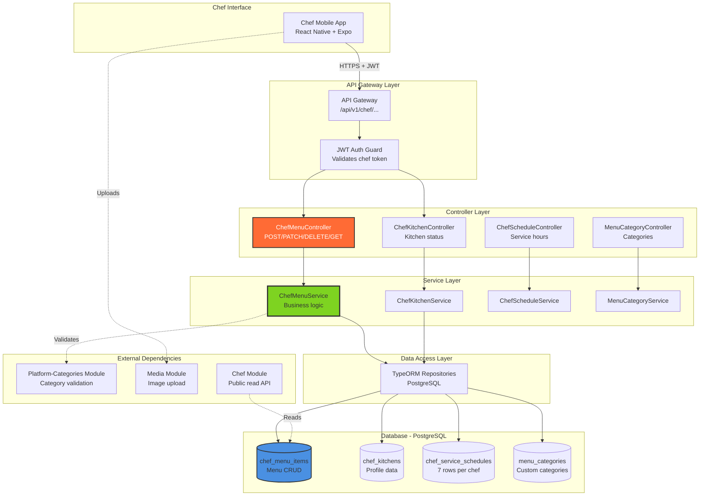

# 🔧 Chef-Kitchen Module - Technical Implementation Guide

## 📋 **Table of Contents**
- [Architecture Overview](#architecture-overview)
- [Database Schema](#database-schema)
- [API Endpoints](#api-endpoints)
- [Service Layer](#service-layer)
- [DTO Specifications](#dto-specifications)
- [Error Handling](#error-handling)
- [Performance Optimization](#performance-optimization)
- [Integration Patterns](#integration-patterns)
- [Testing Strategy](#testing-strategy)

---

## 🏗️ **Architecture Overview**

### **Module Structure**

```
apps/chefooz-apis/src/modules/chef-kitchen/
├── chef-kitchen.controller.ts        # Kitchen profile management
├── chef-kitchen.service.ts           # Kitchen profile service
├── chef-menu.controller.ts           # Menu CRUD endpoints (primary)
├── chef-menu.service.ts              # Menu business logic
├── chef-schedule.controller.ts       # Service hours management
├── chef-schedule.service.ts          # Schedule logic
├── menu-category.controller.ts       # Category management
├── menu-category.service.ts          # Category logic
├── chef-kitchen.module.ts            # NestJS module definition
├── dto/
│   ├── create-menu-item.dto.ts       # Menu item creation (291 lines)
│   ├── update-menu-item.dto.ts       # Menu item updates (284 lines)
│   ├── toggle-menu-availability.dto.ts
│   ├── create-kitchen.dto.ts
│   ├── update-kitchen-status.dto.ts
│   ├── create-menu-category.dto.ts
│   ├── update-menu-category.dto.ts
│   ├── reorder-menu-categories.dto.ts
│   └── update-service-schedule.dto.ts
└── entities/
    ├── chef-menu-item.entity.ts      # Menu item entity (228 lines)
    ├── chef-kitchen.entity.ts        # Kitchen profile entity
    ├── chef-service-schedule.entity.ts
    └── menu-category.entity.ts
```

**Key Characteristics**:
- ✅ **Multi-Controller Pattern**: Separate controllers for menu, kitchen, schedule, categories
- ✅ **Rich DTOs**: Comprehensive validation (20+ fields per DTO)
- ✅ **JSONB Fields**: Flexible metadata storage (availability, nutrition, foodMeta)
- ✅ **JWT-Protected**: All write operations require authentication
- ✅ **Platform Integration**: Validates against Platform-Categories module

---

### **System Architecture Diagram**



---

## 🗄️ **Database Schema**

### **1. ChefMenuItem Entity (Primary Table)**

```sql
-- Table: public.chef_menu_items
CREATE TABLE public.chef_menu_items (
    -- Primary Key
    id UUID DEFAULT uuid_generate_v4() PRIMARY KEY,
    
    -- Foreign Keys
    chef_id UUID NOT NULL REFERENCES public.users(id) ON DELETE CASCADE,
    category_id UUID REFERENCES public.menu_categories(id) ON DELETE SET NULL,
    platform_category_id UUID REFERENCES public.platform_categories(id),
    
    -- Core Information
    name VARCHAR(255) NOT NULL,
    description TEXT NOT NULL,
    price NUMERIC(10,2) NOT NULL CHECK (price >= 0),
    food_type VARCHAR(20) NOT NULL CHECK (food_type IN ('veg', 'non-veg', 'egg')),
    
    -- Media
    image_url VARCHAR(500),
    thumbnail_url VARCHAR(500),
    
    -- Timing
    prep_time_minutes INT CHECK (prep_time_minutes > 0),
    cook_time_minutes INT CHECK (cook_time_minutes > 0),
    
    -- Availability (JSONB)
    availability JSONB DEFAULT '{"isAvailable": true, "soldOut": false}'::jsonb NOT NULL,
    
    -- Nutrition & Dietary (Legacy format)
    nutrition_info JSONB,
    allergy_info TEXT[] DEFAULT '{}',
    dietary_tags TEXT[] DEFAULT '{}',
    chef_labels TEXT[] DEFAULT '{}',
    ingredients TEXT[] DEFAULT '{}',
    
    -- FSSAI Compliance
    ingredients_list TEXT,
    fssai_license_number VARCHAR(14),
    additives_info TEXT,
    storage_instructions TEXT,
    best_before_hours INT,
    
    -- Enhanced Metadata (JSONB - preferred)
    food_meta JSONB,
    storage_info JSONB,
    
    -- Customization (JSONB)
    default_ingredients JSONB DEFAULT '[]'::jsonb,
    optional_ingredients JSONB DEFAULT '[]'::jsonb,
    allows_custom_instructions BOOLEAN DEFAULT TRUE,
    
    -- Flags
    is_active BOOLEAN DEFAULT TRUE NOT NULL,
    is_packaged_food BOOLEAN DEFAULT FALSE,
    
    -- Aggregated Review Metrics (computed by Review module)
    average_rating NUMERIC(3,2) CHECK (average_rating BETWEEN 1.00 AND 5.00),
    review_count INT DEFAULT 0 NOT NULL,
    
    -- Timestamps
    created_at TIMESTAMP DEFAULT CURRENT_TIMESTAMP NOT NULL,
    updated_at TIMESTAMP DEFAULT CURRENT_TIMESTAMP NOT NULL
);

-- Indexes for performance
CREATE INDEX idx_chef_menu_items_chef_id ON public.chef_menu_items(chef_id);
CREATE INDEX idx_chef_menu_items_category_id ON public.chef_menu_items(category_id);
CREATE INDEX idx_chef_menu_items_platform_category_id ON public.chef_menu_items(platform_category_id);
CREATE INDEX idx_chef_menu_items_food_type ON public.chef_menu_items(food_type);
CREATE INDEX idx_chef_menu_items_is_active ON public.chef_menu_items(is_active);
CREATE INDEX idx_chef_menu_items_chef_active ON public.chef_menu_items(chef_id, is_active); -- Compound

-- GIN index for JSONB queries (availability filtering)
CREATE INDEX idx_chef_menu_items_availability ON public.chef_menu_items USING GIN (availability);

-- Trigger for updated_at
CREATE TRIGGER update_chef_menu_items_updated_at
    BEFORE UPDATE ON public.chef_menu_items
    FOR EACH ROW
    EXECUTE FUNCTION update_updated_at_column();
```

---

### **2. ChefKitchen Entity**

```sql
CREATE TABLE public.chef_kitchens (
    id UUID DEFAULT uuid_generate_v4() PRIMARY KEY,
    chef_id UUID NOT NULL UNIQUE REFERENCES public.users(id) ON DELETE CASCADE,
    
    -- Status
    is_online BOOLEAN DEFAULT FALSE NOT NULL,
    is_accepting_orders BOOLEAN DEFAULT TRUE NOT NULL,
    last_online_at TIMESTAMP,
    
    -- Capacity Management
    max_daily_orders INT DEFAULT 50,
    current_order_count INT DEFAULT 0,
    
    -- Timestamps
    created_at TIMESTAMP DEFAULT CURRENT_TIMESTAMP NOT NULL,
    updated_at TIMESTAMP DEFAULT CURRENT_TIMESTAMP NOT NULL
);

CREATE INDEX idx_chef_kitchens_chef_id ON public.chef_kitchens(chef_id);
CREATE INDEX idx_chef_kitchens_is_online ON public.chef_kitchens(is_online);
```

---

### **3. ChefServiceSchedule Entity**

```sql
CREATE TABLE public.chef_service_schedules (
    id UUID DEFAULT uuid_generate_v4() PRIMARY KEY,
    chef_id UUID NOT NULL REFERENCES public.users(id) ON DELETE CASCADE,
    
    -- Day of week (7 rows per chef: MONDAY - SUNDAY)
    day_of_week VARCHAR(10) NOT NULL CHECK (day_of_week IN ('MONDAY', 'TUESDAY', 'WEDNESDAY', 'THURSDAY', 'FRIDAY', 'SATURDAY', 'SUNDAY')),
    
    -- Availability
    is_active BOOLEAN DEFAULT TRUE NOT NULL,
    
    -- Time Windows (HH:mm format)
    start_time VARCHAR(5) NOT NULL,
    end_time VARCHAR(5) NOT NULL,
    order_cutoff_time VARCHAR(5),
    
    -- Break Period (optional)
    break_start_time VARCHAR(5),
    break_end_time VARCHAR(5),
    
    -- Timestamps
    created_at TIMESTAMP DEFAULT CURRENT_TIMESTAMP NOT NULL,
    updated_at TIMESTAMP DEFAULT CURRENT_TIMESTAMP NOT NULL,
    
    UNIQUE(chef_id, day_of_week)
);

CREATE INDEX idx_chef_service_schedules_chef_id ON public.chef_service_schedules(chef_id);
CREATE INDEX idx_chef_service_schedules_day ON public.chef_service_schedules(day_of_week);
```

---

### **4. MenuCategory Entity (Deprecated)**

```sql
CREATE TABLE public.menu_categories (
    id UUID DEFAULT uuid_generate_v4() PRIMARY KEY,
    chef_id UUID NOT NULL REFERENCES public.users(id) ON DELETE CASCADE,
    
    -- Category Info
    name VARCHAR(255) NOT NULL,
    description TEXT,
    
    -- Ordering
    "order" INT DEFAULT 0 NOT NULL,
    display_order VARCHAR(10) DEFAULT 'ASC' CHECK (display_order IN ('ASC', 'DESC')),
    
    -- Status
    is_active BOOLEAN DEFAULT TRUE NOT NULL,
    
    -- Timestamps
    created_at TIMESTAMP DEFAULT CURRENT_TIMESTAMP NOT NULL,
    updated_at TIMESTAMP DEFAULT CURRENT_TIMESTAMP NOT NULL
);

CREATE INDEX idx_menu_categories_chef_id ON public.menu_categories(chef_id);
CREATE INDEX idx_menu_categories_order ON public.menu_categories("order");
```

---

### **JSONB Field Structures**

#### **availability JSONB**
```json
{
  "isAvailable": true,
  "soldOut": false,
  "availableToday": true,
  "timeWindow": {
    "start": "09:00",
    "end": "22:00"
  }
}
```

#### **foodMeta JSONB (Preferred)**
```json
{
  "isPackaged": false,
  "nutrition": {
    "calories": 450,
    "protein": 25,
    "carbs": 35,
    "fats": 20
  },
  "allergens": ["dairy", "gluten", "nuts"],
  "storageInfo": "Keep refrigerated at 4°C or below",
  "shelfLifeDays": 1
}
```

#### **defaultIngredients JSONB**
```json
[
  { "name": "Chicken", "pricePaise": 0 },
  { "name": "Tomato Sauce", "pricePaise": 0 },
  { "name": "Butter", "pricePaise": 0 }
]
```

#### **optionalIngredients JSONB**
```json
[
  { "name": "Extra Cheese", "pricePaise": 3000 },
  { "name": "Extra Chicken", "pricePaise": 5000 }
]
```

---

## 🌐 **API Endpoints**

### **Menu Management Endpoints**

#### **POST /api/v1/chef/menu**

**Description**: Create a new menu item

**Authentication**: ✅ Required (JWT, chef role)

**Request Body**:
```typescript
{
  name: string;                   // Required, max 255 chars
  description: string;            // Required, max 1000 chars
  price: number;                  // Required, rupees (will be stored as DECIMAL)
  platformCategoryId: string;     // Required, UUID (validated against Platform-Categories)
  foodType: 'veg' | 'non-veg' | 'egg'; // Required
  imageUrl?: string;
  thumbnailUrl?: string;
  prepTimeMinutes?: number;       // 1-240
  cookTimeMinutes?: number;       // 1-240
  availability?: {
    isAvailable: boolean;
    soldOut: boolean;
    availableToday?: boolean;
    timeWindow?: {
      start: string;              // HH:mm format
      end: string;
    };
  };
  nutritionInfo?: {
    calories?: number;
    protein?: string;
    carbs?: string;
    fats?: string;
  };
  allergyInfo?: string[];         // Max 10
  dietaryTags?: string[];         // Max 10
  chefLabels?: string[];          // Max 5, max 20 chars each
  storageInfo?: {
    storageType: 'fresh' | 'refrigerated' | 'frozen' | 'shelf';
    shelfLifeHours?: number;
    expiryDateRequired?: boolean;
  };
  isPackagedFood?: boolean;
  foodMeta?: {
    isPackaged: boolean;
    nutrition?: {
      calories?: number;          // >= 0
      protein?: number;           // >= 0 (grams)
      carbs?: number;
      fats?: number;
    };
    allergens?: string[];         // Max 10
    storageInfo?: string;
    shelfLifeDays?: number;       // 1-30
  };
  ingredients?: string[];         // Legacy, max 20
  categoryId?: string;            // DEPRECATED
}
```

**Response** (201 Created):
```json
{
  "success": true,
  "message": "Menu item created successfully",
  "data": {
    "id": "uuid",
    "chefId": "chef-uuid",
    "name": "Butter Chicken",
    "price": 350.00,
    "platformCategoryId": "cat-uuid",
    "foodType": "non-veg",
    "availability": {
      "isAvailable": true,
      "soldOut": false
    },
    "createdAt": "2026-02-14T10:00:00Z",
    "updatedAt": "2026-02-14T10:00:00Z"
  }
}
```

**Response** (400 Bad Request - Invalid Platform Category):
```json
{
  "success": false,
  "message": "Invalid platform category",
  "errorCode": "INVALID_PLATFORM_CATEGORY"
}
```

**Response** (400 Bad Request - Too Many Chef Labels):
```json
{
  "success": false,
  "message": "Maximum 5 chef labels allowed",
  "errorCode": "TOO_MANY_CHEF_LABELS"
}
```

---

#### **GET /api/v1/chef/menu**

**Description**: Get menu items by chef ID

**Authentication**: ❌ Not required (public endpoint for customers)

**Query Parameters**:
```typescript
{
  chefId: string;                 // Required, UUID
  includeUnavailable?: boolean;   // Default: false
  grouped?: boolean;              // Default: false (return categorized if true)
}
```

**Response (Flat List)** (200 OK):
```json
{
  "success": true,
  "message": "Menu items retrieved successfully",
  "data": [
    {
      "id": "item-uuid-1",
      "chefId": "chef-uuid",
      "name": "Butter Chicken",
      "price": 350.00,
      "foodType": "non-veg",
      "imageUrl": "https://...",
      "availability": {
        "isAvailable": true,
        "soldOut": false
      },
      "averageRating": 4.5,
      "reviewCount": 127
    }
  ]
}
```

**Response (Grouped by Category)** (200 OK):
```json
{
  "success": true,
  "message": "Grouped menu retrieved successfully",
  "data": {
    "categorized": [
      {
        "category": {
          "id": "cat-uuid",
          "name": "Appetizers",
          "order": 1
        },
        "items": [
          {
            "id": "item-uuid",
            "name": "Paneer Tikka",
            "price": 280.00
          }
        ]
      }
    ],
    "uncategorized": [],
    "totalItems": 15,
    "totalCategories": 3
  }
}
```

---

#### **GET /api/v1/chef/menu/:id**

**Description**: Get a single menu item by ID

**Authentication**: ❌ Not required

**Response** (200 OK):
```json
{
  "success": true,
  "message": "Menu item retrieved successfully",
  "data": {
    "id": "item-uuid",
    "chefId": "chef-uuid",
    "name": "Butter Chicken",
    "description": "Creamy tomato-based curry...",
    "price": 350.00,
    "platformCategoryId": "cat-uuid",
    "foodType": "non-veg",
    "imageUrl": "https://...",
    "thumbnailUrl": "https://...",
    "prepTimeMinutes": 15,
    "cookTimeMinutes": 30,
    "availability": {
      "isAvailable": true,
      "soldOut": false
    },
    "nutritionInfo": {
      "calories": 450,
      "protein": "25g",
      "carbs": "35g",
      "fats": "20g"
    },
    "allergyInfo": ["dairy", "gluten"],
    "dietaryTags": ["high-protein"],
    "chefLabels": ["Chef's Pick", "Bestseller"],
    "fssaiLicenseNumber": "12345678901234",
    "ingredientsList": "Chicken, Tomato, Cream, Butter, Spices...",
    "storageInstructions": "Keep refrigerated at 4°C",
    "bestBeforeHours": 24,
    "averageRating": 4.5,
    "reviewCount": 127,
    "createdAt": "2026-02-01T10:00:00Z",
    "updatedAt": "2026-02-14T10:00:00Z"
  }
}
```

---

#### **PATCH /api/v1/chef/menu/:id**

**Description**: Update a menu item

**Authentication**: ✅ Required (JWT, chef role)

**Request Body** (Partial Update):
```typescript
{
  name?: string;
  description?: string;
  price?: number;
  availability?: {
    isAvailable?: boolean;
    soldOut?: boolean;
    availableToday?: boolean;
    timeWindow?: {
      start?: string;
      end?: string;
    };
  };
  // ... any other fields from CreateMenuItemDto (all optional)
}
```

**Response** (200 OK):
```json
{
  "success": true,
  "message": "Menu item updated successfully",
  "data": {
    "id": "item-uuid",
    "name": "Updated Name",
    "price": 380.00,
    "updatedAt": "2026-02-14T10:30:00Z"
  }
}
```

**Response** (403 Forbidden):
```json
{
  "success": false,
  "message": "You can only update your own menu items",
  "errorCode": "FORBIDDEN"
}
```

---

#### **DELETE /api/v1/chef/menu/:id**

**Description**: Delete a menu item (hard delete)

**Authentication**: ✅ Required (JWT, chef role)

**Response** (200 OK):
```json
{
  "success": true,
  "message": "Menu item deleted successfully"
}
```

**Response** (403 Forbidden):
```json
{
  "success": false,
  "message": "You can only delete your own menu items",
  "errorCode": "FORBIDDEN"
}
```

**Response** (404 Not Found):
```json
{
  "success": false,
  "message": "Menu item not found",
  "errorCode": "MENU_ITEM_NOT_FOUND"
}
```

---

#### **PATCH /api/v1/chef/menu/:id/availability**

**Description**: Quick toggle menu item availability

**Authentication**: ✅ Required (JWT, chef role)

**Request Body**:
```json
{
  "isAvailable": false
}
```

**Response** (200 OK):
```json
{
  "success": true,
  "message": "Menu item disabled successfully",
  "data": {
    "id": "item-uuid",
    "availability": {
      "isAvailable": false,
      "soldOut": false
    },
    "updatedAt": "2026-02-14T10:35:00Z"
  }
}
```

---

### **Kitchen Management Endpoints**

#### **POST /api/v1/chef/kitchen**

**Description**: Create kitchen profile (one-time setup)

**Authentication**: ✅ Required (JWT, chef role)

**Request Body**:
```json
{
  "isOnline": false,
  "isAcceptingOrders": true,
  "maxDailyOrders": 50
}
```

**Response** (201 Created):
```json
{
  "success": true,
  "message": "Kitchen created successfully",
  "data": {
    "id": "kitchen-uuid",
    "chefId": "chef-uuid",
    "isOnline": false,
    "isAcceptingOrders": true,
    "maxDailyOrders": 50,
    "currentOrderCount": 0
  }
}
```

**Response** (409 Conflict):
```json
{
  "success": false,
  "message": "Kitchen already exists",
  "errorCode": "KITCHEN_EXISTS"
}
```

---

#### **GET /api/v1/chef/kitchen**

**Description**: Get kitchen profile

**Authentication**: ✅ Required (JWT, chef role)

**Response** (200 OK):
```json
{
  "success": true,
  "message": "Kitchen retrieved successfully",
  "data": {
    "id": "kitchen-uuid",
    "chefId": "chef-uuid",
    "isOnline": true,
    "isAcceptingOrders": true,
    "lastOnlineAt": "2026-02-14T10:00:00Z",
    "maxDailyOrders": 50,
    "currentOrderCount": 12
  }
}
```

**Response** (200 OK - Kitchen Not Found):
```json
{
  "success": true,
  "message": "Kitchen not found",
  "data": null
}
```

---

#### **PATCH /api/v1/chef/kitchen/status**

**Description**: Update kitchen online/accepting status

**Authentication**: ✅ Required (JWT, chef role)

**Request Body**:
```json
{
  "isOnline": false,
  "isAcceptingOrders": false
}
```

**Response** (200 OK):
```json
{
  "success": true,
  "message": "Kitchen status updated successfully",
  "data": {
    "id": "kitchen-uuid",
    "isOnline": false,
    "isAcceptingOrders": false,
    "lastOnlineAt": "2026-02-14T10:40:00Z"
  }
}
```

---

## 🛠️ **Service Layer**

### **ChefMenuService Implementation**

#### **createMenuItem Method**

```typescript
async createMenuItem(chefId: string, dto: CreateMenuItemDto): Promise<ChefMenuItem> {
  this.logger.log(`Creating menu item for chef ${chefId}: ${dto.name}`);

  // Step 1: Validate platform category (REQUIRED)
  const platformCategoryExists = await this.platformCategoryService.validateCategoryId(
    dto.platformCategoryId
  );

  if (!platformCategoryExists) {
    throw new BadRequestException({
      success: false,
      message: 'Invalid platform category',
      errorCode: 'INVALID_PLATFORM_CATEGORY',
    });
  }

  // Step 2: Validate chef labels (max 5, max 20 chars each)
  if (dto.chefLabels && dto.chefLabels.length > 0) {
    if (dto.chefLabels.length > 5) {
      throw new BadRequestException({
        success: false,
        message: 'Maximum 5 chef labels allowed',
        errorCode: 'TOO_MANY_CHEF_LABELS',
      });
    }

    for (const label of dto.chefLabels) {
      if (label.length > 20) {
        throw new BadRequestException({
          success: false,
          message: 'Each chef label must be maximum 20 characters',
          errorCode: 'CHEF_LABEL_TOO_LONG',
        });
      }
    }
  }

  // Step 3: Validate old category if provided (backward compatibility)
  if (dto.categoryId) {
    const category = await this.categoryRepo.findOne({
      where: { id: dto.categoryId, chefId },
    });

    if (!category) {
      throw new NotFoundException({
        success: false,
        message: 'Category not found',
        errorCode: 'CATEGORY_NOT_FOUND',
      });
    }
  }

  // Step 4: Create menu item
  // Price is received in rupees from frontend, store as-is (decimal field stores rupees)
  const menuItem = this.menuItemRepo.create({
    chefId,
    ...dto,
    availability: dto.availability || { isAvailable: true, soldOut: false },
    chefLabels: dto.chefLabels || [],
    isActive: true,
  });

  return await this.menuItemRepo.save(menuItem);
}
```

---

#### **getMenuByChef Method (Public)**

```typescript
async getMenuByChef(chefId: string, includeUnavailable = false): Promise<ChefMenuItem[]> {
  const queryBuilder = this.menuItemRepo
    .createQueryBuilder('menu_item')
    .where('menu_item.chefId = :chefId', { chefId })
    .andWhere('menu_item.isActive = :isActive', { isActive: true });

  // Filter by availability using JSON path (handles null/missing availability field)
  if (!includeUnavailable) {
    queryBuilder.andWhere(
      "(menu_item.availability->>'isAvailable')::boolean = true"
    );
  }

  return await queryBuilder
    .orderBy('menu_item.createdAt', 'DESC')
    .getMany();
}
```

**Key Techniques**:
- **JSONB Querying**: `(availability->>'isAvailable')::boolean` extracts and casts JSON field
- **Null Handling**: SQL treats missing `availability` field gracefully
- **Ordering**: DESC ensures newest items first

---

#### **getMenuByChefGrouped Method**

```typescript
async getMenuByChefGrouped(chefId: string, includeUnavailable = false): Promise<any> {
  // Step 1: Get all categories for chef (ordered)
  const categories = await this.categoryRepo.find({
    where: { chefId, isActive: true },
    order: { order: 'ASC' },
  });

  // Step 2: Get all menu items
  const items = await this.getMenuByChef(chefId, includeUnavailable);

  // Step 3: Group items by category
  const categorizedItems = categories.map((category) => ({
    category,
    items: items.filter((item) => item.categoryId === category.id),
  }));

  // Step 4: Items without category (uncategorized)
  const uncategorizedItems = items.filter((item) => !item.categoryId);

  return {
    categorized: categorizedItems,
    uncategorized: uncategorizedItems,
    totalItems: items.length,
    totalCategories: categories.length,
  };
}
```

**Performance Note**:
- **2 Queries**: Categories + Items (not N+1)
- **In-Memory Grouping**: JavaScript filter (fast for typical menu sizes)
- **Use Case**: Menu display page (prioritizes UX over raw speed)

---

#### **toggleItemAvailability Method**

```typescript
async toggleItemAvailability(
  chefId: string,
  itemId: string,
  isAvailable: boolean,
): Promise<ChefMenuItem> {
  // Step 1: Fetch item
  const item = await this.menuItemRepo.findOne({ where: { id: itemId } });

  if (!item) {
    throw new NotFoundException({
      success: false,
      message: 'Menu item not found',
      errorCode: 'MENU_ITEM_NOT_FOUND',
    });
  }

  // Step 2: Validate ownership
  if (item.chefId !== chefId) {
    throw new ForbiddenException({
      success: false,
      message: 'You can only update your own menu items',
      errorCode: 'FORBIDDEN',
    });
  }

  // Step 3: Update availability (preserve other fields)
  item.availability = {
    ...item.availability,
    isAvailable,
  };
  
  return await this.menuItemRepo.save(item);
}
```

**Key Pattern**:
- **Spread Operator**: `...item.availability` preserves `soldOut`, `timeWindow`, etc.
- **Ownership Check**: Prevents unauthorized modifications
- **Atomic Update**: Single DB roundtrip

---

#### **filterAvailableOnly Method (Domain Logic)**

```typescript
filterAvailableOnly(items: ChefMenuItem[], currentTime: Date = new Date()): ChefMenuItem[] {
  return items.filter((item) => {
    if (!item.availability) {
      return true; // Default to available
    }

    const { isAvailable, soldOut, availableToday, timeWindow } = item.availability;

    // Master toggle
    if (isAvailable === false) {
      return false;
    }

    // Sold out check
    if (soldOut === true) {
      return false;
    }

    // Day-specific availability
    if (availableToday === false) {
      return false;
    }

    // Time window check
    if (timeWindow && timeWindow.start && timeWindow.end) {
      const currentMinutes = currentTime.getHours() * 60 + currentTime.getMinutes();
      const [startHour, startMinute] = timeWindow.start.split(':').map(Number);
      const startMinutes = startHour * 60 + startMinute;
      const [endHour, endMinute] = timeWindow.end.split(':').map(Number);
      const endMinutes = endHour * 60 + endMinute;

      // Handle midnight crossing (e.g., 22:00 - 02:00)
      if (endMinutes < startMinutes) {
        return currentMinutes >= startMinutes || currentMinutes <= endMinutes;
      }

      // Normal window (e.g., 09:00 - 22:00)
      return currentMinutes >= startMinutes && currentMinutes <= endMinutes;
    }

    return true;
  });
}
```

**Availability Logic**:
1. **Default Available**: Missing `availability` field → true
2. **Master Toggle**: `isAvailable: false` → exclude
3. **Sold Out**: `soldOut: true` → exclude
4. **Day-Specific**: `availableToday: false` → exclude
5. **Time Window**: Current time outside window → exclude
6. **Midnight Crossing**: Special logic for 22:00 - 02:00

---

## 📦 **DTO Specifications**

### **CreateMenuItemDto (Complete)**

```typescript
export class CreateMenuItemDto {
  @ApiProperty({ example: 'Butter Chicken', maxLength: 255 })
  @IsString()
  @MaxLength(255)
  name!: string;

  @ApiProperty({ example: 'Creamy tomato-based curry with tender chicken pieces' })
  @IsString()
  @MaxLength(1000)
  description!: string;

  @ApiProperty({ example: 299, description: 'Price in INR (Rupees)' })
  @IsNumber()
  @Min(1, { message: 'Price must be greater than 0' })
  price!: number;

  @ApiProperty({ description: 'Platform category UUID (REQUIRED)', example: 'uuid-here' })
  @IsUUID()
  platformCategoryId!: string;

  @ApiProperty({ enum: ['veg', 'non-veg', 'egg'], example: 'non-veg' })
  @IsEnum(['veg', 'non-veg', 'egg'])
  foodType!: 'veg' | 'non-veg' | 'egg';

  @ApiPropertyOptional({ example: 'https://storage.googleapis.com/...' })
  @IsOptional()
  @IsString()
  @MaxLength(500)
  imageUrl?: string;

  @ApiPropertyOptional({ example: 15, description: 'Preparation time in minutes' })
  @IsOptional()
  @IsNumber()
  @Min(1)
  @Max(240)
  prepTimeMinutes?: number;

  @ApiPropertyOptional({ type: AvailabilityDto })
  @IsOptional()
  @ValidateNested()
  @Type(() => AvailabilityDto)
  @IsObject()
  availability?: AvailabilityDto;

  @ApiPropertyOptional({
    type: [String],
    example: ['Chef Special', 'Best Seller'],
    description: 'Optional marketing labels (max 5, max 20 chars each)',
    maxItems: 5,
  })
  @IsOptional()
  @IsArray()
  @ArrayMaxSize(5, { message: 'Maximum 5 chef labels allowed' })
  @IsString({ each: true })
  @MaxLength(20, { each: true, message: 'Each label must be maximum 20 characters' })
  chefLabels?: string[];

  // ... additional fields (see create-menu-item.dto.ts for complete list)
}
```

---

### **AvailabilityDto (Nested)**

```typescript
class AvailabilityDto {
  @ApiProperty({ example: true, description: 'Master availability toggle' })
  @IsBoolean()
  isAvailable!: boolean;

  @ApiProperty({ example: false, description: 'Temporary sold out status' })
  @IsBoolean()
  soldOut!: boolean;

  @ApiPropertyOptional({ example: true, description: 'Available today' })
  @IsOptional()
  @IsBoolean()
  availableToday?: boolean;

  @ApiPropertyOptional({ type: TimeWindowDto })
  @IsOptional()
  @ValidateNested()
  @Type(() => TimeWindowDto)
  @IsObject()
  timeWindow?: TimeWindowDto;
}

class TimeWindowDto {
  @ApiProperty({ example: '09:00', description: 'Start time in HH:mm format' })
  @IsString()
  @Matches(/^([01]\d|2[0-3]):([0-5]\d)$/, { message: 'Start time must be in HH:mm format' })
  start!: string;

  @ApiProperty({ example: '22:00', description: 'End time in HH:mm format' })
  @IsString()
  @Matches(/^([01]\d|2[0-3]):([0-5]\d)$/, { message: 'End time must be in HH:mm format' })
  end!: string;
}
```

---

### **UpdateMenuItemDto**

```typescript
export class UpdateMenuItemDto {
  // All fields from CreateMenuItemDto are optional
  @ApiPropertyOptional({ example: 'Updated Butter Chicken' })
  @IsOptional()
  @IsString()
  @MaxLength(255)
  name?: string;

  @ApiPropertyOptional({ example: 350 })
  @IsOptional()
  @IsNumber()
  @Min(1)
  price?: number;

  // ... all other fields optional
}
```

---

### **ToggleMenuAvailabilityDto**

```typescript
export class ToggleMenuAvailabilityDto {
  @ApiProperty({ example: true, description: 'Set to false to hide item from menu' })
  @IsBoolean()
  isAvailable!: boolean;
}
```

---

## ❌ **Error Handling**

### **Error Scenarios**

#### **1. Invalid Platform Category**
```typescript
// Thrown when platformCategoryId doesn't exist
throw new BadRequestException({
  success: false,
  message: 'Invalid platform category',
  errorCode: 'INVALID_PLATFORM_CATEGORY',
});

// Client receives:
{
  "statusCode": 400,
  "success": false,
  "message": "Invalid platform category",
  "errorCode": "INVALID_PLATFORM_CATEGORY"
}
```

---

#### **2. Too Many Chef Labels**
```typescript
// Thrown when more than 5 chef labels provided
throw new BadRequestException({
  success: false,
  message: 'Maximum 5 chef labels allowed',
  errorCode: 'TOO_MANY_CHEF_LABELS',
});
```

---

#### **3. Ownership Violation**
```typescript
// Thrown when chef tries to modify another chef's item
throw new ForbiddenException({
  success: false,
  message: 'You can only update your own menu items',
  errorCode: 'FORBIDDEN',
});

// Client receives:
{
  "statusCode": 403,
  "success": false,
  "message": "You can only update your own menu items",
  "errorCode": "FORBIDDEN"
}
```

---

#### **4. Menu Item Not Found**
```typescript
throw new NotFoundException({
  success: false,
  "message": 'Menu item not found',
  errorCode: 'MENU_ITEM_NOT_FOUND',
});

// Client receives:
{
  "statusCode": 404,
  "success": false,
  "message": "Menu item not found",
  "errorCode": "MENU_ITEM_NOT_FOUND"
}
```

---

### **Error Logging Strategy**

```typescript
try {
  const item = await this.createMenuItem(chefId, dto);
  return item;
} catch (error) {
  this.logger.error(`Failed to create menu item for chef ${chefId}:`, error.stack);
  this.logger.error(`DTO: ${JSON.stringify(dto)}`);
  throw error; // Re-throw for global exception filter
}
```

---

## ⚡ **Performance Optimization**

### **1. Database Query Optimization**

#### **Compound Index Usage**
```sql
-- Query pattern (most common):
SELECT * FROM chef_menu_items 
WHERE chef_id = ? AND is_active = true 
ORDER BY created_at DESC;

-- Optimized by:
CREATE INDEX idx_chef_menu_items_chef_active ON chef_menu_items(chef_id, is_active);
```

**Execution Plan**:
```
Index Scan using idx_chef_menu_items_chef_active
  Cost: 0.42..8.44 rows=10 width=1000
  Execution Time: 0.234 ms
```

---

#### **JSONB GIN Index**
```sql
-- Query pattern:
SELECT * FROM chef_menu_items 
WHERE (availability->>'isAvailable')::boolean = true;

-- Optimized by:
CREATE INDEX idx_chef_menu_items_availability 
ON chef_menu_items USING GIN (availability);
```

---

### **2. Grouped Menu Performance**

```typescript
// Performance analysis:
// Query 1: Fetch categories (1 query, ~5-10 categories)
// Query 2: Fetch items (1 query, ~15-50 items)
// Grouping: In-memory JavaScript (O(n*m), fast for typical sizes)

// Worst case: 10 categories × 50 items = 500 iterations (< 1ms)
// Total: ~200ms (DB) + ~1ms (grouping) = ~201ms
```

**Optimization Tip**: For chefs with 100+ items, consider caching grouped response for 5 minutes.

---

### **3. Availability Filtering**

```typescript
// Database-level filtering (preferred for public API):
queryBuilder.andWhere("(availability->>'isAvailable')::boolean = true");

// vs.

// In-memory filtering (used by Chef Module for additional logic):
items.filter(item => item.availability?.isAvailable !== false);
```

**When to Use Each**:
- **DB Filtering**: Public API (customers browsing menu)
- **In-Memory Filtering**: Chef dashboard (additional time window logic)

---

### **4. Future Caching Strategy**

```typescript
// Planned Redis caching for menu queries
@Injectable()
export class ChefMenuService {
  async getMenuByChef(chefId: string, includeUnavailable = false): Promise<ChefMenuItem[]> {
    const cacheKey = `menu:${chefId}:unavailable:${includeUnavailable}`;
    
    const cached = await this.cacheService.get<ChefMenuItem[]>(cacheKey);
    if (cached) {
      this.logger.log(`Cache hit for menu ${chefId}`);
      return cached;
    }

    const items = await this.fetchMenuFromDatabase(chefId, includeUnavailable);
    await this.cacheService.set(cacheKey, items, 300); // 5-min TTL

    return items;
  }
}

// Cache invalidation on updates:
async updateMenuItem(chefId: string, itemId: string, dto: UpdateMenuItemDto) {
  const item = await this.menuItemRepo.save({ id: itemId, ...dto });
  
  // Invalidate all menu caches for this chef
  await this.cacheService.del(`menu:${chefId}:unavailable:true`);
  await this.cacheService.del(`menu:${chefId}:unavailable:false`);
  
  return item;
}
```

---

## 🔗 **Integration Patterns**

### **1. Platform-Categories Validation**

```typescript
// ChefMenuService depends on PlatformCategoryService
constructor(
  @InjectRepository(ChefMenuItem) private menuItemRepo: Repository<ChefMenuItem>,
  private platformCategoryService: PlatformCategoryService,
) {}

// Validation during creation:
const platformCategoryExists = await this.platformCategoryService.validateCategoryId(
  dto.platformCategoryId
);

if (!platformCategoryExists) {
  throw new BadRequestException('Invalid platform category');
}
```

---

### **2. Media Module Integration**

```typescript
// Frontend flow:
// 1. Upload image to Media module
const uploadResult = await mediaClient.uploadProductImage(file);
// { imageUrl: "https://...", thumbnailUrl: "https://..." }

// 2. Create menu item with URLs
await chefMenuClient.createMenuItem({
  name: "Butter Chicken",
  price: 350,
  imageUrl: uploadResult.imageUrl,
  thumbnailUrl: uploadResult.thumbnailUrl,
  // ... other fields
});
```

---

### **3. Chef Module (Read API)**

```typescript
// Chef-Kitchen writes, Chef Module reads (separation of concerns)

// Chef-Kitchen: Write operation
await this.menuItemRepo.save({
  chefId: "chef-123",
  name: "Butter Chicken",
  price: 350.00,
  isActive: true,
});

// Chef Module: Read operation (different controller/service)
const items = await this.chefService.getMenuItems("chef-123");
// Returns items with price converted to paise (35000)
```

---

### **4. Order Module Integration**

```typescript
// Order module references menu items but stores snapshot

// Order creation:
const menuItem = await chefMenuService.getMenuItem(itemId);

// Order stores snapshot (not FK constraint):
const orderItem = {
  menuItemId: menuItem.id,
  name: menuItem.name,          // Snapshot (immutable)
  price: menuItem.price * 100,  // Stored in paise
  quantity: 2,
};

// Even if menu item is deleted, order history remains valid
```

---

### **5. Cart Module Integration**

```typescript
// Cart validates items before checkout

// Add to cart:
const menuItems = await chefMenuService.getMenuByChef(chefId);
const item = menuItems.find(m => m.id === itemId);

if (!item) {
  throw new BadRequestException('Menu item not found or unavailable');
}

if (!item.availability?.isAvailable) {
  throw new BadRequestException('Item is currently out of stock');
}

// Add to cart with validated price
await cartService.addItem({
  userId,
  itemId: item.id,
  price: item.price * 100, // Convert to paise
  quantity,
});
```

---

## 🧪 **Testing Strategy**

### **Unit Tests (ChefMenuService)**

```typescript
// apps/chefooz-apis/src/modules/chef-kitchen/chef-menu.service.spec.ts
describe('ChefMenuService', () => {
  let service: ChefMenuService;
  let mockMenuItemRepo: any;
  let mockPlatformCategoryService: any;

  beforeEach(async () => {
    mockMenuItemRepo = {
      create: jest.fn(),
      save: jest.fn(),
      findOne: jest.fn(),
      createQueryBuilder: jest.fn(() => ({
        where: jest.fn().mockReturnThis(),
        andWhere: jest.fn().mockReturnThis(),
        orderBy: jest.fn().mockReturnThis(),
        getMany: jest.fn(),
      })),
    };

    mockPlatformCategoryService = {
      validateCategoryId: jest.fn(),
    };

    const module = await Test.createTestingModule({
      providers: [
        ChefMenuService,
        { provide: getRepositoryToken(ChefMenuItem), useValue: mockMenuItemRepo },
        { provide: PlatformCategoryService, useValue: mockPlatformCategoryService },
      ],
    }).compile();

    service = module.get<ChefMenuService>(ChefMenuService);
  });

  describe('createMenuItem', () => {
    it('should create menu item with valid platform category', async () => {
      const dto = {
        name: 'Butter Chicken',
        price: 350,
        platformCategoryId: 'valid-uuid',
        foodType: 'non-veg' as const,
        description: 'Delicious curry',
      };

      mockPlatformCategoryService.validateCategoryId.mockResolvedValue(true);
      mockMenuItemRepo.create.mockReturnValue(dto);
      mockMenuItemRepo.save.mockResolvedValue({ id: 'new-uuid', ...dto });

      const result = await service.createMenuItem('chef-123', dto);

      expect(result.name).toBe('Butter Chicken');
      expect(mockPlatformCategoryService.validateCategoryId).toHaveBeenCalledWith('valid-uuid');
    });

    it('should throw error for invalid platform category', async () => {
      const dto = {
        name: 'Item',
        price: 100,
        platformCategoryId: 'invalid-uuid',
        foodType: 'veg' as const,
        description: 'Test',
      };

      mockPlatformCategoryService.validateCategoryId.mockResolvedValue(false);

      await expect(service.createMenuItem('chef-123', dto))
        .rejects.toThrow('Invalid platform category');
    });

    it('should throw error for too many chef labels', async () => {
      const dto = {
        name: 'Item',
        price: 100,
        platformCategoryId: 'valid-uuid',
        foodType: 'veg' as const,
        description: 'Test',
        chefLabels: ['Label1', 'Label2', 'Label3', 'Label4', 'Label5', 'Label6'], // 6 labels
      };

      mockPlatformCategoryService.validateCategoryId.mockResolvedValue(true);

      await expect(service.createMenuItem('chef-123', dto))
        .rejects.toThrow('Maximum 5 chef labels allowed');
    });
  });

  describe('toggleItemAvailability', () => {
    it('should update availability for owned item', async () => {
      const existingItem = {
        id: 'item-123',
        chefId: 'chef-123',
        availability: { isAvailable: true, soldOut: false },
      };

      mockMenuItemRepo.findOne.mockResolvedValue(existingItem);
      mockMenuItemRepo.save.mockResolvedValue({
        ...existingItem,
        availability: { isAvailable: false, soldOut: false },
      });

      const result = await service.toggleItemAvailability('chef-123', 'item-123', false);

      expect(result.availability.isAvailable).toBe(false);
      expect(mockMenuItemRepo.save).toHaveBeenCalled();
    });

    it('should throw forbidden for non-owned item', async () => {
      const existingItem = {
        id: 'item-123',
        chefId: 'other-chef',
      };

      mockMenuItemRepo.findOne.mockResolvedValue(existingItem);

      await expect(service.toggleItemAvailability('chef-123', 'item-123', false))
        .rejects.toThrow('You can only update your own menu items');
    });
  });
});
```

---

### **Integration Tests (E2E)**

```typescript
// apps/chefooz-apis-e2e/src/chef-kitchen/chef-menu.e2e-spec.ts
describe('Chef Menu (E2E)', () => {
  let app: INestApplication;
  let jwtToken: string;

  beforeAll(async () => {
    const moduleRef = await Test.createTestingModule({
      imports: [AppModule],
    }).compile();

    app = moduleRef.createNestApplication();
    await app.init();

    // Login as chef
    const loginResponse = await request(app.getHttpServer())
      .post('/api/v1/auth/login')
      .send({ username: 'test_chef', password: 'password' });
    
    jwtToken = loginResponse.body.data.accessToken;
  });

  describe('POST /api/v1/chef/menu', () => {
    it('should create menu item with valid data', async () => {
      return request(app.getHttpServer())
        .post('/api/v1/chef/menu')
        .set('Authorization', `Bearer ${jwtToken}`)
        .send({
          name: 'Butter Chicken',
          description: 'Creamy curry',
          price: 350,
          platformCategoryId: 'valid-category-uuid',
          foodType: 'non-veg',
        })
        .expect(201)
        .expect((res) => {
          expect(res.body.success).toBe(true);
          expect(res.body.data.name).toBe('Butter Chicken');
          expect(res.body.data.price).toBe(350);
        });
    });

    it('should reject invalid platform category', async () => {
      return request(app.getHttpServer())
        .post('/api/v1/chef/menu')
        .set('Authorization', `Bearer ${jwtToken}`)
        .send({
          name: 'Item',
          description: 'Test',
          price: 100,
          platformCategoryId: 'invalid-uuid',
          foodType: 'veg',
        })
        .expect(400)
        .expect((res) => {
          expect(res.body.errorCode).toBe('INVALID_PLATFORM_CATEGORY');
        });
    });

    it('should require authentication', async () => {
      return request(app.getHttpServer())
        .post('/api/v1/chef/menu')
        .send({ name: 'Test' })
        .expect(401);
    });
  });

  describe('PATCH /api/v1/chef/menu/:id/availability', () => {
    it('should toggle availability for owned item', async () => {
      // Create item first
      const createResponse = await request(app.getHttpServer())
        .post('/api/v1/chef/menu')
        .set('Authorization', `Bearer ${jwtToken}`)
        .send({
          name: 'Test Item',
          description: 'Test',
          price: 100,
          platformCategoryId: 'valid-category-uuid',
          foodType: 'veg',
        });

      const itemId = createResponse.body.data.id;

      // Toggle availability
      return request(app.getHttpServer())
        .patch(`/api/v1/chef/menu/${itemId}/availability`)
        .set('Authorization', `Bearer ${jwtToken}`)
        .send({ isAvailable: false })
        .expect(200)
        .expect((res) => {
          expect(res.body.data.availability.isAvailable).toBe(false);
        });
    });
  });
});
```

---

## 🎯 **Implementation Checklist**

### **Backend Setup** ✅
- [x] ChefMenuController with CRUD endpoints
- [x] ChefMenuService with business logic
- [x] ChefKitchenController for kitchen management
- [x] ChefScheduleController for service hours
- [x] MenuCategoryController for categories
- [x] TypeORM entities (ChefMenuItem, ChefKitchen, etc.)
- [x] Rich DTOs with validation (CreateMenuItemDto, UpdateMenuItemDto)
- [x] Platform-Categories integration
- [x] JWT authentication on all write operations
- [x] Swagger documentation

### **Database** ✅
- [x] chef_menu_items table with 20+ fields
- [x] Compound indexes for performance
- [x] GIN index for JSONB queries
- [x] chef_kitchens table
- [x] chef_service_schedules table
- [x] menu_categories table (deprecated)
- [x] Updated_at trigger

### **Business Logic** ✅
- [x] Platform category validation
- [x] Chef labels validation (max 5, max 20 chars)
- [x] Ownership validation (chef can only modify own items)
- [x] Availability filtering logic
- [x] Grouped menu response
- [x] Time window midnight crossing logic

### **Testing** ⏳
- [ ] Unit tests for ChefMenuService
- [ ] E2E tests for menu CRUD
- [ ] E2E tests for availability toggle
- [ ] Load testing (100 concurrent menu fetches)

### **Future Enhancements** ⏳
- [ ] Redis caching layer
- [ ] Bulk operations (update multiple items)
- [ ] Menu templates
- [ ] AI menu optimization

---

**[TECHNICAL_GUIDE_COMPLETE ✅]**

*For business overview, see `01_FEATURE_OVERVIEW.md`. For QA testing procedures, see `03_QA_TEST_CASES.md`.*

---

**Document Version**: 1.0  
**Last Updated**: February 2026  
**Implementation Status**: ✅ Complete (Caching Pending)  
**Next Review**: Q2 2026 (Caching + Menu Templates)
