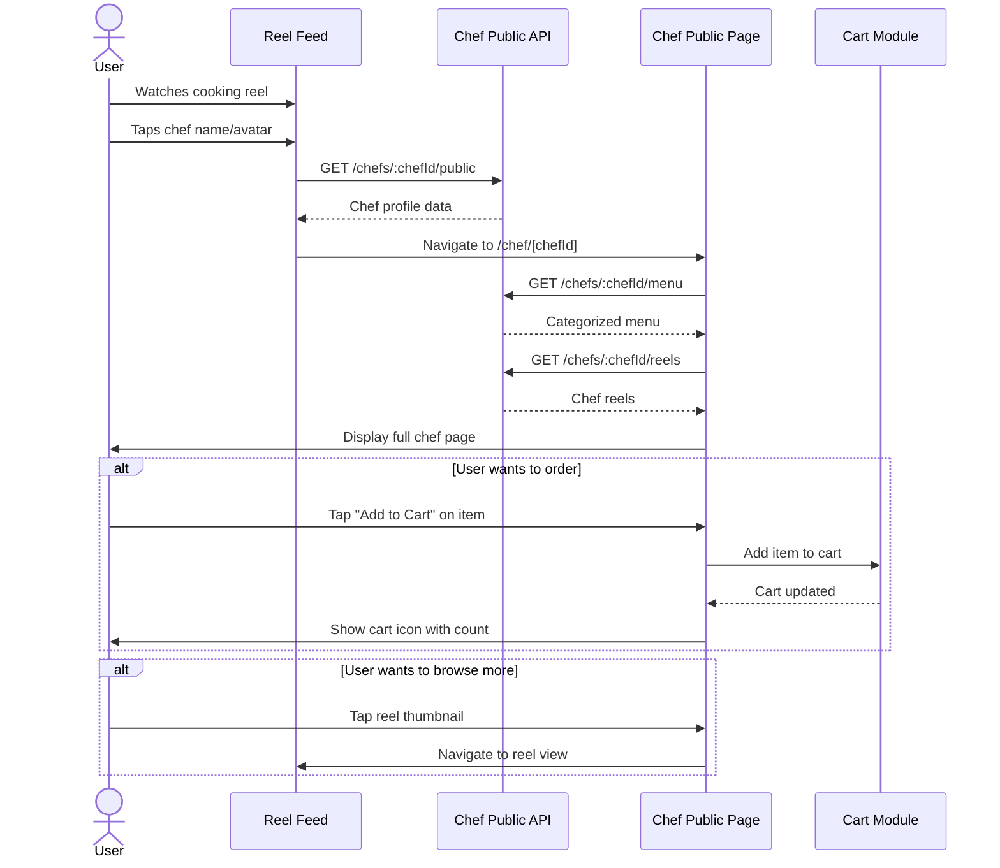
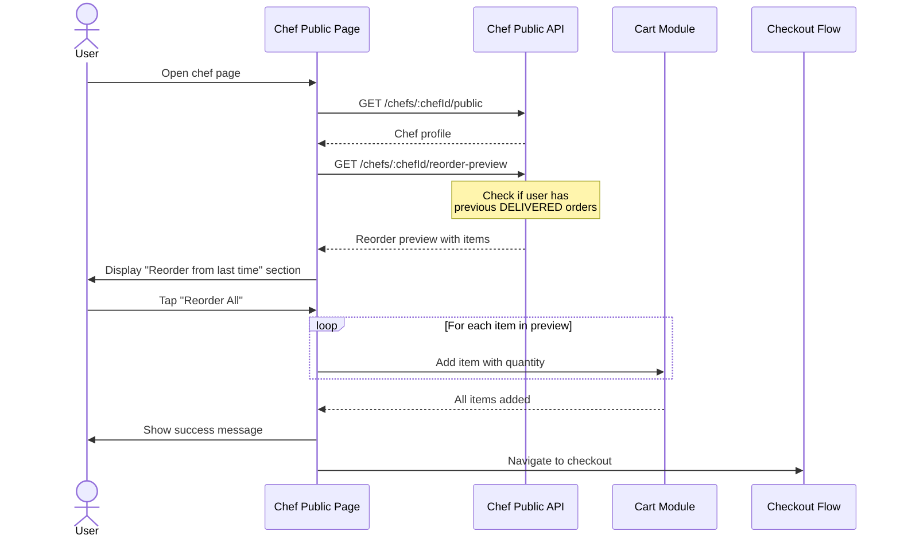
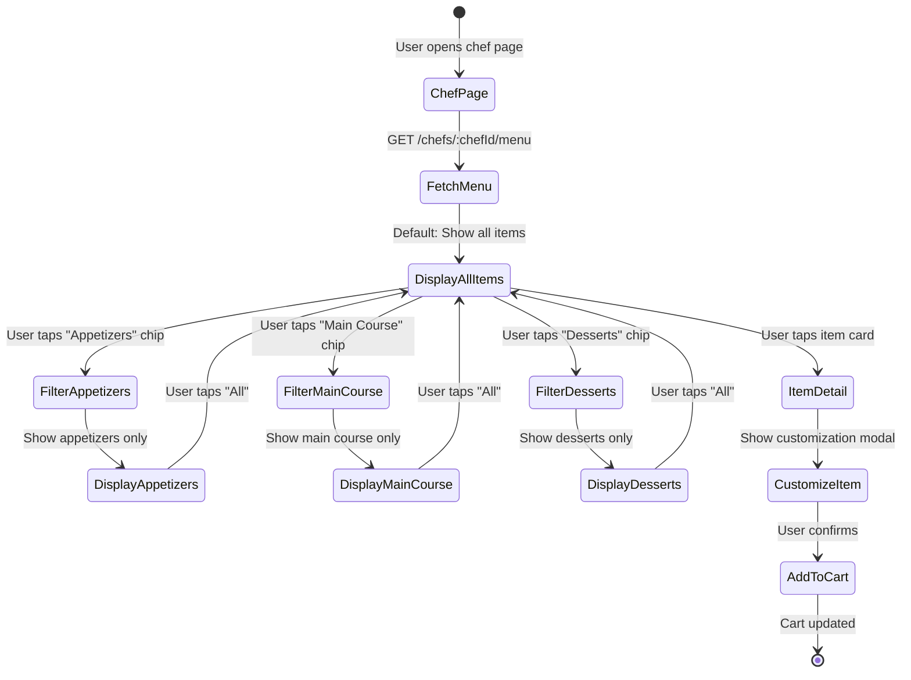

# 🏪 Chef-Public Module - Feature Overview

## 📋 **Table of Contents**
- [Module Purpose](#module-purpose)
- [Core Features](#core-features)
- [Business Rules](#business-rules)
- [User Flows](#user-flows)
- [Technical Architecture](#technical-architecture)
- [Database Schema](#database-schema)
- [Success Metrics](#success-metrics)
- [Future Enhancements](#future-enhancements)

---

## 🎯 **Module Purpose**

**Chef-Public** is the consumer-facing discovery and browsing module that provides read-only access to chef/restaurant pages. It serves as the Zomato-style public storefront where customers can:

- Discover chefs and their offerings
- Browse complete categorized menus
- View chef content (reels, photos)
- Access trust signals (ratings, order count, open status)
- Get reorder suggestions based on previous orders
- Add items to cart for ordering

**Key Characteristics**:
- ✅ **Read-Only**: No chef write operations (viewing only)
- ✅ **Public Access**: No authentication required for browsing
- ✅ **Reuses Logic**: Leverages existing Chef-Kitchen, Reel, Order modules
- ✅ **Zero Duplication**: No business rules reimplemented
- ✅ **Consumer-Focused**: Optimized for discovery and ordering

---

## 🌟 **Core Features**

### **1. Chef Public Profile**

**Purpose**: Display comprehensive chef/kitchen information for consumer trust and decision-making.

**What It Includes**:
- Kitchen name and branding
- Chef avatar and cover image
- Average rating (1.0 - 5.0)
- Veg/Non-veg preference badge
- Open/Closed status (real-time)
- Delivery radius (in kilometers)
- Estimated delivery time (ETA in minutes)
- Business description
- Cuisine types (e.g., "Italian", "Continental")
- Order acceptance status
- Total orders fulfilled (social proof)

**API Endpoint**: `GET /api/v1/chefs/:chefId/public`

**Response Example**:
```json
{
  "success": true,
  "message": "Chef profile retrieved successfully",
  "data": {
    "chefId": "550e8400-e29b-41d4-a716-446655440000",
    "kitchenName": "The Golden Spoon",
    "avatar": "https://storage.chefooz.com/avatars/chef123.jpg",
    "coverImage": "https://storage.chefooz.com/covers/kitchen123.jpg",
    "rating": 4.5,
    "vegType": "both",
    "isOpen": true,
    "deliveryRadiusKm": 5,
    "etaMinutes": 30,
    "description": "Authentic Italian cuisine with modern twist",
    "cuisines": ["Italian", "Continental"],
    "acceptingOrders": true,
    "totalOrders": 150
  }
}
```

**Business Rules**:
1. **Avatar Source**: Retrieved from User entity (chef's profile photo)
2. **Kitchen Name**: Retrieved from ChefKitchen entity
3. **VegType Calculation**: Determined from menu items (veg only, non-veg only, or both)
4. **Rating**: Aggregated from Review module (future: actual integration)
5. **isOpen**: Based on ChefKitchen.isOnline status
6. **Total Orders**: Count of DELIVERED orders containing chef's menu items
7. **Minimal Profile**: If chef hasn't completed kitchen setup, return minimal profile with warning

---

### **2. Public Menu Browsing**

**Purpose**: Display chef's menu grouped by platform categories for easy browsing and ordering.

**What It Includes**:
- Menu items grouped by PlatformCategory
- Item details (name, image, price, description)
- Availability status
- Dietary information (veg/non-veg/egg)
- Allergen warnings
- Nutrition information
- Price in paise for frontend consistency
- Uncategorized items (if any)

**API Endpoint**: `GET /api/v1/chefs/:chefId/menu`

**Response Example**:
```json
{
  "success": true,
  "message": "Menu retrieved successfully",
  "data": {
    "categorized": [
      {
        "categoryId": "cat-appetizers-001",
        "categoryName": "Appetizers",
        "items": [
          {
            "id": "item-123",
            "name": "Paneer Tikka",
            "price": 280.00,
            "basePricePaise": 28000,
            "foodType": "veg",
            "imageUrl": "https://...",
            "availability": {
              "isAvailable": true,
              "soldOut": false
            },
            "allergyInfo": ["dairy"],
            "dietaryTags": ["high-protein"]
          }
        ]
      },
      {
        "categoryId": "cat-main-course-001",
        "categoryName": "Main Course",
        "items": [...]
      }
    ],
    "uncategorized": [],
    "totalItems": 15
  }
}
```

**Business Rules**:
1. **Only Active Items**: `isActive = true` (no deleted items)
2. **Price Conversion**: Backend stores in rupees, response includes `basePricePaise` for frontend
3. **Grouped by Platform Category**: Uses `platformCategoryId` for grouping
4. **Ordering**: Categories ordered by categoryId, items ordered by name ASC
5. **Uncategorized Items**: Items without `platformCategoryId` go to uncategorized array
6. **Reuses Chef-Kitchen Logic**: No menu duplication

---

### **3. Chef Reels Gallery**

**Purpose**: Display chef's content (cooking videos, food reels) for engagement and trust-building.

**What It Includes**:
- Chef's public reels
- Video thumbnails
- Video URLs (HTTPS from CDN)
- Caption/description
- View count
- Like count
- Creation timestamp

**API Endpoint**: `GET /api/v1/chefs/:chefId/reels?limit=20`

**Response Example**:
```json
{
  "success": true,
  "message": "Reels retrieved successfully",
  "data": {
    "reels": [
      {
        "id": "reel-123",
        "videoUrl": "https://cdn.chefooz.com/reels/chef123-reel1.mp4",
        "thumbnailUrl": "https://cdn.chefooz.com/thumbnails/chef123-reel1.jpg",
        "caption": "Making my signature Butter Chicken!",
        "viewCount": 1500,
        "likeCount": 250,
        "createdAt": "2024-11-20T10:30:00Z"
      }
    ],
    "total": 20
  }
}
```

**Business Rules**:
1. **Soft-Delete Filter**: CRITICAL: Exclude reels with `deletedAt !== null`
2. **Latest First**: Ordered by `createdAt DESC`
3. **S3 URI Conversion**: Convert `s3://...` URIs to HTTPS URLs using CDN
4. **Default Limit**: 20 reels (configurable via query param)
5. **Public Access**: No authentication required
6. **Reuses Reel Schema**: No reel logic duplication

---

### **4. Reorder Preview**

**Purpose**: Show authenticated users their previous orders from this chef for quick reordering.

**What It Includes**:
- Last order date
- Previous order items (snapshot data)
- Item names, images, prices
- Quantities ordered
- Reorderable flag

**API Endpoint**: `GET /api/v1/chefs/:chefId/reorder-preview`

**Response Example**:
```json
{
  "success": true,
  "message": "Reorder preview retrieved successfully",
  "data": {
    "reorderable": true,
    "lastOrderDate": "2024-11-20T10:30:00Z",
    "items": [
      {
        "itemId": "item-123",
        "name": "Butter Chicken",
        "imageUrl": "https://...",
        "pricePaise": 35000,
        "quantity": 2
      },
      {
        "itemId": "item-456",
        "name": "Garlic Naan",
        "pricePaise": 5000,
        "quantity": 4
      }
    ]
  }
}
```

**Business Rules**:
1. **Authentication Required**: Returns `null` if no viewerId provided
2. **Only Delivered Orders**: Status must be `DELIVERED` (not cancelled/pending)
3. **Last Order Only**: Most recent order by `createdAt DESC`
4. **Snapshot Data**: Uses order item snapshots (not live menu items)
5. **Price from Snapshot**: Uses `unitPricePaise * quantity` from order
6. **Cross-Chef Orders**: Only shows items from THIS chef (not other chefs in same order)

---

## 📐 **Business Rules**

### **Profile Display Rules**

1. **Minimal Profile for Incomplete Setup**:
   - If chef has no ChefKitchen record → Return minimal profile with warning
   - Show: chefId, chef name (from User.fullName), avatar
   - Hide: Kitchen details, menu, delivery info
   - Purpose: Don't throw 404 errors for chefs still setting up

2. **VegType Calculation**:
   - Check all active menu items for `foodType` field
   - If all veg → `"veg"`
   - If all non-veg → `"non-veg"`
   - If mixed → `"both"`

3. **Open/Closed Status**:
   - Based on `ChefKitchen.isOnline` boolean
   - Real-time (no schedule check in this module)
   - Schedule logic handled in Chef-Kitchen module

4. **Order Count**:
   - Count DELIVERED orders containing chef's menu items
   - Query JSONB `items` array for `menuItemId` matches
   - Only successful deliveries (social proof)

---

### **Menu Display Rules**

5. **Active Items Only**:
   - Filter: `isActive = true`
   - No soft-deleted items
   - Respects Chef-Kitchen deletion logic

6. **Price Conversion**:
   - Backend stores: DECIMAL (rupees)
   - Response includes: `basePricePaise` (integer)
   - Conversion: `Math.round(price * 100)`
   - Purpose: Consistent with Cart/Order pricing

7. **Category Grouping**:
   - Group by `platformCategoryId` (not deprecated `categoryId`)
   - Uncategorized items go to separate array
   - Categories ordered by ID, items ordered by name

---

### **Reels Display Rules**

8. **Soft-Delete Filter**:
   - CRITICAL: `deletedAt === null` (exclude deleted reels)
   - Prevents showing removed content

9. **S3 URI Conversion**:
   - Convert: `s3://chefooz-bucket/reels/video.mp4`
   - To: `https://cdn.chefooz.com/reels/video.mp4`
   - Use `s3UriToHttps()` utility
   - Environment variable: `CDN_URL`

---

### **Reorder Rules**

10. **Authentication-Dependent**:
    - No viewerId → Return `null` (not error)
    - viewerId present → Query orders

11. **Order Status Filter**:
    - Only `DELIVERED` status
    - Exclude: PENDING, CANCELLED, FAILED

12. **Snapshot vs. Live Data**:
    - Use order item snapshots (frozen at order time)
    - Don't query live menu (items may have changed/deleted)

---

## 🔄 **User Flows**

### **Flow 1: Discover Chef from Reel**



**Steps**:
1. User watches reel in feed
2. User taps chef name/avatar
3. App fetches chef profile (`GET /chefs/:chefId/public`)
4. App navigates to `/chef/[chefId]` route
5. Page fetches menu (`GET /chefs/:chefId/menu`)
6. Page fetches reels (`GET /chefs/:chefId/reels`)
7. User browses menu categories
8. User adds items to cart (integration with Cart module)

---

### **Flow 2: Reorder from Previous Order**



**Steps**:
1. User opens chef page (from order history or search)
2. App fetches chef profile
3. App fetches reorder preview (`GET /chefs/:chefId/reorder-preview`)
4. If previous orders exist → Show "Reorder from last time" section
5. User taps "Reorder All"
6. App adds all items to cart with saved quantities
7. App navigates to checkout

---

### **Flow 3: Browse Menu by Category**



**Steps**:
1. User opens chef page
2. App fetches menu grouped by category
3. Default view: All items displayed
4. User taps category chip (e.g., "Appetizers")
5. View filters to show only that category
6. User can tap "All" to reset filter
7. User taps item card → Show customization modal
8. User confirms → Add to cart

---

### **Flow 4: View Chef Reels for Engagement**

```mermaid
flowchart TD
    A[User on Chef Page] --> B[Scroll to Reels Section]
    B --> C{Reels Available?}
    
    C -->|Yes| D[Display Horizontal Carousel]
    D --> E[Show Thumbnails with Play Icon]
    E --> F{User Action?}
    
    F -->|Tap Reel| G[Navigate to Full Reel View]
    G --> H[Play Reel with Comments/Likes]
    H --> I{User Taps Chef Name?}
    I -->|Yes| J[Back to Chef Page]
    
    F -->|Swipe Left/Right| K[Browse More Reels]
    K --> F
    
    C -->|No| L[Show "No Reels Yet" Placeholder]
    L --> M[Suggest Following Chef]
```

**Steps**:
1. User scrolls to reels section on chef page
2. If reels available → Show horizontal carousel
3. User taps reel thumbnail
4. App navigates to full reel view (`/reels/[reelId]`)
5. Reel plays with social features (comments, likes)
6. User can tap chef name → Back to chef page (circular)

---

### **Flow 5: Check Availability and Delivery Info**

```mermaid
flowchart TD
    A[User Opens Chef Page] --> B[Fetch Chef Profile]
    B --> C{Kitchen Open?}
    
    C -->|isOpen = true| D[Show Green "Open Now" Badge]
    D --> E[Display Delivery Info]
    E --> F["Delivery Radius: 5 km<br/>ETA: 30 mins"]
    F --> G{User in Range?}
    
    G -->|Yes| H[Enable "Add to Cart" Buttons]
    G -->|No| I[Show "Out of Delivery Range"]
    I --> J[Disable Ordering]
    
    C -->|isOpen = false| K[Show Red "Closed" Badge]
    K --> L[Display Next Opening Time]
    L --> M[Disable "Add to Cart" Buttons]
    M --> N[Show "Opens at 11:00 AM"]
```

**Steps**:
1. User opens chef page
2. App fetches chef profile with `isOpen` status
3. If open → Show green "Open Now" badge
4. Display delivery radius and ETA
5. Check if user's location is within delivery radius
6. If in range → Enable ordering
7. If out of range → Disable ordering, show message
8. If closed → Show red "Closed" badge, display next opening time

---

## 🏗️ **Technical Architecture**

### **System Architecture**

```mermaid
graph TB
    subgraph "Consumer Interface"
        MobileApp[Chef Public Page<br/>React Native Screen<br/>/chef/[chefId]]
    end
    
    subgraph "API Gateway"
        Gateway[NestJS API Gateway<br/>/api/v1/chefs/:chefId/...]
    end
    
    subgraph "Chef-Public Module"
        Controller[ChefPublicController<br/>4 endpoints]
        Service[ChefPublicService<br/>Read-only operations]
    end
    
    subgraph "Data Sources (Read-Only)"
        UserRepo[(User Entity<br/>Chef profile)]
        KitchenRepo[(ChefKitchen Entity<br/>Kitchen details)]
        MenuRepo[(ChefMenuItem Entity<br/>Menu items)]
        CategoryRepo[(PlatformCategory<br/>Categories)]
        OrderRepo[(Order Entity<br/>Order history)]
        ReelModel[(Reel Schema<br/>MongoDB)]
    end
    
    subgraph "External Modules"
        ChefKitchen[Chef-Kitchen Module<br/>Menu & Kitchen logic]
        Reels[Reels Module<br/>Reel logic]
        Orders[Order Module<br/>Order logic]
    end
    
    MobileApp -->|HTTPS GET| Gateway
    Gateway --> Controller
    Controller --> Service
    
    Service -->|Read| UserRepo
    Service -->|Read| KitchenRepo
    Service -->|Read| MenuRepo
    Service -->|Read| CategoryRepo
    Service -->|Read| OrderRepo
    Service -->|Read| ReelModel
    
    Service -.->|Reuses Logic| ChefKitchen
    Service -.->|Reuses Logic| Reels
    Service -.->|Reuses Logic| Orders
    
    style Service fill:#7ED321,stroke:#333,stroke-width:3px
    style Controller fill:#FF6B35,stroke:#333,stroke-width:2px,color:#fff
    style MobileApp fill:#4A90E2,stroke:#333,stroke-width:2px,color:#fff
```

---

### **Module Structure**

```
apps/chefooz-apis/src/modules/chef-public/
├── chef-public.controller.ts       # 4 REST endpoints
├── chef-public.service.ts          # Read-only business logic
├── chef-public.module.ts           # NestJS module definition
└── dto/
    └── chef-public-profile.dto.ts  # Response DTOs
```

**Key Characteristics**:
- ✅ **Read-Only**: No write operations (no POST/PATCH/DELETE)
- ✅ **Public Access**: No JWT guard on controller (open endpoints)
- ✅ **Zero Duplication**: Reuses existing repositories and schemas
- ✅ **Minimal Logic**: Aggregates data from multiple sources
- ✅ **Response Transformation**: Converts data for frontend consumption (price, URLs)

---

### **API Endpoints**

| Method | Endpoint | Purpose | Auth | Response |
|--------|----------|---------|------|----------|
| GET | `/v1/chefs/:chefId/public` | Get chef profile | ❌ No | ChefPublicProfileDto |
| GET | `/v1/chefs/:chefId/menu` | Get menu grouped | ❌ No | ChefMenuResponse |
| GET | `/v1/chefs/:chefId/reels` | Get chef reels | ❌ No | ChefReelsResponse |
| GET | `/v1/chefs/:chefId/reorder-preview` | Get reorder preview | ⚠️ Optional | ReorderPreviewDto \| null |

**Notes**:
- All endpoints public (no JWT required for viewing)
- `reorder-preview` uses optional authentication (req.user?.id)
- All endpoints return standard response envelope: `{success, message, data}`

---

## 🗄️ **Database Schema**

**Chef-Public does NOT create new tables.** It reads from existing entities:

### **1. User Entity (Chef Profile Data)**

```sql
SELECT id, username, fullName, avatarUrl, email, phone
FROM public.users
WHERE id = :chefId;
```

**Fields Used**:
- `id`: Chef user ID
- `fullName`: Kitchen name fallback
- `avatarUrl`: Chef avatar

---

### **2. ChefKitchen Entity (Kitchen Details)**

```sql
SELECT 
  kitchen_name,
  is_online,
  delivery_radius_km,
  accepting_orders
FROM public.chef_kitchens
WHERE chef_id = :chefId;
```

**Fields Used**:
- `kitchenName`: Restaurant name
- `isOnline`: Open/closed status
- `deliveryRadiusKm`: Delivery range
- `acceptingOrders`: Order acceptance flag

---

### **3. ChefMenuItem Entity (Menu Items)**

```sql
SELECT *
FROM public.chef_menu_items
WHERE chef_id = :chefId
  AND is_active = true
ORDER BY platform_category_id ASC, name ASC;
```

**Fields Used**: All fields (40+)
**Filters**: `isActive = true` (no deleted items)

---

### **4. PlatformCategory Entity (Category Names)**

```sql
SELECT id, name
FROM public.platform_categories
WHERE id IN (:categoryIds);
```

**Purpose**: Get category names for grouped menu response

---

### **5. Order Entity (Reorder Preview)**

```sql
SELECT id, created_at, items
FROM public.orders
WHERE user_id = :viewerId
  AND status = 'DELIVERED'
ORDER BY created_at DESC
LIMIT 1;
```

**Fields Used**:
- `items`: JSONB array of OrderItemSnapshot
- `createdAt`: Last order date
- `status`: Must be DELIVERED

---

### **6. Reel Schema (MongoDB - Chef Reels)**

```javascript
db.reels.find({
  userId: chefId,
  deletedAt: null
})
.sort({ createdAt: -1 })
.limit(20);
```

**Fields Used**:
- `videoUrl`: S3 URI (converted to HTTPS)
- `thumbnailUrl`: Thumbnail S3 URI
- `caption`: Reel description
- `stats.views`: View count
- `stats.likes`: Like count

---

## 📊 **Success Metrics**

### **Performance Metrics**

| Metric | Target | Measurement |
|--------|--------|-------------|
| Chef Profile Load Time | < 500ms (p95) | API response time |
| Menu Load Time | < 800ms (p95) | API response time (with grouping) |
| Reels Load Time | < 600ms (p95) | MongoDB query time |
| Page Full Load | < 2 seconds | Complete page render |
| Cache Hit Rate | > 70% | React Query cache hits |

---

### **Business Metrics**

| Metric | Target | Measurement |
|--------|--------|-------------|
| Chef Page Views | > 10,000/day | Analytics events |
| Menu Browse Rate | > 80% | Users who view menu after profile |
| Add to Cart Rate | > 15% | Items added / page views |
| Reorder Usage | > 25% | Users who reorder vs. new order |
| Reel Engagement | > 40% | Users who tap reels / page views |

---

### **User Experience Metrics**

| Metric | Target | Measurement |
|--------|--------|-------------|
| Zero-Error Rate | > 99% | No 404/500 errors |
| Availability Accuracy | 100% | isOpen matches schedule |
| Image Load Success | > 95% | CDN delivery success |
| Category Grouping Accuracy | 100% | Items in correct categories |

---

## 🚀 **Future Enhancements**

### **Phase 1: Enhanced Trust Signals** (Q2 2026)

**Features**:
- ✅ Review display (star ratings + written reviews)
- ✅ Food safety badges (FSSAI license, hygiene rating)
- ✅ Verified badge for established chefs
- ✅ Response time to orders (average)
- ✅ Preparation time accuracy (estimated vs. actual)

**Impact**: +20% conversion rate (profile → order)

---

### **Phase 2: Smart Recommendations** (Q3 2026)

**Features**:
- ✅ "Popular Items" section (based on order frequency)
- ✅ "Recommended for You" (ML-based personalization)
- ✅ "Frequently Bought Together" (basket analysis)
- ✅ "Similar Dishes" from other chefs

**Impact**: +15% average order value

---

### **Phase 3: Dynamic Availability** (Q3 2026)

**Features**:
- ✅ Real-time kitchen capacity indicator (e.g., "3 orders ahead")
- ✅ Time-based menu (breakfast/lunch/dinner items)
- ✅ Day-specific specials (e.g., "Sunday Special")
- ✅ Inventory-based availability (e.g., "Sold out" badge)

**Impact**: Better capacity planning, reduced cancellations

---

### **Phase 4: Multimedia Gallery** (Q4 2026)

**Features**:
- ✅ Chef photo gallery (kitchen, food plating)
- ✅ 360° kitchen tour (virtual walkthrough)
- ✅ Live kitchen cam (optional, premium feature)
- ✅ Customer food photos (UGC gallery)

**Impact**: +30% trust score, +10% conversion

---

### **Phase 5: Social Integration** (Q1 2027)

**Features**:
- ✅ Follow chef functionality
- ✅ Get notified when chef goes online
- ✅ Share chef page to social media
- ✅ Referral rewards for sharing
- ✅ Chef stories (like Instagram stories)

**Impact**: +50% organic growth, +25% retention

---

## 🎓 **Key Decisions & Rationale**

### **1. Read-Only Module (No Write Operations)**

**Decision**: Chef-Public is strictly read-only. All chef write operations remain in Chef-Kitchen module.

**Rationale**:
- ✅ Separation of concerns (consumer view vs. chef dashboard)
- ✅ Prevents accidental mutations from public endpoints
- ✅ Easier to cache (no cache invalidation needed)
- ✅ Clear security boundaries (public vs. protected)

---

### **2. Reuse Existing Entities (No New Tables)**

**Decision**: Chef-Public reads from existing tables (User, ChefKitchen, ChefMenuItem, Order, Reel). No new tables created.

**Rationale**:
- ✅ Zero data duplication
- ✅ Single source of truth
- ✅ No sync issues
- ✅ Simpler architecture

---

### **3. Public Endpoints (No JWT Guard)**

**Decision**: All endpoints accessible without authentication (except reorder-preview which uses optional auth).

**Rationale**:
- ✅ Allows browsing before signup (discovery)
- ✅ SEO-friendly (can be server-rendered)
- ✅ Faster page loads (no auth overhead)
- ✅ Industry standard (Zomato, Swiggy, UberEats all public)

---

### **4. Grouped Menu by Platform Category**

**Decision**: Menu grouped by PlatformCategory (not chef-created categories).

**Rationale**:
- ✅ Consistent categorization across platform
- ✅ Better search/filter UX
- ✅ Easier to aggregate across chefs
- ✅ Platform-Categories module provides standardization

---

### **5. Reorder from Order Snapshots (Not Live Menu)**

**Decision**: Reorder preview uses order item snapshots (frozen data from order time), not current menu items.

**Rationale**:
- ✅ Items may have been deleted from menu
- ✅ Prices may have changed
- ✅ Shows exactly what user ordered last time
- ✅ User can manually adjust in cart if needed

---

### **6. Minimal Profile for Incomplete Setup**

**Decision**: If chef hasn't completed kitchen setup, return minimal profile with warning (not 404 error).

**Rationale**:
- ✅ Doesn't break links (e.g., reel → chef page)
- ✅ Allows users to follow incomplete chefs
- ✅ Chef can still be discovered via reels
- ✅ Graceful degradation

---

### **7. S3 URI to HTTPS Conversion**

**Decision**: Backend converts S3 URIs (`s3://...`) to HTTPS URLs before sending to frontend.

**Rationale**:
- ✅ Frontend can't access S3 directly (security)
- ✅ CDN delivers faster (edge caching)
- ✅ Single transformation point (backend)
- ✅ Consistent URL format for frontend

---

## 🔗 **Integration Points**

### **1. Chef-Kitchen Module**
- **Dependency**: Reads ChefKitchen and ChefMenuItem entities
- **Purpose**: Get kitchen details and menu items
- **Direction**: One-way (read-only)

### **2. Platform-Categories Module**
- **Dependency**: Reads PlatformCategory entity
- **Purpose**: Get category names for menu grouping
- **Direction**: One-way (read-only)

### **3. Reels Module**
- **Dependency**: Reads Reel schema (MongoDB)
- **Purpose**: Get chef's reels for public page
- **Direction**: One-way (read-only)

### **4. Order Module**
- **Dependency**: Reads Order entity
- **Purpose**: Get reorder preview (last order items)
- **Direction**: One-way (read-only)

### **5. User Module**
- **Dependency**: Reads User entity
- **Purpose**: Get chef profile data (avatar, name)
- **Direction**: One-way (read-only)

### **6. Cart Module (Future)**
- **Dependency**: Cart module will read menu items from Chef-Public
- **Purpose**: Add items to cart from public page
- **Direction**: Two-way (Chef-Public → Cart)

### **7. Review Module (Future)**
- **Dependency**: Review module will provide aggregated ratings
- **Purpose**: Display accurate average rating on chef page
- **Direction**: One-way (Review → Chef-Public)

---

**[FEATURE_OVERVIEW_COMPLETE ✅]**

*For technical implementation details, see `02_TECHNICAL_GUIDE.md`. For QA testing procedures, see `03_QA_TEST_CASES.md`.*

---

**Document Version**: 1.0  
**Last Updated**: February 2026  
**Module Type**: Read-Only Consumer-Facing Discovery  
**Next Review**: Q2 2026 (Enhanced Trust Signals)
