# 📖 Chef Module - Feature Overview

## 📋 **Table of Contents**
- [Module Purpose](#module-purpose)
- [Core Features](#core-features)
- [Business Rules](#business-rules)
- [User Flows](#user-flows)
- [Technical Architecture](#technical-architecture)
- [Success Metrics](#success-metrics)
- [Future Enhancements](#future-enhancements)

---

## 🎯 **Module Purpose**

The **Chef Module** serves as the **public-facing API layer** for accessing chef menu items and integrating chef data into customer-facing features (primarily reels with product tagging). While chef profile management, kitchen setup, and order fulfillment are handled by separate modules, this module provides the critical read-only interface for:

1. **Product Tagging in Reels**: Fetch active menu items for linking products to reel content
2. **Public Menu Display**: Retrieve chef menu items for customer browsing
3. **Cross-Module Integration**: Provide chef data to Feed, Explore, Search, and Cart modules

### **Relationship to Other Modules**


**Key Distinction**:
- **Chef Module** (this module): Read-only public API for menu items
- **Chef-Kitchen Module**: Chef-facing CRUD operations for menu management
- **Profile Module**: Chef profile activation, verification, and settings
- **Chef-Public Module**: Public chef profile page and discovery

---

## 🚀 **Core Features**

### 1️⃣ **Fetch Chef Menu Items** (Primary Feature)

#### **What It Does**
Retrieves all active (available) menu items for a specific chef, formatted for use in:
- Reel product tagging UI (linkable products)
- Cart item validation
- Search/discovery features

#### **Key Characteristics**
- **Public endpoint**: No authentication required
- **Active items only**: Filters by `isActive: true`
- **Price conversion**: Converts stored rupees to paise (multiply by 100)
- **Availability check**: Returns availability status from JSONB field
- **Image optimization**: Returns primary `imageUrl` or fallback `thumbnailUrl`

#### **Example Scenario**
```
Chef A has menu with:
- Butter Chicken (₹350, active, available)
- Paneer Tikka (₹280, active, available)
- Dal Makhani (₹200, inactive)

API returns:
[
  { id: "abc1", name: "Butter Chicken", price: 35000, availability: true },
  { id: "abc2", name: "Paneer Tikka", price: 28000, availability: true }
]
// Dal Makhani excluded (inactive)
```

---

### 2️⃣ **Linkable Product DTO Format**

#### **What It Does**
Standardizes menu item response format for consistency across modules using the `LinkableProductDto` interface.

#### **DTO Structure**
```typescript
{
  id: string;              // Menu item UUID
  name: string;            // Item name (e.g., "Butter Chicken")
  price: number;           // Price in paise (₹350 → 35000)
  chefId: string;          // Chef user ID (UUID)
  availability: boolean;   // Can be ordered right now
  imageUrl?: string;       // Product image URL (optional)
}
```

#### **Usage Across Modules**
- **Media Module**: Uses for reel product tagging dropdown
- **Cart Module**: Validates item availability before checkout
- **Explore Module**: Displays tagged products on explore cards
- **Feed Module**: Shows product links in feed items

---

### 3️⃣ **Price Conversion (Rupees → Paise)**

#### **What It Does**
Converts database-stored decimal prices (in rupees) to integer paise for frontend consistency and precision.

#### **Conversion Logic**
```typescript
// Database: price stored as DECIMAL(10,2) in rupees
const dbPrice = 350.00; // ₹350

// API Response: converted to paise (integer)
const apiPrice = Math.round(Number(dbPrice) * 100); // 35000 paise

// Frontend Display: converted back to rupees
const displayPrice = (apiPrice / 100).toFixed(2); // "₹350.00"
```

#### **Why Paise?**
- ✅ **Precision**: Avoids floating-point errors in calculations
- ✅ **Razorpay Compatibility**: Payment gateway expects paise
- ✅ **Consistency**: All Chefooz APIs use paise internally

---

### 4️⃣ **Availability Status Check**

#### **What It Does**
Returns real-time availability status from the menu item's JSONB `availability` field.

#### **Availability Object Structure**
```typescript
// PostgreSQL JSONB column
availability: {
  isAvailable: boolean;     // Item can be ordered
  outOfStockReason?: string; // "Ingredients unavailable"
  unavailableUntil?: Date;   // Temporary unavailability
}
```

#### **Fallback Logic**
```typescript
// If availability JSONB is null/undefined, default to true
availability: item.availability?.isAvailable ?? true
```

#### **Use Cases**
- **Real-time menu updates**: Chef marks items as unavailable
- **Scheduled unavailability**: Items auto-disable after certain hours
- **Stock management**: Out-of-stock items hidden from customers

---

### 5️⃣ **Image Fallback Strategy**

#### **What It Does**
Provides best available image for menu items with fallback logic.

#### **Priority Order**
1. **Primary**: `item.imageUrl` (full-resolution product photo)
2. **Fallback**: `item.thumbnailUrl` (generated thumbnail)
3. **None**: `undefined` (frontend shows placeholder)

#### **Implementation**
```typescript
imageUrl: item.imageUrl || item.thumbnailUrl || undefined
```

#### **Frontend Handling**
```tsx
// React Native component
<Image 
  source={{ uri: product.imageUrl || defaultPlaceholder }}
  style={styles.productImage}
/>
```

---

### 6️⃣ **Debugging & Logging**

#### **What It Does**
Provides detailed logs for troubleshooting menu item queries (critical for chef support).

#### **Log Levels**
```typescript
// 1. Request start
this.logger.log(`Fetching menu items for chef: ${chefId}`);

// 2. Total items (including inactive)
const allItems = await this.chefMenuItemRepository.find({ where: { chefId } });
this.logger.log(`Total items for chef: ${allItems.length}`);

// 3. Active items count
this.logger.log(`Found ${menuItems.length} active menu items for chef ${chefId}`);
```

#### **Use Cases**
- **Support debugging**: Why menu items not showing?
- **Data validation**: Verify item counts match chef dashboard
- **Performance monitoring**: Detect slow queries

---

## 📏 **Business Rules**

### **1. Public Accessibility**
- **Rule**: Menu endpoint is **public** (no JWT required)
- **Rationale**: 
  - Customers browse menus before logging in
  - Product tags in shared reels must be accessible
  - SEO and discovery require public data
- **Security**: Read-only access prevents abuse

---

### **2. Active Items Only**
- **Rule**: Only return menu items where `isActive: true`
- **Rationale**:
  - Chefs control item visibility (test items, seasonal menus)
  - Prevents customers from seeing deleted/archived items
  - Allows soft-delete pattern (data preservation)
- **Enforcement**: Database query-level filter

---

### **3. Price Representation (Paise)**
- **Rule**: All prices returned in **paise** (not rupees)
- **Rationale**:
  - Consistency across all Chefooz APIs
  - Compatibility with Razorpay payment gateway
  - Eliminates floating-point precision issues
- **Example**: ₹350 → `35000` paise

---

### **4. Availability Default (Optimistic)**
- **Rule**: If `availability` JSONB is null, assume `true`
- **Rationale**:
  - New items default to available
  - Prevents accidental unavailability due to null values
  - Encourages chefs to explicitly mark items unavailable
- **Implementation**: `item.availability?.isAvailable ?? true`

---

### **5. Chef ID Validation**
- **Rule**: `chefId` parameter must be valid UUID
- **Rationale**:
  - Prevents injection attacks
  - Ensures referential integrity
  - Returns empty array for non-existent chefs (not 404)
- **Response for Invalid Chef**: `[]` (empty array, not error)

---

### **6. Chronological Sorting**
- **Rule**: Menu items sorted by `createdAt DESC` (newest first)
- **Rationale**:
  - Recent items likely most relevant (seasonal dishes)
  - Chefs add popular items last during setup
  - Consistent UX across app
- **Override**: Frontend can re-sort by price/name/category

---

### **7. Image URL Fallback**
- **Rule**: Return `imageUrl` first, then `thumbnailUrl`, then `undefined`
- **Rationale**:
  - Prioritize high-quality images
  - Graceful degradation if images missing
  - Frontend handles placeholders
- **Note**: Never return broken/expired S3 URLs (handled by CDN)

---

### **8. Cross-Module Dependency**
- **Rule**: Chef Module depends on Chef-Kitchen entity (read-only)
- **Rationale**:
  - Separation of concerns (menu CRUD vs menu read API)
  - Allows independent scaling
  - Prevents accidental writes from public endpoints
- **Constraint**: Changes to `ChefMenuItem` entity must be coordinated

---

### **9. No Cascade Deletes**
- **Rule**: Deleting a chef does NOT delete menu items
- **Rationale**:
  - Data preservation for analytics
  - Order history integrity (past orders reference menu items)
  - Soft-delete pattern (mark chef inactive, not remove)
- **Cleanup**: Manual archival process if needed

---

### **10. Error Handling (Non-Critical)**
- **Rule**: Menu fetch errors return HTTP 500 with error envelope
- **Rationale**:
  - Distinguish between "chef not found" (404) and "database error" (500)
  - Allows frontend to show generic error message
  - Logs full error stack for debugging
- **Response Format**:
  ```json
  {
    "success": false,
    "message": "Failed to fetch chef menu",
    "errorCode": "MENU_FETCH_FAILED"
  }
  ```

---

## 🔄 **User Flows**

### **Flow 1: Reel Upload with Product Tagging**


**Key Steps**:
1. Chef initiates reel upload
2. App fetches chef's menu items (via Chef Module)
3. Chef selects product from dropdown
4. Reel saved with `linkedProducts` array
5. Product tag visible to customers in feed/explore

---

### **Flow 2: Customer Browsing Chef Menu**


**Key Steps**:
1. Customer views chef profile
2. App fetches menu via Chef Module
3. Customer adds item to cart
4. Cart module validates item still active

---

### **Flow 3: Menu Item Unavailability Handling**

```mermaid
sequenceDiagram
    participant Chef as Chef
    participant ChefDashboard as Chef Dashboard
    participant ChefKitchen as Chef-Kitchen Module
    participant ChefAPI as Chef Module API
    participant Customer as Customer App

    Chef->>ChefDashboard: Mark "Paneer Tikka" unavailable
    ChefDashboard->>ChefKitchen: PATCH /api/v1/chef-kitchen/items/:id<br/>{availability: {isAvailable: false}}
    ChefKitchen->>ChefKitchen: Update menu item JSONB
    ChefKitchen-->>ChefDashboard: Updated ✅
    
    Note over Customer: Customer browsing menu
    Customer->>ChefAPI: GET /api/v1/chefs/:chefId/menu
    ChefAPI->>ChefAPI: Filter: availability.isAvailable === true
    ChefAPI-->>Customer: Return items (Paneer Tikka excluded)
    
    Customer->>Customer: Does NOT see Paneer Tikka
```



**Key Steps**:
1. Chef marks item unavailable (via Chef-Kitchen module)
2. Customer fetches menu (via Chef Module)
3. Chef Module filters out unavailable items
4. Customer sees reduced menu (real-time update)

---

## 🏗️ **Technical Architecture**

### **High-Level System Diagram**


---

### **Database Schema**

#### **ChefMenuItem Entity (Managed by Chef-Kitchen)**
```sql
-- PostgreSQL table: chef_menu_items
CREATE TABLE chef_menu_items (
  id UUID PRIMARY KEY DEFAULT uuid_generate_v4(),
  chef_id UUID NOT NULL REFERENCES users(id) ON DELETE CASCADE,
  name VARCHAR(255) NOT NULL,
  description TEXT,
  price DECIMAL(10,2) NOT NULL,           -- Stored in rupees
  category VARCHAR(100),
  is_active BOOLEAN DEFAULT true,          -- Visibility control
  image_url TEXT,                          -- Primary image
  thumbnail_url TEXT,                      -- Fallback image
  availability JSONB DEFAULT '{"isAvailable": true}',  -- Real-time status
  created_at TIMESTAMP DEFAULT NOW(),
  updated_at TIMESTAMP DEFAULT NOW(),
  
  INDEX idx_chef_menu_items_chef_id (chef_id),
  INDEX idx_chef_menu_items_active (is_active),
  INDEX idx_chef_menu_items_chef_active (chef_id, is_active)  -- Compound index
);
```

**Key Fields**:
- `price`: Stored as DECIMAL in rupees (API converts to paise)
- `is_active`: Soft-delete flag (chef can hide/show items)
- `availability`: JSONB for flexible real-time status updates

---

### **API Endpoint Specification**

#### **GET /api/v1/chefs/:chefId/menu**

**Description**: Fetch active menu items for a chef

**Authentication**: ❌ None required (public endpoint)

**Path Parameters**:
```typescript
{
  chefId: string  // Chef user ID (UUID)
}
```

**Response** (200 OK):
```json
{
  "success": true,
  "message": "Chef menu retrieved successfully",
  "data": [
    {
      "id": "507f1f77bcf86cd799439011",
      "name": "Butter Chicken",
      "price": 35000,                      // Paise
      "chefId": "123e4567-e89b-12d3-a456-426614174000",
      "availability": true,
      "imageUrl": "https://cdn.chefooz.com/products/butter-chicken.jpg"
    },
    {
      "id": "507f1f77bcf86cd799439012",
      "name": "Paneer Tikka",
      "price": 28000,
      "chefId": "123e4567-e89b-12d3-a456-426614174000",
      "availability": true,
      "imageUrl": "https://cdn.chefooz.com/products/paneer-tikka.jpg"
    }
  ]
}
```

**Response** (500 Internal Server Error):
```json
{
  "success": false,
  "message": "Failed to fetch chef menu",
  "errorCode": "MENU_FETCH_FAILED"
}
```

---

### **Service Implementation Pattern**

```typescript
@Injectable()
export class ChefService {
  constructor(
    @InjectRepository(ChefMenuItem)
    private readonly chefMenuItemRepository: Repository<ChefMenuItem>,
  ) {}

  async getMenuItems(chefId: string): Promise<LinkableProductDto[]> {
    // Step 1: Debug logging (total items)
    const allItems = await this.chefMenuItemRepository.find({ where: { chefId } });
    this.logger.log(`Total items for chef: ${allItems.length}`);
    
    // Step 2: Query active items only
    const menuItems = await this.chefMenuItemRepository
      .createQueryBuilder('item')
      .where('item.chefId = :chefId', { chefId })
      .andWhere('item.isActive = :isActive', { isActive: true })
      .orderBy('item.createdAt', 'DESC')
      .getMany();

    // Step 3: Transform to DTO
    return menuItems.map((item) => ({
      id: item.id,
      name: item.name,
      price: Math.round(Number(item.price) * 100), // Rupees → Paise
      chefId: item.chefId,
      availability: item.availability?.isAvailable ?? true,
      imageUrl: item.imageUrl || item.thumbnailUrl || undefined,
    }));
  }
}
```

---

## 📊 **Success Metrics**

### **Performance Metrics**
| Metric | Target | Measurement |
|--------|--------|-------------|
| **API Response Time (p95)** | < 200ms | CloudWatch API Gateway latency |
| **Menu Items Per Chef (avg)** | 8-15 items | Database query average |
| **Cache Hit Rate** | > 70% | Redis cache hits / total requests |
| **Error Rate** | < 0.5% | Failed requests / total requests |

### **Business Metrics**
| Metric | Target | Measurement |
|--------|--------|-------------|
| **Menu Fetch Success Rate** | > 99% | Successful 200 responses |
| **Product Tagging Adoption** | > 40% of reels | Reels with linkedProducts |
| **Menu Update Frequency** | 2-3x per week | Avg updates per chef |
| **Active Menu Items** | > 80% of total | Active items / total items |

### **User Experience Metrics**
| Metric | Target | Measurement |
|--------|--------|-------------|
| **Menu Load Time (mobile)** | < 1 second | Time to display menu items |
| **Product Tag Click Rate** | > 15% | Clicks on tagged products / views |
| **Cart Conversion** | > 8% | Orders / menu views |

---

## 🚀 **Future Enhancements**

### **Phase 1: Caching Layer (Q2 2026)**
- Implement Redis caching for frequently accessed menus
- Cache invalidation on menu item updates
- 5-minute TTL with stale-while-revalidate pattern
- Reduce database load by 60%+

**Technical Changes**:
```typescript
// Cache key pattern
const cacheKey = `chef:menu:${chefId}`;
const cached = await this.cacheService.get(cacheKey);
if (cached) return cached;

const menu = await this.getMenuItems(chefId);
await this.cacheService.set(cacheKey, menu, 300); // 5 min TTL
return menu;
```

---

### **Phase 2: Category Filtering (Q3 2026)**
- Add `category` query parameter to endpoint
- Support filtering by "Appetizers", "Main Course", "Desserts"
- Frontend category tabs on menu page
- Improved browsing UX

**API Enhancement**:
```
GET /api/v1/chefs/:chefId/menu?category=main-course
```

---

### **Phase 3: Search & Sorting (Q3 2026)**
- Add `search` query parameter for item name search
- Support `sortBy` parameter (price, name, popularity)
- Elasticsearch integration for fuzzy search
- Voice search for menu items

**API Enhancement**:
```
GET /api/v1/chefs/:chefId/menu?search=chicken&sortBy=price
```

---

### **Phase 4: Menu Item Details (Q4 2026)**
- New endpoint: `GET /api/v1/chefs/:chefId/menu/:itemId`
- Return detailed nutritional info, allergens, ingredients
- Customer reviews specific to menu items
- Preparation time estimation

---

### **Phase 5: Bulk Menu Export (2027)**
- Export menu as JSON/CSV for chef backup
- Import menu from template (new chef onboarding)
- Menu versioning (seasonal menus)
- A/B testing different menu layouts

---

## 🎯 **Completion Checklist**

### **Backend Implementation** ✅
- [x] ChefService with `getMenuItems()` method
- [x] ChefController with public GET endpoint
- [x] ChefMenuItem entity relationship (read-only)
- [x] Price conversion logic (rupees → paise)
- [x] Availability filtering logic
- [x] Image fallback handling
- [x] Debug logging for troubleshooting
- [x] Error handling with standard envelope

### **Data Layer** ✅
- [x] PostgreSQL ChefMenuItem table (Chef-Kitchen module)
- [x] Compound index on (chefId, isActive)
- [x] JSONB availability field
- [x] Foreign key to users table

### **API Contracts** ✅
- [x] LinkableProductDto interface
- [x] Swagger documentation (`@ApiTags`, `@ApiOperation`)
- [x] Example response in Swagger
- [x] Error response documentation

### **Integration Points** ✅
- [x] Used by Media module (product tagging)
- [x] Referenced by Cart module (item validation)
- [x] Supports Explore/Feed modules (product display)

### **Pending Tasks** ⏳
- [ ] Redis caching implementation
- [ ] Category filtering support
- [ ] Search & sorting parameters
- [ ] Menu item details endpoint
- [ ] E2E tests (menu fetch scenarios)

---

**[FEATURE_OVERVIEW_COMPLETE ✅]**

*This document provides a comprehensive business overview of the Chef Module. For technical implementation details, see `02_TECHNICAL_GUIDE.md`. For QA testing procedures, see `03_QA_TEST_CASES.md`.*

---

**Document Version**: 1.0  
**Last Updated**: February 2026  
**Module Status**: ✅ Implemented (Backend Complete, Caching Pending)  
**Dependencies**: Chef-Kitchen Module, Media Module, Cart Module  
**Next Review**: Q2 2026 (Caching Enhancement Planning)
