# Collections Module - Feature Overview

**Version:** 1.0  
**Last Updated:** February 14, 2026  
**Module Type:** Engagement (Week 4)  
**Status:** Production Ready

---

## 📋 Table of Contents

1. [Module Purpose](#module-purpose)
2. [Core Features](#core-features)
3. [Business Rules](#business-rules)
4. [User Flows](#user-flows)
5. [Technical Architecture](#technical-architecture)
6. [Privacy & Security](#privacy--security)
7. [Success Metrics](#success-metrics)
8. [Future Enhancements](#future-enhancements)

---

## Module Purpose

### Overview

The **Collections Module** enables users to save and organize reels into custom collections, similar to Instagram's Saved Posts and Collections features. It provides a personal library system for users to bookmark content they want to revisit later.

### Business Context

**Problem Solved**:
- Users discover great recipes but have no way to save them for later
- Without organization, finding specific saved content becomes difficult
- No way to track which recipes are popular enough to save

**Value Proposition**:
- **User Retention**: Saved content brings users back to the app
- **Content Discovery**: Collections help users organize recipes by cuisine, occasion, or preference
- **Engagement Signal**: Saved count indicates high-quality content
- **Personalization**: User's saved library reveals taste preferences for recommendations

### Key Metrics

- **Save Rate**: % of reels saved (target: 15-20%)
- **Collections Created**: Avg 3-5 per active user
- **Revisit Rate**: % of users returning to saved reels (target: 40%+)
- **Organization Adoption**: % of savers who create collections (target: 60%)

---

## Core Features

### 1. Save/Unsave Reels

**Description**: Instagram-style toggle to save reels instantly

**User Actions**:
- Tap bookmark icon on reel → Saved
- Tap again → Unsaved
- No collection selection required (quick save)

**Backend Behavior**:
- Creates `SavedReel` record in PostgreSQL
- Increments `reel.stats.savedCount` in MongoDB
- Idempotent toggle (no duplicate saves)
- One save per user per reel (unique constraint)

**UI States**:
```
Unsaved: 🔖 (empty bookmark icon)
Saved:   📌 (filled bookmark icon)
```

**Example Use Case**:
> User scrolling feed sees "Butter Chicken Recipe" → taps bookmark → saved for later viewing

---

### 2. View Saved Reels

**Description**: Personal library of all saved reels

**Features**:
- Chronological list (newest first)
- Shows how many collections contain each reel
- Cursor-based pagination (20 per page)
- Quick access to organize into collections

**Response Data**:
```json
{
  "items": [
    {
      "mediaId": "691ca197b8be29951a3caf07",
      "savedAt": "2026-02-14T10:30:00Z",
      "collectionsCount": 2
    }
  ],
  "nextCursor": "2026-02-14T09:00:00Z"
}
```

**Use Case**:
> User opens "Saved" tab → sees 50 saved recipes → scrolls through to find specific dish

---

### 3. Create Collections

**Description**: User-created folders for organizing saved reels

**Features**:
- Custom name (max 60 characters)
- Optional emoji for visual distinction (max 10 chars)
- Max 200 collections per user
- Shows item count per collection

**Validation**:
- Name required (1-60 chars)
- Emoji optional (for aesthetics)
- Duplicate names allowed (user preference)

**Example Collections**:
```
📌 Favorite Recipes
🍝 Italian Cuisine
🎂 Desserts
🥗 Healthy Meals
🎉 Party Ideas
```

**Use Case**:
> User creates "Weekend Brunch" collection → adds pancake, waffle, and smoothie recipes

---

### 4. Add/Remove Reels to Collections

**Description**: Organize saved reels into collections

**Features**:
- Add reel to multiple collections
- Remove from specific collection (doesn't unsave)
- Idempotent add (no duplicates within collection)
- Cascade delete (deleting collection removes all items)

**Business Logic**:
- Reel must be saved first (enforced in UI, not backend)
- User can only modify own collections
- Unique constraint: One reel per collection (no duplicates)

**Use Case**:
> User saves "Biryani Recipe" → adds to both "Indian Cuisine" and "Dinner Ideas" collections

---

### 5. Rename Collections

**Description**: Update collection name and emoji

**Features**:
- Change name only
- Change emoji only
- Change both simultaneously
- Preserves all items in collection

**Authorization**:
- Owner-only (cannot rename others' collections)

**Use Case**:
> User renames "Yummy Food" → "Quick Weeknight Dinners" 🍽️

---

### 6. Delete Collections

**Description**: Remove collection and all its items

**Features**:
- Soft warning recommended (frontend)
- Cascade delete (removes all `CollectionItem` records)
- Does NOT unsave reels (saved status preserved)
- Owner-only operation

**Business Logic**:
```
Delete Collection → Remove all items → Saved reels remain intact
```

**Use Case**:
> User deletes "Old Favorites" collection → reels still in "Saved" tab, just not organized

---

### 7. View Collection Items

**Description**: Browse reels within a specific collection

**Features**:
- Chronological order (newest added first)
- Cursor-based pagination (20 per page)
- Returns list of `mediaId` values
- Frontend fetches reel details separately

**Response**:
```json
{
  "mediaIds": [
    "691ca197b8be29951a3caf07",
    "691ca197b8be29951a3caf08"
  ],
  "nextCursor": "2026-02-14T09:00:00Z"
}
```

**Use Case**:
> User opens "Italian Cuisine" → sees 30 pasta recipes → plays each reel

---

### 8. Check Which Collections Contain a Reel

**Description**: See where a specific reel is organized

**Features**:
- Returns all user's collections containing the reel
- Used for "Add to Collection" UI (show checkmarks)
- Helps prevent duplicate additions

**Response**:
```json
{
  "collections": [
    { "id": "uuid-1", "name": "Favorites", "emoji": "⭐" },
    { "id": "uuid-2", "name": "Quick Meals", "emoji": "⚡" }
  ]
}
```

**Use Case**:
> User taps "Add to Collection" → sees checkmarks next to "Favorites" and "Quick Meals" (already added)

---

## Business Rules

### Save/Unsave Rules

1. **One Save Per User Per Reel**
   - Unique constraint: `(userId, mediaId)`
   - Toggle behavior: save if not saved, unsave if saved
   - Idempotent: duplicate saves return current state

2. **MongoDB Sync**
   - Save action increments `reel.stats.savedCount`
   - Unsave decrements count
   - Counter must never go negative (use `Math.max(0, count - 1)`)

3. **No Collection Required**
   - Saving doesn't require collection selection
   - "Add to Collection" is separate action
   - Saved reels can exist without collection membership

---

### Collection Management Rules

1. **Collection Limit**
   - Max 200 collections per user
   - Prevents abuse and performance issues
   - Error: `"Maximum 200 collections allowed"`

2. **Name Validation**
   - Required: 1-60 characters
   - No uniqueness constraint (user can have duplicates)
   - Whitespace trimmed

3. **Emoji Support**
   - Optional field (nullable)
   - Max 10 characters (supports multi-byte emoji)
   - Examples: 📌, 🍝, 🎂, 👨‍🍳 (chef with modifier)

4. **Ownership**
   - User can only modify/delete own collections
   - 403 Forbidden if attempting to modify others'
   - Authorization check on every write operation

---

### Collection Items Rules

1. **Unique Reel Per Collection**
   - Constraint: `UNIQUE(collectionId, mediaId)`
   - Adding duplicate is idempotent (no error, no change)
   - Prevents clutter in collection

2. **Cross-Collection Membership**
   - Reel can exist in multiple collections
   - No limit on collection count per reel
   - Example: "Biryani" in "Indian", "Dinner", "Favorites"

3. **Cascade Delete**
   - Deleting collection removes all items
   - Items are `CollectionItem` records (not saved status)
   - Saved status preserved (reel remains in "Saved" tab)

4. **Reel Validation**
   - Backend verifies reel exists in MongoDB before adding
   - Error if reel not found: 404 Not Found
   - Prevents orphaned references

---

## User Flows

### Flow 1: User Saves a Reel


**Steps**:
1. User watches "Butter Chicken" reel
2. Taps bookmark icon
3. Backend checks if already saved
4. If not saved: creates `SavedReel` record, increments MongoDB counter
5. If saved: deletes record, decrements counter
6. Frontend updates icon state

---

### Flow 2: User Creates Collection and Adds Reel

```mermaid
sequenceDiagram
    participant U as User
    participant FE as Frontend
    participant API as Collections API
    participant PG as PostgreSQL

    U->>FE: Opens "Saved" tab
    FE->>API: GET /v1/collections/my
    API->>PG: SELECT collections WHERE userId
    API-->>FE: [ { id, name, emoji, itemCount } ]
    
    U->>FE: Taps "New Collection"
    U->>FE: Enters "Italian Cuisine 🍝"
    FE->>API: POST /v1/collections/create { name, emoji }
    API->>PG: Check collection count (< 200?)
    API->>PG: INSERT into collections
    API-->>FE: { id, name: "Italian Cuisine", emoji: "🍝" }
    
    U->>FE: Long-press on saved reel → "Add to Collection"
    FE->>API: POST /v1/collections/:id/add { mediaId }
    API->>PG: Verify ownership, reel exists
    API->>PG: INSERT into collection_items
    API-->>FE: { success: true }
    FE->>U: Show "Added to Italian Cuisine"
```



**Steps**:
1. User opens "Saved" tab
2. Taps "New Collection" button
3. Enters name "Italian Cuisine" and emoji 🍝
4. Backend validates (name length, collection limit)
5. Creates collection in PostgreSQL
6. User long-presses saved reel
7. Selects "Add to Italian Cuisine"
8. Backend adds to `collection_items` table
9. Success toast shown

---

### Flow 3: User Views Collection Items


**Steps**:
1. User taps "Italian Cuisine" collection
2. Frontend fetches first 20 mediaIds
3. Backend returns list of reel IDs (not full reel data)
4. Frontend batch-fetches reel details from Reels API
5. Displays reels in grid
6. User scrolls → fetches next page with cursor

---

### Flow 4: User Removes Reel from Collection

```mermaid
sequenceDiagram
    participant U as User
    participant FE as Frontend
    participant API as Collections API
    participant PG as PostgreSQL

    U->>FE: Viewing "Quick Meals" collection
    U->>FE: Long-press on reel → "Remove from Collection"
    FE->>API: DELETE /v1/collections/:id/remove/:mediaId
    API->>PG: Verify ownership
    API->>PG: DELETE FROM collection_items WHERE collectionId AND mediaId
    API-->>FE: { success: true }
    FE->>U: Remove reel from UI (fade out)
    
    Note over FE,PG: Reel remains in "Saved" tab (not unsaved)
```



**Steps**:
1. User opens "Quick Meals" collection
2. Long-presses on "Pasta Carbonara" reel
3. Taps "Remove from Collection"
4. Backend deletes from `collection_items`
5. Reel removed from collection view
6. Reel still visible in "Saved" tab (saved status unchanged)

---

## Technical Architecture

### Database Schema

#### PostgreSQL Tables

**1. collections**
```sql
CREATE TABLE collections (
  id UUID PRIMARY KEY DEFAULT gen_random_uuid(),
  user_id UUID NOT NULL,
  name VARCHAR(60) NOT NULL,
  emoji VARCHAR(10),
  created_at TIMESTAMP DEFAULT NOW(),
  updated_at TIMESTAMP DEFAULT NOW()
);

CREATE INDEX idx_collections_user_id ON collections(user_id);
```

**2. collection_items**
```sql
CREATE TABLE collection_items (
  id UUID PRIMARY KEY DEFAULT gen_random_uuid(),
  collection_id UUID NOT NULL REFERENCES collections(id) ON DELETE CASCADE,
  media_id VARCHAR(24) NOT NULL,  -- MongoDB Reel ID
  added_at TIMESTAMP DEFAULT NOW(),
  UNIQUE(collection_id, media_id)
);

CREATE INDEX idx_collection_items_collection_id ON collection_items(collection_id);
CREATE INDEX idx_collection_items_media_id ON collection_items(media_id);
```

**3. saved_reels**
```sql
CREATE TABLE saved_reels (
  id UUID PRIMARY KEY DEFAULT gen_random_uuid(),
  user_id UUID NOT NULL,
  media_id VARCHAR(24) NOT NULL,  -- MongoDB Reel ID
  created_at TIMESTAMP DEFAULT NOW(),
  UNIQUE(user_id, media_id)
);

CREATE INDEX idx_saved_reels_user_id ON saved_reels(user_id);
CREATE INDEX idx_saved_reels_media_id ON saved_reels(media_id);
```

#### MongoDB Schema

**Reel Stats** (existing field):
```javascript
{
  mediaId: ObjectId("..."),
  stats: {
    viewsCount: 1250,
    likesCount: 89,
    commentsCount: 12,
    sharesCount: 5,
    savedCount: 23  // ← Synced with saved_reels table
  }
}
```

---

### Data Flow

#### Save Reel Flow

```
User Taps Bookmark
  ↓
Frontend → POST /v1/collections/save
  ↓
Backend:
  1. Check saved_reels table (saved?)
  2. If not saved:
     - INSERT INTO saved_reels (userId, mediaId)
     - UPDATE Mongo: reel.stats.savedCount += 1
  3. If saved:
     - DELETE FROM saved_reels
     - UPDATE Mongo: reel.stats.savedCount -= 1
  ↓
Response: { saved: true/false, totalSavedCount }
  ↓
Frontend: Update bookmark icon
```

#### Add to Collection Flow

```
User Selects Collection
  ↓
Frontend → POST /v1/collections/:id/add
  ↓
Backend:
  1. Verify collection ownership (userId match)
  2. Verify reel exists (MongoDB query)
  3. Check duplicate (collection_items table)
  4. If not exists:
     - INSERT INTO collection_items (collectionId, mediaId)
  5. If exists: Return success (idempotent)
  ↓
Response: { success: true }
  ↓
Frontend: Show success toast
```

---

### API Endpoints Summary

| Endpoint | Method | Purpose |
|----------|--------|---------|
| `/v1/collections/save` | POST | Toggle save/unsave reel |
| `/v1/collections/saved` | GET | List saved reels (paginated) |
| `/v1/collections/saved/count/:mediaId` | GET | Get total saves for reel |
| `/v1/collections/saved/status/:mediaId` | GET | Check if user saved reel |
| `/v1/collections/my` | GET | List user's collections |
| `/v1/collections/create` | POST | Create new collection |
| `/v1/collections/:id/rename` | PATCH | Rename collection |
| `/v1/collections/:id` | DELETE | Delete collection |
| `/v1/collections/:id/add` | POST | Add reel to collection |
| `/v1/collections/:id/remove/:mediaId` | DELETE | Remove reel from collection |
| `/v1/collections/:id/items` | GET | List items in collection (paginated) |
| `/v1/collections/reel/:mediaId/collections` | GET | Get collections containing reel |

---

### Performance Optimizations

1. **Indexes**
   - `saved_reels(user_id)`: Fast lookup of user's saved reels
   - `saved_reels(media_id)`: Count saves per reel
   - `collections(user_id)`: List user's collections
   - `collection_items(collection_id)`: Items in collection
   - `collection_items(media_id)`: Which collections contain reel

2. **Unique Constraints**
   - `saved_reels(user_id, media_id)`: Prevent duplicate saves
   - `collection_items(collection_id, media_id)`: Prevent duplicate additions

3. **Cascade Deletes**
   - Foreign key: `collection_items.collection_id → collections.id`
   - Deleting collection auto-removes all items (database-level)

4. **Denormalized Count**
   - `reel.stats.savedCount` in MongoDB
   - Avoids `COUNT(*)` queries on saved_reels
   - Updated atomically on save/unsave

---

## Privacy & Security

### Authorization

1. **JWT Authentication**
   - All endpoints require valid JWT token
   - User ID extracted from token payload

2. **Ownership Checks**
   - User can only modify own collections
   - Error: `403 Forbidden` if attempting to access others'
   - Checked on: rename, delete, add/remove items

3. **Private Collections**
   - All collections are private (user-only access)
   - No sharing or public collections (v1 scope)
   - Future: Shareable collections (v2 roadmap)

### Data Privacy

1. **No Public Exposure**
   - Saved status not visible to other users
   - Collection contents private
   - Only saved count shown publicly (on reel stats)

2. **Reel Validation**
   - Backend verifies reel exists before saving
   - Prevents references to deleted/private reels

---

## Success Metrics

### Engagement Metrics

1. **Save Rate**
   - Formula: `(Total Saves / Total Reel Views) × 100`
   - Target: 15-20% (industry standard)
   - Benchmark: Instagram saves ~18%

2. **Collections Adoption**
   - % of users who create at least 1 collection
   - Target: 60% of savers
   - Indicates power user engagement

3. **Revisit Rate**
   - % of users returning to saved reels within 7 days
   - Target: 40%+
   - Measures retention value

4. **Organization Depth**
   - Avg collections per active user
   - Target: 3-5 collections
   - Indicates sophisticated usage

### Business Impact

1. **Retention**
   - Users with saved reels → 30% higher D7 retention
   - Collections users → 50% higher D30 retention

2. **Session Length**
   - Saved tab browsing adds avg 2-3 min per session
   - Higher ad revenue potential

3. **Content Quality Signal**
   - High save rate → quality content
   - Used for recommendation algorithms

---

## Future Enhancements

### Phase 1: Enhanced Organization (Q3 2026)

1. **Collection Covers**
   - Auto-generate cover from first 4 reels
   - Custom cover upload option

2. **Bulk Operations**
   - Multi-select reels → add to collection
   - Move reels between collections

3. **Collection Search**
   - Search within collections
   - Tag-based organization

### Phase 2: Social Features (Q4 2026)

1. **Shareable Collections**
   - Generate public link
   - View-only access for recipients
   - Track views/saves from shared link

2. **Collaborative Collections**
   - Invite friends to contribute
   - Multi-user management
   - Activity log (who added what)

### Phase 3: Smart Collections (Q1 2027)

1. **Auto-Collections**
   - AI-generated: "Reels you liked", "Chef's favorites"
   - Cuisine-based auto-grouping
   - Occasion-based (breakfast, dinner, party)

2. **Recommended Collections**
   - "Popular collections from users like you"
   - Trending collections
   - Celebrity chef collections

### Phase 4: Advanced Features (Q2 2027)

1. **Collection Analytics**
   - Most-viewed reels in collection
   - Watch time per collection
   - Recipe completion rate

2. **Export Collections**
   - PDF recipe book generation
   - Email collection as recipe cards
   - Shopping list from collection

3. **Collection Templates**
   - "Meal Prep Sunday" template
   - "Holiday Cooking" template
   - Pre-populated starter collections

---

## Related Documentation

- **Technical Guide**: `02_TECHNICAL_GUIDE.md` (API specs, database details)
- **QA Test Cases**: `03_QA_TEST_CASES.md` (Testing scenarios)
- **Reels Module**: `../reels/01_FEATURE_OVERVIEW.md` (Content being saved)
- **Social Module**: `../social/01_FEATURE_OVERVIEW.md` (Related engagement)

---

**[FEATURE_COMPLETE ✅]**  
**Module**: Collections  
**Documentation**: Feature Overview  
**Date**: February 14, 2026
