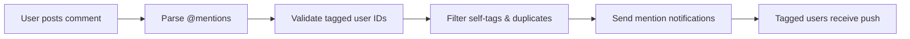
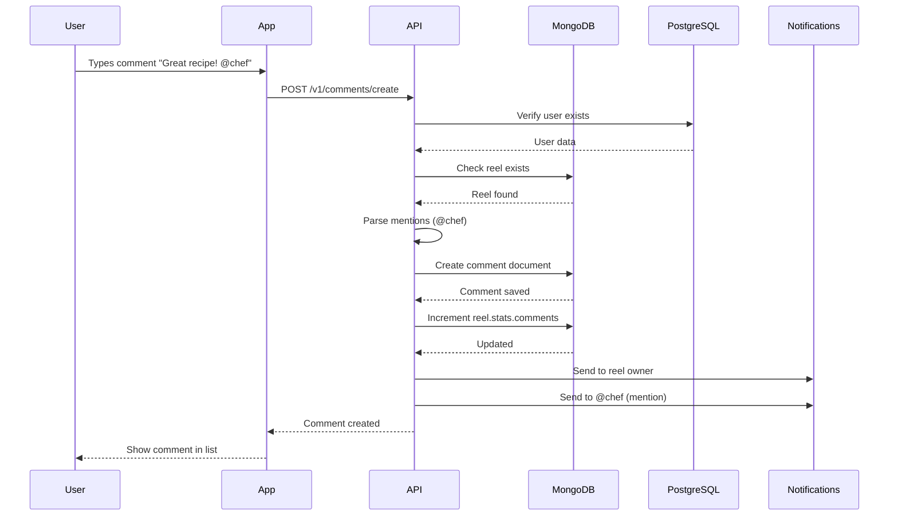
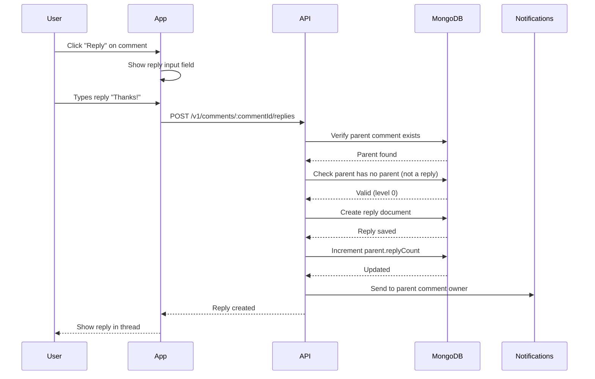
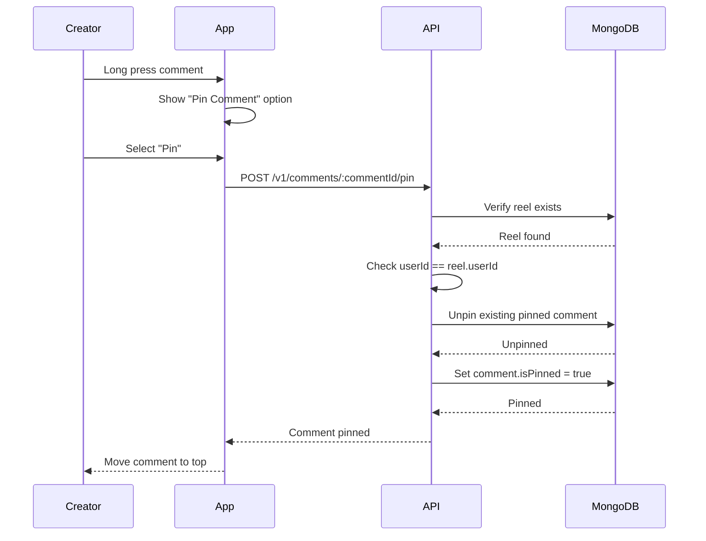
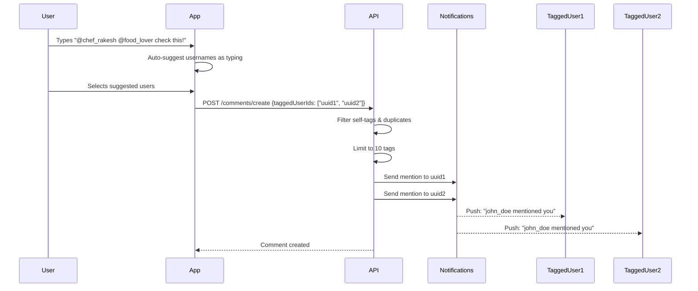

# Comments Module - Feature Overview

**Version:** 1.0  
**Last Updated:** February 14, 2026  
**Module:** `apps/chefooz-apis/src/modules/comments/`  
**Status:** ✅ Production

---

## 📋 Table of Contents

1. [Module Purpose](#module-purpose)
2. [Core Features](#core-features)
3. [Business Rules](#business-rules)
4. [User Flows](#user-flows)
5. [Technical Architecture](#technical-architecture)
6. [Privacy & Security](#privacy--security)
7. [Success Metrics](#success-metrics)
8. [Future Enhancements](#future-enhancements)

---

## Module Purpose

The **Comments Module** enables real-time engagement between users on food reels through a threaded commenting system. Users can comment on reels, reply to comments (1-level threading), like comments, tag other users, and creators can pin important comments to the top of their reels.

### Key Capabilities

- **Comment on Reels**: Text-based comments on food reels (max 500 characters)
- **Reply System**: 1-level threading (comment → replies, no nested replies)
- **User Tagging**: Tag up to 10 users in a comment/reply
- **Like Comments**: Engagement through comment likes
- **Pin Comments**: Creators can pin one comment per reel
- **Real-time Notifications**: Comment, reply, like, and mention notifications
- **Soft Deletion**: Comments can be deleted by their owners

---

## Core Features

### 1. Comment Creation

**Purpose**: Allow users to leave text comments on food reels

**Functionality**:
- Comment on any public reel
- Text length: 1-500 characters
- Automatic mention parsing (`@username`)
- Tag up to 10 users (stores user IDs)
- Real-time comment count update on reel

**Business Value**:
- **Engagement**: Encourages community interaction
- **Social Proof**: More comments = higher reel visibility
- **Discovery**: Tagged users discover new content

**Example**:
```
User: "This biryani looks incredible! @chef_rakesh what spices do you use?"
System: 
  - Creates comment in MongoDB
  - Increments reel.stats.comments by 1
  - Sends notification to reel owner
  - Sends mention notification to @chef_rakesh
```

---

### 2. Reply System (1-Level Threading)

**Purpose**: Enable conversations within comment threads

**Functionality**:
- Reply to any top-level comment
- Maximum 1 level of nesting (no nested replies)
- Chronological sorting (oldest first)
- Reply count badge on parent comments
- First 3 replies shown as preview

**Threading Rules**:
```
✅ Allowed:
Comment (Level 0)
  └─ Reply (Level 1)
  └─ Reply (Level 1)
  └─ Reply (Level 1)

❌ Not Allowed:
Comment (Level 0)
  └─ Reply (Level 1)
      └─ Nested Reply (Level 2) ❌ BLOCKED
```

**Why 1-Level Only?**
- **UX Simplicity**: Prevents deep thread confusion
- **Mobile Optimization**: Better for small screens
- **Performance**: Faster queries without recursion
- **Instagram Parity**: Matches Instagram's comment UX

**Example**:
```
Comment: "Love this recipe!"
  ├─ Reply: "Me too! Made it last week" ✅
  │   └─ Reply to reply: "How was it?" ❌ BLOCKED
  ├─ Reply: "Can you share the recipe?" ✅
  └─ Reply: "Where can I find ingredients?" ✅
```

---

### 3. User Tagging (Mentions)

**Purpose**: Notify specific users about comments and drive discovery

**Functionality**:
- Tag users using `@username` in comment text
- Store tagged user IDs (not usernames) for reliability
- Maximum 10 tags per comment
- Duplicate tag prevention
- Self-tag filtering (cannot tag yourself)

**Mention Parsing**:
```typescript
Input: "Great dish @chef_rakesh and @food_lover!"
Parsed:
  - mentions: ["chef_rakesh", "food_lover"]  // Deprecated (text-based)
  - taggedUserIds: ["uuid-1", "uuid-2"]       // Current (ID-based)
```

**Notification Flow**:


**Business Value**:
- **Viral Growth**: Tagged users discover new content
- **Engagement**: Mentioned users likely to engage
- **Community Building**: Facilitates conversations

---

### 4. Comment Likes

**Purpose**: Allow users to express appreciation for comments

**Functionality**:
- Like/unlike comments and replies
- Denormalized `likesCount` for performance
- `likedBy` array stores user IDs
- Notification to comment owner (except self-likes)

**Like State Management**:
```typescript
Like:
  - Add userId to likedBy array
  - Increment likesCount by 1
  - Send notification

Unlike:
  - Remove userId from likedBy array
  - Decrement likesCount by 1
  - No notification
```

**UI Behavior**:
```
❤️ 15 likes (isLiked: true)  → Click → 🤍 14 likes (isLiked: false)
🤍 14 likes (isLiked: false) → Click → ❤️ 15 likes (isLiked: true)
```

---

### 5. Pin Comments (Creator Feature)

**Purpose**: Creators can highlight important comments on their reels

**Functionality**:
- Pin ONE comment per reel
- Only reel creator can pin/unpin
- Pinned comments shown at top of list
- Visual indicator (📌 pin icon)
- Cannot pin replies (only top-level comments)

**Use Cases**:
- **FAQ Answers**: Pin "Where to order?" with answer
- **Important Updates**: "Recipe updated with measurements"
- **Community Highlights**: Pin best compliment or feedback

**Business Value**:
- **Creator Control**: Manage comment section narrative
- **User Experience**: Highlight helpful information
- **Engagement**: Pinned comments get more visibility

**Example**:
```
Chef posts reel → 50 comments received
Chef pins: "Available for orders! DM me 📞"
All users see pinned comment first, then other comments
```

---

### 6. Comment Deletion (Soft Delete)

**Purpose**: Allow users to remove their own comments

**Functionality**:
- Soft delete (sets `isDeleted: true`)
- Only comment owner can delete
- Deleted comments hidden from lists
- Reply count preserved (doesn't break threading)
- Reel comment count decremented

**Why Soft Delete?**
- **Data Integrity**: Preserve reply threading structure
- **Analytics**: Track deleted content patterns
- **Moderation**: Audit trail for abuse detection
- **Recovery**: Potential undelete feature

**Deletion Rules**:
```
✅ Can Delete:
  - Own comments
  - Own replies

❌ Cannot Delete:
  - Other users' comments
  - Already deleted comments (idempotent)
```

---

### 7. Pagination & Performance

**Purpose**: Handle large comment sections efficiently

**Functionality**:
- **Cursor-based pagination** (MongoDB ObjectId)
- Default limit: 20 comments per page
- Top-level comments: DESC order (newest first)
- Replies: ASC order (chronological)
- Reply preview: First 3 replies per comment

**Loading Strategy**:
```
1. Load 20 top-level comments (pinned first)
2. For each comment, load first 3 replies
3. Show "View all N replies" button if more exist
4. Click button → Load full replies list
```

**Performance Optimizations**:
- Compound indexes on MongoDB
- Denormalized counts (likesCount, replyCount)
- Batch user lookups (PostgreSQL IN query)
- No COUNT(*) queries

---

## Business Rules

### Comment Creation Rules

| Rule | Description | Enforcement |
|------|-------------|-------------|
| **Max Length** | 500 characters | Validated in DTO |
| **Min Length** | 1 character (after trim) | Service layer |
| **Reel Exists** | Cannot comment on deleted reels | Database check |
| **Auth Required** | Must be logged in | JWT guard |
| **Rate Limit** | 60 comments/minute per user | Future: Rate limiter |

### Reply Rules

| Rule | Description | Enforcement |
|------|-------------|-------------|
| **1-Level Only** | No nested replies | Service validation |
| **Same Reel** | Reply must be on same reel as parent | Database check |
| **Parent Exists** | Cannot reply to deleted comments | Database check |
| **Not to Reply** | Cannot reply to a reply | Service validation |

### Tagging Rules

| Rule | Description | Enforcement |
|------|-------------|-------------|
| **Max Tags** | 10 users per comment | DTO validation (sliced to 10) |
| **No Self-Tag** | Cannot tag yourself | Notification filter |
| **Duplicates** | Auto-deduplicated | Service logic |
| **Valid Users** | Tagged user IDs must exist | Best-effort (no strict validation) |

### Pin Rules

| Rule | Description | Enforcement |
|------|-------------|-------------|
| **Creator Only** | Only reel creator can pin | Service validation |
| **One Per Reel** | Only 1 pinned comment per reel | Auto-unpin previous |
| **Top-Level Only** | Cannot pin replies | Service validation |
| **Own Reel** | Can only pin on own reels | Database check |

### Delete Rules

| Rule | Description | Enforcement |
|------|-------------|-------------|
| **Owner Only** | Can only delete own comments | Service validation |
| **Soft Delete** | Sets isDeleted flag | Database update |
| **Idempotent** | Deleting twice = no error | Check isDeleted |
| **Count Update** | Decrement reel comment count | Atomic operation |

---

## User Flows

### Flow 1: User Comments on Reel



**Steps**:
1. User types comment text in app
2. App validates length (1-500 chars)
3. App sends POST request with text + mediaId
4. Backend verifies JWT authentication
5. Backend checks reel exists
6. Backend parses @mentions from text
7. Backend creates comment in MongoDB
8. Backend increments reel comment count
9. Backend sends notification to reel owner
10. Backend sends mention notifications (async)
11. App shows comment instantly (optimistic update)

**Success Scenario**:
```
Input: "This looks delicious! @chef_rakesh"
Output: 
  - Comment appears in list
  - Reel comment count: 42 → 43
  - Notification: "john_doe commented on your reel"
  - Mention: "@chef_rakesh: john_doe mentioned you"
```

---

### Flow 2: User Replies to Comment



**Steps**:
1. User clicks "Reply" button on comment
2. App shows reply input field
3. User types reply text
4. App sends POST request to `/comments/:commentId/replies`
5. Backend verifies parent comment exists
6. Backend validates parent is not a reply (level check)
7. Backend creates reply with `parentId` set
8. Backend increments `parent.replyCount`
9. Backend sends notification to parent author
10. App shows reply in threaded view

**Success Scenario**:
```
Comment: "Where can I order this?"
  ├─ Reply: "DM me at @chef_rakesh!"  ← New reply
  └─ replyCount: 1 → 2
```

---

### Flow 3: Creator Pins Comment



**Steps**:
1. Creator long-presses a comment on their reel
2. App shows action menu with "Pin Comment"
3. Creator selects "Pin"
4. Backend verifies user is reel creator
5. Backend unpins any existing pinned comment
6. Backend sets `isPinned: true` on selected comment
7. App moves comment to top of list with pin icon

**Business Rules**:
- ✅ Only creator can pin
- ✅ Only 1 pinned comment per reel
- ✅ Cannot pin replies
- ✅ Pinned comment always shown first

---

### Flow 4: User Tags Friends in Comment



**Steps**:
1. User types `@` in comment box
2. App shows auto-suggest dropdown with usernames
3. User selects username from dropdown
4. App stores selected user's ID in `taggedUserIds` array
5. User can tag up to 10 users
6. On submit, backend receives `taggedUserIds: ["uuid1", "uuid2", ...]`
7. Backend filters out self-tags and duplicates
8. Backend sends mention notification to each tagged user
9. Tagged users receive push notification

**Example**:
```
Input: "@chef_rakesh your recipe is amazing!"
taggedUserIds: ["550e8400-e29b-41d4-a716-446655440000"]

Notification to chef_rakesh:
  Title: "New Mention"
  Body: "john_doe mentioned you in a comment"
  Action: Opens reel with comment highlighted
```

---

## Technical Architecture

### Data Model (MongoDB)

```typescript
Comment {
  _id: ObjectId                    // MongoDB primary key
  mediaId: ObjectId                // FK to reels collection
  userId: string                   // FK to PostgreSQL users.id
  text: string                     // Comment text (max 500 chars)
  parentId: ObjectId | null        // For replies (null = top-level)
  replyCount: number               // Denormalized count
  isDeleted: boolean               // Soft delete flag
  likesCount: number               // Denormalized count
  likedBy: string[]                // Array of user IDs who liked
  isPinned: boolean                // Creator-pinned flag
  mentions: string[]               // Deprecated: @username array
  taggedUserIds: string[]          // Current: User ID array
  createdAt: Date                  // Auto timestamp
  updatedAt: Date                  // Auto timestamp
}
```

### Database Indexes

```javascript
// List comments by reel (main query)
{ mediaId: 1, createdAt: -1 }

// List replies to comment (threading)
{ parentId: 1, createdAt: 1 }

// User's comment history
{ userId: 1, createdAt: -1 }
```

### Integration Points

| Module | Integration | Purpose |
|--------|-------------|---------|
| **Reels** | Read reel data | Verify reel exists, get owner ID |
| **User** | Read user profiles | Fetch username, fullName for comments |
| **Notification** | Send events | Comment, reply, like, mention notifications |
| **Activity** | Create events | Feed activity for comments |
| **Moderation** | Report comments | Spam/abuse detection |

---

## Privacy & Security

### Authentication

- **JWT Required**: All endpoints require valid JWT token
- **User Validation**: User ID extracted from JWT payload
- **No Anonymous**: Cannot comment without account

### Authorization

| Action | Authorization | Enforcement |
|--------|---------------|-------------|
| **Create Comment** | Any authenticated user | JWT guard |
| **Delete Comment** | Owner only | Service validation |
| **Pin Comment** | Reel creator only | Database check |
| **Like Comment** | Any authenticated user | JWT guard |

### Input Validation

- **XSS Prevention**: Text sanitized (trim, no HTML)
- **Length Limits**: 500 character max
- **Injection Prevention**: Parameterized queries (Mongoose)
- **Rate Limiting**: Future: 60 comments/minute

### Privacy Features

- **Soft Delete**: Comments not permanently removed
- **No Edit**: Cannot edit comments (delete + recreate)
- **Public Visibility**: All comments visible to all users
- **Future**: Private reels → comment visibility restriction

---

## Success Metrics

### Engagement Metrics

| Metric | Target | Measurement |
|--------|--------|-------------|
| **Comments per Reel** | 5+ avg | Median comments on trending reels |
| **Reply Rate** | 30% | Comments with at least 1 reply |
| **Comment Like Rate** | 15% | Comments with at least 1 like |
| **Mention Usage** | 20% | Comments with @tags |

### Performance Metrics

| Metric | Target | Current |
|--------|--------|---------|
| **Comment Load Time** | <300ms | MongoDB query + user lookup |
| **Create Comment** | <200ms | Single write + notification |
| **Reply Load Time** | <200ms | Indexed query by parentId |

### Business Impact

| Metric | Target | Impact |
|--------|--------|--------|
| **Engagement Boost** | +25% | Reels with >10 comments |
| **Retention** | +15% | Users who comment weekly |
| **Discovery** | +30% | Users from @mentions |

---

## Future Enhancements

### Phase 1: Moderation (Q2 2026)

- **Report Comments**: Flag spam/abuse
- **Auto-Moderation**: ML-based profanity filter
- **Shadow Ban**: Hide comments from spammers
- **Creator Controls**: Block users from commenting

### Phase 2: Rich Comments (Q3 2026)

- **Comment Editing**: Edit within 5 minutes
- **GIF Replies**: Reaction GIFs in comments
- **Voice Comments**: Short audio clips
- **Comment Reactions**: Beyond just "like" (❤️🔥😂👏)

### Phase 3: Advanced Features (Q4 2026)

- **Comment Search**: Search within comment section
- **Comment Sorting**: Hot, Top, Controversial
- **Comment Threads**: Expand to 2-level nesting
- **Live Comments**: Real-time updates (WebSocket)

### Phase 4: Business Features (2027)

- **Sponsored Comments**: Promoted comments for brands
- **Comment Analytics**: Creator insights on engagement
- **Comment Monetization**: Tip jar on comments
- **Comment Highlights**: Auto-curate best comments

---

**[FEATURE_COMPLETE ✅]**  
**Module**: Comments  
**Documentation**: Feature Overview  
**Date**: February 14, 2026
