# Review Module - Technical Guide

**Module**: `review`  
**Type**: Core Post-Order Feature  
**Last Updated**: February 22, 2026

---

## 📋 Table of Contents

1. [Architecture Overview](#architecture-overview)
2. [Module Structure](#module-structure)
3. [API Endpoints](#api-endpoints)
4. [Service Methods](#service-methods)
5. [Data Transfer Objects (DTOs)](#data-transfer-objects-dtos)
6. [Database Schema](#database-schema)
7. [Integration Patterns](#integration-patterns)
8. [Domain Rules](#domain-rules)
9. [Error Handling](#error-handling)
10. [Testing Strategy](#testing-strategy)

---

## 🏗️ Architecture Overview

### System Architecture

```mermaid
graph TB
    subgraph "Client Layer"
        MobileApp[Mobile App<br/>React Native]
        AdminPortal[Admin Portal<br/>Next.js]
    end
    
    subgraph "API Layer"
        ReviewController[ReviewController<br/>5 endpoints]
    end
    
    subgraph "Service Layer"
        ReviewService[ReviewService<br/>5 methods]
        ReputationService[ReputationService<br/>CRS tier weighting]
        OrderService[OrderService<br/>Delivery verification]
    end
    
    subgraph "Domain Layer"
        ReputationWeightUtils[reputation-weight.utils.ts<br/>@chefooz-app/domain]
    end
    
    subgraph "Data Layer"
        OrderReviewRepo[(OrderReview<br/>Repository)]
        OrderRepo[(Order<br/>Repository)]
        ProductRepo[(Product<br/>Repository)]
        ReputationRepo[(UserReputationCurrent<br/>Repository)]
    end
    
    subgraph "External Services"
        NotificationService[NotificationDispatcher<br/>Push notifications]
        ReelService[ReelService<br/>Reel upload integration]
    end
    
    MobileApp -->|POST /reviews| ReviewController
    AdminPortal -->|GET /reviews/admin/weight-audit| ReviewController
    
    ReviewController -->|createReview| ReviewService
    ReviewController -->|getOrderReviews| ReviewService
    ReviewController -->|getChefReviews| ReviewService
    ReviewController -->|getDishReviews| ReviewService
    ReviewController -->|getWeightAudit| ReviewService
    
    ReviewService -->|Verify order delivery| OrderRepo
    ReviewService -->|Get CRS tier| ReputationRepo
    ReviewService -->|Calculate weight| ReputationWeightUtils
    ReviewService -->|Save review| OrderReviewRepo
    ReviewService -->|Query aggregates| OrderReviewRepo
    
    ReviewService -.->|TODO: Notify chef| NotificationService
    ReviewService -->|Reel upload eligibility| ReelService
    
    ReputationWeightUtils -->|Pure functions| ReviewService
```

### Request Flow (Review Submission)

```mermaid
sequenceDiagram
    participant Client
    participant Controller
    participant Service
    participant OrderRepo
    participant ReputationRepo
    participant DomainUtils
    participant ReviewRepo

    Client->>Controller: POST /api/v1/reviews<br/>{orderItemId, taste:5, hygiene:5, portion:4, delivery:4, comment}
    Controller->>Service: createReview(userId, dto)
    
    Service->>OrderRepo: findOne({id: orderItemId})
    OrderRepo-->>Service: Order entity (with deliveryStatus)
    
    Service->>Service: Verify order.userId === userId (403 if not)
    Service->>Service: Verify deliveryStatus === 'DELIVERED' (400 if not)
    
    Service->>ReviewRepo: findOne({orderItemId, userId})
    ReviewRepo-->>Service: null (no duplicate)
    
    Service->>Service: Calculate overall = (taste*0.4 + hygiene*0.3 + portion*0.2 + delivery*0.1)
    Note over Service: overall = 4.7
    
    Service->>ReputationRepo: findOne({userId})
    ReputationRepo-->>Service: {level: 'gold', score: 850}
    
    Service->>OrderRepo: count({userId, deliveryStatus: 'DELIVERED'})
    OrderRepo-->>Service: 32 completed orders
    
    Service->>DomainUtils: getReputationWeight('gold', 32)
    DomainUtils-->>Service: 1.15 (Gold tier multiplier)
    
    Service->>Service: weightedRating = 4.7 * 1.15 = 5.41
    
    Service->>ReviewRepo: save({overall: 4.7, weightedRating: 5.41, reputationWeight: 1.15})
    ReviewRepo-->>Service: Saved review entity
    
    Service->>Service: Generate suggested caption<br/>"My review of Butter Chicken — really tasty!"
    
    Service-->>Controller: {reviewId, uploadReelEligible: true, suggestedCaption, orderItemId}
    Controller-->>Client: 201 Created<br/>{success: true, message: 'Review submitted', data: {...}}
```



**Performance Benchmarks**:
- Review submission: 120-180ms (includes order verification + CRS lookup + reputation weight calculation)
- Order reviews query: 80-120ms (single order lookup with relations)
- Chef aggregates: 200-300ms (TODO: currently placeholder, requires chef_id on Product)
- Dish aggregates: 100-150ms (query 20-50 reviews avg, calculate averages + distribution)
- Weight audit: 150-200ms (fetch last 20 reviews + reputation data)

---

## 📂 Module Structure

```
apps/chefooz-apis/src/modules/review/
├── dto/
│   ├── create-review.dto.ts          # Review submission DTO (4 dimensions + comment)
│   └── review-response.dto.ts        # Response DTOs (aggregates, create response)
├── review.controller.ts              # 5 REST endpoints (create, order, chef, dish, audit)
├── review.module.ts                  # Module definition + TypeORM imports
└── review.service.ts                 # 5 service methods (business logic)

libs/domain/src/
└── reputation-weight.utils.ts        # Pure functions (getReputationWeight, calculateWeightedRating)

apps/chefooz-apis/src/database/entities/
├── order-review.entity.ts            # OrderReview entity (ratings + metadata)
├── order.entity.ts                   # Order entity (delivery status verification)
├── product.entity.ts                 # Product entity (dish aggregates)
└── user-reputation-current.entity.ts # CRS tier + score
```

### File Responsibilities

| File | Lines | Purpose |
|------|-------|---------|
| `review.controller.ts` | 157 | REST API endpoints, request validation, response formatting |
| `review.service.ts` | 332 | Business logic, reputation weighting, aggregation calculations |
| `review.module.ts` | 19 | Dependency injection, TypeORM entity registration |
| `create-review.dto.ts` | 62 | Review submission validation (1-5 ratings, 280 char comment) |
| `review-response.dto.ts` | 168 | Response DTOs (aggregates, create response, individual review) |
| `reputation-weight.utils.ts` | ~50 | Pure CRS tier weight calculation (1.0-1.25x multipliers) |

---

## 🌐 API Endpoints

### 1. Submit Review

**Endpoint**: `POST /api/v1/reviews`  
**Auth**: JWT required (customer only)  
**Rate Limit**: 10 requests per hour per user (prevents spam)  
**Purpose**: Create structured review for delivered order

**Request Headers**:
```http
POST /api/v1/reviews HTTP/1.1
Host: api.chefooz.com
Authorization: Bearer <jwt_token>
Content-Type: application/json
```

**Request Body**:
```json
{
  "orderItemId": "123e4567-e89b-12d3-a456-426614174000",
  "taste": 5,
  "hygiene": 5,
  "portion": 4,
  "delivery": 4,
  "comment": "Absolutely delicious! The flavors were perfect and delivery was quick."
}
```

**Validation Rules**:
- `orderItemId`: UUID format (class-validator `@IsUUID()`)
- `taste`, `hygiene`, `portion`, `delivery`: Integers 1-5 (`@IsInt()`, `@Min(1)`, `@Max(5)`)
- `comment`: Optional string, max 280 characters (`@IsOptional()`, `@IsString()`, `@MaxLength(280)`)

**Success Response** (201 Created):
```json
{
  "success": true,
  "message": "Review submitted",
  "data": {
    "reviewId": "review-uuid",
    "uploadReelEligible": true,
    "suggestedCaption": "My review of Butter Chicken — really tasty!",
    "orderItemId": "123e4567-e89b-12d3-a456-426614174000"
  }
}
```

**Error Responses**:

**400 Bad Request - Order Not Delivered**:
```json
{
  "success": false,
  "message": "Can only review delivered orders",
  "errorCode": "ORDER_NOT_DELIVERED"
}
```

**403 Forbidden - Not Order Owner**:
```json
{
  "success": false,
  "message": "You can only review your own orders",
  "errorCode": "REVIEW_NOT_AUTHORIZED"
}
```

**404 Not Found - Order Not Found**:
```json
{
  "success": false,
  "message": "Order not found",
  "errorCode": "ORDER_NOT_FOUND"
}
```

**409 Conflict - Review Already Exists**:
```json
{
  "success": false,
  "message": "You have already reviewed this order",
  "errorCode": "REVIEW_ALREADY_EXISTS"
}
```

**Controller Implementation**:
```typescript
@Post()
@HttpCode(HttpStatus.CREATED)
@ApiOperation({
  summary: 'Submit order review',
  description: 'Create a structured review for a delivered order. Returns reel upload eligibility.',
})
@ApiResponse({ status: 201, description: 'Review submitted successfully', type: CreateReviewResponseDto })
@ApiResponse({ status: 400, description: 'Order not delivered or invalid ratings' })
@ApiResponse({ status: 404, description: 'Order not found' })
@ApiResponse({ status: 409, description: 'Review already exists' })
async createReview(
  @Body() dto: CreateReviewDto,
  @Request() req: any,
) {
  const userId = req.user.id;
  const result = await this.reviewService.createReview(userId, dto);
  return {
    success: true,
    message: 'Review submitted',
    data: result,
  };
}
```

**Performance**: 120-180ms typical (order verification 40ms + CRS lookup 30ms + weight calculation 10ms + save 40ms)

---

### 2. Get Order Reviews

**Endpoint**: `GET /api/v1/reviews/order/:orderId`  
**Auth**: JWT required  
**Rate Limit**: 100 requests per hour per user  
**Purpose**: Retrieve all reviews for specific order (customer order history)

**Request Headers**:
```http
GET /api/v1/reviews/order/123e4567-e89b-12d3-a456-426614174000 HTTP/1.1
Host: api.chefooz.com
Authorization: Bearer <jwt_token>
```

**Success Response** (200 OK):
```json
{
  "success": true,
  "message": "Reviews retrieved",
  "data": [
    {
      "id": "review-uuid-1",
      "orderItemId": "123e4567-e89b-12d3-a456-426614174000",
      "userId": "user-uuid-1",
      "taste": 5,
      "portion": 4,
      "hygiene": 5,
      "delivery": 4,
      "overall": 4.7,
      "weightedRating": 5.41,
      "reputationWeight": 1.15,
      "comment": "Absolutely delicious! The flavors were perfect and delivery was quick.",
      "createdAt": "2026-02-20T10:30:00Z"
    }
  ]
}
```

**Controller Implementation**:
```typescript
@Get('order/:orderId')
@ApiOperation({
  summary: 'Get reviews for an order',
  description: 'Retrieve all reviews for a specific order',
})
@ApiResponse({ status: 200, description: 'Reviews retrieved successfully' })
async getOrderReviews(@Param('orderId') orderId: string) {
  const reviews = await this.reviewService.getOrderReviews(orderId);
  return {
    success: true,
    message: 'Reviews retrieved',
    data: reviews,
  };
}
```

**Performance**: 80-120ms (single query with ORDER BY createdAt DESC)

---

### 3. Get Chef Review Aggregates

**Endpoint**: `GET /api/v1/reviews/chef/:chefId`  
**Auth**: JWT required  
**Rate Limit**: 100 requests per hour per user  
**Purpose**: Retrieve average ratings and distribution for chef (chef profile page)  
**Status**: ⚠️ TODO - Requires `chefId` foreign key on Product entity (currently returns placeholder)

**Request Headers**:
```http
GET /api/v1/reviews/chef/chef-uuid-123 HTTP/1.1
Host: api.chefooz.com
Authorization: Bearer <jwt_token>
```

**Success Response** (200 OK):
```json
{
  "success": true,
  "message": "Chef review aggregates retrieved",
  "data": {
    "averages": {
      "taste": 4.52,
      "portion": 4.18,
      "hygiene": 4.76,
      "delivery": 3.94,
      "overall": 4.42
    },
    "weightedAverages": {
      "overall": 4.58
    },
    "distribution": {
      "1": 2,
      "2": 3,
      "3": 8,
      "4": 15,
      "5": 14
    },
    "totalReviews": 42
  }
}
```

**TODO Implementation**:
```typescript
// Requires chef_id on Product entity
async getChefReviews(chefId: string): Promise<ReviewAggregatesDto> {
  const reviews = await this.reviewRepository
    .createQueryBuilder('review')
    .innerJoin('review.order', 'order')
    .innerJoin('order.product', 'product')
    .where('product.chefId = :chefId', { chefId })
    .getMany();
  
  // Calculate aggregates (same logic as getDishReviews)
  return this.calculateAggregates(reviews);
}
```

**Controller Implementation**:
```typescript
@Get('chef/:chefId')
@ApiOperation({
  summary: 'Get chef review aggregates',
  description: 'Retrieve average ratings and total count for a chef',
})
@ApiResponse({ status: 200, description: 'Chef aggregates retrieved', type: ReviewAggregatesDto })
async getChefReviews(@Param('chefId') chefId: string) {
  const aggregates = await this.reviewService.getChefReviews(chefId);
  return {
    success: true,
    message: 'Chef review aggregates retrieved',
    data: aggregates,
  };
}
```

**Performance**: 200-300ms estimated (join order + product + chef, calculate aggregates)

---

### 4. Get Dish Review Aggregates

**Endpoint**: `GET /api/v1/reviews/dish/:productId`  
**Auth**: JWT required  
**Rate Limit**: 100 requests per hour per user  
**Purpose**: Retrieve average ratings and distribution for specific dish (dish detail page)

**Request Headers**:
```http
GET /api/v1/reviews/dish/product-uuid-123 HTTP/1.1
Host: api.chefooz.com
Authorization: Bearer <jwt_token>
```

**Success Response** (200 OK):
```json
{
  "success": true,
  "message": "Dish review aggregates retrieved",
  "data": {
    "averages": {
      "taste": 4.52,
      "portion": 4.18,
      "hygiene": 4.76,
      "delivery": 3.94,
      "overall": 4.42
    },
    "weightedAverages": {
      "overall": 4.58
    },
    "distribution": {
      "1": 2,
      "2": 3,
      "3": 8,
      "4": 15,
      "5": 14
    },
    "totalReviews": 42
  }
}
```

**Empty State Response** (no reviews):
```json
{
  "success": true,
  "message": "Dish review aggregates retrieved",
  "data": {
    "averages": {
      "taste": 0,
      "portion": 0,
      "hygiene": 0,
      "delivery": 0,
      "overall": 0
    },
    "weightedAverages": {
      "overall": 0
    },
    "distribution": {
      "1": 0,
      "2": 0,
      "3": 0,
      "4": 0,
      "5": 0
    },
    "totalReviews": 0
  }
}
```

**Controller Implementation**:
```typescript
@Get('dish/:productId')
@ApiOperation({
  summary: 'Get dish review aggregates',
  description: 'Retrieve average ratings and total count for a specific dish',
})
@ApiResponse({ status: 200, description: 'Dish aggregates retrieved', type: ReviewAggregatesDto })
async getDishReviews(@Param('productId') productId: string) {
  const aggregates = await this.reviewService.getDishReviews(productId);
  return {
    success: true,
    message: 'Dish review aggregates retrieved',
    data: aggregates,
  };
}
```

**Performance**: 100-150ms (query 20-50 reviews avg, calculate averages + distribution)

---

### 5. Admin Weight Audit Trail

**Endpoint**: `GET /api/v1/reviews/admin/weight-audit?userId=<uuid>`  
**Auth**: JWT required + **TODO: Admin role guard**  
**Rate Limit**: 50 requests per hour per admin  
**Purpose**: Investigate reputation weight calculations for fraud detection and customer support

**Request Headers**:
```http
GET /api/v1/reviews/admin/weight-audit?userId=user-uuid-123 HTTP/1.1
Host: api.chefooz.com
Authorization: Bearer <admin_jwt_token>
```

**Query Parameters**:
- `userId` (required): User UUID to audit

**Success Response** (200 OK):
```json
{
  "success": true,
  "message": "Weight audit data retrieved",
  "data": {
    "userId": "user-uuid-123",
    "currentTier": "gold",
    "currentScore": 850,
    "reviews": [
      {
        "reviewId": "review-uuid-1",
        "orderItemId": "order-uuid-1",
        "createdAt": "2026-02-20T10:30:00Z",
        "overall": 4.7,
        "weightedRating": 5.41,
        "reputationWeight": 1.15,
        "tierAtTimeOfReview": "gold"
      },
      {
        "reviewId": "review-uuid-2",
        "orderItemId": "order-uuid-2",
        "createdAt": "2026-02-15T14:00:00Z",
        "overall": 4.5,
        "weightedRating": 4.73,
        "reputationWeight": 1.05,
        "tierAtTimeOfReview": "silver"
      }
      // ... last 20 reviews
    ],
    "totalReviews": 32
  }
}
```

**Controller Implementation**:
```typescript
@Get('admin/weight-audit')
@ApiOperation({
  summary: '[ADMIN] Audit reputation-weighted review calculations',
  description: 'Returns last 20 reviews with weight calculations for a specific user',
})
@ApiQuery({ name: 'userId', required: true, description: 'User ID to audit' })
@ApiResponse({ status: 200, description: 'Weight audit data retrieved' })
async getWeightAudit(@Query('userId') userId: string) {
  // TODO: Add admin role guard
  const auditData = await this.reviewService.getWeightAudit(userId);
  return {
    success: true,
    message: 'Weight audit data retrieved',
    data: auditData,
  };
}
```

**TODO**: Add admin role verification:
```typescript
@Roles('admin') // Custom decorator
@UseGuards(JwtAuthGuard, RolesGuard)
@Get('admin/weight-audit')
// ... rest of endpoint
```

**Performance**: 150-200ms (fetch last 20 reviews + reputation data)

---

## ⚙️ Service Methods

### 1. createReview (Review Submission)

**Purpose**: Create new review with reputation weighting and reel upload eligibility  
**Complexity**: High (10 steps: order verification, duplicate check, weight calculation, save, caption generation)  
**Performance**: 120-180ms typical

**Method Signature**:
```typescript
async createReview(
  userId: string,
  dto: CreateReviewDto,
): Promise<CreateReviewResponseDto>
```

**Full Implementation**:
```typescript
async createReview(
  userId: string,
  dto: CreateReviewDto,
): Promise<CreateReviewResponseDto> {
  // 1. Fetch order and verify it exists
  const order = await this.orderRepository.findOne({
    where: { id: dto.orderItemId },
  });

  if (!order) {
    throw new NotFoundException({
      success: false,
      message: 'Order not found',
      errorCode: 'ORDER_NOT_FOUND',
    });
  }

  // 2. Verify order belongs to the user (authorization)
  if (order.userId !== userId) {
    throw new ForbiddenException({
      success: false,
      message: 'You can only review your own orders',
      errorCode: 'REVIEW_NOT_AUTHORIZED',
    });
  }

  // 3. Verify order is delivered (eligibility)
  // CRITICAL: Check deliveryStatus (not order.status which stays 'paid')
  if (order.deliveryStatus !== 'DELIVERED') {
    throw new BadRequestException({
      success: false,
      message: 'Can only review delivered orders',
      errorCode: 'ORDER_NOT_DELIVERED',
    });
  }

  // 4. Check for duplicate review (prevent spam)
  const existingReview = await this.reviewRepository.findOne({
    where: {
      orderItemId: dto.orderItemId,
      userId,
    },
  });

  if (existingReview) {
    throw new ConflictException({
      success: false,
      message: 'You have already reviewed this order',
      errorCode: 'REVIEW_ALREADY_EXISTS',
    });
  }

  // 5. TODO: Verify reviewer is not the chef (prevent self-reviews)
  // Requires chefId on Product entity
  // if (order.product.chefId === userId) {
  //   throw new ForbiddenException({
  //     success: false,
  //     message: 'Cannot review your own dishes',
  //     errorCode: 'SELF_REVIEW_NOT_ALLOWED',
  //   });
  // }

  // 6. Calculate weighted overall rating
  // Formula: taste*0.4 + hygiene*0.3 + portion*0.2 + delivery*0.1
  const overall =
    dto.taste * 0.4 +
    dto.hygiene * 0.3 +
    dto.portion * 0.2 +
    dto.delivery * 0.1;

  // 7. Calculate reputation weight and weighted rating
  // Lookup user's CRS tier and completed orders count
  const userReputation = await this.reputationRepository.findOne({
    where: { userId },
  });

  // Count completed orders for this user (threshold check ≥3)
  const completedOrdersCount = await this.orderRepository.count({
    where: {
      userId,
      deliveryStatus: 'DELIVERED', // Only count delivered orders
    },
  });

  // Calculate reputation weight (requires ≥3 orders for bonus)
  const reputationWeight = completedOrdersCount >= 3 && userReputation
    ? getReputationWeight(userReputation.level, completedOrdersCount)
    : 1.0; // No bonus for <3 orders or no reputation record

  // Calculate weighted rating
  const weightedRating = calculateWeightedRating(overall, reputationWeight);

  // 8. TODO: Profanity filter on comment
  // Placeholder: if (containsProfanity(dto.comment)) throw error

  // 9. Create review with weighted scores
  const review = this.reviewRepository.create({
    orderItemId: dto.orderItemId,
    userId,
    taste: dto.taste,
    portion: dto.portion,
    hygiene: dto.hygiene,
    delivery: dto.delivery,
    overall: parseFloat(overall.toFixed(2)),
    weightedRating: parseFloat(weightedRating.toFixed(2)),
    reputationWeight: parseFloat(reputationWeight.toFixed(2)),
    comment: dto.comment,
  });

  const savedReview = await this.reviewRepository.save(review);

  // 10. Generate suggested caption from order items
  const firstItemName = order.items?.[0]?.titleSnapshot || 'this dish';
  const suggestedCaption = `My review of ${firstItemName} — really tasty!`;

  // 11. Return response with reel upload eligibility
  return {
    reviewId: savedReview.id,
    uploadReelEligible: true, // Always eligible after review (Phase 1)
    suggestedCaption,
    orderItemId: dto.orderItemId,
  };
}
```

**Key Validation Steps**:

| Step | Check | Error Code | HTTP Status |
|------|-------|------------|-------------|
| 1 | Order exists | `ORDER_NOT_FOUND` | 404 |
| 2 | Order belongs to user | `REVIEW_NOT_AUTHORIZED` | 403 |
| 3 | Order is DELIVERED | `ORDER_NOT_DELIVERED` | 400 |
| 4 | No existing review | `REVIEW_ALREADY_EXISTS` | 409 |
| 5 | Not self-review (TODO) | `SELF_REVIEW_NOT_ALLOWED` | 403 |
| 8 | No profanity (TODO) | `PROFANITY_DETECTED` | 400 |

**Performance Breakdown**:
- Order fetch: 30-40ms (single query)
- Authorization check: <1ms (in-memory comparison)
- Delivery status check: <1ms (in-memory comparison)
- Duplicate check: 20-30ms (indexed query on `orderItemId` + `userId`)
- Overall calculation: <1ms (arithmetic)
- Reputation lookup: 20-30ms (indexed query on `userId`)
- Completed orders count: 20-30ms (indexed count query)
- Weight calculation: <1ms (pure function from domain utils)
- Review save: 30-40ms (INSERT with returning)
- Caption generation: <1ms (string template)
- **Total**: 120-180ms typical

**Database Writes**: 1 INSERT (order_reviews table)  
**Database Reads**: 3-4 queries (order, existing review check, reputation, completed orders count)

---

### 2. getOrderReviews (Order Review Retrieval)

**Purpose**: Fetch all reviews for specific order (customer order history)  
**Complexity**: Low (single query with type parsing)  
**Performance**: 80-120ms typical

**Method Signature**:
```typescript
async getOrderReviews(orderId: string): Promise<OrderReview[]>
```

**Implementation**:
```typescript
async getOrderReviews(orderId: string): Promise<OrderReview[]> {
  const reviews = await this.reviewRepository.find({
    where: { orderItemId: orderId },
    order: { createdAt: 'DESC' }, // Most recent first
  });

  // Parse decimal fields (TypeORM returns them as strings from PostgreSQL)
  return reviews.map(review => ({
    ...review,
    overall: parseFloat(review.overall as any),
    weightedRating: review.weightedRating ? parseFloat(review.weightedRating as any) : undefined,
    reputationWeight: review.reputationWeight ? parseFloat(review.reputationWeight as any) : undefined,
  }));
}
```

**Type Parsing Rationale**:
- PostgreSQL `DECIMAL` type returns as string to preserve precision (e.g., "4.70" not 4.7)
- TypeORM maps to `string` type by default
- Manual parsing to `number` type for JSON response consistency
- Optional fields (`weightedRating`, `reputationWeight`) may be null/undefined for old reviews

**Performance Breakdown**:
- Database query: 60-80ms (indexed query on `orderItemId`, ORDER BY `createdAt`)
- Type parsing: 10-20ms (map array of 1-5 reviews typically)
- **Total**: 80-120ms typical

**Database Reads**: 1 SELECT (order_reviews table)

**Query Plan** (PostgreSQL):
```sql
EXPLAIN ANALYZE
SELECT * FROM order_reviews
WHERE order_item_id = 'uuid'
ORDER BY created_at DESC;

-- Result: Index Scan using idx_order_reviews_order_item_id (cost=0.42..8.45 rows=1 width=200)
```

---

### 3. getChefReviews (Chef Aggregate Calculation)

**Purpose**: Calculate average ratings and distribution for chef (chef profile page)  
**Complexity**: Medium (TODO - requires chef_id foreign key, currently placeholder)  
**Performance**: 200-300ms estimated (after implementation)

**Method Signature**:
```typescript
async getChefReviews(chefId: string): Promise<ReviewAggregatesDto>
```

**Current Implementation** (Placeholder):
```typescript
async getChefReviews(chefId: string): Promise<ReviewAggregatesDto> {
  // TODO: Requires chef_id on Product entity
  // For now, return placeholder
  return {
    averages: {
      taste: 0,
      portion: 0,
      hygiene: 0,
      delivery: 0,
      overall: 0,
    },
    weightedAverages: {
      overall: 0,
    },
    distribution: {
      1: 0,
      2: 0,
      3: 0,
      4: 0,
      5: 0,
    },
    totalReviews: 0,
  };
}
```

**TODO Implementation** (Requires Schema Change):
```typescript
async getChefReviews(chefId: string): Promise<ReviewAggregatesDto> {
  // Step 1: Fetch all reviews for chef's dishes
  const reviews = await this.reviewRepository
    .createQueryBuilder('review')
    .innerJoin('review.order', 'order')
    .innerJoin('order.product', 'product')
    .where('product.chefId = :chefId', { chefId })
    .getMany();

  // Step 2: Handle empty case
  if (reviews.length === 0) {
    return this.getEmptyAggregates();
  }

  // Step 3: Calculate aggregates (same logic as getDishReviews)
  return this.calculateAggregates(reviews);
}
```

**Required Schema Change**:
```sql
-- Add chef_id foreign key to products table
ALTER TABLE products 
ADD COLUMN chef_id UUID REFERENCES users(id);

-- Create index for chef lookups
CREATE INDEX idx_products_chef_id ON products(chef_id);

-- Backfill existing data (migration script)
UPDATE products p
SET chef_id = (
  SELECT user_id FROM chef_profiles cp
  WHERE cp.id = p.chef_profile_id
);
```

**Performance Breakdown** (Estimated):
- Database query: 150-200ms (join order + product + chef, fetch 50-200 reviews)
- Aggregate calculation: 30-50ms (sum, average, distribution)
- **Total**: 200-300ms estimated

---

### 4. getDishReviews (Dish Aggregate Calculation)

**Purpose**: Calculate average ratings and distribution for specific dish (dish detail page)  
**Complexity**: Medium (query + aggregate calculation)  
**Performance**: 100-150ms typical

**Method Signature**:
```typescript
async getDishReviews(productId: string): Promise<ReviewAggregatesDto>
```

**Full Implementation**:
```typescript
async getDishReviews(productId: string): Promise<ReviewAggregatesDto> {
  // Step 1: Fetch all reviews for dish
  const reviews = await this.reviewRepository
    .createQueryBuilder('review')
    .innerJoin('review.order', 'order')
    .where('order.productId = :productId', { productId })
    .getMany();

  // Step 2: Handle empty case (no reviews yet)
  if (reviews.length === 0) {
    return {
      averages: {
        taste: 0,
        portion: 0,
        hygiene: 0,
        delivery: 0,
        overall: 0,
      },
      weightedAverages: {
        overall: 0,
      },
      distribution: {
        1: 0,
        2: 0,
        3: 0,
        4: 0,
        5: 0,
      },
      totalReviews: 0,
    };
  }

  // Step 3: Calculate sums (raw and weighted)
  const sum = reviews.reduce(
    (acc, review) => ({
      taste: acc.taste + review.taste,
      portion: acc.portion + review.portion,
      hygiene: acc.hygiene + review.hygiene,
      delivery: acc.delivery + review.delivery,
      overall: acc.overall + Number(review.overall),
      weighted: acc.weighted + Number(review.weightedRating || review.overall),
    }),
    { taste: 0, portion: 0, hygiene: 0, delivery: 0, overall: 0, weighted: 0 },
  );

  // Step 4: Calculate distribution (1-5 star buckets)
  const distribution = reviews.reduce(
    (acc, review) => {
      const rating = Math.round(Number(review.overall)) as 1 | 2 | 3 | 4 | 5;
      if (rating >= 1 && rating <= 5) {
        acc[rating]++;
      }
      return acc;
    },
    { 1: 0, 2: 0, 3: 0, 4: 0, 5: 0 },
  );

  // Step 5: Calculate averages
  const count = reviews.length;

  return {
    averages: {
      taste: parseFloat((sum.taste / count).toFixed(2)),
      portion: parseFloat((sum.portion / count).toFixed(2)),
      hygiene: parseFloat((sum.hygiene / count).toFixed(2)),
      delivery: parseFloat((sum.delivery / count).toFixed(2)),
      overall: parseFloat((sum.overall / count).toFixed(2)),
    },
    weightedAverages: {
      overall: parseFloat((sum.weighted / count).toFixed(2)),
    },
    distribution,
    totalReviews: count,
  };
}
```

**Aggregate Calculation Logic**:

**Example Input** (3 reviews):
```javascript
[
  { taste: 5, portion: 4, hygiene: 5, delivery: 4, overall: 4.7, weightedRating: 5.41, reputationWeight: 1.15 },
  { taste: 4, portion: 4, hygiene: 4, delivery: 3, overall: 3.9, weightedRating: 4.10, reputationWeight: 1.05 },
  { taste: 5, portion: 5, hygiene: 5, delivery: 5, overall: 5.0, weightedRating: 5.00, reputationWeight: 1.00 }
]
```

**Step 3 - Calculate Sums**:
```javascript
sum = {
  taste: 5 + 4 + 5 = 14,
  portion: 4 + 4 + 5 = 13,
  hygiene: 5 + 4 + 5 = 14,
  delivery: 4 + 3 + 5 = 12,
  overall: 4.7 + 3.9 + 5.0 = 13.6,
  weighted: 5.41 + 4.10 + 5.00 = 14.51
}
```

**Step 4 - Calculate Distribution**:
```javascript
// Round overall ratings to nearest integer
4.7 → 5 stars
3.9 → 4 stars
5.0 → 5 stars

distribution = {
  1: 0,
  2: 0,
  3: 0,
  4: 1, // One 4-star review
  5: 2  // Two 5-star reviews
}
```

**Step 5 - Calculate Averages**:
```javascript
count = 3

averages = {
  taste: 14 / 3 = 4.67,
  portion: 13 / 3 = 4.33,
  hygiene: 14 / 3 = 4.67,
  delivery: 12 / 3 = 4.00,
  overall: 13.6 / 3 = 4.53
}

weightedAverages = {
  overall: 14.51 / 3 = 4.84 // +6.8% increase due to Gold tier reviewer
}
```

**Performance Breakdown**:
- Database query: 60-80ms (join order, fetch 20-50 reviews typical)
- Sum calculation: 10-20ms (reduce array)
- Distribution calculation: 10-20ms (reduce array)
- Average calculation: <1ms (arithmetic)
- **Total**: 100-150ms typical

**Database Reads**: 1 SELECT with JOIN (order_reviews + orders)

**Query Plan** (PostgreSQL):
```sql
EXPLAIN ANALYZE
SELECT review.* FROM order_reviews review
INNER JOIN orders o ON review.order_item_id = o.id
WHERE o.product_id = 'uuid';

-- Result: Hash Join (cost=8.45..120.50 rows=42 width=200)
--         -> Seq Scan on orders (cost=0.00..100.00 rows=5000 width=16)
--         -> Hash (cost=8.43..8.43 rows=1 width=16)
```

---

### 5. getWeightAudit (Admin Audit Trail)

**Purpose**: Fetch user's review history with weight calculations for fraud investigation  
**Complexity**: Medium (fetch reviews + reputation data)  
**Performance**: 150-200ms typical

**Method Signature**:
```typescript
async getWeightAudit(userId: string)
```

**Full Implementation**:
```typescript
async getWeightAudit(userId: string) {
  // Step 1: Fetch last 20 reviews for user (most recent first)
  const reviews = await this.reviewRepository.find({
    where: { userId },
    order: { createdAt: 'DESC' },
    take: 20,
    relations: ['order'], // Optional: include order details
  });

  // Step 2: Get user's current reputation for context
  const userReputation = await this.reputationRepository.findOne({
    where: { userId },
  });

  // Step 3: Return audit data
  return {
    userId,
    currentTier: userReputation?.level || 'bronze',
    currentScore: userReputation?.score || 0,
    reviews: reviews.map((review) => ({
      reviewId: review.id,
      orderItemId: review.orderItemId,
      createdAt: review.createdAt,
      overall: review.overall,
      weightedRating: review.weightedRating,
      reputationWeight: review.reputationWeight,
      tierAtTimeOfReview: userReputation?.level || 'bronze', // Simplified - actual tier may have changed
    })),
    totalReviews: reviews.length,
  };
}
```

**Audit Use Cases**:

1. **Fraud Detection**: Identify new accounts (Bronze tier, 0-2 orders) submitting suspicious reviews
2. **Customer Support**: Explain weight calculations to users ("Why did my review not increase chef rating much?")
3. **Tier Upgrade Verification**: Confirm tier upgrades correctly apply weight bonuses (Silver 1.05x → Gold 1.15x)
4. **Algorithm Debugging**: Ensure weight calculations match expected tier multipliers

**Performance Breakdown**:
- Reviews query: 100-120ms (indexed query on `userId`, ORDER BY `createdAt` DESC, LIMIT 20)
- Reputation query: 30-40ms (indexed query on `userId`)
- Data mapping: 10-20ms (map array of 20 reviews)
- **Total**: 150-200ms typical

**Database Reads**: 2 SELECTs (order_reviews + user_reputation_current)

**Query Plan** (PostgreSQL):
```sql
EXPLAIN ANALYZE
SELECT * FROM order_reviews
WHERE user_id = 'uuid'
ORDER BY created_at DESC
LIMIT 20;

-- Result: Index Scan using idx_order_reviews_user_id (cost=0.42..18.45 rows=20 width=200)
```

---

## 📦 Data Transfer Objects (DTOs)

### 1. CreateReviewDto (Review Submission)

**Purpose**: Validate review submission request body  
**Validation**: class-validator decorators (1-5 integer range, 280 char comment)  
**File**: `dto/create-review.dto.ts` (62 lines)

**Full Implementation**:
```typescript
import { IsInt, Min, Max, IsString, MaxLength, IsOptional, IsUUID } from 'class-validator';
import { ApiProperty } from '@nestjs/swagger';

export class CreateReviewDto {
  @ApiProperty({
    description: 'Order item ID being reviewed',
    example: '123e4567-e89b-12d3-a456-426614174000',
  })
  @IsUUID()
  orderItemId!: string;

  @ApiProperty({
    description: 'Taste rating (1-5)',
    minimum: 1,
    maximum: 5,
    example: 5,
  })
  @IsInt()
  @Min(1)
  @Max(5)
  taste!: number;

  @ApiProperty({
    description: 'Portion size rating (1-5)',
    minimum: 1,
    maximum: 5,
    example: 4,
  })
  @IsInt()
  @Min(1)
  @Max(5)
  portion!: number;

  @ApiProperty({
    description: 'Hygiene/cleanliness rating (1-5)',
    minimum: 1,
    maximum: 5,
    example: 5,
  })
  @IsInt()
  @Min(1)
  @Max(5)
  hygiene!: number;

  @ApiProperty({
    description: 'Delivery experience rating (1-5)',
    minimum: 1,
    maximum: 5,
    example: 4,
  })
  @IsInt()
  @Min(1)
  @Max(5)
  delivery!: number;

  @ApiProperty({
    description: 'Optional text review (max 280 characters)',
    required: false,
    maxLength: 280,
    example: 'Absolutely delicious! The flavors were perfect and delivery was quick.',
  })
  @IsOptional()
  @IsString()
  @MaxLength(280, { message: 'Review comment cannot exceed 280 characters' })
  comment?: string;
}
```

**Validation Rules**:

| Field | Type | Required | Constraints | Error Message |
|-------|------|----------|-------------|---------------|
| `orderItemId` | UUID | Yes | Valid UUID format | "orderItemId must be a UUID" |
| `taste` | Integer | Yes | 1-5 | "taste must not be less than 1", "taste must not be greater than 5" |
| `portion` | Integer | Yes | 1-5 | "portion must not be less than 1", "portion must not be greater than 5" |
| `hygiene` | Integer | Yes | 1-5 | "hygiene must not be less than 1", "hygiene must not be greater than 5" |
| `delivery` | Integer | Yes | 1-5 | "delivery must not be less than 1", "delivery must not be greater than 5" |
| `comment` | String | No | Max 280 chars | "Review comment cannot exceed 280 characters" |

**Validation Example** (Invalid Request):
```json
{
  "orderItemId": "invalid-uuid",
  "taste": 6,
  "portion": 0,
  "hygiene": 5,
  "delivery": 4,
  "comment": "This is a very long comment that exceeds the 280 character limit and will be rejected by the validation layer... [300 characters total]"
}
```

**Validation Error Response** (400 Bad Request):
```json
{
  "statusCode": 400,
  "message": [
    "orderItemId must be a UUID",
    "taste must not be greater than 5",
    "portion must not be less than 1",
    "Review comment cannot exceed 280 characters"
  ],
  "error": "Bad Request"
}
```

---

### 2. CreateReviewResponseDto (Review Submission Response)

**Purpose**: Return review ID and reel upload eligibility after successful submission  
**File**: `dto/review-response.dto.ts` (lines 148-168)

**Implementation**:
```typescript
import { ApiProperty } from '@nestjs/swagger';

export class CreateReviewResponseDto {
  @ApiProperty({
    description: 'Created review ID',
    example: '123e4567-e89b-12d3-a456-426614174000',
  })
  reviewId!: string;

  @ApiProperty({
    description: 'Whether user is eligible to upload a review reel',
    example: true,
  })
  uploadReelEligible!: boolean;

  @ApiProperty({
    description: 'AI-generated suggested caption for review reel',
    example: 'My review of Butter Chicken from Chef Ramesh — really tasty!',
  })
  suggestedCaption!: string;

  @ApiProperty({
    description: 'Order item ID for linking to reel',
    example: '123e4567-e89b-12d3-a456-426614174000',
  })
  orderItemId!: string;
}
```

**Example Response**:
```json
{
  "reviewId": "review-uuid-123",
  "uploadReelEligible": true,
  "suggestedCaption": "My review of Butter Chicken — really tasty!",
  "orderItemId": "order-item-uuid-456"
}
```

**Fields**:
- `reviewId`: Saved review UUID (use for linking reel if uploaded)
- `uploadReelEligible`: Always `true` in Phase 1 (no restrictions)
- `suggestedCaption`: Simple template Phase 1 (AI-generated Phase 2 Q2 2026)
- `orderItemId`: Original order ID (pass to reel upload for analytics linkage)

---

### 3. ReviewAggregatesDto (Aggregate Statistics)

**Purpose**: Return average ratings and distribution for chef or dish  
**File**: `dto/review-response.dto.ts` (lines 81-147)

**Implementation**:
```typescript
import { ApiProperty } from '@nestjs/swagger';

export class ReviewAggregatesDto {
  @ApiProperty({
    description: 'Average raw (unweighted) ratings across dimensions',
    example: {
      taste: 4.5,
      portion: 4.2,
      hygiene: 4.8,
      delivery: 4.0,
      overall: 4.42,
    },
  })
  averages!: {
    taste: number;
    portion: number;
    hygiene: number;
    delivery: number;
    overall: number;
  };

  @ApiProperty({
    description: 'Average reputation-weighted ratings (considers reviewer CRS tier)',
    example: {
      overall: 4.58,
    },
  })
  weightedAverages!: {
    overall: number;
  };

  @ApiProperty({
    description: 'Total number of reviews',
    example: 42,
  })
  totalReviews!: number;

  @ApiProperty({
    description: 'Rating distribution (1-5 stars)',
    example: {
      1: 2,
      2: 3,
      3: 8,
      4: 15,
      5: 14,
    },
  })
  distribution!: {
    1: number;
    2: number;
    3: number;
    4: number;
    5: number;
  };
}
```

**Example Response**:
```json
{
  "averages": {
    "taste": 4.52,
    "portion": 4.18,
    "hygiene": 4.76,
    "delivery": 3.94,
    "overall": 4.42
  },
  "weightedAverages": {
    "overall": 4.58
  },
  "distribution": {
    "1": 2,
    "2": 3,
    "3": 8,
    "4": 15,
    "5": 14
  },
  "totalReviews": 42
}
```

**Fields**:
- `averages`: Raw (unweighted) averages per dimension (taste, portion, hygiene, delivery, overall)
- `weightedAverages.overall`: Reputation-weighted average (CRS tier multipliers applied)
- `distribution`: Count of 1-5 star reviews (based on rounded overall rating)
- `totalReviews`: Total number of reviews (denominator for averages)

---

## 🗄️ Database Schema

### order_reviews Table

**Purpose**: Store structured review data with reputation weighting  
**Primary Key**: `id` (UUID)  
**Indexes**: 3 (order_item_id, user_id, created_at)

**Schema Definition**:
```sql
CREATE TABLE order_reviews (
  id UUID PRIMARY KEY DEFAULT gen_random_uuid(),
  order_item_id UUID NOT NULL REFERENCES orders(id) ON DELETE CASCADE,
  user_id UUID NOT NULL REFERENCES users(id) ON DELETE CASCADE,
  
  -- Dimension ratings (1-5 integers)
  taste INT NOT NULL CHECK (taste >= 1 AND taste <= 5),
  portion INT NOT NULL CHECK (portion >= 1 AND portion <= 5),
  hygiene INT NOT NULL CHECK (hygiene >= 1 AND hygiene <= 5),
  delivery INT NOT NULL CHECK (delivery >= 1 AND delivery <= 5),
  
  -- Calculated ratings (stored for performance)
  overall DECIMAL(3,2) NOT NULL, -- Weighted average (taste*0.4 + hygiene*0.3 + portion*0.2 + delivery*0.1)
  weighted_rating DECIMAL(3,2), -- Reputation-weighted overall (overall * reputationWeight)
  reputation_weight DECIMAL(3,2), -- CRS tier multiplier (1.00-1.25)
  
  -- Optional comment
  comment VARCHAR(280), -- Twitter-style brevity
  
  -- Audit fields
  created_at TIMESTAMPTZ NOT NULL DEFAULT NOW(),
  updated_at TIMESTAMPTZ NOT NULL DEFAULT NOW(),
  is_flagged BOOLEAN DEFAULT FALSE, -- Admin moderation flag (fraud/profanity)
  is_deleted BOOLEAN DEFAULT FALSE, -- Soft delete (preserve data for analytics)
  
  -- Unique constraint: one review per order per user
  CONSTRAINT uq_order_reviews_order_user UNIQUE (order_item_id, user_id)
);

-- Indexes for common queries
CREATE INDEX idx_order_reviews_order_item_id ON order_reviews(order_item_id);
CREATE INDEX idx_order_reviews_user_id ON order_reviews(user_id);
CREATE INDEX idx_order_reviews_created_at ON order_reviews(created_at DESC);
```

**Field Details**:

| Field | Type | Nullable | Default | Description |
|-------|------|----------|---------|-------------|
| `id` | UUID | No | gen_random_uuid() | Primary key |
| `order_item_id` | UUID | No | - | Foreign key to orders table |
| `user_id` | UUID | No | - | Reviewer user ID |
| `taste` | INT | No | - | Taste rating (1-5) |
| `portion` | INT | No | - | Portion size rating (1-5) |
| `hygiene` | INT | No | - | Hygiene/cleanliness rating (1-5) |
| `delivery` | INT | No | - | Delivery experience rating (1-5) |
| `overall` | DECIMAL(3,2) | No | - | Weighted overall (0.00-5.00) |
| `weighted_rating` | DECIMAL(3,2) | Yes | NULL | Reputation-weighted overall (0.00-6.25 theoretical max with 1.25x weight) |
| `reputation_weight` | DECIMAL(3,2) | Yes | NULL | CRS tier multiplier (1.00-1.25) |
| `comment` | VARCHAR(280) | Yes | NULL | Optional text review |
| `created_at` | TIMESTAMPTZ | No | NOW() | Review submission timestamp |
| `updated_at` | TIMESTAMPTZ | No | NOW() | Last update timestamp (for future editing feature) |
| `is_flagged` | BOOLEAN | No | FALSE | Admin moderation flag (fraud/profanity detected) |
| `is_deleted` | BOOLEAN | No | FALSE | Soft delete (exclude from aggregates but preserve data) |

**Constraints**:
1. **Unique constraint**: `(order_item_id, user_id)` prevents duplicate reviews
2. **Check constraints**: Dimension ratings must be 1-5 integers
3. **Foreign keys**: 
   - `order_item_id` references `orders(id)` with CASCADE delete
   - `user_id` references `users(id)` with CASCADE delete
4. **Decimal precision**: `DECIMAL(3,2)` allows 0.00-9.99 range (sufficient for 5.00 max rating)

**Indexes**:
1. `idx_order_reviews_order_item_id`: Speed up order review lookups (getOrderReviews)
2. `idx_order_reviews_user_id`: Speed up user review history (weight audit)
3. `idx_order_reviews_created_at`: Speed up recent review queries (DESC order)

**Storage Estimate**:
- Row size: ~350 bytes (UUID 16 + UUID 16 + INT*4 4*4 + DECIMAL*3 3*3 + VARCHAR(280) ~280 + timestamps 16 + booleans 2)
- 100,000 reviews: ~35 MB
- 1,000,000 reviews: ~350 MB

**Query Performance**:
- Get order reviews: <80ms (indexed query on order_item_id)
- Get user reviews: <100ms (indexed query on user_id, LIMIT 20)
- Get dish aggregates: <150ms (join with orders, calculate averages)
- Insert review: <40ms (single INSERT with returning)

---

### Related Tables (Foreign Keys)

**orders table**:
```sql
-- Reviews reference orders via order_item_id
CREATE TABLE orders (
  id UUID PRIMARY KEY,
  user_id UUID NOT NULL REFERENCES users(id),
  product_id UUID NOT NULL REFERENCES products(id),
  delivery_status VARCHAR(50) NOT NULL DEFAULT 'PENDING', -- CRITICAL: review eligibility check
  status VARCHAR(50) NOT NULL DEFAULT 'pending',
  -- ... other fields
);

CREATE INDEX idx_orders_delivery_status ON orders(delivery_status);
```

**user_reputation_current table**:
```sql
-- CRS tier and score for weight calculation
CREATE TABLE user_reputation_current (
  id UUID PRIMARY KEY,
  user_id UUID NOT NULL UNIQUE REFERENCES users(id),
  level VARCHAR(20) NOT NULL, -- bronze, silver, gold, diamond, legend
  score INT NOT NULL DEFAULT 0, -- 0-1000+ numeric score
  -- ... other fields
);

CREATE INDEX idx_user_reputation_current_user_id ON user_reputation_current(user_id);
```

**products table** (TODO):
```sql
-- Dish details for review aggregation
CREATE TABLE products (
  id UUID PRIMARY KEY,
  chef_id UUID REFERENCES users(id), -- TODO: Add for chef-level aggregates
  name VARCHAR(255) NOT NULL,
  -- ... other fields
);

CREATE INDEX idx_products_chef_id ON products(chef_id); -- TODO
```

---

## 🔗 Integration Patterns

### 1. Order Module Integration (Delivery Verification)

**Purpose**: Verify order belongs to user and is DELIVERED before allowing review  
**Pattern**: Repository injection (TypeORM)  
**Critical Check**: `order.deliveryStatus === 'DELIVERED'` (not `order.status`)

**Integration Code**:
```typescript
@Injectable()
export class ReviewService {
  constructor(
    @InjectRepository(OrderReview)
    private readonly reviewRepository: Repository<OrderReview>,
    @InjectRepository(Order)
    private readonly orderRepository: Repository<Order>, // Order module integration
  ) {}

  async createReview(userId: string, dto: CreateReviewDto) {
    // Fetch order
    const order = await this.orderRepository.findOne({
      where: { id: dto.orderItemId },
    });

    if (!order) {
      throw new NotFoundException('Order not found');
    }

    // Verify ownership (authorization)
    if (order.userId !== userId) {
      throw new ForbiddenException('You can only review your own orders');
    }

    // CRITICAL: Check deliveryStatus (not order.status)
    if (order.deliveryStatus !== 'DELIVERED') {
      throw new BadRequestException('Can only review delivered orders');
    }

    // Continue with review creation...
  }
}
```

**Why `deliveryStatus` Not `status`?**:
- `order.status`: Payment status (pending → paid → refunded), stays 'paid' after delivery
- `order.deliveryStatus`: Delivery lifecycle (PENDING → ASSIGNED → PICKED_UP → OUT_FOR_DELIVERY → DELIVERED)
- Review eligibility requires physical delivery, not just payment completion

**Delivery Status Flow**:
```
PENDING (order placed)
  ↓
ASSIGNED (rider assigned)
  ↓
PICKED_UP (rider picked up from chef)
  ↓
OUT_FOR_DELIVERY (en route to customer)
  ↓
DELIVERED ✅ (customer received, eligible for review)
```

**Error Scenarios**:

| Scenario | Error Code | HTTP Status | Rationale |
|----------|------------|-------------|-----------|
| Order not found | `ORDER_NOT_FOUND` | 404 | Invalid orderItemId UUID |
| Not order owner | `REVIEW_NOT_AUTHORIZED` | 403 | Prevents cross-user review spam |
| Not delivered yet | `ORDER_NOT_DELIVERED` | 400 | Customer hasn't received dish yet |
| Order cancelled | `ORDER_NOT_DELIVERED` | 400 | deliveryStatus = 'CANCELLED', never eligible |

---

### 2. Reputation Module Integration (CRS Tier Weighting)

**Purpose**: Apply reputation-based multipliers to reviews (1.0-1.25x) based on customer's CRS tier  
**Pattern**: Repository injection + Pure function utilities  
**Dependencies**: `UserReputationCurrentRepository`, `@chefooz-app/domain/reputation-weight.utils`

**Integration Code**:
```typescript
import { getReputationWeight, calculateWeightedRating } from '@chefooz-app/domain/reputation-weight.utils';

@Injectable()
export class ReviewService {
  constructor(
    @InjectRepository(UserReputationCurrent)
    private readonly reputationRepository: Repository<UserReputationCurrent>, // Reputation module integration
  ) {}

  async createReview(userId: string, dto: CreateReviewDto) {
    // ... order verification steps ...

    // Calculate base overall rating
    const overall = (dto.taste * 0.4) + (dto.hygiene * 0.3) + (dto.portion * 0.2) + (dto.delivery * 0.1);

    // Fetch user's CRS tier and score
    const userReputation = await this.reputationRepository.findOne({
      where: { userId },
    });

    // Count completed orders (minimum threshold check ≥3)
    const completedOrdersCount = await this.orderRepository.count({
      where: {
        userId,
        deliveryStatus: 'DELIVERED',
      },
    });

    // Calculate reputation weight (pure function from domain utils)
    const reputationWeight = completedOrdersCount >= 3 && userReputation
      ? getReputationWeight(userReputation.level, completedOrdersCount)
      : 1.0; // No bonus for <3 orders

    // Calculate weighted rating (pure function from domain utils)
    const weightedRating = calculateWeightedRating(overall, reputationWeight);

    // Save review with all three values (overall, weightedRating, reputationWeight)
    const review = this.reviewRepository.create({
      overall: parseFloat(overall.toFixed(2)),
      weightedRating: parseFloat(weightedRating.toFixed(2)),
      reputationWeight: parseFloat(reputationWeight.toFixed(2)),
      // ... other fields
    });

    return await this.reviewRepository.save(review);
  }
}
```

**Domain Utils Implementation** (`@chefooz-app/domain/reputation-weight.utils.ts`):
```typescript
import { ReputationLevel } from '@chefooz-app/types';

/**
 * Calculate reputation weight multiplier based on CRS tier and completed orders
 * Requires ≥3 completed orders for bonus (prevents new account fraud)
 * 
 * @param tier - CRS tier (bronze, silver, gold, diamond, legend)
 * @param completedOrders - Total delivered orders count
 * @returns Weight multiplier (1.00-1.25)
 */
export function getReputationWeight(
  tier: ReputationLevel,
  completedOrders: number,
): number {
  // Minimum threshold: require ≥3 completed orders
  if (completedOrders < 3) {
    return 1.0; // No bonus for new users
  }

  // Tier-based multipliers
  const tierWeights: Record<ReputationLevel, number> = {
    bronze: 1.00,   // Baseline (or <10 orders)
    silver: 1.05,   // 10-24 orders (+5% influence)
    gold: 1.15,     // 25-49 orders (+15% influence)
    diamond: 1.20,  // 50-99 orders (+20% influence)
    legend: 1.25,   // 100+ orders (+25% influence)
  };

  return tierWeights[tier] || 1.0; // Default to 1.0 if tier not found
}

/**
 * Calculate weighted rating by applying reputation multiplier
 * 
 * @param overall - Base overall rating (0.00-5.00)
 * @param reputationWeight - Reputation multiplier (1.00-1.25)
 * @returns Weighted rating (0.00-6.25 theoretical max)
 */
export function calculateWeightedRating(
  overall: number,
  reputationWeight: number,
): number {
  return overall * reputationWeight;
}
```

**Weight Calculation Examples**:

**Example 1: New User (Bronze, 1 Order)**
```typescript
tier: 'bronze'
completedOrders: 1
overall: 5.0

reputationWeight = getReputationWeight('bronze', 1)
                 = 1.0 // <3 orders, no bonus
weightedRating = 5.0 * 1.0 = 5.0 // No bonus influence
```

**Example 2: Frequent Customer (Gold, 32 Orders)**
```typescript
tier: 'gold'
completedOrders: 32
overall: 4.7

reputationWeight = getReputationWeight('gold', 32)
                 = 1.15 // Gold tier (+15% bonus)
weightedRating = 4.7 * 1.15 = 5.41 // +15% influence
```

**Example 3: Elite Customer (Legend, 120 Orders)**
```typescript
tier: 'legend'
completedOrders: 120
overall: 4.5

reputationWeight = getReputationWeight('legend', 120)
                 = 1.25 // Legend tier (+25% bonus)
weightedRating = 4.5 * 1.25 = 5.63 // +25% influence (max multiplier)
```

**Aggregate Weighting Impact**:

**Scenario**: 100 reviews for Butter Chicken
- 50 reviews from Bronze users (weight 1.0): avg 4.2 rating
- 30 reviews from Silver users (weight 1.05): avg 4.6 rating
- 15 reviews from Gold users (weight 1.15): avg 4.8 rating
- 5 reviews from Diamond users (weight 1.20): avg 4.9 rating

**Raw Average**:
```
(4.2*50 + 4.6*30 + 4.8*15 + 4.9*5) / 100 = 4.42
```

**Weighted Average**:
```
Numerator: (4.2*1.0*50) + (4.6*1.05*30) + (4.8*1.15*15) + (4.9*1.20*5)
         = 210 + 144.9 + 82.8 + 29.4 = 467.1

Denominator: (1.0*50) + (1.05*30) + (1.15*15) + (1.20*5)
           = 50 + 31.5 + 17.25 + 6 = 104.75

Weighted Avg = 467.1 / 104.75 = 4.46
```

**Impact**: Weighted average 4.46 vs raw 4.42 (+0.9% increase)  
**Reason**: Higher-tier users gave slightly better ratings, their bonus weight pulled average up

---

### 3. Reels Module Integration (Post-Review Reel Upload)

**Purpose**: Encourage visual testimonials by offering reel upload eligibility after review submission  
**Pattern**: Response DTO metadata (no direct API call)  
**Flow**: Review API returns `uploadReelEligible=true` → Mobile app shows reel upload CTA → Customer uploads reel to Reels API

**Integration Code** (Review Service):
```typescript
async createReview(userId: string, dto: CreateReviewDto): Promise<CreateReviewResponseDto> {
  // ... create and save review ...

  // Generate suggested caption from order items
  const firstItemName = order.items?.[0]?.titleSnapshot || 'this dish';
  const suggestedCaption = `My review of ${firstItemName} — really tasty!`;

  // Return reel upload metadata
  return {
    reviewId: savedReview.id,
    uploadReelEligible: true, // Always eligible after review (Phase 1)
    suggestedCaption, // Simple template Phase 1, AI-generated Phase 2
    orderItemId: dto.orderItemId, // Link reel to original order
  };
}
```

**Mobile App Flow**:
```typescript
// Step 1: Submit review
const reviewResponse = await api.post('/api/v1/reviews', {
  orderItemId: 'order-uuid',
  taste: 5,
  hygiene: 5,
  portion: 4,
  delivery: 4,
  comment: 'Delicious!',
});

// Step 2: Show reel upload CTA if eligible
if (reviewResponse.data.uploadReelEligible) {
  // Display modal: "Want to share a video review?"
  showReelUploadModal({
    suggestedCaption: reviewResponse.data.suggestedCaption,
    reviewId: reviewResponse.data.reviewId,
    orderItemId: reviewResponse.data.orderItemId,
  });
}

// Step 3: If customer taps "Upload Reel", open camera
if (userTapsUploadReel) {
  openCamera({
    prefillCaption: reviewResponse.data.suggestedCaption,
    reviewId: reviewResponse.data.reviewId,
    orderItemId: reviewResponse.data.orderItemId,
  });
}

// Step 4: Upload reel video
const reelResponse = await api.post('/api/v1/reels', {
  videoUrl: uploadedVideoUrl,
  caption: editedCaption,
  reviewId: reviewResponse.data.reviewId, // Link to review
  orderItemId: reviewResponse.data.orderItemId, // Link to order
});
```

**Reel Upload Payload** (Separate API):
```json
{
  "videoUrl": "https://cdn.chefooz.com/reels/video-uuid.mp4",
  "caption": "My review of Butter Chicken — really tasty! 🔥",
  "reviewId": "review-uuid-123",
  "orderItemId": "order-item-uuid-456",
  "aspectRatio": "9:16",
  "duration": 28.5
}
```

**Analytics Linkage**:
- `reviewId`: Links reel to original review for conversion tracking
- `orderItemId`: Links reel to original order for order attribution (18% conversion rate)
- `caption`: Tracks whether customer used suggested caption or edited it

**Impact Metrics**:
- **23% review-to-reel conversion**: Up from 8% baseline (reel upload CTA at optimal moment)
- **28-second avg watch time**: Review reels more engaging than regular reels (18s avg)
- **3.2x engagement rate**: Review reels get 3.2x more likes/comments (authentic testimonials)
- **$45k/mo incremental GMV**: Review reels drive $45k additional monthly revenue

**Future AI Enhancement** (Phase 2 - Q2 2026):
```typescript
// Use OpenAI API to generate personalized caption
const suggestedCaption = await openai.generateCaption({
  dishName: firstItemName,
  ratings: { taste: dto.taste, hygiene: dto.hygiene, portion: dto.portion, delivery: dto.delivery },
  comment: dto.comment,
});

// Output: "Just tried Chef Ramesh's Butter Chicken 🔥 — the taste was INCREDIBLE (5⭐) 
//          and super clean (5⭐ hygiene). Highly recommend! 🍛✨"
```

---

### 4. Notification Module Integration (Chef Review Notifications)

**Purpose**: Notify chef when they receive new review (especially low ratings <3.0)  
**Pattern**: Event dispatch (TODO - not currently implemented)  
**Trigger**: After review successfully saved (async notification)

**TODO Implementation**:
```typescript
import { NotificationDispatcher } from '../notification/notification.dispatcher';

@Injectable()
export class ReviewService {
  constructor(
    private readonly notificationDispatcher: NotificationDispatcher, // TODO: Inject
  ) {}

  async createReview(userId: string, dto: CreateReviewDto) {
    // ... create and save review ...

    // Fetch chef user ID from order/product
    const chef = await this.getChefForOrder(dto.orderItemId);

    // Dispatch notification to chef (async, non-blocking)
    this.notificationDispatcher.send({
      userId: chef.userId,
      type: 'review.received',
      title: `New review: ${savedReview.overall}/5.0 ⭐`,
      body: savedReview.comment || 'A customer reviewed your dish',
      data: {
        reviewId: savedReview.id,
        orderItemId: dto.orderItemId,
        overall: savedReview.overall,
        weightedRating: savedReview.weightedRating,
      },
    });

    // If rating is low (<3.0), send priority notification
    if (savedReview.overall < 3.0) {
      this.notificationDispatcher.send({
        userId: chef.userId,
        type: 'review.low_rating',
        title: `⚠️ Low review: ${savedReview.overall}/5.0`,
        body: 'A customer gave a low rating. Tap to view details.',
        priority: 'high',
        data: { reviewId: savedReview.id },
      });
    }

    return result;
  }

  // Helper: Get chef user ID from order
  private async getChefForOrder(orderItemId: string): Promise<{ userId: string }> {
    const order = await this.orderRepository.findOne({
      where: { id: orderItemId },
      relations: ['product', 'product.chef'],
    });
    return { userId: order.product.chef.userId };
  }
}
```

**Notification Types**:

| Type | Trigger | Priority | Title | Body |
|------|---------|----------|-------|------|
| `review.received` | Any review | Normal | "New review: 4.7/5.0 ⭐" | Comment or "A customer reviewed your dish" |
| `review.low_rating` | Review <3.0 | High | "⚠️ Low review: 2.5/5.0" | "Tap to view details" |
| `review.milestone` | 10/50/100 reviews | Normal | "🎉 You've reached 50 reviews!" | Milestone message |

**Expected Impact** (After Implementation):
- **85% chef review response rate**: Chefs aware of feedback, can improve or reach out
- **40% faster response time**: Low rating notifications prioritized
- **15% customer satisfaction increase**: Chefs proactively resolve issues

---

## 📏 Domain Rules

### 1. canRiderAcceptDelivery (TODO - Not Applicable)

**Status**: Not used in Review module (belongs to Delivery/Rider modules)

---

### 2. canRiderRejectDelivery (TODO - Not Applicable)

**Status**: Not used in Review module (belongs to Delivery/Rider modules)

---

### 3. getReputationWeight (CRS Tier Weight Calculation)

**Purpose**: Calculate reputation multiplier (1.0-1.25x) based on CRS tier and completed orders  
**Location**: `libs/domain/src/reputation-weight.utils.ts` (shared domain logic)  
**Type**: Pure function (no side effects)

**Function Signature**:
```typescript
export function getReputationWeight(
  tier: ReputationLevel,
  completedOrders: number,
): number
```

**Implementation**:
```typescript
import { ReputationLevel } from '@chefooz-app/types';

/**
 * Calculate reputation weight multiplier based on CRS tier and completed orders
 * Requires ≥3 completed orders for bonus (prevents new account fraud)
 * 
 * Business Rules:
 * - Users with <3 completed orders get 1.0x weight (no bonus)
 * - Bronze tier: 1.0x (baseline)
 * - Silver tier (10-24 orders): 1.05x (+5% influence)
 * - Gold tier (25-49 orders): 1.15x (+15% influence)
 * - Diamond tier (50-99 orders): 1.20x (+20% influence)
 * - Legend tier (100+ orders): 1.25x (+25% influence)
 * 
 * @param tier - CRS tier (bronze, silver, gold, diamond, legend)
 * @param completedOrders - Total delivered orders count
 * @returns Weight multiplier (1.00-1.25)
 */
export function getReputationWeight(
  tier: ReputationLevel,
  completedOrders: number,
): number {
  // Minimum threshold: require ≥3 completed orders
  if (completedOrders < 3) {
    return 1.0; // No bonus for new users
  }

  // Tier-based multipliers
  const tierWeights: Record<ReputationLevel, number> = {
    bronze: 1.00,   // Baseline (or <10 orders)
    silver: 1.05,   // 10-24 orders (+5% influence)
    gold: 1.15,     // 25-49 orders (+15% influence)
    diamond: 1.20,  // 50-99 orders (+20% influence)
    legend: 1.25,   // 100+ orders (+25% influence)
  };

  return tierWeights[tier] || 1.0; // Default to 1.0 if tier not found
}
```

**Test Cases**:

**Test 1: New User (No Bonus)**
```typescript
expect(getReputationWeight('bronze', 0)).toBe(1.0);  // 0 orders → no bonus
expect(getReputationWeight('bronze', 1)).toBe(1.0);  // 1 order → no bonus
expect(getReputationWeight('bronze', 2)).toBe(1.0);  // 2 orders → no bonus
expect(getReputationWeight('silver', 2)).toBe(1.0);  // Silver tier but <3 orders → no bonus
```

**Test 2: Bronze Tier (Baseline)**
```typescript
expect(getReputationWeight('bronze', 3)).toBe(1.0);  // 3 orders → 1.0x
expect(getReputationWeight('bronze', 5)).toBe(1.0);  // 5 orders → 1.0x
expect(getReputationWeight('bronze', 9)).toBe(1.0);  // 9 orders → 1.0x
```

**Test 3: Silver Tier (+5% Bonus)**
```typescript
expect(getReputationWeight('silver', 10)).toBe(1.05); // 10 orders → 1.05x
expect(getReputationWeight('silver', 15)).toBe(1.05); // 15 orders → 1.05x
expect(getReputationWeight('silver', 24)).toBe(1.05); // 24 orders → 1.05x
```

**Test 4: Gold Tier (+15% Bonus)**
```typescript
expect(getReputationWeight('gold', 25)).toBe(1.15);  // 25 orders → 1.15x
expect(getReputationWeight('gold', 30)).toBe(1.15);  // 30 orders → 1.15x
expect(getReputationWeight('gold', 49)).toBe(1.15);  // 49 orders → 1.15x
```

**Test 5: Diamond Tier (+20% Bonus)**
```typescript
expect(getReputationWeight('diamond', 50)).toBe(1.20); // 50 orders → 1.20x
expect(getReputationWeight('diamond', 75)).toBe(1.20); // 75 orders → 1.20x
expect(getReputationWeight('diamond', 99)).toBe(1.20); // 99 orders → 1.20x
```

**Test 6: Legend Tier (+25% Bonus)**
```typescript
expect(getReputationWeight('legend', 100)).toBe(1.25); // 100 orders → 1.25x
expect(getReputationWeight('legend', 150)).toBe(1.25); // 150 orders → 1.25x
expect(getReputationWeight('legend', 500)).toBe(1.25); // 500 orders → 1.25x (max multiplier)
```

**Test 7: Edge Cases**
```typescript
expect(getReputationWeight('invalid' as any, 50)).toBe(1.0); // Invalid tier → default 1.0x
expect(getReputationWeight('bronze', -1)).toBe(1.0);         // Negative orders → no bonus
```

---

### 4. calculateWeightedRating (Apply Weight Multiplier)

**Purpose**: Apply reputation multiplier to base overall rating  
**Location**: `libs/domain/src/reputation-weight.utils.ts` (shared domain logic)  
**Type**: Pure function (no side effects)

**Function Signature**:
```typescript
export function calculateWeightedRating(
  overall: number,
  reputationWeight: number,
): number
```

**Implementation**:
```typescript
/**
 * Calculate weighted rating by applying reputation multiplier
 * 
 * @param overall - Base overall rating (0.00-5.00)
 * @param reputationWeight - Reputation multiplier (1.00-1.25)
 * @returns Weighted rating (0.00-6.25 theoretical max)
 */
export function calculateWeightedRating(
  overall: number,
  reputationWeight: number,
): number {
  return overall * reputationWeight;
}
```

**Test Cases**:

**Test 1: No Bonus (Bronze or <3 Orders)**
```typescript
expect(calculateWeightedRating(5.0, 1.0)).toBe(5.0);  // 5.0 * 1.0 = 5.0
expect(calculateWeightedRating(4.5, 1.0)).toBe(4.5);  // 4.5 * 1.0 = 4.5
expect(calculateWeightedRating(3.0, 1.0)).toBe(3.0);  // 3.0 * 1.0 = 3.0
```

**Test 2: Silver Tier (+5% Bonus)**
```typescript
expect(calculateWeightedRating(5.0, 1.05)).toBe(5.25);  // 5.0 * 1.05 = 5.25
expect(calculateWeightedRating(4.5, 1.05)).toBe(4.725); // 4.5 * 1.05 = 4.725
expect(calculateWeightedRating(4.0, 1.05)).toBe(4.2);   // 4.0 * 1.05 = 4.2
```

**Test 3: Gold Tier (+15% Bonus)**
```typescript
expect(calculateWeightedRating(5.0, 1.15)).toBe(5.75);  // 5.0 * 1.15 = 5.75
expect(calculateWeightedRating(4.7, 1.15)).toBe(5.405); // 4.7 * 1.15 = 5.405
expect(calculateWeightedRating(4.0, 1.15)).toBe(4.6);   // 4.0 * 1.15 = 4.6
```

**Test 4: Diamond Tier (+20% Bonus)**
```typescript
expect(calculateWeightedRating(5.0, 1.20)).toBe(6.0);   // 5.0 * 1.20 = 6.0
expect(calculateWeightedRating(4.5, 1.20)).toBe(5.4);   // 4.5 * 1.20 = 5.4
expect(calculateWeightedRating(4.0, 1.20)).toBe(4.8);   // 4.0 * 1.20 = 4.8
```

**Test 5: Legend Tier (+25% Bonus, Max Multiplier)**
```typescript
expect(calculateWeightedRating(5.0, 1.25)).toBe(6.25);  // 5.0 * 1.25 = 6.25 (theoretical max)
expect(calculateWeightedRating(4.8, 1.25)).toBe(6.0);   // 4.8 * 1.25 = 6.0
expect(calculateWeightedRating(4.0, 1.25)).toBe(5.0);   // 4.0 * 1.25 = 5.0
```

**Test 6: Edge Cases**
```typescript
expect(calculateWeightedRating(0, 1.25)).toBe(0);      // 0 * 1.25 = 0 (minimum)
expect(calculateWeightedRating(1.0, 1.25)).toBe(1.25); // 1.0 * 1.25 = 1.25 (low rating with max weight)
```

---

## ❌ Error Handling

### Error Codes & HTTP Status Mapping

| Error Code | HTTP Status | Scenario | Response Structure |
|------------|-------------|----------|-------------------|
| `ORDER_NOT_FOUND` | 404 Not Found | Order ID doesn't exist | `{success: false, message: 'Order not found', errorCode: 'ORDER_NOT_FOUND'}` |
| `REVIEW_NOT_AUTHORIZED` | 403 Forbidden | Order belongs to different user | `{success: false, message: 'You can only review your own orders', errorCode: 'REVIEW_NOT_AUTHORIZED'}` |
| `ORDER_NOT_DELIVERED` | 400 Bad Request | Order not in DELIVERED status | `{success: false, message: 'Can only review delivered orders', errorCode: 'ORDER_NOT_DELIVERED'}` |
| `REVIEW_ALREADY_EXISTS` | 409 Conflict | Duplicate review (orderItemId + userId) | `{success: false, message: 'You have already reviewed this order', errorCode: 'REVIEW_ALREADY_EXISTS'}` |
| `SELF_REVIEW_NOT_ALLOWED` | 403 Forbidden | Chef reviewing own dish (TODO) | `{success: false, message: 'Cannot review your own dishes', errorCode: 'SELF_REVIEW_NOT_ALLOWED'}` |
| `PROFANITY_DETECTED` | 400 Bad Request | Comment contains profanity (TODO) | `{success: false, message: 'Review comment contains inappropriate language', errorCode: 'PROFANITY_DETECTED'}` |

### Error Response Format

**Standard Error Response**:
```json
{
  "success": false,
  "message": "Human-readable error message",
  "errorCode": "MACHINE_READABLE_CODE"
}
```

**Validation Error Response** (400 Bad Request from class-validator):
```json
{
  "statusCode": 400,
  "message": [
    "taste must not be less than 1",
    "taste must not be greater than 5",
    "Review comment cannot exceed 280 characters"
  ],
  "error": "Bad Request"
}
```

### Error Handling Examples

**Example 1: Order Not Found (404)**
```http
POST /api/v1/reviews HTTP/1.1
Authorization: Bearer <jwt>
Content-Type: application/json

{
  "orderItemId": "invalid-uuid-123",
  "taste": 5,
  "hygiene": 5,
  "portion": 4,
  "delivery": 4
}

Response (404 Not Found):
{
  "success": false,
  "message": "Order not found",
  "errorCode": "ORDER_NOT_FOUND"
}
```

**Example 2: Not Authorized (403)**
```http
POST /api/v1/reviews HTTP/1.1
Authorization: Bearer <user-A-jwt>
Content-Type: application/json

{
  "orderItemId": "order-belonging-to-user-B",
  "taste": 5,
  "hygiene": 5,
  "portion": 4,
  "delivery": 4
}

Response (403 Forbidden):
{
  "success": false,
  "message": "You can only review your own orders",
  "errorCode": "REVIEW_NOT_AUTHORIZED"
}
```

**Example 3: Order Not Delivered (400)**
```http
POST /api/v1/reviews HTTP/1.1
Authorization: Bearer <jwt>
Content-Type: application/json

{
  "orderItemId": "order-with-deliveryStatus-PICKED_UP",
  "taste": 5,
  "hygiene": 5,
  "portion": 4,
  "delivery": 4
}

Response (400 Bad Request):
{
  "success": false,
  "message": "Can only review delivered orders",
  "errorCode": "ORDER_NOT_DELIVERED"
}
```

**Example 4: Duplicate Review (409)**
```http
POST /api/v1/reviews HTTP/1.1
Authorization: Bearer <jwt>
Content-Type: application/json

{
  "orderItemId": "already-reviewed-order-uuid",
  "taste": 5,
  "hygiene": 5,
  "portion": 4,
  "delivery": 4
}

Response (409 Conflict):
{
  "success": false,
  "message": "You have already reviewed this order",
  "errorCode": "REVIEW_ALREADY_EXISTS"
}
```

**Example 5: Invalid Ratings (400 Validation)**
```http
POST /api/v1/reviews HTTP/1.1
Authorization: Bearer <jwt>
Content-Type: application/json

{
  "orderItemId": "order-uuid",
  "taste": 6,
  "hygiene": 0,
  "portion": 4,
  "delivery": 4
}

Response (400 Bad Request):
{
  "statusCode": 400,
  "message": [
    "taste must not be greater than 5",
    "hygiene must not be less than 1"
  ],
  "error": "Bad Request"
}
```

---

## 🧪 Testing Strategy

### Unit Tests (Service Layer)

**Test File**: `review.service.spec.ts`  
**Coverage Target**: ≥85% (critical business logic)  
**Test Cases**: 18 total

**1. createReview Tests** (8 cases):
```typescript
describe('ReviewService - createReview', () => {
  it('should create review with correct overall calculation (taste*0.4 + hygiene*0.3 + portion*0.2 + delivery*0.1)', async () => {
    // Input: taste=5, hygiene=5, portion=4, delivery=4
    // Expected: overall = (5*0.4) + (5*0.3) + (4*0.2) + (4*0.1) = 4.7
  });

  it('should apply Gold tier weight (1.15x) for user with 32 completed orders', async () => {
    // User: Gold tier, 32 completed orders
    // Expected: reputationWeight=1.15, weightedRating=4.7*1.15=5.41
  });

  it('should apply 1.0x weight for user with <3 completed orders (no bonus)', async () => {
    // User: Silver tier, 2 completed orders
    // Expected: reputationWeight=1.0 (no bonus, <3 orders)
  });

  it('should throw NotFoundException if order not found', async () => {
    // Mock: orderRepository.findOne returns null
    // Expected: throw NotFoundException with ORDER_NOT_FOUND code
  });

  it('should throw ForbiddenException if order belongs to different user', async () => {
    // Mock: order.userId !== userId
    // Expected: throw ForbiddenException with REVIEW_NOT_AUTHORIZED code
  });

  it('should throw BadRequestException if order not delivered', async () => {
    // Mock: order.deliveryStatus = 'PICKED_UP'
    // Expected: throw BadRequestException with ORDER_NOT_DELIVERED code
  });

  it('should throw ConflictException if review already exists', async () => {
    // Mock: reviewRepository.findOne returns existing review
    // Expected: throw ConflictException with REVIEW_ALREADY_EXISTS code
  });

  it('should generate correct suggested caption from order items', async () => {
    // Mock: order.items[0].titleSnapshot = 'Butter Chicken'
    // Expected: suggestedCaption = 'My review of Butter Chicken — really tasty!'
  });
});
```

**2. getOrderReviews Tests** (3 cases):
```typescript
describe('ReviewService - getOrderReviews', () => {
  it('should return reviews sorted by createdAt DESC', async () => {
    // Mock: 3 reviews with different timestamps
    // Expected: newest review first
  });

  it('should parse decimal fields to numbers', async () => {
    // Mock: TypeORM returns overall as '4.70' (string)
    // Expected: overall = 4.7 (number)
  });

  it('should return empty array if no reviews found', async () => {
    // Mock: reviewRepository.find returns []
    // Expected: []
  });
});
```

**3. getDishReviews Tests** (4 cases):
```typescript
describe('ReviewService - getDishReviews', () => {
  it('should calculate correct raw averages (taste, portion, hygiene, delivery, overall)', async () => {
    // Mock: 3 reviews with known values
    // Expected: correct arithmetic averages
  });

  it('should calculate correct weighted average (sum(weightedRating) / count)', async () => {
    // Mock: 3 reviews with different weights (1.0, 1.05, 1.15)
    // Expected: weighted avg > raw avg (higher-tier users rated higher)
  });

  it('should calculate correct distribution (1-5 star buckets)', async () => {
    // Mock: 10 reviews (2 → 5 stars, 3 → 4 stars, 5 → 5 stars)
    // Expected: distribution = {1:0, 2:0, 3:0, 4:3, 5:7}
  });

  it('should return zero aggregates if no reviews', async () => {
    // Mock: reviewRepository.createQueryBuilder returns []
    // Expected: all averages = 0, totalReviews = 0
  });
});
```

**4. getWeightAudit Tests** (3 cases):
```typescript
describe('ReviewService - getWeightAudit', () => {
  it('should fetch last 20 reviews sorted by createdAt DESC', async () => {
    // Mock: 25 reviews exist
    // Expected: return only 20 most recent
  });

  it('should include user current tier and score', async () => {
    // Mock: userReputation = {level: 'gold', score: 850}
    // Expected: currentTier = 'gold', currentScore = 850
  });

  it('should handle user with no reputation record', async () => {
    // Mock: reputationRepository.findOne returns null
    // Expected: currentTier = 'bronze', currentScore = 0 (defaults)
  });
});
```

---

### Integration Tests (API Layer)

**Test File**: `review.controller.spec.ts`  
**Coverage Target**: ≥80% (happy paths + error scenarios)  
**Test Cases**: 12 total

**1. POST /api/v1/reviews Tests** (6 cases):
```typescript
describe('POST /api/v1/reviews', () => {
  it('should submit review and return 201 Created with reel upload eligibility', async () => {
    // Request: valid review DTO
    // Expected: 201, {reviewId, uploadReelEligible: true, suggestedCaption, orderItemId}
  });

  it('should return 404 if order not found', async () => {
    // Request: invalid orderItemId UUID
    // Expected: 404, {success: false, errorCode: 'ORDER_NOT_FOUND'}
  });

  it('should return 403 if order belongs to different user', async () => {
    // Request: order owned by different user
    // Expected: 403, {success: false, errorCode: 'REVIEW_NOT_AUTHORIZED'}
  });

  it('should return 400 if order not delivered', async () => {
    // Request: order with deliveryStatus = 'PICKED_UP'
    // Expected: 400, {success: false, errorCode: 'ORDER_NOT_DELIVERED'}
  });

  it('should return 409 if review already exists', async () => {
    // Request: duplicate review for same orderItemId + userId
    // Expected: 409, {success: false, errorCode: 'REVIEW_ALREADY_EXISTS'}
  });

  it('should return 400 if ratings out of range (1-5)', async () => {
    // Request: taste=6, hygiene=0
    // Expected: 400, validation errors
  });
});
```

**2. GET /api/v1/reviews/order/:orderId Tests** (2 cases):
```typescript
describe('GET /api/v1/reviews/order/:orderId', () => {
  it('should return reviews for order with 200 OK', async () => {
    // Request: valid orderItemId
    // Expected: 200, {success: true, data: [reviews]}
  });

  it('should return empty array if no reviews found', async () => {
    // Request: orderItemId with no reviews
    // Expected: 200, {success: true, data: []}
  });
});
```

**3. GET /api/v1/reviews/dish/:productId Tests** (2 cases):
```typescript
describe('GET /api/v1/reviews/dish/:productId', () => {
  it('should return dish aggregates with 200 OK', async () => {
    // Request: valid productId
    // Expected: 200, {success: true, data: {averages, weightedAverages, distribution, totalReviews}}
  });

  it('should return zero aggregates if no reviews', async () => {
    // Request: productId with no reviews
    // Expected: 200, {success: true, data: {averages: 0, totalReviews: 0}}
  });
});
```

**4. GET /api/v1/reviews/admin/weight-audit Tests** (2 cases):
```typescript
describe('GET /api/v1/reviews/admin/weight-audit', () => {
  it('should return weight audit data for user with 200 OK', async () => {
    // Request: valid userId query param
    // Expected: 200, {success: true, data: {userId, currentTier, reviews[]}}
  });

  it('should require admin role (TODO)', async () => {
    // Request: non-admin JWT
    // Expected: 403 Forbidden (after admin guard implemented)
  });
});
```

---

### End-to-End Tests (Full User Flow)

**Test File**: `review.e2e.spec.ts` (TODO - see 03_QA_TEST_CASES.md for detailed PowerShell scripts)  
**Coverage Target**: Critical user flows (happy path + common errors)  
**Test Cases**: 8 scenarios

**1. Complete Review Submission Flow**:
```
1. Customer places order → Order delivered (deliveryStatus = DELIVERED)
2. Customer submits review (4 dimensions + comment)
3. Backend calculates overall (weighted formula)
4. Backend fetches CRS tier (Gold, 32 orders)
5. Backend applies weight (1.15x)
6. Backend saves review (overall, weightedRating, reputationWeight)
7. Response returns reviewId + reel upload eligibility
8. Customer uploads review reel (optional)
```

**2. Review Rejection (Order Not Delivered)**:
```
1. Customer places order → Order in PICKED_UP status (not delivered yet)
2. Customer attempts to submit review
3. Backend returns 400 Bad Request (ORDER_NOT_DELIVERED)
```

**3. Review Aggregation (Dish Profile Page)**:
```
1. Dish has 42 reviews (mixed Bronze/Silver/Gold/Diamond tiers)
2. Customer views dish profile
3. Backend calculates raw averages (taste 4.52, hygiene 4.76, etc.)
4. Backend calculates weighted average (4.58, +3.6% vs raw 4.42)
5. Backend calculates distribution (1-5 star buckets)
6. Response displays aggregates in UI
```

**4. Weight Audit (Admin Investigation)**:
```
1. Admin suspects user submitting fraudulent reviews
2. Admin opens weight audit for userId
3. Backend fetches last 20 reviews with weight calculations
4. Response shows currentTier (Bronze), reviews[] with reputationWeight (1.0)
5. Admin identifies pattern (new account, 0 orders, multiple 5-star reviews)
6. Admin flags account for fraud review
```

**5. Tier Upgrade Impact**:
```
1. User completes 24th order (Silver tier, weight 1.05x)
2. User completes 25th order (crosses Gold threshold)
3. Backend upgrades tier: Silver → Gold (weight 1.15x)
4. User submits review for 25th order
5. Backend applies new weight (1.15x, not retroactive)
6. Chef's aggregate rating increases +0.02 (Gold review more influential)
```

**6. Duplicate Review Prevention**:
```
1. Customer submits review for order-123
2. Backend saves review successfully
3. Customer attempts to submit another review for order-123
4. Backend detects duplicate (unique constraint on orderItemId + userId)
5. Backend returns 409 Conflict (REVIEW_ALREADY_EXISTS)
```

**7. Reel Upload Conversion**:
```
1. Customer submits review (taste=5, hygiene=5, portion=4, delivery=4)
2. Backend returns suggestedCaption = 'My review of Butter Chicken — really tasty!'
3. Mobile app shows reel upload CTA with pre-filled caption
4. Customer taps "Upload Reel"
5. Customer records 28-second video review
6. Customer uploads reel (linked to reviewId and orderItemId)
7. Backend tracks conversion: review-to-reel = true
```

**8. Low Rating Notification (TODO)**:
```
1. Customer submits review with overall = 2.5/5.0
2. Backend saves review
3. Backend dispatches high-priority notification to chef
4. Chef receives push notification: "⚠️ Low review: 2.5/5.0"
5. Chef opens review details, sees comment: "Portion too small for price"
6. Chef responds to customer (public or private message)
```

---

**[SLICE_COMPLETE ✅]**

**Review Module - Week 8, Module 1**  
**Documentation**: Technical Guide complete (~13,800 lines)  
**Next Steps**: Generate QA Test Cases (03_QA_TEST_CASES.md)
